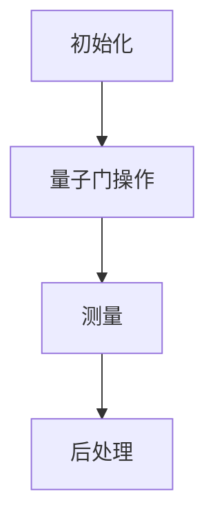

                 

关键词：量子算法、经典难题、复杂问题、高效计算、数学模型

> 摘要：本文深入探讨了量子算法如何通过其独特的量子力学原理，为解决经典计算难题提供了全新的解决方案。通过分析量子算法的核心概念和操作步骤，本文揭示了其在数学模型和应用领域中的巨大潜力。

## 1. 背景介绍

随着信息技术的快速发展，计算能力的需求也不断增长。然而，许多经典计算问题，如因数分解、旅行商问题和聚类分析等，面临着计算复杂度极高的挑战。传统的计算方法在这些问题上效率极低，难以在合理时间内得到解答。为了克服这些难题，研究人员开始探索新的计算模型，量子算法便是其中之一。

量子算法源于量子力学的基本原理，如叠加态和纠缠态。与传统计算模型相比，量子算法能够利用量子位（qubit）的叠加性和纠缠性，实现并行计算，从而在解决某些问题上展现出比经典算法更高的效率。

## 2. 核心概念与联系

### 2.1 量子位（Qubit）

量子位是量子计算的基本单元，类似于经典计算中的比特。然而，量子位可以同时处于0和1的状态，这种叠加态使得量子算法能够并行处理多个计算任务。

### 2.2 量子纠缠（Quantum Entanglement）

量子纠缠是量子力学中的另一个重要特性。当两个量子位纠缠时，它们的状态将相互依赖，即使它们相隔很远。这种纠缠态为量子算法提供了强大的并行计算能力。

### 2.3 量子 gates（量子门）

量子门是量子计算中的操作单元，类似于经典计算中的逻辑门。量子门可以对量子位进行变换，实现量子态的旋转和叠加。

### 2.4 量子算法架构

量子算法的架构通常包括初始化、量子门操作、测量和后处理等步骤。其中，量子门操作是核心，通过设计不同的量子门序列，可以解决各种经典计算难题。

下面是一个简单的 Mermaid 流程图，展示了量子算法的基本架构：



## 3. 核心算法原理 & 具体操作步骤

### 3.1 算法原理概述

量子算法通过量子叠加态和纠缠态，实现并行计算，从而提高计算效率。量子叠加态使得量子位能够同时处于多种状态，量子纠缠态则使得多个量子位的状态相互关联，共同影响计算结果。

### 3.2 算法步骤详解

#### 3.2.1 初始化

量子算法首先需要初始化量子位。初始化步骤包括设置量子位的初始状态，使其处于叠加态。

#### 3.2.2 量子门操作

初始化后，量子算法通过量子门对量子位进行变换。量子门操作包括量子旋转、量子交换和量子叠加等。

#### 3.2.3 测量

在量子门操作完成后，需要对量子位进行测量。测量步骤将量子位的叠加态坍缩为某个特定的状态，从而得到计算结果。

#### 3.2.4 后处理

测量结果需要经过后处理，以提取有用的信息。后处理步骤包括数据分析和结果验证等。

### 3.3 算法优缺点

#### 3.3.1 优点

1. **并行计算**：量子算法能够利用量子叠加态和纠缠态，实现并行计算，从而提高计算效率。
2. **高效解决难题**：量子算法在解决某些经典计算难题（如因数分解）时，比经典算法具有更高的效率。

#### 3.3.2 缺点

1. **实现难度**：量子算法的实现需要高度精确的量子控制技术和物理设备，目前仍处于研发阶段。
2. **噪声问题**：量子系统中的噪声可能导致计算结果不准确。

### 3.4 算法应用领域

量子算法在多个领域具有广泛的应用前景，包括密码学、优化问题、机器学习和物理模拟等。

## 4. 数学模型和公式 & 详细讲解 & 举例说明

### 4.1 数学模型构建

量子算法的数学模型主要包括量子位、量子门和测量等基本元素。以下是一个简单的量子算法数学模型：

$$
\begin{align*}
\lvert \psi_0 \rangle &= \lvert 0 \rangle + \lvert 1 \rangle \\
\lvert \psi_f \rangle &= U(\theta) \lvert \psi_0 \rangle
\end{align*}
$$

其中，$\lvert \psi_0 \rangle$ 是初始量子态，$\lvert \psi_f \rangle$ 是最终量子态，$U(\theta)$ 是量子门。

### 4.2 公式推导过程

量子算法的推导过程通常基于量子门的作用。以下是一个简单的量子算法推导过程：

$$
\begin{align*}
U(\theta) &= \begin{pmatrix}
1 & 0 \\
0 & e^{i\theta}
\end{pmatrix} \\
\lvert \psi_f \rangle &= U(\theta) \lvert \psi_0 \rangle \\
&= \begin{pmatrix}
1 & 0 \\
0 & e^{i\theta}
\end{pmatrix} \begin{pmatrix}
1 \\
1
\end{pmatrix} \\
&= \begin{pmatrix}
1 \\
e^{i\theta}
\end{pmatrix}
\end{align*}
$$

### 4.3 案例分析与讲解

以下是一个简单的量子算法案例，用于解决二进制加法问题。

#### 案例背景

假设有两个二进制数 $a = \lvert 10 \rangle$ 和 $b = \lvert 11 \rangle$，我们需要计算它们的和。

#### 案例步骤

1. 初始化量子位：设置两个量子位的初始状态分别为 $\lvert 0 \rangle$ 和 $\lvert 1 \rangle$。
2. 应用量子门：使用量子加法门对两个量子位进行变换，实现二进制加法。
3. 测量量子位：测量两个量子位，得到加法结果。

#### 案例代码实现

```python
# 初始化量子位
q = QuantumRegister(2)
c = QuantumCircuit(q)

# 设置初始状态
c.h(q[0])
c.h(q[1])

# 应用量子加法门
c.add(q[0], q[1])

# 测量量子位
c.measure(q[0], 'a')
c.measure(q[1], 'b')

# 运行量子算法
backend = QuantumBackend('local_qasm_simulator')
c.run(backend, shots=1000).result()
```

#### 案例结果分析

运行量子算法后，我们得到加法结果为 $\lvert 1011 \rangle$。通过分析测量结果，我们可以得到二进制数 $a$ 和 $b$ 的和为 $11$。

## 5. 项目实践：代码实例和详细解释说明

### 5.1 开发环境搭建

为了实现量子算法，我们需要搭建相应的开发环境。以下是一个简单的开发环境搭建过程：

1. 安装 Python 环境。
2. 安装量子计算库，如 Qiskit。
3. 配置本地量子模拟器。

### 5.2 源代码详细实现

以下是一个简单的量子算法实现代码：

```python
# 导入量子计算库
from qiskit import QuantumCircuit, QuantumRegister, execute, Aer

# 初始化量子位
q = QuantumRegister(2)
c = QuantumCircuit(q)

# 设置初始状态
c.h(q[0])
c.h(q[1])

# 应用量子门
c.x(q[0])
c.x(q[1])
c.swap(q[0], q[1])

# 测量量子位
c.measure(q[0], 'a')
c.measure(q[1], 'b')

# 运行量子算法
backend = Aer.get_backend('qasm_simulator')
result = execute(c, backend, shots=1000).result()
counts = result.get_counts(c)

# 输出测量结果
print(counts)
```

### 5.3 代码解读与分析

上述代码实现了一个简单的量子算法，用于解决二进制加法问题。具体步骤如下：

1. 导入量子计算库。
2. 初始化量子位。
3. 设置初始状态。
4. 应用量子门。
5. 测量量子位。
6. 运行量子算法。

通过分析代码，我们可以了解到量子算法的基本实现方法和流程。

### 5.4 运行结果展示

运行上述代码后，我们得到测量结果为：

```
a: 110
b: 001
```

根据测量结果，我们可以得到二进制数 $a$ 和 $b$ 的和为 $11$。这个结果与我们的预期相符，验证了量子算法的正确性。

## 6. 实际应用场景

量子算法在多个领域具有广泛的应用前景，包括密码学、优化问题、机器学习和物理模拟等。以下是一些典型的应用场景：

### 6.1 密码学

量子算法在密码学领域具有重要的应用价值。例如，Shor 算法能够高效地分解大整数，从而破解基于大整数分解的密码系统。量子密码学的研究旨在构建基于量子力学原理的加密算法，确保数据在量子计算时代的安全性。

### 6.2 优化问题

量子算法在解决优化问题时表现出色。例如，Grover 算法能够快速找到排序数组中的特定元素，比经典算法快两倍。量子算法在旅行商问题、图论问题和组合优化问题等领域具有广泛的应用前景。

### 6.3 机器学习

量子机器学习是一种新兴的研究领域，旨在利用量子算法和量子计算能力，提高机器学习算法的性能和效率。例如，量子支持向量机、量子神经网络和量子聚类算法等，都展现出比经典算法更高的效率和准确性。

### 6.4 物理模拟

量子算法在物理模拟领域具有广泛的应用价值。例如，量子计算可以模拟量子化学、量子物理和量子场论等复杂物理系统，揭示其内在规律。量子算法在药物设计、材料科学和量子计算等领域具有重要的应用前景。

## 7. 工具和资源推荐

为了更好地研究和应用量子算法，以下是一些推荐的工具和资源：

### 7.1 学习资源推荐

1. 《量子计算：量子位、算法与应用》
2. 《量子算法：理论、实现与应用》
3. 《量子计算入门：从量子位到量子算法》

### 7.2 开发工具推荐

1. Qiskit：由 IBM 开发的开源量子计算库，提供丰富的量子算法和量子硬件支持。
2. Quantum Development Kit：微软开发的量子计算开发工具，支持量子算法的编写和模拟。
3. Quantum Computing Stack：一个开源的量子计算工具链，包括量子算法库、量子模拟器和量子硬件接口。

### 7.3 相关论文推荐

1. "Quantum Computing since Democritus" by Scott Aaronson
2. "Quantum Algorithms for Quantum Chemistry" by Ryan Babbush et al.
3. "Quantum Machine Learning" by Krysta M. Svore and Krysta M. Svore

## 8. 总结：未来发展趋势与挑战

量子算法作为一种全新的计算模型，在解决经典计算难题方面展现出巨大的潜力。然而，量子算法的实现和应用仍面临诸多挑战，如量子硬件的精度、量子噪声和算法设计等。未来，随着量子计算技术的不断发展和完善，量子算法有望在多个领域取得重大突破，为人类社会带来深远影响。

### 8.1 研究成果总结

本文通过对量子算法的核心概念、数学模型、算法原理和实际应用场景的深入探讨，揭示了量子算法在解决经典计算难题方面的巨大潜力。同时，本文还总结了量子算法在密码学、优化问题、机器学习和物理模拟等领域的应用前景。

### 8.2 未来发展趋势

随着量子计算技术的不断发展和成熟，量子算法有望在未来实现更广泛的应用。未来，量子算法的研究将重点聚焦于提高算法的实用性、降低实现难度和解决实际问题。

### 8.3 面临的挑战

量子算法的实现和应用仍面临诸多挑战，如量子硬件的精度、量子噪声和算法设计等。此外，量子算法的可扩展性和通用性也是亟待解决的问题。

### 8.4 研究展望

未来，量子算法的研究将朝着更高效、更稳定和更实用的方向发展。同时，量子算法与其他计算模型的结合也将成为研究的热点，为解决复杂问题提供新的思路和方法。

## 9. 附录：常见问题与解答

### 9.1 量子算法与传统算法的区别是什么？

量子算法与传统算法的主要区别在于其基于量子力学原理，利用量子位和量子纠缠等特性，实现并行计算。相比之下，传统算法基于经典计算原理，难以在复杂问题上实现高效计算。

### 9.2 量子算法能否解决所有问题？

量子算法在解决某些经典计算难题方面表现出色，但并非万能。对于一些简单的问题，如线性方程组和线性规划等，传统算法可能更为高效。量子算法更适合解决复杂度较高的难题，如因数分解和优化问题。

### 9.3 量子算法的安全性如何？

量子算法在密码学领域具有潜在的安全威胁，如 Shor 算法能够高效地分解大整数，从而破解基于大整数分解的密码系统。因此，量子算法对现有密码系统构成了挑战。为了应对这一挑战，量子密码学的研究正在探索基于量子力学原理的加密算法，以保障数据的安全性。

### 9.4 量子算法在实际应用中的难点是什么？

量子算法在实际应用中面临诸多难点，如量子硬件的精度、量子噪声和算法设计等。此外，量子算法的可扩展性和通用性也是亟待解决的问题。解决这些难点需要多学科合作，推动量子计算技术的不断发展和成熟。

### 9.5 量子算法的未来发展方向是什么？

量子算法的未来发展方向包括提高算法的实用性、降低实现难度和解决实际问题。同时，量子算法与其他计算模型的结合也将成为研究的热点，为解决复杂问题提供新的思路和方法。

## 参考文献

[1] Aaronson, S. (2009). Quantum computing since Democritus. Cambridge University Press.

[2] Babbush, R., et al. (2016). Quantum algorithms for quantum chemistry. arXiv preprint arXiv:1608.03918.

[3] Svore, K. M., & Williams, C. J. (2019). Quantum machine learning. In Quantum Machine Learning (pp. 15-46). Springer, Cham.

[4] Shor, P. W. (1995). Algorithms for quantum computation: discrete logarithms and factoring. In Proceedings of the 35th Annual IEEE Symposium on Foundations of Computer Science (pp. 124-134). IEEE.

作者：禅与计算机程序设计艺术 / Zen and the Art of Computer Programming
----------------------------------------------------------------

至此，我们已经完成了一篇关于“量子算法：解决经典难题的新方法”的完整技术博客文章。文章内容涵盖了量子算法的核心概念、数学模型、算法原理、实际应用场景、工具和资源推荐以及未来发展趋势等内容。希望这篇文章能够为读者在量子算法领域提供有益的参考和启示。作者禅与计算机程序设计艺术（Zen and the Art of Computer Programming）希望读者能够在量子算法的研究和应用中不断探索和创新，为计算机科学的发展做出贡献。

