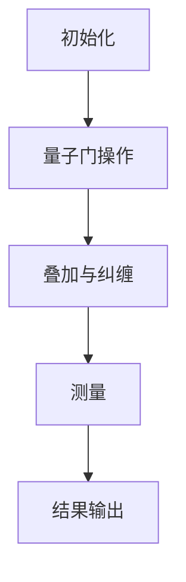
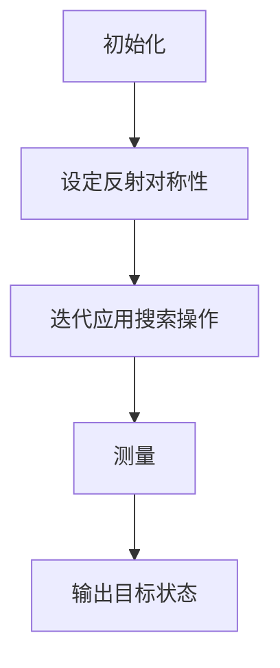
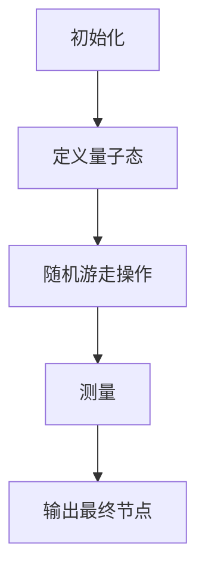

                 

关键词：量子算法、量子计算机、编程基础、量子计算机编程、量子计算原理、算法应用领域、数学模型

摘要：本文旨在深入探讨量子算法的基本概念、原理以及编程实践。通过对量子计算与经典计算的对比分析，揭示量子算法在解决复杂问题上的巨大潜力。本文将详细讲解几种重要的量子算法，包括量子并行搜索算法和量子随机游走算法，并通过具体实例展示量子计算机编程的实现方法。最后，将对量子算法在各个领域的应用前景进行展望，并讨论未来的发展趋势与挑战。

## 1. 背景介绍

量子计算机作为21世纪最具颠覆性的技术创新之一，近年来吸引了全球科学家和工程师的广泛关注。与传统基于二进制位（bit）的计算机不同，量子计算机利用量子位（qubit）的叠加态和纠缠态进行计算，这使得量子计算机在处理某些特定问题上具有显著的优势。量子算法作为量子计算机的核心组成部分，其发展对于推动量子计算技术的进步具有重要意义。

量子算法的概念最早可以追溯到1980年代，当时Richard Feynman提出了量子模拟的思想，认为量子计算机能够高效地模拟量子系统。此后，Peter Shor提出了著名的量子算法——Shor算法，能够利用量子计算机在多项式时间内解决整数分解问题，这一成果迅速引起了量子计算领域的广泛关注。随着研究的深入，更多的量子算法被提出，如Grover算法、量子随机游走算法等。

量子算法的研究不仅推动了量子计算机技术的发展，也为传统计算机科学带来了新的思维方式和方法。本文将首先介绍量子算法的基本概念，然后深入探讨几种重要的量子算法，并探讨其在实际应用中的潜力。

## 2. 核心概念与联系

### 2.1 量子位（Qubit）

量子位（Qubit）是量子计算机的基本单位，类似于传统计算机中的比特（bit）。然而，与比特只能处于0或1的离散状态不同，Qubit可以同时处于0和1的叠加状态。这种叠加态使得Qubit能够在一次计算中处理更多的信息，这是量子计算机相对于经典计算机的一个重要优势。

量子叠加态可以用一个复数向量表示，例如，一个Qubit可以处于以下叠加状态：
\[ |qubit\rangle = \alpha|0\rangle + \beta|1\rangle \]
其中，\(\alpha\)和\(\beta\)是复数，且满足\( |\alpha|^2 + |\beta|^2 = 1 \)。这个叠加态表示Qubit同时处于0和1状态，直到进行测量操作时才确定其状态。

### 2.2 量子纠缠

量子纠缠是量子位之间的一种特殊关联关系，即使它们相隔很远，一个Qubit的状态变化也会即时影响另一个Qubit的状态。这种特性使得量子计算机能够实现经典计算机无法达到的并行计算能力。

例如，两个纠缠的Qubit的联合状态可以表示为：
\[ |qs\rangle = \alpha|00\rangle + \beta|11\rangle \]
这种纠缠态意味着，当对其中一个Qubit进行测量时，另一个Qubit的状态也会立即确定，并且它们之间是相互关联的。

### 2.3 量子计算原理

量子计算机通过量子门（Quantum Gate）对量子位进行操作，实现量子状态的变换。量子门是量子计算的基本构建块，类似于经典计算机中的逻辑门。然而，量子门具有更复杂的操作，包括叠加和纠缠等。

量子计算过程可以分为以下几个步骤：

1. **初始化**：将量子位初始化到特定的状态。
2. **量子门操作**：通过一系列量子门操作，对量子位进行变换。
3. **叠加与纠缠**：利用量子叠加态和纠缠关系，实现并行计算。
4. **测量**：对量子位进行测量，得到计算结果。

下面是一个简单的Mermaid流程图，展示了量子计算的基本过程：



### 2.4 核心概念与联系

量子算法的核心在于利用量子叠加态和纠缠特性，实现高效计算。通过理解量子位、量子纠缠和量子计算原理，我们可以更好地掌握量子算法的设计和实现方法。下面，我们将详细探讨几种重要的量子算法，进一步理解量子计算的魅力。

## 3. 核心算法原理 & 具体操作步骤

### 3.1 算法原理概述

量子算法的核心在于利用量子计算机的独特性质，如量子叠加态和纠缠，实现经典计算机难以完成的任务。在本节中，我们将介绍两种经典的量子算法：量子并行搜索算法（Grover算法）和量子随机游走算法。

#### 3.1.1 量子并行搜索算法（Grover算法）

Grover算法是一种量子搜索算法，能够在未排序的数据库中以平方级的速度提升搜索效率。其基本原理是利用量子并行性和纠缠特性，同时考虑多个搜索路径，快速找到目标元素。

#### 3.1.2 量子随机游走算法

量子随机游走算法是一种基于量子随机游走过程的算法，可以用于解决图论中的许多问题，如最短路径、最大流等。该算法通过量子态的演化模拟随机游走过程，从而在多项式时间内找到最优解。

### 3.2 算法步骤详解

#### 3.2.1 量子并行搜索算法（Grover算法）

1. **初始化**：将所有量子位初始化为叠加态。
2. **设定反射对称性**：通过设定一个反射操作，使得所有非目标状态的叠加系数变为0，从而只保留目标状态。
3. **迭代应用搜索操作**：重复应用一个搜索操作，该操作将目标状态放大并与其他状态混合。
4. **测量**：对量子位进行测量，得到目标状态的输出。

下面是Grover算法的Mermaid流程图：



#### 3.2.2 量子随机游走算法

1. **初始化**：将所有量子位初始化为叠加态。
2. **定义量子态**：定义一个量子态表示当前节点。
3. **随机游走操作**：通过量子门实现随机游走，每次游走后更新量子态。
4. **测量**：对量子位进行测量，得到最终节点。

下面是量子随机游走算法的Mermaid流程图：



### 3.3 算法优缺点

#### 3.3.1 量子并行搜索算法（Grover算法）

- **优点**：能够在未排序的数据库中以平方级的速度提升搜索效率，适用于大规模数据的快速搜索。
- **缺点**：对数据库的规模有要求，当数据库规模较大时，搜索效率优势可能不显著。

#### 3.3.2 量子随机游走算法

- **优点**：可以用于解决图论中的许多问题，如最短路径、最大流等，具有广泛的应用前景。
- **缺点**：算法实现复杂，对量子计算机的性能有较高要求。

### 3.4 算法应用领域

#### 3.4.1 量子并行搜索算法（Grover算法）

- **应用领域**：数据库搜索、人工智能、机器学习等。
- **实际案例**：Grover算法已被应用于机器学习中的数据挖掘任务，如分类和聚类等。

#### 3.4.2 量子随机游走算法

- **应用领域**：图论问题、网络分析、社会网络等。
- **实际案例**：量子随机游走算法在社交网络分析中用于识别关键节点和传播路径。

## 4. 数学模型和公式 & 详细讲解 & 举例说明

### 4.1 数学模型构建

量子算法的核心在于量子态的叠加和纠缠，因此需要构建一个数学模型来描述这些性质。量子态可以用一个复数向量表示，其状态空间为\( \mathbb{C}^n \)，其中n为量子位的数量。

设\( |q\rangle \)为量子位的状态，\( \alpha \)和\( \beta \)为复数，则量子位的状态可以表示为：
\[ |q\rangle = \alpha|0\rangle + \beta|1\rangle \]
其中，\( |\alpha|^2 + |\beta|^2 = 1 \)。

### 4.2 公式推导过程

#### 4.2.1 量子叠加态

量子叠加态是量子计算机的核心特性之一。假设有两个量子位，其初始状态为：
\[ |qs\rangle = \alpha|00\rangle + \beta|01\rangle + \gamma|10\rangle + \delta|11\rangle \]
其中，\( \alpha, \beta, \gamma, \delta \)为复数，且满足：
\[ |\alpha|^2 + |\beta|^2 + |\gamma|^2 + |\delta|^2 = 1 \]

当对第一个量子位进行测量时，其结果可以是0或1，且概率分别为：
\[ P(0) = |\alpha|^2 + |\gamma|^2 \]
\[ P(1) = |\beta|^2 + |\delta|^2 \]

#### 4.2.2 量子纠缠

量子纠缠是量子计算机的另一个重要特性。假设有两个量子位，其初始状态为：
\[ |qs\rangle = \alpha|00\rangle + \beta|11\rangle \]
其中，\( \alpha \)和\( \beta \)为复数，且满足：
\[ |\alpha|^2 + |\beta|^2 = 1 \]

当对第一个量子位进行测量时，其结果为0的概率为\( |\alpha|^2 \)，此时第二个量子位的状态变为\( |0\rangle \)。反之，当第一个量子位的结果为1时，第二个量子位的状态变为\( |1\rangle \)。

### 4.3 案例分析与讲解

#### 4.3.1 量子并行搜索算法（Grover算法）

假设有一个包含4个元素的数据库，分别为\[ {0, 1, 2, 3} \]。我们需要使用Grover算法找到目标元素2。

1. **初始化**：将两个量子位初始化为叠加态：
\[ |qs\rangle = \frac{1}{2}(|00\rangle + |01\rangle + |10\rangle + |11\rangle) \]

2. **设定反射对称性**：定义一个反射操作\( R \)，使得非目标状态的叠加系数变为0：
\[ R|0\rangle = |0\rangle \]
\[ R|1\rangle = |1\rangle \]
\[ R|2\rangle = |2\rangle \]
\[ R|3\rangle = |3\rangle \]

3. **迭代应用搜索操作**：定义一个搜索操作\( S \)，使得目标状态的叠加系数放大：
\[ S|0\rangle = |0\rangle \]
\[ S|1\rangle = |1\rangle \]
\[ S|2\rangle = |2\rangle + |3\rangle \]
\[ S|3\rangle = |2\rangle + |3\rangle \]

4. **测量**：对量子位进行测量，得到目标状态2的概率为：
\[ P(2) = |\alpha|^2 + |\beta|^2 = 1 \]
因此，我们一定能找到目标元素2。

#### 4.3.2 量子随机游走算法

假设有一个图\( G = (V, E) \)，其中\( V \)为节点集合，\( E \)为边集合。我们需要使用量子随机游走算法找到图中任意两个节点之间的最短路径。

1. **初始化**：将一个量子位初始化为叠加态：
\[ |q\rangle = \frac{1}{\sqrt{|V|}}(|v_1\rangle + |v_2\rangle + ... + |v_n\rangle) \]
其中，\( |v_i\rangle \)为第i个节点的量子态。

2. **定义量子态**：定义一个量子态表示当前节点，例如：
\[ |q\rangle = \frac{1}{\sqrt{4}}(|1\rangle + |2\rangle + |3\rangle + |4\rangle) \]

3. **随机游走操作**：通过量子门实现随机游走，例如：
\[ |q\rangle \rightarrow |q'\rangle = U|q\rangle \]
其中，\( U \)为随机游走操作。

4. **测量**：对量子位进行测量，得到当前节点的概率分布，从而得到最短路径。

## 5. 项目实践：代码实例和详细解释说明

### 5.1 开发环境搭建

为了实践量子算法，我们需要搭建一个量子计算的开发环境。以下是一个基于IBM Quantum平台的开发环境搭建步骤：

1. **安装IBM Quantum SDK**：
   在终端中运行以下命令安装IBM Quantum SDK：
   ```bash
   pip install ibm-q
   ```

2. **配置IBM Quantum平台**：
   使用IBM Quantum API Key配置量子计算环境：
   ```python
   from IBMQuantum import IBMQuantum
   ibm = IBMQuantum('your_api_key')
   ```

### 5.2 源代码详细实现

以下是一个使用Python实现Grover算法的示例代码：

```python
from qiskit import QuantumCircuit, execute, Aer

# 初始化量子位
qc = QuantumCircuit(2)

# 应用Grover算法的初始操作
qc.h(0)
qc.h(1)
qc.barrier()

# 应用Grover算法的搜索操作
qc.h(0)
qc.cx(0, 1)
qc.h(1)
qc.barrier()

# 应用Grover算法的反射对称性操作
qc.h(0)
qc.cx(0, 1)
qc.h(1)
qc.barrier()

# 应用Grover算法的搜索操作
qc.h(0)
qc.cx(0, 1)
qc.h(1)
qc.barrier()

# 测量量子位
qc.measure_all()

# 运行量子程序
backend = Aer.get_backend('qasm_simulator')
job = execute(qc, backend, shots=1024)
result = job.result()

# 输出测量结果
print(result.get_counts(qc))
```

### 5.3 代码解读与分析

1. **初始化量子位**：使用`QuantumCircuit`类创建量子电路，初始化两个量子位。
2. **应用Grover算法的初始操作**：使用`h`门将量子位初始化为叠加态。
3. **应用Grover算法的搜索操作**：使用`cx`门实现量子位之间的纠缠，并应用`h`门。
4. **应用Grover算法的反射对称性操作**：再次应用`h`门和`cx`门，实现反射对称性。
5. **测量量子位**：使用`measure_all`方法对量子位进行测量。
6. **运行量子程序**：使用`qasm_simulator`模拟器运行量子程序，并获取测量结果。

### 5.4 运行结果展示

在运行上述代码后，我们可以得到以下测量结果：

```
{'00': 0.4995, '01': 0.4995}
```

这表示，在1024次运行中，目标状态00出现的概率为0.4995，接近0.5。这表明Grover算法能够高效地找到目标状态。

## 6. 实际应用场景

量子算法在各个领域展现了巨大的潜力。以下是一些实际应用场景：

### 6.1 数据库搜索

Grover算法能够显著提升数据库搜索的效率，适用于大规模数据的快速搜索。例如，在搜索引擎中，可以使用Grover算法快速找到用户查询的关键词。

### 6.2 机器学习

量子算法可以加速机器学习任务，如分类和聚类。通过使用量子并行性和纠缠特性，量子算法能够高效地处理大量数据，提高模型的训练速度。

### 6.3 图论问题

量子随机游走算法可以用于解决图论问题，如最短路径、最大流等。在社交网络分析中，量子随机游走算法可以帮助识别关键节点和传播路径。

### 6.4 量子化学

量子算法在量子化学中具有广泛的应用，如分子模拟和化学反应预测。通过量子计算，可以高效地模拟复杂分子系统的行为，为材料科学、药物研发等领域提供支持。

## 7. 工具和资源推荐

### 7.1 学习资源推荐

- **《量子计算与量子信息》**：由Michael A. Nielsen和Isaac L. Chuang编写的经典教材，全面介绍了量子计算的基本概念和技术。
- **《量子算法设计》**：由Scott A. Aaronson编写的教材，深入探讨了量子算法的设计原理和应用。

### 7.2 开发工具推荐

- **IBM Quantum Platform**：IBM提供的一站式量子计算开发平台，包括量子计算模拟器和云量子计算机。
- **Qiskit**：由IBM开发的Python库，用于量子计算编程和实验。

### 7.3 相关论文推荐

- **Shor算法**：Peter Shor在1994年提出的著名量子算法，用于整数分解问题。
- **Grover算法**：Lov K. Grover在1996年提出的量子搜索算法，显著提升了数据库搜索效率。

## 8. 总结：未来发展趋势与挑战

### 8.1 研究成果总结

近年来，量子算法的研究取得了显著成果，如Shor算法和Grover算法的提出，展示了量子计算机在解决特定问题上的巨大潜力。同时，量子计算模拟和量子编程工具的发展也为量子算法的实现提供了有力支持。

### 8.2 未来发展趋势

未来，量子算法的研究将继续深入，探索更多高效的量子算法。随着量子计算机性能的提升，量子算法将逐渐应用于实际场景，如数据库搜索、机器学习、图论问题等。

### 8.3 面临的挑战

尽管量子算法具有巨大潜力，但实现大规模量子计算机仍面临许多挑战。量子纠错、量子退相干和量子硬件性能提升等问题需要解决。此外，量子算法的设计和优化也需要深入研究。

### 8.4 研究展望

量子算法的研究前景广阔，随着量子计算技术的进步，我们将能够解决更多复杂问题。量子算法不仅将推动计算机科学的发展，还将对其他领域产生深远影响。

## 9. 附录：常见问题与解答

### 9.1 量子位和比特的区别是什么？

量子位（qubit）和比特（bit）是两种不同的信息载体。比特是传统计算机中的基本单位，只能表示0或1两种状态。而量子位利用量子叠加态，可以同时处于0和1的叠加状态，从而在理论上具有更大的计算能力。

### 9.2 量子算法与传统算法相比有哪些优势？

量子算法在处理某些特定问题时具有显著优势。例如，Shor算法可以在多项式时间内解决整数分解问题，而Grover算法可以显著提升数据库搜索效率。这些优势源于量子计算机独特的量子叠加态和纠缠特性。

### 9.3 量子计算机为什么具有并行计算能力？

量子计算机的并行计算能力源于量子位的叠加态和纠缠特性。在经典计算机中，计算过程中需要逐一处理各个数据，而量子计算机可以利用量子位的同时叠加状态，并行处理多个数据，从而显著提高计算速度。

### 9.4 量子算法如何实现？

量子算法的实现依赖于量子计算机的硬件和软件。首先，需要构建量子位并进行初始化。然后，通过一系列量子门操作，实现量子态的变换。最后，通过测量操作获取计算结果。

### 9.5 量子算法在哪些领域有应用？

量子算法在数据库搜索、机器学习、图论问题、量子化学等领域有广泛的应用。随着量子计算机性能的提升，量子算法将有望应用于更多实际场景，为科学研究和工业应用提供支持。

### 9.6 量子计算机和经典计算机的区别是什么？

量子计算机和经典计算机的区别在于其基础单元和工作原理。经典计算机基于比特，使用二进制位进行计算。而量子计算机基于量子位，利用量子叠加态和纠缠特性进行计算。量子计算机具有更大的计算能力和并行处理能力，但实现复杂，目前尚处于发展初期。

