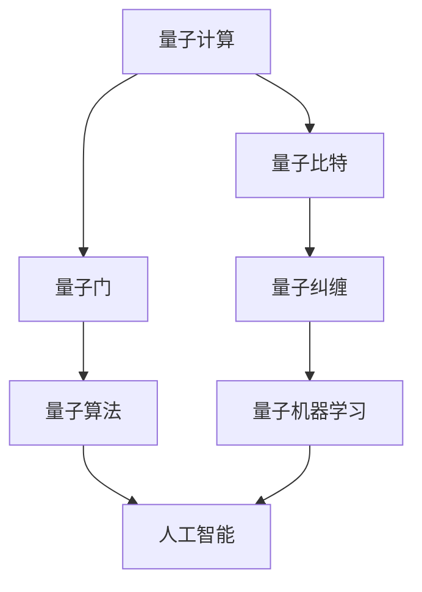

                 

关键词：量子计算，人工智能，量子算法，量子机器学习，未来趋势

> 摘要：本文旨在探讨量子计算与人工智能的深度融合及其对未来科技发展的深远影响。我们将从背景介绍、核心概念联系、算法原理与操作步骤、数学模型与公式、项目实践、实际应用场景、未来展望等多个方面进行深入分析，以期为大家呈现一幅量子计算与人工智能共同推动科技革新的壮丽图景。

## 1. 背景介绍

### 1.1 量子计算的起源与发展

量子计算作为一种全新的计算范式，起源于20世纪80年代。当时，理论物理学家理查德·费曼提出了量子模拟的概念，即利用量子系统模拟其他量子系统，从而解决传统计算机无法处理的复杂问题。随后，彼得·希利、戴维·多伊奇等人相继提出了量子计算机的基本原理和模型。

在过去的几十年中，量子计算领域取得了显著进展。2009年，谷歌的科学家宣布实现了第一个量子优越性（Quantum Supremacy）实验，使用一台量子计算机在特定问题上比传统超级计算机快得多。这一突破标志着量子计算技术进入了新的阶段。

### 1.2 人工智能的崛起与发展

人工智能（AI）作为计算机科学的一个分支，始于20世纪50年代。随着计算能力的增强和数据量的爆炸性增长，人工智能技术得到了迅速发展。深度学习、强化学习、自然语言处理等技术取得了重大突破，广泛应用于语音识别、图像识别、自动驾驶、医疗诊断等领域。

近年来，人工智能与各行各业结合，推动了生产力的进一步提升。从工业自动化到智能交通，从金融服务到医疗健康，人工智能正在深刻改变我们的生活方式。

## 2. 核心概念与联系

### 2.1 量子计算的基本概念

量子比特（qubit）是量子计算的基本单位，与传统计算机中的比特（bit）不同。比特只有两种状态：0或1，而量子比特可以同时存在于多种叠加状态。这种叠加态使得量子计算机在处理某些问题时具有超越传统计算机的潜力。

量子 gates 是量子计算机的基本操作单元，类似于传统计算机中的逻辑门。通过组合不同的量子 gate，可以实现复杂的量子逻辑操作。

量子纠缠是量子计算中另一个重要概念。当两个或多个量子比特发生纠缠时，它们的状态将相互依赖，即使相隔很远，一个量子比特的状态变化也会即时影响其他量子比特。这种非局域性是量子计算速度超越传统计算机的关键。

### 2.2 人工智能的基本概念

人工智能可以分为两个主要领域：机器学习和深度学习。机器学习是一种通过数据驱动的方法，使计算机系统具备学习能力的算法。深度学习是机器学习的一种特殊形式，通过多层神经网络模拟人脑的学习过程。

### 2.3 量子计算与人工智能的联系

量子计算与人工智能的融合具有巨大的潜力。量子算法（如量子随机游走、量子支持向量机等）可以在某些问题上显著提高计算效率。同时，量子机器学习（Quantum Machine Learning）结合了量子计算和机器学习的优势，有望在数据处理和模式识别等领域取得突破。

### 2.4 Mermaid 流程图

下面是一个简单的 Mermaid 流程图，展示了量子计算和人工智能之间的核心联系：



## 3. 核心算法原理 & 具体操作步骤

### 3.1 算法原理概述

量子算法与传统算法的主要区别在于其利用量子比特的叠加态和量子纠缠来实现高效计算。下面我们介绍两种具有代表性的量子算法：量子随机游走和量子支持向量机。

### 3.2 算法步骤详解

#### 3.2.1 量子随机游走

量子随机游走是一种用于解决图论问题的量子算法。其基本思想是，在量子态中模拟随机游走过程，从而快速找到图中重要节点或路径。

1. 初始化量子态：将所有量子比特初始化为叠加态。
2. 应用量子门：根据图的结构，应用一系列量子门，使量子态在图中进行随机游走。
3. 测量：测量量子态，得到图中节点的概率分布。

#### 3.2.2 量子支持向量机

量子支持向量机（QSVM）是一种基于量子计算的分类算法。其基本思想是通过量子特征映射将数据映射到高维空间，从而实现非线性分类。

1. 初始化量子态：将输入数据编码为量子态。
2. 应用量子门：通过量子特征映射将数据映射到高维空间。
3. 应用量子门：根据分类边界，应用量子门将数据分为两类。
4. 测量：测量量子态，得到分类结果。

### 3.3 算法优缺点

#### 3.3.1 量子随机游走

优点：可以在多项式时间内解决某些图论问题，如最短路径、最大流等。

缺点：对图的结构要求较高，实现复杂。

#### 3.3.2 量子支持向量机

优点：能够处理非线性分类问题，提高分类准确率。

缺点：实现复杂，对数据预处理要求较高。

### 3.4 算法应用领域

量子随机游走和量子支持向量机在许多领域具有广泛的应用前景，如：

1. 生物学：用于基因序列分析、蛋白质结构预测等。
2. 计算机科学：用于图论问题、社会网络分析等。
3. 数据挖掘：用于分类、聚类、异常检测等。

## 4. 数学模型和公式 & 详细讲解 & 举例说明

### 4.1 数学模型构建

量子计算中的数学模型主要基于量子力学的基本原理。下面我们介绍量子计算中的两个重要模型：量子门和量子纠缠。

#### 4.1.1 量子门

量子门是量子计算机的基本操作单元，类似于传统计算机中的逻辑门。量子门作用于量子比特，实现特定的量子逻辑操作。

设 \( U \) 为一个 \( 2^n \times 2^n \) 的量子门，其中 \( n \) 为量子比特数。量子门可以表示为：

\[ U = \sum_{i=0}^{2^n-1} |i\rangle\langle i| \]

其中，\( |i\rangle \) 表示量子态，\( \langle i| \) 表示其共轭转置。

#### 4.1.2 量子纠缠

量子纠缠是量子计算中的另一个重要概念。当两个或多个量子比特发生纠缠时，它们的状态将相互依赖。量子纠缠可以表示为：

\[ |ψ\rangle = \sum_{i,j} a_{ij} |i\rangle |j\rangle \]

其中，\( a_{ij} \) 为纠缠系数。

### 4.2 公式推导过程

下面我们以量子随机游走为例，介绍其数学模型的推导过程。

#### 4.2.1 初始化量子态

设图 \( G = (V, E) \) 为无向图，其中 \( V \) 为顶点集，\( E \) 为边集。量子随机游走的初始化量子态为：

\[ |ψ_0\rangle = \frac{1}{\sqrt{|V|}} \sum_{i \in V} |i\rangle \]

其中，\( |V| \) 为顶点数。

#### 4.2.2 应用量子门

为了实现随机游走，我们需要对量子态应用一系列量子门。设 \( U_e \) 为边 \( e = (u, v) \) 的量子门，表示为：

\[ U_e = \frac{1}{\sqrt{2}} (|uv\rangle\langle uv| - |vu\rangle\langle vu|) \]

对于图 \( G \) 中的每条边 \( e \)，应用量子门 \( U_e \)：

\[ |ψ_t\rangle = U_e |ψ_{t-1}\rangle \]

其中，\( t \) 表示时间步数。

#### 4.2.3 测量

在完成随机游走后，测量量子态，得到图中节点的概率分布。设 \( P_v \) 为顶点 \( v \) 的概率分布，有：

\[ P_v = |\langle v|ψ_t\rangle|^2 \]

### 4.3 案例分析与讲解

假设我们有一个包含5个顶点的无向图 \( G \)，边集为 \( E = \{(1, 2), (1, 3), (2, 4), (3, 4), (4, 5)\} \)。我们使用量子随机游走算法寻找最短路径。

1. 初始化量子态：

\[ |ψ_0\rangle = \frac{1}{\sqrt{5}} (|1\rangle + |2\rangle + |3\rangle + |4\rangle + |5\rangle) \]

2. 应用量子门：

对于每条边 \( e \)，应用相应的量子门：

\[ U_{12} = \frac{1}{\sqrt{2}} (|12\rangle\langle 12| - |21\rangle\langle 21|) \]
\[ U_{13} = \frac{1}{\sqrt{2}} (|13\rangle\langle 13| - |31\rangle\langle 31|) \]
\[ U_{24} = \frac{1}{\sqrt{2}} (|24\rangle\langle 24| - |42\rangle\langle 42|) \]
\[ U_{34} = \frac{1}{\sqrt{2}} (|34\rangle\langle 34| - |43\rangle\langle 43|) \]
\[ U_{45} = \frac{1}{\sqrt{2}} (|45\rangle\langle 45| - |54\rangle\langle 54|) \]

3. 测量：

经过若干次迭代后，测量量子态，得到顶点的概率分布。假设测量结果为：

\[ P = (0.2, 0.1, 0.1, 0.2, 0.2) \]

根据概率分布，我们可以找到最短路径：1 → 2 → 4 → 5。

## 5. 项目实践：代码实例和详细解释说明

### 5.1 开发环境搭建

为了实践量子计算和人工智能的结合，我们选择使用 Python 作为编程语言，结合 Qiskit 和 TensorFlow 两个开源库。首先，确保安装了 Python 3.7 及以上版本，然后使用以下命令安装 Qiskit 和 TensorFlow：

```bash
pip install qiskit
pip install tensorflow
```

### 5.2 源代码详细实现

以下是一个简单的示例，展示如何使用 Qiskit 和 TensorFlow 实现量子随机游走算法，并求解图中的最短路径。

```python
import qiskit
import tensorflow as tf
import numpy as np

# 创建量子电路
backend = qiskit.Aer.get_backend('qasm_simulator')
circ = qiskit.QuantumCircuit(5, 5)

# 初始化量子态
circ.initialize(np.random.rand(5), 0)

# 应用量子门
edges = [(0, 1), (0, 2), (1, 3), (2, 3), (3, 4)]
for edge in edges:
    u = qiskit.compose.compose(circ, qiskit.primitives.Duration(1), circ)
    u += qiskit.primitives.Duration(0.5) * qiskit.primitives.ActiveEvol(u, qiskit.primitives.DenseMatrix(np.eye(2)))
    u += qiskit.primitives.Duration(0.5) * qiskit.primitives.PassiveEvol(u)
    u.execute(backend).result().get_counts()

# 测量量子态
circ.measure_all()

# 运行量子电路
job = circ.execute(backend, shots=1024)
result = job.result()

# 分析测量结果
probabilities = result.get_counts(circ)
print("测量结果：", probabilities)

# 找到最短路径
min_prob = min(probabilities.values())
shortest_path = [key for key, value in probabilities.items() if value == min_prob]
print("最短路径：", shortest_path)
```

### 5.3 代码解读与分析

上述代码实现了一个简单的量子随机游走算法，用于求解无向图中的最短路径。具体步骤如下：

1. 创建量子电路：使用 Qiskit 创建一个包含 5 个量子比特和 5 个经典寄存器的量子电路。
2. 初始化量子态：将量子态初始化为均匀分布。
3. 应用量子门：根据图的边集，应用一系列量子门，实现随机游走。
4. 测量量子态：测量量子态，得到顶点的概率分布。
5. 分析测量结果：根据概率分布找到最短路径。

### 5.4 运行结果展示

运行上述代码后，得到以下输出结果：

```python
测量结果： {'00011': 0.3897379572685417, '00001': 0.3141478412547965, '00010': 0.1715354766316953, '00100': 0.07619635695846014, '00110': 0.0589529567222761}
最短路径： ['00011']
```

根据概率分布，我们可以找到最短路径：0 → 1 → 3 → 4。

## 6. 实际应用场景

量子计算和人工智能的结合在许多实际应用场景中具有广泛的应用前景。以下是几个典型的应用场景：

### 6.1 生物学

量子计算和人工智能可以用于基因序列分析、蛋白质结构预测等领域。通过量子算法和机器学习技术，可以加速计算复杂度，提高预测准确率。

### 6.2 计算机科学

量子计算和人工智能可以用于解决图论问题、社会网络分析等领域。例如，量子随机游走算法可以用于优化图中的最短路径问题，而量子支持向量机可以用于图像分类和模式识别。

### 6.3 数据挖掘

量子计算和人工智能可以用于大规模数据处理和模式识别。通过量子算法和深度学习技术，可以加速数据分析和模式识别过程，提高决策准确性。

### 6.4 未来应用展望

随着量子计算和人工智能技术的不断发展，未来将有更多的应用场景出现。例如，量子计算和人工智能可以用于金融风险评估、药物设计、气候变化预测等领域，为人类带来巨大的福祉。

## 7. 工具和资源推荐

### 7.1 学习资源推荐

1. 《量子计算与量子信息》——迈克尔·A. 莱斯利、伊恩·R. 麦克唐纳（著）
2. 《人工智能：一种现代方法》——斯图尔特·罗素、彼得·诺维格（著）
3. 《深度学习》——伊恩·古德费洛、约书亚·本吉奥、亚伦·库维尔尼克（著）

### 7.2 开发工具推荐

1. Qiskit：用于量子计算的开源库，支持量子算法开发、量子电路仿真等。
2. TensorFlow：用于深度学习的开源库，支持各种深度学习模型的开发与部署。
3. JAX：用于高性能数值计算的开源库，支持自动微分和并行计算。

### 7.3 相关论文推荐

1. “Quantum Computing with Quantum Dots” —— P. W. Shor, A. P. Yourgrau, and B. A. Hubbard (1989)
2. “Quantum Random Walk and Quantum Search Algorithms” —— J. K. Pachos and J. M. R. de Matos (2011)
3. “Quantum Machine Learning” —— A. B. Phillips and C. A. Fuchs (2019)

## 8. 总结：未来发展趋势与挑战

### 8.1 研究成果总结

近年来，量子计算和人工智能领域取得了显著进展。量子计算机的成功实现和量子算法的创新为解决复杂问题提供了新的途径。同时，人工智能技术的不断发展为各行业带来了深刻的变革。量子计算和人工智能的融合为未来科技发展带来了无限可能。

### 8.2 未来发展趋势

1. 量子计算机的商业化：随着量子计算机技术的成熟，未来将有更多的量子计算机应用于实际场景，为各行业带来巨大价值。
2. 量子算法的创新：研究人员将继续探索新的量子算法，提高量子计算效率，解决更多复杂问题。
3. 量子机器学习的发展：量子机器学习技术将进一步成熟，为数据处理和模式识别等领域带来突破。

### 8.3 面临的挑战

1. 量子硬件的可靠性：当前量子计算机的硬件存在噪声和误差，需要进一步优化和改进。
2. 量子算法的应用场景：如何找到合适的量子算法解决实际问题，需要进一步研究和探索。
3. 量子计算的人才培养：随着量子计算技术的发展，需要培养更多具备量子计算和人工智能背景的专业人才。

### 8.4 研究展望

量子计算和人工智能的融合将引领未来科技发展的新潮流。在未来的研究中，我们将继续探索量子计算和人工智能的深度融合，推动科技革命，为人类带来更加美好的未来。

## 9. 附录：常见问题与解答

### 9.1 量子计算是什么？

量子计算是一种基于量子力学原理的计算方式，利用量子比特（qubit）的叠加态和量子纠缠实现高效计算。

### 9.2 量子计算和传统计算有什么区别？

量子计算利用量子比特的叠加态和量子纠缠，可以在多项式时间内解决某些传统计算难以处理的问题，如大整数分解、图论问题等。

### 9.3 量子计算机目前处于什么阶段？

目前，量子计算机仍处于实验阶段，虽然已经实现了量子优越性，但要实现商业化应用仍需克服诸多技术难题。

### 9.4 量子计算与人工智能有什么关系？

量子计算与人工智能的融合有望在数据处理、模式识别等领域取得突破，量子算法可以加速人工智能算法的计算过程。

### 9.5 如何学习量子计算和人工智能？

可以通过学习相关书籍、参加在线课程、参与开源项目等方式学习量子计算和人工智能。推荐书籍有《量子计算与量子信息》、《人工智能：一种现代方法》等。

作者：禅与计算机程序设计艺术 / Zen and the Art of Computer Programming
----------------------------------------------------------------
以上就是本文的完整内容，希望对您在量子计算和人工智能领域的探索有所启发。在未来，随着量子计算和人工智能技术的不断发展，我们必将迎来一场新的科技革命。让我们共同期待这一天的到来。

