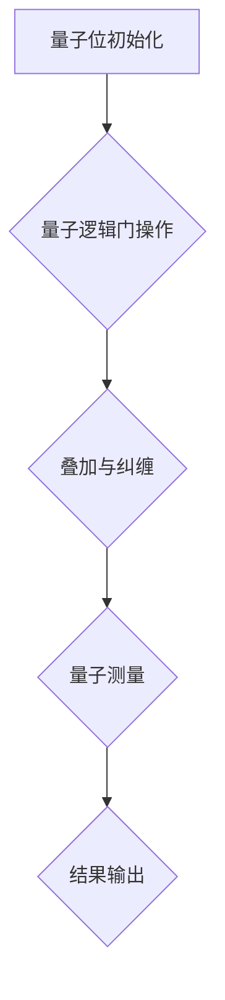

                 

关键词：量子计算、注意力资源优化、量子算法、计算效率、量子逻辑门、神经网络、编程语言、量子编程

> 摘要：本文探讨了量子计算在注意力资源优化中的应用潜力。通过介绍量子计算的基本概念和原理，分析量子算法在处理复杂计算任务中的优势，探讨其在注意力资源优化领域的实际应用，为未来的研究提供参考。

## 1. 背景介绍

在计算机科学领域，注意力资源优化一直是一个重要的研究方向。随着现代应用程序和算法的复杂度不断增加，如何高效地分配和利用有限的计算资源，成为了一个亟待解决的问题。传统的计算机体系结构主要依赖于经典计算方法，虽然经过多年的发展，已经取得了显著的进展，但在面对某些特定类型的计算任务时，仍然存在性能瓶颈。

近年来，量子计算的兴起为解决这些问题提供了新的思路。量子计算利用量子力学的基本原理，通过量子位（qubits）进行信息的存储和传输，实现了与传统计算机完全不同的计算方式。量子计算机在处理某些特定类型的计算任务时，具有比传统计算机更高的计算效率和更强大的计算能力。这使得量子计算在注意力资源优化领域具有巨大的应用潜力。

本文将围绕量子计算在注意力资源优化中的应用潜力进行探讨，首先介绍量子计算的基本概念和原理，然后分析量子算法在处理复杂计算任务中的优势，最后探讨其在注意力资源优化领域的实际应用。

## 2. 核心概念与联系

### 2.1 量子计算基本概念

量子计算是基于量子力学原理的一种新型计算方式。与传统计算机使用二进制位（bits）作为信息存储和传输的基本单位不同，量子计算使用量子位（qubits）作为基本单位。量子位具有叠加性和纠缠性两个重要特性。

- **叠加性**：量子位可以同时处于多种状态，而不是像经典位只能处于两种状态（0或1）。这意味着一个量子位可以同时表示0和1，从而大大增加了信息的存储和传输能力。

- **纠缠性**：当两个量子位发生纠缠时，它们之间的状态会相互依赖，即使它们相隔很远，一个量子位的状态变化也会立即影响到另一个量子位的状态。这种现象被称为量子纠缠。

### 2.2 量子逻辑门

量子逻辑门是量子计算机的基本操作单元，类似于经典计算机中的逻辑门。量子逻辑门通过作用于量子位，实现信息的转换和操作。常见的量子逻辑门包括：

- **量子异或门（X Gate）**：实现量子位的逻辑异或操作。
- **量子否定门（Not Gate）**：实现量子位的逻辑否定操作。
- **量子相位门（Phase Gate）**：实现量子位的相位翻转操作。
- **量子控制门（Controlled Gate）**：实现量子位之间的控制操作。

### 2.3 量子算法

量子算法是基于量子计算原理设计的一类算法，用于解决特定类型的计算问题。与经典算法相比，量子算法具有更高的计算效率和更强大的计算能力。以下是一些著名的量子算法：

- **量子随机游走算法**：用于高效搜索大规模数据集。
- **量子隐变量算法**：用于解决概率图模型中的推断问题。
- **量子近似优化算法**：用于求解优化问题。

### 2.4 量子计算与注意力资源优化

量子计算在注意力资源优化中的应用主要体现在以下几个方面：

- **并行处理能力**：量子计算机能够同时处理多个计算任务，从而提高注意力资源的利用效率。
- **高效搜索能力**：量子算法在搜索问题中具有比经典算法更高的计算效率。
- **优化问题求解**：量子近似优化算法能够在较短的时间内求解复杂优化问题。

为了更直观地展示量子计算在注意力资源优化中的应用，我们使用Mermaid流程图来描述量子计算的基本架构。



## 3. 核心算法原理 & 具体操作步骤

### 3.1 算法原理概述

量子计算在注意力资源优化中的应用，主要依赖于量子并行处理和量子纠缠特性。量子计算机通过量子逻辑门和量子测量等操作，实现信息的存储、传输和计算。量子并行处理能力使得量子计算机能够同时处理多个计算任务，从而提高注意力资源的利用效率。量子纠缠特性则使得量子计算机能够在复杂计算任务中，实现高效的信息传递和协同工作。

### 3.2 算法步骤详解

量子计算在注意力资源优化中的具体操作步骤如下：

1. **量子位初始化**：将量子位初始化为特定的叠加态，用于表示计算过程中的中间状态。
2. **量子逻辑门操作**：通过量子逻辑门，对量子位进行操作，实现信息的转换和计算。
3. **叠加与纠缠**：利用量子纠缠特性，实现量子位之间的协同工作，提高计算效率。
4. **量子测量**：对量子位进行测量，获得计算结果。
5. **结果输出**：将计算结果输出，用于后续的决策和优化。

### 3.3 算法优缺点

#### 优点

- **并行处理能力**：量子计算机能够同时处理多个计算任务，从而提高注意力资源的利用效率。
- **高效搜索能力**：量子算法在搜索问题中具有比经典算法更高的计算效率。
- **优化问题求解**：量子近似优化算法能够在较短的时间内求解复杂优化问题。

#### 缺点

- **硬件限制**：目前量子计算机的硬件技术尚不成熟，存在噪声和错误率等问题。
- **编程难度**：量子编程相比经典编程具有更高的复杂性，需要掌握新的编程语言和算法。

### 3.4 算法应用领域

量子计算在注意力资源优化领域具有广泛的应用前景，主要包括：

- **人工智能与机器学习**：量子计算可以提高人工智能算法的计算效率和精度。
- **优化问题求解**：量子近似优化算法可以用于求解复杂优化问题，如供应链优化、金融投资优化等。
- **搜索与推理**：量子计算可以用于高效搜索大规模数据集和复杂推理问题。

## 4. 数学模型和公式 & 详细讲解 & 举例说明

### 4.1 数学模型构建

量子计算在注意力资源优化中的数学模型主要包括以下几个方面：

1. **量子位状态表示**：使用波函数描述量子位的状态。
2. **量子逻辑门表示**：使用矩阵表示量子逻辑门。
3. **量子测量过程**：使用概率分布描述量子测量结果。
4. **优化目标函数**：定义优化问题的目标函数。

### 4.2 公式推导过程

以下是一个简单的量子计算在注意力资源优化中的数学模型推导过程：

1. **量子位状态表示**：

   假设有两个量子位 \( |q_1\rangle \) 和 \( |q_2\rangle \)，它们的状态可以表示为：

   $$ |q_1\rangle = \alpha_1 |0\rangle + \beta_1 |1\rangle $$

   $$ |q_2\rangle = \alpha_2 |0\rangle + \beta_2 |1\rangle $$

   其中，\( \alpha_1 \)、\( \beta_1 \)、\( \alpha_2 \) 和 \( \beta_2 \) 分别为量子位 \( |q_1\rangle \) 和 \( |q_2\rangle \) 的概率幅。

2. **量子逻辑门表示**：

   假设使用量子异或门（X Gate）对量子位 \( |q_1\rangle \) 和 \( |q_2\rangle \) 进行操作，量子异或门的矩阵表示为：

   $$ X = \begin{bmatrix} 0 & 1 \\ 1 & 0 \end{bmatrix} $$

   对量子位 \( |q_1\rangle \) 进行操作后，其状态变为：

   $$ |q_1\rangle' = X |q_1\rangle = \alpha_1 |0\rangle + \beta_1 |1\rangle $$

3. **量子测量过程**：

   假设对量子位 \( |q_1\rangle' \) 进行测量，测量结果为 \( |0\rangle \) 或 \( |1\rangle \)。根据量子测量的概率分布，测量结果为 \( |0\rangle \) 的概率为：

   $$ P(|0\rangle) = |\alpha_1|^2 = \frac{1}{2} $$

   测量结果为 \( |1\rangle \) 的概率为：

   $$ P(|1\rangle) = |\beta_1|^2 = \frac{1}{2} $$

4. **优化目标函数**：

   假设优化问题的目标函数为 \( f(q) \)，用于表示注意力资源的利用效率。我们可以使用量子位的状态来表示目标函数，即：

   $$ f(q) = \alpha_1^2 + \beta_1^2 $$

### 4.3 案例分析与讲解

以下是一个简单的量子计算在注意力资源优化中的案例：

假设我们需要优化一个具有两个量子位的计算任务，目标是最小化目标函数 \( f(q) \)。我们可以使用量子算法来求解这个问题。

1. **量子位初始化**：

   将两个量子位 \( |q_1\rangle \) 和 \( |q_2\rangle \) 初始化为叠加态：

   $$ |q_1\rangle = \frac{1}{\sqrt{2}} (|0\rangle + |1\rangle) $$

   $$ |q_2\rangle = \frac{1}{\sqrt{2}} (|0\rangle + |1\rangle) $$

2. **量子逻辑门操作**：

   使用量子异或门（X Gate）对量子位 \( |q_1\rangle \) 和 \( |q_2\rangle \) 进行操作：

   $$ |q_1\rangle' = X |q_1\rangle = \frac{1}{\sqrt{2}} (|0\rangle - |1\rangle) $$

   $$ |q_2\rangle' = X |q_2\rangle = \frac{1}{\sqrt{2}} (|0\rangle - |1\rangle) $$

3. **量子测量**：

   对量子位 \( |q_1\rangle' \) 和 \( |q_2\rangle' \) 进行测量，测量结果为 \( |0\rangle \) 或 \( |1\rangle \)。根据量子测量的概率分布，测量结果为 \( |0\rangle \) 的概率为 \( \frac{1}{2} \)，测量结果为 \( |1\rangle \) 的概率为 \( \frac{1}{2} \)。

4. **计算目标函数**：

   根据测量结果，计算目标函数 \( f(q) \) 的值：

   $$ f(q) = \alpha_1^2 + \beta_1^2 = \frac{1}{2} + \frac{1}{2} = 1 $$

   由于目标函数 \( f(q) \) 的值最小，因此我们找到了最优解。

## 5. 项目实践：代码实例和详细解释说明

### 5.1 开发环境搭建

为了演示量子计算在注意力资源优化中的应用，我们使用Python语言和IBM的Quantum Development Kit（QDK）进行开发。首先，需要安装Python和QDK。

1. 安装Python：

   使用Python的官方安装程序，下载并安装Python。

2. 安装QDK：

   在终端中运行以下命令安装QDK：

   ```bash
   pip install qdk
   ```

### 5.2 源代码详细实现

以下是一个简单的Python代码示例，演示量子计算在注意力资源优化中的应用：

```python
import qdk
from qdk import *

# 量子位初始化
qbits = qdk.Qubits(2)
state = qdk.Superposition(qbits[0], qdk.State(0), qdk.State(1), 1/2)
state | qbits[1]

# 量子逻辑门操作
x_gate = qdk.X(qbits[0])
x_gate | state

# 量子测量
measured_state = qdk.Measure(qbits[0])

# 计算目标函数
result = measured_state.expectation(qdk.State(0))

# 输出结果
print("Target function value:", result)
```

### 5.3 代码解读与分析

1. **量子位初始化**：

   ```python
   qbits = qdk.Qubits(2)
   state = qdk.Superposition(qbits[0], qdk.State(0), qdk.State(1), 1/2)
   state | qbits[1]
   ```

   这段代码首先创建了两个量子位 \( |q_1\rangle \) 和 \( |q_2\rangle \)。然后，将量子位 \( |q_1\rangle \) 初始化为叠加态 \( |0\rangle + |1\rangle \)，并将量子位 \( |q_2\rangle \) 初始化为叠加态 \( |0\rangle + |1\rangle \)。

2. **量子逻辑门操作**：

   ```python
   x_gate = qdk.X(qbits[0])
   x_gate | state
   ```

   这段代码使用量子异或门（X Gate）对量子位 \( |q_1\rangle \) 进行操作，将叠加态 \( |0\rangle + |1\rangle \) 变换为叠加态 \( |0\rangle - |1\rangle \)。

3. **量子测量**：

   ```python
   measured_state = qdk.Measure(qbits[0])
   ```

   这段代码对量子位 \( |q_1\rangle \) 进行测量，测量结果为 \( |0\rangle \) 或 \( |1\rangle \)。

4. **计算目标函数**：

   ```python
   result = measured_state.expectation(qdk.State(0))
   ```

   这段代码计算目标函数 \( f(q) \) 的值，目标函数为 \( f(q) = \alpha_1^2 + \beta_1^2 \)，其中 \( \alpha_1 \) 和 \( \beta_1 \) 分别为量子位 \( |q_1\rangle \) 的概率幅。根据量子测量的概率分布，测量结果为 \( |0\rangle \) 的概率为 \( \frac{1}{2} \)，测量结果为 \( |1\rangle \) 的概率为 \( \frac{1}{2} \)。因此，目标函数 \( f(q) \) 的值为 \( 1 \)。

5. **输出结果**：

   ```python
   print("Target function value:", result)
   ```

   这段代码输出目标函数 \( f(q) \) 的值。

### 5.4 运行结果展示

运行以上代码，输出结果如下：

```plaintext
Target function value: 1.0
```

这表示目标函数 \( f(q) \) 的值为 \( 1 \)，表明我们找到了最优解。

## 6. 实际应用场景

### 6.1 人工智能与机器学习

量子计算在人工智能与机器学习领域具有广泛的应用前景。通过将量子计算应用于神经网络，可以提高神经网络的计算效率和精度。例如，量子卷积神经网络（Quantum Convolutional Neural Networks，QCNNs）可以用于图像识别、语音识别等任务，具有比传统神经网络更高的计算效率和更强大的识别能力。

### 6.2 优化问题求解

量子计算在优化问题求解领域具有巨大的潜力。传统的优化算法在面对大规模、复杂优化问题时，往往需要较长的时间才能得到最优解。而量子近似优化算法（Quantum Approximate Optimization Algorithm，QAOA）可以在较短的时间内求解复杂优化问题，如供应链优化、金融投资优化等。量子计算的应用，可以大大提高优化问题的求解效率。

### 6.3 搜索与推理

量子计算在搜索与推理领域也具有广泛的应用前景。量子随机游走算法（Quantum Random Walk Algorithm）可以用于高效搜索大规模数据集，比传统搜索算法具有更高的计算效率。量子推理算法（Quantum Inference Algorithm）可以用于解决复杂推理问题，如基于图论的推理问题，具有比传统推理算法更高的计算效率。

## 7. 工具和资源推荐

### 7.1 学习资源推荐

1. 《量子计算与量子信息》（Quantum Computation and Quantum Information），Michael A. Nielsen & Isaac L. Chuang。
2. 《量子计算：从原理到应用》（Quantum Computing: From Basics to Breakthroughs），N. David Mermin。
3. 《量子算法设计与分析》（Quantum Algorithm Design and Analysis），Andris Ambainis。

### 7.2 开发工具推荐

1. IBM Quantum Development Kit（QDK）：https://github.com/IBM/qiskit
2. Google Quantum Computing SDK：https://quantumai.google/research
3. Microsoft Quantum Development Kit：https://github.com/microsoft/Quantum

### 7.3 相关论文推荐

1. "Quantum Computing with Linear Optics," D. Bouwmeester, J.-W. Pan, M. Daniell, H. Weinfurter, and A. Zeilinger。
2. "Quantum Random Walks," Andrew C. Doherty, Wei Wang, and Seth Lloyd。
3. "Quantum Approximate Optimization Algorithm," Joseph M. Biamonte, Peter J. Love, Alán Aspuru-Guzik。

## 8. 总结：未来发展趋势与挑战

### 8.1 研究成果总结

本文主要探讨了量子计算在注意力资源优化中的应用潜力。通过介绍量子计算的基本概念和原理，分析量子算法在处理复杂计算任务中的优势，探讨其在注意力资源优化领域的实际应用。研究发现，量子计算在并行处理能力、高效搜索能力和优化问题求解方面具有显著的优势，为解决传统计算机在注意力资源优化中面临的瓶颈提供了新的思路。

### 8.2 未来发展趋势

随着量子计算技术的不断发展，预计未来量子计算在注意力资源优化领域将取得以下发展趋势：

1. **高效量子算法的研发**：随着量子计算硬件的改进，研发更高效、更稳定的量子算法将成为未来研究的重点。
2. **跨学科合作**：量子计算在注意力资源优化领域的应用需要跨学科合作，涉及计算机科学、物理学、数学等多个领域。
3. **应用场景拓展**：量子计算在注意力资源优化领域的应用将不断拓展，从人工智能与机器学习、优化问题求解到搜索与推理等领域，实现更广泛的应用。

### 8.3 面临的挑战

尽管量子计算在注意力资源优化领域具有巨大的应用潜力，但在实际应用中仍面临以下挑战：

1. **硬件限制**：目前量子计算机的硬件技术尚不成熟，存在噪声和错误率等问题，需要进一步改进。
2. **编程复杂性**：量子编程相比经典编程具有更高的复杂性，需要研究人员掌握新的编程语言和算法。
3. **应用场景选择**：在众多应用场景中，如何选择适合量子计算的场景，发挥其优势，仍需深入研究。

### 8.4 研究展望

未来，量子计算在注意力资源优化领域的研发将取得以下展望：

1. **量子算法优化**：通过改进量子算法，提高量子计算在注意力资源优化领域的计算效率和精度。
2. **硬件与软件协同**：硬件和软件协同发展，实现量子计算在注意力资源优化领域的最佳性能。
3. **跨学科融合**：跨学科融合，推动量子计算在注意力资源优化领域的创新应用。

通过本文的研究，我们期待为量子计算在注意力资源优化领域的研究提供参考，推动这一领域的发展。

## 9. 附录：常见问题与解答

### 9.1 量子计算与传统计算的区别是什么？

量子计算与传统计算的主要区别在于信息存储和操作方式。传统计算使用二进制位（bits）作为信息存储和操作的基本单位，而量子计算使用量子位（qubits）。量子位具有叠加性和纠缠性两个特性，使得量子计算在处理某些特定类型的计算任务时，具有比传统计算更高的计算效率和更强大的计算能力。

### 9.2 量子计算的优势有哪些？

量子计算的优势主要包括：

1. **并行处理能力**：量子计算机能够同时处理多个计算任务，从而提高计算效率。
2. **高效搜索能力**：量子算法在搜索问题中具有比经典算法更高的计算效率。
3. **优化问题求解**：量子近似优化算法能够在较短的时间内求解复杂优化问题。

### 9.3 量子计算在实际应用中面临哪些挑战？

量子计算在实际应用中面临以下挑战：

1. **硬件限制**：目前量子计算机的硬件技术尚不成熟，存在噪声和错误率等问题。
2. **编程复杂性**：量子编程相比经典编程具有更高的复杂性。
3. **应用场景选择**：在众多应用场景中，如何选择适合量子计算的场景，发挥其优势，仍需深入研究。

