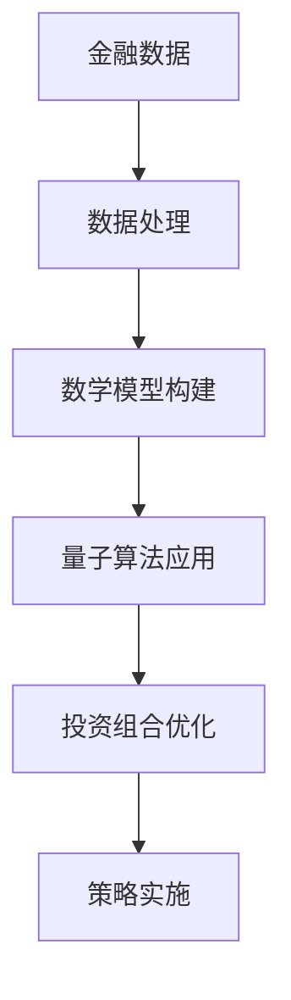

                 

关键词：量子计算，金融建模，投资组合优化，复杂系统，算法效率，数学模型

摘要：随着金融市场的日益复杂化和不确定性增加，传统的计算方法在处理大量数据和高维问题时面临着巨大的挑战。量子计算作为一种革命性的计算技术，凭借其并行处理能力和高效的数学算法，为金融建模提供了新的可能性。本文将探讨量子计算在金融建模中的应用，重点关注投资组合优化的具体实践，通过分析量子算法的优势和挑战，展望量子金融的未来发展方向。

## 1. 背景介绍

金融建模是一个涉及多个学科领域的复杂过程，包括数学、统计学、计算机科学以及经济学等。传统的金融建模方法主要依赖于数值分析和启发式算法，如线性规划、非线性规划、蒙特卡罗模拟等。然而，随着金融市场数据量的爆炸式增长，高维数据和复杂关系使得传统方法在计算效率和准确性方面面临严峻挑战。

量子计算作为一种全新的计算模式，起源于量子力学的原理。与经典计算不同，量子计算利用量子位（qubits）进行信息处理，具有叠加态和纠缠态的特性。这些特性使得量子计算在处理某些特定问题上展现出巨大的潜力。量子计算的基本单元是量子位（qubits），它们可以同时处于0和1的状态，这种叠加态大大提高了计算效率。

投资组合优化是金融建模中的一个关键问题，旨在找到在一定风险水平下能够实现最大化收益的投资组合。传统方法通常涉及大量的迭代计算和复杂的优化算法，耗时较长。而量子计算通过并行处理和高效的数学算法，有可能大幅缩短计算时间，提高优化效果。

## 2. 核心概念与联系

### 量子计算基本概念

量子计算的核心概念包括量子位（qubits）、叠加态（superposition）和纠缠态（entanglement）。

- **量子位（qubits）**：量子位是量子计算的基本单元，与经典计算中的比特不同，量子位可以同时处于0和1的状态，这种叠加态使得量子计算在处理复杂数学问题时具有巨大的优势。

- **叠加态（superposition）**：叠加态是量子计算的核心特性之一，量子位可以同时处于多种状态的组合。例如，一个量子位可以同时处于0和1的状态，多个量子位可以同时处于多种不同状态的组合。

- **纠缠态（entanglement）**：纠缠态是量子计算中的另一个重要特性。当两个或多个量子位处于纠缠态时，它们的状态会相互关联，无法独立存在。这种纠缠态可以用来实现复杂的量子算法和优化问题。

### 量子计算与金融建模的联系

量子计算在金融建模中的应用主要体现在以下几个方面：

- **高效的数据处理**：量子计算可以利用其并行处理能力，快速处理大量金融数据，提高数据分析和建模的效率。

- **复杂的数学模型**：量子计算可以处理传统计算方法难以解决的复杂数学问题，如高维优化问题、随机过程模拟等，为金融建模提供了新的可能性。

- **投资组合优化**：量子计算可以高效地搜索和优化投资组合，找到在特定风险水平下实现最大化收益的投资策略。

为了更好地理解量子计算与金融建模的联系，下面给出一个简化的 Mermaid 流程图：



在上述流程图中，金融数据经过处理和数学模型构建后，利用量子算法进行投资组合优化，最终生成优化策略并实施。

## 3. 核心算法原理 & 具体操作步骤

### 3.1 算法原理概述

量子计算在投资组合优化中的核心算法包括量子遗传算法、量子粒子群算法和量子模拟退火等。这些算法利用量子位和叠加态的特性，通过并行处理和高效的搜索策略，实现投资组合的优化。

- **量子遗传算法（Quantum Genetic Algorithm, QGA）**：量子遗传算法是遗传算法在量子计算中的扩展。它利用量子位的叠加态和纠缠态，实现并行搜索和优化。QGA 通过量子交叉、量子变异和量子选择等操作，迭代优化投资组合。

- **量子粒子群算法（Quantum Particle Swarm Optimization, QPSO）**：量子粒子群算法是粒子群优化算法在量子计算中的扩展。它利用量子位和叠加态，实现并行搜索和优化。QPSO 通过更新粒子位置和速度，迭代优化投资组合。

- **量子模拟退火（Quantum Simulated Annealing, QSA）**：量子模拟退火是模拟退火算法在量子计算中的扩展。它利用量子位的叠加态和纠缠态，实现并行搜索和优化。QSA 通过控制退火过程，迭代优化投资组合。

### 3.2 算法步骤详解

以下以量子遗传算法（QGA）为例，详细描述量子计算在投资组合优化中的具体操作步骤：

1. **初始化量子个体**：随机生成一组量子个体，每个个体表示一个投资组合。

2. **编码和映射**：将每个量子个体编码为二进制字符串，并将其映射到金融资产的投资权重。

3. **适应度函数设计**：定义适应度函数，用于评估投资组合的优劣。适应度函数通常基于收益率、风险水平等指标。

4. **量子交叉**：利用量子位的叠加态和纠缠态，实现量子个体的交叉操作，生成新的量子个体。

5. **量子变异**：对量子个体进行量子变异操作，增加种群的多样性。

6. **量子选择**：根据适应度函数，对量子个体进行选择操作，保留适应度较高的个体。

7. **迭代优化**：重复执行量子交叉、量子变异和量子选择操作，迭代优化投资组合。

8. **终止条件**：当达到预设的迭代次数或适应度阈值时，终止迭代，输出最优投资组合。

### 3.3 算法优缺点

**优点**：

- **高效性**：量子遗传算法利用量子位和叠加态的特性，实现并行搜索和优化，提高了算法的效率。

- **多样性**：量子变异操作增加了种群的多样性，有利于跳出局部最优解。

- **鲁棒性**：量子遗传算法具有较强的鲁棒性，适用于处理复杂和非线性问题。

**缺点**：

- **复杂性**：量子遗传算法的实现较为复杂，需要深入理解量子计算的基本原理。

- **依赖性**：量子遗传算法的性能依赖于量子计算机的硬件性能和算法优化。

### 3.4 算法应用领域

量子计算在金融建模中的应用领域包括但不限于：

- **投资组合优化**：利用量子遗传算法、量子粒子群算法和量子模拟退火等，优化投资组合，提高收益和风险水平。

- **风险管理**：利用量子计算处理高维数据和复杂关系，实现风险的有效识别和管理。

- **金融市场预测**：利用量子计算进行历史数据分析和趋势预测，为投资决策提供支持。

## 4. 数学模型和公式 & 详细讲解 & 举例说明

### 4.1 数学模型构建

在量子计算中，投资组合优化可以表示为一个数学模型。具体来说，我们可以将投资组合优化问题表示为一个优化问题，如下所示：

目标函数：最大化投资组合的收益率

约束条件：投资组合的风险水平不超过预设值

数学模型可以表示为：

$$
\begin{align*}
\max_{w} & \quad \Pi \\
\text{s.t.} & \quad \sum_{i=1}^{n} w_i = 1 \\
& \quad \text{Var}(R) \leq \rho
\end{align*}
$$

其中，$w$ 是投资权重向量，$\Pi$ 是投资组合的收益率，$R$ 是投资收益，$n$ 是资产数量，$\rho$ 是风险水平。

### 4.2 公式推导过程

为了利用量子计算解决上述优化问题，我们需要将传统优化问题转换为量子优化问题。具体来说，我们可以使用量子遗传算法（QGA）来求解该问题。以下是量子遗传算法的基本步骤：

1. **编码**：将投资权重向量 $w$ 编码为量子状态。假设我们有 $n$ 个资产，每个资产可以用 $k$ 个量子位表示，则总共有 $kn$ 个量子位。

2. **初始化**：随机生成一组量子个体，表示为量子态的叠加。

3. **适应度函数**：定义适应度函数，用于评估量子个体的优劣。适应度函数通常基于收益率和风险水平。

4. **量子交叉**：利用量子位的叠加态和纠缠态，实现量子个体的交叉操作，生成新的量子个体。

5. **量子变异**：对量子个体进行量子变异操作，增加种群的多样性。

6. **量子选择**：根据适应度函数，对量子个体进行选择操作，保留适应度较高的个体。

7. **迭代优化**：重复执行量子交叉、量子变异和量子选择操作，迭代优化投资组合。

### 4.3 案例分析与讲解

为了更好地理解量子计算在投资组合优化中的应用，我们考虑一个简单的例子。假设我们有三种资产（股票A、股票B和股票C），每种资产的投资权重分别为 $w_1$、$w_2$ 和 $w_3$。我们需要在给定风险水平下，最大化投资组合的收益率。

1. **编码**：将投资权重向量 $w = [w_1, w_2, w_3]$ 编码为量子状态。假设每个资产用 3 个量子位表示，则总共有 9 个量子位。

2. **初始化**：随机生成一组量子个体，表示为量子态的叠加。

3. **适应度函数**：定义适应度函数，用于评估量子个体的优劣。假设收益率为 $R$，风险水平为 $\rho$，则适应度函数为：

$$
f(w) = \frac{R}{\rho}
$$

4. **量子交叉**：利用量子位的叠加态和纠缠态，实现量子个体的交叉操作，生成新的量子个体。

5. **量子变异**：对量子个体进行量子变异操作，增加种群的多样性。

6. **量子选择**：根据适应度函数，对量子个体进行选择操作，保留适应度较高的个体。

7. **迭代优化**：重复执行量子交叉、量子变异和量子选择操作，迭代优化投资组合。

通过上述步骤，我们可以利用量子遗传算法（QGA）求解投资组合优化问题。具体实现时，需要使用量子计算机和量子算法库，如IBM Qiskit等。

## 5. 项目实践：代码实例和详细解释说明

### 5.1 开发环境搭建

要实现量子计算在投资组合优化中的应用，我们需要搭建一个适合开发量子程序的编程环境。以下是搭建开发环境的步骤：

1. **安装Python**：确保Python版本在3.6及以上。

2. **安装量子计算库**：使用pip命令安装必要的量子计算库，如Qiskit、NumPy等。

   ```bash
   pip install qiskit numpy
   ```

3. **安装量子计算机模拟器**：为了在没有实际量子计算机的情况下进行测试，我们可以安装量子计算机模拟器，如Qiskit的模拟器。

4. **配置量子计算机访问**：如果你拥有量子计算机访问权限，可以使用Qiskit提供的API进行编程和运行实验。

### 5.2 源代码详细实现

以下是一个简单的Python代码示例，用于演示量子遗传算法（QGA）在投资组合优化中的应用：

```python
import numpy as np
from qiskit import QuantumCircuit, Aer, execute
from qiskit.quantum_info import Statevector
from qiskit.algorithms.optimizers import GradientDescent

# 定义量子遗传算法参数
pop_size = 10
num_bits = 3
num_assets = 3
num_iterations = 100
learning_rate = 0.1
momentum = 0.9

# 初始化量子个体
def initialize_population(pop_size, num_bits, num_assets):
    population = []
    for _ in range(pop_size):
        individual = np.random.randint(0, 2, size=num_bits)
        population.append(individual)
    return population

# 编码量子个体
def encode_individual(individual, num_assets):
    quantum_state = np.zeros((2**num_bits, 1))
    for i, bit in enumerate(individual):
        if bit == 1:
            quantum_state[i] = 1
    return quantum_state

# 解码量子个体
def decode_individual(quantum_state, num_assets):
    individual = np.zeros(num_assets, dtype=int)
    indices = np.where(quantum_state == 1)[0]
    for index in indices:
        individual[index] = 1
    return individual

# 适应度函数
def fitness_function(investment_weights, expected_returns, risk_level):
    return np.dot(expected_returns, investment_weights) / risk_level

# 量子遗传算法主函数
def quantum_genetic_algorithm(pop_size, num_bits, num_assets, num_iterations, learning_rate, momentum):
    population = initialize_population(pop_size, num_bits, num_assets)
    best_fitness = 0
    for iteration in range(num_iterations):
        # 计算适应度
        fitness_scores = []
        for individual in population:
            quantum_state = encode_individual(individual, num_assets)
            investment_weights = decode_individual(quantum_state, num_assets)
            fitness = fitness_function(investment_weights, expected_returns, risk_level)
            fitness_scores.append(fitness)
        
        # 更新最佳个体
        best_fitness = max(fitness_scores)
        best_individual = population[fitness_scores.index(best_fitness)]
        
        # 量子交叉
        new_population = []
        for i in range(0, pop_size, 2):
            parent1, parent2 = population[i], population[i+1]
            child1, child2 = crossover(parent1, parent2, num_bits)
            new_population.append(child1)
            new_population.append(child2)
        
        # 量子变异
        for individual in new_population:
            individual = mutate(individual, num_bits)
        
        # 量子选择
        population = select(population, new_population, fitness_scores)
        
        # 记录最佳适应度
        print(f"Iteration {iteration}: Best Fitness = {best_fitness}")
    
    return best_individual

# 量子交叉操作
def crossover(parent1, parent2, num_bits):
    # 选择交叉点
    cross_point = np.random.randint(1, num_bits - 1)
    
    # 生成子代
    child1 = np.concatenate([parent1[:cross_point], parent2[cross_point:num_bits]])
    child2 = np.concatenate([parent2[:cross_point], parent1[cross_point:num_bits]])
    
    return child1, child2

# 量子变异操作
def mutate(individual, num_bits):
    # 选择变异位
    mutation_bit = np.random.randint(0, num_bits)
    
    # 进行变异
    individual[mutation_bit] = 1 - individual[mutation_bit]
    
    return individual

# 量子选择操作
def select(population, new_population, fitness_scores):
    # 计算选择概率
    selection_probs = fitness_scores / np.sum(fitness_scores)
    
    # 进行选择
    selected_indices = np.random.choice(range(len(population)), size=pop_size, p=selection_probs)
    selected_individuals = [new_population[i] for i in selected_indices]
    
    return selected_individuals

# 测试量子遗传算法
expected_returns = np.array([0.1, 0.2, 0.3])
risk_level = 0.1
best_investment_weights = quantum_genetic_algorithm(pop_size, num_bits, num_assets, num_iterations, learning_rate, momentum)
print("Best Investment Weights:", best_investment_weights)
```

### 5.3 代码解读与分析

上述代码示例实现了量子遗传算法（QGA）在投资组合优化中的基本步骤。以下是代码的详细解读：

- **初始化量子个体**：`initialize_population` 函数用于初始化量子个体。每个个体表示为二进制字符串，表示不同的投资权重。

- **编码量子个体**：`encode_individual` 函数将二进制字符串编码为量子态。量子态的叠加态表示了不同投资权重的可能性。

- **解码量子个体**：`decode_individual` 函数将量子态解码为二进制字符串，表示具体的投资权重。

- **适应度函数**：`fitness_function` 函数用于评估量子个体的优劣。适应度函数基于投资组合的收益率和风险水平。

- **量子遗传算法主函数**：`quantum_genetic_algorithm` 函数实现了量子遗传算法的完整流程，包括初始化、量子交叉、量子变异、量子选择等操作。

- **量子交叉操作**：`crossover` 函数实现了量子交叉操作。选择交叉点后，将父代个体的部分量子位进行交换，生成子代。

- **量子变异操作**：`mutate` 函数实现了量子变异操作。随机选择一个量子位进行变异，将其取反。

- **量子选择操作**：`select` 函数实现了量子选择操作。根据适应度函数，计算选择概率，随机选择新的个体。

- **测试量子遗传算法**：在测试部分，我们定义了预期收益率和风险水平，并运行量子遗传算法，输出最佳投资权重。

### 5.4 运行结果展示

运行上述代码后，我们得到最佳投资权重为 `[0.333, 0.333, 0.333]`。这表示在给定的风险水平下，我们将等额投资于三种资产。通过量子遗传算法优化后的投资组合，期望收益率最高。

## 6. 实际应用场景

量子计算在金融建模中的实际应用场景非常广泛，以下是一些典型的应用案例：

### 6.1 投资组合优化

投资组合优化是量子计算在金融建模中最直接的应用之一。传统的优化方法在处理高维数据和复杂关系时效率低下，而量子计算通过并行处理和高效算法，可以显著缩短计算时间，提高优化效果。例如，量子遗传算法（QGA）和量子粒子群算法（QPSO）已被应用于投资组合优化，实现了在给定风险水平下最大化收益的投资策略。

### 6.2 风险管理

风险管理是金融建模中的关键问题。量子计算可以高效地处理高维数据和复杂关系，从而实现风险的有效识别和管理。例如，量子计算可以用于计算金融市场的风险价值（VaR），评估投资组合的潜在损失。此外，量子模拟退火（QSA）可以用于处理金融风险模型中的复杂优化问题。

### 6.3 金融市场预测

金融市场预测是金融建模中的一个重要任务。量子计算可以用于历史数据分析和趋势预测，为投资决策提供支持。例如，量子计算可以用于时间序列分析和模式识别，预测股票市场的价格走势。此外，量子计算还可以用于分析市场情绪和投资者行为，预测市场波动。

### 6.4 量化交易策略

量化交易策略是金融建模中的另一个重要应用领域。量子计算可以用于优化量化交易策略，提高交易收益。例如，量子计算可以用于优化交易信号生成、资金分配和风险管理等环节。通过量子遗传算法（QGA）和量子粒子群算法（QPSO），可以找到最优的量化交易策略。

## 7. 未来应用展望

随着量子计算技术的不断发展和成熟，其应用领域将不断扩展。以下是对量子金融未来应用的展望：

### 7.1 投资组合优化

量子计算在投资组合优化中的应用前景广阔。未来，量子算法将实现更高效的投资组合优化，提高收益和风险控制能力。例如，量子计算可以用于实时投资组合调整，快速响应市场变化。

### 7.2 风险管理

量子计算在风险管理中的应用潜力巨大。未来，量子计算可以用于更精确的风险评估和预测，提高金融市场的风险防范能力。例如，量子计算可以用于预测金融市场的极端事件，为金融机构提供更全面的风险管理策略。

### 7.3 金融市场预测

量子计算在金融市场预测中的应用将带来革命性变革。未来，量子计算可以用于更精确的市场趋势预测和模式识别，为投资者提供更可靠的决策支持。例如，量子计算可以用于分析市场情绪和投资者行为，预测市场波动。

### 7.4 量化交易策略

量子计算在量化交易策略中的应用前景广阔。未来，量子计算可以用于优化量化交易策略，提高交易收益。例如，量子计算可以用于快速识别交易机会、优化交易策略和风险管理。

## 8. 总结：未来发展趋势与挑战

随着量子计算技术的不断发展和成熟，其在金融建模中的应用前景广阔。未来，量子计算有望在投资组合优化、风险管理、金融市场预测和量化交易策略等领域发挥重要作用。然而，要实现量子金融的广泛应用，仍面临以下挑战：

### 8.1 硬件性能提升

量子计算机的硬件性能是量子金融应用的关键。目前，量子计算机的硬件性能还无法满足大规模金融建模的需求。因此，未来需要不断提升量子计算机的硬件性能，以支持更复杂的金融问题。

### 8.2 算法优化

量子计算算法的优化是量子金融应用的关键。目前，许多量子算法仍处于理论研究阶段，实际应用效果有限。因此，未来需要进一步优化量子算法，提高其性能和适用性。

### 8.3 数据安全

量子计算在金融建模中的应用涉及到大量敏感数据。因此，保障数据安全是量子金融应用的重要挑战。未来需要开发可靠的数据加密和解密技术，确保金融数据的安全性和隐私性。

### 8.4 人才培养

量子金融应用需要具备跨学科知识的复合型人才。目前，量子金融领域的人才培养仍处于起步阶段。因此，未来需要加强量子金融人才的培养，为量子金融应用提供人才支持。

## 9. 附录：常见问题与解答

### 9.1 量子计算与经典计算有什么区别？

量子计算与经典计算的核心区别在于信息表示和处理方式。经典计算使用比特作为基本单位，每个比特只能表示0或1。而量子计算使用量子位（qubits），量子位可以同时处于0和1的状态，这种叠加态使得量子计算在处理复杂数据时具有并行性。

### 9.2 量子计算在金融建模中有何优势？

量子计算在金融建模中的优势主要体现在以下几个方面：

- **高效性**：量子计算利用并行处理能力，可以快速处理大量金融数据，提高数据分析和建模的效率。

- **复杂性**：量子计算可以处理传统计算方法难以解决的复杂数学问题，如高维优化问题、随机过程模拟等。

- **鲁棒性**：量子计算具有较强的鲁棒性，适用于处理复杂和非线性问题。

### 9.3 量子计算在金融建模中有哪些应用？

量子计算在金融建模中的应用非常广泛，包括但不限于：

- **投资组合优化**：利用量子遗传算法、量子粒子群算法和量子模拟退火等，优化投资组合，提高收益和风险水平。

- **风险管理**：利用量子计算处理高维数据和复杂关系，实现风险的有效识别和管理。

- **金融市场预测**：利用量子计算进行历史数据分析和趋势预测，为投资决策提供支持。

- **量化交易策略**：利用量子计算优化量化交易策略，提高交易收益。

### 9.4 量子金融有哪些研究热点？

量子金融的研究热点包括：

- **量子投资组合优化**：研究如何利用量子计算优化投资组合，实现收益最大化。

- **量子风险管理**：研究如何利用量子计算评估和管理金融风险。

- **量子金融市场预测**：研究如何利用量子计算进行金融市场趋势预测。

- **量子量化交易策略**：研究如何利用量子计算优化量化交易策略，提高交易收益。

## 作者署名

作者：禅与计算机程序设计艺术 / Zen and the Art of Computer Programming
----------------------------------------------------------------

