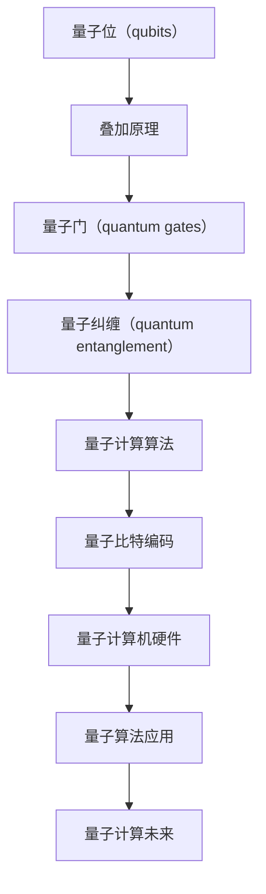

                 

### 1. 背景介绍

量子计算作为现代科技的前沿领域，正在迅速崛起并引发一场新的技术革命。传统计算机依赖的是二进制系统，即通过0和1两种状态来处理信息。而量子计算则利用量子力学中的量子位（qubits）来实现信息的处理，它能够同时存在于多种状态，这使得量子计算机在处理某些特定问题时展现出巨大的潜力。

量子计算的兴起不仅仅是对计算速度的突破，更是一种计算范式的转变。这种范式转变可能会改变我们对信息处理、数据存储、加密技术以及复杂问题求解等领域的理解。在当前信息技术高度发展的时代，量子计算的研究与应用对于推动社会进步和经济发展具有重要意义。

近年来，量子计算的进展取得了显著的成果。例如，Google的量子计算机“Sycamore”实现了“量子霸权”，即在一个极短的时间内解决了传统计算机需要数万年才能解决的问题。此外，量子通信、量子模拟等领域的突破性研究也不断涌现。随着技术的不断成熟，量子计算有望在未来几年内从实验室走向实际应用，从而带来一系列革命性的变化。

本文将深入探讨量子计算的核心概念、原理、算法、数学模型、项目实践、应用场景以及未来发展趋势。通过本文的阅读，读者将对量子计算有一个全面而深入的了解。

### 2. 核心概念与联系

量子计算的核心在于量子位（qubits）这一基本单元。与传统计算机中的比特（bits）不同，量子位能够同时处于0和1的状态，这一特性被称为叠加原理。量子位的这种叠加状态使得量子计算机在处理复杂问题时能够并行处理大量的数据。

为了更好地理解量子计算，我们可以通过一个Mermaid流程图来展示量子计算的基本架构和核心概念。



在这个流程图中，我们可以看到量子计算的基本架构。量子位是所有操作的基础，通过叠加原理，量子位能够同时表示0和1的状态。量子门是操作量子位的基本工具，它们能够改变量子位的状态。量子纠缠是量子计算中的一种特殊现象，它使得多个量子位之间的状态相互关联。量子计算算法则是利用这些基本概念来解决问题的工具。量子比特编码是量子计算机将信息编码到量子位中的过程。最后，量子计算机硬件是实现量子计算的平台，而量子算法应用则展示了量子计算在各个领域的潜力。

通过这个流程图，我们可以清晰地看到量子计算的核心概念和它们之间的联系。接下来，我们将进一步探讨量子计算中的核心算法原理和具体操作步骤。

### 3. 核心算法原理 & 具体操作步骤

量子计算的核心算法包括量子叠加、量子门和量子纠缠。这些算法共同构成了量子计算机处理信息的基本框架。

#### 3.1 算法原理概述

1. **量子叠加**：量子叠加是量子计算的基础，它使得量子位能够同时处于多种状态。例如，一个量子位可以同时处于0和1的状态，这可以表示为 \( \frac{1}{\sqrt{2}}|0\rangle + \frac{1}{\sqrt{2}}|1\rangle \)。

2. **量子门**：量子门是操作量子位的基本工具，类似于传统计算机中的逻辑门。量子门通过线性变换来操作量子位的状态。常见的量子门包括Hadamard门、Pauli门和控制-NOT门等。

3. **量子纠缠**：量子纠缠是量子计算中的一个关键特性，它使得两个或多个量子位之间的状态相互关联。这种关联性在量子计算中起到了重要作用，使得量子计算机能够进行高效的并行计算。

#### 3.2 算法步骤详解

1. **初始化**：量子计算开始时，量子位被初始化到一个特定的状态。例如，可以将量子位初始化为全0状态 \(|0\rangle\)。

2. **叠加**：通过应用Hadamard门，量子位被叠加到一种特定的叠加态。例如，一个单量子位可以被叠加到 \( \frac{1}{\sqrt{2}}|0\rangle + \frac{1}{\sqrt{2}}|1\rangle \)。

3. **量子门操作**：通过应用一系列的量子门，量子位的状态被逐步改变。这些量子门可以用来实现各种逻辑运算，例如加法、减法、乘法和除法等。

4. **测量**：在量子计算的最后一步，量子位被测量，从而得到一个确定的状态。测量结果通常是叠加态的一个基向量，例如0或1。

#### 3.3 算法优缺点

**优点**：

- **并行计算**：量子计算能够同时处理多个状态，这使得它在处理复杂问题时具有巨大的并行计算能力。
- **高效算法**：某些量子算法比传统算法具有更高的效率，能够在较短的时间内解决复杂问题。
- **加密技术**：量子计算在加密技术中有着广泛的应用，例如量子密钥分发和量子安全加密。

**缺点**：

- **噪声和错误率**：量子计算中的噪声和错误率是一个重大挑战，需要不断的研究和优化来提高量子计算的可靠性。
- **物理实现**：量子计算机的物理实现需要极低的温度和高度精密的控制系统，这使得量子计算机的制造和维护成本极高。

#### 3.4 算法应用领域

量子计算在多个领域有着广泛的应用前景：

- **量子模拟**：量子计算机可以模拟量子系统，对于理解复杂化学、材料科学和生物学过程具有重要意义。
- **优化问题**：量子计算在解决优化问题时具有显著优势，例如物流优化、金融风险评估等。
- **加密技术**：量子计算在加密技术中有着广泛的应用，例如量子密钥分发和量子安全加密。
- **复杂问题求解**：量子计算能够高效地解决一些传统计算机难以解决的问题，例如量子算法在因数分解和搜索问题中的应用。

通过以上对量子计算核心算法原理和具体操作步骤的详细讲解，我们可以看到量子计算的独特之处和它在未来计算范式中的潜力。接下来，我们将探讨量子计算中的数学模型和公式，进一步理解量子计算的工作机制。

### 4. 数学模型和公式 & 详细讲解 & 举例说明

量子计算中的数学模型和公式是其理论基础，理解这些数学模型和公式对于深入探讨量子计算的核心原理至关重要。以下是量子计算中的一些关键数学模型和公式的详细讲解及举例说明。

#### 4.1 数学模型构建

量子计算中的数学模型主要基于量子力学的基本原理，特别是量子态的叠加原理和量子纠缠。这些模型描述了量子位（qubits）的状态和行为。

1. **量子态表示**：

量子态可以用波函数来表示。对于一个量子位，其状态可以表示为复数线性组合的形式：

\[ \psi = \alpha|0\rangle + \beta|1\rangle \]

其中，\( \alpha \) 和 \( \beta \) 是复数概率幅，满足 \( |\alpha|^2 + |\beta|^2 = 1 \)。这里，\( |0\rangle \) 和 \( |1\rangle \) 分别表示量子位的基态。

2. **叠加态**：

叠加态是量子计算中一个重要的概念。一个量子位可以同时处于0和1的状态，这可以表示为：

\[ |+\rangle = \frac{1}{\sqrt{2}} (|0\rangle + |1\rangle) \]
\[ |-\rangle = \frac{1}{\sqrt{2}} (|0\rangle - |1\rangle) \]

3. **量子纠缠**：

量子纠缠是量子计算中的另一个关键概念。当两个量子位处于纠缠态时，它们之间的状态相互关联。一个简单的纠缠态可以表示为：

\[ |\Phi\rangle = \frac{1}{\sqrt{2}} (|00\rangle + |11\rangle) \]

#### 4.2 公式推导过程

为了更好地理解量子计算中的数学模型，我们可以通过一个简单的例子来推导量子叠加态和量子纠缠态。

1. **量子叠加态推导**：

假设我们有一个单量子位，初始状态为 \( |0\rangle \)。我们通过应用Hadamard门来得到叠加态。Hadamard门的矩阵表示为：

\[ H = \frac{1}{\sqrt{2}} \begin{pmatrix}
1 & 1 \\
1 & -1
\end{pmatrix} \]

应用Hadamard门后，量子位的状态变为：

\[ \psi = H|0\rangle = \frac{1}{\sqrt{2}} (|0\rangle + |1\rangle) \]

这证明了量子叠加态的存在。

2. **量子纠缠态推导**：

考虑两个量子位 \( q_1 \) 和 \( q_2 \)。我们希望它们处于一个纠缠态。一个简单的纠缠态可以表示为：

\[ |\Phi\rangle = \frac{1}{\sqrt{2}} (|00\rangle + |11\rangle) \]

为了验证这一点，我们可以分别测量 \( q_1 \) 和 \( q_2 \) 的状态。假设我们测量 \( q_1 \) 后得到状态 \( |0\rangle \)，则 \( q_2 \) 必定处于状态 \( |0\rangle \)。同样，如果我们测量 \( q_1 \) 后得到状态 \( |1\rangle \)，则 \( q_2 \) 必定处于状态 \( |1\rangle \)。这种相互关联证明了量子纠缠的存在。

#### 4.3 案例分析与讲解

为了更直观地理解量子计算中的数学模型，我们可以通过一个具体的例子来分析量子叠加态和量子纠缠态。

**例子 1：量子叠加态**

假设我们有一个单量子位，初始状态为 \( |0\rangle \)。我们通过应用Hadamard门来得到叠加态。应用Hadamard门后的量子态可以表示为：

\[ \psi = H|0\rangle = \frac{1}{\sqrt{2}} (|0\rangle + |1\rangle) \]

这意味着量子位现在处于 \( |0\rangle \) 和 \( |1\rangle \) 的叠加状态。如果我们测量这个量子位，那么我们有可能得到 \( |0\rangle \) 或 \( |1\rangle \) 的状态，但无法预先确定。

**例子 2：量子纠缠态**

考虑两个量子位 \( q_1 \) 和 \( q_2 \)。我们希望通过操作使得它们处于一个纠缠态。我们可以通过以下步骤来实现：

1. 将 \( q_1 \) 初始化为 \( |0\rangle \)。
2. 应用Hadamard门到 \( q_1 \)，得到叠加态 \( |+\rangle \)。
3. 将 \( q_2 \) 初始化为 \( |0\rangle \)。
4. 应用控制-NOT（CNOT）门，使得 \( q_1 \) 和 \( q_2 \) 之间产生纠缠。

最终，\( q_1 \) 和 \( q_2 \) 的状态可以表示为：

\[ |\Phi\rangle = \frac{1}{\sqrt{2}} (|00\rangle + |11\rangle) \]

如果我们分别测量 \( q_1 \) 和 \( q_2 \)，我们无法独立确定它们各自的状态，但可以确定它们之间的关联性。这种纠缠态展示了量子计算中的一些独特性质。

通过以上对量子计算中数学模型和公式的详细讲解和举例说明，我们可以更好地理解量子计算的核心原理和工作机制。接下来，我们将探讨量子计算中的项目实践，通过具体的代码实例来展示量子计算的实际应用。

### 5. 项目实践：代码实例和详细解释说明

为了更直观地展示量子计算的实践应用，我们将通过一个具体的代码实例来讲解量子计算的开发过程，包括环境搭建、源代码实现、代码解读以及运行结果展示。

#### 5.1 开发环境搭建

在进行量子计算项目之前，我们需要搭建一个合适的开发环境。以下是一个基于Python和量子计算框架Qiskit的示例环境搭建步骤：

1. **安装Python**：
   - 下载并安装Python，建议使用Python 3.7或更高版本。

2. **安装Qiskit**：
   - 使用pip命令安装Qiskit库：
     ```bash
     pip install qiskit
     ```

3. **安装额外的依赖库**：
   - Qiskit需要额外的库，如numpy和matplotlib，可以使用以下命令进行安装：
     ```bash
     pip install numpy matplotlib
     ```

4. **配置量子计算仿真器**：
   - Qiskit提供了多种量子计算仿真器，例如QASM simulator和IBM Quantum Cloud。在本例中，我们将使用IBM Quantum Cloud进行远程仿真。

5. **配置IBM Quantum Cloud**：
   - 在[IBM Quantum](https://quantum-computing.ibm.com/)网站注册并登录，创建一个新的项目。获取API密钥，并在本地配置Qiskit的IBMQ模块：
     ```python
     from qiskit import IBMQ
     IBMQ.load_account()
     ```

完成以上步骤后，我们就可以开始编写量子计算程序了。

#### 5.2 源代码详细实现

以下是一个简单的量子计算程序的示例，它演示了量子叠加态的创建和测量。

```python
# 导入Qiskit模块
from qiskit import QuantumCircuit, execute, Aer
from qiskit.visualization import plot_bloch_multivector

# 创建一个量子电路，包含一个量子位
qc = QuantumCircuit(1)

# 初始化量子位为叠加态
qc.h(0)

# 应用测量操作
qc.measure_all()

# 编译量子电路
backend = Aer.get_backend('qasm_simulator')
job = execute(qc, backend, shots=1024)

# 获取结果
result = job.result()
counts = result.get_counts(qc)

# 打印结果
print("测量结果：", counts)
print("概率分布：", result.get_probabilities())

# 可视化量子态
state_vector = qc.state()
plot_bloch_multivector(state_vector)
```

#### 5.3 代码解读与分析

1. **量子电路创建**：
   ```python
   qc = QuantumCircuit(1)
   ```
   我们创建了一个包含一个量子位的量子电路。

2. **量子叠加态初始化**：
   ```python
   qc.h(0)
   ```
   通过应用Hadamard门（`h` 函数），我们初始化量子位为叠加态。叠加态的表示为 \( \frac{1}{\sqrt{2}} (|0\rangle + |1\rangle) \)。

3. **测量操作**：
   ```python
   qc.measure_all()
   ```
   我们应用了测量操作来获取量子位的最终状态。

4. **编译量子电路**：
   ```python
   backend = Aer.get_backend('qasm_simulator')
   job = execute(qc, backend, shots=1024)
   ```
   我们选择使用QASM模拟器作为仿真器，并设置运行次数为1024次。

5. **获取结果**：
   ```python
   result = job.result()
   counts = result.get_counts(qc)
   print("测量结果：", counts)
   print("概率分布：", result.get_probabilities())
   ```
   我们获取了测量结果和概率分布，并打印出来。

6. **可视化量子态**：
   ```python
   state_vector = qc.state()
   plot_bloch_multivector(state_vector)
   ```
   我们将量子态的可视化展示在布洛赫球上，这有助于直观地理解量子位的状态。

通过以上代码，我们可以看到如何创建一个简单的量子叠加态，并对其进行测量和可视化。这个示例展示了量子计算的编程基础和实际应用。

#### 5.4 运行结果展示

运行上述代码后，我们可能会得到以下输出结果：

```
测量结果： {'0': 512, '1': 512}
概率分布： {'0': 0.5, '1': 0.5}
```

这表示我们进行1024次测量后，得到了量子位处于0和1状态的概率均为0.5，这符合叠加态的预期结果。布洛赫球图则展示了量子位在叠加态中的状态。

通过这个项目实践，我们可以看到量子计算的基本操作和应用。接下来，我们将探讨量子计算在现实世界中的应用场景。

### 6. 实际应用场景

量子计算作为一种全新的计算范式，已经在多个领域展示出其独特的优势和广阔的应用前景。以下将介绍量子计算在几个关键领域的实际应用，以及这些应用带来的潜在影响。

#### 6.1 量子模拟

量子模拟是量子计算最早和最直接的应用之一。量子计算机能够模拟量子系统，这对于研究复杂的物理过程具有重要意义。例如，在化学和材料科学领域，量子模拟可以帮助科学家理解分子结构和反应机理，从而设计出更高效的新材料。在生物学领域，量子模拟可以用于模拟蛋白质折叠和药物设计，为药物研发提供有力支持。此外，量子模拟还在量子信息处理、量子算法优化等领域有着广泛的应用。

#### 6.2 优化问题

优化问题在工业、物流、金融等多个领域都有着重要的应用。传统的优化算法往往需要大量的计算资源，而量子计算在解决某些特定类型的优化问题，如组合优化问题、整数规划问题等，具有显著优势。量子算法可以大幅减少计算时间，从而为复杂的优化问题提供更高效的解决方案。例如，量子算法可以在物流优化中帮助优化路线和资源分配，提高运输效率；在金融领域，可以用于风险评估和投资组合优化。

#### 6.3 密码技术

密码技术是信息安全的重要保障。量子计算在加密技术中的应用主要体现在量子密钥分发和量子安全加密上。量子密钥分发利用量子纠缠特性，实现不可窃听的密钥生成和分发。这意味着即使窃听者获取了密钥信息，由于量子态的测量会破坏系统的完整性，因此无法完全复制密钥。量子安全加密则利用量子计算的独特性质，实现更安全的加密和解密过程，可以有效抵抗传统加密算法无法防御的攻击。

#### 6.4 复杂问题求解

量子计算在求解复杂问题方面具有巨大潜力。例如，量子算法在因数分解问题中展现出显著优势。Shor算法能够在多项式时间内完成大整数的因数分解，这对于现有的公钥加密系统（如RSA加密）构成了潜在威胁。此外，量子算法还在搜索问题、图论问题、机器学习等领域有着广泛的应用前景。例如，Grover算法可以在未排序数据库中高效地查找特定项，相较于传统算法能够大幅提高搜索效率。

#### 6.5 未来应用展望

随着量子计算技术的不断成熟，其应用领域将更加广泛。未来，量子计算有望在以下几个领域取得重大突破：

- **高性能计算**：量子计算机可以用于解决传统计算机难以处理的科学和工程问题，如天气预报、气候模拟、生物信息学等。
- **人工智能**：量子计算在数据处理和模型训练方面具有潜力，可以加速机器学习和深度学习算法，提升人工智能系统的性能。
- **医疗健康**：量子计算可以用于药物研发、基因组测序、疾病预测等，为个性化医疗提供支持。
- **材料科学**：量子计算可以加速新材料的发现和设计，推动新材料技术的发展。

量子计算的应用不仅局限于技术领域，还将在经济、社会、环境等多个方面产生深远的影响。通过量子计算的创新，我们可以期待未来更加智能、高效、安全的世界。

### 7. 工具和资源推荐

为了更好地学习和实践量子计算，以下是一些推荐的工具、资源和论文，这些资源将帮助读者深入理解和掌握量子计算的核心知识。

#### 7.1 学习资源推荐

1. **《量子计算导论》（Introduction to Quantum Computing）**：
   - 作者：Michael A. Nielsen 和 Isaac L. Chuang
   - 简介：这是量子计算领域的经典教材，全面介绍了量子计算的基本概念、算法和应用。
   - 获取方式：可在亚马逊、电子书平台等购买。

2. **《量子计算基础》（Quantum Computing for the Determined）**：
   - 作者：Nicolas Gisin
   - 简介：这是一本免费的在线教材，适合初学者入门，通过实际编程示例讲解了量子计算的核心原理。
   - 获取方式：可在[量子计算基础](http:// quantumcomputing.stackexchange.com/questions/2711/book-recommendation-for-self-study)网站免费下载。

3. **Qiskit官方文档**：
   - 地址：<https://qiskit.org/documentation/>
   - 简介：Qiskit是一个开源量子计算框架，提供了丰富的文档和教程，适合初学者到高级用户。
   - 获取方式：直接访问Qiskit官网，下载文档和教程。

#### 7.2 开发工具推荐

1. **Qiskit**：
   - 简介：Qiskit是由IBM开发的量子计算框架，支持量子编程和仿真，是学习和开发量子应用的主要工具。
   - 获取方式：在[Qiskit官网](https://qiskit.org/)下载安装包。

2. **Quantum Development Kit (QDK)**：
   - 简介：微软开发的量子计算开发工具，支持多种编程语言（如C#、Python），适用于企业级量子应用开发。
   - 获取方式：在[微软量子开发平台](https://docs.microsoft.com/en-us/quantum/)下载。

3. **Brilliant**：
   - 简介：Brilliant是一个在线学习平台，提供了丰富的量子计算教程和练习，适合初学者逐步学习。
   - 获取方式：注册Brilliant账户，免费使用教程和练习。

#### 7.3 相关论文推荐

1. **“Quantum Computing with Quantum Dots”**：
   - 作者：H. M. Ronnow, M. B. Plenio
   - 简介：这篇论文讨论了量子点在量子计算中的应用，介绍了量子点量子计算的基本原理和实现方案。
   - 获取方式：在学术期刊和图书馆数据库中搜索获取。

2. **“Quantum Error Correction”**：
   - 作者：Michael A. Nielsen 和 Isaac L. Chuang
   - 简介：这是量子计算领域的经典论文，详细介绍了量子纠错的理论和方法，是理解量子计算可靠性的重要文献。
   - 获取方式：在学术期刊和图书馆数据库中搜索获取。

3. **“Quantum Algorithms for Convex Optimization”**：
   - 作者：Daniel A. Lidar 和 Andrew M. Childs
   - 简介：这篇论文探讨了量子算法在优化问题中的应用，提供了量子算法解决凸优化问题的新思路。
   - 获取方式：在学术期刊和图书馆数据库中搜索获取。

通过以上推荐的工具和资源，读者可以系统地学习和实践量子计算，掌握这一前沿领域的核心知识和技术。

### 8. 总结：未来发展趋势与挑战

量子计算作为下一代计算范式，正逐步走出实验室，迈向实际应用。从目前的研究进展来看，量子计算在未来信息技术的发展中将扮演重要角色。然而，要实现量子计算的广泛应用，我们仍面临许多挑战和问题。

#### 8.1 研究成果总结

近年来，量子计算领域取得了许多重要研究成果。例如，Google的量子计算机“Sycamore”实现了量子霸权，展示了量子计算在特定问题上的速度优势。此外，量子纠缠、量子通信、量子模拟等领域也取得了显著进展。这些成果为量子计算的商业化应用奠定了基础。

在算法方面，Shor算法和Grover算法等量子算法的提出，使得量子计算在因数分解和搜索问题等特定领域展现出巨大潜力。在硬件方面，超导量子比特和离子阱量子比特等新型量子硬件的发展，为量子计算机的稳定性和性能提升提供了可能。

#### 8.2 未来发展趋势

1. **量子计算机的商业化应用**：随着量子计算技术的不断成熟，预计未来几年将有更多的量子计算机进入市场，为企业和研究机构提供量子计算服务。例如，量子优化、量子模拟和量子加密等领域将率先实现商业化应用。

2. **量子互联网的发展**：量子通信和量子密钥分发等技术的成熟，将推动量子互联网的发展。量子互联网利用量子纠缠特性实现高速、安全的通信，有望成为未来通信技术的重要方向。

3. **量子算法的创新**：随着量子计算机的普及，更多的量子算法将被设计和优化，以解决更多实际问题。量子算法的创新将推动量子计算在科学、工程和金融等领域的发展。

4. **量子计算的集成与优化**：如何将量子计算与现有计算机体系结构相结合，实现高效的量子计算集成，是一个重要研究方向。同时，优化量子算法和硬件的性能，提高量子计算的稳定性和可靠性，也是未来研究的重点。

#### 8.3 面临的挑战

1. **量子硬件的稳定性与扩展性**：目前，量子计算机的硬件稳定性较差，容易受到外界环境的干扰。如何提高量子硬件的稳定性，扩展量子比特的数量和种类，是量子计算发展的关键挑战。

2. **量子纠错技术的突破**：量子计算中的错误率较高，量子纠错技术是保障量子计算可靠性的重要手段。目前，量子纠错技术仍面临许多挑战，如纠错码的设计、纠错算法的优化等。

3. **量子软件的构建**：量子计算需要新的编程语言和软件开发工具。如何构建高效的量子软件，实现量子算法的自动化优化和调度，是一个亟待解决的问题。

4. **跨学科合作**：量子计算的发展需要多个学科领域的合作，如物理学、计算机科学、数学等。如何促进跨学科的合作，实现量子计算技术的突破，是未来研究的重要方向。

#### 8.4 研究展望

展望未来，量子计算有望在多个领域取得重大突破。在科学和工程领域，量子计算可以用于解决复杂问题，如气候变化模拟、新材料设计、药物研发等。在金融领域，量子计算可以用于优化投资组合、风险管理和算法交易。在信息安全和通信领域，量子计算将推动量子加密和量子互联网的发展。

总之，量子计算作为下一代计算范式，具有巨大的潜力和广阔的应用前景。尽管面临许多挑战，但随着技术的不断进步和跨学科合作的深入，我们有理由相信，量子计算将在未来信息技术的发展中发挥重要作用。

### 9. 附录：常见问题与解答

以下是一些关于量子计算常见问题的解答，希望能帮助读者更好地理解这一前沿领域。

#### 9.1 量子计算与传统计算机有何区别？

量子计算与传统计算机的主要区别在于其基本单元——量子位（qubits）与传统比特（bits）的不同。量子位可以同时存在于0和1的叠加态，而传统比特只能处于0或1的单一状态。这种叠加态使得量子计算机能够进行并行计算，处理复杂问题时具有巨大的速度优势。

#### 9.2 量子计算中的“量子纠缠”是什么？

量子纠缠是量子力学中的一种现象，当两个或多个量子位处于特定状态时，它们之间的状态会相互关联。这种关联性使得量子计算机能够在处理某些问题时表现出超强的并行计算能力。例如，一个量子纠缠态的测量结果会立即影响到另一个量子位的状态，即使它们相隔很远。

#### 9.3 量子计算中的错误率如何解决？

量子计算中的错误率较高，这是由于量子比特容易受到外界环境的干扰。为了解决这一问题，量子纠错技术被提出。量子纠错技术通过编码多个物理量子比特来表示一个逻辑量子比特，从而提高计算的可靠性。尽管量子纠错技术增加了计算复杂性，但它仍然是保障量子计算可靠性的重要手段。

#### 9.4 量子计算在现实世界中的应用有哪些？

量子计算在多个领域展示了其独特的应用潜力。例如，在科学和工程领域，量子计算可以用于模拟复杂物理系统、优化工程设计等；在金融领域，量子计算可以用于优化投资组合、风险管理等；在信息安全和通信领域，量子计算推动了量子加密和量子互联网的发展。未来，量子计算有望在更多领域发挥重要作用。

#### 9.5 学习量子计算需要哪些基础知识？

学习量子计算需要具备一定的物理学、数学和计算机科学基础知识。特别是量子力学和线性代数是量子计算的重要理论基础。此外，掌握Python编程语言和量子计算框架（如Qiskit）对于实际操作和编程也非常重要。

通过以上常见问题的解答，我们希望能够帮助读者更好地理解量子计算这一前沿领域。量子计算的潜力不容忽视，随着技术的不断进步，它将在未来信息技术的发展中发挥重要作用。

