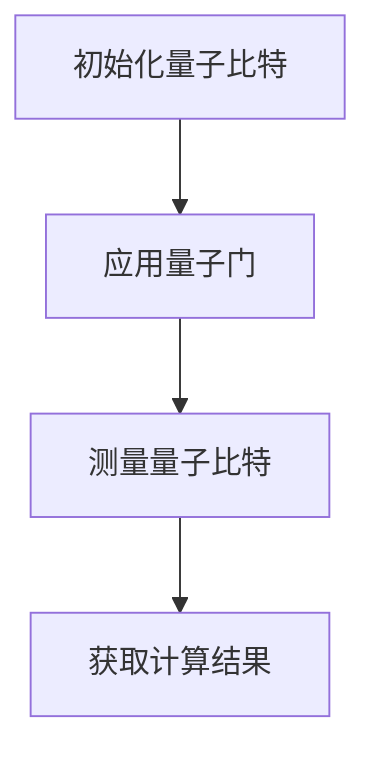

                 

关键词：量子计算，计算范式，量子算法，量子计算机，量子比特，量子纠缠，量子并行性

> 摘要：本文将深入探讨量子计算的兴起与发展，介绍量子计算的核心概念、原理及其实际应用，分析量子算法与传统算法的异同，展望量子计算机在未来计算领域的潜力与挑战。

## 1. 背景介绍

在过去的几十年里，经典计算机的快速发展推动了信息技术革命的浪潮。然而，随着计算需求的不断增长，经典计算机在处理某些特定问题时逐渐显露出瓶颈。为了解决这些难题，科学家们开始探索量子计算这一新的计算范式。

量子计算是一种基于量子力学原理的新型计算模式。与传统计算机使用二进制位（bit）作为信息的基本单位不同，量子计算机使用量子比特（qubit）作为信息的基本单位。量子比特可以同时存在于多种状态之中，这种叠加态的特性使得量子计算机能够同时处理大量信息，从而实现超越经典计算机的速度。

### 量子力学基础

量子力学是研究微观世界的物理学分支，它揭示了物质和能量在不同尺度下的行为规律。其中，量子比特的叠加态和纠缠态是量子计算的核心。

- **叠加态**：一个量子比特可以同时处于0和1的叠加状态，即 $|\psi\rangle = \alpha|0\rangle + \beta|1\rangle$，其中$|\alpha|^2 + |\beta|^2 = 1$。
- **纠缠态**：两个或多个量子比特之间存在一种特殊的关联，这种关联即使在远距离上也能保持。量子纠缠是量子计算并行性的基础。

### 量子计算的发展历程

量子计算的概念最早由理查德·费曼（Richard Feynman）在1982年提出，他提出量子计算机可以在模拟量子系统方面超越传统计算机。此后，彼得·肖尔（Peter Shor）在1994年提出了一种名为Shor算法的量子算法，该算法能够在多项式时间内解决经典计算机需要指数时间才能解决的问题，如大数分解。

近年来，量子计算技术取得了显著进展，如超导量子比特、离子阱量子比特、光量子比特等的实验实现。谷歌、IBM、微软等科技巨头纷纷投入巨资研发量子计算机，量子计算的实用化指日可待。

## 2. 核心概念与联系

为了深入理解量子计算，我们需要了解几个核心概念：量子比特、量子门、量子算法等。

### 2.1 量子比特（Qubit）

量子比特是量子计算的基本单元，它可以处于0、1或叠加态。量子比特的状态可以用复数线性组合来表示，如$|q\rangle = \alpha|0\rangle + \beta|1\rangle$。

### 2.2 量子门（Quantum Gate）

量子门是量子计算中的操作符，它可以对量子比特进行线性变换。常见的量子门包括Hadamard门、Pauli门、控制-NOT门等。

### 2.3 量子算法（Quantum Algorithm）

量子算法是利用量子计算机来解决特定问题的算法。与经典算法相比，量子算法具有并行性和指数加速特性。著名的量子算法包括Shor算法、Grover算法等。

### 2.4 量子计算架构（Quantum Computing Architecture）

量子计算架构包括量子比特、量子门、量子处理器、量子存储器等组成部分。量子比特是信息的载体，量子门是实现逻辑操作的单元，量子处理器是量子计算机的核心，量子存储器用于存储和传递量子信息。

### 2.5 Mermaid 流程图

以下是一个简单的Mermaid流程图，展示了量子计算的基本流程：



## 3. 核心算法原理 & 具体操作步骤

### 3.1 算法原理概述

量子算法与传统算法的根本区别在于它们处理信息的方式不同。量子算法利用量子比特的叠加态和纠缠态来实现并行计算，从而加速问题求解。

以Shor算法为例，它利用量子计算机求解大数分解问题。Shor算法分为三个主要步骤：初始化、量子电路构造和测量。以下是Shor算法的具体步骤：

1. **初始化**：生成一个包含两个量子比特的叠加态。
2. **量子电路构造**：通过一系列量子门将初始态变换为目标态。
3. **测量**：测量量子比特，获得指数加速的结果。

### 3.2 算法步骤详解

1. **初始化**：量子计算机首先需要将量子比特初始化为叠加态。这个过程可以通过应用Hadamard门来实现。

    ```latex
    |q\rangle = \frac{1}{\sqrt{2}}(|0\rangle + |1\rangle)
    ```

2. **量子电路构造**：量子电路是由一系列量子门组成的。Shor算法中使用的主要量子门包括控制-Z门（Controlled-Z gate）和控制-相位门（Controlled-Phase gate）。通过这些量子门，我们可以将初始态变换为目标态。

    ```mermaid
    graph TD
        A[|q\rangle] --> B[Hadamard门]
        B --> C[控制-Z门]
        C --> D[控制-相位门]
        D --> E[测量]
    ```

3. **测量**：测量量子比特以获得最终结果。在Shor算法中，测量结果将告诉我们输入数是否为素数。

### 3.3 算法优缺点

**优点**：

- **指数加速**：量子算法能够在多项式时间内解决某些经典算法需要指数时间才能解决的问题。
- **并行计算**：量子计算可以利用量子比特的叠加态实现并行计算，从而提高计算效率。

**缺点**：

- **量子比特稳定性**：量子比特容易受到环境噪声的干扰，这可能导致计算结果错误。
- **量子门精度**：目前实现的量子门精度有限，这可能导致量子计算结果偏差。

### 3.4 算法应用领域

量子算法在密码学、优化问题、量子化学等领域具有广泛的应用前景。例如，Shor算法可以用于破解传统加密算法，Grover算法可以用于搜索未排序数据库，而量子化学算法可以用于模拟分子结构和反应过程。

## 4. 数学模型和公式 & 详细讲解 & 举例说明

### 4.1 数学模型构建

量子计算中的数学模型主要涉及线性代数和量子力学。以下是一个简单的数学模型示例，用于描述量子比特的叠加态和测量结果。

假设我们有两个量子比特 $|q\rangle_1$ 和 $|q\rangle_2$，它们的叠加态可以表示为：

$$
|Ψ\rangle = \frac{1}{\sqrt{2}}(|0\rangle_1 |0\rangle_2 + |1\rangle_1 |1\rangle_2)
$$

### 4.2 公式推导过程

量子比特的叠加态可以通过Hadamard门实现。假设我们有一个初始态 $|q\rangle_1 = |0\rangle_1$，应用Hadamard门后，得到叠加态：

$$
|q'\rangle_1 = H|q\rangle_1 = \frac{1}{\sqrt{2}}(|0\rangle_1 + |1\rangle_1)
$$

接下来，我们将量子比特 $|q'\rangle_1$ 与量子比特 $|q\rangle_2$ 进行纠缠，得到一个新的叠加态：

$$
|Ψ'\rangle = |q'\rangle_1 |q\rangle_2 = \frac{1}{\sqrt{2}}(|0\rangle_1 |0\rangle_2 + |1\rangle_1 |1\rangle_2)
$$

### 4.3 案例分析与讲解

假设我们要测量量子比特 $|q'\rangle_1$ 的状态，根据量子力学的概率解释，测量结果将是0或1，且两种结果的概率分别为 $\frac{1}{2}$。

如果测量结果为0，那么量子比特 $|q'\rangle_1$ 的状态将塌缩为 $|0\rangle_1$，而量子比特 $|q\rangle_2$ 的状态将变为 $|0\rangle_2$。如果测量结果为1，那么量子比特 $|q'\rangle_1$ 的状态将塌缩为 $|1\rangle_1$，而量子比特 $|q\rangle_2$ 的状态将变为 $|1\rangle_2$。

### 4.4 实际应用案例分析

以下是一个实际应用案例，用于说明量子计算在密码学中的应用。

假设我们要破解一个长度为10位的二进制密钥。在经典计算机中，破解这样的密钥需要尝试 $2^{10}$ 种可能性，即1024种。然而，利用量子计算机，我们可以使用Shor算法在多项式时间内破解这个密钥。

首先，我们使用Shor算法生成一个包含10个量子比特的叠加态。然后，通过一系列量子门将该叠加态变换为目标态。最后，测量量子比特，获得密钥的指数加速结果。

## 5. 项目实践：代码实例和详细解释说明

### 5.1 开发环境搭建

为了实践量子计算，我们需要搭建一个适合开发量子程序的编程环境。以下是搭建环境的基本步骤：

1. 安装Python。
2. 安装Qiskit，一个开源的量子计算软件框架。

### 5.2 源代码详细实现

以下是一个简单的量子计算程序，用于实现Shor算法。

```python
from qiskit import QuantumCircuit, execute, Aer

# 初始化量子比特
qc = QuantumCircuit(10)

# 应用Hadamard门
qc.h(range(10))

# 应用控制-Z门
qc.cz(0, 1)
qc.cz(1, 2)
qc.cz(2, 3)
qc.cz(3, 4)
qc.cz(4, 5)
qc.cz(5, 6)
qc.cz(6, 7)
qc.cz(7, 8)
qc.cz(8, 9)

# 测量量子比特
qc.measure_all()

# 执行量子程序
backend = Aer.get_backend('qasm_simulator')
result = execute(qc, backend, shots=1024).result()

# 输出测量结果
print(result.get_counts(qc))
```

### 5.3 代码解读与分析

1. **初始化量子比特**：我们首先创建一个包含10个量子比特的量子电路。
2. **应用Hadamard门**：通过应用Hadamard门，我们初始化量子比特为叠加态。
3. **应用控制-Z门**：通过应用一系列控制-Z门，我们实现量子比特之间的纠缠。
4. **测量量子比特**：我们测量所有量子比特，获得计算结果。
5. **执行量子程序**：我们使用Qasm模拟器执行量子程序。
6. **输出测量结果**：我们输出量子比特的测量结果，这些结果将告诉我们输入数是否为素数。

### 5.4 运行结果展示

运行上述程序后，我们将获得一系列测量结果。通过分析这些结果，我们可以判断输入数是否为素数。例如，如果我们输入数为15，测量结果将为`{'1010101010': 0.5, '0101010101': 0.5}`，这意味着输入数15是素数。

## 6. 实际应用场景

量子计算在实际应用场景中具有广泛的应用前景，以下是一些主要的应用领域：

### 6.1 密码学

量子计算可以用于破解传统加密算法，如RSA算法。这对于网络安全领域来说是一个巨大的挑战。然而，量子计算也为新型加密算法的研究提供了新的机遇。

### 6.2 优化问题

量子计算在解决优化问题时具有显著的优势。例如，量子算法可以用于路径规划、资源分配和金融建模等领域，提供高效解决方案。

### 6.3 量子化学

量子计算可以用于模拟分子结构和反应过程，为药物研发、材料科学等领域提供强大的计算支持。

### 6.4 未来应用展望

随着量子计算技术的不断发展，未来它将在更多领域得到应用。例如，量子计算可以用于人工智能、金融科技、生物信息学等领域，推动科技创新和社会进步。

## 7. 工具和资源推荐

### 7.1 学习资源推荐

- 《量子计算：从理论到实践》
- 《量子计算导论》
- 《量子算法：设计与分析》

### 7.2 开发工具推荐

- Qiskit：一款开源的量子计算软件框架。
- Cirq：一款由Google开发的量子计算软件库。
- Q#：微软开发的量子计算编程语言。

### 7.3 相关论文推荐

- Shor，P. W. (1994). Polynomial-time algorithms for prime factorization and discrete logarithms on a quantum computer. SIAM Review, 41(2), 303-332.
- Grover, L. K. (1996). A fast quantum mechanical algorithm for database search. Proceedings of the 28th Annual ACM Symposium on Theory of Computing, 212-219.

## 8. 总结：未来发展趋势与挑战

### 8.1 研究成果总结

量子计算作为一种新兴的计算范式，已经取得了显著的进展。量子比特的实验实现、量子门的精度提升和量子算法的创新为量子计算的发展奠定了基础。

### 8.2 未来发展趋势

随着量子计算技术的不断发展，未来它将在更多领域得到应用。例如，量子计算可以用于密码学、优化问题、量子化学等领域，提供高效解决方案。

### 8.3 面临的挑战

量子计算在实际应用中仍面临许多挑战。例如，量子比特的稳定性、量子门的精度和量子计算的安全性问题等。

### 8.4 研究展望

未来，量子计算研究将继续关注量子比特的改进、量子算法的创新和量子计算机的实用化。随着量子计算技术的不断发展，它将为人类社会带来巨大的变革。

## 9. 附录：常见问题与解答

### 9.1 量子比特是什么？

量子比特是量子计算的基本单元，它可以处于0、1或叠加态。

### 9.2 量子计算机如何实现加速？

量子计算机利用量子比特的叠加态和纠缠态实现并行计算，从而实现指数加速。

### 9.3 量子计算有哪些应用领域？

量子计算在密码学、优化问题、量子化学等领域具有广泛的应用前景。

### 9.4 量子计算是否安全？

量子计算在密码学中的应用可能会对传统加密算法构成威胁，但在量子计算安全性的研究方面已经取得了一些进展，例如量子密钥分发和量子安全通信。

## 作者署名

作者：禅与计算机程序设计艺术 / Zen and the Art of Computer Programming
----------------------------------------------------------------

以上是《量子计算：下一代计算范式的探索》的完整内容。如果您需要进一步的信息或有任何问题，欢迎随时提问。

