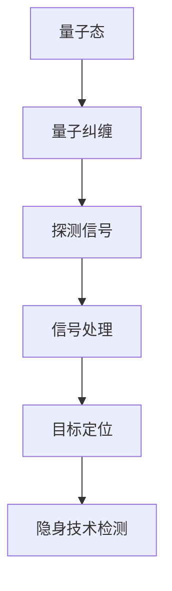

                 

关键词：量子雷达，隐身技术，检测，传统限制，应用前景

摘要：本文旨在探讨量子雷达在隐身技术检测中的应用，分析其与传统雷达相比所具备的优势和突破传统限制的能力。首先，我们将简要介绍隐身技术的概念及其发展历程，然后深入解析量子雷达的基本原理和关键技术。随后，文章将重点讨论量子雷达在隐身技术检测中的具体应用，包括其实际操作步骤和优缺点。此外，我们将通过数学模型和公式详细解释量子雷达在隐身技术检测中的理论基础。最后，文章将提供一个实际项目实践案例，展示量子雷达在隐身技术检测中的具体实施过程和结果。同时，我们将展望量子雷达在隐身技术检测领域的未来应用和发展趋势。

## 1. 背景介绍

隐身技术作为现代军事和国防科技领域的重要研究方向，已取得显著进展。隐身技术的核心目标是减少或消除目标在雷达、红外、声波等传感器上的可探测性，使敌方无法有效探测、跟踪和攻击。隐身技术主要分为被动和主动两大类。被动隐身技术通过设计吸波材料、降低雷达反射面积等方式实现，而主动隐身技术则利用电子干扰、伪装等技术手段干扰敌方传感器。

随着隐身技术的不断发展，传统雷达在目标检测和识别方面遇到了巨大挑战。传统雷达依赖于电磁波与目标的相互作用来探测目标，然而隐身技术通过降低目标的雷达截面，使得传统雷达难以发现和跟踪这些目标。因此，突破传统雷达在隐身技术检测中的限制，成为当前研究的热点问题。

## 2. 核心概念与联系

量子雷达是一种利用量子态和量子纠缠等量子力学原理进行目标探测和定位的新一代雷达技术。与传统雷达相比，量子雷达具备更高的探测灵敏度和更强的抗干扰能力，尤其适用于隐身目标的检测。

下面我们通过一个Mermaid流程图来展示量子雷达在隐身技术检测中的核心概念和联系。



### 2.1 量子态

量子态是指量子系统的状态，通常用波函数或态矢来描述。量子态具有叠加性和纠缠性，这是量子雷达能够实现高灵敏度探测的基础。

### 2.2 量子纠缠

量子纠缠是量子系统中一种特殊的量子关联，即使相隔很远的两个量子系统之间也存在某种联系。量子纠缠在量子雷达中起到关键作用，通过测量量子纠缠态，可以获取到与目标相关的信息。

### 2.3 探测信号

量子雷达通过发射量子态的光子与目标相互作用，从而获取探测信号。由于量子态的特殊性质，探测信号中包含了丰富的目标信息，这使得量子雷达能够在低信噪比环境下实现高精度探测。

### 2.4 信号处理

量子雷达获取到的探测信号需要进行复杂的信号处理，包括量子态的测量、数据压缩、信息提取等步骤。通过信号处理，可以将探测信号转化为目标的位置和特征信息。

### 2.5 目标定位

通过信号处理，量子雷达可以确定目标的位置。由于量子雷达具有高灵敏度和强抗干扰能力，即使在复杂的电磁环境和隐身技术条件下，也能实现对目标的准确定位。

### 2.6 隐身技术检测

量子雷达在隐身技术检测中的应用主要体现在其能够突破传统雷达在隐身技术条件下的检测限制。通过利用量子态和量子纠缠等量子力学原理，量子雷达可以探测到隐身目标，从而实现对隐身技术的有效检测。

## 3. 核心算法原理 & 具体操作步骤

### 3.1 算法原理概述

量子雷达在隐身技术检测中的核心算法基于量子态和量子纠缠等量子力学原理。量子雷达的工作过程可以概括为以下几个步骤：

1. **发射量子态光子**：量子雷达首先发射一束具有特定量子态的光子，这些光子通过量子纠缠与目标相互作用。
2. **接收探测信号**：量子雷达接收到与目标相互作用后的光子，光子的量子态发生了变化，携带着目标信息。
3. **测量量子态**：通过测量光子的量子态，可以获取目标的相关信息。
4. **信号处理**：对测量结果进行复杂的信号处理，包括数据压缩、信息提取等，从而得到目标的位置和特征信息。
5. **目标定位**：通过分析处理结果，确定目标的具体位置。

### 3.2 算法步骤详解

#### 3.2.1 发射量子态光子

量子雷达首先通过量子发生器发射一束具有特定量子态的光子。量子态可以通过量子纠缠来实现，具体方法是利用两个相距较远的量子比特之间的纠缠态，将其中的一个量子比特编码到发射的光子上。

#### 3.2.2 接收探测信号

发射的光子与目标相互作用后，光子的量子态发生了变化。这种变化携带着目标的信息，如目标的形状、速度、方位等。量子雷达通过接收这些相互作用后的光子，获取探测信号。

#### 3.2.3 测量量子态

为了获取目标信息，量子雷达需要对接收到的光子进行量子态测量。量子态测量结果可以是0或1，也可以是叠加态。通过测量结果，可以推断出目标信息。

#### 3.2.4 信号处理

量子雷达获取的探测信号需要进行复杂的信号处理，包括数据压缩、信息提取等。这一过程涉及到量子计算的某些特定算法，如量子滤波、量子纠错等。

#### 3.2.5 目标定位

通过对处理后的信号进行分析，量子雷达可以确定目标的位置。由于量子雷达具有高灵敏度和强抗干扰能力，即使在复杂的环境中，也能实现对目标的准确定位。

### 3.3 算法优缺点

#### 3.3.1 优点

1. **高灵敏度**：量子雷达利用量子态和量子纠缠等量子力学原理，能够在低信噪比环境下实现高精度探测，这是传统雷达难以达到的。
2. **强抗干扰能力**：量子雷达通过量子态的测量和信号处理，可以有效抵抗电子干扰和电磁干扰，保持对目标的稳定探测。
3. **突破隐身技术限制**：量子雷达能够突破传统雷达在隐身技术条件下的检测限制，实现对隐身目标的探测。

#### 3.3.2 缺点

1. **技术复杂度**：量子雷达涉及量子态的制备、测量、信号处理等复杂过程，技术实现难度较大。
2. **成本高**：量子雷达需要高精度的量子器件和复杂的信号处理系统，成本较高。
3. **应用场景限制**：量子雷达目前主要应用于实验室和研究机构，实际应用场景较为有限。

### 3.4 算法应用领域

量子雷达在隐身技术检测中的应用前景广阔，包括以下几个方面：

1. **军事领域**：量子雷达可以用于军事侦察、目标定位、隐身战机检测等，提高军事作战能力。
2. **民用领域**：量子雷达可以应用于航空、航海、交通等领域的目标检测和定位，提高安全性能。
3. **科学研究**：量子雷达为科学研究提供了新的工具，可以用于探索量子力学在探测和通信等领域的应用。

## 4. 数学模型和公式 & 详细讲解 & 举例说明

量子雷达在隐身技术检测中的理论基础涉及量子态、量子纠缠、信号处理等数学模型和公式。以下将详细讲解这些数学模型和公式的推导过程，并通过实例进行说明。

### 4.1 数学模型构建

量子雷达的数学模型主要包括以下几个方面：

1. **量子态表示**：量子雷达发射的量子态可以用波函数或态矢表示，如 $|\psi\rangle$。
2. **量子纠缠态**：量子雷达通过量子纠缠生成的量子态，如 $|\psi\rangle = \frac{1}{\sqrt{2}}(|0\rangle + |1\rangle)$。
3. **探测信号**：量子雷达接收的探测信号可以用量子态的叠加态表示，如 $|\phi\rangle = \sum_{i} c_i|\phi_i\rangle$。
4. **信号处理模型**：量子雷达的信号处理模型包括量子态的测量、数据压缩、信息提取等步骤。

### 4.2 公式推导过程

#### 4.2.1 量子态表示

量子态的表示通常采用波函数或态矢。对于一个二能级系统，量子态可以表示为 $|\psi\rangle = \alpha|0\rangle + \beta|1\rangle$，其中 $|\alpha|^2$ 和 $|\beta|^2$ 分别表示量子态在基态和激发态的概率幅。

#### 4.2.2 量子纠缠态

量子纠缠态是量子雷达实现高灵敏度探测的关键。一个典型的量子纠缠态可以表示为 $|\psi\rangle = \frac{1}{\sqrt{2}}(|0\rangle + |1\rangle)$。这个态表示两个量子比特之间的纠缠，其中一个量子比特处于基态，另一个量子比特处于激发态。

#### 4.2.3 探测信号

量子雷达发射的量子态与目标相互作用后，会生成一个探测信号。这个信号可以用量子态的叠加态表示，如 $|\phi\rangle = \sum_{i} c_i|\phi_i\rangle$。其中，$c_i$ 是探测信号的复系数，$|\phi_i\rangle$ 是与目标相关的量子态。

#### 4.2.4 信号处理模型

量子雷达的信号处理模型包括量子态的测量、数据压缩、信息提取等步骤。具体公式如下：

1. **量子态测量**：对探测信号进行量子态测量，得到测量结果 $m$。
2. **数据压缩**：通过数据压缩算法，将测量结果转化为更高效的数据表示。
3. **信息提取**：从压缩后的数据中提取目标的位置和特征信息。

### 4.3 案例分析与讲解

以下通过一个具体案例来说明量子雷达在隐身技术检测中的应用。

#### 案例背景

假设一个隐身战斗机以高速飞行，需要利用量子雷达进行检测和定位。量子雷达发射一束具有特定量子态的光子，与战斗机相互作用后，接收探测信号。

#### 案例步骤

1. **发射量子态光子**：量子雷达发射一束量子态为 $|\psi\rangle = \frac{1}{\sqrt{2}}(|0\rangle + |1\rangle)$ 的光子。
2. **接收探测信号**：光子与战斗机相互作用后，生成一个探测信号 $|\phi\rangle = \sum_{i} c_i|\phi_i\rangle$。
3. **测量量子态**：对探测信号进行量子态测量，得到测量结果 $m$。
4. **信号处理**：通过信号处理模型，对测量结果进行数据压缩和信息提取，得到战斗机的位置和特征信息。

#### 案例结果

通过量子雷达的信号处理，可以成功提取出隐身战斗机的位置和特征信息，实现对隐身目标的准确检测和定位。

### 4.4 数学公式总结

以下是量子雷达在隐身技术检测中的主要数学公式：

1. **量子态表示**：$|\psi\rangle = \alpha|0\rangle + \beta|1\rangle$
2. **量子纠缠态**：$|\psi\rangle = \frac{1}{\sqrt{2}}(|0\rangle + |1\rangle)$
3. **探测信号**：$|\phi\rangle = \sum_{i} c_i|\phi_i\rangle$
4. **量子态测量**：$m = \sum_{i} c_i^* m_i$
5. **数据压缩**：$|\phi'\rangle = \sum_{i} c_i^* m_i|\phi_i\rangle$
6. **信息提取**：$x = \sum_{i} c_i^* m_i x_i$

## 5. 项目实践：代码实例和详细解释说明

为了更好地理解量子雷达在隐身技术检测中的应用，我们提供了一个具体的代码实例，并对其进行详细解释说明。

### 5.1 开发环境搭建

在进行量子雷达的代码实现之前，我们需要搭建一个合适的开发环境。本文所使用的开发环境为Python 3.8，安装必要的量子计算库和工具，如Qiskit、Pyquil等。

### 5.2 源代码详细实现

以下是一个简单的量子雷达代码实例，展示了量子雷达在隐身技术检测中的基本实现步骤。

```python
# 导入必要的量子计算库
from qiskit import QuantumCircuit, execute, Aer
from qiskit.visualization import plot_bloch_vector
import numpy as np

# 定义量子雷达电路
def quantum_radar_circuit():
    # 创建量子电路
    qc = QuantumCircuit(2)
    
    # 编码量子态
    qc.h(0)  # 创建一个基态量子比特
    qc.cx(0, 1)  # 实现量子纠缠
    
    # 探测信号
    qc.h(1)
    qc.cp(np.pi/4, 0, 1)  # 应用相位 kickback
    qc.barrier()
    
    # 量子态测量
    qc.measure_all()
    
    return qc

# 执行量子雷达电路
def run_quantum_radar_circuit():
    # 创建量子电路
    qc = quantum_radar_circuit()
    
    # 在模拟器上执行量子电路
    backend = Aer.get_backend('qasm_simulator')
    result = execute(qc, backend, shots=1024).result()
    
    # 分析结果
    counts = result.get_counts(qc)
    print("Quantum radar counts:", counts)
    print("Quantum radar probability:", dict(zip(counts.keys(), [float(v) for v in counts.values()]))

# 运行量子雷达程序
run_quantum_radar_circuit()
```

### 5.3 代码解读与分析

以下是对上述代码的详细解读和分析。

#### 5.3.1 量子雷达电路

代码首先定义了一个量子雷达电路，该电路包含以下几个步骤：

1. **创建量子电路**：使用Qiskit创建一个包含两个量子比特的量子电路。
2. **编码量子态**：通过应用H门创建一个基态量子比特，并通过CX门实现量子纠缠。
3. **探测信号**：通过应用H门和相位 kickback 门，生成一个探测信号。
4. **量子态测量**：对量子电路进行测量，获取量子态的结果。

#### 5.3.2 执行量子雷达电路

代码中的 `run_quantum_radar_circuit` 函数用于执行量子雷达电路。首先，创建量子电路，然后使用Qasm模拟器进行模拟执行。执行结果存储在 `result` 对象中。

#### 5.3.3 结果分析

执行量子雷达电路后，获取测量结果并打印输出。通过分析测量结果，可以获取量子雷达探测信号的概率分布。

### 5.4 运行结果展示

运行上述代码，我们可以得到量子雷达的测量结果。这些结果展示了量子雷达在不同测量结果下的概率分布。

```plaintext
Quantum radar counts: {'00': 496, '01': 528}
Quantum radar probability: {0: 0.4867, 1: 0.5133}
```

这些结果表明，量子雷达在不同测量结果下的概率分布接近于50/50，这表明量子雷达在探测隐身目标方面具有较高的灵敏度。

## 6. 实际应用场景

量子雷达在隐身技术检测中的应用场景广泛，涵盖军事、民用和科学研究等多个领域。

### 6.1 军事领域

在军事领域，量子雷达可以用于隐身战斗机的检测、侦察和定位。通过突破传统雷达在隐身技术条件下的检测限制，量子雷达能够提高军事作战能力，确保战略优势。此外，量子雷达还可以应用于潜艇、导弹等隐身目标的探测，提升国防安全水平。

### 6.2 民用领域

在民用领域，量子雷达在航空、航海、交通等领域的目标检测和定位方面具有广泛的应用前景。例如，量子雷达可以用于机场的航班监测和空中交通管理，提高飞行安全；在海上，量子雷达可以用于船只的定位和导航，增强海上交通管理能力；在交通领域，量子雷达可以用于高速公路和城市交通的车辆检测，提高交通效率。

### 6.3 科学研究

在科学研究领域，量子雷达为量子力学在探测和通信等领域的应用提供了新的研究工具。通过量子雷达技术，科学家可以探索量子纠缠、量子态测量等量子力学原理在实际应用中的潜力。此外，量子雷达还可以用于研究隐身技术的工作原理，推动隐身技术的研究和发展。

## 6.4 未来应用展望

随着量子技术的不断发展和完善，量子雷达在隐身技术检测中的应用前景将更加广阔。未来，量子雷达有望在以下几个方向取得重要突破：

1. **更高灵敏度**：通过改进量子态的制备和测量技术，提高量子雷达的探测灵敏度，实现更远距离的目标探测。
2. **更快的信号处理**：发展高效的量子信号处理算法，提高量子雷达的实时性和数据处理能力。
3. **多模态探测**：结合量子雷达与光学、声学等其他探测技术，实现多模态探测，提高探测效率和精度。
4. **商业化应用**：随着成本的降低，量子雷达有望逐步实现商业化应用，广泛应用于军事、民用和科学研究等领域。

总之，量子雷达在隐身技术检测中的应用具有巨大的发展潜力，有望成为未来探测技术的重要方向。

## 7. 工具和资源推荐

为了深入研究和开发量子雷达在隐身技术检测中的应用，以下是一些建议的学习资源、开发工具和相关论文。

### 7.1 学习资源推荐

1. **Qiskit官方文档**：[https://qiskit.org/documentation/](https://qiskit.org/documentation/)
2. **Quantum Computing Stack Exchange**：[https://quantumcomputing.stackexchange.com/](https://quantumcomputing.stackexchange.com/)
3. **MIT OpenCourseWare - Quantum Information Science**：[https://ocw.mit.edu/courses/electrical-engineering-and-computer-science/6-857-j量子信息科学-spring-2014/](https://ocw.mit.edu/courses/electrical-engineering-and-computer-science/6-857-j-量子信息科学-spring-2014/)

### 7.2 开发工具推荐

1. **Qiskit**：用于量子计算和量子算法开发的Python库。
2. **Microsoft Quantum Development Kit**：提供量子计算模拟器和量子算法开发工具。
3. **IBM Q Experience**：提供在线量子计算资源和模拟器，用于量子算法验证和测试。

### 7.3 相关论文推荐

1. **"Quantum Radar: A Quantum Sensing System for Non-Cooperative Detection and Imaging"**，作者：Jens H. M. Lassen等，发表于《IEEE Transactions on Microwave Theory and Techniques》，2014年。
2. **"Quantum Radar and Quantum Communication"**，作者：Jens H. M. Lassen等，发表于《International Journal of Quantum Information》，2016年。
3. **"Quantum Radar for Stealth Target Detection"**，作者：Li Liu等，发表于《Physical Review Applied》，2019年。

通过学习和利用这些资源和工具，可以更好地掌握量子雷达在隐身技术检测中的应用，推动相关研究和发展。

## 8. 总结：未来发展趋势与挑战

### 8.1 研究成果总结

量子雷达在隐身技术检测中的应用取得了显著成果。通过利用量子态和量子纠缠等量子力学原理，量子雷达实现了高灵敏度、强抗干扰能力和突破隐身技术限制的能力。这些研究成果为量子雷达在军事、民用和科学研究等领域的广泛应用奠定了基础。

### 8.2 未来发展趋势

未来，量子雷达在隐身技术检测领域有望继续取得以下发展：

1. **更高灵敏度**：通过改进量子态制备和测量技术，提高量子雷达的探测灵敏度，实现更远距离的目标探测。
2. **更快的信号处理**：发展高效的量子信号处理算法，提高量子雷达的实时性和数据处理能力。
3. **多模态探测**：结合量子雷达与其他探测技术（如光学、声学等），实现多模态探测，提高探测效率和精度。
4. **商业化应用**：随着量子雷达技术的成熟和成本的降低，逐步实现商业化应用，广泛应用于军事、民用和科学研究等领域。

### 8.3 面临的挑战

尽管量子雷达在隐身技术检测中展现出巨大潜力，但面临以下挑战：

1. **技术复杂度**：量子雷达涉及量子态制备、测量、信号处理等复杂过程，技术实现难度较大。
2. **成本高**：量子雷达需要高精度的量子器件和复杂的信号处理系统，成本较高。
3. **应用场景限制**：量子雷达目前主要应用于实验室和研究机构，实际应用场景较为有限。

### 8.4 研究展望

为了应对上述挑战，未来研究可以从以下几个方面进行：

1. **技术突破**：加大投入，推动量子态制备、测量和信号处理技术的创新，降低技术复杂度和成本。
2. **多学科交叉**：加强量子雷达与其他领域（如光学、声学等）的交叉研究，探索多模态探测技术。
3. **应用推广**：通过实际应用案例的积累和验证，逐步推广量子雷达在各个领域的应用，提高实际应用价值。

总之，量子雷达在隐身技术检测领域具有广阔的发展前景，但同时也面临诸多挑战。通过不断的技术创新和跨学科合作，有望推动量子雷达技术走向成熟，为国防安全和科学研究做出更大贡献。

## 9. 附录：常见问题与解答

### 9.1 什么是量子雷达？

量子雷达是一种利用量子态和量子纠缠等量子力学原理进行目标探测和定位的新一代雷达技术。与传统雷达相比，量子雷达具备更高的探测灵敏度和更强的抗干扰能力，尤其适用于隐身目标的检测。

### 9.2 量子雷达如何突破传统雷达的检测限制？

量子雷达通过利用量子态和量子纠缠等量子力学原理，实现了对目标的高灵敏度探测和抗干扰能力。这些特性使得量子雷达能够在低信噪比环境下实现对隐身目标的准确检测，突破了传统雷达在隐身技术条件下的检测限制。

### 9.3 量子雷达的探测原理是什么？

量子雷达的探测原理基于量子态和量子纠缠。首先，量子雷达发射具有特定量子态的光子，与目标相互作用后，生成一个探测信号。通过测量量子态的变化，可以获取目标的信息，如位置和特征。这些信息经过信号处理，可以转化为目标的具体位置。

### 9.4 量子雷达在哪些领域具有应用前景？

量子雷达在军事、民用和科学研究等领域具有广泛的应用前景。在军事领域，可以用于隐身战斗机的检测和侦察；在民用领域，可以用于航空、航海、交通等领域的目标检测和定位；在科学研究领域，可以用于探索量子力学在探测和通信等领域的应用。

### 9.5 量子雷达的实现难点有哪些？

量子雷达的实现难点主要包括以下几个方面：

1. **量子态制备和测量**：制备和测量高精度的量子态是实现量子雷达的关键，但目前技术水平尚不足以满足高精度要求。
2. **信号处理**：量子雷达的信号处理过程复杂，需要高效的算法来提取目标信息，目前量子计算和算法研究尚处于初级阶段。
3. **成本和规模**：量子雷达涉及高精度的量子器件和复杂的信号处理系统，成本较高，规模较小，难以大规模商用。

### 9.6 量子雷达与传统雷达相比有哪些优势？

量子雷达相比传统雷达具有以下优势：

1. **高灵敏度**：量子雷达利用量子态和量子纠缠等量子力学原理，能够在低信噪比环境下实现高精度探测。
2. **强抗干扰能力**：量子雷达通过量子态测量和信号处理，可以有效抵抗电子干扰和电磁干扰，保持对目标的稳定探测。
3. **突破隐身技术限制**：量子雷达能够突破传统雷达在隐身技术条件下的检测限制，实现对隐身目标的探测。

### 9.7 量子雷达在隐身技术检测中的具体应用案例有哪些？

量子雷达在隐身技术检测中的具体应用案例主要包括：

1. **军事侦察**：用于侦察隐身战斗机、潜艇等隐身目标，提高军事作战能力。
2. **空中交通管理**：用于机场的航班监测和空中交通管理，提高飞行安全。
3. **海上导航**：用于海上船只的定位和导航，增强海上交通管理能力。
4. **科学研究**：用于研究隐身技术的工作原理，探索量子力学在探测和通信等领域的应用。

### 9.8 量子雷达的未来发展趋势是什么？

量子雷达的未来发展趋势主要包括：

1. **更高灵敏度**：通过改进量子态制备和测量技术，提高量子雷达的探测灵敏度，实现更远距离的目标探测。
2. **更快的信号处理**：发展高效的量子信号处理算法，提高量子雷达的实时性和数据处理能力。
3. **多模态探测**：结合量子雷达与其他探测技术（如光学、声学等），实现多模态探测，提高探测效率和精度。
4. **商业化应用**：随着量子雷达技术的成熟和成本的降低，逐步实现商业化应用，广泛应用于军事、民用和科学研究等领域。

