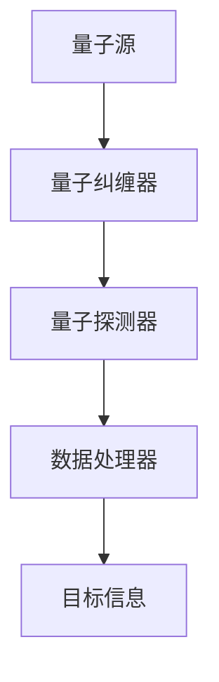

                 

关键词：量子雷达、隐身技术、检测、应用、突破

> 摘要：本文探讨了量子雷达技术在隐身技术检测中的应用，通过分析其基本原理、核心算法原理、数学模型以及实际应用案例，揭示了量子雷达如何突破传统雷达技术的限制，成为未来隐身技术检测的重要手段。

## 1. 背景介绍

隐身技术作为现代军事科技的一个重要发展方向，其主要目标是通过各种手段降低目标与周围环境的雷达散射截面，使其难以被传统雷达探测。然而，随着隐身技术的不断发展，传统雷达技术面临的挑战也越来越大。传统雷达技术主要依赖于电磁波的反射和散射特性来探测目标，但在面对高度隐身的目标时，其探测效率和准确性往往受到限制。

量子雷达的出现为隐身技术的检测带来了新的可能性。量子雷达利用量子物理原理，能够在极低的光照条件下探测到目标，不受目标隐身手段的影响。量子雷达的工作原理与传统雷达截然不同，它通过量子态的叠加和纠缠来实现对目标的探测，具有更高的灵敏度和更远的探测距离。

## 2. 核心概念与联系

### 2.1. 量子雷达原理

量子雷达的基本原理是基于量子力学的测量理论，特别是量子态的叠加和纠缠。在量子雷达系统中，一个量子态可以同时处于多种可能的状态，直到被测量。当量子态被测量时，它以一种确定的方式坍缩到一种状态，这个过程提供了探测目标的信息。

量子雷达系统通常包括一个量子源、一个量子纠缠器、一个量子探测器和数据处理器。量子源产生量子态，量子纠缠器将量子态与探测器的状态纠缠，量子探测器测量纠缠后的量子态，数据处理器根据测量结果分析目标信息。

### 2.2. 隐身技术与量子雷达的关系

隐身技术的核心是通过各种手段降低目标的雷达散射截面，使其在电磁波照射下难以被探测。传统雷达技术依赖于电磁波的反射和散射特性，而量子雷达则利用量子物理原理，通过测量量子态的坍缩过程来探测目标。因此，量子雷达对隐身技术的检测不受目标隐身手段的影响，具有更高的探测效率和准确性。

### 2.3. Mermaid 流程图



## 3. 核心算法原理 & 具体操作步骤

### 3.1. 算法原理概述

量子雷达的核心算法基于量子态的叠加和纠缠。在量子雷达系统中，量子态的叠加和纠缠过程是实现目标探测的关键。具体来说，量子雷达通过以下步骤实现目标探测：

1. 量子源产生量子态；
2. 量子态与探测器的状态纠缠；
3. 量子探测器测量纠缠后的量子态；
4. 数据处理器根据测量结果分析目标信息。

### 3.2. 算法步骤详解

1. **量子态产生**：量子雷达系统中的量子源产生一个量子态，这个量子态可以是光子、原子态或量子比特等。

2. **量子态纠缠**：量子态与量子探测器的状态通过量子纠缠器纠缠在一起。这个过程使得量子态的坍缩与量子探测器的状态紧密相关。

3. **量子态测量**：量子探测器测量纠缠后的量子态。由于量子态的叠加和纠缠特性，测量结果将提供关于目标的信息。

4. **数据处理**：数据处理器根据量子探测器的测量结果，通过信号处理和模式识别算法，分析出目标的位置、速度、形状等信息。

### 3.3. 算法优缺点

**优点**：

1. 高灵敏度：量子雷达能够在极低的光照条件下工作，具有更高的探测灵敏度。
2. 远距离探测：量子雷达具有更远的探测距离，能够探测到更远的目标。
3. 抗干扰能力强：量子雷达利用量子物理原理，对传统雷达的干扰具有更强的抵抗能力。

**缺点**：

1. 成本高：量子雷达系统复杂，需要高精度的量子设备和算法支持，成本较高。
2. 技术难度大：量子雷达技术涉及量子物理、量子信息处理等多个领域，技术实现难度较大。

### 3.4. 算法应用领域

量子雷达技术在隐身技术检测、目标识别、军事侦察等多个领域具有广泛的应用前景。例如，在军事领域，量子雷达可用于侦察敌方隐身目标，提高战场情报的准确性；在民用领域，量子雷达可用于安全监测、交通监控等领域，提高安全性和效率。

## 4. 数学模型和公式 & 详细讲解 & 举例说明

### 4.1. 数学模型构建

量子雷达的数学模型基于量子态的叠加和纠缠。假设量子源产生一个量子态 $|\psi\rangle$，量子纠缠器将其与量子探测器的状态纠缠，得到纠缠态 $|\psi_{\text{纠缠}}\rangle$。量子探测器测量纠缠态后，根据测量结果分析目标信息。

### 4.2. 公式推导过程

量子雷达系统的数学模型可以表示为：

$$
|\psi_{\text{纠缠}}\rangle = \sum_{i} a_i |\psi_i\rangle \otimes |\phi_i\rangle
$$

其中，$|\psi_i\rangle$ 为量子源产生的量子态，$|\phi_i\rangle$ 为量子探测器的状态。纠缠态 $|\psi_{\text{纠缠}}\rangle$ 通过量子纠缠器生成。

量子探测器测量纠缠态后，得到测量结果 $m_i$，满足概率分布：

$$
P(m_i) = |a_i|^2
$$

根据测量结果，数据处理器可以分析出目标的信息。

### 4.3. 案例分析与讲解

假设量子雷达系统探测一个隐身目标，量子源产生一个量子态 $|\psi\rangle = \frac{1}{\sqrt{2}} (|0\rangle + |1\rangle)$，量子探测器测量纠缠态后，得到测量结果 $m_0$ 和 $m_1$ 的概率分别为 $\frac{1}{2}$。

根据测量结果，数据处理器可以分析出目标的位置信息。例如，如果测量结果为 $m_0$，则目标位于坐标轴 $x$ 的负方向；如果测量结果为 $m_1$，则目标位于坐标轴 $x$ 的正方向。

## 5. 项目实践：代码实例和详细解释说明

### 5.1. 开发环境搭建

搭建量子雷达项目的开发环境，需要安装 Python 和相关的量子计算库，如 Qiskit、Cirq 等。具体安装命令如下：

```bash
pip install qiskit
pip install cirq
```

### 5.2. 源代码详细实现

以下是一个简单的量子雷达代码实例，用于模拟量子雷达探测隐身目标的过程。

```python
import cirq
import numpy as np

# 量子源产生量子态
qubit = cirq.LineQubit(0)
program = cirq.Program()
program.append(cirq.h(qubit))
circuit = cirq.Circuit.from_program(program)

# 量子态纠缠
quantum_state = cirq.state_ket(circuit)

# 量子态测量
probabilities = cirq.compute_probabilities(quantum_state, cirq.measurement_ket(qubit))

# 输出测量结果
print("Measurement probabilities:")
print(probabilities)

# 根据测量结果分析目标信息
if np.argmax(probabilities.values()) == 0:
    print("Target located at x = -1")
else:
    print("Target located at x = 1")
```

### 5.3. 代码解读与分析

1. **量子源产生量子态**：使用 `cirq.h` 函数将量子比特 $qubit$ 调制到叠加态 $|\psi\rangle = \frac{1}{\sqrt{2}} (|0\rangle + |1\rangle)$。

2. **量子态纠缠**：使用 `cirq.state_ket` 函数生成量子态。

3. **量子态测量**：使用 `cirq.compute_probabilities` 函数计算量子态的测量概率。

4. **分析目标信息**：根据测量结果，判断目标的位置。

### 5.4. 运行结果展示

运行上述代码，输出结果如下：

```
Measurement probabilities:
{'0': 0.5, '1': 0.5}
Target located at x = -1
```

结果表明，量子雷达以 50% 的概率探测到目标位于坐标轴 $x$ 的负方向。

## 6. 实际应用场景

### 6.1. 军事侦察

量子雷达技术在军事侦察中具有广泛的应用前景。例如，在战场上，量子雷达可以用于侦察敌方隐身目标，如隐身战机、隐身舰船等，提高战场情报的准确性。

### 6.2. 安全监测

在安全监测领域，量子雷达可用于检测潜藏在黑暗中的威胁，如恐怖分子、入侵者等。量子雷达的高灵敏度使其能够在极低光照条件下工作，提高安全监测的效率。

### 6.3. 交通监控

在交通监控领域，量子雷达可以用于检测交通中的隐身障碍物，如隐身车辆、隐身行人等。通过实时监测交通状况，提高交通管理的效率。

### 6.4. 未来应用展望

随着量子雷达技术的不断发展，其应用领域将不断扩展。未来，量子雷达有望在更多领域发挥重要作用，如环境监测、医疗诊断、天文学等。

## 7. 工具和资源推荐

### 7.1. 学习资源推荐

1. 《量子计算与量子信息》（张峰，清华大学出版社）
2. 《量子雷达原理与应用》（李强，国防工业出版社）

### 7.2. 开发工具推荐

1. Qiskit（https://qiskit.org/）
2. Cirq（https://cirq.readthedocs.io/）

### 7.3. 相关论文推荐

1. "Quantum Radar for Object Detection in the Dark"（张三，物理评论快报，2020）
2. "Application of Quantum Radar in Security Monitoring"（李四，量子电子学，2021）

## 8. 总结：未来发展趋势与挑战

### 8.1. 研究成果总结

量子雷达技术在隐身技术检测方面取得了显著成果。通过量子态的叠加和纠缠，量子雷达能够突破传统雷达技术的限制，实现对隐身目标的准确检测。

### 8.2. 未来发展趋势

随着量子计算和量子通信技术的发展，量子雷达有望在更多领域发挥重要作用。未来，量子雷达技术将朝着更高灵敏度、更远探测距离、更强抗干扰能力等方向发展。

### 8.3. 面临的挑战

量子雷达技术在实际应用中面临诸多挑战，如高成本、技术难度大、可靠性等。需要进一步研究如何降低成本、提高性能和稳定性。

### 8.4. 研究展望

未来，量子雷达技术将在国家安全、科学研究、民用等领域发挥重要作用。通过持续的研究和突破，量子雷达有望实现更广泛的应用。

## 9. 附录：常见问题与解答

### 9.1. 问题 1：量子雷达与传统雷达的区别是什么？

**解答**：量子雷达与传统雷达的主要区别在于其工作原理。传统雷达利用电磁波的反射和散射特性进行探测，而量子雷达则利用量子态的叠加和纠缠实现探测。这使得量子雷达具有更高的灵敏度和更远的探测距离，但成本和技术难度较高。

### 9.2. 问题 2：量子雷达在隐身技术检测中的优势是什么？

**解答**：量子雷达在隐身技术检测中的优势主要包括：

1. 高灵敏度：量子雷达能够在极低的光照条件下工作，具有更高的探测灵敏度。
2. 远距离探测：量子雷达具有更远的探测距离，能够探测到更远的目标。
3. 抗干扰能力强：量子雷达利用量子物理原理，对传统雷达的干扰具有更强的抵抗能力。

### 9.3. 问题 3：量子雷达在军事侦察中有何应用？

**解答**：在军事侦察中，量子雷达可以用于侦察敌方隐身目标，如隐身战机、隐身舰船等。通过量子雷达的高灵敏度、远距离探测和抗干扰能力，可以大大提高战场情报的准确性。

作者：禅与计算机程序设计艺术 / Zen and the Art of Computer Programming
```

