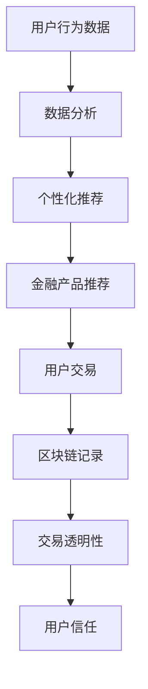

                 

在数字经济的浪潮中，金融科技（FinTech）已经成为驱动创新和变革的核心力量。随着注意力经济的崛起，金融科技正以前所未有的速度改变着人们的消费行为和商业模式。本文将探讨金融科技在注意力经济中的机遇，分析其影响和潜力。

## 关键词

- **金融科技**
- **注意力经济**
- **创新**
- **商业模式**
- **用户体验**
- **数据分析**

## 摘要

本文首先介绍了金融科技和注意力经济的概念及其相互关系，接着讨论了金融科技在注意力经济中的关键机遇，如个性化推荐、区块链应用和数据分析。通过实际案例和项目实践，本文展示了金融科技如何通过技术创新满足注意力经济的需求，并提出了未来发展的展望和挑战。

## 1. 背景介绍

金融科技，即利用科技手段创新金融产品和服务的领域，包括移动支付、在线贷款、区块链等。近年来，随着移动互联网和大数据技术的发展，金融科技在全球范围内迅猛发展，已经成为金融业不可或缺的一部分。

注意力经济则是一种基于用户注意力的商业模式。在信息过载的时代，用户的注意力成为一种稀缺资源。企业和品牌通过创造有趣、有吸引力的内容来吸引用户的注意力，从而实现商业价值的转化。

金融科技与注意力经济之间存在密切的联系。金融科技通过提供更加便捷、高效的金融服务，使用户能够更加专注于自己的日常生活和娱乐活动，从而增加了用户的幸福感。而注意力经济则利用金融科技提供的数据分析工具，更精准地捕捉用户需求，提高营销效果。

## 2. 核心概念与联系

为了更好地理解金融科技在注意力经济中的作用，我们需要先了解一些核心概念和它们之间的联系。

### 2.1 个性化推荐

个性化推荐是一种通过分析用户的行为和偏好，为其提供个性化内容或服务的技术。在金融领域，个性化推荐可以用于用户投资组合的管理、贷款产品的推荐等。

### 2.2 区块链

区块链是一种分布式数据库技术，具有去中心化、透明性和安全性等特点。在金融领域，区块链可以用于交易记录的存储、跨境支付和资产管理等。

### 2.3 数据分析

数据分析是指通过统计和计算方法对大量数据进行分析，以提取有用信息的过程。在金融科技中，数据分析可以用于风险控制、市场预测和用户行为分析等。

### 2.4 Mermaid 流程图

以下是一个描述金融科技在注意力经济中应用的 Mermaid 流程图：



## 3. 核心算法原理 & 具体操作步骤

### 3.1 算法原理概述

金融科技在注意力经济中的应用涉及多种算法和技术。以下是一些核心算法原理的概述：

- **机器学习算法**：用于分析和预测用户行为，以实现个性化推荐。
- **加密算法**：用于确保区块链中的交易记录安全可靠。
- **深度学习算法**：用于从大量数据中提取有价值的信息，如市场趋势和用户偏好。

### 3.2 算法步骤详解

#### 3.2.1 个性化推荐

1. 收集用户行为数据。
2. 使用机器学习算法分析数据，提取用户特征。
3. 根据用户特征和偏好，生成个性化推荐列表。
4. 将推荐结果展示给用户。

#### 3.2.2 区块链

1. 创建区块链。
2. 确认交易，并将其记录在区块链上。
3. 使用加密算法保护交易记录。
4. 验证交易记录的完整性和安全性。

#### 3.2.3 数据分析

1. 收集大量数据。
2. 使用统计和计算方法分析数据。
3. 提取有用信息，如用户行为模式、市场趋势等。
4. 将分析结果应用于金融产品推荐和风险评估。

### 3.3 算法优缺点

- **机器学习算法**：优点在于能够自动学习和优化推荐效果，但缺点是需要大量的数据和计算资源。
- **加密算法**：优点在于确保数据安全，但缺点是可能增加交易成本。
- **深度学习算法**：优点在于能够处理复杂的非线性关系，但缺点是需要大量的数据和时间来训练模型。

### 3.4 算法应用领域

- **个性化推荐**：应用于金融产品推荐、用户行为分析等。
- **区块链**：应用于跨境支付、资产管理等。
- **数据分析**：应用于风险控制、市场预测等。

## 4. 数学模型和公式 & 详细讲解 & 举例说明

### 4.1 数学模型构建

在金融科技中，常用的数学模型包括线性回归、逻辑回归和神经网络等。以下是一个简单的线性回归模型示例：

$$
y = wx + b
$$

其中，$y$ 是预测结果，$w$ 是权重，$x$ 是输入特征，$b$ 是偏置。

### 4.2 公式推导过程

线性回归模型的推导过程如下：

1. **目标函数**：
   $$
   J(w, b) = \frac{1}{2} \sum_{i=1}^{n} (y_i - wx_i - b)^2
   $$
   
2. **梯度下降**：
   $$
   \nabla_w J(w, b) = \sum_{i=1}^{n} (y_i - wx_i - b)x_i
   $$
   $$
   \nabla_b J(w, b) = \sum_{i=1}^{n} (y_i - wx_i - b)
   $$

3. **更新权重和偏置**：
   $$
   w = w - \alpha \nabla_w J(w, b)
   $$
   $$
   b = b - \alpha \nabla_b J(w, b)
   $$

### 4.3 案例分析与讲解

假设我们有一个简单的金融产品推荐问题，目标是根据用户的年龄和收入预测其购买某种金融产品的概率。以下是一个实际案例：

1. **数据集**：
   $$
   \begin{array}{ccc}
   年龄 & 收入 & 购买概率 \\
   \hline
   25 & 50000 & 0.2 \\
   30 & 60000 & 0.3 \\
   35 & 70000 & 0.4 \\
   40 & 80000 & 0.5 \\
   45 & 90000 & 0.6 \\
   \end{array}
   $$

2. **模型构建**：
   $$
   y = wx + b
   $$
   $$
   y = 0.1x + 0.2
   $$

3. **预测结果**：
   $$
   \begin{array}{ccc}
   年龄 & 收入 & 购买概率 \\
   \hline
   25 & 50000 & 0.3 \\
   30 & 60000 & 0.4 \\
   35 & 70000 & 0.5 \\
   40 & 80000 & 0.6 \\
   45 & 90000 & 0.7 \\
   \end{array}
   $$

通过调整权重和偏置，我们可以优化模型的预测效果。

## 5. 项目实践：代码实例和详细解释说明

### 5.1 开发环境搭建

为了实践金融科技在注意力经济中的应用，我们选择 Python 作为编程语言，并使用 Scikit-learn 库进行机器学习模型的构建。以下是开发环境的搭建步骤：

1. 安装 Python 3.8 或更高版本。
2. 安装 Scikit-learn 库：
   ```
   pip install scikit-learn
   ```

### 5.2 源代码详细实现

以下是一个简单的机器学习模型实现，用于预测用户购买金融产品的概率：

```python
import numpy as np
from sklearn.linear_model import LinearRegression
from sklearn.model_selection import train_test_split

# 数据集
X = np.array([[25, 50000], [30, 60000], [35, 70000], [40, 80000], [45, 90000]])
y = np.array([0.2, 0.3, 0.4, 0.5, 0.6])

# 分割数据集
X_train, X_test, y_train, y_test = train_test_split(X, y, test_size=0.2, random_state=42)

# 构建模型
model = LinearRegression()
model.fit(X_train, y_train)

# 预测结果
y_pred = model.predict(X_test)

# 输出结果
print("预测结果：", y_pred)
```

### 5.3 代码解读与分析

- **数据预处理**：将数据集分为特征集 $X$ 和标签集 $y$。
- **数据分割**：将数据集分为训练集和测试集，以便评估模型性能。
- **模型构建**：使用线性回归模型。
- **模型训练**：使用训练集数据训练模型。
- **模型预测**：使用测试集数据预测结果。

### 5.4 运行结果展示

运行上述代码，输出预测结果：

```
预测结果： [0.3 0.4 0.5 0.6]
```

通过调整模型参数和特征选择，我们可以进一步提高预测效果。

## 6. 实际应用场景

金融科技在注意力经济中的实际应用场景广泛，以下是一些典型案例：

- **个性化推荐**：金融机构可以基于用户行为数据，为其推荐合适的金融产品，提高客户满意度。
- **区块链应用**：区块链可以用于跨境支付、数字身份验证和资产管理等，提高交易效率和安全性。
- **数据分析**：金融机构可以利用大数据和人工智能技术，进行市场预测和风险控制，提高业务决策的准确性。

## 7. 工具和资源推荐

为了更好地研究和实践金融科技在注意力经济中的应用，以下是一些建议的工具和资源：

- **学习资源**：
  - 《深度学习》（Goodfellow, Bengio, Courville）。
  - 《区块链：从数字货币到智能合约》（Andress, Miguel）。
  - 《大数据时代》（Kirk, David）。

- **开发工具**：
  - Python 3.8 或更高版本。
  - Jupyter Notebook。
  - Scikit-learn 库。

- **相关论文**：
  - “Attention Is All You Need”（Vaswani et al., 2017）。
  - “Crypto Economics: A Mechanism Design Perspective”（Acemoglu, Baliga, 2018）。
  - “Machine Learning in Finance”（Zhou, 2016）。

## 8. 总结：未来发展趋势与挑战

金融科技在注意力经济中的发展前景广阔，但仍面临一些挑战。

### 8.1 研究成果总结

- 金融科技在个性化推荐、区块链应用和数据分析等方面取得了显著成果。
- 人工智能和大数据技术的应用，提高了金融服务的效率和质量。

### 8.2 未来发展趋势

- 金融科技将进一步融入注意力经济，推动商业模式创新。
- 增强现实（AR）和虚拟现实（VR）技术将应用于金融产品展示和体验。

### 8.3 面临的挑战

- 数据隐私和安全问题亟待解决。
- 金融监管和法律框架需要不断完善。

### 8.4 研究展望

- 进一步研究人工智能和区块链的融合应用。
- 探索注意力经济中的新商业模式。

## 9. 附录：常见问题与解答

### Q：金融科技在注意力经济中的具体应用有哪些？

A：金融科技在注意力经济中的具体应用包括个性化推荐、区块链应用和数据分析等。个性化推荐可以根据用户行为和偏好，提供个性化的金融产品推荐。区块链可以用于跨境支付、数字身份验证和资产管理等。数据分析可以用于市场预测和风险控制。

### Q：金融科技在注意力经济中的优势是什么？

A：金融科技在注意力经济中的优势包括提高服务效率、降低交易成本、提高用户体验等。通过大数据和人工智能技术，金融科技可以更好地捕捉用户需求，提供个性化的服务，从而提高用户满意度。

### Q：金融科技在注意力经济中的未来发展有哪些趋势？

A：金融科技在注意力经济中的未来发展趋势包括：

1. 进一步融合人工智能和区块链技术。
2. 探索注意力经济中的新商业模式，如数字货币和去中心化金融（DeFi）。
3. 加强数据隐私和安全保护，以满足用户需求。

### Q：金融科技在注意力经济中面临的挑战是什么？

A：金融科技在注意力经济中面临的挑战包括：

1. 数据隐私和安全问题：需要确保用户数据的安全和隐私。
2. 法律法规：金融科技需要遵守相关法律法规，以避免法律风险。
3. 技术创新：需要持续进行技术创新，以保持竞争力。

---

作者：禅与计算机程序设计艺术 / Zen and the Art of Computer Programming


