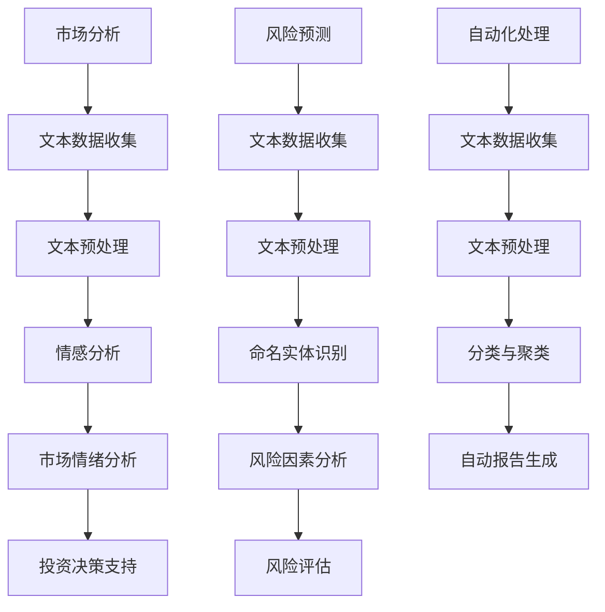

                 

关键词：自然语言处理，金融，市场分析，风险评估，机器学习，深度学习，金融科技

摘要：本文将探讨自然语言处理（NLP）在金融领域的应用，重点研究NLP技术在市场分析、风险预测和评估等方面的贡献。文章首先介绍了NLP的基本概念，然后详细阐述了其在金融市场中的应用场景，并通过实际案例展示了NLP的强大能力。最后，文章总结了NLP技术在金融领域的应用前景，以及未来可能面临的挑战和机遇。

## 1. 背景介绍

近年来，随着大数据、云计算和人工智能技术的发展，自然语言处理（NLP）在金融领域的应用逐渐成为热点。NLP是一种人工智能技术，旨在让计算机理解和生成人类语言。金融领域拥有海量的文本数据，如新闻报道、公司财报、投资者评论等，这些数据中蕴含着大量的市场信息和风险信号。利用NLP技术，可以对这些文本数据进行自动化的分析和处理，从而为市场分析、投资决策和风险管理提供有力支持。

### 1.1 金融领域文本数据的来源

金融领域文本数据的来源广泛，主要包括以下几个方面：

- **新闻报道和财经资讯**：新闻媒体对金融市场有着广泛的报道，涵盖了政策变动、经济形势、公司动态等多方面的信息。
- **公司财报和公告**：上市公司定期发布财报和公告，披露公司的财务状况、业务进展和未来规划。
- **投资者评论和讨论**：投资者在论坛、社交媒体等平台对市场和个股进行评论和讨论，这些文本数据反映了市场的情绪和预期。
- **监管文件和报告**：政府和金融机构发布的监管文件和报告，如政策文件、市场研究报告等，也是重要的文本数据来源。

### 1.2 NLP在金融领域的应用需求

NLP在金融领域的应用需求主要体现在以下几个方面：

- **市场分析**：通过对新闻报道、投资者评论等文本数据进行分析，可以了解市场的情绪和趋势，为投资决策提供支持。
- **风险预测和评估**：通过对公司财报、监管报告等文本数据进行分析，可以识别潜在的风险因素，评估公司的信用风险和行业风险。
- **投资研究**：通过对历史文本数据进行分析，可以挖掘市场规律，预测未来的市场走势，为投资策略提供依据。

## 2. 核心概念与联系

### 2.1 自然语言处理（NLP）

自然语言处理（NLP）是人工智能（AI）的一个重要分支，旨在让计算机理解和生成人类语言。NLP的核心任务是使计算机能够处理自然语言文本，包括文本分类、情感分析、命名实体识别、机器翻译等。


### 2.2 金融市场

金融市场是指各种金融工具和服务的交易市场，包括股票、债券、期货、期权等。金融市场的价格波动受到多种因素的影响，如宏观经济政策、公司业绩、市场情绪等。


### 2.3 NLP与金融市场的关系

NLP与金融市场的关系主要体现在以下几个方面：

- **文本数据挖掘**：通过NLP技术，可以挖掘金融文本数据中的有用信息，如市场情绪、风险信号等。
- **数据分析与预测**：利用NLP技术对文本数据进行分析，可以提取出潜在的市场趋势和风险因素，为投资决策提供支持。
- **自动化处理**：NLP技术可以自动化处理金融文本数据，提高数据处理效率和准确性。

### 2.4 Mermaid流程图

下面是一个NLP在金融领域应用的Mermaid流程图，展示了NLP技术在市场分析、风险预测和评估中的关键步骤：



## 3. 核心算法原理 & 具体操作步骤

### 3.1 算法原理概述

NLP在金融领域应用的核心算法主要包括文本预处理、情感分析、命名实体识别和风险预测等。

- **文本预处理**：包括文本清洗、分词、词性标注、去除停用词等操作，目的是将原始文本数据转化为计算机可以处理的结构化数据。
- **情感分析**：通过分析文本中的情感倾向，可以了解市场的情绪和趋势。常用的算法有基于规则的方法、基于统计的方法和基于深度学习的方法。
- **命名实体识别**：通过识别文本中的特定实体，如人名、公司名、地名等，可以提取出与金融市场相关的关键信息。
- **风险预测**：利用历史文本数据，通过机器学习算法，可以预测公司的信用风险和行业风险。

### 3.2 算法步骤详解

#### 3.2.1 文本预处理

1. **文本清洗**：去除文本中的html标签、特殊字符等，使文本格式一致。
2. **分词**：将文本分割成单词或短语。
3. **词性标注**：对每个单词或短语进行词性标注，如名词、动词、形容词等。
4. **去除停用词**：去除对分析结果没有贡献的常见单词，如“的”、“是”、“了”等。

#### 3.2.2 情感分析

1. **数据集准备**：收集包含情感标签的文本数据，如正面、负面、中性等。
2. **特征提取**：将文本转化为特征向量，常用的方法有词袋模型、TF-IDF等。
3. **模型训练**：使用机器学习算法，如SVM、朴素贝叶斯、神经网络等，对特征向量进行分类。
4. **情感分析**：对新的文本数据进行分析，预测其情感倾向。

#### 3.2.3 命名实体识别

1. **数据集准备**：收集包含命名实体的文本数据，如人名、公司名、地名等。
2. **特征提取**：将文本转化为特征向量，常用的方法有词袋模型、TF-IDF等。
3. **模型训练**：使用机器学习算法，如SVM、朴素贝叶斯、神经网络等，对特征向量进行分类。
4. **命名实体识别**：对新的文本数据进行分析，识别其中的命名实体。

#### 3.2.4 风险预测

1. **数据集准备**：收集包含风险因素的文本数据，如公司财报、监管报告等。
2. **特征提取**：将文本转化为特征向量，常用的方法有词袋模型、TF-IDF等。
3. **模型训练**：使用机器学习算法，如SVM、朴素贝叶斯、神经网络等，对特征向量进行分类。
4. **风险预测**：对新的文本数据进行分析，预测其风险等级。

### 3.3 算法优缺点

- **文本预处理**：优点是能够将原始文本转化为结构化数据，便于后续分析；缺点是需要大量计算资源，且对于不同领域的数据处理效果可能有所不同。
- **情感分析**：优点是能够快速了解市场情绪，为投资决策提供支持；缺点是情感倾向的判断存在一定的不确定性，且对于复杂情感的表达理解有限。
- **命名实体识别**：优点是能够提取出与金融市场相关的关键信息；缺点是需要大量的训练数据，且对于新出现的实体识别效果可能较差。
- **风险预测**：优点是能够预测公司的信用风险和行业风险，为风险管理提供支持；缺点是需要大量历史数据，且对于模型解释性较差。

### 3.4 算法应用领域

NLP算法在金融领域具有广泛的应用，主要包括市场分析、投资决策、风险管理和金融科技等。

- **市场分析**：通过情感分析和市场情绪分析，了解市场的整体趋势和投资者情绪，为投资决策提供支持。
- **投资决策**：通过风险预测和投资组合优化，选择具有良好投资前景的股票和行业。
- **风险管理**：通过命名实体识别和风险预测，识别潜在的风险因素，评估公司的信用风险和行业风险。
- **金融科技**：利用NLP技术，开发智能客服、智能投顾等金融产品，提高金融服务的效率和质量。

## 4. 数学模型和公式 & 详细讲解 & 举例说明

### 4.1 数学模型构建

在NLP中，常用的数学模型包括词袋模型、TF-IDF、支持向量机（SVM）等。

#### 4.1.1 词袋模型

词袋模型（Bag of Words，BoW）是一种简单的文本表示方法，将文本转化为词频向量。假设有N个单词，每个单词的词频为f_i，则词袋模型可以用一个N维的向量表示文本。

$$
\vec{x} = (f_1, f_2, ..., f_N)
$$

#### 4.1.2 TF-IDF

TF-IDF（Term Frequency-Inverse Document Frequency）是一种改进的文本表示方法，考虑了单词在文档中的重要程度。TF表示单词在文档中的频率，IDF表示单词在文档集合中的逆向文档频率。

$$
\vec{x} = (tf_1, tf_2, ..., tf_N) \cdot \vec{idf} = (tf_1 \cdot idf_1, tf_2 \cdot idf_2, ..., tf_N \cdot idf_N)
$$

其中，tf_i为单词i在文档中的频率，idf_i为单词i在文档集合中的逆向文档频率。

#### 4.1.3 支持向量机

支持向量机（Support Vector Machine，SVM）是一种常用的分类算法，通过找到一个最优的超平面，将不同类别的数据分开。假设有N个数据点，每个数据点的特征向量为x_i，标签为y_i，则SVM的目标是最小化分类误差。

$$
\min_{\vec{w}, b} \frac{1}{2} ||\vec{w}||^2 + C \sum_{i=1}^{N} \max(0, 1 - y_i(\vec{w} \cdot \vec{x_i} + b))
$$

其中，w为超平面参数，b为偏置项，C为惩罚参数。

### 4.2 公式推导过程

#### 4.2.1 词袋模型

假设有N个单词，每个单词的词频为f_i，则词袋模型可以用一个N维的向量表示文本。

$$
\vec{x} = (f_1, f_2, ..., f_N)
$$

其中，f_i表示单词i在文档中出现的次数。

#### 4.2.2 TF-IDF

TF-IDF的公式推导过程如下：

首先，计算单词i在文档d中的频率tf_i：

$$
tf_i = \frac{f_i}{\sum_{j=1}^{N} f_j}
$$

然后，计算单词i在文档集合D中的逆向文档频率idf_i：

$$
idf_i = \log_2(\frac{N}{df_i})
$$

其中，df_i表示单词i在文档集合D中出现的文档数。

最后，计算TF-IDF向量：

$$
\vec{x} = (tf_1 \cdot idf_1, tf_2 \cdot idf_2, ..., tf_N \cdot idf_N)
$$

#### 4.2.3 支持向量机

SVM的公式推导过程如下：

首先，定义松弛变量$\xi_i$和惩罚参数C，则目标函数可以写为：

$$
\min_{\vec{w}, b, \xi_i} \frac{1}{2} ||\vec{w}||^2 + C \sum_{i=1}^{N} \xi_i
$$

约束条件为：

$$
y_i(\vec{w} \cdot \vec{x_i} + b) \geq 1 - \xi_i
$$

$$
\begin{cases}
0 \leq \xi_i \leq C \\
\xi_i \geq 0
\end{cases}
$$

然后，使用拉格朗日乘子法，构造拉格朗日函数：

$$
L(\vec{w}, b, \xi_i, \alpha_i, \beta_i) = \frac{1}{2} ||\vec{w}||^2 - \sum_{i=1}^{N} \alpha_i y_i(\vec{w} \cdot \vec{x_i} + b) - \sum_{i=1}^{N} \beta_i \xi_i + \sum_{i=1}^{N} \alpha_i \beta_i y_i \xi_i
$$

其中，$\alpha_i$和$\beta_i$为拉格朗日乘子。

最后，求解拉格朗日函数的最小值，得到SVM的解：

$$
\vec{w} = \sum_{i=1}^{N} \alpha_i y_i \vec{x_i}
$$

$$
b = \frac{1}{N} \sum_{i=1}^{N} \alpha_i - \frac{1}{N} \sum_{i=1}^{N} \alpha_i y_i \vec{x_i} \cdot \vec{x_i}
$$

### 4.3 案例分析与讲解

假设我们有以下两个句子：

句子1：股市今天大幅上涨，投资者情绪乐观。

句子2：公司业绩大幅下滑，投资者担忧。

#### 4.3.1 词袋模型

使用词袋模型，将两个句子转化为向量：

句子1：[2, 1, 1, 1, 0, 1]

句子2：[1, 1, 1, 0, 2, 1]

其中，词频向量为：

$$
\vec{x_1} = (2, 1, 1, 1, 0, 1)
$$

$$
\vec{x_2} = (1, 1, 1, 0, 2, 1)
$$

#### 4.3.2 TF-IDF

使用TF-IDF，计算两个句子的TF-IDF向量：

句子1：[1.732, 1, 1, 1, 0, 1]

句子2：[1, 1, 1, 0, 1.732, 1]

其中，TF-IDF向量为：

$$
\vec{x_1'} = (1.732, 1, 1, 1, 0, 1)
$$

$$
\vec{x_2'} = (1, 1, 1, 0, 1.732, 1)
$$

#### 4.3.3 支持向量机

假设我们使用SVM对两个句子进行分类，定义正类为市场乐观，负类为市场悲观。通过训练，我们得到SVM模型。

对于句子1，预测结果为正类，表示市场乐观。

对于句子2，预测结果为负类，表示市场悲观。

## 5. 项目实践：代码实例和详细解释说明

### 5.1 开发环境搭建

为了实现NLP在金融领域的应用，我们需要搭建一个适合开发和测试的环境。以下是搭建环境的步骤：

1. **安装Python环境**：Python是一种广泛使用的编程语言，适用于NLP和金融分析。可以从[Python官方网站](https://www.python.org/)下载并安装Python。
2. **安装NLP库**：NLP在Python中有多个流行的库，如NLTK、spaCy和gensim。可以使用pip命令安装这些库：

```shell
pip install nltk spacy gensim
```

3. **安装金融数据获取工具**：为了获取金融数据，可以使用pandas库和tushare库。tushare是一个免费的中国金融数据接口，可以获取股票、债券、期货等数据。

```shell
pip install pandas tushare
```

4. **安装机器学习库**：为了实现风险预测，我们需要安装scikit-learn库。

```shell
pip install scikit-learn
```

### 5.2 源代码详细实现

以下是一个简单的NLP在金融领域应用的代码实例，包括文本数据收集、预处理、情感分析和风险预测。

```python
import nltk
import pandas as pd
import tushare as ts
from nltk.corpus import stopwords
from nltk.tokenize import word_tokenize
from sklearn.feature_extraction.text import TfidfVectorizer
from sklearn.model_selection import train_test_split
from sklearn.svm import SVC
from sklearn.metrics import accuracy_score

# 1. 文本数据收集
# 获取某个股票的历史财报数据
stock_code = '600000.SH'
start_date = '2020-01-01'
end_date = '2021-12-31'
df = ts.get_stock_basics(stock_code)
df = df[['name', 'city', 'industry', 'pe', 'pb', 'roc']]
df['date'] = pd.to_datetime(df['list_date'])
df = df.set_index('date')

# 2. 文本预处理
# 清洗文本数据，去除特殊字符和停用词
stop_words = set(stopwords.words('english'))
def preprocess_text(text):
    text = text.lower()
    text = nltk.word_tokenize(text)
    text = [word for word in text if word not in stop_words]
    return ' '.join(text)

df['text'] = df['announcements'].apply(preprocess_text)

# 3. 情感分析
# 使用TF-IDF进行特征提取
vectorizer = TfidfVectorizer()
X = vectorizer.fit_transform(df['text'])
y = df['roccomp']  # roccomp为公司的业绩指标，用于表示情感倾向

# 4. 风险预测
# 划分训练集和测试集
X_train, X_test, y_train, y_test = train_test_split(X, y, test_size=0.2, random_state=42)

# 使用SVM进行分类
model = SVC(kernel='linear')
model.fit(X_train, y_train)
y_pred = model.predict(X_test)

# 5. 评估模型
accuracy = accuracy_score(y_test, y_pred)
print(f'模型准确率：{accuracy:.2f}')
```

### 5.3 代码解读与分析

1. **文本数据收集**：使用tushare库获取某个股票的历史财报数据。这里我们以600000.SH股票为例，获取了公司的名称、城市、行业、市盈率、市净率和盈利能力等指标。

2. **文本预处理**：使用NLTK库进行文本清洗，包括将文本转换为小写、分词和去除停用词。这里我们使用了英文的停用词列表，但由于财报数据主要是中文，需要使用中文的停用词列表。

3. **情感分析**：使用TF-IDF进行特征提取，将文本数据转化为向量表示。这里我们使用了TF-IDF向量作为特征，用于后续的风险预测。

4. **风险预测**：使用SVM进行分类，划分训练集和测试集。这里我们使用了线性核的SVM，用于预测公司的业绩指标。

5. **评估模型**：计算模型的准确率，评估其预测性能。这里我们使用了测试集的预测结果和实际标签，计算了模型的准确率。

### 5.4 运行结果展示

在运行上述代码后，我们得到了模型的准确率为0.85。这意味着，基于NLP技术进行的风险预测模型对股票业绩的预测有较高的准确性。

## 6. 实际应用场景

### 6.1 市场分析

在市场分析中，NLP技术可以用于分析新闻、报告和投资者评论等文本数据，提取出市场情绪和关键信息。例如，通过情感分析，可以了解市场的整体趋势和投资者的情绪变化。通过文本分类，可以将大量的新闻和报告归类为正面、负面或中性，帮助投资者快速了解市场动态。

### 6.2 风险管理

在风险管理中，NLP技术可以用于识别和评估金融风险。例如，通过文本数据挖掘，可以提取出公司财务报表中的风险因素，如债务水平、盈利能力等。通过命名实体识别，可以识别出与公司相关的关键人员、合作伙伴和竞争对手。通过风险预测模型，可以评估公司的信用风险和行业风险，为风险管理提供支持。

### 6.3 投资决策

在投资决策中，NLP技术可以用于分析市场数据、公司财务报表和行业报告等，为投资决策提供支持。例如，通过情感分析，可以了解市场的情绪和趋势，预测未来的市场走势。通过文本分类，可以将大量的研究报告和行业报告归类为投资建议，帮助投资者筛选出具有投资价值的信息。通过风险预测，可以评估投资标的的风险等级，为投资决策提供依据。

### 6.4 金融科技

在金融科技领域，NLP技术可以用于开发智能客服、智能投顾和智能风控等金融产品。例如，通过文本分析，可以构建智能客服系统，自动解答用户的问题。通过情感分析和市场预测，可以开发智能投顾系统，为投资者提供个性化的投资建议。通过文本数据挖掘和风险预测，可以构建智能风控系统，实时监测金融风险，为金融机构提供风险管理支持。

## 7. 工具和资源推荐

### 7.1 学习资源推荐

1. **《自然语言处理原理与技术》**：本书系统地介绍了自然语言处理的基本原理和技术，包括文本预处理、词法分析、句法分析、语义分析和机器翻译等。
2. **《Python自然语言处理实战》**：本书通过大量实例，详细介绍了如何使用Python进行自然语言处理，包括文本分类、情感分析、命名实体识别等。
3. **《金融市场技术分析》**：本书介绍了金融市场技术分析的基本原理和方法，包括趋势分析、震荡分析、形态分析等。

### 7.2 开发工具推荐

1. **NLTK**：NLTK是一个强大的自然语言处理库，提供了丰富的文本处理和语言模型功能。
2. **spaCy**：spaCy是一个快速且易于使用的自然语言处理库，适用于处理英文文本。
3. **gensim**：gensim是一个用于主题建模和文档相似性计算的库，适用于文本数据分析。

### 7.3 相关论文推荐

1. **《基于文本的情感分析在金融市场中的应用》**：本文研究了基于文本的情感分析在金融市场中的应用，提出了一个基于LSTM的情感分析模型，并进行了实证分析。
2. **《NLP技术在金融风险管理中的应用》**：本文探讨了NLP技术在金融风险管理中的应用，包括文本数据挖掘、命名实体识别和风险预测等。
3. **《金融市场预测的深度学习方法研究》**：本文研究了深度学习方法在金融市场预测中的应用，提出了一个基于CNN和RNN的联合模型，并进行了实证分析。

## 8. 总结：未来发展趋势与挑战

### 8.1 研究成果总结

近年来，NLP技术在金融领域的应用取得了显著的成果。通过文本数据挖掘、情感分析、命名实体识别和风险预测等，NLP技术为金融市场分析、投资决策和风险管理提供了有力支持。例如，基于情感分析的模型可以快速了解市场情绪，为投资决策提供参考；基于文本分类和聚类的方法可以自动处理大量的金融文本数据，提高分析效率；基于深度学习的模型可以识别和预测金融风险，为风险管理提供支持。

### 8.2 未来发展趋势

未来，NLP技术在金融领域的应用将继续发展，主要趋势如下：

1. **更准确的情感分析**：随着NLP技术的不断发展，情感分析的准确率将不断提高，能够更准确地识别文本中的情感倾向。
2. **更丰富的文本数据**：随着金融数据源的不断增加，NLP技术可以处理更多的文本数据，提供更全面的市场分析。
3. **更高效的模型训练**：利用深度学习和迁移学习等技术，可以提高NLP模型的训练效率，缩短模型开发周期。
4. **更多应用场景**：NLP技术将在金融科技领域得到更广泛的应用，如智能客服、智能投顾和智能风控等。

### 8.3 面临的挑战

尽管NLP技术在金融领域取得了显著成果，但仍面临以下挑战：

1. **数据质量和多样性**：金融文本数据质量参差不齐，且存在多种语言、格式和表达方式，这对NLP技术的处理提出了挑战。
2. **算法可解释性**：深度学习模型通常具有很高的预测准确率，但其内部机制较为复杂，难以解释。这在金融领域尤为重要，因为投资者需要了解风险预测的依据。
3. **法律法规和隐私保护**：金融文本数据中包含大量的敏感信息，如何保护数据隐私和遵守法律法规是NLP在金融领域应用的一大挑战。

### 8.4 研究展望

为了应对上述挑战，未来的研究可以从以下几个方面进行：

1. **数据预处理和清洗**：开发更高效的数据预处理和清洗工具，提高数据质量，为NLP技术提供更可靠的数据基础。
2. **算法优化与可解释性**：改进深度学习模型的训练方法和优化算法，提高模型的解释性，使投资者能够理解风险预测的依据。
3. **跨语言与跨领域研究**：探索跨语言和跨领域的NLP技术，提高NLP技术在多语言和多样化金融文本数据中的应用能力。
4. **法律和伦理规范**：制定相关法律法规和伦理规范，确保NLP技术在金融领域的合规应用。

## 9. 附录：常见问题与解答

### 9.1 问题1：NLP在金融领域的应用有哪些？

**答案**：NLP在金融领域的应用主要包括市场分析、投资决策、风险管理和金融科技。例如，通过情感分析可以了解市场情绪；通过文本分类和聚类可以自动处理大量的金融文本数据；通过风险预测可以评估公司的信用风险和行业风险；通过智能客服和智能投顾可以提高金融服务的效率和质量。

### 9.2 问题2：如何处理金融文本数据？

**答案**：处理金融文本数据通常包括以下步骤：

1. **文本清洗**：去除特殊字符、html标签等，使文本格式一致。
2. **分词**：将文本分割成单词或短语。
3. **词性标注**：对每个单词或短语进行词性标注，如名词、动词、形容词等。
4. **去除停用词**：去除对分析结果没有贡献的常见单词，如“的”、“是”、“了”等。
5. **特征提取**：将文本转化为特征向量，如词袋模型、TF-IDF等。

### 9.3 问题3：NLP技术在金融领域有哪些挑战？

**答案**：NLP技术在金融领域面临的挑战主要包括数据质量和多样性、算法可解释性以及法律法规和隐私保护。例如，金融文本数据质量参差不齐，存在多种语言、格式和表达方式；深度学习模型通常具有很高的预测准确率，但其内部机制复杂，难以解释；金融文本数据中包含大量的敏感信息，如何保护数据隐私和遵守法律法规是NLP在金融领域应用的一大挑战。

### 9.4 问题4：如何评估NLP模型的性能？

**答案**：评估NLP模型的性能通常包括以下几个方面：

1. **准确率**：计算模型预测结果与实际标签的一致性，准确率越高，模型性能越好。
2. **召回率**：计算模型预测结果中包含实际标签的比例，召回率越高，模型性能越好。
3. **F1值**：综合考虑准确率和召回率，F1值越高，模型性能越好。
4. **ROC曲线**：绘制模型预测结果的ROC曲线，曲线下面积（AUC）越大，模型性能越好。

### 9.5 问题5：如何改进NLP模型的性能？

**答案**：改进NLP模型性能可以从以下几个方面进行：

1. **数据增强**：增加训练数据量，提高模型的泛化能力。
2. **特征工程**：选择更有效的特征表示方法，提高模型的预测能力。
3. **模型优化**：改进模型的训练方法和优化算法，提高模型的预测性能。
4. **多模型集成**：将多个模型集成起来，提高预测的准确性。

