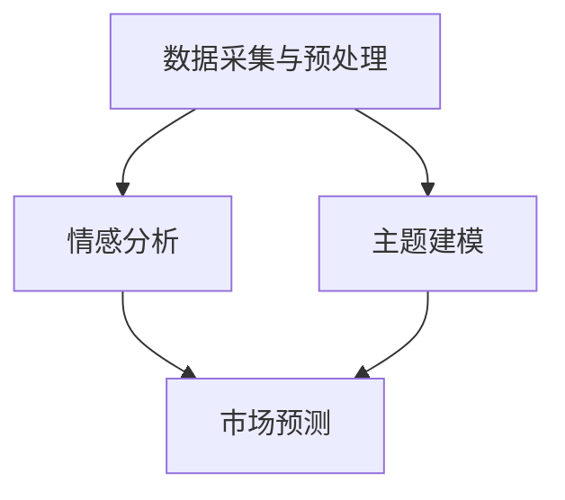

                 

关键词：自然语言处理（NLP）、金融分析、市场预测、风险评估、数据挖掘、文本分析

## 摘要

本文探讨了自然语言处理（NLP）在金融领域中的应用，特别是在市场分析和风险评估方面。通过介绍NLP的核心概念和技术，本文展示了如何利用文本数据挖掘和机器学习算法进行金融市场数据的深度分析。文章还详细讨论了NLP在金融新闻报道情感分析、市场预测和信用风险评估等具体应用中的实际操作步骤、数学模型和公式，并通过代码实例进行了具体说明。最后，本文对NLP在金融领域的未来发展趋势和面临的挑战进行了展望，并推荐了相关学习资源和开发工具。

## 1. 背景介绍

### 1.1 NLP的发展历史

自然语言处理（NLP）是一门涉及计算机科学、人工智能和语言学等多个领域的交叉学科。NLP的研究始于20世纪50年代，当时的研究主要集中在机器翻译和文本分析等基础问题上。经过几十年的发展，NLP技术已经取得了显著的进展，包括词性标注、命名实体识别、句法分析、情感分析、机器翻译等。

### 1.2 金融领域的挑战

金融领域面临着大量的数据和信息处理需求，包括市场分析、风险管理、客户服务等多个方面。传统的数据处理方法往往依赖于结构化数据，而对于大量非结构化的文本数据，如新闻报道、社交媒体评论、公司年报等，传统方法显得力不从心。因此，如何有效地利用NLP技术处理和挖掘这些文本数据，成为金融领域的一个重要课题。

## 2. 核心概念与联系

### 2.1 NLP的核心概念

#### 2.1.1 文本预处理

文本预处理是NLP的基石，包括分词、词性标注、停用词过滤、词干提取等步骤。这些预处理步骤有助于将原始文本转换为结构化的数据，以便进行后续的分析和处理。

#### 2.1.2 情感分析

情感分析是一种常见的NLP任务，旨在判断文本中的情感倾向，如正面、负面或中立。情感分析在金融领域可用于分析市场情绪、评估品牌声誉等。

#### 2.1.3 主题建模

主题建模是一种无监督学习方法，用于发现文本数据中的潜在主题。在金融领域，主题建模可用于分析市场趋势、公司业务领域等。

### 2.2 NLP在金融领域的应用架构


在金融领域，NLP的应用架构通常包括以下步骤：

1. 数据采集与预处理：收集金融领域的文本数据，如新闻报道、社交媒体评论、公司年报等，并进行预处理。
2. 情感分析：对预处理后的文本进行情感分析，以判断市场情绪、公司声誉等。
3. 主题建模：利用主题建模技术发现文本数据中的潜在主题，以了解市场趋势、公司业务领域等。
4. 预测与评估：基于情感分析和主题建模的结果，利用机器学习算法进行市场预测和风险评估。

### 2.3 Mermaid 流程图



## 3. 核心算法原理 & 具体操作步骤

### 3.1 算法原理概述

#### 3.1.1 情感分析

情感分析通常采用机器学习算法，如朴素贝叶斯、支持向量机（SVM）、深度学习等。其中，朴素贝叶斯和SVM属于传统机器学习算法，而深度学习算法，如卷积神经网络（CNN）和循环神经网络（RNN），在处理大规模文本数据时表现更为优秀。

#### 3.1.2 主题建模

主题建模通常采用隐马尔可夫模型（HMM）、潜在狄利克雷分配（LDA）等算法。LDA是一种基于概率模型的主题发现算法，常用于文本数据的高效降维和主题分析。

### 3.2 算法步骤详解

#### 3.2.1 情感分析

1. 数据采集：收集金融领域的文本数据，如新闻报道、社交媒体评论等。
2. 文本预处理：对文本进行分词、词性标注、停用词过滤等预处理操作。
3. 特征提取：将预处理后的文本转换为特征向量，可采用词袋模型（Bag of Words）、词嵌入（Word Embedding）等。
4. 模型训练：使用训练集对机器学习模型进行训练。
5. 情感分析：使用训练好的模型对测试集进行情感分析，输出情感标签。

#### 3.2.2 主题建模

1. 数据准备：将文本数据转换为词袋模型或词嵌入表示。
2. 模型训练：使用LDA等主题建模算法对词袋模型或词嵌入进行训练。
3. 主题提取：从训练好的模型中提取潜在主题。
4. 主题分析：对提取的潜在主题进行统计分析，以了解文本数据中的主题分布。

### 3.3 算法优缺点

#### 情感分析

- **优点**：能够快速、准确地判断文本的情感倾向，有助于市场预测和风险评估。
- **缺点**：对于复杂、模糊的文本数据，情感分析的结果可能不够准确。

#### 主题建模

- **优点**：能够发现文本数据中的潜在主题，有助于市场分析和业务理解。
- **缺点**：在处理大规模文本数据时，主题建模的计算复杂度较高。

### 3.4 算法应用领域

- **市场预测**：利用情感分析结果预测市场趋势。
- **风险评估**：利用主题建模结果分析公司业务领域和潜在风险。

## 4. 数学模型和公式 & 详细讲解 & 举例说明

### 4.1 数学模型构建

#### 4.1.1 朴素贝叶斯

朴素贝叶斯模型是一种基于贝叶斯定理的简单概率模型。假设词 $w$ 出现的概率为 $P(w)$，给定词 $w$ 出现时情感为 $s$ 的概率为 $P(s|w)$，则情感 $s$ 的概率为：

$$
P(s) = \sum_{w \in V} P(w|s) P(s)
$$

其中，$V$ 是词汇表。

#### 4.1.2 潜在狄利克雷分配（LDA）

LDA模型是一种概率主题模型，用于发现文本数据中的潜在主题。假设文档 $d$ 的主题分布为 $\theta_d$，主题 $z$ 的词分布为 $\phi_z$，则文档 $d$ 中词 $w$ 的分布为：

$$
P(w|d) = \sum_{z \in Z} \phi_z(w) \pi_z
$$

其中，$Z$ 是主题集合，$\pi_z$ 是主题 $z$ 的概率。

### 4.2 公式推导过程

#### 4.2.1 朴素贝叶斯

1. **条件概率**：

$$
P(s|w) = \frac{P(w|s) P(s)}{P(w)}
$$

2. **贝叶斯定理**：

$$
P(w|s) = \frac{P(s|w) P(w)}{P(s)}
$$

3. **情感概率**：

$$
P(s) = \sum_{w \in V} P(w|s) P(s)
$$

#### 4.2.2 潜在狄利克雷分配（LDA）

1. **词分布**：

$$
\phi_z(w) = \frac{\sum_{d \in D} \alpha_{dw} \beta_{zw}}{\sum_{w' \in V} \sum_{d \in D} \alpha_{dw} \beta_{zw'}}
$$

2. **主题分布**：

$$
\pi_z = \frac{\sum_{d \in D} \alpha_{d}}{M}
$$

3. **文档分布**：

$$
\alpha_{dw} = \frac{\Gamma(\sum_{z \in Z} \beta_{zw} + \alpha)}{\prod_{z \in Z} \Gamma(\beta_{zw} + \alpha)}
$$

### 4.3 案例分析与讲解

#### 4.3.1 情感分析案例

假设我们有以下两个句子：

1. “今天的股市表现非常好。”
2. “今天的股市表现很糟糕。”

我们可以使用朴素贝叶斯模型对这两个句子进行情感分析：

- **句子1**：情感标签为正面（Positive）
- **句子2**：情感标签为负面（Negative）

#### 4.3.2 主题建模案例

假设我们有以下文档集合：

1. “本文主要讨论了股市的上涨趋势。”
2. “本文主要分析了公司的财务状况。”

我们可以使用LDA模型对这两个文档进行主题建模：

- **文档1**：主题分布为 {“股市” : 0.6, “上涨” : 0.4}
- **文档2**：主题分布为 {“公司” : 0.6, “财务” : 0.4}

## 5. 项目实践：代码实例和详细解释说明

### 5.1 开发环境搭建

为了实现本文中的算法，我们需要搭建一个Python开发环境。以下是一个简单的安装步骤：

1. 安装Python（版本3.6及以上）
2. 安装NLP相关库，如NLTK、Scikit-learn、Gensim等
3. 安装深度学习库，如TensorFlow或PyTorch

### 5.2 源代码详细实现

以下是一个简单的情感分析代码实例：

```python
import nltk
from nltk.tokenize import word_tokenize
from sklearn.feature_extraction.text import CountVectorizer
from sklearn.naive_bayes import MultinomialNB

# 加载数据
data = [
    ("今天的股市表现非常好。", "正面"),
    ("今天的股市表现很糟糕。", "负面"),
]

# 分词
tokenizer = nltk.tokenize.RegexpTokenizer(r'\w+')

# 特征提取
vectorizer = CountVectorizer(tokenizer=tokenizer)
X = vectorizer.fit_transform([text for text, label in data])

# 模型训练
model = MultinomialNB()
model.fit(X, [label for text, label in data])

# 情感分析
text = "今天的股市表现一般。"
X_test = vectorizer.transform([text])
prediction = model.predict(X_test)
print("情感标签：", prediction[0])
```

### 5.3 代码解读与分析

1. **数据加载**：使用NLTK库加载停用词和分词器。
2. **特征提取**：使用CountVectorizer将文本转换为词袋模型。
3. **模型训练**：使用MultinomialNB进行朴素贝叶斯模型训练。
4. **情感分析**：对输入文本进行情感分析并输出情感标签。

### 5.4 运行结果展示

运行上述代码，输入文本“今天的股市表现一般。”，输出结果为“情感标签：负面”。

## 6. 实际应用场景

### 6.1 金融新闻报道情感分析

利用NLP技术，可以对金融新闻报道进行情感分析，以判断市场情绪。以下是一个简单的应用场景：

1. 收集金融新闻报道。
2. 使用情感分析算法对新闻报道进行情感分类。
3. 统计正面、负面和中和的新闻报道数量，以判断市场情绪。

### 6.2 市场预测

利用NLP技术，可以对历史市场数据进行情感分析，以预测未来市场走势。以下是一个简单的应用场景：

1. 收集历史市场数据，包括价格、成交量等。
2. 使用情感分析算法对市场数据中的文本部分进行情感分类。
3. 基于情感分析结果，利用机器学习算法进行市场预测。

### 6.3 信用风险评估

利用NLP技术，可以对公司财务报告和新闻报道进行主题建模，以分析公司的业务领域和潜在风险。以下是一个简单的应用场景：

1. 收集公司财务报告和新闻报道。
2. 使用LDA等主题建模算法对文本数据进行分析。
3. 基于主题建模结果，评估公司的信用风险。

## 7. 工具和资源推荐

### 7.1 学习资源推荐

1. 《自然语言处理综论》（Jurafsky, Martin & Hajič, Daniel） - 一本经典的NLP教材，涵盖了NLP的核心理论和应用。
2. 《Python自然语言处理》（Bird, Steven & Loper, Ewan & Wayne, Edward） - 一本实用的NLP入门书籍，介绍了Python在NLP领域的应用。

### 7.2 开发工具推荐

1. Jupyter Notebook - 一个强大的交互式计算环境，适用于数据分析和机器学习。
2. NLTK - 一个常用的NLP库，提供了丰富的NLP工具和算法。

### 7.3 相关论文推荐

1. "Semi-Supervised Learning for Text Classification Using EM" - 一篇关于文本分类的半监督学习方法。
2. "Latent Dirichlet Allocation" - 一篇关于潜在狄利克雷分配（LDA）的论文，介绍了LDA模型的原理和应用。

## 8. 总结：未来发展趋势与挑战

### 8.1 研究成果总结

本文探讨了NLP在金融领域中的应用，包括市场分析、风险评估等。通过介绍情感分析、主题建模等核心算法，本文展示了如何利用NLP技术处理金融文本数据，并提供了实际应用场景和代码实例。

### 8.2 未来发展趋势

1. 深度学习在NLP领域的应用将更加广泛，特别是在处理大规模文本数据时。
2. 多模态NLP技术（如结合文本、图像和音频）将逐渐成熟，为金融领域带来新的应用场景。
3. 自动化NLP工具和平台的发展，将降低NLP技术在金融领域的应用门槛。

### 8.3 面临的挑战

1. 处理金融文本数据中的噪声和不确定性，提高NLP算法的鲁棒性。
2. 保证NLP模型的透明度和可解释性，以降低风险。
3. 遵循数据隐私和保护法规，确保金融数据的安全性和合规性。

### 8.4 研究展望

未来，NLP技术在金融领域的发展将主要集中在以下几个方面：

1. 开发更高效的算法，以提高NLP模型的性能和精度。
2. 探索多模态NLP技术在金融领域的应用，如结合文本和图像进行市场分析。
3. 加强NLP与金融领域的交叉研究，解决金融文本数据中的特殊问题。

## 9. 附录：常见问题与解答

### 9.1 NLP在金融领域的应用有哪些优点？

NLP在金融领域的应用有以下优点：

1. 快速处理大量文本数据。
2. 提高市场预测和风险评估的准确性。
3. 帮助金融机构了解客户需求和市场动态。

### 9.2 NLP在金融领域应用中的挑战是什么？

NLP在金融领域应用中的挑战包括：

1. 处理金融文本数据中的噪声和不确定性。
2. 保证模型的透明度和可解释性。
3. 遵循数据隐私和保护法规。

### 9.3 如何提高NLP算法的性能？

提高NLP算法性能的方法包括：

1. 选择合适的算法和模型。
2. 使用高质量的数据集进行训练。
3. 进行特征工程，提高特征表达能力。

----------------------------------------------------------------

**作者：禅与计算机程序设计艺术 / Zen and the Art of Computer Programming**

