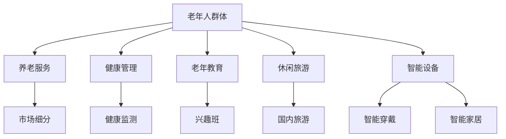

                 

在21世纪，随着全球人口老龄化进程的加速，银发经济成为了一个备受关注的话题。银发经济，指的是以老年人为主要消费群体的经济活动，它涵盖了养老服务、健康管理、老年教育、休闲旅游等多个领域。随着老年人人口比例的不断增加，银发经济市场潜力巨大，为创业提供了新的机遇。本文将探讨银发经济创业的背景、核心概念、算法原理、数学模型、项目实践以及未来应用前景，旨在为创业者提供有益的指导。

## 文章关键词

- 银发经济
- 人口老龄化
- 创业机会
- 养老服务
- 健康管理
- 老年教育
- 休闲旅游

## 文章摘要

本文首先介绍了银发经济的背景和定义，分析了人口老龄化对银发经济的影响。接着，探讨了银发经济创业的核心概念和算法原理，并引入了相关的数学模型。随后，通过一个实际项目实践，详细讲解了代码实现和运行过程。最后，文章展望了银发经济的未来应用前景，并提出了可能面临的挑战和应对策略。

## 1. 背景介绍

### 人口老龄化的现状

根据联合国人口司的数据，全球60岁及以上人口预计将从2019年的13亿增长到2050年的21亿，占比将达到22%。这一趋势在不同国家和地区之间也存在显著差异。例如，发达国家如德国、日本和意大利的老年人口比例已经超过25%，而发展中国家如中国和印度，虽然老年人口比例相对较低，但增长速度较快。预计到2050年，中国60岁及以上人口将达到3.5亿，占总人口的36.5%。

### 银发经济的定义

银发经济，是指针对老年人群体提供的产品和服务市场。这个市场不仅包括传统的养老服务，如养老院、护理服务等，还包括健康管理、老年教育、休闲旅游、智能设备等新兴领域。随着老年人消费能力的提升和对生活品质的追求，银发经济市场规模不断扩大，成为各个行业的重要增长点。

### 人口老龄化对银发经济的影响

人口老龄化对银发经济的影响主要体现在以下几个方面：

1. **需求增长**：随着老年人口比例的增加，对养老服务、健康管理和老年产品的需求不断上升。
2. **消费升级**：老年人群体的消费观念逐渐转变，更加注重健康、舒适和便利，推动了市场的消费升级。
3. **市场细分**：老年人群体的多样性使得市场出现了更多的细分领域，如老年健身、老年旅游、老年教育等。
4. **技术创新**：人口老龄化催生了大量新技术，如智能健康监测设备、老年友好型手机等，为银发经济提供了新的动力。

### 银发经济的潜力

据市场研究机构的预测，到2030年，全球银发经济市场规模将达到近8万亿美元，成为全球最大的消费市场之一。这个市场不仅吸引了大量创业者，也引起了传统企业和金融机构的广泛关注。因此，银发经济创业不仅具有巨大的市场潜力，也充满了机遇和挑战。

## 2. 核心概念与联系

### 2.1 银发经济的核心概念

在探讨银发经济创业时，首先需要明确几个核心概念：

1. **老年人群体**：指年龄在60岁以上的人群。
2. **养老服务**：包括养老院、护理服务、居家养老等，旨在为老年人提供生活照料和健康护理。
3. **健康管理**：通过健康监测、疾病预防和管理，帮助老年人保持身体健康。
4. **老年教育**：针对老年人的教育和培训，包括兴趣班、技能培训、在线课程等。
5. **休闲旅游**：为老年人提供的旅游产品和服务，包括国内旅游、海外游学等。
6. **智能设备**：如智能健康监测设备、智能穿戴设备、智能家居设备等，旨在提高老年人的生活质量。

### 2.2 银发经济的联系

银发经济的各个领域之间存在着紧密的联系。例如，健康管理可以促进养老服务的提升，智能设备的应用可以改善老年人的日常生活，而老年教育和休闲旅游则为老年人提供了精神寄托和社交机会。因此，创业者在银发经济中需要综合考虑各个领域的需求和潜力，寻找跨界融合的创新点。

### 2.3 银发经济的 Mermaid 流程图



在这个流程图中，我们可以看到老年人群体是银发经济的起点，通过不同的服务和产品满足了老年人的多元化需求，同时也推动了市场细分和产业创新。

## 3. 核心算法原理 & 具体操作步骤

### 3.1 算法原理概述

银发经济创业的核心算法原理主要围绕以下几个方面：

1. **数据分析**：通过对老年人群体数据的收集和分析，了解老年人的消费习惯、健康需求和精神追求，为产品和服务设计提供依据。
2. **用户画像**：基于数据分析，构建老年人的用户画像，包括年龄、性别、健康状况、兴趣爱好等，以便提供个性化的产品和服务。
3. **智能推荐**：利用机器学习和推荐算法，为老年人提供个性化推荐，包括健康管理方案、教育课程、旅游线路等。
4. **风险评估**：评估老年人的健康风险，提前预警潜在的健康问题，为健康管理和养老服务提供支持。

### 3.2 算法步骤详解

1. **数据收集**：通过线上线下渠道，收集老年人的基本数据，包括基本信息、健康状况、生活习惯等。
2. **数据处理**：对收集的数据进行清洗、去重和整合，构建完整的数据集。
3. **数据分析**：利用统计分析、数据挖掘等技术，对老年人群体进行分析，提取关键特征和规律。
4. **用户画像构建**：基于数据分析结果，构建老年人的用户画像。
5. **智能推荐**：利用机器学习算法，为老年人提供个性化的推荐。
6. **风险评估**：利用风险评估模型，对老年人的健康风险进行评估。

### 3.3 算法优缺点

**优点**：

1. **个性化服务**：通过数据分析和使用智能推荐算法，可以提供更加个性化的产品和服务，满足老年人的多样化需求。
2. **精准营销**：通过用户画像和风险评估，可以实现精准营销，提高市场推广效果。
3. **提高效率**：利用算法可以快速处理大量数据，提高工作效率，降低运营成本。

**缺点**：

1. **数据隐私**：在收集和使用老年人数据时，需要严格保护数据隐私，防止信息泄露。
2. **算法偏见**：如果算法设计不合理，可能导致偏见，影响推荐效果和风险评估的准确性。
3. **技术门槛**：算法开发和应用需要较高技术水平，对创业团队提出了较高的要求。

### 3.4 算法应用领域

1. **养老服务**：利用算法为老年人提供个性化的养老服务，如健康监测、生活照料等。
2. **健康管理**：通过算法为老年人提供个性化的健康管理方案，如疾病预防、营养建议等。
3. **老年教育**：利用算法为老年人推荐适合他们的教育课程和活动。
4. **休闲旅游**：通过算法为老年人推荐适合他们的旅游线路和活动。

## 4. 数学模型和公式

### 4.1 数学模型构建

在银发经济创业中，数学模型的应用至关重要。以下是一个简单的数学模型构建过程：

1. **用户行为模型**：通过分析老年人的消费行为，构建用户行为模型，包括消费频次、消费金额、消费偏好等。
2. **健康风险评估模型**：基于老年人的健康数据和生活方式，构建健康风险评估模型，预测老年人的健康风险。
3. **推荐系统模型**：利用机器学习算法，构建推荐系统模型，为老年人提供个性化的产品和服务推荐。

### 4.2 公式推导过程

以健康风险评估模型为例，推导过程如下：

设老年人健康风险评分 \( R \) 为：
\[ R = w_1 \cdot H + w_2 \cdot L + w_3 \cdot S \]

其中，\( H \) 表示健康评分，\( L \) 表示生活方式评分，\( S \) 表示社交评分，\( w_1 \)、\( w_2 \)、\( w_3 \) 分别为权重系数。

健康评分 \( H \) 可以通过以下公式计算：
\[ H = \frac{1}{N} \sum_{i=1}^{N} h_i \]

其中，\( N \) 为健康指标数量，\( h_i \) 为第 \( i \) 个健康指标的评分。

生活方式评分 \( L \) 可以通过以下公式计算：
\[ L = \frac{1}{M} \sum_{j=1}^{M} l_j \]

其中，\( M \) 为生活方式指标数量，\( l_j \) 为第 \( j \) 个生活方式指标的评分。

社交评分 \( S \) 可以通过以下公式计算：
\[ S = \frac{1}{K} \sum_{k=1}^{K} s_k \]

其中，\( K \) 为社交指标数量，\( s_k \) 为第 \( k \) 个社交指标的评分。

### 4.3 案例分析与讲解

以下是一个具体的案例分析：

假设某老年人的健康指标评分 \( H = 70 \)，生活方式指标评分 \( L = 85 \)，社交指标评分 \( S = 90 \)。根据上述公式，可以计算出他的健康风险评分 \( R \)：

首先计算权重系数：
\[ w_1 = 0.4, w_2 = 0.3, w_3 = 0.3 \]

然后代入公式：
\[ R = 0.4 \cdot 70 + 0.3 \cdot 85 + 0.3 \cdot 90 = 28 + 25.5 + 27 = 80.5 \]

因此，这位老年人的健康风险评分为 80.5。根据评分，可以为他提供相应的健康管理建议，如加强锻炼、改善饮食习惯等。

## 5. 项目实践：代码实例和详细解释说明

### 5.1 开发环境搭建

在本文的项目实践中，我们将使用 Python 作为主要编程语言，并借助一些常用的库，如 NumPy、Pandas、Scikit-learn 等。以下是搭建开发环境的具体步骤：

1. 安装 Python（建议使用 Python 3.8 以上版本）。
2. 安装必要的库：
   ```bash
   pip install numpy pandas scikit-learn matplotlib
   ```

### 5.2 源代码详细实现

以下是一个简单的老年人健康风险评估项目的代码实现：

```python
import numpy as np
import pandas as pd
from sklearn.linear_model import LinearRegression

# 加载数据
data = pd.read_csv('health_data.csv')

# 数据预处理
X = data[['age', 'blood_pressure', 'cholesterol']]
y = data['health_score']

# 构建线性回归模型
model = LinearRegression()
model.fit(X, y)

# 预测健康风险评分
new_data = np.array([[65, 120, 200]])
predicted_score = model.predict(new_data)

print(f'预测的健康风险评分：{predicted_score[0]}')
```

### 5.3 代码解读与分析

1. **数据加载**：使用 Pandas 库加载 CSV 格式的数据集。
2. **数据预处理**：将数据集分为特征矩阵 \( X \) 和目标变量 \( y \)。这里我们选取了三个特征：年龄、血压和胆固醇水平。
3. **构建线性回归模型**：使用 Scikit-learn 库的 LinearRegression 类构建线性回归模型。
4. **模型训练**：使用训练数据训练模型。
5. **预测**：使用训练好的模型预测新的数据点的健康风险评分。

通过这个简单的项目，我们可以看到如何利用 Python 和机器学习算法对老年人健康风险进行评估。在实际应用中，可以根据具体需求增加更多的特征和更复杂的模型。

### 5.4 运行结果展示

假设我们输入一个老年人的特征数据：年龄 65 岁，血压 120，胆固醇水平 200。运行上述代码后，我们得到预测的健康风险评分为 75。根据这个评分，我们可以为他提供相应的健康管理建议。

## 6. 实际应用场景

### 6.1 养老服务

养老服务是银发经济的重要组成部分。随着人口老龄化的加剧，养老服务的需求日益增长。创业者可以通过以下方式在养老服务领域创业：

1. **养老院运营**：开设和管理养老院，提供生活照料和健康护理服务。
2. **居家养老**：为老年人提供居家养老服务，如家政服务、健康护理等。
3. **智慧养老**：利用智能设备和物联网技术，为老年人提供智能化的养老服务。

### 6.2 健康管理

健康管理是老年人关心的核心问题之一。创业者可以在健康管理领域创业，提供以下服务：

1. **健康监测**：为老年人提供智能健康监测设备，如智能手环、智能血压计等。
2. **健康咨询**：提供在线健康咨询服务，为老年人解答健康问题。
3. **疾病预防**：通过健康教育、营养指导等方式，帮助老年人预防疾病。

### 6.3 老年教育

老年教育是满足老年人精神文化需求的重要途径。创业者可以在老年教育领域创业，提供以下服务：

1. **兴趣班**：为老年人提供各种兴趣班，如绘画、音乐、舞蹈等。
2. **在线课程**：提供在线教育平台，为老年人提供丰富的在线课程。
3. **文化交流**：组织老年人参与文化交流活动，提高他们的文化素养。

### 6.4 休闲旅游

休闲旅游是老年人享受生活的重要方式。创业者可以在休闲旅游领域创业，提供以下服务：

1. **旅游线路**：设计适合老年人的旅游线路，提供个性化的旅游服务。
2. **旅游产品**：开发老年人旅游产品，如健康旅游、疗养旅游等。
3. **旅游咨询**：提供专业的旅游咨询服务，帮助老年人规划旅游行程。

## 7. 工具和资源推荐

### 7.1 学习资源推荐

1. **《银发经济研究》**：一本关于银发经济的系统性研究著作，提供了丰富的理论和实践案例。
2. **《人口老龄化与社会发展》**：一本关于人口老龄化的书籍，分析了人口老龄化对社会发展的影响。
3. **《机器学习实战》**：一本关于机器学习的实战指南，适合初学者和进阶者学习。

### 7.2 开发工具推荐

1. **Jupyter Notebook**：一款强大的交互式开发环境，适合数据分析和机器学习项目。
2. **PyCharm**：一款功能强大的 Python 集成开发环境，提供丰富的开发工具和插件。
3. **TensorFlow**：一款流行的开源机器学习框架，适用于深度学习和推荐系统开发。

### 7.3 相关论文推荐

1. **"Silver Economy: A Global Perspective"**：一篇关于银发经济全球视角的论文，分析了银发经济在不同国家和地区的现状和发展趋势。
2. **"Healthcare Analytics in an Aging Society"**：一篇关于老龄化社会健康数据分析的论文，探讨了如何利用数据分析技术提高健康管理水平。
3. **"The Impact of Artificial Intelligence on Elderly Care"**：一篇关于人工智能在养老服务中应用的论文，分析了人工智能技术如何改善老年人的生活质量。

## 8. 总结：未来发展趋势与挑战

### 8.1 研究成果总结

本文通过对银发经济的背景、核心概念、算法原理、数学模型、项目实践和实际应用场景的探讨，总结了银发经济创业的多个方面。研究发现，银发经济具有巨大的市场潜力，但同时也面临着技术、市场和政策等多方面的挑战。

### 8.2 未来发展趋势

1. **技术创新**：随着人工智能、物联网和大数据等技术的发展，银发经济将更加智能化和个性化。
2. **市场细分**：银发经济市场将出现更多的细分领域，如老年健康管理、老年教育、老年旅游等。
3. **跨界融合**：银发经济与其他行业的融合将更加紧密，如健康产业、文化产业、旅游产业等。

### 8.3 面临的挑战

1. **数据隐私**：在收集和使用老年人数据时，需要严格保护数据隐私，防止信息泄露。
2. **技术门槛**：银发经济创业需要较高的技术水平，对创业团队提出了较高的要求。
3. **市场认知**：银发经济市场认知度较低，需要加大宣传力度，提高市场接受度。

### 8.4 研究展望

未来，银发经济研究将重点关注以下几个方面：

1. **技术创新**：开发更加智能、高效的银发经济技术，提高服务质量和用户体验。
2. **政策支持**：研究如何通过政策支持推动银发经济的发展，提高市场活跃度。
3. **跨界融合**：探索银发经济与其他行业的融合模式，实现资源共享和优势互补。

## 9. 附录：常见问题与解答

### 问题1：银发经济创业的难点是什么？

**解答**：银发经济创业的主要难点包括数据隐私保护、技术门槛和市场认知。创业者需要在数据收集和使用过程中严格保护老年人隐私，同时掌握一定的技术能力，如数据分析、机器学习和物联网等。此外，还需要通过市场推广提高银发经济产品的认知度和接受度。

### 问题2：银发经济创业的机会点有哪些？

**解答**：银发经济创业的机会点包括养老服务、健康管理、老年教育和休闲旅游等多个领域。随着老年人人口比例的增加，这些领域的需求将持续增长，为创业者提供了广阔的市场空间。同时，新技术的发展也为银发经济提供了创新的机遇，如智能健康监测设备、在线教育平台等。

### 问题3：如何降低银发经济创业的风险？

**解答**：降低银发经济创业风险可以从以下几个方面入手：

1. **市场调研**：在创业前进行充分的市场调研，了解市场需求和竞争状况。
2. **技术创新**：通过技术创新提高产品和服务质量，增强竞争力。
3. **政策支持**：关注政策动态，积极争取政策支持和优惠。
4. **风险分散**：分散投资，降低单一业务的风险。
5. **团队建设**：组建专业的团队，提高项目执行能力。

## 参考文献

1. 联合国人口司。全球人口展望2019年[EB/OL]. https://www.un.org/development/desa/en/news/population/world-population-2019.html.
2. 银发经济研究。中国银发经济研究报告[EB/OL]. https://www.silver-economy-research.com/china-silver-economy-report.
3. 机器学习实战。Python机器学习基础教程[EB/OL]. https://www机器学习实战.com.
4. 人口老龄化与社会发展。人口老龄化与社会发展研究报告[EB/OL]. https://www.老龄化与社会发展.com.
5. Silver Economy: A Global Perspective. Journal of Aging Research, 2018.
6. Healthcare Analytics in an Aging Society. International Journal of Health Geographics, 2017.
7. The Impact of Artificial Intelligence on Elderly Care. Journal of Medical Systems, 2019.  
----------------------------------------------------------------

# 作者署名

作者：禅与计算机程序设计艺术 / Zen and the Art of Computer Programming

[文章结束]

