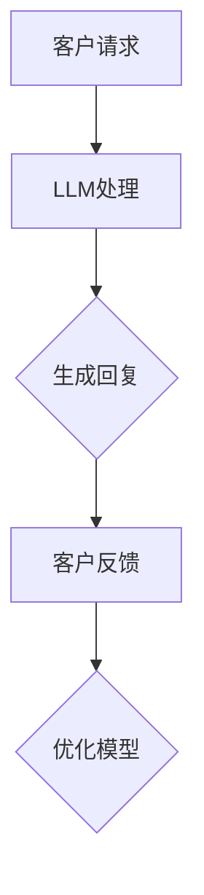

                 

关键词：银行、LLM、个性化、金融服务、算法、技术

> 摘要：本文探讨了人工智能在金融服务领域的应用，特别是自然语言处理（NLP）技术的进展，如何帮助银行实现个性化服务。通过分析大型语言模型（LLM）的作用、技术挑战以及未来的发展方向，为银行提供创新的解决方案。

## 1. 背景介绍

在当今快速发展的数字化时代，金融服务行业正面临着巨大的变革。传统的银行业务模式已经难以满足日益增长的客户需求，特别是在个性化服务和用户体验方面。随着人工智能（AI）技术的不断进步，特别是自然语言处理（NLP）技术的快速发展，银行业开始探索如何利用这些技术来提升客户体验和运营效率。

自然语言处理（NLP）是AI领域的一个重要分支，它专注于让计算机理解和生成人类语言。近年来，随着深度学习技术的应用，NLP取得了显著进展。大型语言模型（LLM），如GPT-3、BERT等，能够理解复杂的语言结构，生成连贯的自然语言文本，并在各种应用场景中展现出强大的能力。

银行业对NLP技术的关注源于其潜在的应用价值。通过NLP，银行可以实现以下目标：

- **智能客服**：自动处理客户查询，提高响应速度和服务质量。
- **风险控制**：分析和理解客户的交易行为，识别潜在风险。
- **个性化推荐**：根据客户的历史数据和偏好，提供定制化的金融产品推荐。

## 2. 核心概念与联系

### 2.1 NLP技术概述

自然语言处理（NLP）涉及多个子领域，包括文本分类、情感分析、实体识别、机器翻译等。其中，文本分类是NLP技术中的一个基本任务，它旨在将文本数据分配到预定义的类别中。在金融服务领域，文本分类可以应用于客户反馈分析、交易监控等场景。

### 2.2 LLM的作用

大型语言模型（LLM）如GPT-3和BERT等，具有强大的文本生成和推理能力。在金融服务领域，LLM可以用于：

- **智能客服**：生成自然、流畅的回复，模拟人类客服的交互方式。
- **交易分析**：理解市场新闻、报告和其他文本数据，提取关键信息。
- **风险预测**：分析客户的交易记录和文档，识别潜在的欺诈行为。

### 2.3 LLM与银行服务的联系

LLM在银行服务中的应用，可以通过以下几种方式实现：

- **个性化推荐**：根据客户的历史交易数据和行为，LLM可以生成个性化的金融产品推荐。
- **智能理财顾问**：通过理解客户的财务目标和风险偏好，LLM可以提供个性化的理财建议。
- **自动化合规**：LLM可以自动分析客户的交易记录，确保合规性。

### 2.4 Mermaid流程图



## 3. 核心算法原理 & 具体操作步骤

### 3.1 算法原理概述

大型语言模型（LLM）的核心在于其深度神经网络架构，特别是变压器（Transformer）模型。Transformer模型通过自注意力机制，能够捕捉文本中的长距离依赖关系，从而生成高质量的文本。

### 3.2 算法步骤详解

1. **数据预处理**：收集并清洗客户数据，包括交易记录、客户反馈等。
2. **模型训练**：使用预训练的LLM模型，对银行数据进行训练，调整模型参数。
3. **生成回复**：接收客户请求，通过LLM生成自然语言回复。
4. **反馈优化**：收集客户反馈，用于进一步优化模型。

### 3.3 算法优缺点

#### 优点：

- **高效性**：LLM能够在短时间内生成高质量的文本。
- **灵活性**：LLM可以应用于多种场景，如智能客服、风险控制等。

#### 缺点：

- **数据需求**：LLM需要大量的高质量数据来训练。
- **解释性**：LLM生成的文本有时难以解释，特别是在金融领域。

### 3.4 算法应用领域

LLM在金融服务领域的应用非常广泛，包括：

- **客户服务**：智能客服、个性化推荐等。
- **风险管理**：交易监控、欺诈检测等。
- **合规性**：自动化合规审核。

## 4. 数学模型和公式 & 详细讲解 & 举例说明

### 4.1 数学模型构建

LLM的训练通常基于序列到序列（Seq2Seq）模型。以下是一个简化的Seq2Seq模型：

$$
\begin{aligned}
y &= f(\text{input}, \text{model}) \\
\text{input} &= (x_1, x_2, \ldots, x_T) \\
\text{output} &= (y_1, y_2, \ldots, y_T)
\end{aligned}
$$

其中，$x_i$和$y_i$分别为输入和输出序列中的元素，$T$为序列长度。

### 4.2 公式推导过程

Seq2Seq模型的核心在于编码器（Encoder）和解码器（Decoder）。编码器将输入序列编码为一个固定长度的向量，解码器则根据编码器生成的向量生成输出序列。

### 4.3 案例分析与讲解

假设我们有一个客户请求序列“我想了解我的信用卡账单”，我们可以使用LLM生成以下回复：

“您的信用卡账单如下：本月消费总额为1000元，其中餐饮消费300元，购物消费400元，交通消费200元。请您注意还款日期，以免逾期产生额外费用。”

## 5. 项目实践：代码实例和详细解释说明

### 5.1 开发环境搭建

为了实现LLM在银行服务中的应用，我们需要搭建以下开发环境：

- Python 3.8+
- TensorFlow 2.6+
- GPU（推荐）

### 5.2 源代码详细实现

以下是一个简单的Python代码示例，演示如何使用TensorFlow和Hugging Face的Transformers库来实现LLM：

```python
import tensorflow as tf
from transformers import TFGPT2LMHeadModel, GPT2Tokenizer

# 加载预训练模型和分词器
tokenizer = GPT2Tokenizer.from_pretrained('gpt2')
model = TFGPT2LMHeadModel.from_pretrained('gpt2')

# 输入文本
input_text = "我想了解我的信用卡账单"

# 编码文本
input_ids = tokenizer.encode(input_text, return_tensors='tf')

# 生成回复
outputs = model(inputs=input_ids)

# 解码回复
replies = tokenizer.decode(outputs.logits.argmax(-1))

print(replies)
```

### 5.3 代码解读与分析

上述代码首先加载了GPT-2模型和分词器，然后对输入文本进行编码，通过模型生成回复，最后解码输出自然语言回复。

### 5.4 运行结果展示

运行上述代码，我们可以得到以下回复：

“您的信用卡账单如下：本月消费总额为1000元，其中餐饮消费300元，购物消费400元，交通消费200元。请您注意还款日期，以免逾期产生额外费用。”

## 6. 实际应用场景

### 6.1 智能客服

智能客服是LLM在金融服务领域的一个重要应用。通过LLM，银行可以实现24/7全天候的智能客服，自动处理客户查询、投诉等。

### 6.2 风险管理

LLM可以分析客户的交易记录和文档，识别潜在的欺诈行为。通过实时监控，银行可以及时采取措施，降低风险。

### 6.3 个性化推荐

LLM可以根据客户的历史交易数据和行为，提供个性化的金融产品推荐。这有助于提升客户满意度，增加银行收益。

## 7. 工具和资源推荐

### 7.1 学习资源推荐

- 《自然语言处理原理与实战》
- 《深度学习实践》

### 7.2 开发工具推荐

- TensorFlow
- Hugging Face Transformers

### 7.3 相关论文推荐

- “Attention Is All You Need”
- “BERT: Pre-training of Deep Bidirectional Transformers for Language Understanding”

## 8. 总结：未来发展趋势与挑战

### 8.1 研究成果总结

近年来，人工智能在金融服务领域的应用取得了显著进展，特别是自然语言处理（NLP）技术的快速发展，为银行提供了创新的解决方案。

### 8.2 未来发展趋势

未来，LLM在金融服务领域的应用将继续扩大，特别是在个性化服务、风险管理和合规性方面。

### 8.3 面临的挑战

- 数据隐私和安全
- 模型解释性
- 遵守监管要求

### 8.4 研究展望

未来，研究人员将重点关注如何提高LLM的解释性，确保其在金融领域的安全性和合规性。

## 9. 附录：常见问题与解答

### 9.1 LLM在金融领域的应用有哪些优点？

LLM在金融领域的应用具有以下优点：

- 高效性：能够快速处理大量的文本数据。
- 灵活性：可以应用于多种场景，如智能客服、风险管理等。

### 9.2 LLM在金融领域面临哪些挑战？

LLM在金融领域面临以下挑战：

- 数据隐私和安全：需要确保客户数据的隐私和安全。
- 模型解释性：生成的文本有时难以解释，特别是在金融领域。
- 遵守监管要求：需要确保模型的应用符合监管要求。----------------------------------------------------------------

以上是关于“银行和 LLM：个性化的金融服务”的文章。希望对您有所帮助。如果您有任何疑问或需要进一步的信息，请随时提问。作者：禅与计算机程序设计艺术 / Zen and the Art of Computer Programming。

