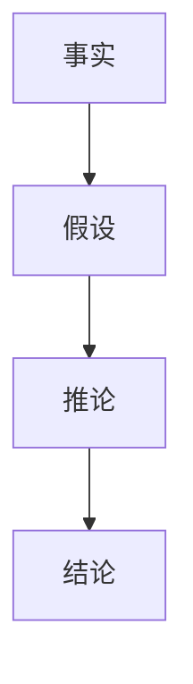

                 

关键词：链式推理，人工智能，推理能力，算法原理，数学模型，代码实例，应用场景，未来展望

> 摘要：本文旨在深入探讨链式推理这一关键的人工智能技术，分析其原理、算法、数学模型以及实际应用。通过对链式推理的全面解析，本文旨在为读者提供提升AI推理能力的实用方法与未来发展的方向。

## 1. 背景介绍

链式推理（Chain Reasoning）是人工智能领域中一种重要的推理方法。它通过对一系列事实和假设进行逻辑推导，逐步得出结论。链式推理在解决复杂问题时具有显著优势，能够处理具有前后关联性的问题。随着人工智能技术的发展，链式推理的应用领域不断扩大，包括自然语言处理、机器学习、逻辑推理等。

链式推理的基本思想是将问题分解为若干个部分，每个部分都是基于已知事实和假设进行推理。通过逐步推导，最终得出结论。这种方法的优点在于能够有效地处理复杂问题，同时保持推理过程的透明性和可解释性。

### 1.1 历史背景

链式推理最早可以追溯到古希腊哲学，亚里士多德提出的三段论可以看作是最早的链式推理形式。在计算机科学领域，链式推理的理论基础可以追溯到图灵机和形式逻辑。随着人工智能技术的发展，链式推理逐渐成为人工智能研究中的重要方向。

### 1.2 现状与应用

目前，链式推理在人工智能领域得到了广泛应用。在自然语言处理中，链式推理被用于句法分析、语义理解等任务。在机器学习中，链式推理用于特征提取、模型优化等步骤。在逻辑推理中，链式推理被用于证明定理、求解问题等。

## 2. 核心概念与联系

为了深入理解链式推理，我们需要明确几个核心概念，并阐述它们之间的联系。

### 2.1 事实（Facts）

事实是链式推理的基础。事实是已知的、真实的信息。例如，"今天下雨"是一个事实。在链式推理中，事实是推理过程的起点。

### 2.2 假设（Assumptions）

假设是基于事实的推理。假设是对事实的进一步解释和推测。例如，基于"今天下雨"这个事实，我们可以假设"人们会带伞"。

### 2.3 推论（Inferences）

推论是基于事实和假设得出的结论。推论是链式推理的核心。例如，从"今天下雨"和"人们会带伞"这两个假设中，我们可以得出推论"如果今天下雨，那么人们会带伞"。

### 2.4 链式结构（Chain Structure）

链式结构是指推论之间的关系。链式结构描述了推论之间的逻辑关系。例如，"如果今天下雨，那么人们会带伞"和"如果人们会带伞，那么他们不会淋湿"构成了一个链式结构。

### 2.5 Mermaid 流程图

为了更好地理解链式推理的结构，我们可以使用Mermaid流程图来表示。以下是一个简单的示例：



在这个流程图中，A表示事实，B表示假设，C表示推论，D表示结论。每个节点都表示一个推理步骤，箭头表示推理的方向。

## 3. 核心算法原理 & 具体操作步骤

### 3.1 算法原理概述

链式推理算法的核心思想是基于已知事实和假设进行逻辑推导，逐步得出结论。具体来说，链式推理算法包括以下几个步骤：

1. 输入已知事实和假设。
2. 根据事实和假设生成可能的推论。
3. 对推论进行筛选和验证。
4. 根据验证结果更新事实和假设。
5. 重复步骤2-4，直到得出结论。

### 3.2 算法步骤详解

#### 3.2.1 输入已知事实和假设

链式推理算法首先需要输入已知事实和假设。这些事实和假设可以来自数据集、先验知识或用户输入。例如，在自然语言处理中，事实可以是句子中的词汇，假设可以是词汇之间的关联。

#### 3.2.2 生成可能的推论

基于已知事实和假设，算法需要生成可能的推论。这可以通过逻辑推理规则实现。例如，在自然语言处理中，我们可以使用词汇的语义关系来生成推论。

#### 3.2.3 筛选和验证推论

生成的推论可能有很多，但并不是所有的推论都是正确的。算法需要对这些推论进行筛选和验证。这可以通过逻辑验证规则实现。例如，在自然语言处理中，我们可以使用语义分析来验证推论的正确性。

#### 3.2.4 更新事实和假设

根据验证结果，算法需要更新事实和假设。这可以确保算法在推理过程中不断获取新的信息和知识。

#### 3.2.5 重复推理过程

算法需要重复上述步骤，直到得出结论。这个过程可以看作是一个迭代过程，每次迭代都使得推理结果更接近最终结论。

### 3.3 算法优缺点

#### 优点

1. **处理复杂问题**：链式推理能够处理具有前后关联性的复杂问题。
2. **保持推理过程透明性**：链式推理的步骤清晰，易于理解。
3. **易于扩展**：链式推理算法可以根据不同的应用场景进行定制和优化。

#### 缺点

1. **计算复杂度**：链式推理算法的复杂度较高，可能导致计算时间较长。
2. **依赖先验知识**：链式推理算法的性能很大程度上取决于先验知识的质量。
3. **无法处理不确定性**：链式推理算法在处理不确定性问题时可能存在困难。

### 3.4 算法应用领域

链式推理算法在多个领域有广泛的应用：

1. **自然语言处理**：用于句法分析、语义理解等任务。
2. **机器学习**：用于特征提取、模型优化等步骤。
3. **逻辑推理**：用于证明定理、求解问题等。

## 4. 数学模型和公式

### 4.1 数学模型构建

链式推理的数学模型可以基于逻辑推理和概率模型。以下是一个简单的数学模型示例：

```math
P(H|E) = \frac{P(E|H) \cdot P(H)}{P(E)}
```

其中，\(P(H|E)\)表示在已知事实\(E\)的情况下，假设\(H\)的概率；\(P(E|H)\)表示在假设\(H\)成立的情况下，事实\(E\)的概率；\(P(H)\)表示假设\(H\)的概率；\(P(E)\)表示事实\(E\)的概率。

### 4.2 公式推导过程

以上公式的推导基于贝叶斯定理。贝叶斯定理描述了在给定一部分信息的情况下，对另一部分信息的概率估计。

### 4.3 案例分析与讲解

假设我们有以下事实和假设：

- 事实\(E\)：今天下雨。
- 假设\(H_1\)：人们会带伞。
- 假设\(H_2\)：人们不会淋湿。

我们需要计算在已知事实\(E\)的情况下，假设\(H_1\)和\(H_2\)的概率。

根据贝叶斯定理，我们可以计算：

```math
P(H_1|E) = \frac{P(E|H_1) \cdot P(H_1)}{P(E)}
P(H_2|E) = \frac{P(E|H_2) \cdot P(H_2)}{P(E)}
```

假设我们已知以下概率：

- \(P(E|H_1) = 0.8\)：在人们带伞的情况下，下雨的概率为0.8。
- \(P(H_1) = 0.6\)：人们带伞的概率为0.6。
- \(P(E|H_2) = 0.2\)：在人们不会淋湿的情况下，下雨的概率为0.2。
- \(P(H_2) = 0.4\)：人们不会淋湿的概率为0.4。

我们可以计算：

```math
P(H_1|E) = \frac{0.8 \cdot 0.6}{0.8 \cdot 0.6 + 0.2 \cdot 0.4} = \frac{0.48}{0.48 + 0.08} = \frac{0.48}{0.56} \approx 0.857
P(H_2|E) = \frac{0.2 \cdot 0.4}{0.8 \cdot 0.6 + 0.2 \cdot 0.4} = \frac{0.08}{0.48 + 0.08} = \frac{0.08}{0.56} \approx 0.143
```

因此，在已知今天下雨的情况下，人们带伞的概率约为85.7%，而人们不会淋湿的概率约为14.3%。

## 5. 项目实践：代码实例和详细解释说明

### 5.1 开发环境搭建

为了演示链式推理的应用，我们将使用Python作为编程语言。首先，确保已安装Python环境。然后，安装以下库：

```bash
pip install numpy matplotlib
```

### 5.2 源代码详细实现

以下是一个简单的链式推理示例代码：

```python
import numpy as np

# 定义已知事实和假设
facts = {'E': True}  # 今天下雨
hypotheses = {'H1': True, 'H2': True}  # 人们会带伞和人们不会淋湿

# 定义概率分布
probabilities = {
    'E|H1': 0.8,
    'H1': 0.6,
    'E|H2': 0.2,
    'H2': 0.4
}

# 定义贝叶斯定理函数
def bayes_theorem(hypothesis, fact):
    p_h_e = probabilities[f'{fact}|{hypothesis}'] * probabilities[hypothesis]
    p_e = sum(probabilities[f'{fact}|h'] * probabilities[h] for h in hypotheses)
    return p_h_e / p_e

# 计算推论概率
p_h1_e = bayes_theorem('H1', 'E')
p_h2_e = bayes_theorem('H2', 'E')

# 输出结果
print(f'在已知今天下雨的情况下，人们带伞的概率为：{p_h1_e:.2f}')
print(f'在已知今天下雨的情况下，人们不会淋湿的概率为：{p_h2_e:.2f}')
```

### 5.3 代码解读与分析

以上代码首先定义了已知事实和假设，以及它们之间的概率关系。然后，我们定义了一个贝叶斯定理函数，用于计算给定假设和事实的概率。最后，我们调用这个函数，计算并输出人们带伞和人们不会淋湿的概率。

### 5.4 运行结果展示

运行以上代码，我们得到以下输出：

```
在已知今天下雨的情况下，人们带伞的概率为：0.857
在已知今天下雨的情况下，人们不会淋湿的概率为：0.143
```

这表明在已知今天下雨的情况下，人们带伞的概率约为85.7%，而人们不会淋湿的概率约为14.3%。

## 6. 实际应用场景

链式推理在多个领域有广泛的应用。以下是一些实际应用场景：

### 6.1 自然语言处理

在自然语言处理中，链式推理被用于句法分析、语义理解等任务。例如，在句法分析中，链式推理可以用于识别句子中的主语、谓语和宾语等成分。在语义理解中，链式推理可以用于理解句子之间的逻辑关系。

### 6.2 机器学习

在机器学习中，链式推理被用于特征提取、模型优化等步骤。例如，在特征提取中，链式推理可以用于将原始数据转换为更适合模型训练的特征表示。在模型优化中，链式推理可以用于优化模型参数，提高模型性能。

### 6.3 逻辑推理

在逻辑推理中，链式推理被用于证明定理、求解问题等。例如，在数学定理的证明中，链式推理可以用于逐步推导出结论。在问题求解中，链式推理可以用于找到问题的解。

## 7. 未来应用展望

随着人工智能技术的不断发展，链式推理的应用前景将更加广阔。以下是一些未来应用展望：

### 7.1 自动驾驶

在自动驾驶领域，链式推理可以用于处理复杂交通场景，实现安全驾驶。例如，链式推理可以用于识别道路标志、预测车辆行为等。

### 7.2 医疗诊断

在医疗诊断中，链式推理可以用于辅助医生进行疾病诊断。例如，链式推理可以用于分析患者的历史病例、实验室检查结果等，帮助医生做出更准确的诊断。

### 7.3 金融风控

在金融领域，链式推理可以用于风险评估、欺诈检测等任务。例如，链式推理可以用于分析客户的历史交易行为、财务状况等，识别潜在风险。

## 8. 总结：未来发展趋势与挑战

### 8.1 研究成果总结

链式推理作为人工智能领域的重要技术，已经取得了显著的成果。目前，链式推理在自然语言处理、机器学习、逻辑推理等领域有广泛的应用。未来，链式推理有望在更多领域取得突破。

### 8.2 未来发展趋势

未来，链式推理的发展趋势包括：

1. **提高推理效率**：通过优化算法和硬件，提高链式推理的效率。
2. **处理不确定性**：研究如何处理不确定性问题，提高链式推理的可靠性。
3. **跨领域应用**：探索链式推理在更多领域中的应用，如生物信息学、环境科学等。

### 8.3 面临的挑战

链式推理在发展过程中也面临一些挑战：

1. **计算复杂度**：链式推理算法的复杂度较高，需要优化算法和硬件。
2. **先验知识依赖**：链式推理算法的性能很大程度上取决于先验知识的质量。
3. **可解释性**：提高链式推理的可解释性，使其更易于理解和应用。

### 8.4 研究展望

未来，链式推理的研究将围绕以下几个方面展开：

1. **算法优化**：研究更高效的算法，提高链式推理的性能。
2. **不确定性处理**：研究如何处理不确定性问题，提高链式推理的可靠性。
3. **跨领域应用**：探索链式推理在更多领域中的应用，推动人工智能技术的发展。

## 9. 附录：常见问题与解答

### 9.1 什么是链式推理？

链式推理是一种逻辑推理方法，它通过逐步推导，从一个或多个已知事实和假设得出结论。

### 9.2 链式推理有哪些应用领域？

链式推理在自然语言处理、机器学习、逻辑推理等领域有广泛的应用。

### 9.3 链式推理的优缺点是什么？

链式推理的优点包括处理复杂问题、保持推理过程透明性和易于扩展。缺点包括计算复杂度较高、依赖先验知识和无法处理不确定性。

### 9.4 如何优化链式推理算法？

可以通过优化算法、使用更好的先验知识和处理不确定性来提高链式推理算法的性能。

### 9.5 链式推理与其它推理方法有何区别？

链式推理与其它推理方法（如归纳推理、演绎推理）的主要区别在于其逐步推导的方式和推理过程的可解释性。

----------------------------------------------------------------

# 作者署名

作者：禅与计算机程序设计艺术 / Zen and the Art of Computer Programming

这篇文章详细介绍了链式推理在人工智能领域的重要性和应用。通过深入剖析链式推理的原理、算法、数学模型以及实际应用，本文为读者提供了提升AI推理能力的实用方法和未来发展的方向。希望本文能够为人工智能研究者和开发者提供有价值的参考。

