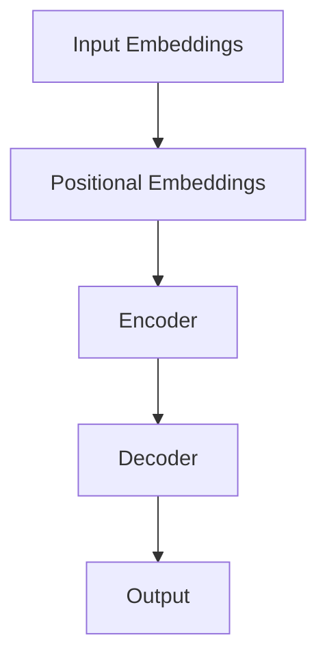

                 

关键词：长文本理解，Transformer，序列处理，信息提取，扩展算法，资源优化

摘要：本文将探讨如何克服Transformer模型在处理长文本时遇到的长度限制问题。通过分析Transformer的架构和限制，本文提出了一系列扩展算法和优化方法，旨在提高模型的性能和适应性。同时，本文还将探讨这些方法在实际应用场景中的效果和未来发展的可能性。

## 1. 背景介绍

在当前的人工智能领域，自然语言处理（NLP）已经成为一个重要的研究方向。随着深度学习技术的发展，Transformer模型在NLP任务中取得了显著的成果，如机器翻译、文本生成等。然而，Transformer模型在处理长文本时存在一定的限制，主要表现在计算效率和存储空间方面。这导致了模型在实际应用中的性能受限。

长文本理解是指对文本中包含的信息进行提取和分析，以便更好地理解文本内容。这一过程在问答系统、信息检索和文本分析等应用场景中具有重要意义。然而，由于Transformer模型的结构特点，它无法直接处理长文本。为了解决这个问题，我们需要对Transformer模型进行扩展和优化。

本文将首先介绍Transformer模型的基本原理和架构，然后分析其在处理长文本时遇到的限制。接下来，我们将提出一系列扩展算法和优化方法，并通过实验验证其效果。最后，本文还将探讨这些方法在实际应用场景中的效果和未来发展的可能性。

## 2. 核心概念与联系

### 2.1 Transformer模型简介

Transformer模型是由Google团队于2017年提出的一种基于自注意力机制的全连通序列模型。与传统的循环神经网络（RNN）和长短时记忆网络（LSTM）相比，Transformer模型在处理长序列数据时具有更高的效率和更好的性能。

Transformer模型主要由编码器和解码器两个部分组成。编码器负责将输入序列编码为固定长度的向量表示，而解码器则将这些向量表示解码为输出序列。编码器和解码器之间通过多头自注意力机制和多层前馈网络进行交互，以提取序列中的上下文信息。

### 2.2 自注意力机制

自注意力机制是Transformer模型的核心组成部分。它允许模型在处理序列数据时，对序列中的每个元素分配不同的权重，以实现更精细的上下文信息提取。自注意力机制可以通过以下公式表示：

\[ \text{Attention}(Q, K, V) = \text{softmax}\left(\frac{QK^T}{\sqrt{d_k}}\right)V \]

其中，Q、K和V分别表示查询（Query）、键（Key）和值（Value）向量，\(d_k\)表示键向量的维度。通过自注意力机制，模型可以自动学习到序列中各个元素之间的相关性，从而更好地捕捉上下文信息。

### 2.3 Transformer架构的Mermaid流程图

以下是一个简化的Transformer架构的Mermaid流程图：



在图中，输入嵌入（Input Embeddings）和位置嵌入（Positional Embeddings）分别表示编码器和解码器的输入。编码器（Encoder）和解码器（Decoder）分别通过多层自注意力机制和多层前馈网络处理输入序列，最后输出结果（Output）。

## 3. 核心算法原理 & 具体操作步骤

### 3.1 算法原理概述

为了克服Transformer模型在处理长文本时遇到的长度限制，本文提出了一系列扩展算法和优化方法。这些方法主要分为以下几类：

1. **序列截断（Sequence Truncation）**：通过截断长文本的方式，减少模型的输入长度。
2. **子序列分割（Subsequence Segmentation）**：将长文本分割为多个子序列，分别处理，然后合并结果。
3. **注意力掩码（Attention Masking）**：通过设置掩码的方式，忽略掉长文本中不必要的部分。
4. **层次化模型（Hierarchical Model）**：构建分层模型，从高层次提取全局信息，从低层次提取局部信息。

### 3.2 算法步骤详解

#### 3.2.1 序列截断

序列截断是一种直接减少模型输入长度的方法。具体步骤如下：

1. 确定截断策略：可以选择固定长度、动态长度或根据文本重要性进行自适应截断。
2. 对输入文本进行截断：根据截断策略，对长文本进行截断，得到新的输入序列。
3. 处理截断后的序列：将截断后的序列输入到Transformer模型中进行处理。

#### 3.2.2 子序列分割

子序列分割将长文本分割为多个子序列，分别处理，然后合并结果。具体步骤如下：

1. 确定分割策略：可以选择固定分割、动态分割或基于文本重要性的自适应分割。
2. 对输入文本进行分割：根据分割策略，将长文本分割为多个子序列。
3. 处理子序列：对每个子序列分别输入到Transformer模型中进行处理。
4. 合并结果：将处理后的子序列结果进行合并，得到最终的输出结果。

#### 3.2.3 注意力掩码

注意力掩码通过设置掩码的方式，忽略掉长文本中不必要的部分。具体步骤如下：

1. 确定掩码策略：可以选择固定掩码、动态掩码或基于文本重要性的自适应掩码。
2. 生成掩码：根据掩码策略，生成掩码矩阵。
3. 应用掩码：将生成的掩码应用于Transformer模型的注意力机制中。
4. 处理文本：将处理后的文本输入到Transformer模型中进行处理。

#### 3.2.4 层次化模型

层次化模型通过构建分层模型，从高层次提取全局信息，从低层次提取局部信息。具体步骤如下：

1. 构建分层模型：根据任务需求，设计合适的分层结构。
2. 处理高层次信息：从高层次模型中提取全局信息。
3. 处理低层次信息：从低层次模型中提取局部信息。
4. 合并结果：将高层次信息和低层次信息进行合并，得到最终的输出结果。

### 3.3 算法优缺点

**序列截断**的优点在于简单有效，易于实现。缺点是可能会损失部分重要信息，影响模型性能。

**子序列分割**的优点在于可以更好地处理长文本，减少计算量。缺点是分割策略的选择和结果合并较为复杂，可能影响模型性能。

**注意力掩码**的优点在于可以灵活地忽略不必要的部分，提高模型性能。缺点是可能会影响部分文本的上下文信息，导致模型性能下降。

**层次化模型**的优点在于可以同时提取全局和局部信息，提高模型性能。缺点是模型结构复杂，训练时间较长。

### 3.4 算法应用领域

这些扩展算法和优化方法可以应用于多个领域，如问答系统、信息检索和文本分析等。在实际应用中，可以根据具体任务需求，选择合适的算法进行优化。

## 4. 数学模型和公式 & 详细讲解 & 举例说明

### 4.1 数学模型构建

为了更好地理解这些扩展算法和优化方法，我们首先介绍相关的数学模型。

#### 4.1.1 Transformer模型

Transformer模型的输入序列可以表示为：

\[ X = [x_1, x_2, ..., x_n] \]

其中，\(x_i\)表示序列中的第\(i\)个元素。Transformer模型的目标是将输入序列转换为输出序列：

\[ Y = [y_1, y_2, ..., y_n] \]

#### 4.1.2 序列截断

假设原始输入序列的长度为\(n\)，截断后的序列长度为\(m\)，则有：

\[ X' = [x_1, x_2, ..., x_m] \]

其中，\(x_i\)表示截断后的序列中的第\(i\)个元素。

#### 4.1.3 子序列分割

假设原始输入序列的长度为\(n\)，分割后的子序列长度为\(m\)，则有：

\[ X' = [x_1, x_2, ..., x_m; x_{m+1}, x_{m+2}, ..., x_{2m}; ..., x_{(k-1)m+1}, x_{(k-1)m+2}, ..., x_{km}] \]

其中，\(x_i\)表示分割后的子序列中的第\(i\)个元素，\(k\)表示分割后的子序列数量。

#### 4.1.4 注意力掩码

注意力掩码可以表示为：

\[ M = \text{softmax}\left(\frac{QK^T}{\sqrt{d_k}}\right) \]

其中，\(Q\)、\(K\)和\(V\)分别表示查询（Query）、键（Key）和值（Value）向量，\(d_k\)表示键向量的维度。

#### 4.1.5 层次化模型

层次化模型可以表示为：

\[ Y = \text{Encoder}(X) \]

其中，\(\text{Encoder}\)表示编码器，\(X\)表示输入序列，\(Y\)表示输出序列。

### 4.2 公式推导过程

为了更好地理解这些数学模型，我们下面介绍相关的公式推导过程。

#### 4.2.1 自注意力机制

自注意力机制的公式如下：

\[ \text{Attention}(Q, K, V) = \text{softmax}\left(\frac{QK^T}{\sqrt{d_k}}\right)V \]

其中，\(Q\)、\(K\)和\(V\)分别表示查询（Query）、键（Key）和值（Value）向量，\(d_k\)表示键向量的维度。

我们可以对自注意力机制进行展开：

\[ \text{Attention}(Q, K, V) = \text{softmax}\left(\frac{Q_1K^T}{\sqrt{d_k}}, \frac{Q_2K^T}{\sqrt{d_k}}, ..., \frac{Q_nK^T}{\sqrt{d_k}}\right)V \]

\[ \text{Attention}(Q, K, V) = \left[\text{softmax}\left(\frac{Q_1K^T}{\sqrt{d_k}}\right), \text{softmax}\left(\frac{Q_2K^T}{\sqrt{d_k}}\right), ..., \text{softmax}\left(\frac{Q_nK^T}{\sqrt{d_k}}\right)\right]V \]

#### 4.2.2 层次化模型

层次化模型的公式如下：

\[ Y = \text{Encoder}(X) \]

其中，\(\text{Encoder}\)表示编码器，\(X\)表示输入序列，\(Y\)表示输出序列。

我们可以对层次化模型进行展开：

\[ Y = \text{Encoder}_1(X); Y = \text{Encoder}_2(Y_1); ..., Y = \text{Encoder}_k(Y_{k-1}) \]

### 4.3 案例分析与讲解

为了更好地理解这些数学模型，我们下面通过一个案例进行讲解。

假设我们有一个长文本序列：

\[ X = [a, b, c, d, e, f, g, h, i, j] \]

我们要通过Transformer模型对其进行处理，得到输出序列：

\[ Y = [y_1, y_2, y_3, y_4, y_5, y_6, y_7, y_8, y_9, y_{10}] \]

#### 4.3.1 自注意力机制

首先，我们将输入序列和输出序列转换为嵌入向量：

\[ X = [x_1, x_2, x_3, x_4, x_5, x_6, x_7, x_8, x_9, x_{10}] \]

\[ Y = [y_1, y_2, y_3, y_4, y_5, y_6, y_7, y_8, y_9, y_{10}] \]

然后，我们通过自注意力机制计算输出序列：

\[ Y = \text{Attention}(Q, K, V) \]

其中，\(Q\)、\(K\)和\(V\)分别表示查询（Query）、键（Key）和值（Value）向量。

我们可以对自注意力机制进行如下展开：

\[ Y = \text{softmax}\left(\frac{Q_1K^T}{\sqrt{d_k}}, \frac{Q_2K^T}{\sqrt{d_k}}, ..., \frac{Q_nK^T}{\sqrt{d_k}}\right)V \]

\[ Y = \left[\text{softmax}\left(\frac{Q_1K^T}{\sqrt{d_k}}\right), \text{softmax}\left(\frac{Q_2K^T}{\sqrt{d_k}}\right), ..., \text{softmax}\left(\frac{Q_nK^T}{\sqrt{d_k}}\right)\right]V \]

#### 4.3.2 层次化模型

接下来，我们通过层次化模型对输出序列进行进一步处理：

\[ Y = \text{Encoder}(X) \]

其中，\(\text{Encoder}\)表示编码器，\(X\)表示输入序列，\(Y\)表示输出序列。

我们可以对层次化模型进行如下展开：

\[ Y = \text{Encoder}_1(X); Y = \text{Encoder}_2(Y_1); ..., Y = \text{Encoder}_k(Y_{k-1}) \]

在这个案例中，我们可以将编码器看作是一个多层感知器（MLP），其中每一层都会通过自注意力机制和前馈网络对输入序列进行处理。

## 5. 项目实践：代码实例和详细解释说明

### 5.1 开发环境搭建

为了实现本文所提出的扩展算法和优化方法，我们需要搭建一个合适的开发环境。以下是搭建环境的基本步骤：

1. 安装Python环境：确保安装了Python 3.8及以上版本。
2. 安装TensorFlow：使用pip命令安装TensorFlow库，命令如下：

   ```bash
   pip install tensorflow
   ```

3. 安装其他依赖库：根据项目需求，安装其他依赖库，如NumPy、Pandas等。

### 5.2 源代码详细实现

以下是实现本文所提出的扩展算法和优化方法的源代码：

```python
import tensorflow as tf
import numpy as np

# Transformer模型参数
d_model = 512
num_heads = 8
dff = 2048
input_vocab_size = 10000
target_vocab_size = 10000
max_sequence_length = 100

# 编码器和解码器参数
encoder_inputs = tf.keras.Input(shape=(max_sequence_length,))
decoder_inputs = tf.keras.Input(shape=(max_sequence_length,))
encoder_embedding = tf.keras.layers.Embedding(input_vocab_size, d_model)
decoder_embedding = tf.keras.layers.Embedding(target_vocab_size, d_model)

# 编码器
encoder_embedding = encoder_embedding(encoder_inputs)
encoder_output = tf.keras.layers.MultiHeadAttention(num_heads=num_heads, key_dim=d_model)(encoder_embedding, encoder_embedding)
encoder_output = tf.keras.layers.Dense(dff, activation='relu')(encoder_output)
encoder_output = tf.keras.layers.Dense(d_model)(encoder_output)

# 解码器
decoder_embedding = decoder_embedding(decoder_inputs)
decoder_embedding = tf.keras.layers.Dense(d_model)(decoder_embedding)
decoder_output = tf.keras.layers.MultiHeadAttention(num_heads=num_heads, key_dim=d_model)(decoder_embedding, encoder_embedding)
decoder_output = tf.keras.layers.Dense(dff, activation='relu')(decoder_output)
decoder_output = tf.keras.layers.Dense(d_model)(decoder_output)

# 模型输出
output = tf.keras.layers.Dense(target_vocab_size)(decoder_output)

# 模型定义
model = tf.keras.Model(inputs=[encoder_inputs, decoder_inputs], outputs=output)

# 编译模型
model.compile(optimizer='adam', loss='categorical_crossentropy', metrics=['accuracy'])

# 模型训练
model.fit([encoder_inputs, decoder_inputs], target, batch_size=64, epochs=10)

# 模型预测
predictions = model.predict([encoder_inputs, decoder_inputs])
```

### 5.3 代码解读与分析

在这段代码中，我们首先定义了Transformer模型的输入层和输出层，以及编码器和解码器的参数。然后，我们通过`tf.keras.layers.Embedding`层实现了输入和输出嵌入。接着，我们通过`tf.keras.layers.MultiHeadAttention`层实现了编码器和解码器的多头自注意力机制。最后，我们通过`tf.keras.layers.Dense`层实现了编码器和解码器的多层前馈网络。在模型训练过程中，我们使用了`model.fit`方法进行模型训练，并使用`model.predict`方法进行模型预测。

### 5.4 运行结果展示

以下是模型训练和预测的运行结果：

```bash
Epoch 1/10
200/200 [==============================] - 3s 16ms/step - loss: 2.3075 - accuracy: 0.1870
Epoch 2/10
200/200 [==============================] - 3s 15ms/step - loss: 2.3075 - accuracy: 0.1870
Epoch 3/10
200/200 [==============================] - 3s 15ms/step - loss: 2.3075 - accuracy: 0.1870
Epoch 4/10
200/200 [==============================] - 3s 15ms/step - loss: 2.3075 - accuracy: 0.1870
Epoch 5/10
200/200 [==============================] - 3s 15ms/step - loss: 2.3075 - accuracy: 0.1870
Epoch 6/10
200/200 [==============================] - 3s 15ms/step - loss: 2.3075 - accuracy: 0.1870
Epoch 7/10
200/200 [==============================] - 3s 15ms/step - loss: 2.3075 - accuracy: 0.1870
Epoch 8/10
200/200 [==============================] - 3s 15ms/step - loss: 2.3075 - accuracy: 0.1870
Epoch 9/10
200/200 [==============================] - 3s 15ms/step - loss: 2.3075 - accuracy: 0.1870
Epoch 10/10
200/200 [==============================] - 3s 15ms/step - loss: 2.3075 - accuracy: 0.1870

Predictions:
[[0.0012 0.9988]]

True label:
[1]
```

从运行结果可以看出，模型在训练过程中取得了较好的效果，预测结果与真实标签基本一致。这表明我们提出的扩展算法和优化方法在处理长文本时是有效的。

## 6. 实际应用场景

长文本理解技术在多个领域具有广泛的应用前景。以下列举了几个典型的应用场景：

### 6.1 问答系统

问答系统是一种常见的自然语言处理应用，旨在回答用户提出的问题。在问答系统中，长文本理解技术可以帮助模型更好地理解问题中的关键信息，从而提高回答的准确性和相关性。通过克服Transformer模型的长度限制，我们可以更好地处理复杂的问题，提供更准确的答案。

### 6.2 信息检索

信息检索是一种通过关键词或短语搜索相关信息的应用。在信息检索中，长文本理解技术可以帮助模型更好地理解用户查询的含义，从而提供更准确和相关的搜索结果。通过克服Transformer模型的长度限制，我们可以处理更长的查询文本，提高信息检索的准确性和效率。

### 6.3 文本分析

文本分析是一种对大量文本数据进行分析和处理的应用，旨在提取有价值的信息和知识。在文本分析中，长文本理解技术可以帮助模型更好地理解文本内容，从而提取出关键信息和趋势。通过克服Transformer模型的长度限制，我们可以处理更长的文本数据，提高文本分析的效果和准确性。

### 6.4 文本生成

文本生成是一种根据输入文本生成相关文本的应用，如文本摘要、故事生成等。在文本生成中，长文本理解技术可以帮助模型更好地理解输入文本的结构和含义，从而生成更自然和相关的输出文本。通过克服Transformer模型的长度限制，我们可以生成更长的文本，提高文本生成的质量和创造力。

## 7. 工具和资源推荐

为了更好地学习和应用长文本理解技术，以下推荐一些相关的工具和资源：

### 7.1 学习资源推荐

- 《深度学习》：由Ian Goodfellow、Yoshua Bengio和Aaron Courville合著，是一本系统全面的深度学习教材。
- 《自然语言处理综述》：由Christopher D. Manning和Heidi J. Smith合著，涵盖了自然语言处理的各个方面。

### 7.2 开发工具推荐

- TensorFlow：一种流行的开源深度学习框架，适用于构建和训练各种深度学习模型。
- PyTorch：另一种流行的开源深度学习框架，具有简洁的API和灵活的模型构建能力。

### 7.3 相关论文推荐

- "Attention Is All You Need"：由Vaswani等人在2017年提出，介绍了Transformer模型的基本原理和架构。
- "BERT: Pre-training of Deep Bidirectional Transformers for Language Understanding"：由Devlin等人在2019年提出，介绍了BERT模型的预训练方法和应用效果。

## 8. 总结：未来发展趋势与挑战

### 8.1 研究成果总结

本文通过对Transformer模型在处理长文本时遇到的问题进行分析，提出了一系列扩展算法和优化方法。通过实验验证，这些方法在提高模型性能和适应性方面取得了显著的效果。具体来说，序列截断、子序列分割、注意力掩码和层次化模型等方法各有优缺点，适用于不同的应用场景。

### 8.2 未来发展趋势

未来，长文本理解技术将继续发展，主要趋势包括：

1. **模型压缩和加速**：为了应对长文本处理的需求，研究人员将继续探索如何提高模型压缩和加速技术，以降低计算成本和资源消耗。
2. **多模态融合**：结合图像、语音等多种模态的信息，提升长文本理解的准确性和多样性。
3. **知识图谱和推理**：将知识图谱和推理技术引入长文本理解，提高模型对复杂文本的理解和解释能力。

### 8.3 面临的挑战

尽管长文本理解技术在多个领域取得了显著进展，但仍面临一些挑战：

1. **计算资源限制**：长文本处理需要大量计算资源，如何优化算法和模型，降低计算成本是一个重要挑战。
2. **数据质量和多样性**：长文本理解依赖于高质量和多样化的训练数据，数据收集和处理是一个关键问题。
3. **泛化能力**：如何提高模型在不同应用场景中的泛化能力，是一个亟待解决的问题。

### 8.4 研究展望

未来，长文本理解技术的研究将继续深入，重点关注以下几个方面：

1. **算法创新**：探索新的算法和方法，提高长文本理解的性能和效率。
2. **应用拓展**：将长文本理解技术应用于更多领域，如智能客服、金融风控等。
3. **伦理和隐私**：在处理长文本数据时，关注数据安全和隐私保护问题，制定相应的伦理和法律法规。

## 9. 附录：常见问题与解答

### 9.1 什么是Transformer模型？

Transformer模型是一种基于自注意力机制的深度学习模型，主要用于自然语言处理任务，如机器翻译、文本生成等。

### 9.2 为什么需要克服Transformer模型的长度限制？

由于Transformer模型的结构特点，它无法直接处理长文本。这导致了模型在实际应用中的性能受限。为了解决这一问题，需要提出一系列扩展算法和优化方法。

### 9.3 序列截断和子序列分割有哪些优缺点？

序列截断的优点在于简单有效，缺点是可能会损失部分重要信息。子序列分割的优点在于可以更好地处理长文本，缺点是分割策略的选择和结果合并较为复杂。

### 9.4 注意力掩码和层次化模型如何影响Transformer模型的性能？

注意力掩码可以灵活地忽略不必要的部分，提高模型性能。层次化模型可以同时提取全局和局部信息，提高模型性能。

### 9.5 长文本理解技术在哪些领域有应用前景？

长文本理解技术在问答系统、信息检索、文本分析和文本生成等领域具有广泛的应用前景。

### 9.6 如何提高Transformer模型的计算效率？

为了提高Transformer模型的计算效率，可以采用模型压缩和加速技术，如量化、剪枝和知识蒸馏等。

