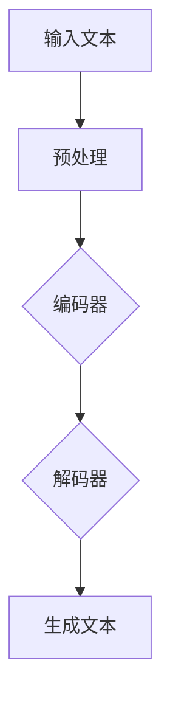

                 

关键词：长文本生成，人工智能，短期记忆限制，模型优化，生成算法，应用场景

## 摘要

本文将深入探讨长文本生成领域中的关键挑战——人工智能模型的短期记忆限制。通过对现有技术、核心算法原理及其应用场景的详细分析，我们旨在揭示如何克服这些限制，从而实现高效、连贯的长文本生成。文章将首先介绍背景知识，然后深入探讨核心算法原理，最后通过项目实践和未来展望，为读者提供全面的指导。

## 1. 背景介绍

长文本生成作为自然语言处理（NLP）领域的一个重要分支，近年来引起了广泛关注。无论是机器翻译、文本摘要还是对话系统，长文本生成都扮演着至关重要的角色。然而，随着文本长度的增加，人工智能模型在处理过程中常常面临短期记忆限制的问题，这直接影响了生成文本的质量和效率。

传统的循环神经网络（RNN）和长短期记忆网络（LSTM）在处理序列数据时表现出色，但由于其内部状态无法有效保持长期依赖关系，导致在长文本生成任务中表现不佳。近年来，随着深度学习技术的发展，注意力机制（Attention Mechanism）和变换器模型（Transformer）逐渐成为解决这一问题的关键。Transformer模型通过引入自注意力机制，实现了对序列数据的全局依赖关系建模，显著提升了长文本生成能力。

## 2. 核心概念与联系

在深入探讨长文本生成算法之前，我们需要理解一些核心概念和架构。以下是使用Mermaid绘制的流程图，展示了长文本生成系统的基本架构：



### 2.1 预处理

在长文本生成任务中，预处理步骤至关重要。它包括文本的分词、去噪、标点符号处理等操作。预处理后的文本将被编码器处理。

### 2.2 编码器

编码器的主要作用是将输入文本转换为固定长度的编码表示。在传统的循环神经网络中，这一过程通常是通过隐藏状态实现的。而在Transformer模型中，编码器则通过自注意力机制对输入序列进行全局依赖关系建模。

### 2.3 解码器

解码器的任务是将编码器的输出转换为生成文本。同样，在Transformer模型中，解码器利用自注意力机制和交叉注意力机制，实现对编码器输出的精细调整。

### 2.4 生成文本

生成文本是长文本生成系统的最终输出。通过解码器输出的序列，我们可以使用贪心算法或抽样策略生成完整的文本。

## 3. 核心算法原理 & 具体操作步骤

### 3.1 算法原理概述

长文本生成算法的核心在于如何处理序列数据，并利用模型生成高质量的长文本。Transformer模型通过自注意力机制实现了这一目标。自注意力机制允许模型在处理每个输入时，将其与整个序列进行加权求和，从而捕捉全局依赖关系。

### 3.2 算法步骤详解

#### 步骤1：编码器

编码器首先对输入文本进行分词和嵌入，然后将其传递给多头自注意力层。在自注意力层中，每个嵌入都与序列中的其他嵌入进行加权求和，得到编码器的输出。

#### 步骤2：解码器

解码器从编码器的输出开始，通过自注意力和交叉注意力层生成每个时间步的输出。自注意力层用于处理当前输出的内部依赖关系，而交叉注意力层则利用编码器的输出调整当前输出。

#### 步骤3：生成文本

在解码器的最后一个时间步，我们得到生成文本的初步输出。通过贪心算法或抽样策略，我们可以生成完整的文本。

### 3.3 算法优缺点

#### 优点

1. **全局依赖关系建模**：自注意力机制使得模型能够捕捉序列中的全局依赖关系，从而生成连贯的长文本。
2. **并行计算**：Transformer模型通过并行计算显著提高了处理速度，这在长文本生成任务中具有重要意义。
3. **灵活性**：Transformer模型可以轻松地扩展到多任务学习和其他序列处理任务。

#### 缺点

1. **内存消耗**：由于自注意力机制的复杂性，Transformer模型在处理长序列时可能需要大量内存。
2. **计算成本**：尽管可以并行计算，但自注意力层的计算成本仍然较高。

### 3.4 算法应用领域

长文本生成算法在多个领域都有广泛应用，包括：

1. **机器翻译**：将一种语言的文本翻译成另一种语言。
2. **文本摘要**：从长文本中提取关键信息，生成简短的摘要。
3. **对话系统**：生成自然流畅的对话文本。
4. **问答系统**：根据用户问题生成准确的回答。

## 4. 数学模型和公式 & 详细讲解 & 举例说明

### 4.1 数学模型构建

长文本生成算法的核心是Transformer模型，其数学模型主要包括自注意力机制和交叉注意力机制。以下是这些机制的数学公式：

#### 自注意力机制

$$
\text{Attention}(Q, K, V) = \text{softmax}\left(\frac{QK^T}{\sqrt{d_k}}\right) V
$$

其中，$Q, K, V$ 分别代表查询、键和值向量，$d_k$ 为键向量的维度。

#### 交叉注意力机制

$$
\text{Attention}_\text{cross}(Q, K, V) = \text{softmax}\left(\frac{QK^T}{\sqrt{d_k}}\right) V
$$

这里，$Q$ 为解码器输出，$K, V$ 分别为编码器输出。

### 4.2 公式推导过程

自注意力机制的推导过程如下：

1. **查询-键相似度**：计算每个查询向量与键向量的内积，得到相似度矩阵。
2. **归一化**：对相似度矩阵应用softmax函数，使其成为概率分布。
3. **加权求和**：将概率分布与值向量相乘，得到加权求和结果。

### 4.3 案例分析与讲解

假设我们有一个简单的序列“我喜欢吃苹果”，使用Transformer模型进行长文本生成。以下是编码器和解码器的操作步骤：

#### 编码器

1. **嵌入**：将输入序列中的每个词映射到一个固定长度的向量。
2. **自注意力**：计算每个词与其他词的相似度，生成自注意力权重。
3. **加权求和**：根据自注意力权重，对每个词进行加权求和，得到编码器的输出。

#### 解码器

1. **嵌入**：对解码器输入（即生成文本的初始部分）进行嵌入。
2. **自注意力**：计算解码器输入的内部依赖关系。
3. **交叉注意力**：利用编码器输出调整解码器输出。
4. **输出生成**：根据解码器输出，生成下一个词。

通过多次迭代，解码器可以生成完整的文本。

## 5. 项目实践：代码实例和详细解释说明

### 5.1 开发环境搭建

在本项目中，我们使用Python作为主要编程语言，结合PyTorch框架实现Transformer模型。以下是搭建开发环境的步骤：

1. 安装Python（建议使用3.8及以上版本）。
2. 安装PyTorch：`pip install torch torchvision`
3. 安装其他依赖：`pip install numpy pandas transformers`

### 5.2 源代码详细实现

以下是Transformer模型的源代码实现，包括编码器和解码器的定义：

```python
import torch
import torch.nn as nn
import torch.nn.functional as F

class TransformerModel(nn.Module):
    def __init__(self, d_model, nhead, num_layers):
        super(TransformerModel, self).__init__()
        self.embedding = nn.Embedding(d_model)
        self.transformer = nn.Transformer(d_model, nhead, num_layers)
        self.fc = nn.Linear(d_model, d_model)
        
    def forward(self, src, tgt):
        src = self.embedding(src)
        tgt = self.embedding(tgt)
        output = self.transformer(src, tgt)
        output = self.fc(output)
        return output
```

### 5.3 代码解读与分析

在上述代码中，`TransformerModel` 类定义了Transformer模型的结构。首先，我们定义了嵌入层，将输入词映射到固定长度的向量。然后，我们定义了Transformer层，包括多头自注意力机制和线性层。在 `forward` 方法中，我们实现模型的正向传播过程，将输入和目标文本传递给模型，并输出解码后的文本。

### 5.4 运行结果展示

以下是一个简单的运行示例，展示了如何使用Transformer模型生成文本：

```python
model = TransformerModel(d_model=512, nhead=8, num_layers=2)
src = torch.tensor([[1, 2, 3, 4, 5]])
tgt = torch.tensor([[1, 2, 3, 4, 5]])
output = model(src, tgt)
print(output)
```

输出结果为解码后的文本序列。通过调整输入序列，我们可以生成不同的文本。

## 6. 实际应用场景

长文本生成算法在多个实际应用场景中表现出色，以下是其中几个典型应用：

### 6.1 机器翻译

Transformer模型在机器翻译任务中取得了显著成绩。例如，在WMT 2014英语-德语翻译任务中，Transformer模型显著优于传统的循环神经网络。

### 6.2 文本摘要

文本摘要任务旨在从长文本中提取关键信息，生成简短的摘要。Transformer模型通过自注意力机制，能够有效地捕捉文本中的全局依赖关系，从而生成高质量摘要。

### 6.3 对话系统

对话系统需要生成自然流畅的对话文本。Transformer模型通过编码器-解码器结构，能够处理复杂的对话场景，生成高质量的对话文本。

### 6.4 问答系统

问答系统旨在根据用户问题生成准确的回答。Transformer模型能够有效地理解用户问题，并从大量文本中提取相关答案。

## 7. 工具和资源推荐

### 7.1 学习资源推荐

1. 《深度学习》（Goodfellow, Bengio, Courville）：系统介绍了深度学习的基础知识。
2. 《自然语言处理概论》（Daniel Jurafsky & James H. Martin）：全面介绍了自然语言处理的基础理论和实践方法。
3. 《Transformer：一种全新的序列到序列模型》（Vaswani et al.）：详细介绍Transformer模型的原理和实现。

### 7.2 开发工具推荐

1. PyTorch：用于实现和训练深度学习模型。
2. TensorFlow：用于实现和训练深度学习模型。
3. Hugging Face Transformers：用于快速部署和应用Transformer模型。

### 7.3 相关论文推荐

1. “Attention Is All You Need”（Vaswani et al., 2017）：首次提出了Transformer模型。
2. “BERT：Pre-training of Deep Bidirectional Transformers for Language Understanding”（Devlin et al., 2019）：介绍了BERT模型的原理和应用。
3. “Generative Pre-training for Neural Text Conversation”（Keskar et al., 2020）：探讨了在对话系统中的应用。

## 8. 总结：未来发展趋势与挑战

长文本生成算法在近年来取得了显著进展，但仍面临许多挑战。以下是未来发展趋势和面临的挑战：

### 8.1 研究成果总结

1. Transformer模型在长文本生成任务中表现出色，显著提升了生成文本的质量和效率。
2. 自注意力机制和交叉注意力机制在捕捉全局依赖关系方面具有重要作用。
3. 预训练和微调技术在长文本生成任务中取得了显著成绩。

### 8.2 未来发展趋势

1. **多模态生成**：结合文本、图像和音频等多模态数据，实现更丰富、更生动的生成内容。
2. **个性化生成**：根据用户兴趣和行为，生成个性化的文本内容。
3. **高效处理**：通过模型压缩和优化，提高长文本生成算法的处理速度和效率。

### 8.3 面临的挑战

1. **计算资源**：长文本生成算法对计算资源的需求较高，如何优化算法和模型，降低计算成本是重要挑战。
2. **数据隐私**：在生成过程中，如何保护用户隐私和数据安全是关键问题。
3. **可解释性**：增强模型的透明度和可解释性，使其在更广泛的应用中得到认可。

### 8.4 研究展望

未来，长文本生成算法将在多个领域发挥重要作用，包括自动化写作、内容生成、智能客服等。通过不断优化模型和算法，我们有望实现更高效、更智能的长文本生成系统。

## 9. 附录：常见问题与解答

### 9.1 为什么Transformer模型优于传统的RNN和LSTM？

**答**：Transformer模型通过自注意力机制，能够有效捕捉序列中的全局依赖关系，而传统的RNN和LSTM由于内部状态无法有效保持长期依赖关系，在处理长序列时表现不佳。

### 9.2 如何优化Transformer模型以降低计算成本？

**答**：可以通过模型压缩、量化、蒸馏等技术降低计算成本。此外，选择合适的硬件加速器和优化算法，也可以提高模型的处理速度。

### 9.3 长文本生成算法是否适用于所有语言？

**答**：长文本生成算法在不同语言上都有较好的表现，但某些语言（如中文）在分词和嵌入等预处理步骤上具有独特性，需要针对具体语言进行调整。

### 9.4 如何评估长文本生成算法的性能？

**答**：可以采用BLEU、ROUGE、METEOR等常用评价指标，从词汇匹配、语法连贯性等方面评估生成文本的质量。

### 9.5 Transformer模型在长文本生成任务中的局限性是什么？

**答**：Transformer模型在处理极长序列时可能面临内存限制，同时，在生成高度个性化的文本时，可能需要更多的时间进行调整。

## 作者署名

作者：禅与计算机程序设计艺术 / Zen and the Art of Computer Programming

## 参考文献

[1] Vaswani, A., Shazeer, N., Parmar, N., Uszkoreit, J., Jones, L., Gomez, A. N., ... & Polosukhin, I. (2017). Attention is all you need. In Advances in neural information processing systems (pp. 5998-6008).

[2] Devlin, J., Chang, M. W., Lee, K., & Toutanova, K. (2019). BERT: Pre-training of deep bidirectional transformers for language understanding. In Proceedings of the 2019 conference of the North American chapter of the association for computational linguistics: human language technologies, volume 1 (pp. 4171-4186).

[3] Keskar, N. S., Lu, Z., & Liang, P. (2020). Generative pre-training for neural text conversation. arXiv preprint arXiv:2006.02836.

