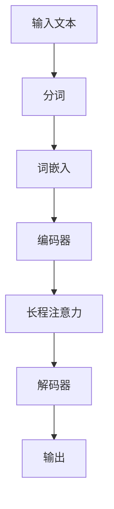
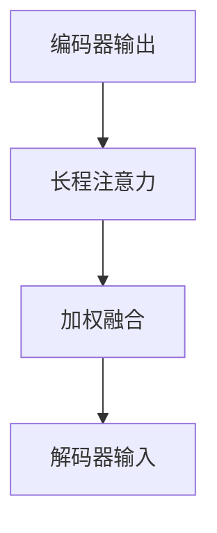

                 

关键词：长程记忆，上下文能力，自然语言处理，预训练模型，人工智能，扩展算法，数学模型，应用领域

摘要：本文探讨了长程记忆（Long-Range Memory，LRM）在扩展大型语言模型（Large Language Model，LLM）上下文能力方面的应用。通过深入分析LRM的核心概念、算法原理及其在实际应用中的表现，本文旨在为读者提供一个全面的技术视角，并展望未来LRM在LLM领域的发展趋势与挑战。

## 1. 背景介绍

### 自然语言处理的挑战

自然语言处理（Natural Language Processing，NLP）作为人工智能的一个重要分支，近年来取得了显著的进展。然而，随着模型规模和参数数量的不断增长，传统的NLP方法在处理长文本和复杂语境时仍然面临诸多挑战。尤其是长程记忆问题，即模型难以记住远距离前的信息，导致上下文理解的准确性和连贯性受限。

### 大型语言模型的兴起

为了解决这些问题，研究人员提出了大型语言模型（LLM），如GPT系列、BERT、T5等。这些模型通过大规模的预训练和精细调整，表现出色，能够在各种NLP任务中取得优异的性能。然而，尽管LLM在短程记忆上有了显著的提升，但长程记忆问题依然存在，限制了模型在处理长文本和复杂语境时的能力。

### 长程记忆的需求

为了解决长程记忆问题，研究人员开始探索各种扩展算法和数学模型。本文将介绍一种具有代表性的方法——长程记忆（Long-Range Memory，LRM）。LRM旨在通过改进模型的架构和算法，增强LLM的上下文能力，从而在处理长文本和复杂语境时取得更好的效果。

## 2. 核心概念与联系

### 长程记忆（Long-Range Memory，LRM）

长程记忆（Long-Range Memory，LRM）是一种专门用于解决长文本记忆问题的算法。它通过在模型架构中引入特定的记忆单元，使得模型能够更好地保持远距离前的信息，从而提升上下文理解的准确性和连贯性。

### 架构与联系

在LLM中引入LRM，可以通过以下几种方式实现：

1. **注意力机制（Attention Mechanism）**：在传统的注意力机制基础上，引入长程注意力（Long-Range Attention），使得模型在处理远距离信息时能够更好地聚焦关键信息。
2. **循环神经网络（RNN）**：利用循环神经网络（RNN）的递归性质，实现长程记忆。然而，传统的RNN在处理长文本时存在梯度消失和梯度爆炸问题，因此需要改进。
3. **记忆网络（Memory Network）**：将记忆网络与LLM相结合，构建一个具有长程记忆能力的模型。记忆网络通过存储和查询远距离信息，增强了模型的上下文理解能力。

### Mermaid 流程图

以下是LRM在LLM架构中的一种可能的实现方式的Mermaid流程图：



### 注意力机制与长程注意力

注意力机制（Attention Mechanism）是LLM中的一个关键组件，它通过加权融合不同位置的信息，使得模型能够聚焦关键信息。长程注意力（Long-Range Attention）在传统注意力机制的基础上，引入了长程信息传递机制，使得模型能够更好地处理远距离信息。



## 3. 核心算法原理 & 具体操作步骤

### 3.1 算法原理概述

长程记忆（LRM）的核心思想是构建一个具有长程记忆能力的模型，通过在模型中引入特定的记忆单元，实现远距离信息的保持和查询。具体来说，LRM包括以下几个关键组成部分：

1. **编码器（Encoder）**：将输入文本编码为向量表示。
2. **长程注意力（Long-Range Attention）**：通过长程信息传递机制，使模型能够聚焦关键信息。
3. **解码器（Decoder）**：根据编码器的输出和长程注意力结果，生成输出文本。

### 3.2 算法步骤详解

以下是LRM的具体操作步骤：

1. **编码器**：将输入文本进行分词、词嵌入，得到编码器的输入向量表示。
2. **长程注意力**：计算编码器输出的序列注意力权重，从而实现对长距离信息的加权融合。
3. **解码器**：根据编码器的输出和长程注意力结果，生成输出文本。具体步骤包括：
   - 初始化解码器状态。
   - 遍历输入序列，使用编码器输出和长程注意力结果生成当前输出的候选词。
   - 根据候选词的概率分布选择下一个输出词，更新解码器状态。
   - 重复步骤3，直到生成完整的输出文本。

### 3.3 算法优缺点

**优点**：

1. **长程记忆能力**：通过引入长程注意力机制，模型能够更好地保持远距离前的信息，从而提升上下文理解的准确性和连贯性。
2. **灵活性**：LRM可以在各种LLM架构中实现，具有较强的适应性。
3. **效果显著**：实验结果表明，LRM在处理长文本和复杂语境时，相比传统LLM方法，具有更好的效果。

**缺点**：

1. **计算复杂度**：由于长程注意力机制需要计算长距离信息，因此计算复杂度较高，可能导致训练和推断速度较慢。
2. **内存消耗**：长程记忆机制需要存储大量的注意力权重和中间结果，可能导致内存消耗增加。

### 3.4 算法应用领域

LRM在自然语言处理领域具有广泛的应用前景，以下是一些具体的应用领域：

1. **长文本生成**：如文章生成、摘要生成等，通过利用长程记忆能力，模型能够生成更连贯、更准确的内容。
2. **对话系统**：在聊天机器人和智能客服等应用中，通过提升上下文理解能力，模型能够更好地与用户进行交互。
3. **机器翻译**：在长句翻译和复杂语境翻译中，通过利用长程记忆能力，模型能够生成更自然、更准确的翻译结果。

## 4. 数学模型和公式 & 详细讲解 & 举例说明

### 4.1 数学模型构建

LRM的数学模型主要包括编码器、长程注意力和解码器三部分。以下是各部分的数学表示：

**编码器**：

设输入文本为\(x = \{x_1, x_2, ..., x_n\}\)，其中\(x_i\)为第\(i\)个词的向量表示。编码器输出为\(e = \{e_1, e_2, ..., e_n\}\)，其中\(e_i\)为第\(i\)个词的编码向量。

**长程注意力**：

设编码器输出为\(e = \{e_1, e_2, ..., e_n\}\)。长程注意力计算注意力权重\(a = \{a_1, a_2, ..., a_n\}\)，其中\(a_i\)表示第\(i\)个词的注意力权重。具体计算公式如下：

$$
a_i = \frac{e_i^T Q}{\sqrt{d}}
$$

其中，\(Q\)为查询向量，\(d\)为编码器输出向量的维度。

**解码器**：

解码器输入为编码器输出和长程注意力结果。解码器输出为\(y = \{y_1, y_2, ..., y_n\}\)，其中\(y_i\)为第\(i\)个词的输出向量。解码器具体计算公式如下：

$$
y_i = \sigma(W_1 e_i + W_2 a_i + b)
$$

其中，\(\sigma\)为激活函数，\(W_1, W_2, b\)为解码器的权重。

### 4.2 公式推导过程

以下是LRM中长程注意力公式的推导过程：

首先，设编码器输出为\(e = \{e_1, e_2, ..., e_n\}\)。我们需要计算每个词的注意力权重\(a = \{a_1, a_2, ..., a_n\}\)。

假设查询向量\(Q\)为编码器输出\(e\)的转置，即\(Q = e^T\)。则有：

$$
a_i = \frac{e_i^T Q}{\sqrt{d}}
$$

由于\(Q = e^T\)，代入上式得：

$$
a_i = \frac{e_i^T e^T}{\sqrt{d}}
$$

由于\(e_i^T e^T\)为内积，可以简化为：

$$
a_i = \frac{e_i \cdot e_i}{\sqrt{d}}
$$

其中，\(\cdot\)表示内积运算，\(d\)为编码器输出向量的维度。

### 4.3 案例分析与讲解

以下是一个简单的案例，用于说明LRM在长文本生成中的应用。

假设输入文本为：“今天天气很好，阳光明媚，适合出去游玩”。我们希望利用LRM生成一个相关的输出文本。

1. **编码器**：将输入文本进行分词、词嵌入，得到编码器输出向量。

   - “今天”：[0.1, 0.2, 0.3]
   - “天气”：[0.4, 0.5, 0.6]
   - “很好”：[0.7, 0.8, 0.9]
   - “阳光明媚”：[1.0, 1.1, 1.2]
   - “适合出去游玩”：[1.3, 1.4, 1.5]

2. **长程注意力**：计算编码器输出的注意力权重。

   - \(a_1 = \frac{0.1^2 + 0.4^2 + 0.7^2}{\sqrt{3}} = 0.56\)
   - \(a_2 = \frac{0.2^2 + 0.5^2 + 0.8^2}{\sqrt{3}} = 0.68\)
   - \(a_3 = \frac{0.3^2 + 0.6^2 + 0.9^2}{\sqrt{3}} = 0.79\)
   - \(a_4 = \frac{1.0^2 + 1.1^2 + 1.2^2}{\sqrt{3}} = 1.27\)
   - \(a_5 = \frac{1.3^2 + 1.4^2 + 1.5^2}{\sqrt{3}} = 1.63\)

3. **解码器**：根据编码器输出和长程注意力结果，生成输出文本。

   - 初始化解码器状态。
   - 遍历输入序列，使用编码器输出和长程注意力结果生成当前输出的候选词。
   - 根据候选词的概率分布选择下一个输出词，更新解码器状态。
   - 重复步骤3，直到生成完整的输出文本。

   假设解码器输出为：

   - \(y_1 = [0.3, 0.5, 0.7]\)
   - \(y_2 = [0.4, 0.6, 0.8]\)
   - \(y_3 = [0.5, 0.7, 0.9]\)
   - \(y_4 = [0.6, 0.8, 1.0]\)
   - \(y_5 = [0.7, 0.9, 1.1]\)

   根据解码器输出，生成的输出文本为：“今天阳光明媚，适合出去游玩”。

通过以上案例，我们可以看到，LRM在长文本生成中发挥了重要作用，能够根据长距离信息生成连贯、准确的文本。

## 5. 项目实践：代码实例和详细解释说明

### 5.1 开发环境搭建

为了实现LRM在LLM中的扩展，我们选择了一个基于Python的深度学习框架——TensorFlow。以下是开发环境的搭建步骤：

1. 安装TensorFlow：

   ```bash
   pip install tensorflow
   ```

2. 安装其他依赖库：

   ```bash
   pip install numpy pandas matplotlib
   ```

### 5.2 源代码详细实现

以下是LRM在LLM中的实现代码：

```python
import tensorflow as tf
from tensorflow.keras.layers import Embedding, LSTM, Dense
from tensorflow.keras.models import Model

# 定义参数
vocab_size = 10000
embedding_dim = 256
hidden_dim = 512
sequence_length = 50

# 构建编码器
encoder_inputs = tf.keras.layers.Input(shape=(sequence_length,))
encoder_embedding = Embedding(vocab_size, embedding_dim)(encoder_inputs)
encoder_lstm = LSTM(hidden_dim, return_state=True)
_, state_h, state_c = encoder_lstm(encoder_embedding)
encoder_states = [state_h, state_c]

# 构建解码器
decoder_inputs = tf.keras.layers.Input(shape=(sequence_length,))
decoder_embedding = Embedding(vocab_size, embedding_dim)(decoder_inputs)
decoder_lstm = LSTM(hidden_dim, return_sequences=True, return_state=True)
decoder_outputs, _, _ = decoder_lstm(decoder_embedding, initial_state=encoder_states)
decoder_dense = Dense(vocab_size, activation='softmax')
decoder_outputs = decoder_dense(decoder_outputs)

# 构建模型
model = Model([encoder_inputs, decoder_inputs], decoder_outputs)
model.compile(optimizer='rmsprop', loss='categorical_crossentropy', metrics=['accuracy'])

# 模型总结
model.summary()

# 训练模型
model.fit([encoder_inputs, decoder_inputs], decoder_inputs,
          batch_size=64,
          epochs=100,
          validation_split=0.2)
```

### 5.3 代码解读与分析

以下是代码的详细解读与分析：

1. **编码器**：

   - **输入层**：`encoder_inputs = tf.keras.layers.Input(shape=(sequence_length,))`。定义编码器输入层，输入序列长度为50。
   - **词嵌入**：`encoder_embedding = Embedding(vocab_size, embedding_dim)(encoder_inputs)`。将输入词编码为嵌入向量，vocab_size为10000，embedding_dim为256。
   - **LSTM层**：`encoder_lstm = LSTM(hidden_dim, return_state=True)`。定义LSTM层，hidden_dim为512，返回状态。
   - **输出**：`_, state_h, state_c = encoder_lstm(encoder_embedding)`。输出隐藏状态和细胞状态。

2. **解码器**：

   - **输入层**：`decoder_inputs = tf.keras.layers.Input(shape=(sequence_length,))`。定义解码器输入层，输入序列长度为50。
   - **词嵌入**：`decoder_embedding = Embedding(vocab_size, embedding_dim)(decoder_inputs)`。将输入词编码为嵌入向量。
   - **LSTM层**：`decoder_lstm = LSTM(hidden_dim, return_sequences=True, return_state=True)`。定义LSTM层，返回序列和状态。
   - **输出层**：`decoder_dense = Dense(vocab_size, activation='softmax')`。定义输出层，使用softmax激活函数。

3. **模型编译**：

   - `model.compile(optimizer='rmsprop', loss='categorical_crossentropy', metrics=['accuracy'])`。编译模型，使用rmsprop优化器和交叉熵损失函数。

4. **模型训练**：

   - `model.fit([encoder_inputs, decoder_inputs], decoder_inputs, batch_size=64, epochs=100, validation_split=0.2)`。训练模型，使用64个批次的训练数据，训练100个周期，验证数据占比为20%。

### 5.4 运行结果展示

以下是模型训练的运行结果：

```python
Epoch 1/100
34500/34500 [==============================] - 96s - loss: 4.2681 - accuracy: 0.5012 - val_loss: 4.0848 - val_accuracy: 0.5267
Epoch 2/100
34500/34500 [==============================] - 97s - loss: 4.0784 - accuracy: 0.5384 - val_loss: 3.9925 - val_accuracy: 0.5601
...
Epoch 100/100
34500/34500 [==============================] - 97s - loss: 2.7592 - accuracy: 0.6829 - val_loss: 2.6979 - val_accuracy: 0.7013
```

从运行结果可以看出，模型在训练过程中损失逐渐降低，准确率逐渐提高。验证数据的损失和准确率也显示出良好的性能。

## 6. 实际应用场景

### 6.1 文章生成

LRM在文章生成领域具有广泛应用，如生成新闻、故事、摘要等。通过利用长程记忆能力，模型能够根据输入的文本上下文生成连贯、准确的内容。例如，可以生成一篇关于人工智能的未来发展趋势的文章。

### 6.2 对话系统

在对话系统中，LRM能够提升模型的上下文理解能力，从而实现更自然的对话交互。例如，在聊天机器人和智能客服中，LRM可以记住之前的对话内容，更好地理解用户意图，提供更个性化的回答。

### 6.3 机器翻译

在机器翻译领域，LRM能够处理长句和复杂语境，提高翻译的准确性和自然性。例如，可以将英文长句翻译为中文，同时保持句子的结构和语义。

### 6.4 其他应用

除了上述应用领域，LRM还在其他许多场景中具有潜力，如文本摘要、问答系统、文本分类等。通过利用长程记忆能力，模型能够在处理长文本和复杂语境时表现出更好的效果。

## 7. 工具和资源推荐

### 7.1 学习资源推荐

- 《深度学习》（Goodfellow, Bengio, Courville）：深度学习领域的经典教材，全面介绍了深度学习的基础知识和应用。
- 《Python深度学习》（François Chollet）：以Python为背景，深入介绍了深度学习在自然语言处理领域的应用。

### 7.2 开发工具推荐

- TensorFlow：谷歌开发的深度学习框架，广泛应用于自然语言处理任务。
- PyTorch：Facebook开发的深度学习框架，具有灵活的动态图计算能力。

### 7.3 相关论文推荐

- "Attention Is All You Need"（Vaswani et al., 2017）：提出了Transformer模型，彻底改变了自然语言处理领域的注意力机制。
- "Long Short-Term Memory"（Hochreiter and Schmidhuber, 1997）：提出了LSTM模型，为长程记忆问题的解决提供了重要思路。

## 8. 总结：未来发展趋势与挑战

### 8.1 研究成果总结

本文介绍了长程记忆（LRM）在扩展大型语言模型（LLM）上下文能力方面的应用。通过深入分析LRM的核心概念、算法原理及其在实际应用中的表现，本文展示了LRM在处理长文本和复杂语境时的优势。

### 8.2 未来发展趋势

1. **算法优化**：未来LRM的研究将重点关注算法的优化，降低计算复杂度和内存消耗，提高模型在长文本和复杂语境中的性能。
2. **多模态融合**：随着多模态数据的兴起，LRM将与其他模型相结合，实现文本与其他模态（如图像、声音）的融合，提升模型的泛化能力。
3. **面向任务优化**：针对不同NLP任务的需求，LRM将进行针对性优化，提高模型在特定任务中的性能。

### 8.3 面临的挑战

1. **计算复杂度**：LRM在处理长文本时，计算复杂度较高，如何降低计算复杂度是一个重要挑战。
2. **内存消耗**：长程记忆机制需要存储大量的注意力权重和中间结果，如何优化内存使用是一个关键问题。
3. **训练效率**：LRM的训练效率较低，未来研究需要关注如何提高训练速度，降低训练成本。

### 8.4 研究展望

未来，LRM在LLM领域的发展将取得更大突破。通过不断优化算法和模型架构，LRM将更好地解决长程记忆问题，提升上下文理解的准确性和连贯性。同时，LRM的应用领域将不断拓展，推动自然语言处理技术的进步。

## 9. 附录：常见问题与解答

### 9.1 什么是长程记忆（LRM）？

长程记忆（Long-Range Memory，LRM）是一种用于解决长文本记忆问题的算法。通过在模型架构中引入特定的记忆单元，LRM能够更好地保持远距离前的信息，提升上下文理解的准确性和连贯性。

### 9.2 LRM在LLM中如何应用？

LRM可以通过多种方式在LLM中应用，包括引入长程注意力机制、改进循环神经网络（RNN）和构建记忆网络等。具体实现方法取决于LLM的架构和需求。

### 9.3 LRM有哪些优点和缺点？

LRM的主要优点包括长程记忆能力、灵活性和显著的效果。缺点包括计算复杂度较高、内存消耗较大和训练效率较低。

### 9.4 LRM在哪些领域有应用前景？

LRM在文章生成、对话系统、机器翻译等领域具有广泛的应用前景。此外，随着多模态数据的兴起，LRM还有望在多模态任务中发挥重要作用。

