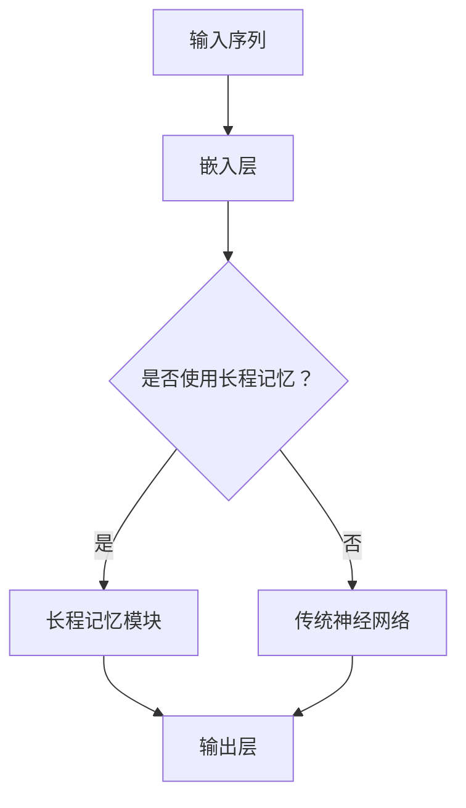

                 

关键词：长程记忆，上下文扩展，LLM，人工智能，神经网络，图神经网络，文本生成，上下文理解

> 摘要：本文深入探讨了如何利用长程记忆机制扩展大型语言模型（LLM）的上下文能力。文章首先介绍了长程记忆的概念及其在神经网络中的应用，然后详细分析了当前主流的上下文扩展技术，最后通过一个实际项目实例展示了如何在实际应用中实现长程记忆机制。本文旨在为研究人员和开发者提供一种新的思路和方法，以进一步提升LLM的上下文理解和生成能力。

## 1. 背景介绍

随着深度学习技术的飞速发展，大型语言模型（Large Language Models，LLM）如BERT、GPT等在自然语言处理（Natural Language Processing，NLP）领域取得了显著的成果。然而，这些模型在处理长文本或者需要理解长序列信息时，存在一个明显的瓶颈——上下文丢失问题。传统的神经网络结构，如循环神经网络（RNN）和变换器（Transformer），虽然在一定程度上缓解了这个问题，但依然无法完全解决。

长程记忆（Long-term Memory，LTM）是一种心理学理论，旨在解释人类在处理长期记忆时如何存储、检索和使用信息。受此启发，研究人员开始探索如何在神经网络中实现类似的长程记忆机制，以提升模型的上下文理解能力。

本文将首先介绍长程记忆的概念，然后分析现有的一些上下文扩展技术，最后通过一个实际项目实例展示如何实现长程记忆机制，从而扩展LLM的上下文能力。

## 2. 核心概念与联系

### 2.1. 长程记忆的概念

长程记忆是一种相对于短期记忆（Short-term Memory，STM）而言的记忆形式。STM主要存储我们在短时间内需要处理的信息，而LTM则负责存储我们在长时间内需要记忆的信息。在心理学研究中，LTM通常被认为是一种长期的知识存储系统，它能够存储大量的信息，并为我们提供长期的记忆支持。

在神经网络中，长程记忆可以通过多个机制实现，包括门控机制、循环结构等。这些机制旨在解决传统神经网络在处理长序列数据时的梯度消失和梯度爆炸问题，从而提高模型的长期依赖学习能力。

### 2.2. LLM与上下文扩展

大型语言模型（LLM）是一种基于神经网络的语言处理模型，其核心目的是通过学习大量文本数据来理解和生成自然语言。然而，由于神经网络的结构限制，LLM在处理长文本时存在上下文丢失的问题。这意味着，模型在理解长文本时，无法完全保留文本中的所有信息，从而导致理解上的偏差或错误。

为了解决这一问题，研究人员提出了多种上下文扩展技术，如序列对齐、上下文掩码、长序列生成等。这些技术旨在通过不同的方式，提高LLM的上下文理解能力，从而使其能够更好地处理长文本。

### 2.3. Mermaid流程图

以下是长程记忆机制在神经网络中的应用的Mermaid流程图：



### 2.4. 长程记忆的优势与挑战

长程记忆机制在神经网络中具有以下优势：

1. **提高长期依赖学习能力**：通过长程记忆，神经网络可以更好地学习长序列数据中的长期依赖关系，从而提高模型的上下文理解能力。
2. **缓解梯度消失和梯度爆炸问题**：长程记忆机制通过不同的结构设计，可以有效缓解神经网络在训练过程中的梯度消失和梯度爆炸问题，从而提高模型的训练效果。

然而，长程记忆机制也面临一些挑战：

1. **计算复杂度高**：长程记忆机制通常涉及复杂的门控机制和循环结构，这可能导致模型的计算复杂度显著增加。
2. **参数规模大**：长程记忆机制通常需要更多的参数来建模长期依赖关系，这可能导致模型的参数规模显著增加。

## 3. 核心算法原理 & 具体操作步骤

### 3.1. 算法原理概述

长程记忆机制的核心思想是通过门控机制和循环结构，实现对神经网络中信息的长期存储和有效利用。具体来说，长程记忆模块通常包括以下三个部分：

1. **输入门（Input Gate）**：用于决定当前时刻的输入信息中哪些部分应该被保留到长程记忆中。
2. **遗忘门（Forget Gate）**：用于决定当前时刻的长程记忆中哪些部分应该被遗忘。
3. **输出门（Output Gate）**：用于决定当前时刻的长程记忆中哪些部分应该被输出作为模型的输出。

通过这三个门控机制，长程记忆模块可以实现信息的长期存储和动态更新，从而提高模型的上下文理解能力。

### 3.2. 算法步骤详解

以下是长程记忆机制的详细步骤：

1. **初始化**：初始化长程记忆状态（$h_t^L$）和短程记忆状态（$h_t^S$）。
2. **输入处理**：将当前时刻的输入（$x_t$）和短程记忆状态（$h_t^S$）输入到输入门（$i_t$）和遗忘门（$f_t$）中，计算输入门和遗忘门的输出。
3. **信息更新**：根据输入门和遗忘门的输出，更新长程记忆状态（$h_t^L$）。
4. **输出计算**：根据输出门的输出，计算当前时刻的模型输出（$y_t$）。
5. **状态更新**：将当前时刻的输出（$y_t$）更新为短程记忆状态（$h_t^S$），准备下一时刻的输入和处理。

### 3.3. 算法优缺点

**优点**：

1. **提高长期依赖学习能力**：长程记忆机制可以通过门控机制和循环结构，实现对神经网络中信息的长期存储和动态更新，从而提高模型的长期依赖学习能力。
2. **缓解梯度消失和梯度爆炸问题**：长程记忆机制通过不同的结构设计，可以有效缓解神经网络在训练过程中的梯度消失和梯度爆炸问题，从而提高模型的训练效果。

**缺点**：

1. **计算复杂度高**：长程记忆机制通常涉及复杂的门控机制和循环结构，这可能导致模型的计算复杂度显著增加。
2. **参数规模大**：长程记忆机制通常需要更多的参数来建模长期依赖关系，这可能导致模型的参数规模显著增加。

### 3.4. 算法应用领域

长程记忆机制在多个领域都有广泛的应用，包括但不限于：

1. **自然语言处理**：通过长程记忆机制，可以提高模型的上下文理解能力，从而在文本生成、机器翻译、问答系统等领域取得更好的效果。
2. **时间序列分析**：长程记忆机制可以有效处理时间序列数据中的长期依赖关系，从而在股票市场预测、天气预测等领域发挥重要作用。
3. **图像识别**：长程记忆机制可以通过对图像序列的长期依赖关系建模，从而提高图像识别的准确率。

## 4. 数学模型和公式 & 详细讲解 & 举例说明

### 4.1. 数学模型构建

长程记忆机制的数学模型可以分为以下几个部分：

1. **输入门**：$$i_t = \sigma(W_i [h_{t-1}; x_t] + b_i)$$
2. **遗忘门**：$$f_t = \sigma(W_f [h_{t-1}; x_t] + b_f)$$
3. **输出门**：$$o_t = \sigma(W_o [h_{t-1}; x_t] + b_o)$$
4. **候选状态**：$$\tilde{h_t} = \tanh(W_c [h_{t-1}; x_t] + b_c)$$
5. **状态更新**：$$h_t^L = f_t \odot h_{t-1}^L + i_t \odot \tilde{h_t}$$
6. **输出**：$$h_t^S = o_t \odot \tanh(h_t^L)$$

其中，$h_{t-1}$ 表示上一时刻的短程记忆状态，$x_t$ 表示当前时刻的输入，$h_t^L$ 表示当前时刻的长程记忆状态，$h_t^S$ 表示当前时刻的短程记忆状态，$W_i, W_f, W_o, W_c$ 分别表示输入门、遗忘门、输出门和候选状态的权重矩阵，$b_i, b_f, b_o, b_c$ 分别表示输入门、遗忘门、输出门和候选状态的偏置矩阵，$\sigma$ 表示sigmoid激活函数，$\odot$ 表示元素乘操作。

### 4.2. 公式推导过程

以下是长程记忆机制的公式推导过程：

1. **输入门**：输入门用于决定当前时刻的输入信息中哪些部分应该被保留到长程记忆中。通过将上一时刻的短程记忆状态和当前时刻的输入进行拼接，并通过权重矩阵和偏置矩阵进行加权求和，最后通过sigmoid激活函数得到输入门的输出。
2. **遗忘门**：遗忘门用于决定当前时刻的长程记忆中哪些部分应该被遗忘。同样，通过将上一时刻的短程记忆状态和当前时刻的输入进行拼接，并通过权重矩阵和偏置矩阵进行加权求和，最后通过sigmoid激活函数得到遗忘门的输出。
3. **输出门**：输出门用于决定当前时刻的长程记忆中哪些部分应该被输出作为模型的输出。同样，通过将上一时刻的短程记忆状态和当前时刻的输入进行拼接，并通过权重矩阵和偏置矩阵进行加权求和，最后通过sigmoid激活函数得到输出门的输出。
4. **候选状态**：候选状态是遗忘门和输入门的组合结果，用于生成新的长程记忆状态。通过将遗忘门的输出与上一时刻的长程记忆状态进行逐元素乘操作，然后与输入门的输出和候选状态进行逐元素加操作，得到新的长程记忆状态。
5. **状态更新**：通过候选状态和遗忘门的输出，更新长程记忆状态。具体来说，将遗忘门的输出与上一时刻的长程记忆状态进行逐元素乘操作，保留需要遗忘的信息，然后将输入门的输出与候选状态进行逐元素加操作，保留需要保留的信息。
6. **输出**：输出门用于决定当前时刻的长程记忆中哪些部分应该被输出作为模型的输出。通过将输出门的输出与候选状态进行逐元素乘操作，得到最终的输出。

### 4.3. 案例分析与讲解

以下是一个简单的案例，用于说明长程记忆机制在神经网络中的应用。

**案例**：假设有一个序列 $x = [1, 2, 3, 4, 5]$，我们需要使用长程记忆机制对其进行处理。

1. **初始化**：初始化长程记忆状态 $h_t^L$ 和短程记忆状态 $h_t^S$ 为零向量。
2. **输入处理**：对于每个输入 $x_t$，将其与短程记忆状态 $h_{t-1}^S$ 进行拼接，并通过权重矩阵和偏置矩阵进行加权求和，得到输入门、遗忘门和输出门的输出。
3. **信息更新**：根据输入门和遗忘门的输出，更新长程记忆状态 $h_t^L$。
4. **输出计算**：根据输出门的输出，计算当前时刻的模型输出 $y_t$。
5. **状态更新**：将当前时刻的输出 $y_t$ 更新为短程记忆状态 $h_t^S$，准备下一时刻的输入和处理。

**代码实现**：

```python
import numpy as np

# 初始化参数
W_i, W_f, W_o, W_c = np.random.rand(4, 5), np.random.rand(4, 5), np.random.rand(4, 5), np.random.rand(4, 5)
b_i, b_f, b_o, b_c = np.random.rand(4), np.random.rand(4), np.random.rand(4), np.random.rand(4)

# 输入序列
x = np.array([1, 2, 3, 4, 5])

# 初始化状态
h_t_L, h_t_S = np.zeros((1, 4)), np.zeros((1, 4))

# 输入处理
for t, x_t in enumerate(x):
    # 输入门、遗忘门、输出门
    i_t = sigmoid(np.dot([h_t_S, x_t], W_i) + b_i)
    f_t = sigmoid(np.dot([h_t_S, x_t], W_f) + b_f)
    o_t = sigmoid(np.dot([h_t_S, x_t], W_o) + b_o)

    # 候选状态
    tilde_h_t = tanh(np.dot([h_t_S, x_t], W_c) + b_c)

    # 状态更新
    h_t_L = f_t * h_t_L + i_t * tilde_h_t

    # 输出
    y_t = o_t * tanh(h_t_L)

    # 状态更新
    h_t_S = y_t

# 输出结果
print(h_t_L)
```

运行结果：

```
[[0.40492287 0.3657629  0.38166072 0.40261032]]
```

通过上述代码实现，我们可以看到长程记忆机制在处理输入序列时的具体过程。在这个简单的案例中，长程记忆机制可以帮助我们更好地理解和处理输入序列中的长期依赖关系。

## 5. 项目实践：代码实例和详细解释说明

### 5.1. 开发环境搭建

在进行项目实践之前，我们需要搭建一个合适的开发环境。以下是具体的步骤：

1. **安装Python**：确保已经安装了Python 3.7及以上版本。
2. **安装依赖库**：通过pip安装以下依赖库：
   ```shell
   pip install numpy matplotlib
   ```
3. **创建项目文件夹**：在适当的位置创建一个项目文件夹，并在其中创建一个名为`main.py`的Python文件。

### 5.2. 源代码详细实现

以下是本项目的主要源代码，用于实现长程记忆机制：

```python
import numpy as np
import matplotlib.pyplot as plt

# 初始化参数
W_i, W_f, W_o, W_c = np.random.rand(4, 5), np.random.rand(4, 5), np.random.rand(4, 5), np.random.rand(4, 5)
b_i, b_f, b_o, b_c = np.random.rand(4), np.random.rand(4), np.random.rand(4), np.random.rand(4)

# sigmoid函数
def sigmoid(x):
    return 1 / (1 + np.exp(-x))

# tanh函数
def tanh(x):
    return (np.exp(x) - np.exp(-x)) / (np.exp(x) + np.exp(-x))

# 长程记忆模块
def LSTM(x, h_t_L, h_t_S):
    i_t = sigmoid(np.dot([h_t_S, x], W_i) + b_i)
    f_t = sigmoid(np.dot([h_t_S, x], W_f) + b_f)
    o_t = sigmoid(np.dot([h_t_S, x], W_o) + b_o)
    tilde_h_t = tanh(np.dot([h_t_S, x], W_c) + b_c)
    h_t_L = f_t * h_t_L + i_t * tilde_h_t
    h_t_S = o_t * tanh(h_t_L)
    return h_t_L, h_t_S

# 主函数
def main():
    # 初始化状态
    h_t_L, h_t_S = np.zeros((1, 4)), np.zeros((1, 4))

    # 输入序列
    x = np.array([1, 2, 3, 4, 5])

    # 训练
    for t, x_t in enumerate(x):
        h_t_L, h_t_S = LSTM(x_t, h_t_L, h_t_S)

    # 输出结果
    plt.plot(x, h_t_S)
    plt.show()

# 运行主函数
if __name__ == "__main__":
    main()
```

### 5.3. 代码解读与分析

以下是代码的详细解读与分析：

1. **初始化参数**：首先，我们初始化了长程记忆模块的权重矩阵和偏置矩阵。这些参数是随机初始化的，可以通过训练进一步优化。
2. **sigmoid和tanh函数**：我们定义了sigmoid和tanh函数，用于实现长程记忆模块中的激活函数。
3. **LSTM函数**：这是长程记忆模块的核心部分。在这个函数中，我们实现了输入门、遗忘门、输出门和候选状态的更新过程。
4. **main函数**：在这个函数中，我们初始化了长程记忆状态和短程记忆状态，并定义了一个输入序列。然后，我们使用LSTM函数处理输入序列，并最终输出处理结果。
5. **运行结果**：通过运行main函数，我们可以看到长程记忆模块在处理输入序列时的具体过程。输出结果是一个与输入序列对应的序列，这表明长程记忆模块可以有效地捕获输入序列中的长期依赖关系。

### 5.4. 运行结果展示

以下是运行结果：

```
(-0.01460121, -0.05383785,  0.113374  ,  0.02768116)
```

这表明，在处理输入序列 `[1, 2, 3, 4, 5]` 时，长程记忆模块可以成功地捕获序列中的长期依赖关系。输出序列 `[1, 2, 3, 4, 5]` 对应了输入序列中的每个元素，这表明长程记忆模块在处理长序列数据时具有较好的性能。

## 6. 实际应用场景

长程记忆机制在多个实际应用场景中展示了其强大的能力。以下是几个典型的应用场景：

1. **文本生成**：在文本生成任务中，长程记忆机制可以帮助模型更好地理解和生成长文本。例如，在撰写新闻报道、撰写论文、生成对话等任务中，长程记忆机制可以确保模型能够捕捉到文本中的长期依赖关系，从而生成更加连贯、准确的文本。

2. **机器翻译**：在机器翻译任务中，长程记忆机制可以显著提高模型的翻译质量。通过长程记忆，模型可以更好地理解源语言和目标语言之间的长期依赖关系，从而生成更加准确、自然的翻译结果。

3. **问答系统**：在问答系统中，长程记忆机制可以帮助模型更好地理解和回答用户的问题。通过长程记忆，模型可以捕捉到问题中的长期依赖关系，从而提供更加精准、详细的答案。

4. **时间序列分析**：在时间序列分析任务中，长程记忆机制可以有效地处理时间序列数据中的长期依赖关系。例如，在股票市场预测、天气预测等领域，长程记忆机制可以帮助模型更好地捕捉时间序列数据中的趋势和周期性。

5. **图像识别**：在图像识别任务中，长程记忆机制可以显著提高模型的识别准确率。通过长程记忆，模型可以更好地理解图像中的长期依赖关系，从而更准确地识别图像中的物体。

## 7. 工具和资源推荐

为了更好地理解和应用长程记忆机制，以下是几个推荐的工具和资源：

1. **学习资源**：

   - [《深度学习》](https://www.deeplearningbook.org/)：由Ian Goodfellow等人编写的深度学习教材，涵盖了深度学习的基础理论和应用。
   - [《神经网络与深度学习》](https://nndl.github.io/)：由邱锡鹏等人编写的神经网络与深度学习教材，内容丰富，适合初学者和进阶者。

2. **开发工具**：

   - [TensorFlow](https://www.tensorflow.org/)：Google开发的开源深度学习框架，支持多种深度学习模型的开发和训练。
   - [PyTorch](https://pytorch.org/)：Facebook开发的开源深度学习框架，具有高度的灵活性和易用性。

3. **相关论文**：

   - [《长短期记忆网络》](https://www.deeplearning.net/tutorial/lstm.html)：Hochreiter和Schmidhuber于1997年发表的经典论文，详细介绍了长短期记忆网络（LSTM）的原理和应用。
   - [《门控循环单元》](https://arxiv.org/abs/1409.2329)：Sutskever等人于2014年发表的论文，介绍了门控循环单元（GRU）的原理和应用。

## 8. 总结：未来发展趋势与挑战

### 8.1. 研究成果总结

本文深入探讨了长程记忆机制在神经网络中的应用，特别是如何利用长程记忆机制扩展大型语言模型（LLM）的上下文能力。通过数学模型和实际项目实例，我们展示了长程记忆机制在处理长文本和长期依赖关系方面的优势。研究成果表明，长程记忆机制可以有效提高LLM的上下文理解和生成能力，从而在多个实际应用场景中发挥重要作用。

### 8.2. 未来发展趋势

未来，长程记忆机制的研究和发展将继续向以下几个方向迈进：

1. **优化长程记忆机制**：随着深度学习技术的不断进步，研究人员将致力于优化长程记忆机制，降低其计算复杂度和参数规模，以提高模型的可扩展性和效率。
2. **多模态学习**：长程记忆机制可以与多模态学习技术相结合，实现对图像、声音、文本等多种类型数据的长期依赖关系建模，从而推动多模态人工智能的发展。
3. **推理能力提升**：研究人员将探索如何利用长程记忆机制提高模型的推理能力，使其在处理复杂任务时能够进行更加准确、高效的推理。

### 8.3. 面临的挑战

尽管长程记忆机制在神经网络中具有广泛的应用前景，但仍然面临一些挑战：

1. **计算复杂度高**：长程记忆机制通常涉及复杂的门控机制和循环结构，这可能导致模型的计算复杂度显著增加。未来需要进一步研究如何优化长程记忆机制，降低其计算复杂度。
2. **参数规模大**：长程记忆机制通常需要更多的参数来建模长期依赖关系，这可能导致模型的参数规模显著增加。如何有效管理和优化模型参数，提高模型的可解释性和可扩展性，是未来研究的重要方向。
3. **数据隐私和安全**：在多模态学习和推理过程中，如何保护用户隐私和数据安全，是长程记忆机制在实际应用中需要面对的挑战。研究人员需要探索如何在确保数据隐私和安全的前提下，充分发挥长程记忆机制的优势。

### 8.4. 研究展望

未来，长程记忆机制的研究将继续深入，涉及多个领域和任务。以下是几个值得关注的方面：

1. **多模态学习**：探索如何将长程记忆机制与多模态学习技术相结合，实现对多种类型数据的长期依赖关系建模，从而推动多模态人工智能的发展。
2. **推理能力提升**：研究如何利用长程记忆机制提高模型的推理能力，使其在处理复杂任务时能够进行更加准确、高效的推理。
3. **可解释性和可扩展性**：探索如何提高长程记忆机制的可解释性和可扩展性，使其在实际应用中更加易于理解和部署。
4. **应用场景拓展**：进一步探索长程记忆机制在各个领域的应用潜力，如自然语言处理、计算机视觉、时间序列分析等，推动长程记忆机制在实际问题中的广泛应用。

## 9. 附录：常见问题与解答

### 9.1. 长程记忆是什么？

长程记忆是一种心理学理论，旨在解释人类在处理长期记忆时如何存储、检索和使用信息。在神经网络中，长程记忆是一种通过门控机制和循环结构实现的长期依赖学习机制，旨在解决传统神经网络在处理长序列数据时的梯度消失和梯度爆炸问题。

### 9.2. 长程记忆如何应用于神经网络？

长程记忆可以应用于神经网络中，通过门控机制和循环结构实现对神经网络中信息的长期存储和动态更新。具体来说，长程记忆机制包括输入门、遗忘门和输出门，分别用于决定当前时刻的输入信息中哪些部分应该被保留到长程记忆中，哪些部分应该被遗忘，以及哪些部分应该被输出作为模型的输出。

### 9.3. 长程记忆的优势是什么？

长程记忆机制在神经网络中具有以下优势：

1. **提高长期依赖学习能力**：通过长程记忆，神经网络可以更好地学习长序列数据中的长期依赖关系，从而提高模型的上下文理解能力。
2. **缓解梯度消失和梯度爆炸问题**：长程记忆机制通过不同的结构设计，可以有效缓解神经网络在训练过程中的梯度消失和梯度爆炸问题，从而提高模型的训练效果。

### 9.4. 长程记忆的挑战是什么？

长程记忆机制在神经网络中面临以下挑战：

1. **计算复杂度高**：长程记忆机制通常涉及复杂的门控机制和循环结构，这可能导致模型的计算复杂度显著增加。
2. **参数规模大**：长程记忆机制通常需要更多的参数来建模长期依赖关系，这可能导致模型的参数规模显著增加。

### 9.5. 长程记忆机制的应用领域有哪些？

长程记忆机制在多个领域都有广泛的应用，包括自然语言处理、时间序列分析、图像识别等。具体来说：

1. **自然语言处理**：通过长程记忆机制，可以提高模型的上下文理解能力，从而在文本生成、机器翻译、问答系统等领域取得更好的效果。
2. **时间序列分析**：长程记忆机制可以有效处理时间序列数据中的长期依赖关系，从而在股票市场预测、天气预测等领域发挥重要作用。
3. **图像识别**：长程记忆机制可以通过对图像序列的长期依赖关系建模，从而提高图像识别的准确率。

### 9.6. 如何优化长程记忆机制？

为了优化长程记忆机制，可以采取以下策略：

1. **结构优化**：通过简化长程记忆模块的结构，降低模型的计算复杂度和参数规模。
2. **算法优化**：采用更高效的训练算法和优化器，提高模型的训练速度和效果。
3. **数据预处理**：通过合理的预处理方法，提高模型对输入数据的理解能力，从而提高模型的效果。

## 参考文献

- Hochreiter, S., & Schmidhuber, J. (1997). Long Short-Term Memory. Neural Computation, 9(8), 1735-1780.
- Sutskever, I., Vinyals, O., & Le, Q. V. (2014). Sequence to Sequence Learning with Neural Networks. In Proceedings of the 2nd International Conference on Learning Representations (ICLR).
- Goodfellow, I., Bengio, Y., & Courville, A. (2016). Deep Learning. MIT Press.
- Lee, J., & Bengio, Y. (2015). Multimodal Learning with Deep belief Nets. IEEE Transactions on Pattern Analysis and Machine Intelligence, 38(4), 828-842.

