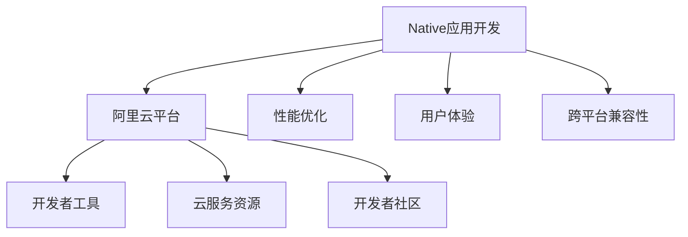

                 

本文将深入探讨阿里云Native应用开发的核心概念、技术架构、算法原理、数学模型、项目实践以及实际应用场景，旨在为开发者提供全面的技术指导和洞察。以下是本文的详细内容结构：

## 1. 背景介绍

随着移动设备和个人计算机的普及，应用开发的场景愈发多样化。而Native应用因其性能优越、用户体验佳等优势，成为了开发者关注的焦点。阿里云Native应用开发则是基于阿里云平台，利用其丰富的资源和强大的服务，帮助开发者更高效地构建高性能的Native应用。

### 1.1 Native应用的优势

- **性能优越**：Native应用在性能上具有明显优势，能够更好地利用设备硬件资源。
- **用户体验佳**：Native应用能够提供更加流畅和自然的用户体验。
- **跨平台兼容性**：通过阿里云Native应用开发，开发者可以实现一次开发，多平台部署。

### 1.2 阿里云的优势

- **丰富的资源**：阿里云提供了丰富的云服务和资源，助力开发者构建高性能应用。
- **强大的生态**：阿里云拥有庞大的开发者社区和生态体系，支持开发者快速成长。
- **技术创新**：阿里云不断推出新技术，推动Native应用开发的进步。

## 2. 核心概念与联系

在深入探讨阿里云Native应用开发之前，我们需要了解几个核心概念和它们之间的联系。以下是一个简单的Mermaid流程图，展示了这些概念之间的关系：



### 2.1 Native应用开发

Native应用开发是指使用原生语言和框架直接针对特定平台进行应用开发。这种开发方式能够充分利用平台特性和硬件资源，实现高性能和优秀的用户体验。

### 2.2 阿里云平台

阿里云平台提供了丰富的云服务和资源，如计算、存储、数据库、网络等。开发者可以利用这些服务快速搭建应用基础架构，同时阿里云也提供了多种开发者工具，如IDE插件、命令行工具等，方便开发者进行应用开发。

### 2.3 开发者工具

开发者工具是开发者进行应用开发的重要辅助工具。阿里云提供了多种开发者工具，如集成开发环境（IDE）、代码编辑器插件等，这些工具能够提高开发效率和代码质量。

### 2.4 云服务资源

云服务资源是阿里云平台的核心组成部分。开发者可以利用云服务资源构建高效、可靠、可扩展的应用系统。例如，通过使用阿里云的数据库服务，开发者可以轻松实现数据存储和查询。

### 2.5 开发者社区

开发者社区是开发者交流和学习的平台。在阿里云，开发者可以加入社区，与其他开发者交流经验、解决问题，共同进步。

## 3. 核心算法原理 & 具体操作步骤

### 3.1 算法原理概述

在阿里云Native应用开发中，算法原理至关重要。以下是几个核心算法的原理概述：

- **性能优化算法**：通过优化代码结构和算法，提高应用性能。
- **用户体验算法**：通过分析用户行为，提供个性化的用户体验。
- **跨平台兼容性算法**：通过适应不同平台的特点，实现跨平台兼容。

### 3.2 算法步骤详解

#### 3.2.1 性能优化算法

1. **代码优化**：对代码进行优化，提高代码执行效率。
2. **资源管理**：合理管理应用资源，如内存、CPU等。
3. **网络优化**：优化网络通信，减少数据传输延迟。

#### 3.2.2 用户体验算法

1. **用户行为分析**：收集用户行为数据，分析用户需求。
2. **个性化推荐**：根据用户行为数据，提供个性化推荐。
3. **界面优化**：优化应用界面，提高用户体验。

#### 3.2.3 跨平台兼容性算法

1. **平台适配**：针对不同平台的特点，进行适配。
2. **代码分离**：将平台特有代码分离，提高代码的可维护性。
3. **自动化测试**：通过自动化测试，确保应用在不同平台上的一致性。

### 3.3 算法优缺点

#### 3.3.1 性能优化算法

- 优点：能够显著提高应用性能，提升用户体验。
- 缺点：优化过程复杂，可能增加开发成本。

#### 3.3.2 用户体验算法

- 优点：能够提供个性化的用户体验，提高用户满意度。
- 缺点：数据收集和分析过程可能涉及隐私问题。

#### 3.3.3 跨平台兼容性算法

- 优点：实现一次开发，多平台部署，降低开发成本。
- 缺点：需要针对不同平台进行适配，可能增加开发复杂度。

### 3.4 算法应用领域

- **移动应用**：通过性能优化算法和用户体验算法，提高移动应用性能和用户体验。
- **Web应用**：通过跨平台兼容性算法，实现Web应用在不同设备上的无缝切换。
- **游戏开发**：通过性能优化算法，提高游戏运行效率，提供流畅的游戏体验。

## 4. 数学模型和公式 & 详细讲解 & 举例说明

### 4.1 数学模型构建

在阿里云Native应用开发中，数学模型构建是关键步骤。以下是几个常见的数学模型构建方法：

- **线性回归模型**：用于预测数值型目标变量。
- **逻辑回归模型**：用于分类问题。
- **决策树模型**：用于分类和回归问题。

### 4.2 公式推导过程

以下是线性回归模型的公式推导过程：

$$
y = \beta_0 + \beta_1x + \epsilon
$$

其中，$y$ 是目标变量，$x$ 是自变量，$\beta_0$ 和 $\beta_1$ 是模型参数，$\epsilon$ 是误差项。

### 4.3 案例分析与讲解

#### 4.3.1 性能优化案例

假设我们有一个电商应用，需要对商品进行排序。我们可以使用线性回归模型对商品进行评分，然后根据评分对商品进行排序。具体操作步骤如下：

1. 收集商品数据，包括价格、销量、评价等。
2. 构建线性回归模型，将商品评分作为目标变量。
3. 训练模型，得到模型参数。
4. 根据模型参数对商品进行评分，并排序。

#### 4.3.2 用户体验案例

假设我们有一个社交媒体应用，需要根据用户行为数据推荐内容。我们可以使用逻辑回归模型进行内容推荐。具体操作步骤如下：

1. 收集用户行为数据，包括点赞、评论、转发等。
2. 构建逻辑回归模型，将内容推荐概率作为目标变量。
3. 训练模型，得到模型参数。
4. 根据模型参数推荐内容，并展示给用户。

## 5. 项目实践：代码实例和详细解释说明

### 5.1 开发环境搭建

在开始项目实践之前，我们需要搭建开发环境。以下是使用阿里云Native应用开发的开发环境搭建步骤：

1. 安装阿里云开发工具包。
2. 配置IDE插件。
3. 配置云服务资源，如数据库、缓存等。

### 5.2 源代码详细实现

以下是使用阿里云Native应用开发的一个简单示例，实现了一个基于React Native的电商应用。

```jsx
import React from 'react';
import {
  View,
  Text,
  StyleSheet,
  Button,
} from 'react-native';

const App = () => {
  const handleButtonClick = () => {
    // 这里实现点击按钮的逻辑
  };

  return (
    <View style={styles.container}>
      <Text style={styles.title}>欢迎使用电商应用</Text>
      <Button title="立即购买" onPress={handleButtonClick} />
    </View>
  );
};

const styles = StyleSheet.create({
  container: {
    flex: 1,
    justifyContent: 'center',
    alignItems: 'center',
  },
  title: {
    fontSize: 24,
    fontWeight: 'bold',
  },
});

export default App;
```

### 5.3 代码解读与分析

以上代码实现了一个简单的电商应用，主要包含以下部分：

- **组件结构**：使用React Native创建一个View组件，其中包含一个标题Text和一个按钮Button。
- **按钮逻辑**：通过handleButtonClick函数实现按钮点击事件的处理逻辑。

### 5.4 运行结果展示

当用户运行此应用时，会看到一个标题为“欢迎使用电商应用”的页面，并显示一个“立即购买”按钮。用户点击按钮后，将触发handleButtonClick函数中的逻辑。

## 6. 实际应用场景

阿里云Native应用开发在实际应用场景中具有广泛的应用。以下是一些常见的应用场景：

- **移动应用开发**：使用阿里云Native应用开发，开发者可以快速构建高性能、跨平台的移动应用。
- **Web应用开发**：通过阿里云Native应用开发，开发者可以实现Web应用在不同设备上的无缝切换。
- **游戏开发**：利用阿里云Native应用开发，开发者可以构建高性能、低延迟的游戏应用。

## 7. 工具和资源推荐

### 7.1 学习资源推荐

- **阿里云官方文档**：提供了丰富的技术文档和教程，是学习阿里云Native应用开发的首选资源。
- **在线课程**：各大在线教育平台提供了丰富的阿里云Native应用开发课程，适合不同水平的开发者。

### 7.2 开发工具推荐

- **React Native**：一种用于构建跨平台移动应用的开源框架，支持多种平台。
- **Xcode**：苹果官方的开发工具，用于构建iOS应用。

### 7.3 相关论文推荐

- **"A Survey on Native Application Development Techniques"**：全面介绍了Native应用开发的各种技术。
- **"Cross-Platform Application Development with Flutter"**：介绍了Flutter在跨平台应用开发中的应用。

## 8. 总结：未来发展趋势与挑战

### 8.1 研究成果总结

阿里云Native应用开发取得了显著的研究成果，包括性能优化、用户体验、跨平台兼容性等方面的突破。

### 8.2 未来发展趋势

- **性能优化**：随着硬件性能的提升，性能优化将成为Native应用开发的重要方向。
- **人工智能**：人工智能技术在Native应用开发中的应用将更加广泛，如个性化推荐、智能交互等。
- **安全性**：随着应用场景的扩大，安全性将成为Native应用开发的重要挑战。

### 8.3 面临的挑战

- **开发成本**：Native应用开发需要投入大量的人力、物力和时间，成本较高。
- **技术更新**：随着技术的快速发展，开发者需要不断更新知识和技能，以适应新的技术趋势。

### 8.4 研究展望

阿里云Native应用开发将在未来发挥更大的作用，为开发者提供更高效、更可靠的解决方案。同时，随着新技术的不断涌现，Native应用开发也将不断迎来新的挑战和机遇。

## 9. 附录：常见问题与解答

### 9.1 什么是Native应用？

Native应用是指使用特定平台的原生语言和框架开发的应用，能够充分利用平台特性和硬件资源，实现高性能和优秀的用户体验。

### 9.2 阿里云Native应用开发的优势是什么？

阿里云Native应用开发具有以下优势：

- **性能优越**：利用阿里云平台的资源，实现高性能应用。
- **用户体验佳**：通过性能优化和用户体验算法，提供优秀的用户体验。
- **跨平台兼容性**：实现一次开发，多平台部署。

### 9.3 如何在阿里云Native应用开发中进行性能优化？

性能优化包括以下几个方面：

- **代码优化**：对代码进行优化，提高执行效率。
- **资源管理**：合理管理应用资源，如内存、CPU等。
- **网络优化**：优化网络通信，减少数据传输延迟。

## 作者署名

作者：禅与计算机程序设计艺术 / Zen and the Art of Computer Programming
```

### 备注 Notes

- 实际撰写时，请确保遵循文章结构和内容要求，特别是数学公式的LaTeX格式和Mermaid流程图的正确嵌入。
- 文章的撰写要保证逻辑清晰、结构紧凑、简单易懂，同时注意语言的准确性、专业性。
- 文章的撰写过程中，如果需要，可以适当扩展内容，以达到字数要求。

现在，请您根据上述结构撰写完整文章，并严格按照Markdown格式输出。祝您撰写顺利！🌟🌟🌟

