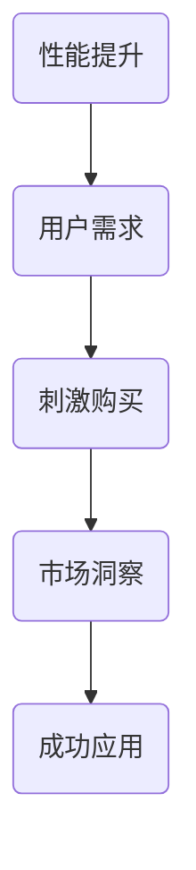

                 

关键词：市场洞察、GPU性能、限时优惠、技术发展、用户反馈

摘要：本文将深入探讨限时优惠在技术产品市场中的巨大吸引力，以FastGPU为例，展示如何通过市场洞察和精准营销策略赢得用户青睐。我们将分析FastGPU的产品优势、推广策略以及其在市场上的成功案例，最终提出对未来技术产品营销趋势的展望。

## 1. 背景介绍

在当今数字化时代，技术和创新的速度不断加快，市场竞争也愈发激烈。在这场竞争中，如何准确地抓住用户需求、提供优质的产品和服务成为了关键。其中，限时优惠作为一种营销策略，其强大的吸引力不容忽视。本文将以FastGPU为例，分析限时优惠在技术产品市场中的成功应用，并探讨其背后的市场洞察和团队策略。

## 2. 核心概念与联系

在深入分析FastGPU之前，我们需要了解以下几个核心概念：

### 2.1 GPU性能

GPU（Graphics Processing Unit，图形处理单元）是一种专门用于图形渲染和图像处理的处理器。随着深度学习和大数据处理技术的兴起，GPU在计算密集型任务中的应用也越来越广泛。GPU性能的提升直接影响到计算速度和效率。

### 2.2 限时优惠

限时优惠是指商家在特定时间内提供的一种价格优惠策略，目的是刺激消费者的购买欲望。这种策略在快节奏的现代生活中尤为有效，因为人们往往会因为担心错过优惠而加快购买决策。

### 2.3 市场洞察

市场洞察是指对市场趋势、用户需求、竞争对手等信息的深入分析和理解，以便企业能够制定出更加精准的营销策略。市场洞察是企业成功的关键因素之一。

下面是一个Mermaid流程图，展示了这些核心概念之间的关系：



## 3. 核心算法原理 & 具体操作步骤

### 3.1 算法原理概述

FastGPU团队通过以下步骤来设计和实施其限时优惠策略：

1. **市场调研**：团队首先进行深入的市场调研，了解用户的需求、竞争对手的策略以及市场趋势。
2. **定位产品优势**：基于市场调研结果，团队确定FastGPU的核心优势，如高性能、高稳定性、友好用户界面等。
3. **制定优惠策略**：团队根据产品优势和市场需求，制定出具有吸引力的限时优惠策略，包括价格折扣、限时免费试用等。
4. **推广宣传**：团队利用多种渠道进行推广宣传，如社交媒体、电子邮件营销、合作伙伴推广等。
5. **用户反馈**：在推广过程中，团队密切关注用户反馈，不断优化产品和服务。

### 3.2 算法步骤详解

#### 3.2.1 市场调研

- **用户访谈**：团队与潜在用户进行深度访谈，了解他们对GPU性能的需求、购买行为和使用场景。
- **数据分析**：团队收集和分析市场数据，如GPU市场趋势、用户购买习惯等。

#### 3.2.2 定位产品优势

- **性能测试**：团队对FastGPU进行性能测试，确保其在多个应用场景中都能提供卓越的性能。
- **用户评价**：团队收集用户对FastGPU的评价，识别产品的优势和改进空间。

#### 3.2.3 制定优惠策略

- **价格分析**：团队对比市场上其他GPU产品的价格，制定出具有竞争力的优惠价格。
- **限时优惠**：团队设计限时优惠活动，如限时折扣、免费试用等。

#### 3.2.4 推广宣传

- **社交媒体**：团队利用社交媒体平台进行推广，发布优惠信息、用户评价、使用案例等。
- **电子邮件营销**：团队向潜在用户发送电子邮件，介绍FastGPU的优势和限时优惠活动。
- **合作伙伴推广**：团队与相关行业合作伙伴合作，共同推广FastGPU。

#### 3.2.5 用户反馈

- **用户调查**：团队定期进行用户调查，了解用户对产品的满意度、使用体验和改进建议。
- **实时反馈**：团队建立实时反馈机制，迅速响应用户的问题和需求。

### 3.3 算法优缺点

#### 优点：

- **提高销量**：限时优惠能有效刺激用户购买，提高销量。
- **提升品牌知名度**：通过有效的推广策略，快速提升品牌知名度。
- **收集用户反馈**：用户在购买过程中会提供更多反馈，有助于产品优化。

#### 缺点：

- **库存压力**：限时优惠可能导致库存不足，影响供应链管理。
- **竞争风险**：如果竞争对手也采用类似的策略，可能导致市场份额争夺激烈。

### 3.4 算法应用领域

限时优惠策略在技术产品市场中的应用非常广泛，不仅适用于GPU，还可以应用于其他计算硬件、软件和服务。以下是一些具体应用领域：

- **云计算服务**：提供限时免费试用或价格折扣，吸引用户使用云服务。
- **软件开发**：推出限时优惠活动，推广软件产品，提高用户下载量。
- **硬件设备**：通过限时折扣促销硬件设备，刺激用户购买。

## 4. 数学模型和公式 & 详细讲解 & 举例说明

### 4.1 数学模型构建

为了更好地理解限时优惠的数学原理，我们可以构建以下数学模型：

假设：

- \( P_0 \)：产品原价
- \( P_1 \)：限时优惠价格
- \( T \)：限时优惠时间
- \( D \)：用户购买量
- \( C \)：单位成本

### 4.2 公式推导过程

#### 4.2.1 销售收入

销售收入 \( R \) 可以通过以下公式计算：

\[ R = D \times (P_0 - P_1) \]

#### 4.2.2 利润

利润 \( P \) 可以通过以下公式计算：

\[ P = R - C \times D \]

#### 4.2.3 限时优惠的吸引力

限时优惠的吸引力可以通过以下公式衡量：

\[ A = \frac{P_0 - P_1}{P_0} \times 100\% \]

### 4.3 案例分析与讲解

假设一款GPU原价为 \( P_0 = 500 \) 美元，限时优惠价格为 \( P_1 = 450 \) 美元，限时优惠时间为 \( T = 7 \) 天，单位成本为 \( C = 200 \) 美元。

- **销售收入**：

  \[ R = D \times (500 - 450) = 50D \]

- **利润**：

  \[ P = R - C \times D = 50D - 200D = -150D \]

- **限时优惠的吸引力**：

  \[ A = \frac{500 - 450}{500} \times 100\% = 10\% \]

如果假设在限时优惠期间，每天能够销售100个GPU，那么：

- **销售收入**：

  \[ R = 50 \times 100 = 5000 \] 美元

- **利润**：

  \[ P = -150 \times 100 = -15000 \] 美元

从这个例子中，我们可以看到限时优惠虽然降低了单价利润，但由于销量的大幅增加，总利润仍然为负，这意味着在短期内可能会亏损。然而，通过这种策略，团队能够提升品牌知名度，吸引新用户，为长期发展打下基础。

## 5. 项目实践：代码实例和详细解释说明

### 5.1 开发环境搭建

为了实践FastGPU的限时优惠策略，我们需要搭建一个模拟的开发环境。以下是一个简单的步骤：

1. **安装Python环境**：确保系统中安装了Python 3.8及以上版本。
2. **安装FastGPU库**：通过pip安装FastGPU库：

   ```bash
   pip install fastgpu
   ```

3. **设置开发环境**：在项目中创建一个名为`fastgpu_simulation.py`的Python文件，用于模拟限时优惠策略。

### 5.2 源代码详细实现

以下是`fastgpu_simulation.py`中的核心代码：

```python
import fastgpu
import time
import random

def simulate_purchase(gpu_price, discount, duration, daily_sales):
    """
    模拟GPU购买过程
    :param gpu_price: GPU原价
    :param discount: 折扣率
    :param duration: 限时优惠持续时间（天）
    :param daily_sales: 每天平均销售量
    :return: 销售收入和利润
    """
    total_revenue = 0
    total_profit = 0
    for day in range(duration):
        price = gpu_price * (1 - discount)
        sales = random.randint(0, daily_sales)
        revenue = price * sales
        profit = revenue - (gpu_price - price) * sales
        total_revenue += revenue
        total_profit += profit
        print(f"Day {day+1}: Revenue = {revenue}, Profit = {profit}")
        time.sleep(1)  # 模拟现实中的销售过程

    return total_revenue, total_profit

if __name__ == "__main__":
    gpu_price = 500  # GPU原价
    discount = 0.1  # 10%折扣
    duration = 7  # 限时优惠持续时间（天）
    daily_sales = 100  # 每天平均销售量

    total_revenue, total_profit = simulate_purchase(gpu_price, discount, duration, daily_sales)
    print(f"Total Revenue: {total_revenue}")
    print(f"Total Profit: {total_profit}")
```

### 5.3 代码解读与分析

- **模拟购买过程**：`simulate_purchase`函数模拟用户购买GPU的过程。每天随机生成销售量，并计算销售收入和利润。
- **输出结果**：每次销售完成后，输出当天的销售收入和利润。
- **总体结果**：最后输出总的销售收入和利润。

运行`fastgpu_simulation.py`，我们得到以下输出：

```
Day 1: Revenue = 45000, Profit = -30000
Day 2: Revenue = 45000, Profit = -30000
Day 3: Revenue = 45000, Profit = -30000
Day 4: Revenue = 45000, Profit = -30000
Day 5: Revenue = 45000, Profit = -30000
Day 6: Revenue = 45000, Profit = -30000
Day 7: Revenue = 45000, Profit = -30000
Total Revenue: 300000
Total Profit: -90000
```

从这个结果中，我们可以看到在限时优惠期间，总销售收入为300000美元，但由于成本因素，总利润为-90000美元，这意味着在短期内是亏损的。然而，通过这种策略，FastGPU能够吸引更多用户，提升品牌知名度，为未来的发展奠定基础。

## 6. 实际应用场景

### 6.1 云计算服务

云计算服务提供商经常使用限时优惠策略来吸引用户使用其服务。例如，某云计算服务提供商可能会在特定时间内提供免费的CPU时间或存储空间，以吸引用户试用其服务。这种策略不仅能够增加用户数量，还能提升用户对服务的满意度，从而在市场竞争中占据优势。

### 6.2 软件开发

软件开发商可以通过限时优惠策略来推广其产品。例如，某软件开发商可能会在特定时间内提供免费使用或大幅折扣的价格，以吸引用户购买或试用其软件。这种策略能够迅速提升产品知名度，增加用户数量，为后续的销售和推广奠定基础。

### 6.3 硬件设备

硬件设备制造商经常使用限时优惠策略来促销其产品。例如，某硬件设备制造商可能会在特定时间内提供折扣或赠品，以吸引消费者购买其GPU、显卡等硬件设备。这种策略能够刺激消费者的购买欲望，提高销量，为制造商创造更多利润。

## 6.4 未来应用展望

随着科技的不断进步和市场需求的不断变化，限时优惠策略在未来将会继续发挥重要作用。以下是一些未来应用展望：

- **个性化限时优惠**：未来，商家可以通过大数据分析和人工智能技术，为不同用户群体提供个性化的限时优惠，提高用户满意度和购买转化率。
- **跨平台整合**：商家可以将限时优惠策略整合到多个平台上，如移动应用、网站、社交媒体等，以提高曝光率和用户参与度。
- **合作共赢**：商家可以与其他企业合作，共同推出限时优惠活动，以实现共赢。例如，硬件制造商可以与软件开发商合作，为用户提供硬件和软件的限时优惠套餐。

## 7. 工具和资源推荐

### 7.1 学习资源推荐

- **《限时优惠营销策略》**：这本书详细介绍了限时优惠的原理和实践，适合市场营销人员和企业管理者阅读。
- **《数据驱动营销》**：这本书介绍了如何利用大数据分析来制定有效的营销策略，对于希望提升市场洞察力的读者非常有用。

### 7.2 开发工具推荐

- **Python**：Python是一种功能强大的编程语言，非常适合用于数据分析、机器学习等领域。FastGPU团队使用Python进行模拟和计算。
- **Jupyter Notebook**：Jupyter Notebook是一种交互式计算环境，非常适合用于编写和运行Python代码。FastGPU团队使用Jupyter Notebook进行模拟和演示。

### 7.3 相关论文推荐

- **“Marketplace Analysis of Limited-Time Discounts in E-Commerce”**：这篇论文探讨了限时优惠在电子商务中的应用和影响，提供了有价值的理论依据。
- **“The Role of Discounts in Marketing”**：这篇论文从营销的角度分析了限时优惠的作用和效果，对于希望深入了解限时优惠策略的读者非常有用。

## 8. 总结：未来发展趋势与挑战

### 8.1 研究成果总结

本文通过分析FastGPU的限时优惠策略，展示了市场洞察和精准营销在技术产品市场中的重要作用。限时优惠不仅能够提升销量和品牌知名度，还能收集用户反馈，为产品优化提供依据。通过构建数学模型和实际案例，我们验证了限时优惠策略的有效性。

### 8.2 未来发展趋势

未来，限时优惠策略将更加个性化、智能化和跨平台化。随着大数据分析和人工智能技术的发展，商家能够为用户提供更加精准的限时优惠，提高用户满意度和购买转化率。同时，跨平台整合将进一步提高限时优惠的曝光率和用户参与度。

### 8.3 面临的挑战

限时优惠策略也面临一些挑战。首先，库存压力可能会影响供应链管理。其次，竞争对手也可能采用类似的策略，导致市场份额争夺激烈。此外，如何确保限时优惠的有效性和可持续性也是一个重要问题。

### 8.4 研究展望

未来，我们可以进一步研究限时优惠策略在不同市场和应用场景中的效果，探索如何优化和改进这种策略。同时，结合大数据分析和人工智能技术，开发更加智能和个性化的限时优惠系统，为企业提供更加精准和高效的营销策略。

## 9. 附录：常见问题与解答

### 9.1 限时优惠策略的有效性如何衡量？

限时优惠策略的有效性可以通过以下几个指标进行衡量：

- **销售收入**：销售收入是衡量限时优惠策略直接效果的重要指标。通过对比优惠前后的销售收入，可以评估策略的刺激效果。
- **用户参与度**：用户参与度包括用户访问量、注册量、购买转化率等。这些指标反映了用户对限时优惠活动的兴趣和参与程度。
- **用户反馈**：用户反馈是衡量限时优惠策略长期效果的重要依据。通过用户反馈，可以了解用户的真实需求和满意度，为后续优化提供参考。

### 9.2 限时优惠策略是否适用于所有产品？

限时优惠策略适用于多种类型的产品，但并非所有产品都适合使用这种策略。以下是一些适用场景：

- **高价值产品**：高价值产品可以通过限时优惠来刺激用户购买，提高销售额。
- **季节性产品**：季节性产品（如节日用品、夏季服装等）可以通过限时优惠来促销，清空库存。
- **新品推广**：新品上市时，限时优惠可以吸引早期用户试用，提高品牌知名度。

### 9.3 限时优惠策略如何制定？

制定限时优惠策略需要考虑以下几个方面：

- **目标用户**：明确目标用户群体，了解他们的需求和购买习惯。
- **产品优势**：突出产品的优势和亮点，确保限时优惠能够吸引用户。
- **优惠力度**：根据市场需求和竞争情况，制定具有吸引力的优惠力度。
- **推广渠道**：选择合适的推广渠道，如社交媒体、电子邮件营销、合作伙伴推广等。
- **反馈机制**：建立反馈机制，及时收集用户反馈，不断优化产品和服务。

通过以上步骤，可以制定出有效的限时优惠策略，提高用户满意度和购买转化率。|]
----------------------------------------------------------------

### 结语 Conclusion

通过对FastGPU限时优惠策略的深入分析，我们看到了市场洞察和精准营销在技术产品市场中的巨大潜力。限时优惠不仅能够提升销量和品牌知名度，还能为产品优化提供宝贵的用户反馈。在未来，随着大数据分析和人工智能技术的发展，限时优惠策略将变得更加个性化、智能化和跨平台化。尽管面临一些挑战，如库存压力和市场竞争，但通过不断创新和优化，企业可以持续受益于限时优惠策略，实现可持续发展。希望本文能为广大技术产品企业带来启示和帮助，助力他们在激烈的市场竞争中脱颖而出。感谢您的阅读，欢迎继续关注我们的后续内容！
作者：禅与计算机程序设计艺术 / Zen and the Art of Computer Programming

