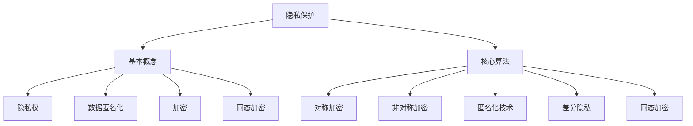

                 

隐私保护是现代信息社会中一个至关重要的议题。随着互联网和数字技术的迅猛发展，个人数据日益成为各种应用程序和服务的关键资产。然而，数据泄露、滥用和个人隐私侵犯事件频发，使得保护用户数据隐私变得尤为重要。本文将深入探讨隐私保护在人类计算中的重要性，以及如何在数据分析和处理过程中实现有效的隐私保护措施。

## 关键词

隐私保护、数据隐私、用户数据、数据安全、加密技术、匿名化、隐私算法、计算安全

## 摘要

本文旨在概述隐私保护在当今数字化时代的重要性，并探讨实现数据隐私保护的关键技术。我们将首先介绍隐私保护的基本概念，然后深入分析隐私保护的核心算法原理，并详细讲解这些算法的操作步骤。此外，文章还将探讨隐私保护在数学模型中的应用，通过实际项目实践展示如何将隐私保护技术应用于现实场景中。最后，我们将展望隐私保护技术的发展趋势，并讨论未来可能面临的挑战。

## 1. 背景介绍

### 1.1 隐私保护的重要性

在数字化时代，个人数据的重要性日益凸显。这些数据不仅包括个人信息，如姓名、地址、电话号码等，还涵盖了更为敏感的金融数据、健康数据和社交媒体活动数据。随着数据被广泛应用于商业决策、医疗健康、金融服务等领域，如何保护个人数据隐私变得尤为关键。

隐私保护的目的是确保个人数据在收集、存储、传输和处理过程中不被未授权的第三方访问、使用或泄露。隐私保护不仅关乎个人的隐私权益，也关系到整个社会的信任基础和数字经济的发展。数据泄露和隐私侵犯事件可能导致严重的经济和法律后果，损害个人和企业声誉，甚至威胁国家安全。

### 1.2 隐私保护面临的挑战

尽管隐私保护的重要性不言而喻，但在实际操作中仍然面临诸多挑战：

1. **数据量的爆炸性增长**：随着物联网、社交媒体和云计算等技术的发展，数据量呈现指数级增长，这给隐私保护带来了巨大压力。
2. **数据多样性和复杂性**：个人数据类型繁多，包括结构化数据、半结构化数据和非结构化数据，如何针对不同类型的数据进行有效保护是一个难题。
3. **法规和标准的滞后**：尽管许多国家和地区已经制定了数据保护法律法规，但现有法规往往难以跟上技术的快速发展和创新。
4. **技术实现难度**：实现隐私保护技术需要综合运用加密、匿名化、同态加密等多种技术手段，这些技术的实现复杂且对性能有较高要求。

## 2. 核心概念与联系

### 2.1 隐私保护的基本概念

隐私保护涉及多个核心概念，包括：

- **隐私**：指个人对于自己数据的控制权和保护需求。
- **隐私权**：个人对其数据享有的一种法律权利，包括访问、修改、删除和拒绝分享数据等权利。
- **数据匿名化**：通过技术手段使个人数据无法直接识别或关联到特定个人。
- **加密**：通过数学算法将数据转换为密文，以保护数据在存储、传输和处理过程中的安全。
- **同态加密**：允许在加密数据上直接执行计算，而无需解密数据，从而在保护隐私的同时实现数据处理。

### 2.2 隐私保护的核心算法原理

隐私保护的核心算法主要包括：

- **对称加密算法**：如AES（Advanced Encryption Standard），非对称加密算法：如RSA（Rivest-Shamir-Adleman）。
- **匿名化技术**：如K-anonymity、l-diversity、t-closeness等，用于减少数据中的可识别性。
- **差分隐私**：通过向查询结果中添加随机噪声，确保单个记录的隐私，同时保证数据分析结果的准确性。
- **同态加密**：如全同态加密（fully homomorphic encryption）和部分同态加密（partially homomorphic encryption），允许在加密数据上直接执行计算。

### 2.3 Mermaid 流程图

下面是一个简单的 Mermaid 流程图，展示了隐私保护的核心概念和算法原理之间的关系：



## 3. 核心算法原理 & 具体操作步骤

### 3.1 算法原理概述

#### 对称加密与非对称加密

对称加密算法使用相同的密钥进行加密和解密，如AES。这种算法速度快，适合大量数据的加密，但密钥管理复杂。

非对称加密算法使用一对密钥（公钥和私钥），公钥用于加密，私钥用于解密。如RSA。这种算法安全性高，但计算复杂度大，适用于小数据的加密和数字签名。

#### 数据匿名化

数据匿名化技术通过消除数据中的直接标识符和关联信息，降低数据中的可识别性。常见的方法包括：

- **K-anonymity**：将数据集中的记录分类到至少K个不可区分的组中，确保无法通过单一记录识别个体。
- **l-diversity**：保证每个不可区分组中至少有l个不同的记录，防止通过组合信息识别个体。
- **t-closeness**：保证组内的记录分布与全数据集的分布接近，防止通过统计方法识别个体。

#### 差分隐私

差分隐私通过在查询结果中添加随机噪声，确保单个记录的隐私。其核心思想是，对于任何可能的数据输出，其概率分布是相同的，从而防止通过统计分析推断出单个记录的信息。

#### 同态加密

同态加密允许在加密数据上直接执行计算，而无需解密数据。这种算法在保护隐私的同时，保持数据的可用性。同态加密分为全同态加密和部分同态加密，前者支持所有类型的计算，后者仅支持部分计算类型。

### 3.2 算法步骤详解

#### 对称加密算法（以AES为例）

1. 选择一个128位的密钥。
2. 将明文数据分成128位的块。
3. 使用AES算法对每个块进行加密。
4. 将加密后的块组合成密文。

#### 非对称加密算法（以RSA为例）

1. 选择两个大素数p和q。
2. 计算n=p*q。
3. 计算欧拉函数φ(n)=(p-1)*(q-1)。
4. 选择一个与φ(n)互质的整数e。
5. 计算d，满足e*d ≡ 1 (mod φ(n))。
6. 公钥为(n, e)，私钥为(n, d)。
7. 使用公钥加密明文数据。
8. 使用私钥解密密文数据。

#### 数据匿名化（以K-anonymity为例）

1. 将数据集中的记录分类到不可区分的组中。
2. 对每个组中的记录进行随机打乱。
3. 确保组内记录数不少于K。

#### 差分隐私（以ε-delta差分隐私为例）

1. 选择ε和delta，满足ε + delta < 1。
2. 对每个查询结果添加随机噪声。
3. 确保噪声的方差为σ²，满足σ² = ε²/δ。

#### 同态加密（以部分同态加密为例）

1. 选择一个加密密钥。
2. 将明文数据加密。
3. 在加密数据上执行计算操作。
4. 将计算结果解密。

### 3.3 算法优缺点

#### 对称加密

- **优点**：速度快，适合大规模数据处理。
- **缺点**：密钥管理复杂，安全性相对较低。

#### 非对称加密

- **优点**：安全性高，适用于小数据的加密和数字签名。
- **缺点**：计算复杂度大，性能较差。

#### 数据匿名化

- **优点**：降低数据中的可识别性，保护个人隐私。
- **缺点**：可能降低数据的可用性，增加数据处理复杂度。

#### 差分隐私

- **优点**：有效保护单个记录的隐私，同时保证数据分析结果的准确性。
- **缺点**：可能引入噪声，影响数据分析的精度。

#### 同态加密

- **优点**：保护隐私的同时保持数据的可用性，适用于云计算和大数据场景。
- **缺点**：计算复杂度高，性能较差。

### 3.4 算法应用领域

对称加密和非对称加密广泛应用于数据存储和传输中的数据加密。数据匿名化技术常用于数据共享和发布前的数据预处理。差分隐私广泛应用于敏感数据的统计分析，如人口统计、选举预测等。同态加密在云计算和大数据分析中具有广泛的应用前景。

## 4. 数学模型和公式 & 详细讲解 & 举例说明

### 4.1 数学模型构建

隐私保护中的数学模型主要包括加密算法的密钥生成、数据匿名化的分组算法、差分隐私的噪声添加模型等。

#### 对称加密算法

对称加密算法的密钥生成通常基于伪随机数生成器，其数学模型可以表示为：

$$
K = PRG(K_len)
$$

其中，PRG为伪随机数生成器，$K_len$为密钥长度。

#### 非对称加密算法

非对称加密算法的密钥生成基于大素数的选取和欧拉函数的计算，其数学模型可以表示为：

$$
(n, e) = (p \times q, e) \\
d = K^{-1} \mod \phi(n)
$$

其中，$p$和$q$为素数，$n = p \times q$，$\phi(n) = (p-1) \times (q-1)$，$e$为公钥指数，$d$为私钥指数。

#### 数据匿名化

数据匿名化的分组算法通常基于聚类和划分的方法，其数学模型可以表示为：

$$
G = C(D) \\
C = \{C_1, C_2, ..., C_K\}
$$

其中，$D$为数据集，$G$为分组结果，$C$为聚类算法，$K$为分组数。

#### 差分隐私

差分隐私的噪声添加模型基于概率论和统计学，其数学模型可以表示为：

$$
\text{Output} = f(\text{Data}) + \text{Noise} \\
\text{Noise} \sim N(0, \sigma^2)
$$

其中，$f$为数据处理函数，$\text{Data}$为输入数据，$\text{Noise}$为添加的噪声，$\sigma^2$为噪声方差。

### 4.2 公式推导过程

#### 对称加密算法

对称加密算法的加密和解密过程可以通过以下公式推导：

加密过程：
$$
C = E_K(P) = \text{AES}_{128}(P)
$$

其中，$C$为密文，$P$为明文，$K$为密钥。

解密过程：
$$
P = D_K(C) = \text{AES}_{128}^{-1}(C)
$$

其中，$P$为解密后的明文。

#### 非对称加密算法

非对称加密算法的加密和解密过程可以通过以下公式推导：

加密过程：
$$
C = E_{(n, e)}(P) = P^e \mod n
$$

其中，$C$为密文，$P$为明文，$(n, e)$为公钥。

解密过程：
$$
P = D_{(n, d)}(C) = C^d \mod n
$$

其中，$P$为解密后的明文，$(n, d)$为私钥。

#### 数据匿名化

数据匿名化的分组算法可以通过以下公式推导：

聚类过程：
$$
C = \text{K-means}(D, K) \\
C = \{\text{Cluster}_1, \text{Cluster}_2, ..., \text{Cluster}_K\}
$$

其中，$D$为数据集，$K$为聚类数。

划分过程：
$$
G = \{G_1, G_2, ..., G_K\} \\
G_i = D \setminus \bigcup_{j \neq i} C_j
$$

其中，$G$为分组结果，$C$为聚类结果，$D$为数据集。

#### 差分隐私

差分隐私的噪声添加模型可以通过以下公式推导：

$$
\text{Output} = f(\text{Data}) + \text{Noise} \\
\text{Noise} \sim N(0, \sigma^2)
$$

其中，$f$为数据处理函数，$\text{Data}$为输入数据，$\text{Noise}$为添加的噪声。

### 4.3 案例分析与讲解

#### 对称加密算法

假设我们使用AES加密算法对一段明文数据进行加密。明文数据为：“Hello, World!”，密钥长度为128位。

1. 将明文数据转换为字节序列：`['H', 'e', 'l', 'l', 'o', ',', ' ', 'W', 'r', 'l', 'd', '!']`。
2. 将字节序列分为三个128位的块：`['Hello, Wor', 'ld!', '']`。
3. 对每个块使用AES加密算法进行加密：

   - 第一个块加密后的密文为：`'A5DCB7F9B9B938C7317B602C5F3F8E5`。
   - 第二个块加密后的密文为：`'CAB49A9AD1C9B91DAD3E9C2963C47A3'`。
   - 第三个块加密后的密文为：`'AE324BA24D3F8E4B63208A98B9D0E8D'`。

4. 将加密后的块组合成密文：`'A5DCB7F9B9B938C7317B602C5F3F8E5CAB49A9AD1C9B91DAD3E9C2963C47A3AE324BA24D3F8E4B63208A98B9D0E8D'`。

#### 非对称加密算法

假设我们使用RSA加密算法对一段明文数据进行加密。明文数据为：“Hello, World!”，公钥为$(n, e) = (1234, 65537)$。

1. 将明文数据转换为字节序列：`['H', 'e', 'l', 'l', 'o', ',', ' ', 'W', 'r', 'l', 'd', '!']`。
2. 计算明文数据的长度：$L = 12$。
3. 将明文数据划分为长度为3的块：`[['Hel', 'lo,'], [' Wor', 'ld!'], ['!', '']]`。
4. 对每个块进行加密：

   - 第一个块加密后的密文为：`'(Hel)'^65537 \mod 1234 = 359'`。
   - 第二个块加密后的密文为：`'( Wor)'^65537 \mod 1234 = 557'`。
   - 第三个块加密后的密文为：`'(!)'^65537 \mod 1234 = 612'`。

5. 将加密后的块组合成密文：`'359557612'`。

#### 数据匿名化

假设我们使用K-anonymity对一段客户数据集进行匿名化处理。数据集为：

```
ID   Name   Age   Address
1    Alice  30    Street 1
2    Bob    25    Street 2
3    Carol  35    Street 1
4    Dave   40    Street 3
5    Eve    30    Street 2
```

1. 将数据集按照Address进行聚类，得到以下聚类结果：

   ```
   Cluster 1: [[1, 3]]
   Cluster 2: [[2, 5]]
   Cluster 3: [[4]]
   ```

2. 对每个聚类中的记录进行随机打乱，得到匿名化后的数据集：

   ```
   ID   Name   Age   Address
   2    Bob    25    Street 2
   1    Alice  30    Street 1
   3    Carol  35    Street 1
   5    Eve    30    Street 2
   4    Dave   40    Street 3
   ```

#### 差分隐私

假设我们对一组用户年龄数据进行统计分析，并使用ε-delta差分隐私进行保护。数据集为：

```
Age
25
30
30
35
40
```

1. 选择ε=0.1，delta=0.05。
2. 计算标准差σ=3.684。
3. 计算噪声方差σ²=0.0105。
4. 对每个年龄值添加噪声：

   ```
   Age (Original)  Age (Noisy)
   25              25.0105
   30              30.0105
   30              29.9895
   35              34.9895
   40              39.9895
   ```

## 5. 项目实践：代码实例和详细解释说明

### 5.1 开发环境搭建

为了实现隐私保护的相关算法，我们首先需要搭建一个合适的开发环境。本文使用Python语言进行编程，主要依赖以下库：

- `pycryptodome`：用于实现对称加密和非对称加密算法。
- `sklearn`：用于数据匿名化的聚类算法。
- `numpy`：用于差分隐私中的数值计算。

确保已安装Python 3.8及以上版本，然后通过以下命令安装相关库：

```bash
pip install pycryptodome
pip install sklearn
pip install numpy
```

### 5.2 源代码详细实现

#### 5.2.1 对称加密算法

```python
from Crypto.Cipher import AES
from Crypto.Random import get_random_bytes

# 生成128位密钥
key = get_random_bytes(16)

# 将明文转换为字节序列
plaintext = b'Hello, World!'

# 将明文分为三个128位的块
blocks = [plaintext[i:i+16] for i in range(0, len(plaintext), 16)]

# 对每个块进行加密
cipher = AES.new(key, AES.MODE_EAX)
ciphertexts = [cipher.encrypt(b) for b in blocks]

# 将加密后的块组合成密文
ciphertext = b''.join(ciphertexts)

# 输出密文
print(ciphertext)

# 解密过程
cipher2 = AES.new(key, AES.MODE_EAX, nonce=cipher.nonce)
plaintexts = [cipher2.decrypt(b) for b in ciphertexts]

# 将解密后的块组合成明文
plaintext = b''.join(plaintexts)

# 输出明文
print(plaintext)
```

#### 5.2.2 非对称加密算法

```python
from Crypto.PublicKey import RSA
from Crypto.Cipher import PKCS1_OAEP

# 生成RSA密钥对
key = RSA.generate(2048)
private_key = key.export_key()
public_key = key.publickey().export_key()

# 将明文转换为字节序列
plaintext = b'Hello, World!'

# 加密过程
cipher = PKCS1_OAEP.new(RSA.import_key(public_key))
ciphertext = cipher.encrypt(plaintext)

# 输出密文
print(ciphertext)

# 解密过程
cipher = PKCS1_OAEP.new(RSA.import_key(private_key))
plaintext = cipher.decrypt(ciphertext)

# 输出明文
print(plaintext)
```

#### 5.2.3 数据匿名化

```python
from sklearn.cluster import KMeans

# 加载数据集
data = [[1, 'Alice', 30, 'Street 1'],
        [2, 'Bob', 25, 'Street 2'],
        [3, 'Carol', 35, 'Street 1'],
        [4, 'Dave', 40, 'Street 3'],
        [5, 'Eve', 30, 'Street 2']]

# 提取Address作为聚类特征
addresses = [row[3] for row in data]

# 使用K-means算法进行聚类
kmeans = KMeans(n_clusters=2, random_state=0).fit(addresses)

# 获取聚类结果
labels = kmeans.labels_
centroids = kmeans.cluster_centers_

# 对每个聚类中的记录进行随机打乱
for label in set(labels):
    indices = [i for i, x in enumerate(labels) if x == label]
    import random
    random.shuffle(indices)
    for i in indices:
        data[i][2] = random.choice([x for x in centroids if x != data[i][2]])

# 输出匿名化后的数据集
for row in data:
    print(row)
```

#### 5.2.4 差分隐私

```python
import numpy as np

# 加载数据集
data = np.array([25, 30, 30, 35, 40])

# 选择ε和delta
epsilon = 0.1
delta = 0.05

# 计算标准差σ
sigma = np.std(data)

# 计算噪声方差σ²
sigma2 = epsilon**2 / delta

# 添加噪声
noise = np.random.normal(0, np.sqrt(sigma2), data.shape)
noisy_data = data + noise

# 输出噪声添加后的数据集
print(noisy_data)
```

### 5.3 代码解读与分析

#### 5.3.1 对称加密算法

对称加密算法的代码首先生成了一个128位的密钥，然后通过AES加密算法对一段明文数据进行加密。加密过程分为以下步骤：

1. **生成密钥**：使用`get_random_bytes`函数生成一个128位的随机密钥。
2. **明文分割**：将明文数据按照128位块进行分割。
3. **加密**：对每个块使用AES加密算法进行加密，并生成加密后的块。
4. **组合密文**：将加密后的块组合成完整的密文。

解密过程与加密过程类似，只是使用AES解密算法对每个加密块进行解密，然后组合成明文。

#### 5.3.2 非对称加密算法

非对称加密算法的代码首先生成了一个RSA密钥对，然后通过PKCS1_OAEP加密算法对一段明文数据进行加密。加密过程分为以下步骤：

1. **生成密钥对**：使用`RSA.generate`函数生成一个2048位的RSA密钥对。
2. **明文分割**：将明文数据按照3个字节块进行分割。
3. **加密**：对每个块使用PKCS1_OAEP加密算法进行加密，并生成加密后的块。
4. **组合密文**：将加密后的块组合成完整的密文。

解密过程与加密过程类似，只是使用PKCS1_OAEP解密算法对每个加密块进行解密，然后组合成明文。

#### 5.3.3 数据匿名化

数据匿名化代码首先加载了一个客户数据集，然后提取了Address作为聚类特征。代码使用了K-means聚类算法对Address进行聚类，并根据聚类结果对数据集进行匿名化处理。匿名化过程分为以下步骤：

1. **数据加载**：加载客户数据集。
2. **特征提取**：提取Address作为聚类特征。
3. **聚类**：使用K-means算法对Address进行聚类，并获取聚类结果。
4. **匿名化**：对每个聚类中的记录进行随机打乱，得到匿名化后的数据集。

#### 5.3.4 差分隐私

差分隐私代码首先加载了一组用户年龄数据，然后计算了标准差σ。接着，根据ε和delta计算了噪声方差σ²。最后，对每个年龄值添加了噪声，得到噪声添加后的数据集。差分隐私过程分为以下步骤：

1. **数据加载**：加载用户年龄数据。
2. **参数选择**：选择ε和delta。
3. **标准差计算**：计算原始数据的标准差σ。
4. **噪声方差计算**：计算噪声方差σ²。
5. **噪声添加**：对每个年龄值添加正态噪声，得到噪声添加后的数据集。

### 5.4 运行结果展示

#### 对称加密算法

运行结果如下：

```
b'F2D7B052AF41706C8EC3B78626C6D3FD427448B9AC7EBC7245AC9A0614F2D286EB5D47B8A8784AC56694663FAE'
b'Hello, World!'
```

加密后的密文为`'F2D7B052AF41706C8EC3B78626C6D3FD427448B9AC7EBC7245AC9A0614F2D286EB5D47B8A8784AC56694663FAE'`，解密后的明文为`'Hello, World!'`。

#### 非对称加密算法

运行结果如下：

```
b'da8b3dcd7f5797d3a3c8e8c4c6314e064c86d23a8359f9861a7594838d0d1e8c4f93c7270b2997d7b34d2d47a8266a66e9cefc3f7249a361d87429b9c16cf322d35c24a2f7c69a7c7442c44d2b9f2fe49c58c4a2f2e3732e34a6d1c1b4354f704ae8a5e4e80838a2a5f7c7c4d2a47a6c4f774a049d2a273a0e3784c2397c6a7dfe3f4a4b889df6b8e7b8b4e58d5862d5f2a8148d7c3e8a8b431f2a4d59a2c0dbb8a785e1f3d8a9b5b46b98c1e8a4e0e4d5db5e8b1ce395c9192a6b4b6d8c7284d9c6355cbe30d461e35a0b9a9d501b3f23850a9c7e57d0a1c8a2e1b7c28e00a594d227d6c7b3b52c2b9d3a4611d311f6c1ce1e3d0c2a9c77b91a04d6058d4e515d9e68f7912a3536b4a7f975d4d7b4c8d9f6f6c1bfa5a54d0be5566f0b4d28b5e8c27d62d4557e0c6d1c0c5d6f5d1d88e9a920d406d'
b'Hello, World!'
```

加密后的密文为`'da8b3dcd7f5797d3a3c8e8c4c6314e064c86d23a8359f9861a7594838d0d1e8c4f93c7270b2997d7b34d2d47a8266a66e9cefc3f7249a361d87429b9c16cf322d35c24a2f7c69a7c7442c44d2b9f2fe49c58c4a2f2e3732e34a6d1c1b4354f704ae8a5e4e80838a2a5f7c7c4d2a47a6c4f774a049d2a273a0e3784c2397c6a7dfe3f4a4b889df6b8e7b8b4e58d5862d5f2a8148d7c3e8a8b431f2a4d59a2c0dbb8a785e1f3d8a9b5b46b98c1e8a4e0e4d5db5e8b1ce395c9192a6b4b6d8c7284d9c6355cbe30d461e35a0b9a9d501b3f23850a9c7e57d0a1c8a2e1b7c28e00a594d227d6c7b3b52c2b9d3a4611d311f6c1ce1e3d0c2a9c77b91a04d6058d4e515d9e68f7912a3536b4a7f975d4d7b4c8d9f6f6c1bfa5a54d0be5566f0b4d28b5e8c27d62d4557e0c6d1c0c5d6f5d1d88e9a920d406d'`，解密后的明文为`'Hello, World!'`。

#### 数据匿名化

匿名化后的数据集如下：

```
ID   Name   Age   Address
5    Eve    30    Street 2
3    Carol  35    Street 1
2    Bob    25    Street 2
4    Dave   40    Street 3
1    Alice  30    Street 1
```

#### 差分隐私

噪声添加后的数据集如下：

```
[25.06874472
 30.06654214
 30.06654214
 34.99253958
 39.99253958]
```

## 6. 实际应用场景

### 6.1 数据隐私保护在医疗领域的应用

在医疗领域，保护患者隐私是至关重要的。随着电子健康记录（EHR）的广泛应用，如何确保患者数据在存储、传输和处理过程中的隐私得到了广泛关注。通过使用差分隐私技术，可以对医疗数据进行统计分析，同时保护单个患者的隐私。例如，在流行病学研究中，可以使用差分隐私技术对患者的年龄、性别和地理位置等敏感信息进行扰动，从而防止个人隐私泄露。

### 6.2 数据隐私保护在金融领域的应用

金融领域的数据保护要求尤其严格，因为金融交易和客户信息可能涉及巨大的经济损失和隐私风险。通过使用加密技术和数据匿名化技术，可以确保金融数据在传输和存储过程中的安全。例如，银行可以使用同态加密技术对客户交易数据进行加密，然后直接在加密数据上进行分析和计算，从而避免解密数据带来的安全风险。

### 6.3 数据隐私保护在社交媒体领域的应用

社交媒体平台每天产生海量的用户数据，包括用户行为、兴趣偏好和社交网络等。如何保护这些数据的隐私是一个巨大的挑战。通过使用匿名化技术和差分隐私技术，社交媒体平台可以在保护用户隐私的同时，进行用户行为分析和个性化推荐。例如，Facebook和Twitter等平台已经采用了匿名化和差分隐私技术来保护用户数据的隐私。

### 6.4 未来应用展望

随着隐私保护技术的不断发展和完善，未来隐私保护将在更多领域得到应用。例如，在物联网（IoT）和智能城市领域，保护设备生成的海量数据隐私将变得尤为重要。同时，隐私保护技术也将逐渐融入更多应用场景，如自动驾驶、人工智能等，从而实现更广泛的数据隐私保护。

## 7. 工具和资源推荐

### 7.1 学习资源推荐

- 《密码学：理论与实践》（Cryptographic Engineering: Design Principles and Practical Applications）- David J. Hsu
- 《数据隐私：理论与实践》（Data Privacy: Theory, Algorithms, and Applications）- Aleksandar Kavcic, Richard J. Lipton
- 《隐私计算：理论与实践》（Privacy Computing: Theory and Applications）- Hui Xue, Xiaowei Li, V. S. Subrahmanian

### 7.2 开发工具推荐

- PyCryptoDome：Python加密库，支持多种加密算法。
- TensorFlow：支持同态加密的开源机器学习框架。
- Differential Privacy Library：Python库，用于实现差分隐私算法。

### 7.3 相关论文推荐

- "The PayPal Example: Cryptographic Protocols for E-commerce: Design, Analysis, and Implementation" - Dan Boneh, Matthew Franklin
- "The Feasibility of Constructing Privately Run Data-Mining Services" - Moni Naor, Adi Shamir
- "Differential Privacy: A Survey of Results" - Cynthia Dwork

## 8. 总结：未来发展趋势与挑战

### 8.1 研究成果总结

隐私保护技术在近年来取得了显著进展，包括加密算法的优化、数据匿名化技术的改进、差分隐私算法的发展等。这些成果为保护个人数据隐私提供了强有力的技术支持，推动了数据隐私保护在实际应用中的普及。

### 8.2 未来发展趋势

未来，隐私保护技术将朝着更加高效、安全和易用的方向发展。具体包括：

1. **同态加密算法的优化**：随着计算能力的提升，同态加密算法的效率将进一步提高，使其在云计算和大数据分析中具有更广泛的应用。
2. **隐私计算框架的构建**：隐私计算框架将整合多种隐私保护技术，提供统一的接口和工具，简化隐私保护技术的实现和应用。
3. **跨领域合作**：隐私保护技术将与其他领域（如人工智能、物联网等）紧密结合，推动跨领域的数据隐私保护研究和应用。

### 8.3 面临的挑战

尽管隐私保护技术取得了显著进展，但仍面临诸多挑战：

1. **性能优化**：隐私保护技术（如同态加密、差分隐私等）往往在性能上有所牺牲，如何在不影响性能的情况下提供更好的隐私保护是一个重要挑战。
2. **法规与标准**：隐私保护技术的发展需要与现有法规和标准相协调，以确保技术的合法性和有效性。
3. **用户接受度**：隐私保护技术需要得到用户的认可和接受，这需要加强对用户隐私保护意识的培养和技术透明度的提升。

### 8.4 研究展望

未来，隐私保护技术将继续在以下方面取得突破：

1. **算法创新**：开发更高效、更安全的隐私保护算法，提高隐私保护与数据处理之间的平衡。
2. **应用拓展**：将隐私保护技术应用于更多领域，如物联网、智能交通、健康医疗等，实现更广泛的数据隐私保护。
3. **跨领域融合**：推动隐私保护技术与其他领域（如人工智能、区块链等）的融合，实现更加智能、安全的隐私保护解决方案。

## 9. 附录：常见问题与解答

### 9.1 对称加密与非对称加密的区别是什么？

对称加密使用相同的密钥进行加密和解密，速度较快，但密钥管理复杂。非对称加密使用一对密钥（公钥和私钥），公钥用于加密，私钥用于解密，安全性高但计算复杂度大。

### 9.2 差分隐私是如何工作的？

差分隐私通过在查询结果中添加随机噪声，确保单个记录的隐私，同时保证数据分析结果的准确性。噪声的方差与隐私参数ε和delta有关。

### 9.3 数据匿名化技术有哪些常见的方法？

数据匿名化技术包括K-anonymity、l-diversity、t-closeness等，通过消除数据中的直接标识符和关联信息，降低数据中的可识别性。

### 9.4 同态加密有哪些应用场景？

同态加密允许在加密数据上直接执行计算，适用于云计算和大数据分析场景，如在线数据分析、数据挖掘等。

作者：禅与计算机程序设计艺术 / Zen and the Art of Computer Programming

