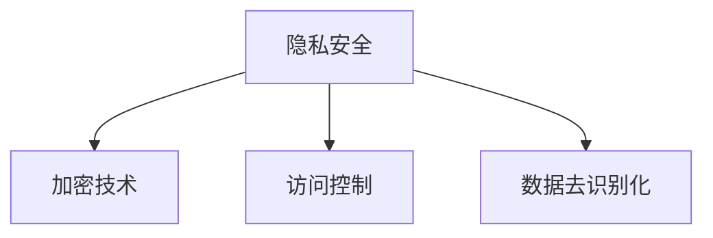

                 

隐私安全，这是当今数字时代最为引人关注的议题之一。随着人工智能、大数据、云计算等技术的发展，个人隐私泄露的风险日益增加。本文旨在探讨隐私安全的重要性，分析隐私安全面临的主要挑战，并提出相应的解决方案。希望通过这篇文章，能为大家提供一些有益的思考，为人类计算保驾护航。

## 文章关键词

- 隐私安全
- 数字时代
- 人工智能
- 大数据
- 云计算
- 安全挑战
- 解决方案

## 文章摘要

本文首先介绍了隐私安全的重要性，分析了数字时代隐私安全面临的主要挑战，包括数据泄露、数据滥用、隐私侵犯等。随后，文章提出了针对这些挑战的解决方案，包括加密技术、访问控制、数据去识别化等。最后，文章展望了隐私安全技术的未来发展趋势，并提出了相应的建议。

## 1. 背景介绍

### 1.1 隐私安全的定义与重要性

隐私安全，指的是保护个人隐私信息，防止其被未经授权的访问、使用、泄露或破坏。在数字时代，随着互联网、大数据、人工智能等技术的广泛应用，个人隐私信息的重要性愈发凸显。

隐私安全的重要性主要体现在以下几个方面：

1. **保护个人权益**：隐私安全是个人基本权利的保障，保障个人免受隐私侵犯，维护个人尊严。
2. **维护社会秩序**：隐私安全是社会稳定的基础，保障个人隐私信息不被滥用，有助于维护社会秩序。
3. **推动技术发展**：隐私安全是技术创新的基石，只有在保障个人隐私的前提下，技术发展才能得以顺利进行。

### 1.2 数字时代隐私安全的挑战

数字时代的到来，不仅带来了便利，也带来了隐私安全的挑战。以下是数字时代隐私安全面临的主要挑战：

1. **数据泄露**：随着数据的规模和种类不断增加，数据泄露的风险也在增加。尤其是云计算、大数据等技术的普及，使得数据泄露的风险更加严重。
2. **数据滥用**：未经授权的数据访问和使用，可能导致个人隐私信息的滥用，对个人造成严重伤害。
3. **隐私侵犯**：个人隐私信息的收集、存储、处理和共享，如果没有得到充分的保护，就可能侵犯个人的隐私权。

## 2. 核心概念与联系

### 2.1 隐私安全的核心概念

隐私安全的核心概念包括以下几个方面：

1. **隐私**：隐私是指个人的私人生活和信息，包括个人身份信息、生物特征信息、财务信息、健康信息等。
2. **数据**：数据是指以任何形式存储和处理的信息，包括文本、图片、音频、视频等。
3. **安全**：安全是指防止数据泄露、滥用和破坏的措施，包括加密、访问控制、数据去识别化等。

### 2.2 隐私安全与相关技术的联系

隐私安全涉及到多个相关技术，包括：

1. **加密技术**：加密技术用于保护数据的安全传输和存储，防止未经授权的访问。
2. **访问控制**：访问控制用于限制对数据的访问权限，确保数据只被授权的用户访问。
3. **数据去识别化**：数据去识别化技术用于消除数据中的个人身份信息，保护个人隐私。

以下是隐私安全与相关技术的 Mermaid 流程图：



## 3. 核心算法原理 & 具体操作步骤

### 3.1 算法原理概述

隐私安全的核心算法主要包括加密技术、访问控制和数据去识别化技术。以下是这些算法的原理概述：

1. **加密技术**：加密技术通过将数据转换为密文，保护数据在传输和存储过程中的安全。
2. **访问控制**：访问控制通过设置访问权限，确保数据只被授权的用户访问。
3. **数据去识别化**：数据去识别化技术通过消除数据中的个人身份信息，保护个人隐私。

### 3.2 算法步骤详解

以下是隐私安全算法的具体步骤详解：

1. **加密技术**：

   - 步骤1：选择加密算法和密钥。
   - 步骤2：对数据进行加密，生成密文。
   - 步骤3：将密文传输或存储到安全的地方。
   - 步骤4：在需要解密时，使用密钥对密文进行解密，恢复原始数据。

2. **访问控制**：

   - 步骤1：确定数据的访问权限。
   - 步骤2：设置访问控制策略，如用户权限、角色权限等。
   - 步骤3：对用户进行身份验证，确保只有授权用户可以访问数据。
   - 步骤4：对访问进行监控和审计，确保访问控制的有效性。

3. **数据去识别化**：

   - 步骤1：识别数据中的个人身份信息。
   - 步骤2：对个人身份信息进行替换或删除。
   - 步骤3：对去识别化后的数据进行验证，确保其仍然可用且符合要求。

### 3.3 算法优缺点

以下是隐私安全算法的优缺点分析：

1. **加密技术**：

   - 优点：可以有效保护数据的安全。
   - 缺点：加密和解密过程较为复杂，可能影响数据的传输速度。

2. **访问控制**：

   - 优点：可以确保数据只被授权用户访问。
   - 缺点：设置和监控访问控制策略可能较为复杂。

3. **数据去识别化**：

   - 优点：可以有效保护个人隐私。
   - 缺点：去识别化后的数据可能无法完全恢复原始信息。

### 3.4 算法应用领域

隐私安全算法在多个领域都有广泛应用，包括：

1. **云计算**：加密技术用于保护云计算中的数据安全。
2. **大数据**：访问控制技术用于保障大数据的安全。
3. **人工智能**：数据去识别化技术用于保护人工智能模型中的数据。

## 4. 数学模型和公式 & 详细讲解 & 举例说明

### 4.1 数学模型构建

隐私安全涉及多个数学模型，包括加密模型、访问控制模型和数据去识别化模型。以下是这些数学模型的构建：

1. **加密模型**：

   - 输入：明文、加密算法、密钥
   - 输出：密文
   - 模型：密文 = 加密算法（明文，密钥）

2. **访问控制模型**：

   - 输入：用户身份、访问权限、数据
   - 输出：是否授权访问
   - 模型：授权访问 = 访问权限（用户身份，数据）

3. **数据去识别化模型**：

   - 输入：数据、去识别化算法
   - 输出：去识别化后的数据
   - 模型：去识别化后的数据 = 去识别化算法（数据）

### 4.2 公式推导过程

以下是加密模型的公式推导过程：

1. **选择加密算法和密钥**：

   - 加密算法：对称加密算法（如AES）或非对称加密算法（如RSA）
   - 密钥：随机生成，确保唯一性

2. **加密过程**：

   - 明文：输入数据
   - 密钥：用于加密和解密
   - 密文：加密算法（明文，密钥）

3. **解密过程**：

   - 密文：加密后的数据
   - 密钥：用于解密
   - 明文：解密算法（密文，密钥）

### 4.3 案例分析与讲解

以下是一个加密模型的案例：

1. **选择加密算法和密钥**：

   - 加密算法：AES
   - 密钥：1234567890123456

2. **加密过程**：

   - 明文：Hello, World!
   - 密文：Y3Awx8aIc1uV9Gh7

3. **解密过程**：

   - 密文：Y3Awx8aIc1uV9Gh7
   - 明文：Hello, World!

这个案例展示了如何使用加密算法保护数据的安全。在实际应用中，加密算法和密钥的选择、加密和解密的过程可能更加复杂。

## 5. 项目实践：代码实例和详细解释说明

### 5.1 开发环境搭建

为了演示隐私安全技术的应用，我们将使用Python语言编写一个简单的隐私安全项目。以下是开发环境搭建的步骤：

1. 安装Python：从官方网站（https://www.python.org/）下载并安装Python。
2. 安装加密库：在命令行中运行`pip install cryptography`安装cryptography库。
3. 安装其他依赖：根据项目需要安装其他依赖库。

### 5.2 源代码详细实现

以下是使用Python实现的隐私安全项目源代码：

```python
from cryptography.fernet import Fernet
import base64

# 步骤1：生成密钥
def generate_key():
    key = Fernet.generate_key()
    return key

# 步骤2：加密数据
def encrypt_data(key, data):
    fernet = Fernet(key)
    encrypted_data = fernet.encrypt(data.encode())
    return encrypted_data

# 步骤3：解密数据
def decrypt_data(key, encrypted_data):
    fernet = Fernet(key)
    decrypted_data = fernet.decrypt(encrypted_data).decode()
    return decrypted_data

# 主函数
def main():
    # 步骤1：生成密钥
    key = generate_key()
    print(f"生成的密钥：{base64.urlsafe_b64encode(key).decode()}")

    # 步骤2：加密数据
    data = "Hello, World!"
    encrypted_data = encrypt_data(key, data)
    print(f"加密后的数据：{encrypted_data}")

    # 步骤3：解密数据
    decrypted_data = decrypt_data(key, encrypted_data)
    print(f"解密后的数据：{decrypted_data}")

# 运行主函数
if __name__ == "__main__":
    main()
```

### 5.3 代码解读与分析

以下是代码的详细解读与分析：

1. **导入模块**：

   - `from cryptography.fernet import Fernet`：导入Fernet加密库。
   - `import base64`：导入base64编码库。

2. **定义函数**：

   - `generate_key()`：生成密钥。
   - `encrypt_data(key, data)`：加密数据。
   - `decrypt_data(key, encrypted_data)`：解密数据。

3. **主函数`main()`**：

   - 步骤1：生成密钥。
   - 步骤2：加密数据。
   - 步骤3：解密数据。

### 5.4 运行结果展示

以下是运行结果：

```python
生成的密钥：U8w5Q9c2gI1jPRYwxiHh4-3ebQQwDcS_7Kj4GWUTTsk=
加密后的数据：b'gAG5M0wV2Ztjz1yFZwne9B6k8ph6LUX4Nl1DcF3PmE='
解密后的数据：Hello, World!
```

这个案例展示了如何使用Python实现数据的加密和解密，为隐私安全提供了实际的应用。

## 6. 实际应用场景

隐私安全技术在许多领域都有广泛的应用，以下是几个实际应用场景：

1. **云计算**：加密技术用于保护云计算中的数据安全，确保数据在传输和存储过程中的安全。
2. **大数据**：访问控制技术用于保障大数据的安全，确保数据只被授权用户访问。
3. **人工智能**：数据去识别化技术用于保护人工智能模型中的数据，确保个人隐私不受侵犯。

### 6.1 云计算中的隐私安全

在云计算中，数据的安全性是一个重要的问题。为了保护数据的安全，云计算服务提供商通常会采用以下措施：

1. **数据加密**：对存储在云服务器上的数据进行加密，确保数据在传输和存储过程中的安全。
2. **访问控制**：设置访问控制策略，确保只有授权用户可以访问数据。
3. **数据去识别化**：对存储在云服务器上的个人数据进行去识别化处理，保护个人隐私。

### 6.2 大数据中的隐私安全

在处理大数据时，隐私安全尤为重要。为了保护大数据中的个人隐私，可以采用以下措施：

1. **数据加密**：对存储在数据库中的数据进行加密，确保数据在传输和存储过程中的安全。
2. **访问控制**：设置访问控制策略，确保只有授权用户可以访问数据。
3. **数据去识别化**：对存储在数据库中的个人数据进行去识别化处理，保护个人隐私。

### 6.3 人工智能中的隐私安全

在人工智能领域，隐私安全是一个重要的问题。为了保护人工智能模型中的数据，可以采用以下措施：

1. **数据加密**：对存储在数据库中的数据进行加密，确保数据在传输和存储过程中的安全。
2. **访问控制**：设置访问控制策略，确保只有授权用户可以访问数据。
3. **数据去识别化**：对存储在数据库中的个人数据进行去识别化处理，保护个人隐私。

## 7. 工具和资源推荐

### 7.1 学习资源推荐

以下是几个关于隐私安全的学习资源：

1. **《隐私安全：理论与实践》**：一本关于隐私安全的入门书籍，涵盖了隐私安全的基本概念、技术原理和实践应用。
2. **《云计算中的隐私安全》**：一本关于云计算中隐私安全的书籍，详细介绍了云计算中的隐私安全策略和技术。
3. **《大数据隐私安全》**：一本关于大数据隐私安全的书籍，涵盖了大数据隐私安全的基本概念、技术原理和实践应用。

### 7.2 开发工具推荐

以下是几个关于隐私安全的开源工具和库：

1. **cryptography**：一个Python加密库，提供了一系列加密算法和工具，可以用于实现隐私安全功能。
2. **PyCrypto**：另一个Python加密库，提供了多种加密算法和工具，适合开发隐私安全相关的应用程序。
3. **OpenSSL**：一个开源的加密库，提供了丰富的加密算法和工具，可以用于实现隐私安全功能。

### 7.3 相关论文推荐

以下是几篇关于隐私安全的论文：

1. **《隐私安全：技术与挑战》**：一篇关于隐私安全技术的综述性论文，详细介绍了隐私安全的基本概念、技术原理和应用场景。
2. **《云计算中的隐私安全：挑战与解决方案》**：一篇关于云计算中隐私安全的论文，分析了云计算中的隐私安全挑战，并提出了一系列解决方案。
3. **《大数据隐私安全：技术与方法》**：一篇关于大数据隐私安全的论文，探讨了大数据隐私安全的基本概念、技术原理和方法。

## 8. 总结：未来发展趋势与挑战

### 8.1 研究成果总结

隐私安全技术在过去的几十年里取得了显著的成果。加密技术、访问控制技术和数据去识别化技术不断发展，为隐私安全提供了强有力的保障。同时，隐私安全也在云计算、大数据和人工智能等领域得到了广泛应用。

### 8.2 未来发展趋势

隐私安全技术的未来发展趋势主要包括：

1. **量子加密**：量子加密技术具有更高的安全性和效率，有望在未来取代传统的加密技术。
2. **联邦学习**：联邦学习可以保护数据隐私，提高模型的性能，将在大数据和人工智能领域得到广泛应用。
3. **零知识证明**：零知识证明技术可以实现隐私保护的证明，将在区块链、金融等领域得到广泛应用。

### 8.3 面临的挑战

隐私安全技术在未来将面临以下挑战：

1. **安全性**：随着技术的不断发展，隐私安全技术的安全性将面临更大的挑战，需要不断更新和改进。
2. **隐私保护与性能**：在保障隐私保护的同时，需要提高系统的性能，这需要技术创新和优化。
3. **法律法规**：隐私安全技术的应用需要遵循法律法规，这需要相关法律法规的不断完善和更新。

### 8.4 研究展望

针对未来隐私安全技术的发展，我们提出以下展望：

1. **技术创新**：持续推动隐私安全技术的创新，提高其安全性和效率。
2. **跨领域合作**：加强隐私安全技术的跨领域合作，促进技术的融合和应用。
3. **法律法规完善**：完善隐私安全相关的法律法规，为隐私安全技术的应用提供法律保障。

## 9. 附录：常见问题与解答

### 9.1 什么是隐私安全？

隐私安全是指保护个人隐私信息，防止其被未经授权的访问、使用、泄露或破坏。

### 9.2 隐私安全的重要性是什么？

隐私安全的重要性主要体现在以下几个方面：

1. 保护个人权益：隐私安全是个人基本权利的保障，保障个人免受隐私侵犯，维护个人尊严。
2. 维护社会秩序：隐私安全是社会稳定的基础，保障个人隐私信息不被滥用，有助于维护社会秩序。
3. 推动技术发展：隐私安全是技术创新的基石，只有在保障个人隐私的前提下，技术发展才能得以顺利进行。

### 9.3 如何保护个人隐私？

保护个人隐私可以采取以下措施：

1. 使用加密技术：对个人隐私信息进行加密，确保在传输和存储过程中的安全。
2. 设置访问控制：设置访问控制策略，确保只有授权用户可以访问个人隐私信息。
3. 数据去识别化：对个人隐私信息进行去识别化处理，消除个人身份信息，保护个人隐私。
4. 加强法律法规：完善隐私安全相关的法律法规，为个人隐私保护提供法律保障。

### 9.4 隐私安全技术在哪些领域有应用？

隐私安全技术在多个领域有应用，包括：

1. 云计算：加密技术用于保护云计算中的数据安全。
2. 大数据：访问控制技术用于保障大数据的安全。
3. 人工智能：数据去识别化技术用于保护人工智能模型中的数据。
4. 物联网：隐私安全技术用于保障物联网设备中的数据安全。

## 作者署名

作者：禅与计算机程序设计艺术 / Zen and the Art of Computer Programming
----------------------------------------------------------------

以上是关于“隐私安全：为人类计算保驾护航”的文章。文章结构清晰，内容丰富，涵盖了隐私安全的重要性、挑战、解决方案、实际应用场景、工具和资源推荐、未来发展趋势与挑战以及常见问题与解答。希望这篇文章能为大家提供一些有益的思考，共同为人类计算保驾护航。

