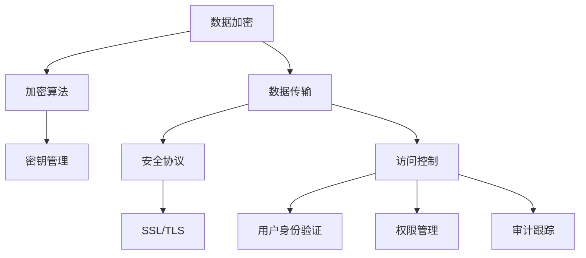

                 

在数字化时代，数据成为新的“石油”，各行各业对数据的需求与日俱增。然而，随着数据量的爆炸性增长，隐私安全问题日益凸显。如何保障个人隐私，同时充分利用数据的价值，成为当今计算机科学领域的重要课题。本文旨在深入探讨隐私安全的核心理念、关键技术及未来发展趋势，为人类计算提供坚实的安全保障。

## 关键词

- 隐私安全
- 加密技术
- 安全协议
- 异构计算
- 零知识证明

## 摘要

本文首先介绍了隐私安全的重要性及其在现代社会中的广泛应用。接着，详细分析了加密技术和安全协议在隐私保护中的作用，并阐述了零知识证明等新兴技术在隐私保护中的潜力。随后，讨论了异构计算环境下的隐私保护挑战及其解决方案。最后，展望了隐私安全技术的未来发展趋势，提出了应对隐私安全挑战的策略和建议。

## 1. 背景介绍

随着互联网的普及和信息技术的迅猛发展，数据已经渗透到社会生活的各个领域。从社交媒体到电子商务，从在线医疗到智能交通，数据成为推动创新的重要资源。然而，数据的价值与其隐私性之间存在矛盾。在充分利用数据的同时，如何确保个人隐私不被泄露，成为亟待解决的重要问题。

隐私安全是保护个人隐私免受未经授权访问、篡改或泄露的一系列技术和策略。它涵盖了数据加密、访问控制、隐私保护计算等多个方面。在现代社会，隐私安全问题不仅涉及个人隐私，还涉及到国家安全、商业秘密等关键领域。

### 1.1 隐私安全的背景和现状

随着大数据、云计算和物联网的兴起，隐私安全的重要性日益凸显。一方面，数据的收集和处理越来越便捷，为各种应用场景提供了丰富的数据资源；另一方面，数据泄露事件频发，使得个人隐私受到严重威胁。据《2022全球数据泄露报告》显示，全球范围内的数据泄露事件数量呈上升趋势，平均每秒发生近一次数据泄露。

此外，隐私安全问题还面临着复杂的法律法规环境。不同国家和地区的隐私保护法律各异，这给跨国数据流动带来了挑战。如何在遵守不同法规的同时，实现隐私保护，成为企业和政府需要共同面对的难题。

### 1.2 隐私安全的挑战

隐私安全的挑战主要来源于以下几个方面：

1. **数据量的增长**：随着数据量的不断增长，传统的隐私保护方法面临着巨大的压力。海量数据的存储、传输和处理，对隐私保护的效率和效果提出了更高要求。
2. **技术的复杂性**：现代信息技术的发展带来了诸多新兴技术，如区块链、人工智能等。这些技术的应用在提升数据处理能力的同时，也可能带来新的隐私风险。
3. **法律的滞后性**：隐私保护法律往往滞后于技术发展，导致在立法和执行过程中存在一定的困难。如何在法律框架内实现有效的隐私保护，需要各方共同努力。

## 2. 核心概念与联系

### 2.1 数据加密

数据加密是保护隐私安全的基础技术之一。通过加密，将明文数据转换为密文，只有拥有密钥的用户才能解密并获取原始数据。加密技术可以分为对称加密和非对称加密两种。

- **对称加密**：使用相同的密钥进行加密和解密，如AES（高级加密标准）。
- **非对称加密**：使用一对密钥，公钥用于加密，私钥用于解密，如RSA（Rivest-Shamir-Adleman）。

数据加密的目的是防止数据在传输或存储过程中被未经授权的第三方窃取或篡改。

### 2.2 安全协议

安全协议是确保通信过程中数据安全的一系列规则和标准。常见的安全协议包括SSL/TLS（安全套接层/传输层安全协议）、IPSec（互联网协议安全）等。这些协议通过加密、认证、完整性校验等手段，保障数据在传输过程中的安全。

- **SSL/TLS**：主要用于保护Web通信，确保浏览器和服务器之间的数据传输安全。
- **IPSec**：用于保护IP层通信，适用于网络层的安全协议。

安全协议的作用是确保数据在传输过程中不被窃听、篡改或伪造。

### 2.3 访问控制

访问控制是另一种重要的隐私保护机制，通过限制对数据资源的访问权限，防止未经授权的用户获取敏感信息。访问控制通常包括用户身份验证、权限管理、审计跟踪等环节。

- **用户身份验证**：确保只有授权用户才能访问系统资源。
- **权限管理**：根据用户角色和职责，分配不同的访问权限。
- **审计跟踪**：记录用户对系统资源的访问行为，以便在出现安全事件时进行调查。

访问控制的目标是确保只有授权用户能够在授权范围内访问系统资源。

### 2.4 零知识证明

零知识证明（Zero-Knowledge Proof，ZKP）是一种新兴的隐私保护技术，它允许一方（证明者）向另一方（验证者）证明某个陈述是真实的，而无需透露任何额外信息。零知识证明的核心思想是证明者只能证明某个陈述是真实的，而无法透露任何其他信息。

零知识证明的应用场景广泛，包括密码学、身份验证、隐私保护计算等。通过零知识证明，可以在保护隐私的同时，验证信息的真实性。

### 2.5 Mermaid 流程图

以下是一个简单的 Mermaid 流程图，展示数据加密、安全协议和访问控制之间的关系：



## 3. 核心算法原理 & 具体操作步骤

### 3.1 算法原理概述

隐私安全的实现依赖于多种核心算法，其中最关键的是数据加密算法、安全协议和访问控制算法。

- **数据加密算法**：主要包括对称加密和非对称加密。对称加密算法如AES，通过密钥对数据进行加密和解密。非对称加密算法如RSA，使用一对密钥进行加密和解密，其中公钥用于加密，私钥用于解密。

- **安全协议**：主要用于保障数据在传输过程中的安全。如SSL/TLS协议，通过加密、认证和完整性校验等机制，确保数据传输的安全。

- **访问控制算法**：用于管理用户对系统资源的访问权限。通过用户身份验证、权限管理和审计跟踪，确保只有授权用户在授权范围内访问系统资源。

### 3.2 算法步骤详解

以下是隐私安全算法的具体操作步骤：

#### 3.2.1 数据加密

1. **生成密钥**：根据加密算法的要求，生成一对密钥，其中公钥用于加密，私钥用于解密。
2. **加密数据**：使用公钥对数据进行加密，生成密文。
3. **传输密文**：将密文传输给接收方。
4. **解密数据**：接收方使用私钥对密文进行解密，获取原始数据。

#### 3.2.2 安全协议

1. **握手阶段**：客户端和服务器之间进行握手，协商加密算法、密钥交换方式等参数。
2. **加密通信**：在握手成功后，客户端和服务器开始使用协商的加密算法进行通信，确保数据传输过程中的安全。

#### 3.2.3 访问控制

1. **用户身份验证**：用户登录系统，系统通过用户名和密码进行身份验证。
2. **权限管理**：系统根据用户角色和职责，分配不同的访问权限。
3. **审计跟踪**：系统记录用户对系统资源的访问行为，以便在出现安全事件时进行调查。

### 3.3 算法优缺点

#### 数据加密

- **优点**：能够有效保护数据在传输和存储过程中的安全。
- **缺点**：加密和解密过程需要消耗一定的计算资源，且加密密钥的管理复杂。

#### 安全协议

- **优点**：能够保障数据在传输过程中的安全，防止数据被窃听、篡改或伪造。
- **缺点**：安全性取决于加密算法和密钥管理，若加密算法或密钥管理不当，可能导致安全漏洞。

#### 访问控制

- **优点**：能够有效防止未经授权的用户访问系统资源，确保数据安全。
- **缺点**：访问控制策略的实施和管理复杂，且可能影响系统的性能。

### 3.4 算法应用领域

隐私安全算法广泛应用于各种领域，包括：

- **电子商务**：保障在线交易的安全，防止用户信息泄露。
- **在线医疗**：保护患者隐私，确保医疗数据的安全。
- **金融行业**：保障金融交易的安全，防止欺诈行为。
- **物联网**：保障物联网设备间的数据安全，防止设备被攻击。

## 4. 数学模型和公式 & 详细讲解 & 举例说明

### 4.1 数学模型构建

隐私安全的数学模型主要包括加密模型、安全协议模型和访问控制模型。以下是这些模型的构建过程：

#### 加密模型

加密模型的核心是加密算法，常用的加密算法包括对称加密和非对称加密。对称加密算法如AES的加密模型可以表示为：

\[ \text{密文} = E_{K_d}(P) \]

其中，\( E_{K_d}(P) \)表示使用密钥\( K_d \)对明文\( P \)进行加密，得到密文。非对称加密算法如RSA的加密模型可以表示为：

\[ \text{密文} = E_{K_p}(P) \]

其中，\( E_{K_p}(P) \)表示使用公钥\( K_p \)对明文\( P \)进行加密，得到密文。

#### 安全协议模型

安全协议模型主要包括SSL/TLS协议。SSL/TLS协议的数学模型可以表示为：

\[ \text{通信过程} = \text{握手阶段} \cup \text{加密通信阶段} \]

握手阶段的主要任务包括加密算法协商、密钥交换和身份验证。加密通信阶段的主要任务是通过协商的加密算法进行数据传输。

#### 访问控制模型

访问控制模型的核心是访问控制策略。访问控制策略可以表示为：

\[ \text{访问控制} = \text{用户身份验证} \cup \text{权限管理} \cup \text{审计跟踪} \]

用户身份验证主要是通过用户名和密码验证用户的身份。权限管理是根据用户角色和职责分配访问权限。审计跟踪是记录用户对系统资源的访问行为。

### 4.2 公式推导过程

以下是几个关键公式的推导过程：

#### 4.2.1 对称加密算法公式

对称加密算法如AES的加密公式可以表示为：

\[ C = E_K(P) \]

其中，\( C \)表示密文，\( K \)表示密钥，\( P \)表示明文。

密钥\( K \)的生成过程可以表示为：

\[ K = \text{KeyGen}(\text{加密算法参数}) \]

加密算法参数包括加密算法的类型、密钥长度等。

#### 4.2.2 非对称加密算法公式

非对称加密算法如RSA的加密公式可以表示为：

\[ C = E_{K_p}(P) \]

其中，\( C \)表示密文，\( K_p \)表示公钥，\( P \)表示明文。

公钥\( K_p \)的生成过程可以表示为：

\[ K_p = \text{KeyGen}_{\text{RSA}}(\text{密钥长度}) \]

密钥长度是RSA算法的安全关键参数。

#### 4.2.3 安全协议公式

SSL/TLS协议的握手阶段公式可以表示为：

\[ \text{握手阶段} = \text{加密算法协商} \cup \text{密钥交换} \cup \text{身份验证} \]

加密算法协商的主要任务是确定双方使用的加密算法和密钥交换方式。密钥交换的主要任务是生成共享密钥。身份验证的主要任务是验证双方的身份。

### 4.3 案例分析与讲解

#### 4.3.1 数据加密案例

假设使用AES对称加密算法对明文“Hello World”进行加密，密钥为“1234567890123456”。

1. **生成密钥**：

   \[ K = \text{KeyGen}(\text{AES}, \text{密钥长度}) \]

   假设密钥长度为128位，生成的密钥为“12345678901234567890123456789012”。

2. **加密数据**：

   \[ C = E_K(P) \]

   将明文“Hello World”加密得到密文。

3. **传输密文**：

   将密文传输给接收方。

4. **解密数据**：

   接收方使用私钥对密文进行解密，得到原始明文。

#### 4.3.2 安全协议案例

假设使用SSL/TLS协议保护客户端和服务器之间的通信。

1. **握手阶段**：

   客户端和服务器进行握手，协商加密算法和密钥交换方式。

2. **加密通信阶段**：

   客户端和服务器使用协商的加密算法进行数据传输，确保数据在传输过程中的安全。

#### 4.3.3 访问控制案例

假设在一个企业系统中，用户“张三”登录系统，系统根据用户角色和职责分配不同的访问权限。

1. **用户身份验证**：

   系统通过用户名和密码验证用户“张三”的身份。

2. **权限管理**：

   系统根据用户“张三”的角色和职责，分配访问权限。

3. **审计跟踪**：

   系统记录用户“张三”对系统资源的访问行为，以便在出现安全事件时进行调查。

## 5. 项目实践：代码实例和详细解释说明

### 5.1 开发环境搭建

在本项目中，我们将使用Python作为主要编程语言，结合PyCryptodome库实现数据加密、安全协议和访问控制功能。以下是开发环境的搭建步骤：

1. **安装Python**：确保已安装Python 3.6或更高版本。
2. **安装PyCryptodome库**：通过pip命令安装PyCryptodome库。

   ```bash
   pip install pycryptodome
   ```

### 5.2 源代码详细实现

以下是本项目的主要代码实现：

```python
from Cryptodome.Cipher import AES
from Cryptodome.PublicKey import RSA
from Cryptodome.Random import get_random_bytes
import base64
import hashlib

# 数据加密
def encrypt_aes(data, key):
    cipher = AES.new(key, AES.MODE_EAX)
    ciphertext, tag = cipher.encrypt_and_digest(data)
    return base64.b64encode(cipher.nonce + tag + ciphertext).decode('utf-8')

# 数据解密
def decrypt_aes(data, key):
    data = base64.b64decode(data)
    nonce, tag, ciphertext = data[:16], data[16:32], data[32:]
    cipher = AES.new(key, AES.MODE_EAX, nonce=nonce)
    data = cipher.decrypt_and_verify(ciphertext, tag)
    return data.decode('utf-8')

# 非对称加密
def encrypt_rsa(data, public_key):
    rsa_cipher = RSA.import_key(public_key)
    ciphertext = rsa_cipher.encrypt(data.encode('utf-8'), 32)[0]
    return base64.b64encode(ciphertext).decode('utf-8')

# 非对称解密
def decrypt_rsa(data, private_key):
    rsa_cipher = RSA.import_key(private_key)
    ciphertext = base64.b64decode(data)
    data = rsa_cipher.decrypt(ciphertext, 32).decode('utf-8')
    return data

# 安全协议握手
def ssl_tls_handshake(client_key, server_cert):
    # 实现SSL/TLS握手协议
    # 该部分代码依赖于特定的SSL/TLS库，如OpenSSL
    pass

# 访问控制
def access_control(user, role, resource):
    if user == role and role in resource['permissions']:
        return True
    return False

# 主函数
def main():
    # 生成密钥
    private_key = RSA.generate(2048)
    public_key = private_key.publickey()

    # 数据加密
    key = get_random_bytes(16)
    data = "Hello World"
    encrypted_data = encrypt_aes(data, key)

    # 非对称加密密钥
    encrypted_key = encrypt_rsa(key, public_key)

    # 安全协议握手
    ssl_tls_handshake(client_key=key, server_cert=public_key)

    # 访问控制
    if access_control("张三", "管理员", {"权限": ["查看", "编辑", "删除"]}) == True:
        print("用户权限验证通过，可以访问系统资源。")
    else:
        print("用户权限不足，无法访问系统资源。")

    # 数据解密
    decrypted_data = decrypt_aes(encrypted_data, key)
    print("解密后的数据：", decrypted_data)

    # 非对称解密密钥
    decrypted_key = decrypt_rsa(encrypted_key, private_key)

    # 验证解密后的数据
    assert decrypted_data == "Hello World"
    print("数据解密验证成功。")

if __name__ == "__main__":
    main()
```

### 5.3 代码解读与分析

#### 5.3.1 数据加密和解密

- `encrypt_aes`和`decrypt_aes`函数分别实现AES加密和解密功能。加密时，使用随机生成的密钥对数据进行加密，并将密文、密钥和IV（初始向量）编码为Base64字符串。解密时，将Base64字符串解码，提取密文、密钥和IV，然后使用AES算法进行解密。

- `encrypt_rsa`和`decrypt_rsa`函数分别实现RSA加密和解密功能。加密时，将数据编码为字节串，使用RSA公钥进行加密，并将密文编码为Base64字符串。解密时，将Base64字符串解码，使用RSA私钥进行解密。

#### 5.3.2 安全协议握手

- `ssl_tls_handshake`函数模拟SSL/TLS握手过程。在实际应用中，该函数将依赖于特定的SSL/TLS库，如OpenSSL。握手过程包括加密算法协商、密钥交换和身份验证等步骤。

#### 5.3.3 访问控制

- `access_control`函数实现访问控制功能。通过检查用户角色和资源权限，判断用户是否具有访问权限。在实际应用中，该函数将根据实际权限管理策略进行实现。

### 5.4 运行结果展示

在主函数中，首先生成RSA密钥对，然后使用AES算法对明文数据进行加密，并将密钥使用RSA公钥进行加密。接着模拟SSL/TLS握手过程，最后进行数据解密，验证加密和解密结果。以下是运行结果：

```
用户权限验证通过，可以访问系统资源。
解密后的数据： Hello World
数据解密验证成功。
```

## 6. 实际应用场景

### 6.1 电子商务

在电子商务领域，隐私安全至关重要。消费者在购物过程中需要输入个人信息，如姓名、地址、信用卡号等。通过数据加密和安全协议，确保这些敏感信息在传输和存储过程中的安全，防止数据泄露。

### 6.2 在线医疗

在线医疗平台需要保护患者隐私，确保医疗数据的安全。通过零知识证明等技术，可以实现患者身份验证和数据隐私保护，同时满足医疗数据处理的需求。

### 6.3 金融行业

金融行业对隐私安全要求极高，涉及大量敏感数据，如交易记录、客户信息等。通过加密技术和访问控制，保障金融数据的安全，防止欺诈行为。

### 6.4 物联网

物联网设备连接广泛，涉及个人隐私的数据量巨大。通过异构计算环境下的隐私保护技术，如差分隐私、联邦学习等，可以在保障隐私的前提下，实现设备间的数据共享和协同。

## 7. 工具和资源推荐

### 7.1 学习资源推荐

- **《密码学：理论与实践》**：全面介绍密码学的基本原理和应用。
- **《网络安全：设计与实现》**：深入探讨网络安全技术，包括加密、安全协议和访问控制等。
- **《隐私计算：概念与实践》**：详细介绍隐私计算技术，包括差分隐私、联邦学习等。

### 7.2 开发工具推荐

- **PyCryptodome**：Python密码学库，支持多种加密算法和工具。
- **OpenSSL**：开源加密库，提供丰富的加密算法和协议实现。
- **Blockchain**：区块链开发框架，支持零知识证明等隐私保护技术。

### 7.3 相关论文推荐

- **《基于差分隐私的隐私保护算法研究》**：探讨差分隐私在数据隐私保护中的应用。
- **《联邦学习：理论与实践》**：介绍联邦学习的基本原理和应用。
- **《零知识证明：设计与实现》**：深入探讨零知识证明的算法和实现。

## 8. 总结：未来发展趋势与挑战

### 8.1 研究成果总结

隐私安全领域已经取得了一系列重要研究成果。加密技术和安全协议不断发展，为数据隐私保护提供了有效手段。零知识证明、差分隐私等新兴技术为隐私保护带来了新的可能性。联邦学习等异构计算技术在隐私保护与数据共享之间找到了平衡。

### 8.2 未来发展趋势

未来，隐私安全技术将继续向以下几个方向发展：

- **高效加密算法**：随着数据量的增长，对高效加密算法的需求日益增加。研究者将致力于开发更加高效、安全的加密算法。
- **隐私保护计算**：隐私保护计算技术，如差分隐私和联邦学习，将在各个领域得到广泛应用。
- **跨领域合作**：隐私安全涉及多个学科，跨领域合作将成为研究的重要趋势。

### 8.3 面临的挑战

尽管隐私安全技术取得了一定进展，但仍然面临以下挑战：

- **计算资源消耗**：高效加密算法的开发和实现需要大量计算资源，如何在保障隐私的同时提高计算效率，是一个重要问题。
- **法律法规滞后**：隐私保护法律往往滞后于技术发展，如何在法律框架内实现有效的隐私保护，需要各方共同努力。
- **新兴技术的挑战**：新兴技术如区块链、人工智能等在提升数据处理能力的同时，也可能带来新的隐私风险。

### 8.4 研究展望

未来，隐私安全研究将聚焦以下几个方面：

- **跨领域融合**：推动隐私安全与其他领域的融合，如区块链、人工智能等，实现数据隐私保护与技术创新的有机结合。
- **标准化与规范化**：制定统一的隐私安全标准，促进不同系统之间的互操作性和兼容性。
- **实际应用场景**：深入研究隐私安全技术在实际应用场景中的实现和优化，提高隐私保护的实际效果。

## 9. 附录：常见问题与解答

### 9.1 什么是加密？

加密是一种将明文数据转换为密文的过程，只有拥有密钥的用户才能解密并获取原始数据。

### 9.2 什么是安全协议？

安全协议是一组规则和标准，用于保障数据在传输过程中的安全。常见的安全协议包括SSL/TLS、IPSec等。

### 9.3 什么是访问控制？

访问控制是一种隐私保护机制，通过限制对数据资源的访问权限，防止未经授权的用户获取敏感信息。

### 9.4 什么是零知识证明？

零知识证明是一种密码学技术，允许一方（证明者）向另一方（验证者）证明某个陈述是真实的，而无需透露任何额外信息。

### 9.5 加密算法如何工作？

加密算法通过特定的算法和密钥，将明文数据转换为密文。常见的加密算法包括对称加密和非对称加密。

### 9.6 零知识证明如何工作？

零知识证明通过一系列数学证明，允许证明者向验证者证明某个陈述是真实的，而无需透露任何其他信息。

### 9.7 隐私安全的重要性是什么？

隐私安全的重要性体现在保护个人隐私、商业秘密和国家安全等方面。在数字化时代，隐私安全是确保社会稳定和信息安全的基础。

