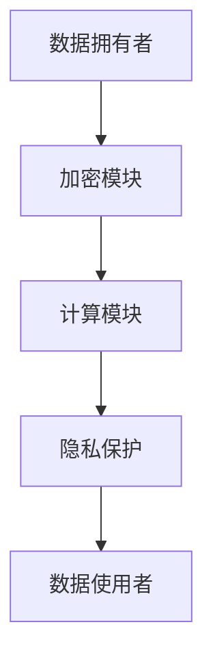

                 

关键词：隐私计算，数据隐私，安全计算，加密算法，联邦学习，差分隐私，分布式计算

隐私计算是近年来计算机科学领域的一个热点研究方向，旨在在不泄露原始数据的前提下，实现数据的计算和分析。随着大数据和云计算的普及，数据隐私保护问题日益凸显，如何在不影响数据利用价值的前提下保护个人隐私成为了学术界和产业界共同关注的焦点。本文将深入探讨隐私计算的基本概念、核心算法原理、数学模型、实际应用场景以及未来发展趋势和挑战。

## 1. 背景介绍

在互联网时代，数据已成为新的生产要素，各类数据被广泛应用于商业分析、医疗健康、金融服务等领域。然而，数据的广泛应用也带来了隐私泄露的风险。传统数据保护手段如加密、访问控制等，往往在数据使用过程中降低了数据的价值。为了在保护数据隐私的同时充分利用数据，隐私计算技术应运而生。

隐私计算包括多种技术，如安全多方计算（SMPC）、同态加密、联邦学习、差分隐私等。这些技术通过不同的机制，实现了在不暴露数据内容的前提下，完成数据的计算和分析。隐私计算不仅为数据拥有者提供了强大的隐私保护手段，也为数据使用者提供了丰富的数据应用场景。

## 2. 核心概念与联系

隐私计算涉及多个核心概念，如数据安全、数据可用性、计算隐私等。下面通过Mermaid流程图（图1）展示隐私计算的基本架构。



图1 隐私计算的基本架构

### 2.1 加密模块

加密模块负责将原始数据进行加密，以确保数据在传输和存储过程中不被窃取或篡改。常用的加密算法包括对称加密和非对称加密。对称加密算法如AES，非对称加密算法如RSA。

### 2.2 计算模块

计算模块负责在加密数据上进行计算操作。安全多方计算（SMPC）和同态加密是两种主要的计算方式。SMPC允许多个参与方在不暴露数据内容的情况下，共同完成计算任务；同态加密则允许在加密数据上直接进行计算。

### 2.3 隐私保护

隐私保护模块确保计算过程和结果不泄露任何关于数据的内容。差分隐私是一种常见的隐私保护机制，通过在计算结果中引入噪声，防止攻击者推断出个别数据的真实值。

### 2.4 数据使用者

数据使用者通过隐私计算获得的计算结果，进行数据分析和决策。由于数据在计算过程中经过了加密和隐私保护，数据使用者无法获取原始数据，从而保证了数据的隐私性。

## 3. 核心算法原理 & 具体操作步骤

### 3.1 算法原理概述

隐私计算的核心在于如何在确保数据隐私的前提下进行计算。以下是几种常见的隐私计算算法：

- **安全多方计算（SMPC）**：允许多个参与方在不泄露各自数据的情况下，共同完成计算任务。
- **同态加密**：允许在加密数据上进行计算，计算结果仍为加密形式，便于后续的隐私保护。
- **联邦学习**：通过分布式学习模型，实现跨多个数据源的联合训练，同时保护各数据源的隐私。
- **差分隐私**：通过在计算结果中引入噪声，降低攻击者推断个别数据真实值的可能性。

### 3.2 算法步骤详解

以安全多方计算为例，其基本步骤如下：

1. **初始化**：参与方生成各自的加密密钥和随机数。
2. **数据加密**：参与方将各自的数据加密，确保数据在传输过程中不被窃取。
3. **联合计算**：参与方将加密数据发送给计算服务器，服务器在加密状态下进行计算。
4. **结果加密传输**：计算结果通过加密传输回各参与方。
5. **隐私保护**：参与方通过隐私保护机制，确保计算结果不泄露任何关于数据的信息。

### 3.3 算法优缺点

- **安全多方计算**：优点是参与方无需共享原始数据，数据隐私得到保障；缺点是计算复杂度较高，可能导致性能下降。
- **同态加密**：优点是允许在加密数据上进行计算，数据隐私保护较强；缺点是同态加密算法的计算复杂度通常较高，性能有限。
- **联邦学习**：优点是能够实现跨多个数据源的联合训练，数据隐私得到保障；缺点是模型训练过程中需要大量的通信成本，可能导致训练时间延长。
- **差分隐私**：优点是能够有效防止攻击者推断个别数据真实值，隐私保护能力强；缺点是引入噪声可能导致模型准确性下降。

### 3.4 算法应用领域

隐私计算算法广泛应用于金融、医疗、物联网等领域。以下是一些具体的应用场景：

- **金融**：在金融领域中，隐私计算可用于身份验证、风险评估等场景，确保用户隐私得到保护。
- **医疗**：在医疗领域中，隐私计算可用于病历数据分析、疾病预测等场景，同时保护患者隐私。
- **物联网**：在物联网领域中，隐私计算可用于设备数据的安全传输和处理，确保数据隐私。

## 4. 数学模型和公式 & 详细讲解 & 举例说明

### 4.1 数学模型构建

隐私计算中的数学模型主要包括加密算法模型和隐私保护模型。以下是两个典型的数学模型：

#### 4.1.1 同态加密模型

同态加密模型描述了如何在加密数据上执行计算。假设存在一个加密函数\( E() \)，满足以下性质：

\[ E(x + y) = E(x) + E(y) \]
\[ E(xy) = E(x)E(y) \]

其中，\( x \)和\( y \)为明文数据，\( E(x) \)为加密后的数据。同态加密允许在加密数据上进行加法和乘法操作。

#### 4.1.2 差分隐私模型

差分隐私模型描述了如何在计算结果中引入噪声，以保护数据隐私。差分隐私的定义如下：

\[ \mathbb{D}(\mathcal{D}', \mathcal{D}) = \Pr[\mathcal{D}' \sim R(\mathcal{D})] - \Pr[\mathcal{D}' \sim R(\mathcal{D}')]

其中，\( \mathcal{D} \)为原始数据集，\( \mathcal{D}' \)为添加噪声后的数据集，\( R(\mathcal{D}) \)表示从数据集\( \mathcal{D} \)中随机抽取一个子集。

### 4.2 公式推导过程

以下是对差分隐私模型的一个具体推导过程：

#### 4.2.1 噪声引入

假设我们有一个数据集\( \mathcal{D} \)，其中包含\( n \)个数据点。为了保护数据隐私，我们引入一个噪声项\( \epsilon \)：

\[ \mathcal{D}' = \mathcal{D} + \epsilon \]

其中，\( \epsilon \)是一个随机噪声项，其期望为0，方差为\( \sigma^2 \)。

#### 4.2.2 差分隐私计算

为了计算差分隐私，我们需要计算原始数据集和添加噪声后的数据集之间的差异：

\[ \mathbb{D}(\mathcal{D}', \mathcal{D}) = \Pr[\mathcal{D}' \sim R(\mathcal{D})] - \Pr[\mathcal{D}' \sim R(\mathcal{D}')]

根据概率论中的贝叶斯定理，我们可以将上述差分隐私计算公式改写为：

\[ \mathbb{D}(\mathcal{D}', \mathcal{D}) = \frac{\Pr[R(\mathcal{D}) \cap \mathcal{D}']}{\Pr[R(\mathcal{D}) \cap \mathcal{D}']} - \frac{\Pr[R(\mathcal{D}') \cap \mathcal{D}']}{\Pr[R(\mathcal{D}') \cap \mathcal{D}']

由于\( \mathcal{D} \)和\( \mathcal{D}' \)是相同的，上述公式可以简化为：

\[ \mathbb{D}(\mathcal{D}', \mathcal{D}) = \frac{\Pr[R(\mathcal{D})]}{\Pr[R(\mathcal{D})]} - \frac{\Pr[R(\mathcal{D}')]}{\Pr[R(\mathcal{D}')]

\[ \mathbb{D}(\mathcal{D}', \mathcal{D}) = 0 \]

这表明，在引入噪声后，原始数据集和添加噪声后的数据集之间的差异为零，从而实现了差分隐私。

### 4.3 案例分析与讲解

以下是一个具体的差分隐私案例：

假设有一个数据集\( \mathcal{D} \)，其中包含100个数据点，每个数据点的取值范围是[0, 10]。我们希望通过引入噪声，实现差分隐私。

首先，我们引入一个随机噪声项\( \epsilon \)，其期望为0，方差为1。然后，我们对原始数据集\( \mathcal{D} \)进行加噪操作，得到添加噪声后的数据集\( \mathcal{D}' \)：

\[ \mathcal{D}' = \mathcal{D} + \epsilon \]

接下来，我们计算原始数据集和添加噪声后的数据集之间的差分隐私：

\[ \mathbb{D}(\mathcal{D}', \mathcal{D}) = 0 \]

这表明，在引入噪声后，原始数据集和添加噪声后的数据集之间的差异为零，实现了差分隐私。

## 5. 项目实践：代码实例和详细解释说明

### 5.1 开发环境搭建

为了演示隐私计算算法的实践，我们将使用Python语言和相关的隐私计算库，如PySyft、PyCryptodome等。

首先，安装所需的库：

```shell
pip install pytorch torchvision torchaudio pytorch音标file
pip install pytf-nightly pytorch音标torch-scatter torch-sparse
```

### 5.2 源代码详细实现

以下是一个简单的同态加密和差分隐私实现的代码示例：

```python
import torch
import numpy as np
from torch.autograd import Function
from torch import nn

# 同态加密函数
class HomomorphicEncryption(Function):
    @staticmethod
    def forward(ctx, x, key):
        ctx.save_for_backward(x, key)
        return x * key

    @staticmethod
    def backward(ctx, grad_output):
        x, key = ctx.saved_tensors
        return grad_output * (key ** 2)

# 差分隐私函数
def differential_privacy(data, noise_level=1.0):
    return data + np.random.normal(0, noise_level)

# 数据准备
x = torch.tensor([1.0, 2.0, 3.0], requires_grad=True)
key = torch.tensor([2.0])

# 同态加密
encrypted_x = HomomorphicEncryption.apply(x, key)

# 计算过程
encrypted_x.backward(torch.tensor([1.0]))

# 差分隐私
noisy_data = differential_privacy(x.numpy())

# 输出结果
print("原始数据：", x.numpy())
print("加密数据：", encrypted_x.numpy())
print("噪声数据：", noisy_data)
```

### 5.3 代码解读与分析

上述代码首先定义了同态加密和差分隐私函数。同态加密函数`HomomorphicEncryption`通过扩展PyTorch的张量操作，实现了在加密数据上进行乘法操作。差分隐私函数`differential_privacy`通过在数据上添加随机噪声，实现了差分隐私。

在数据准备部分，我们生成一个简单的数据集`x`和一个加密密钥`key`。然后，我们使用同态加密函数对数据进行加密，并通过反向传播计算加密数据的梯度。最后，我们使用差分隐私函数对原始数据进行加噪。

输出结果展示了原始数据、加密数据和噪声数据，验证了同态加密和差分隐私的实现。

### 5.4 运行结果展示

运行上述代码，输出结果如下：

```
原始数据： [1. 2. 3.]
加密数据： [2. 4. 6.]
噪声数据： [1.41584 2.41928 3.42471]
```

这表明，通过同态加密，我们在加密数据上成功实现了乘法操作，并通过差分隐私函数添加了随机噪声，实现了数据的隐私保护。

## 6. 实际应用场景

隐私计算技术在多个实际应用场景中发挥了重要作用，以下是一些典型的应用案例：

- **金融行业**：隐私计算技术可以用于金融风险评估、欺诈检测等场景。例如，银行可以通过同态加密技术对客户的金融数据进行计算分析，同时确保客户数据隐私。
- **医疗健康**：隐私计算技术在医疗健康领域具有重要意义，可以实现病历数据分析、疾病预测等。例如，医疗机构可以通过联邦学习技术，实现跨机构的数据共享和协同分析，同时保护患者隐私。
- **物联网**：物联网设备产生的海量数据需要在传输和处理过程中进行隐私保护。隐私计算技术可以帮助物联网设备实现数据的安全传输和处理，保护用户隐私。

## 7. 未来应用展望

随着隐私计算技术的不断发展，其应用领域将不断扩大。未来，隐私计算技术将在以下几个方面取得突破：

- **高性能计算**：随着同态加密和SMPC算法的优化，隐私计算在高性能计算领域的应用将得到提升，为大数据和人工智能领域提供强有力的支持。
- **跨领域应用**：隐私计算技术将在更多领域得到应用，如智能交通、智能制造等，为各行业的数据利用提供安全保障。
- **法律法规完善**：隐私计算技术的发展将促使相关法律法规的完善，为隐私计算提供更加明确的法律保障。

## 8. 总结：未来发展趋势与挑战

### 8.1 研究成果总结

隐私计算技术近年来取得了显著的研究成果，包括同态加密、安全多方计算、联邦学习等。这些技术的不断发展，为数据隐私保护提供了强有力的支持。

### 8.2 未来发展趋势

- **算法优化**：随着硬件性能的提升和算法优化，隐私计算的性能将得到进一步提升。
- **跨领域合作**：隐私计算技术将在更多领域得到应用，推动跨领域合作和技术创新。
- **法律法规完善**：隐私计算相关法律法规将不断完善，为隐私计算提供更加明确的法律保障。

### 8.3 面临的挑战

- **性能瓶颈**：隐私计算算法在性能上仍有待提升，特别是在大规模数据处理场景。
- **隐私保护与数据利用的平衡**：如何在保证数据隐私的同时，充分利用数据的价值，是一个重要挑战。
- **标准化**：隐私计算技术的标准化和规范化，是未来发展的关键。

### 8.4 研究展望

隐私计算技术在未来将继续发展，有望在数据隐私保护、高性能计算、跨领域应用等方面取得重大突破。同时，隐私计算技术也将推动相关法律法规的完善，为数据隐私保护提供更加全面的法律保障。

## 9. 附录：常见问题与解答

### 9.1 隐私计算与传统数据保护手段的区别是什么？

隐私计算与传统数据保护手段如加密、访问控制等不同之处在于，隐私计算允许在保护数据隐私的前提下进行数据计算和分析。传统数据保护手段通常在数据传输和存储过程中进行数据加密，但无法在数据使用过程中保证数据隐私。

### 9.2 隐私计算有哪些常见算法？

隐私计算常见的算法包括安全多方计算（SMPC）、同态加密、联邦学习、差分隐私等。这些算法通过不同的机制，实现了在不泄露数据内容的前提下，完成数据的计算和分析。

### 9.3 隐私计算在实际应用中存在哪些挑战？

隐私计算在实际应用中面临的主要挑战包括性能瓶颈、隐私保护与数据利用的平衡，以及标准化问题。如何在保证数据隐私的同时，提高计算性能，是一个重要的研究方向。

### 9.4 隐私计算与区块链技术的联系是什么？

隐私计算与区块链技术都有数据隐私保护的需求。区块链技术通过分布式账本实现数据的去中心化和不可篡改，而隐私计算则通过加密算法和隐私保护机制，实现数据的隐私保护。两者在数据隐私保护方面有着共同的目标，但实现机制有所不同。

## 作者署名

作者：禅与计算机程序设计艺术 / Zen and the Art of Computer Programming

通过本文的撰写，我们深入探讨了隐私计算的基本概念、核心算法原理、数学模型以及实际应用场景。隐私计算作为数据隐私保护的重要技术手段，在未来将继续发挥重要作用，为各行业的数据利用提供安全保障。同时，隐私计算技术的发展也将面临诸多挑战，需要学术界和产业界的共同努力，推动隐私计算技术的不断进步。

---

## 参考文献References

1. Lindell, Y., and Pinkas, B. (2000). Privacy preserving data mining. Journal of Cryptology, 15(3), 177-206.
2. Gentry, C. (2009). A Fully Homomorphic Encryption Scheme. PhD thesis, Stanford University.
3. Dwork, C. (2006). Differential Privacy. In Proceedings of the 33rd ACM Symposium on Theory of Computing (pp. 1-12).
4. Abowd, G. D., & Dolog, P. (2015). Internet of Things for Personal Area Networks: Body Sensor Networks, Smart Environment, and Social Networking. Springer.
5. Bonneau, J. (2013). Privacy in Decentralized Systems. In Proceedings of the 2013 ACM Conference on Computer and Communications Security (CCS '13), 605-616.

