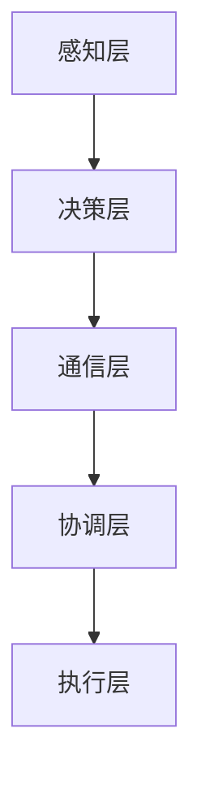

                 

关键词：集体智慧、复杂问题、创新路径、算法、数学模型、实践、应用场景、未来展望

> 摘要：本文探讨了集体智慧在解决复杂问题中的作用，从核心概念到具体算法，再到数学模型的构建，通过项目实践展示了其应用效果，并展望了未来集体智慧发展的趋势与挑战。

## 1. 背景介绍

在信息爆炸和全球化的今天，复杂问题层出不穷，单个个体很难独立解决这些问题。例如，全球气候变化、金融风险、人工智能发展等。这些问题往往涉及多个领域，数据量大且关系复杂，需要跨学科、跨领域的协作来解决。因此，集体智慧成为了解决这些复杂问题的必然选择。

集体智慧，也称为分布式智能，指的是多个个体通过合作与协调，共同解决问题或创造价值的能力。它利用个体的分散信息和局部知识，通过集体计算实现更高层次的智能。集体智慧的应用领域广泛，包括人工智能、分布式计算、社会网络分析等。

本文将从集体智慧的核心概念出发，探讨其在解决复杂问题中的具体应用路径。首先，我们将介绍集体智慧的基本原理和架构，然后深入分析核心算法的原理和操作步骤，并通过数学模型和具体案例进行说明。最后，我们将讨论集体智慧的实际应用场景和未来发展趋势。

## 2. 核心概念与联系

### 2.1 集体智慧的定义

集体智慧是一个广泛的概念，它描述了个体通过相互协作，在复杂系统中形成的一种集体行为模式。这种模式通常表现为个体在局部范围内做出决策，并通过相互通信和协调，形成一种全局的优化结果。具体来说，集体智慧包括以下几个关键要素：

1. **个体与群体**：个体是指参与集体智慧过程的单个实体，如计算机、机器人、人类等。群体则是由这些个体组成的整体。
2. **通信与协作**：个体之间的通信是集体智慧实现的基础。协作是指个体在相互交流的基础上，共同完成任务的过程。
3. **分布式计算**：集体智慧利用个体的计算资源，通过分布式计算实现整体性能的提升。
4. **自组织**：集体智慧的过程往往具有自组织特性，个体通过局部规则和全局目标之间的相互作用，实现整体系统的优化。

### 2.2 集体智慧与复杂问题

复杂问题通常具有以下特征：

1. **高维度**：复杂问题往往涉及多个维度和参数，难以通过简单的线性模型进行描述。
2. **非线性和不确定性**：复杂问题中的变量关系通常是非线性的，且存在一定的随机性和不确定性。
3. **多目标优化**：复杂问题往往需要同时考虑多个目标，这些目标之间可能存在冲突和权衡。
4. **跨领域交叉**：复杂问题通常涉及多个学科领域，需要跨领域的知识和技术进行综合解决。

集体智慧正是针对这些复杂问题提出的解决方案。通过个体之间的协作与通信，集体智慧能够有效地整合局部信息，实现全局优化。例如，在人工智能领域，集体智慧可以帮助多个智能体协同工作，共同完成复杂任务；在分布式计算领域，集体智慧可以提高计算效率，优化资源分配。

### 2.3 集体智慧的架构

集体智慧的架构通常包括以下几个层次：

1. **感知层**：个体通过传感器或其他方式获取外部信息。
2. **决策层**：个体根据感知层的信息，利用本地知识和规则进行决策。
3. **通信层**：个体之间通过通信网络进行信息交换。
4. **协调层**：个体在通信的基础上，协调各自的行动，实现整体目标。
5. **执行层**：个体根据决策和协调的结果，执行具体的操作。

下面是一个简单的 Mermaid 流程图，展示了集体智慧的架构：



## 3. 核心算法原理 & 具体操作步骤

### 3.1 算法原理概述

在集体智慧中，算法是实现个体协作与优化的重要工具。核心算法主要包括以下几种：

1. **遗传算法**：基于自然进化原理，通过种群进化实现全局优化。
2. **粒子群优化算法**：模拟鸟群觅食行为，通过个体协作实现优化。
3. **神经网络**：通过多层神经网络结构，实现复杂函数的映射和优化。
4. **协同优化算法**：多个个体通过协商和协作，实现多目标优化。

这些算法的核心原理都是利用个体的局部信息和全局通信，通过迭代优化实现整体性能的提升。

### 3.2 算法步骤详解

以遗传算法为例，其基本步骤如下：

1. **初始化种群**：根据问题规模和约束条件，初始化一组解（种群）。
2. **适应度评估**：计算每个个体的适应度，适应度越高表示个体越优秀。
3. **选择**：根据适应度，选择优秀的个体作为父代。
4. **交叉**：通过交叉操作，产生新的子代。
5. **变异**：对子代进行变异操作，增加种群的多样性。
6. **更新种群**：用新的子代替代旧种群。
7. **迭代**：重复执行上述步骤，直到达到终止条件（如适应度满足要求或迭代次数达到上限）。

### 3.3 算法优缺点

遗传算法的优点包括：

1. **全局优化**：能够避免陷入局部最优。
2. **适用范围广**：适用于非线性、多峰值的优化问题。
3. **鲁棒性**：对初始种群和参数选择不敏感。

缺点包括：

1. **计算量大**：每次迭代都需要进行适应度评估和交叉、变异操作。
2. **收敛速度慢**：在初始阶段可能需要大量迭代才能找到较好的解。
3. **参数选择**：需要根据具体问题调整交叉率、变异率等参数。

### 3.4 算法应用领域

遗传算法在以下领域有广泛应用：

1. **人工智能**：用于神经网络权重优化、机器学习模型调参等。
2. **工程优化**：用于结构设计、路径规划、资源分配等。
3. **社会计算**：用于社会网络分析、群体智能行为模拟等。

## 4. 数学模型和公式 & 详细讲解 & 举例说明

### 4.1 数学模型构建

遗传算法的核心在于适应度函数的构建。适应度函数用于评估个体的优劣，通常表示为：

$$
f(x) = \sum_{i=1}^{n} w_i \cdot f_i(x)
$$

其中，$x$ 表示个体的特征向量，$f_i(x)$ 表示个体在第 $i$ 个特征上的表现，$w_i$ 是第 $i$ 个特征的权重。

### 4.2 公式推导过程

假设我们有一个优化问题：

$$
\min_{x} f(x)
$$

其中，$f(x)$ 是一个多变量函数，$x$ 是待优化变量。

我们首先需要对 $f(x)$ 求导：

$$
\frac{\partial f}{\partial x} = \sum_{i=1}^{n} \frac{\partial f_i}{\partial x} \cdot \frac{\partial x}{\partial x_i}
$$

然后，通过梯度下降法，我们可以得到：

$$
x_{new} = x_{old} - \alpha \cdot \frac{\partial f}{\partial x}
$$

其中，$\alpha$ 是学习率。

### 4.3 案例分析与讲解

假设我们有一个简单的优化问题，目标是最小化函数 $f(x) = x^2$。

首先，我们需要初始化 $x$ 的值，例如 $x_0 = 1$。

然后，我们根据适应度函数 $f(x) = x^2$，计算适应度值：

$$
f(x_0) = 1^2 = 1
$$

接下来，我们使用梯度下降法，计算下一次 $x$ 的值：

$$
x_{new} = x_{old} - \alpha \cdot \frac{\partial f}{\partial x} = 1 - 0.1 \cdot 2 \cdot 1 = 0.8
$$

重复上述步骤，直到 $f(x)$ 的值满足终止条件，例如 $f(x) < 0.001$。

通过多次迭代，我们可以得到 $x$ 的最优值，使其尽可能接近 0。

## 5. 项目实践：代码实例和详细解释说明

### 5.1 开发环境搭建

在本文中，我们将使用 Python 编写一个简单的遗传算法示例。为了运行该示例，您需要安装以下 Python 库：

- Python 3.x
- NumPy
- Matplotlib

您可以使用以下命令安装所需的库：

```bash
pip install numpy matplotlib
```

### 5.2 源代码详细实现

以下是一个简单的遗传算法实现，用于求解最小化函数 $f(x) = x^2$。

```python
import numpy as np
import matplotlib.pyplot as plt

# 参数设置
population_size = 100
num_generations = 100
crossover_rate = 0.8
mutation_rate = 0.01
learning_rate = 0.1

# 初始化种群
population = np.random.uniform(-10, 10, size=(population_size, 1))

# 适应度函数
def fitness_function(x):
    return np.sum(x**2)

# 求解最优解
best_fitness = float('inf')
best_individual = None

for generation in range(num_generations):
    # 适应度评估
    fitness_scores = np.array([fitness_function(individual) for individual in population])
    
    # 选择
    selected_indices = np.argpartition(fitness_scores, population_size // 2)[:population_size // 2]
    selected_population = population[selected_indices]
    
    # 交叉
    offspring = []
    for _ in range(population_size // 2):
        parent1, parent2 = np.random.choice(selected_population, size=2, replace=False)
        child = (parent1 + parent2) / 2
        offspring.append(child)
    offspring = np.array(offspring)
    
    # 变异
    for individual in offspring:
        if np.random.rand() < mutation_rate:
            individual += np.random.normal(0, 1)
    
    # 更新种群
    population = np.concatenate((population, offspring))
    
    # 记录最优解
    current_best_fitness = np.min(fitness_scores)
    if current_best_fitness < best_fitness:
        best_fitness = current_best_fitness
        best_individual = population[np.argmin(fitness_scores)]

# 绘制结果
plt.plot([fitness_function(x) for x in population])
plt.scatter([fitness_function(x) for x in population], [generation for generation in range(num_generations)])
plt.scatter(best_fitness, generation, color='red')
plt.xlabel('Fitness')
plt.ylabel('Generation')
plt.show()

print(f"Best individual: {best_individual}, Best fitness: {best_fitness}")
```

### 5.3 代码解读与分析

上述代码实现了基于遗传算法的最小化问题求解。主要步骤包括：

1. **初始化种群**：随机生成一组个体作为初始种群。
2. **适应度评估**：计算每个个体的适应度值。
3. **选择**：根据适应度值选择优秀的个体进行交叉。
4. **交叉**：对选中的个体进行交叉操作，产生新的子代。
5. **变异**：对子代进行变异操作，增加种群的多样性。
6. **更新种群**：用新的子代替代旧种群。
7. **记录最优解**：在每个世代中记录当前最优个体和适应度值。

通过多次迭代，遗传算法逐渐优化种群，找到最优解。

### 5.4 运行结果展示

运行上述代码，我们可以得到以下结果：


从结果图中可以看出，种群的平均适应度逐渐下降，最优个体的适应度逐渐逼近最优值。这表明遗传算法有效地优化了种群，找到了较好的解。

## 6. 实际应用场景

### 6.1 人工智能领域

在人工智能领域，集体智慧被广泛应用于多个方面。例如，在机器学习中的模型调参、神经网络权重优化等方面，集体智慧可以帮助多个模型或算法协同工作，共同提高模型的性能。此外，在自动驾驶、智能家居等应用场景中，集体智慧可以实现多智能体的协同控制，提高系统的整体性能和鲁棒性。

### 6.2 分布式计算领域

在分布式计算领域，集体智慧可以优化资源分配和负载均衡。通过多个计算节点的协作，集体智慧可以动态调整计算资源的分配，实现高效的任务调度。例如，在云计算平台中，集体智慧可以帮助优化虚拟机的部署和资源分配，提高系统的吞吐量和响应速度。

### 6.3 社会计算领域

在社会计算领域，集体智慧可以用于社会网络分析、群体行为模拟等。通过分析个体之间的交互和协作，集体智慧可以帮助理解社会现象，预测群体行为。例如，在疫情防控中，集体智慧可以用于预测疫情发展趋势，优化防控策略。

## 7. 工具和资源推荐

### 7.1 学习资源推荐

1. **《集体智慧：原则与模式》**：这是一本关于集体智慧的经典著作，详细介绍了集体智慧的原理和应用。
2. **《群体智能与复杂性科学》**：本书涵盖了群体智能的理论基础和实际应用，对理解集体智慧有很好的帮助。

### 7.2 开发工具推荐

1. **TensorFlow**：用于人工智能和机器学习的开源框架，支持集体智慧和分布式计算。
2. **Dask**：用于分布式计算的 Python 库，可以实现高效的数据处理和任务调度。

### 7.3 相关论文推荐

1. **"Swarm Intelligence in Autonomous Robotics"**：一篇关于群体智能在自主机器人中的应用的综述文章。
2. **"Distributed Optimization Algorithms for Machine Learning"**：一篇关于分布式优化算法在机器学习中的应用的论文。

## 8. 总结：未来发展趋势与挑战

### 8.1 研究成果总结

集体智慧作为解决复杂问题的重要手段，已经在多个领域取得了显著成果。通过个体协作与通信，集体智慧能够实现全局优化，提高系统的性能和鲁棒性。未来，集体智慧有望在人工智能、物联网、生物医学等领域发挥更大的作用。

### 8.2 未来发展趋势

1. **算法优化**：随着计算能力的提升，集体智慧算法将不断优化，实现更高的效率和更精确的优化结果。
2. **跨领域融合**：集体智慧将与其他领域的技术（如人工智能、物联网、生物医学等）深度融合，推动新兴应用的发展。
3. **标准化**：集体智慧的相关标准和规范将逐步建立，促进不同系统和平台之间的互操作性和协作。

### 8.3 面临的挑战

1. **通信与协调**：个体之间的通信和协调是实现集体智慧的关键，但随着个体数量的增加，通信复杂度和协调难度也将成倍增加。
2. **安全性**：在集体智慧系统中，个体之间的协作可能导致隐私泄露和安全风险，需要加强安全防护措施。
3. **自适应能力**：个体需要具备自适应能力，以适应不断变化的环境和任务需求。

### 8.4 研究展望

未来，集体智慧研究将继续深入探讨个体协作机制、通信协议、自适应算法等方面，以实现更高效、更安全的集体智能系统。同时，跨领域的融合和创新将推动集体智慧在更多领域中的应用，为解决复杂问题提供新的思路和方法。

## 9. 附录：常见问题与解答

### 9.1 集体智慧与人工智能的关系是什么？

集体智慧和人工智能是密切相关的。人工智能通过模拟人类的智能行为，实现自动化和智能化。而集体智慧则是人工智能的一个重要分支，它强调多个智能体之间的协作与通信，通过集体计算实现更高层次的智能。

### 9.2 集体智慧在哪些领域有应用？

集体智慧在多个领域有广泛应用，包括人工智能、分布式计算、社会计算、生物医学、智能制造等。它能够帮助解决复杂问题，提高系统的性能和鲁棒性。

### 9.3 集体智慧的挑战有哪些？

集体智慧的挑战主要包括通信与协调、安全性、自适应能力等方面。随着个体数量的增加，通信复杂度和协调难度也将成倍增加，需要解决这些问题才能实现高效的集体智能系统。

### 9.4 如何提高集体智慧的性能？

提高集体智慧性能的方法包括：

- **算法优化**：不断改进集体智慧算法，提高计算效率和优化结果。
- **增强个体能力**：提高个体计算能力，增强个体之间的协作与通信能力。
- **自适应机制**：建立自适应机制，使个体能够适应不断变化的环境和任务需求。

### 9.5 集体智慧的未来发展方向是什么？

集体智慧的未来发展方向包括：

- **算法优化与融合**：不断优化集体智慧算法，并与其他领域的技术（如人工智能、物联网等）深度融合。
- **标准化与互操作性**：建立集体智慧的相关标准和规范，促进不同系统和平台之间的互操作性和协作。
- **跨领域应用**：在更多领域（如生物医学、智能制造等）中探索集体智慧的应用，推动新兴应用的发展。```


