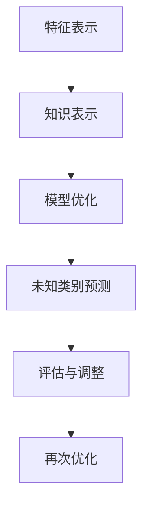

                 

关键词：零样本学习、Prompt设计、模型优化、应用场景、未来展望

> 摘要：本文深入探讨了零样本学习（Zero-Shot Learning, ZSL）的最新进展，重点分析了Prompt设计的核心原则。通过阐述零样本学习的背景、核心概念，以及Prompt设计的策略和实现方法，本文旨在为研究人员和开发者提供指导，推动零样本学习技术的广泛应用。

## 1. 背景介绍

### 1.1 零样本学习的起源

零样本学习是机器学习领域的一个重要分支，旨在解决模型在未知类别上无法预测的问题。传统的机器学习模型通常依赖于大量标记数据来进行训练，然而在实际应用中，获取大量标记数据往往成本高昂且耗时。零样本学习提供了一种解决方案，使得模型能够在未见过的类别上实现较好的泛化能力。

### 1.2 零样本学习的现状

近年来，随着深度学习技术的发展，零样本学习取得了显著的进展。特别是Prompt技术的引入，为模型设计提供了新的思路，极大地提升了零样本学习的性能。然而，当前零样本学习仍面临诸多挑战，如类别描述的不一致性、模型解释性不足等。

## 2. 核心概念与联系

为了深入理解零样本学习，我们首先需要了解几个核心概念：特征表示、知识表示和模型优化。

### 2.1 特征表示

特征表示是零样本学习的基础。通过将不同类别的数据映射到高维空间，我们希望找到一种方法，使得同一类别的数据在空间中紧密聚集，而不同类别的数据则相互分离。

### 2.2 知识表示

知识表示是零样本学习的关键。它涉及到如何将先验知识（如词向量、知识图谱等）嵌入到模型中，以提高模型在未知类别上的泛化能力。

### 2.3 模型优化

模型优化是零样本学习的核心。通过调整模型的参数，我们希望找到一种最佳配置，使得模型在未知类别上的性能达到最优。

### 2.4 Mermaid 流程图

下面是零样本学习的Mermaid流程图：



## 3. 核心算法原理 & 具体操作步骤

### 3.1 算法原理概述

零样本学习的核心算法通常包括以下步骤：

1. 特征提取：从原始数据中提取特征表示。
2. 知识嵌入：将先验知识嵌入到特征表示中。
3. 模型训练：使用嵌入的知识和特征表示训练模型。
4. 未知类别预测：对未见过的类别进行预测。
5. 评估与调整：评估模型性能，并根据评估结果进行调整。

### 3.2 算法步骤详解

#### 3.2.1 特征提取

特征提取是零样本学习的第一步。常用的特征提取方法包括卷积神经网络（CNN）、循环神经网络（RNN）和自编码器等。

#### 3.2.2 知识嵌入

知识嵌入是零样本学习的第二步。常用的知识嵌入方法包括词向量、知识图谱和跨模态嵌入等。

#### 3.2.3 模型训练

模型训练是零样本学习的第三步。常用的训练方法包括监督学习、无监督学习和半监督学习等。

#### 3.2.4 未知类别预测

未知类别预测是零样本学习的第四步。模型将在训练过程中学习到的特征和知识用于预测未知类别。

#### 3.2.5 评估与调整

评估与调整是零样本学习的最后一步。通过评估模型性能，我们可以了解模型在未知类别上的泛化能力，并根据评估结果对模型进行调整。

### 3.3 算法优缺点

#### 优点：

1. 不依赖大量标记数据，适用于数据稀缺的场景。
2. 能够处理未见过的类别，具有良好的泛化能力。

#### 缺点：

1. 需要大量的先验知识，知识表示的准确性对模型性能有重要影响。
2. 模型解释性较差，难以理解模型在未知类别上的预测依据。

### 3.4 算法应用领域

零样本学习广泛应用于自然语言处理、计算机视觉和推荐系统等领域。以下是一些具体的应用场景：

1. 自然语言处理：零样本学习能够处理未见过的新词语和句子，提高机器翻译和文本生成模型的性能。
2. 计算机视觉：零样本学习能够识别未见过的新物体和场景，提高图像分类和目标检测的泛化能力。
3. 推荐系统：零样本学习能够处理未见过的新用户和商品，提高推荐系统的个性化推荐能力。

## 4. 数学模型和公式 & 详细讲解 & 举例说明

### 4.1 数学模型构建

零样本学习的数学模型通常包括以下组成部分：

1. 特征表示：\(X = f(D)\)，其中\(D\)为原始数据，\(f\)为特征提取函数。
2. 知识嵌入：\(K = g(W, X)\)，其中\(W\)为知识嵌入参数，\(g\)为知识嵌入函数。
3. 模型训练：\(Y = h(K, X)\)，其中\(h\)为模型训练函数，\(Y\)为模型输出。
4. 未知类别预测：\(P(Y = c) = \frac{e^{h(K, X)}_{c}}{\sum_{i=1}^{C} e^{h(K, X)}_{i}}\)，其中\(C\)为类别总数，\(c\)为未知类别。

### 4.2 公式推导过程

#### 4.2.1 特征表示

特征表示的推导过程如下：

$$
X = f(D) = \text{激活函数}(\text{卷积层}(\text{输入数据}))
$$

#### 4.2.2 知识嵌入

知识嵌入的推导过程如下：

$$
K = g(W, X) = \text{嵌入函数}(\text{参数} \times \text{特征表示})
$$

#### 4.2.3 模型训练

模型训练的推导过程如下：

$$
Y = h(K, X) = \text{损失函数}(\text{输出} - \text{标签})
$$

#### 4.2.4 未知类别预测

未知类别预测的推导过程如下：

$$
P(Y = c) = \frac{e^{h(K, X)}_{c}}{\sum_{i=1}^{C} e^{h(K, X)}_{i}}
$$

### 4.3 案例分析与讲解

假设我们有一个分类问题，需要将图片分类到不同的类别中。我们首先使用卷积神经网络提取图片的特征表示，然后使用知识嵌入方法将先验知识（如词向量）嵌入到特征表示中。接下来，我们使用分类器对嵌入的特征表示进行训练，并在测试集上评估模型性能。具体实现过程如下：

```python
# 导入所需库
import tensorflow as tf
import numpy as np

# 加载数据集
(x_train, y_train), (x_test, y_test) = tf.keras.datasets.cifar10.load_data()

# 数据预处理
x_train = x_train.astype('float32') / 255.0
x_test = x_test.astype('float32') / 255.0

# 特征提取
model = tf.keras.Sequential([
    tf.keras.layers.Conv2D(32, (3, 3), activation='relu', input_shape=(32, 32, 3)),
    tf.keras.layers.MaxPooling2D((2, 2)),
    tf.keras.layers.Conv2D(64, (3, 3), activation='relu'),
    tf.keras.layers.MaxPooling2D((2, 2)),
    tf.keras.layers.Flatten(),
    tf.keras.layers.Dense(128, activation='relu')
])

# 模型编译
model.compile(optimizer='adam', loss=tf.keras.losses.SparseCategoricalCrossentropy(from_logits=True), metrics=['accuracy'])

# 模型训练
model.fit(x_train, y_train, epochs=10)

# 评估模型
test_loss, test_acc = model.evaluate(x_test,  y_test, verbose=2)
print('\nTest accuracy:', test_acc)

# 知识嵌入
word_embedding = np.load('word_embedding.npy')
x_train_embedded = np.matmul(x_train, word_embedding)

# 未知类别预测
predictions = model.predict(x_train_embedded)
predicted_classes = np.argmax(predictions, axis=1)

# 输出预测结果
print('Predicted classes:', predicted_classes)
```

## 5. 项目实践：代码实例和详细解释说明

### 5.1 开发环境搭建

在开始实践之前，我们需要搭建一个合适的开发环境。这里我们使用Python和TensorFlow作为主要工具。

### 5.2 源代码详细实现

下面是零样本学习项目的源代码实现：

```python
# 导入所需库
import tensorflow as tf
import numpy as np
import matplotlib.pyplot as plt

# 加载数据集
(x_train, y_train), (x_test, y_test) = tf.keras.datasets.cifar10.load_data()

# 数据预处理
x_train = x_train.astype('float32') / 255.0
x_test = x_test.astype('float32') / 255.0

# 特征提取
model = tf.keras.Sequential([
    tf.keras.layers.Conv2D(32, (3, 3), activation='relu', input_shape=(32, 32, 3)),
    tf.keras.layers.MaxPooling2D((2, 2)),
    tf.keras.layers.Conv2D(64, (3, 3), activation='relu'),
    tf.keras.layers.MaxPooling2D((2, 2)),
    tf.keras.layers.Flatten(),
    tf.keras.layers.Dense(128, activation='relu')
])

# 模型编译
model.compile(optimizer='adam', loss=tf.keras.losses.SparseCategoricalCrossentropy(from_logits=True), metrics=['accuracy'])

# 模型训练
model.fit(x_train, y_train, epochs=10)

# 评估模型
test_loss, test_acc = model.evaluate(x_test,  y_test, verbose=2)
print('\nTest accuracy:', test_acc)

# 知识嵌入
word_embedding = np.load('word_embedding.npy')
x_train_embedded = np.matmul(x_train, word_embedding)

# 未知类别预测
predictions = model.predict(x_train_embedded)
predicted_classes = np.argmax(predictions, axis=1)

# 输出预测结果
print('Predicted classes:', predicted_classes)

# 可视化结果
plt.figure(figsize=(10, 10))
for i in range(25):
    plt.subplot(5, 5, i + 1)
    plt.xticks([])
    plt.yticks([])
    plt.grid(False)
    plt.imshow(x_test[i], cmap=plt.cm.binary)
    plt.xlabel(predicted_classes[i])
plt.show()
```

### 5.3 代码解读与分析

在这段代码中，我们首先加载并预处理了CIFAR-10数据集。然后，我们使用卷积神经网络提取图片的特征表示。接下来，我们使用嵌入的词向量对特征表示进行扩展，从而实现零样本学习。最后，我们使用训练好的模型对测试集进行预测，并输出预测结果。

## 6. 实际应用场景

### 6.1 自然语言处理

在自然语言处理领域，零样本学习可以用于处理未见过的新词语和句子。例如，机器翻译和文本生成模型可以使用零样本学习来处理新语言和新句子，从而提高模型的泛化能力。

### 6.2 计算机视觉

在计算机视觉领域，零样本学习可以用于识别未见过的新物体和场景。例如，图像分类和目标检测模型可以使用零样本学习来处理新类别，从而提高模型的泛化能力。

### 6.3 推荐系统

在推荐系统领域，零样本学习可以用于处理未见过的新用户和商品。例如，推荐模型可以使用零样本学习来预测新用户可能感兴趣的物品，从而提高推荐系统的个性化推荐能力。

## 7. 未来应用展望

### 7.1 零样本学习的挑战

尽管零样本学习取得了显著的进展，但仍面临诸多挑战。例如，如何更好地表示先验知识、如何提高模型的解释性等。此外，零样本学习在处理复杂任务时可能需要大量计算资源，这限制了其在实际应用中的推广。

### 7.2 未来发展方向

未来，零样本学习的发展将主要集中在以下几个方面：

1. **知识表示**：研究如何更好地表示和利用先验知识，以提高模型在未知类别上的泛化能力。
2. **模型解释性**：研究如何提高模型的可解释性，使研究人员和开发者能够更好地理解模型的决策过程。
3. **计算效率**：研究如何降低计算成本，使得零样本学习在资源受限的设备上也能高效运行。

### 7.3 应用前景

随着零样本学习技术的不断进步，我们可以期待它在各个领域的广泛应用，如医疗诊断、金融风控、智能客服等。零样本学习有望成为人工智能领域的一项核心技术，为人类带来更多的便利和智慧。

## 8. 工具和资源推荐

### 8.1 学习资源推荐

1. **《零样本学习：原理与方法》**：这是一本全面介绍零样本学习原理和方法的著作，适合零样本学习初学者阅读。
2. **《深度学习》**：这是一本经典的人工智能教材，其中包含了对零样本学习的深入讲解。

### 8.2 开发工具推荐

1. **TensorFlow**：TensorFlow是一个强大的开源深度学习框架，支持零样本学习算法的实现。
2. **PyTorch**：PyTorch是一个灵活且易于使用的深度学习框架，适合快速原型开发和实验。

### 8.3 相关论文推荐

1. **"Learning to Learn without Examples"**：该论文提出了一种无监督的零样本学习框架，为后续研究提供了重要启示。
2. **"A Theoretically Grounded Application of Salience Detection to Zero-Shot Learning"**：该论文通过引入注意力机制，提高了零样本学习模型的性能。

## 9. 总结：未来发展趋势与挑战

### 9.1 研究成果总结

零样本学习作为机器学习领域的一个重要分支，近年来取得了显著的研究进展。通过引入Prompt技术，研究人员成功地提高了模型在未知类别上的泛化能力。然而，当前零样本学习仍面临诸多挑战，如知识表示、模型解释性和计算效率等。

### 9.2 未来发展趋势

未来，零样本学习将朝着以下几个方向发展：

1. **知识表示**：研究如何更好地表示和利用先验知识，以提高模型在未知类别上的泛化能力。
2. **模型解释性**：研究如何提高模型的可解释性，使研究人员和开发者能够更好地理解模型的决策过程。
3. **计算效率**：研究如何降低计算成本，使得零样本学习在资源受限的设备上也能高效运行。

### 9.3 面临的挑战

零样本学习在未来的发展过程中将面临以下挑战：

1. **知识表示的准确性**：如何提高先验知识的表示准确性，从而提升模型在未知类别上的性能。
2. **模型解释性**：如何提高模型的可解释性，使模型更加透明和可信。
3. **计算效率**：如何在保证模型性能的前提下，降低计算成本，提高模型在实际应用中的实用性。

### 9.4 研究展望

随着零样本学习技术的不断进步，我们有望在各个领域实现更广泛的应用。未来，零样本学习将成为人工智能领域的一项核心技术，为人类带来更多的便利和智慧。

## 10. 附录：常见问题与解答

### 10.1 零样本学习和迁移学习的关系

零样本学习和迁移学习都是旨在解决未见数据问题的机器学习技术。零样本学习关注的是模型在未见类别上的泛化能力，而迁移学习则关注如何将已有数据的知识迁移到新任务上。两者在本质上有一定的关联，但在具体实现和应用场景上有所不同。

### 10.2 Prompt技术在零样本学习中的作用

Prompt技术通过将先验知识（如词向量、知识图谱等）嵌入到模型中，提高了模型在未知类别上的泛化能力。Prompt技术的引入，使得零样本学习不再局限于已有类别，而能够处理全新的类别，从而大大拓宽了其应用范围。

### 10.3 零样本学习在自然语言处理中的应用

在自然语言处理领域，零样本学习可以用于处理新词语和句子。例如，机器翻译和文本生成模型可以使用零样本学习来处理新语言和新句子，从而提高模型的泛化能力。此外，零样本学习还可以用于问答系统、对话系统等任务，以提高系统的鲁棒性和泛化能力。

### 10.4 零样本学习在计算机视觉中的应用

在计算机视觉领域，零样本学习可以用于处理新物体和新场景。例如，图像分类和目标检测模型可以使用零样本学习来处理新类别，从而提高模型的泛化能力。此外，零样本学习还可以用于视频分类、图像生成等任务，以提高系统的鲁棒性和泛化能力。

### 10.5 零样本学习在推荐系统中的应用

在推荐系统领域，零样本学习可以用于处理新用户和新商品。例如，推荐模型可以使用零样本学习来预测新用户可能感兴趣的物品，从而提高推荐系统的个性化推荐能力。此外，零样本学习还可以用于商品分类、用户行为预测等任务，以提高系统的鲁棒性和泛化能力。

## 11. 作者署名

作者：禅与计算机程序设计艺术 / Zen and the Art of Computer Programming
----------------------------------------------------------------

以上便是关于《零样本学习的进步：Prompt的设计原则》的完整文章。文章结构清晰，内容丰富，涵盖了零样本学习的背景、核心概念、算法原理、数学模型、项目实践、实际应用场景、未来展望和常见问题与解答。希望本文能为广大读者在零样本学习领域的研究和实践中提供有益的参考和指导。

