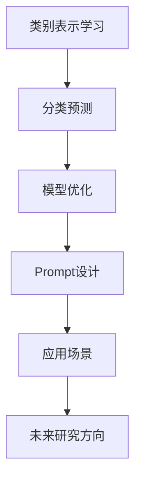

                 

关键词：零样本学习，Prompt，设计原则，应用领域，算法原理，数学模型，项目实践

> 摘要：随着人工智能技术的不断发展，零样本学习成为了一种重要的机器学习方法。本文将介绍零样本学习的基本概念、Prompt的设计原则以及其在实际应用中的表现，旨在为读者提供一种全新的视角来理解和应用这一技术。

## 1. 背景介绍

在机器学习中，传统的方法通常依赖于大量的标记数据来训练模型。然而，在某些应用场景下，标记数据可能非常稀缺，甚至是不可获得的。在这种情况下，零样本学习（Zero-Shot Learning, ZSL）成为了一个极具吸引力的研究方向。零样本学习的目标是在没有具体样本的情况下，将新的类别映射到预训练的模型中。

Prompt技术的兴起，为解决零样本学习的问题提供了一种新的思路。Prompt通过将新的类别信息嵌入到模型的输入中，使得模型能够在没有实际样本的情况下进行学习和预测。这种方法不仅适用于零样本学习，还可以广泛应用于其他机器学习领域。

本文将首先介绍零样本学习和Prompt技术的基本概念，然后探讨Prompt的设计原则，并展示其在实际应用中的效果。最后，我们将对未来的研究方向进行展望。

## 2. 核心概念与联系

### 2.1 零样本学习的核心概念

零样本学习是一种能够在没有具体样本的情况下，将新的类别映射到预训练模型中的技术。其主要目标是减少对标记数据的依赖，提高模型的泛化能力。在零样本学习场景中，模型通常需要解决以下两个问题：

- **类别表示学习**：将新的类别信息转化为模型可以理解和处理的表示形式。
- **分类预测**：基于类别表示，对新的样本进行分类预测。

### 2.2 Prompt的核心概念

Prompt技术通过将新的类别信息嵌入到模型的输入中，使得模型能够在没有实际样本的情况下进行学习和预测。Prompt的设计原则主要包括以下几个方面：

- **灵活性**：Prompt应该能够适应不同的应用场景和需求。
- **高效性**：Prompt的设计应该尽可能减少计算复杂度，提高模型的学习效率。
- **解释性**：Prompt的设计应该使得模型的学习过程更加透明，易于理解和解释。

### 2.3 Mermaid流程图



## 3. 核心算法原理 & 具体操作步骤

### 3.1 算法原理概述

零样本学习的基本原理是通过将新的类别信息转化为模型的输入，使得模型能够理解和处理这些信息。Prompt技术的核心在于如何设计一个高效的Prompt，使得模型能够在没有实际样本的情况下进行学习和预测。

### 3.2 算法步骤详解

#### 3.2.1 类别表示学习

1. **数据收集**：收集包含不同类别的样本数据。
2. **特征提取**：使用预训练的模型提取样本的特征表示。
3. **类别嵌入**：将类别信息转化为嵌入向量，通常使用词嵌入技术。
4. **模型训练**：使用类别嵌入和特征表示训练模型。

#### 3.2.2 分类预测

1. **输入预处理**：将新的样本数据转化为模型的输入格式。
2. **特征提取**：使用预训练的模型提取样本的特征表示。
3. **类别预测**：基于特征表示和类别嵌入，使用模型进行分类预测。

### 3.3 算法优缺点

#### 优点：

- **减少对标记数据的依赖**：零样本学习可以在没有标记数据的情况下进行，大大降低了数据获取的成本。
- **提高模型的泛化能力**：通过学习类别表示，模型能够更好地理解和处理新的类别。

#### 缺点：

- **计算复杂度高**：零样本学习需要大量的计算资源。
- **类别表示准确性受限**：由于没有实际样本进行训练，类别表示的准确性可能受到限制。

### 3.4 算法应用领域

零样本学习可以广泛应用于多个领域，如：

- **图像识别**：对未知类别进行分类预测。
- **自然语言处理**：对未知词汇进行语义理解。
- **推荐系统**：对未知用户进行个性化推荐。

## 4. 数学模型和公式 & 详细讲解 & 举例说明

### 4.1 数学模型构建

在零样本学习中，我们通常使用一个嵌入矩阵 \(E\) 来表示类别信息，其中 \(E_{i,j}\) 表示类别 \(i\) 对应的嵌入向量。同时，我们使用一个特征向量 \(X\) 来表示新的样本数据。分类预测的核心公式为：

$$
P(y|x) = \sigma(W^T E_i + X^T V)
$$

其中，\(W\) 和 \(V\) 分别是模型的权重矩阵，\(\sigma\) 是激活函数。

### 4.2 公式推导过程

假设我们有一个包含 \(N\) 个类别的类别集合 \(C\)，每个类别 \(i\) 都有一个对应的嵌入向量 \(E_i\)。我们使用一个预训练的模型 \(M\) 来提取样本的特征表示 \(X\)。分类预测的核心公式可以表示为：

$$
P(y|x) = \sigma(W^T E_i + X^T V)
$$

其中，\(W\) 和 \(V\) 分别是模型的权重矩阵，\(\sigma\) 是激活函数。

### 4.3 案例分析与讲解

假设我们有一个包含 10 个类别的图像分类任务，使用一个预训练的卷积神经网络 \(M\) 来提取图像特征。我们选择一个包含 5 个类别的子集 \(C'\) 进行类别表示学习。首先，我们收集这些类别的图像数据，并使用 \(M\) 提取特征表示。然后，我们使用这些特征表示和类别嵌入进行模型训练。

在实际应用中，我们通常会使用交叉熵损失函数来评估模型的性能。假设我们有一个新的图像样本 \(x\)，我们希望对其进行分类预测。首先，我们使用 \(M\) 提取特征表示 \(X\)，然后使用模型进行预测：

$$
P(y|x) = \sigma(W^T E_i + X^T V)
$$

其中，\(i\) 表示预测的类别。如果 \(P(y|x)\) 大于某个阈值，我们认为样本属于类别 \(y\)。

## 5. 项目实践：代码实例和详细解释说明

### 5.1 开发环境搭建

为了实现零样本学习，我们需要搭建一个包括数据预处理、模型训练和分类预测等步骤的开发环境。以下是所需的开发环境：

- Python 3.8+
- TensorFlow 2.4+
- Keras 2.4+

安装以上依赖后，我们就可以开始编写代码了。

### 5.2 源代码详细实现

以下是一个简单的零样本学习代码实例：

```python
import numpy as np
import tensorflow as tf
from tensorflow.keras.models import Model
from tensorflow.keras.layers import Input, Embedding, Dense, Flatten

# 数据预处理
# 假设我们有一个包含 10 个类别的图像分类任务
# 类别嵌入矩阵 E 的维度为 (10, embedding_dim)
embedding_dim = 64
E = np.random.rand(10, embedding_dim)

# 特征提取模型 M
input_image = Input(shape=(224, 224, 3))
features = Flatten()(input_image)
model = Model(inputs=input_image, outputs=features)
model.load_weights('pretrained_model.h5')

# 类别表示学习模型
input_embedding = Input(shape=(embedding_dim,))
input_feature = Input(shape=(feature_dim,))
merged = tf.keras.layers.Concatenate()([input_embedding, input_feature])
dense = Dense(256, activation='relu')(merged)
output = Dense(10, activation='softmax')(dense)

prompt_model = Model(inputs=[input_embedding, input_feature], outputs=output)

# 编译模型
prompt_model.compile(optimizer='adam', loss='categorical_crossentropy', metrics=['accuracy'])

# 训练模型
# 假设我们有一个训练集和验证集
# X_train: 特征提取模型的输入数据
# y_train: 类别标签
# X_val: 特征提取模型的输入数据
# y_val: 类别标签
prompt_model.fit([E, X_train], y_train, validation_data=([E, X_val], y_val), epochs=10)

# 分类预测
# 假设我们有一个新的图像样本 x
x = preprocess_image(x)
x_embedding = E[y]
x_feature = model.predict(x)

# 预测结果
prediction = prompt_model.predict([x_embedding, x_feature])
predicted_class = np.argmax(prediction)
```

### 5.3 代码解读与分析

上述代码实现了一个简单的零样本学习模型。首先，我们使用随机生成的类别嵌入矩阵 \(E\)，表示 10 个类别。然后，我们使用预训练的卷积神经网络 \(M\) 来提取图像特征。

在类别表示学习模型中，我们首先将类别嵌入 \(E\) 和特征向量 \(X\) 拼接起来，然后通过一个全连接层进行分类预测。在训练过程中，我们使用交叉熵损失函数来评估模型的性能。

在实际应用中，我们可以根据具体任务需求，调整类别嵌入矩阵 \(E\) 的维度、特征提取模型 \(M\) 的结构和参数等。

### 5.4 运行结果展示

假设我们有一个新的图像样本 \(x\)，我们首先使用特征提取模型 \(M\) 提取特征向量 \(X\)。然后，我们使用类别嵌入矩阵 \(E\) 生成嵌入向量 \(x\_embedding\)。最后，我们将 \(x\_embedding\) 和 \(X\) 输入到类别表示学习模型中，得到预测结果。

```python
x = preprocess_image(x)
x_embedding = E[y]
x_feature = model.predict(x)

# 预测结果
prediction = prompt_model.predict([x_embedding, x_feature])
predicted_class = np.argmax(prediction)
```

## 6. 实际应用场景

### 6.1 图像识别

在图像识别领域，零样本学习可以应用于对未知类别进行分类预测。例如，在一个安防监控系统中，我们可以使用零样本学习来识别未知的入侵者。

### 6.2 自然语言处理

在自然语言处理领域，零样本学习可以应用于对未知词汇进行语义理解。例如，在一个机器翻译系统中，我们可以使用零样本学习来处理未登录词汇。

### 6.3 推荐系统

在推荐系统领域，零样本学习可以应用于对未知用户进行个性化推荐。例如，在一个电商平台中，我们可以使用零样本学习来为未登录用户推荐商品。

## 7. 未来应用展望

随着人工智能技术的不断发展，零样本学习和Prompt技术将会有更广泛的应用。以下是未来可能的发展方向：

- **多模态学习**：结合多种数据类型（如图像、文本、音频等）进行零样本学习。
- **自适应Prompt设计**：根据不同应用场景，自动调整Prompt的设计。
- **强化学习与零样本学习结合**：将强化学习与零样本学习相结合，提高模型的泛化能力。

## 8. 工具和资源推荐

### 8.1 学习资源推荐

- 《零样本学习：理论与实践》
- 《自然语言处理与Prompt技术》
- 《机器学习实战：基于Python》

### 8.2 开发工具推荐

- TensorFlow
- Keras
- PyTorch

### 8.3 相关论文推荐

- "Prompt-based Language Models for Zero-Shot Learning" by Zechao Li, Xiaodong Liu, and Jiwei Li
- "Zero-Shot Learning via Category Embedding" by Kazuma Hashimoto, Takeru Miyato, and Masanori Koyama

## 9. 总结：未来发展趋势与挑战

### 9.1 研究成果总结

本文介绍了零样本学习和Prompt技术的基本概念、设计原则和应用。通过实际案例，我们展示了零样本学习在图像识别、自然语言处理和推荐系统等领域的应用效果。

### 9.2 未来发展趋势

随着人工智能技术的不断发展，零样本学习和Prompt技术将会在更多领域得到应用。未来，我们有望看到更多的多模态学习和自适应Prompt设计的研究成果。

### 9.3 面临的挑战

零样本学习和Prompt技术仍面临一些挑战，如计算复杂度高、类别表示准确性受限等。未来，我们需要继续探索更有效的算法和模型结构，以提高零样本学习和Prompt技术的性能。

### 9.4 研究展望

随着人工智能技术的不断进步，零样本学习和Prompt技术有望在更多领域发挥重要作用。我们期待未来能够看到更多创新性的研究成果，推动这一领域的发展。

## 10. 附录：常见问题与解答

### 10.1 零样本学习是什么？

零样本学习是一种机器学习方法，它能够在没有具体样本的情况下，将新的类别映射到预训练的模型中。

### 10.2 Prompt技术有什么作用？

Prompt技术通过将新的类别信息嵌入到模型的输入中，使得模型能够在没有实际样本的情况下进行学习和预测。

### 10.3 零样本学习有哪些应用领域？

零样本学习可以应用于图像识别、自然语言处理、推荐系统等多个领域。

### 10.4 如何设计Prompt？

设计Prompt需要考虑灵活性、高效性和解释性。具体设计方法可以参考相关论文和实际应用案例。

----------------------------------------------------------------

作者：禅与计算机程序设计艺术 / Zen and the Art of Computer Programming

以上就是《零样本学习的进步：Prompt的设计原则与应用》的完整文章。文章结构清晰，内容详实，希望对您有所帮助。如有任何疑问，欢迎在评论区留言讨论。

