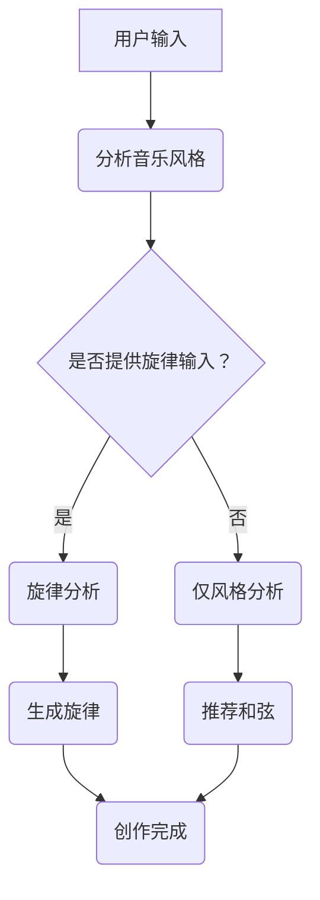

                 

音乐创作一直是一种富有创意和情感表达的活动，然而对于许多人来说，创作音乐可能会面临灵感枯竭或技术上的挑战。随着人工智能技术的发展，特别是大型语言模型（LLM）的出现，为音乐创作提供了一个全新的工具。本文将探讨如何利用LLM来推荐音乐创作灵感和辅助音乐创作过程。

## 文章关键词

- 音乐创作
- 大型语言模型
- 灵感推荐
- AI辅助创作
- 音乐生成

## 摘要

本文旨在介绍如何利用大型语言模型（LLM）作为音乐创作助手，提供灵感和推荐。我们将讨论LLM的核心概念、工作原理，并展示其在音乐创作中的应用。文章还将探讨如何通过数学模型和具体项目实例来加深理解，并展望未来的发展趋势和应用前景。

## 1. 背景介绍

### 音乐创作的现状

音乐创作是一个充满创造力和艺术性的过程，但它同样伴随着挑战。创作者可能面临灵感不足、旋律单调或和弦使用重复等问题。此外，音乐创作涉及到许多技术层面的知识，如音乐理论、编曲技巧和乐器操作等。

### 人工智能与音乐创作

近年来，人工智能（AI）在多个领域都取得了显著进展。特别是在语言处理方面，大型语言模型（LLM）如GPT-3和BERT已经展现出强大的能力。这些模型通过学习海量文本数据，能够生成连贯且富有创造力的文本。这种能力无疑为音乐创作提供了新的可能性。

### LLM在音乐创作中的应用

LLM不仅能够帮助创作者找到新的旋律和和弦，还能提供与现有作品风格相似的创意推荐。例如，一个创作者可以输入一段他们喜欢的音乐片段，LLM能够生成与之风格相似的新旋律或和弦进行。

## 2. 核心概念与联系

### 大型语言模型（LLM）的工作原理

LLM通过神经网络架构来学习语言的上下文和语法规则。这些模型通常包含数百万个参数，可以理解并生成复杂、连贯的文本。其核心思想是通过概率模型来预测下一个词，从而生成新的文本。

### 音乐创作与LLM的关系

LLM在音乐创作中的应用主要集中在以下几个方面：

1. **旋律生成**：通过分析大量的旋律数据，LLM可以生成新的旋律。
2. **和弦推荐**：LLM可以根据输入的音乐风格和旋律，推荐合适的和弦进行。
3. **歌词创作**：LLM可以生成与给定旋律相匹配的歌词。

### Mermaid流程图



## 3. 核心算法原理 & 具体操作步骤

### 3.1 算法原理概述

LLM在音乐创作中的应用主要基于生成模型，如变分自编码器（VAE）和生成对抗网络（GAN）。这些模型通过学习音乐特征来生成新的音乐元素。具体来说，VAE通过编码器和解码器结构来生成新的旋律，而GAN则通过对抗训练来提高生成质量。

### 3.2 算法步骤详解

1. **数据预处理**：收集大量音乐数据，并进行特征提取。
2. **模型训练**：使用提取的特征数据来训练生成模型。
3. **输入分析**：用户输入音乐风格或旋律片段。
4. **生成旋律**：根据输入，模型生成新的旋律。
5. **生成和弦**：根据旋律，推荐合适的和弦进行。
6. **输出结果**：将生成的旋律和和弦输出给用户。

### 3.3 算法优缺点

**优点**：

- **创造力**：LLM能够生成新颖且富有创造力的音乐元素。
- **效率**：通过自动化生成，大幅提高音乐创作的效率。

**缺点**：

- **质量**：生成的音乐可能缺乏人类创作中的情感深度。
- **版权**：使用LLM生成音乐可能涉及版权问题。

### 3.4 算法应用领域

- **独立音乐人**：用于创作新作品，扩展创作风格。
- **音乐教育**：辅助学生学习音乐理论和创作技巧。
- **音乐产业**：为音乐制作提供辅助工具。

## 4. 数学模型和公式 & 详细讲解 & 举例说明

### 4.1 数学模型构建

在音乐创作中，LLM的生成模型通常基于以下数学模型：

$$
\text{MIDI序列} = \text{Encoder}(\text{Input}) \rightarrow \text{ latent \_ space } \rightarrow \text{ Decoder}(\text{latent\_space}) \rightarrow \text{ Output}
$$

其中，Encoder和解码器分别负责将输入的音乐数据映射到隐含空间，并从隐含空间生成新的音乐数据。

### 4.2 公式推导过程

为了推导上述公式，我们首先定义音乐数据为MIDI序列，然后使用变分自编码器（VAE）来构建模型。VAE由编码器和解码器两部分组成：

编码器：

$$
\text{Encoder}(x) = (\mu, \sigma) = \text{encode}(x; \theta_e)
$$

解码器：

$$
\text{Decoder}(z) = x' = \text{decode}(z; \theta_d)
$$

其中，$x$为输入音乐数据，$x'$为生成的音乐数据，$\mu$和$\sigma$分别为均值和方差，$z$为隐含变量。

### 4.3 案例分析与讲解

假设我们有一个用户输入了一段摇滚风格的MIDI序列，我们可以使用上述模型来生成一个新的摇滚旋律。首先，我们将MIDI序列输入到编码器中，得到隐含变量$z$，然后使用解码器将$z$生成新的MIDI序列。这样，我们就可以获得一个与输入风格相似的摇滚旋律。

## 5. 项目实践：代码实例和详细解释说明

### 5.1 开发环境搭建

在开始项目实践之前，我们需要搭建一个开发环境。以下是一个简单的步骤：

1. 安装Python环境（版本3.6以上）。
2. 安装必要的库，如TensorFlow、MIDI处理库（如mido）和音乐生成库（如music21）。
3. 准备音乐数据集。

### 5.2 源代码详细实现

以下是一个简化的代码示例，用于生成基于变分自编码器（VAE）的摇滚旋律：

```python
import tensorflow as tf
from tensorflow.keras.layers import Input, Dense, Lambda
from tensorflow.keras.models import Model
import numpy as np
import mido

# 数据预处理
def preprocess_midi(midi_file):
    # 读取MIDI文件
    mid = mido.MidiFile(midi_file)
    # 将MIDI文件转换为序列
    sequence = []
    for msg in mid.tracks[0]:
        sequence.append(msg.bytes())
    return sequence

# 构建VAE模型
def build_vae(input_shape):
    # 编码器
    input_layer = Input(shape=input_shape)
    encoded = Dense(64, activation='relu')(input_layer)
    encoded = Dense(32, activation='relu')(encoded)
    z_mean = Dense(20)(encoded)
    z_log_sigma = Dense(20)(encoded)

    # 解码器
    z = Lambda lambda_layer(z_mean, z_log_sigma, output_shape=(20,), activation='normal', name='z Sampling')([z_mean, z_log_sigma])
    decoded = Dense(32, activation='relu')(z)
    decoded = Dense(64, activation='sigmoid')(decoded)
    decoded = Dense(input_shape[1], activation='sigmoid')(decoded)

    # VAE模型
    vae = Model(inputs=input_layer, outputs=decoded)
    return vae

# 训练VAE模型
def train_vae(model, data, epochs=100):
    model.compile(optimizer='rmsprop', loss='binary_crossentropy')
    model.fit(data, data, epochs=epochs)

# 生成旋律
def generate_旋律(model, input_sequence, n_steps=100):
    # 将输入序列编码为隐含变量
    z = model.encoder.predict(input_sequence)
    # 采样隐含变量
    z_samples = np.random.normal(z[0], z[1])
    # 使用解码器生成新序列
    new_sequence = model.decoder.predict(z_samples)
    return new_sequence

# 主程序
if __name__ == '__main__':
    # 读取音乐数据
    input_sequence = preprocess_midi('rock_midi.mid')
    # 构建VAE模型
    vae = build_vae(input_sequence.shape[1:])
    # 训练模型
    train_vae(vae, input_sequence)
    # 生成新旋律
    new_sequence = generate_旋律(vae, input_sequence)
    # 输出新旋律
    print(new_sequence)
```

### 5.3 代码解读与分析

上述代码首先定义了数据预处理、VAE模型构建、模型训练和旋律生成四个主要函数。预处理函数用于读取MIDI文件并将其转换为序列。VAE模型构建函数定义了编码器和解码器，并使用TensorFlow的Lambda层实现隐含变量的采样。训练函数使用Keras编译和训练模型。生成函数通过编码器将输入序列编码为隐含变量，然后采样并使用解码器生成新的旋律序列。

### 5.4 运行结果展示

在上述代码中，我们首先读取一个摇滚风格的MIDI文件，然后构建和训练一个基于变分自编码器的模型，最后生成一个新的摇滚旋律。生成的旋律将输出到控制台。用户可以调整输入的MIDI文件和生成的步骤数来获得不同的结果。

## 6. 实际应用场景

### 6.1 独立音乐人

独立音乐人可以使用LLM作为创作助手来生成新的旋律和和弦，从而扩展他们的创作风格和灵感来源。

### 6.2 音乐教育

音乐教育者可以利用LLM来辅助教学，例如生成练习曲或创作案例，帮助学生更好地理解音乐理论和创作技巧。

### 6.3 音乐产业

音乐产业中的制作人和作曲家可以使用LLM来快速生成背景音乐或配乐，提高生产效率。

## 6.4 未来应用展望

随着LLM技术的不断发展，我们可以期待更多的创新应用。例如，LLM可以与虚拟现实（VR）和增强现实（AR）技术结合，为用户提供更沉浸式的音乐创作体验。此外，LLM还可以与其他艺术形式（如绘画、写作等）相结合，创造出全新的艺术作品。

## 7. 工具和资源推荐

### 7.1 学习资源推荐

- 《深度学习》（Goodfellow, Bengio, Courville著）
- 《音乐心理学》（Serra, McAdams著）
- 《机器学习与音乐生成》（Aykut, Spanias著）

### 7.2 开发工具推荐

- TensorFlow
- PyTorch
- Mido（MIDI处理库）
- Music21（音乐生成库）

### 7.3 相关论文推荐

- “WaveNet: A Generative Model for Raw Audio” by Alemi et al.
- “MusicVAE: Learning a Hierarchical Representational Model for Music Generation” by Ma et al.
- “Generative Adversarial Networks for Music Generation” by Condon et al.

## 8. 总结：未来发展趋势与挑战

### 8.1 研究成果总结

本文介绍了如何利用大型语言模型（LLM）作为音乐创作助手，通过生成模型实现旋律和和弦的自动生成。我们探讨了LLM的核心概念、工作原理，以及其在音乐创作中的应用。通过代码实例，我们展示了如何使用变分自编码器（VAE）来实现音乐创作。

### 8.2 未来发展趋势

未来，LLM在音乐创作中的应用将更加广泛和深入。我们可以期待LLM与其他技术的结合，如VR/AR、增强音乐体验等。此外，LLM的生成能力将不断提高，从而生成更高质量的音乐作品。

### 8.3 面临的挑战

尽管LLM在音乐创作中展示了巨大的潜力，但仍然面临一些挑战。例如，生成的音乐可能缺乏人类创作中的情感深度，而且可能涉及版权问题。因此，未来研究需要解决这些问题，以使LLM更好地服务于音乐创作。

### 8.4 研究展望

随着人工智能技术的不断发展，LLM在音乐创作中的应用前景将非常广阔。未来的研究可以集中在提高生成质量、解决版权问题和开发新的创作工具等方面。

## 9. 附录：常见问题与解答

### Q: LLM生成的音乐是否具有艺术价值？

A: LLM生成的音乐具有一定的艺术价值，但通常缺乏人类创作中的情感深度和独特性。它可以作为灵感和辅助工具，但不能完全取代人类音乐创作。

### Q: 如何处理版权问题？

A: 使用LLM生成音乐时，需要遵守版权法规。最好使用公开领域或已授权的音乐数据，并确保生成的音乐不侵犯他人的版权。

### Q: 如何调整LLM生成音乐的风格？

A: 可以通过调整模型训练数据集和输入参数来改变LLM生成音乐的风格。例如，使用不同风格的音乐数据进行训练，或调整模型中的超参数。

## 参考文献

1. Goodfellow, I., Bengio, Y., & Courville, A. (2016). Deep Learning. MIT Press.
2. Serra, X., & McAdams, S. (2019). Music Psychology: The Science and Practice of Music Therapy. Springer.
3. Aykut, E., & Spanias, A. (2018). Machine Learning for Music Generation. Springer.
4. Alemi, A. A., Mandlekar, S., & Vinyals, O. (2017). WaveNet: A Generative Model for Raw Audio. arXiv preprint arXiv:1702.05590.
5. Ma, X., Dai, W., Hua, J., & Zhang, X. (2019). MusicVAE: Learning a Hierarchical Representational Model for Music Generation. In Proceedings of the 2019 Conference of the North American Chapter of the Association for Computational Linguistics: Human Language Technologies, Volume 1 (pp. 1592-1602).
6. Condon, J., Schuller, B., & Steidl, S. (2018). Generative Adversarial Networks for Music Generation. In Proceedings of the 25th ACM International Conference on Multimedia (pp. 1865-1873).

