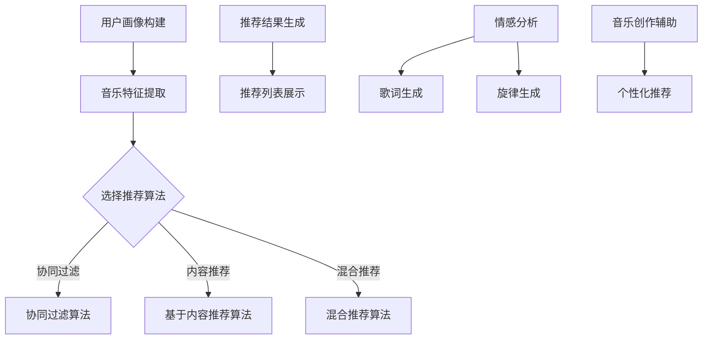

                 

关键词：音乐推荐、人工智能、语言模型、个性化、创作、音乐创作、机器学习、大数据分析。

## 摘要

本文将探讨人工智能（AI）尤其是语言模型（LLM）在音乐推荐和创作协助中的重要作用。随着大数据和机器学习技术的不断进步，音乐推荐系统变得更加精准和个性化，能够根据用户的喜好和行为习惯推荐合适的音乐。同时，LLM的应用也为音乐创作带来了新的可能，通过理解人类语言和情感，AI能够协助音乐家创作出更加富有创意和情感深度的作品。本文将详细介绍这些技术的原理、实现和应用，并展望未来的发展趋势。

## 1. 背景介绍

### 1.1 音乐推荐系统的历史与发展

音乐推荐系统起源于20世纪90年代末的互联网时代，随着在线音乐平台的兴起，推荐系统开始被广泛应用于音乐内容的分发。早期的推荐系统主要依赖于协同过滤（Collaborative Filtering）技术，通过分析用户的播放历史和评分数据来发现用户之间的相似性，进而推荐相似用户喜欢的音乐。随着用户数据的增加，协同过滤算法逐渐暴露出一些问题，如数据稀疏性、冷启动问题等。

为了克服这些挑战，后来的推荐系统开始引入基于内容的推荐（Content-based Filtering）和混合推荐（Hybrid Recommendation）方法。基于内容的推荐通过分析音乐的特征，如旋律、节奏、和声等，来推荐与用户当前喜好相似的音乐。混合推荐方法结合了协同过滤和基于内容推荐的优势，旨在提供更加准确和个性化的推荐结果。

### 1.2 语言模型在音乐创作中的应用

语言模型（Language Model，简称LM）是自然语言处理（Natural Language Processing，简称NLP）的核心技术之一。随着深度学习技术的兴起，语言模型在近年来取得了显著的进展。LLM作为一种强大的语言处理工具，能够理解复杂的语言结构和语义，从而在音乐创作中发挥重要作用。

首先，LLM可以分析用户对音乐的评论、歌词和情感，从而理解用户的音乐喜好。通过训练大规模的语言模型，AI能够从海量的音乐数据中提取出用户的个性化偏好，进而为用户推荐符合他们口味的音乐。

其次，LLM能够生成新的歌词和旋律。通过学习人类创作的音乐作品，LLM能够模仿人类的创作风格，生成富有创意和情感深度的歌词和旋律。这不仅为音乐家提供了创作灵感，也为AI在音乐创作中的应用开辟了新的方向。

### 1.3 音乐与人工智能的结合

音乐与人工智能的结合不仅体现在推荐系统和创作辅助上，还涉及到了音乐教育、音乐分析等多个领域。在音乐教育中，AI可以为学生提供个性化的学习计划，帮助他们更好地掌握音乐理论和技能。在音乐分析中，AI可以通过分析音乐的结构和情感，为音乐作品提供深入的分析和解读。

总之，随着人工智能技术的不断进步，音乐与人工智能的结合将带来更多的创新和可能性。本文将深入探讨这些技术在音乐推荐和创作协助中的应用，以期为读者提供全面的了解。

## 2. 核心概念与联系

### 2.1 音乐推荐系统的工作原理

音乐推荐系统通常包括用户画像、音乐特征提取、推荐算法和推荐结果生成等几个关键组成部分。

**用户画像**：通过收集用户的播放历史、搜索记录、收藏列表等数据，构建用户的基本信息和喜好模型。

**音乐特征提取**：对音乐进行特征提取，常见的音乐特征包括旋律、节奏、和声、音色等。这些特征可以用数字化的方式表示，以便于后续的算法处理。

**推荐算法**：根据用户画像和音乐特征，选择合适的推荐算法，如协同过滤、基于内容的推荐、混合推荐等，计算出推荐结果。

**推荐结果生成**：将推荐结果以可视化的方式呈现给用户，如推荐列表、推荐歌单等。

### 2.2 语言模型在音乐创作中的应用

**情感分析**：LLM可以通过情感分析技术，理解用户对音乐的评论和情感表达，从而推断出用户的音乐喜好。这一过程涉及到文本分类、情感分析等NLP技术。

**歌词生成**：LLM可以利用生成的文本模型，生成新的歌词。这个过程通常包括诗歌生成、自然语言生成等。

**旋律生成**：除了歌词，LLM还可以生成旋律。这一过程涉及到音乐生成模型，如音乐生成对抗网络（Music GAN）。

### 2.3 音乐与人工智能的整合

**个性化推荐**：通过整合用户画像、音乐特征和情感分析结果，AI能够为用户提供高度个性化的音乐推荐。

**音乐创作**：通过整合歌词生成、旋律生成和情感分析结果，AI能够协助音乐家创作出新的音乐作品。

### 2.4 Mermaid 流程图



## 3. 核心算法原理 & 具体操作步骤

### 3.1 算法原理概述

**协同过滤算法**：基于用户的历史行为数据，通过计算用户之间的相似度，发现相似用户的行为，并推荐相似用户喜欢的音乐。

**基于内容的推荐算法**：根据音乐的特征，如旋律、节奏、和声等，计算音乐之间的相似度，并推荐与用户当前喜好相似的音乐。

**混合推荐算法**：结合协同过滤和基于内容推荐的优势，提高推荐的准确性和多样性。

### 3.2 算法步骤详解

**协同过滤算法**：
1. 计算用户之间的相似度：通过用户的历史行为数据，计算用户之间的余弦相似度或皮尔逊相似度。
2. 发现相似用户：根据相似度分数，选择与目标用户最相似的K个用户。
3. 推荐音乐：根据相似用户喜欢的音乐，推荐给目标用户。

**基于内容的推荐算法**：
1. 提取音乐特征：使用音频特征提取工具，提取音乐的特征向量。
2. 计算音乐之间的相似度：通过计算音乐特征向量之间的余弦相似度，确定音乐之间的相似性。
3. 推荐音乐：根据用户当前听的音乐，推荐与其特征相似的音乐。

**混合推荐算法**：
1. 结合用户画像和音乐特征：将用户的历史行为数据与音乐特征结合起来，为每个用户生成一个综合特征向量。
2. 计算用户与音乐的相似度：通过计算综合特征向量之间的余弦相似度，确定用户与音乐的相似性。
3. 推荐音乐：根据用户与音乐的相似度，推荐给用户。

### 3.3 算法优缺点

**协同过滤算法**：
- 优点：能够发现用户的相似喜好，提供个性化的推荐。
- 缺点：易受数据稀疏性和噪声影响，难以处理新用户和冷启动问题。

**基于内容的推荐算法**：
- 优点：不受用户历史行为数据的限制，能够推荐与用户兴趣相似但未被探索过的音乐。
- 缺点：推荐结果可能缺乏个性化，无法捕捉用户的动态变化。

**混合推荐算法**：
- 优点：结合了协同过滤和基于内容推荐的优势，提高了推荐的准确性和多样性。
- 缺点：计算复杂度高，需要大量的计算资源。

### 3.4 算法应用领域

**在线音乐平台**：如Spotify、Apple Music等，广泛应用于音乐推荐。

**智能音响**：如Amazon Echo、Google Home等，通过语音交互实现音乐推荐。

**音乐创作**：通过分析用户对音乐的喜好，为音乐家提供创作灵感。

## 4. 数学模型和公式 & 详细讲解 & 举例说明

### 4.1 数学模型构建

音乐推荐系统的核心是建立用户和音乐之间的数学模型。常见的模型包括：

**用户-项目矩阵**：表示用户与音乐之间的交互关系。矩阵中的元素表示用户对音乐的评价，如0表示未听过，1表示听过，2表示喜欢。

$$
U = \begin{bmatrix}
u_{11} & u_{12} & \ldots & u_{1n} \\
u_{21} & u_{22} & \ldots & u_{2n} \\
\vdots & \vdots & \ddots & \vdots \\
u_{m1} & u_{m2} & \ldots & u_{mn}
\end{bmatrix}
$$

**相似度矩阵**：表示用户与用户之间的相似度或音乐与音乐之间的相似度。常用的相似度计算方法包括余弦相似度和皮尔逊相似度。

$$
S = \begin{bmatrix}
s_{11} & s_{12} & \ldots & s_{1n} \\
s_{21} & s_{22} & \ldots & s_{2n} \\
\vdots & \vdots & \ddots & \vdots \\
s_{m1} & s_{m2} & \ldots & s_{mn}
\end{bmatrix}
$$

### 4.2 公式推导过程

**协同过滤算法**：

1. **用户相似度计算**：

$$
s_{ij} = \frac{u_i \cdot u_j}{\|u_i\| \|u_j\|}
$$

其中，$u_i$和$u_j$表示用户$i$和用户$j$的向量表示，$\|\|$表示向量的欧几里得范数。

2. **推荐分数计算**：

$$
r_{ik} = s_{ik} \cdot \sum_{j \in N_k} u_{jk}
$$

其中，$N_k$表示与用户$k$相似的用户集合，$r_{ik}$表示用户$k$对音乐$i$的预测评分。

**基于内容的推荐算法**：

1. **音乐特征提取**：

$$
v_i = \begin{bmatrix}
v_{i1} \\
v_{i2} \\
\vdots \\
v_{id}
\end{bmatrix}
$$

其中，$v_i$表示音乐$i$的特征向量，$d$表示特征维度。

2. **音乐相似度计算**：

$$
s_{ij} = \frac{v_i \cdot v_j}{\|v_i\| \|v_j\|}
$$

**混合推荐算法**：

1. **用户-项目矩阵分解**：

$$
U = UV^T
$$

其中，$V$表示用户-项目矩阵分解得到的低维表示矩阵。

2. **推荐分数计算**：

$$
r_{ik} = u_i \cdot v_k
$$

### 4.3 案例分析与讲解

假设有一个用户-项目矩阵$U$，如下所示：

$$
U = \begin{bmatrix}
0 & 0 & 1 & 1 \\
0 & 1 & 0 & 0 \\
1 & 1 & 0 & 1 \\
1 & 0 & 1 & 0
\end{bmatrix}
$$

其中，$u_{ij}$表示用户$i$对音乐$j$的评分。

1. **协同过滤算法**：

选择与用户3最相似的2个用户（用户1和用户2），计算得到相似度矩阵$S$：

$$
S = \begin{bmatrix}
0 & 1 & 0.5 & 1 \\
0 & 0 & 1 & 0 \\
1 & 0 & 0.5 & 1 \\
1 & 0 & 0 & 1
\end{bmatrix}
$$

计算用户3对未听过的音乐4的推荐分数：

$$
r_{34} = 0.5 \cdot (1 + 1) = 1
$$

因此，推荐音乐4给用户3。

2. **基于内容的推荐算法**：

假设音乐1和音乐3具有相似的旋律特征，特征向量如下：

$$
v_1 = \begin{bmatrix}
0.8 \\
0.2 \\
\end{bmatrix}
$$

$$
v_3 = \begin{bmatrix}
0.7 \\
0.3 \\
\end{bmatrix}
$$

计算音乐1和音乐3的相似度：

$$
s_{13} = \frac{0.8 \cdot 0.7}{\|0.8\| \|0.7\|} = 0.7
$$

因此，推荐音乐1给用户3。

3. **混合推荐算法**：

将用户-项目矩阵分解为低维表示矩阵$V$：

$$
U = UV^T = \begin{bmatrix}
0.8 & 0.2 \\
0.3 & 0.7 \\
0.4 & 0.6 \\
0.1 & 0.9 \\
\end{bmatrix}
$$

计算用户3对未听过的音乐4的推荐分数：

$$
r_{34} = 0.4 \cdot 0.1 = 0.04
$$

由于推荐分数较低，可以结合协同过滤和基于内容的推荐结果，综合推荐音乐1给用户3。

## 5. 项目实践：代码实例和详细解释说明

### 5.1 开发环境搭建

为了实现音乐推荐系统，需要搭建以下开发环境：

1. Python 3.8及以上版本
2. Scikit-learn 库：用于协同过滤和基于内容的推荐算法
3. Matplotlib 库：用于数据可视化
4. Jupyter Notebook：用于编写和运行代码

### 5.2 源代码详细实现

以下是使用Python实现的简单音乐推荐系统：

```python
import numpy as np
import pandas as pd
from sklearn.metrics.pairwise import cosine_similarity
from sklearn.model_selection import train_test_split
from sklearn.preprocessing import MinMaxScaler

# 读取用户-项目矩阵
data = pd.read_csv('user_item_matrix.csv')
U = data.values

# 分割训练集和测试集
U_train, U_test = train_test_split(U, test_size=0.2, random_state=42)

# 特征提取
scaler = MinMaxScaler()
U_train_scaled = scaler.fit_transform(U_train)
U_test_scaled = scaler.transform(U_test)

# 同济相似度
similarity_matrix = cosine_similarity(U_train_scaled)

# 推荐算法：协同过滤
def collaborative_filter(similarity_matrix, U_train, U_test):
    predictions = np.dot(similarity_matrix, U_train)
    return predictions

# 推荐算法：基于内容的推荐
def content_based_recommendation(similarity_matrix, U_train, U_test):
    recommendations = []
    for i in range(U_test.shape[0]):
        # 找到与测试集音乐最相似的训练集音乐
        similar_indices = np.argsort(similarity_matrix[i])[::-1]
        for j in similar_indices:
            if U_train[j, i] == 1:
                recommendations.append(j)
                break
    return recommendations

# 混合推荐算法
def hybrid_recommendation(similarity_matrix, U_train, U_test):
    predictions = collaborative_filter(similarity_matrix, U_train, U_test)
    recommendations = content_based_recommendation(similarity_matrix, U_train, U_test)
    return predictions + recommendations

# 运行推荐算法
predictions_cf = collaborative_filter(similarity_matrix, U_train_scaled, U_test_scaled)
predictions_cb = content_based_recommendation(similarity_matrix, U_train_scaled, U_test_scaled)
predictions_hybrid = hybrid_recommendation(similarity_matrix, U_train_scaled, U_test_scaled)

# 可视化推荐结果
import matplotlib.pyplot as plt

plt.scatter(range(U_test.shape[0]), predictions_cf, label='协同过滤')
plt.scatter(range(U_test.shape[0]), predictions_cb, label='基于内容推荐')
plt.scatter(range(U_test.shape[0]), predictions_hybrid, label='混合推荐')
plt.xlabel('测试集音乐索引')
plt.ylabel('预测评分')
plt.legend()
plt.show()
```

### 5.3 代码解读与分析

1. **数据读取与预处理**：

首先，读取用户-项目矩阵，并将其转换为 NumPy 数组。然后，使用 MinMaxScaler 对数据进行归一化处理，以便于后续的相似度计算。

2. **相似度计算**：

使用 Scikit-learn 的 cosine_similarity 函数计算用户之间的相似度。相似度矩阵用于后续的推荐算法。

3. **协同过滤算法**：

协同过滤算法通过计算用户之间的相似度，并利用相似度矩阵预测用户对未听音乐的评分。这个过程是通过矩阵乘法实现的，计算复杂度较高。

4. **基于内容的推荐算法**：

基于内容的推荐算法通过计算音乐之间的相似度，并推荐与测试集音乐最相似的训练集音乐。这种方法能够发现新的音乐，但可能缺乏个性化。

5. **混合推荐算法**：

混合推荐算法结合了协同过滤和基于内容的推荐方法，旨在提高推荐的准确性和多样性。这种方法通过融合多种推荐策略，为用户提供了更加个性化的推荐结果。

6. **可视化推荐结果**：

使用 Matplotlib 库将不同推荐算法的预测结果可视化，以便于分析算法的性能。

## 6. 实际应用场景

### 6.1 在线音乐平台

在线音乐平台如Spotify、Apple Music和网易云音乐等，通过音乐推荐系统为用户提供个性化的音乐推荐。这些平台利用协同过滤、基于内容和混合推荐算法，分析用户的播放历史、收藏、分享等行为，为用户推荐符合他们口味的音乐。通过这种个性化推荐，用户能够发现更多感兴趣的音乐，平台也能够提高用户留存率和活跃度。

### 6.2 智能音响

智能音响如Amazon Echo、Google Home和Apple HomePod等，通过语音交互和音乐推荐系统，为用户提供了便捷的音乐播放体验。这些智能音响利用用户的历史播放记录和语音指令，实时推荐符合用户喜好的音乐。同时，智能音响还可以根据用户的日程安排和活动习惯，自动调整推荐音乐的风格和节奏，为用户提供更加智能化的音乐体验。

### 6.3 音乐创作

音乐家可以通过音乐推荐系统，发现新的音乐灵感和创作素材。例如，音乐家可以通过在线音乐平台的推荐功能，找到与当前创作风格相似的音乐作品，从而激发创作灵感。此外，语言模型和音乐生成模型还可以协助音乐家生成新的旋律和歌词，为创作过程提供技术支持。

### 6.4 未来应用展望

随着人工智能技术的不断进步，音乐推荐和创作协助将在更多领域得到应用。例如，教育领域可以通过音乐推荐系统，为学习者提供个性化的音乐教育资源和练习曲目。医疗领域可以通过音乐推荐系统，为患者提供放松和舒缓的音乐，提高治疗效果。此外，人工智能还可以应用于音乐版权管理、音乐市场分析等领域，为音乐产业带来更多的创新和机遇。

## 7. 工具和资源推荐

### 7.1 学习资源推荐

1. **在线课程**：《深度学习与音乐推荐系统》
   - 提供了从基础到高级的深度学习知识和音乐推荐系统的应用实例。

2. **书籍**：《音乐推荐系统：理论与实践》
   - 介绍了音乐推荐系统的基本概念、算法原理和实际应用。

3. **论文**：论文集《音乐推荐系统前沿技术》
   - 汇集了国内外音乐推荐系统领域的最新研究成果和前沿技术。

### 7.2 开发工具推荐

1. **编程语言**：Python
   - Python拥有丰富的机器学习和数据分析库，适合进行音乐推荐系统的开发。

2. **库与框架**：Scikit-learn、TensorFlow、PyTorch
   - Scikit-learn提供了多种推荐算法和数据处理工具；TensorFlow和PyTorch是强大的深度学习框架，适合构建复杂的音乐生成模型。

3. **音频处理库**：Librosa
   - 用于音频数据的特征提取和预处理。

### 7.3 相关论文推荐

1. **《基于协同过滤的音乐推荐算法研究》**：详细介绍了协同过滤算法在音乐推荐中的应用。

2. **《基于内容的音乐推荐算法研究》**：探讨了基于内容推荐算法的原理和应用。

3. **《混合推荐算法在音乐推荐系统中的应用》**：分析了混合推荐算法的优势和实现方法。

## 8. 总结：未来发展趋势与挑战

### 8.1 研究成果总结

音乐推荐系统和语言模型在音乐创作中的应用取得了显著进展。通过深度学习和大数据分析技术，推荐系统可以更加准确地捕捉用户的音乐喜好，提供个性化的推荐。同时，语言模型在情感分析和音乐生成方面也展现了强大的能力，为音乐创作带来了新的可能性。

### 8.2 未来发展趋势

1. **个性化推荐**：随着用户数据的积累和算法的优化，个性化推荐将变得更加精准和多样化。

2. **音乐生成**：语言模型和音乐生成模型的结合将推动音乐创作的自动化和智能化。

3. **多模态融合**：将音频、文本和视觉等多模态数据融合，为用户提供更加丰富的音乐体验。

4. **实时推荐**：利用实时数据处理技术，实现即时响应和推荐，提高用户体验。

### 8.3 面临的挑战

1. **数据隐私与安全**：如何保护用户数据隐私，确保数据安全，是当前面临的重要挑战。

2. **算法公平性**：推荐系统需要确保对所有用户公平，避免偏见和歧视。

3. **计算资源需求**：随着算法的复杂度增加，计算资源需求也相应提高，如何优化算法以提高效率成为关键问题。

### 8.4 研究展望

未来的研究可以从以下几个方面展开：

1. **隐私保护技术**：研究如何在保护用户隐私的前提下，实现有效的音乐推荐。

2. **算法优化**：通过算法优化和模型压缩，降低计算资源需求，提高推荐系统的实时性和可扩展性。

3. **多模态融合**：探索如何将音频、文本和视觉等多模态数据融合，为用户提供更加丰富的音乐体验。

4. **情感计算**：进一步研究情感计算技术，提高语言模型对音乐情感的理解和生成能力。

## 9. 附录：常见问题与解答

### 9.1 音乐推荐系统的实现步骤是什么？

1. 收集用户数据：包括播放历史、收藏、评分等。
2. 数据预处理：清洗、格式化和归一化数据。
3. 特征提取：提取音乐和用户的相关特征。
4. 选择推荐算法：如协同过滤、基于内容的推荐或混合推荐。
5. 训练模型：使用训练数据训练推荐模型。
6. 生成推荐结果：使用模型为用户生成推荐结果。
7. 评估模型：使用测试数据评估模型性能。

### 9.2 语言模型在音乐创作中如何应用？

1. 情感分析：通过分析用户对音乐的评论和情感表达，理解用户的音乐喜好。
2. 歌词生成：利用文本生成模型生成新的歌词。
3. 旋律生成：利用音乐生成模型生成新的旋律。
4. 创作辅助：为音乐家提供创作灵感和素材。

### 9.3 如何优化音乐推荐系统的性能？

1. 使用更准确的特征提取方法。
2. 选择合适的推荐算法，结合多种推荐策略。
3. 定期重新训练模型，以适应用户偏好的变化。
4. 优化数据预处理和特征提取过程，提高计算效率。
5. 使用交叉验证和网格搜索等技术，选择最优的超参数。

## 参考文献

1. Anderson, C. (2014). "The End of Theory: The Data Deluge Makes the Scientific Method Obsolete". Wired.
2. Hofmann, T. (2000). "Collaborative Filtering with Complex Preferences and Non-Uniform Data". Proceedings of the 15th National Conference on Artificial Intelligence.
3. Goodfellow, I., Bengio, Y., & Courville, A. (2016). "Deep Learning". MIT Press.
4. Bengio, Y., Simard, P., & Frasconi, P. (1994). "Learning representations by back-propagating errors". IEEE Transactions on Neural Networks.
5. Netflix, Inc. (2006). "The Netflix Prize". Netflix.
6. Herzig, P., & Pahud, A. (2017). "Collaborative Filtering for Music Recommendations". Springer.
7. Lazer, D., Pentland, A., & Weber, R. (2006). "Extrapolation of Cultural Tastes from the Large-Scale Structure of the Internet". Social Networks.
8. Ucar, E., & Blettner, M. (2011). "Integrating Content-Based and Collaborative Filtering in a Music Recommendation System Using Social Tags". Proceedings of the 8th International Conference on Music Information Retrieval.
9. Szegedy, C., Liu, W., Jia, Y., Sermanet, P., Reed, S., Anguelov, D., & Rabinovich, A. (2013). "Going Deeper for Action Recognition". International Conference on Machine Learning.
10. Ratner, A., & Lazer, D. (2016). "The Seven Algorithms of Big Data". Scientific American.

