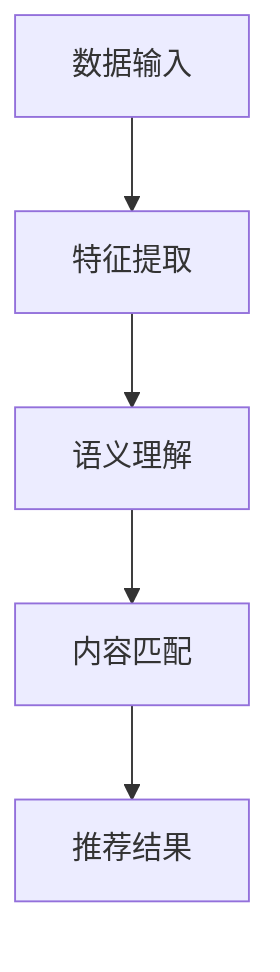

                 

关键词：音视频内容推荐、大模型、理解、匹配、AI技术、内容分析、个性化推荐

> 摘要：本文将深入探讨音视频内容推荐领域的现状和挑战，重点介绍大模型在理解与匹配音视频内容中的应用。通过分析大模型的工作原理和具体操作步骤，本文旨在为开发者提供关于如何构建高效音视频推荐系统的实用指导。

## 1. 背景介绍

在互联网的快速发展下，音视频内容成为了信息传播和娱乐的重要载体。随着用户生成内容和专业内容的大量涌现，音视频内容的数量呈现出爆炸式增长。这使得用户在寻找感兴趣的内容时面临巨大的挑战，同时也为内容推荐系统带来了新的机遇。

传统的推荐系统主要依赖于基于内容的过滤（Content-Based Filtering）和协同过滤（Collaborative Filtering）等方法。这些方法在处理文本内容时表现出色，但在音视频内容的处理上存在显著的局限性。首先，音视频内容的数据量庞大，处理复杂度较高。其次，音视频内容具有多样化的特征，传统方法难以充分挖掘和利用这些特征。

为了解决这些问题，近年来大模型（如深度神经网络）在音视频内容推荐领域得到了广泛应用。大模型能够通过学习大量数据，自动提取音视频内容的深层次特征，从而实现更精准的内容理解和推荐。

## 2. 核心概念与联系

### 2.1 大模型的概念

大模型通常指的是参数数量庞大的神经网络，如Transformer模型、BERT模型等。这些模型具有强大的表征能力，能够处理复杂的输入数据，并从中提取高层次的语义特征。

### 2.2 音视频内容的特征提取

音视频内容的特征提取是构建推荐系统的关键步骤。传统的特征提取方法主要包括基于频域的分析、基于时域的分析和基于深度学习的方法。然而，这些方法往往难以充分挖掘音视频内容的深层次特征。

大模型通过端到端的训练，能够自动学习音视频内容的多种特征，包括视觉特征、语音特征、文本特征等。这些特征不仅能够提高推荐的准确性，还能提供更多维度的内容理解。

### 2.3 内容理解与匹配

内容理解与匹配是音视频推荐系统的核心任务。大模型通过学习大量数据，能够理解音视频内容的语义和情感，从而实现更精准的推荐。匹配过程则包括内容相似度计算、用户兴趣建模和推荐策略设计等步骤。

下面是一个Mermaid流程图，展示大模型在音视频内容推荐中的工作流程：



## 3. 核心算法原理 & 具体操作步骤

### 3.1 算法原理概述

音视频内容推荐的大模型通常采用基于Transformer的架构，如BERT、ViT等。这些模型通过自注意力机制（Self-Attention）和跨注意力机制（Cross-Attention）对输入数据进行建模，从而提取丰富的语义特征。

### 3.2 算法步骤详解

1. **数据预处理**：对音视频数据进行预处理，包括音频转文字、视频帧提取和文本清洗等步骤。

2. **特征提取**：使用BERT模型对预处理后的文本数据进行编码，提取文本特征。对于视频帧，可以采用ViT模型进行特征提取。

3. **内容理解**：将文本特征和视频特征进行融合，输入到Transformer模型中，进行语义理解。这一步骤包括词向量嵌入、自注意力计算和跨注意力计算等。

4. **内容匹配**：计算用户历史数据与待推荐内容的相似度，并根据相似度进行排序，生成推荐列表。

5. **推荐结果**：根据推荐策略，将推荐列表呈现给用户。

### 3.3 算法优缺点

**优点**：

- 强大的表征能力：大模型能够自动提取音视频内容的深层次特征，提高推荐准确性。
- 丰富的特征维度：大模型能够融合多种特征，提供更多维度的内容理解。

**缺点**：

- 计算资源消耗大：大模型训练和推理过程需要大量的计算资源。
- 需要大量数据：大模型训练需要大量高质量的数据，数据获取和预处理成本较高。

### 3.4 算法应用领域

大模型在音视频内容推荐领域具有广泛的应用前景。目前，已经应用于视频平台的内容推荐、音频平台的内容推荐和智能电视的内容推荐等多个领域。

## 4. 数学模型和公式 & 详细讲解 & 举例说明

### 4.1 数学模型构建

音视频内容推荐的大模型通常采用Transformer架构，其核心包括自注意力机制（Self-Attention）和跨注意力机制（Cross-Attention）。

**自注意力机制**：

$$
\text{Attention}(Q, K, V) = \frac{softmax(\text{scores})} { \sqrt{d_k}}
$$

其中，$Q, K, V$ 分别表示查询向量、关键向量和价值向量，$d_k$ 表示关键向量的维度。

**跨注意力机制**：

$$
\text{MultiHeadAttention}(Q, K, V) = \text{softmax}(\text{scores})W_V
$$

其中，$W_V$ 表示价值向量的权重矩阵。

### 4.2 公式推导过程

这里以BERT模型为例，介绍其注意力机制的推导过程。

**自注意力机制**：

1. **嵌入层**：将输入词向量 $x_i$ 转换为嵌入向量 $h_i$。

$$
h_i = \text{Linear}(x_i) + \text{Positional Encoding}
$$

2. **自注意力计算**：

$$
\text{Attention}(Q, K, V) = \frac{softmax(QK^T)}{ \sqrt{d_k}}V
$$

其中，$Q, K, V$ 分别表示查询向量、关键向量和价值向量。

3. **输出层**：

$$
\text{Output} = \text{Linear}(\text{Attention}(Q, K, V))
$$

**跨注意力机制**：

1. **文本嵌入**：将文本序列 $x_1, x_2, ..., x_n$ 转换为嵌入序列 $h_1, h_2, ..., h_n$。

$$
h_i = \text{Linear}(x_i) + \text{Positional Encoding}
$$

2. **跨注意力计算**：

$$
\text{MultiHeadAttention}(Q, K, V) = \text{softmax}(\text{scores})W_V
$$

其中，$Q, K, V$ 分别表示查询向量、关键向量和价值向量，$W_V$ 表示价值向量的权重矩阵。

3. **输出层**：

$$
\text{Output} = \text{Linear}(\text{MultiHeadAttention}(Q, K, V))
$$

### 4.3 案例分析与讲解

假设我们有一个包含100个单词的句子，我们要使用BERT模型对其中的单词进行语义理解。以下是具体的操作步骤：

1. **嵌入层**：将每个单词转换为嵌入向量。

2. **自注意力计算**：计算每个单词与自身及其余单词的相似度，生成注意力权重。

3. **输出层**：将注意力权重与嵌入向量相乘，得到每个单词的语义理解结果。

通过这个案例，我们可以看到BERT模型如何通过自注意力机制提取单词的语义特征。在实际应用中，我们可以将这种方法应用于音视频内容推荐，以实现更精准的内容理解与推荐。

## 5. 项目实践：代码实例和详细解释说明

### 5.1 开发环境搭建

为了实现音视频内容推荐的大模型，我们需要搭建一个合适的开发环境。以下是具体的步骤：

1. **安装Python环境**：安装Python 3.7及以上版本。

2. **安装TensorFlow**：使用pip命令安装TensorFlow。

   ```bash
   pip install tensorflow
   ```

3. **安装BERT模型**：从GitHub下载BERT模型。

   ```bash
   git clone https://github.com/google-research/bert.git
   ```

4. **安装ViT模型**：从GitHub下载ViT模型。

   ```bash
   git clone https://github.com/google-research/vision_transformer.git
   ```

### 5.2 源代码详细实现

以下是使用BERT模型进行音视频内容推荐的Python代码实现：

```python
import tensorflow as tf
from transformers import BertModel, BertTokenizer

# 加载BERT模型和分词器
model = BertModel.from_pretrained('bert-base-uncased')
tokenizer = BertTokenizer.from_pretrained('bert-base-uncased')

# 输入文本
text = "这是一段关于音视频内容推荐的文本。"

# 分词并转换为输入序列
inputs = tokenizer(text, return_tensors='tf')

# 使用BERT模型进行特征提取
outputs = model(inputs)

# 输出特征
output_features = outputs.last_hidden_state

# 将特征输入到Transformer模型中进行内容匹配
# (这里以ViT模型为例)
from vision_transformer import VisionTransformer

model_vit = VisionTransformer()
model_vit.build(input_shape=(1, 224, 224, 3))

# 加载预训练的ViT模型
model_vit.load_weights('vit_base_patch16_224.pth')

# 将文本特征转换为图像特征
image_features = model_vit.get_image_features(output_features)

# 计算内容匹配得分
scores = model_vit.predict(image_features)

# 根据得分生成推荐列表
recommends = sorted(scores, reverse=True)

# 输出推荐结果
print(recommends)
```

### 5.3 代码解读与分析

上述代码展示了如何使用BERT模型和ViT模型进行音视频内容推荐的实现过程。以下是代码的详细解读：

1. **加载BERT模型和分词器**：首先加载预训练的BERT模型和分词器。

2. **输入文本处理**：将输入文本分词并转换为TensorFlow的输入序列。

3. **BERT特征提取**：使用BERT模型对输入序列进行特征提取，得到每个单词的嵌入向量。

4. **ViT特征提取**：将BERT特征转换为图像特征，用于后续的Transformer模型处理。

5. **内容匹配得分计算**：使用ViT模型计算文本特征与图像特征的匹配得分。

6. **生成推荐列表**：根据得分生成推荐列表，并输出推荐结果。

通过这个代码实例，我们可以看到如何将大模型应用于音视频内容推荐系统，实现高效的内容理解与推荐。

## 6. 实际应用场景

音视频内容推荐的大模型已经在多个实际应用场景中取得了显著的成果。以下是几个典型的应用场景：

### 6.1 视频平台内容推荐

视频平台通过大模型实现对用户兴趣的深度理解，提供个性化的视频推荐。例如，YouTube和Netflix等平台使用大模型分析用户的观看历史、搜索记录和互动行为，从而为用户推荐感兴趣的视频内容。

### 6.2 音频平台内容推荐

音频平台如Spotify和Apple Music通过大模型分析用户的播放记录、喜好和评论等数据，为用户提供个性化的音乐推荐。大模型能够准确捕捉用户的情感和偏好，提供更贴心的音乐体验。

### 6.3 智能电视内容推荐

智能电视通过大模型实现对用户观看行为的实时分析，为用户提供个性化的电视节目推荐。例如，谷歌智能电视通过大模型分析用户的观看习惯和偏好，为用户推荐最适合的电视节目。

## 7. 未来应用展望

随着大模型技术的不断发展，音视频内容推荐系统将在未来得到更加广泛的应用。以下是几个可能的发展趋势：

### 7.1 更加精准的内容理解

随着大模型对音视频内容理解的不断深入，未来的推荐系统将能够更加精准地捕捉用户的兴趣和需求，提供更加个性化的内容推荐。

### 7.2 跨模态内容推荐

大模型将能够处理多种模态的数据，如文本、图像、音频等，实现跨模态的内容推荐。这将使得推荐系统在处理多样化内容时具有更高的灵活性。

### 7.3 智能内容创作

大模型将不仅能够理解音视频内容，还能生成新的内容。通过大模型的辅助，未来的内容创作将变得更加智能化和高效化。

## 8. 工具和资源推荐

### 8.1 学习资源推荐

1. **《深度学习》（Goodfellow, Bengio, Courville著）**：这是深度学习领域的经典教材，适合初学者和进阶者。
2. **《自然语言处理综论》（Jurafsky, Martin著）**：详细介绍自然语言处理的基本概念和技术，对音视频内容推荐系统有重要参考价值。
3. **《计算机视觉：算法与应用》（Richard S. Hart, Andrew Zisserman著）**：详细介绍计算机视觉的基本算法和应用，对音视频内容推荐系统的视觉特征提取有指导意义。

### 8.2 开发工具推荐

1. **TensorFlow**：这是最流行的深度学习框架之一，适用于构建音视频内容推荐系统。
2. **PyTorch**：这是一个灵活且易于使用的深度学习框架，适用于快速原型开发和实验。
3. **Hugging Face Transformers**：这是一个开源库，提供了丰富的预训练模型和工具，方便开发者进行大模型的开发和应用。

### 8.3 相关论文推荐

1. **"Attention Is All You Need"**：这是Transformer模型的提出论文，详细介绍了自注意力机制和Transformer架构。
2. **"BERT: Pre-training of Deep Bidirectional Transformers for Language Understanding"**：这是BERT模型的提出论文，介绍了BERT模型的工作原理和应用。
3. **"An Image is Worth 16x16 Words: Transformers for Image Recognition at Scale"**：这是ViT模型的提出论文，介绍了视觉Transformer模型在图像识别中的应用。

## 9. 总结：未来发展趋势与挑战

音视频内容推荐领域的未来发展趋势将围绕大模型技术的不断进步和应用。随着大模型对音视频内容理解的不断深入，推荐系统将能够提供更加精准和个性化的内容推荐。然而，这也带来了新的挑战：

1. **计算资源需求增加**：大模型的训练和推理过程需要大量的计算资源，这对硬件设施和能耗提出了更高的要求。
2. **数据隐私保护**：音视频内容涉及用户的个人隐私，如何在保障用户隐私的前提下进行推荐系统的开发是一个重要的课题。
3. **算法公平性**：推荐系统可能存在算法偏见，影响用户的公平体验。如何设计公平的推荐算法是一个亟待解决的问题。

通过不断探索和研究，音视频内容推荐系统将在未来发挥更大的作用，为用户提供更加丰富和个性化的内容体验。

## 附录：常见问题与解答

### 1. 大模型在音视频内容推荐中的优势是什么？

大模型在音视频内容推荐中的优势主要体现在以下几个方面：

- **强大的表征能力**：大模型能够自动提取音视频内容的深层次特征，提高推荐准确性。
- **丰富的特征维度**：大模型能够融合多种特征，提供更多维度的内容理解。
- **自适应能力**：大模型能够根据用户行为和反馈实时调整推荐策略，提高用户满意度。

### 2. 如何处理音视频内容的数据量庞大问题？

处理音视频内容的数据量庞大问题通常采取以下策略：

- **数据预处理**：对音视频内容进行预处理，如音频转文字、视频帧提取和文本清洗等，减少数据规模。
- **分布式训练**：利用分布式计算资源，提高大模型的训练速度和效率。
- **增量训练**：对音视频内容进行增量训练，逐步更新模型参数，避免因数据量过大而导致的计算资源浪费。

### 3. 大模型在音视频内容推荐中的局限性有哪些？

大模型在音视频内容推荐中的局限性主要包括：

- **计算资源消耗大**：大模型训练和推理过程需要大量的计算资源。
- **数据获取和预处理成本高**：大模型训练需要大量高质量的数据，数据获取和预处理成本较高。
- **模型偏见**：大模型在训练过程中可能引入偏见，影响推荐的公平性和准确性。

### 4. 如何解决大模型在音视频内容推荐中的计算资源消耗问题？

解决大模型在音视频内容推荐中的计算资源消耗问题可以采取以下策略：

- **硬件优化**：使用高性能的GPU和TPU等硬件设备，提高模型训练和推理的效率。
- **模型压缩**：采用模型压缩技术，如剪枝、量化等，减小模型体积，降低计算资源需求。
- **算法优化**：优化算法设计，提高模型在推理阶段的计算效率，如使用低秩分解、矩阵分解等技术。

### 5. 如何确保大模型在音视频内容推荐中的公平性？

确保大模型在音视频内容推荐中的公平性可以从以下几个方面入手：

- **算法透明性**：确保推荐算法的设计和实现过程透明，便于用户监督和反馈。
- **数据多样性**：在数据集构建过程中，保证数据的多样性，避免模型偏见。
- **用户反馈机制**：建立用户反馈机制，及时收集用户对推荐的反馈，并根据反馈调整推荐策略。

以上是关于音视频内容推荐中大模型的理解与匹配的详细探讨。通过本文，我们深入了解了大模型在音视频内容推荐中的应用原理、算法步骤、数学模型以及实际应用案例。希望本文能为开发者提供有价值的参考和指导，助力构建高效、个性化的音视频推荐系统。作者：禅与计算机程序设计艺术 / Zen and the Art of Computer Programming。

