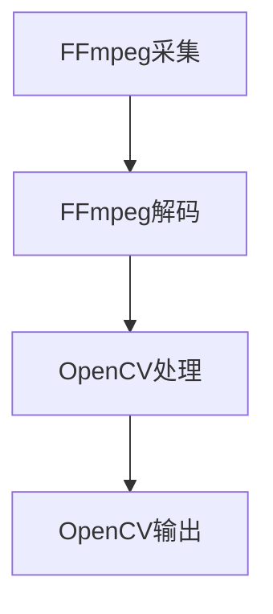

                 

## 1. 背景介绍

音视频处理作为多媒体领域的重要组成部分，已经在我们的日常生活中扮演着越来越重要的角色。从流媒体视频到在线直播，从高清影视到短视频制作，音视频处理技术的进步不断推动着多媒体产业的快速发展。FFmpeg和OpenCV作为音视频处理领域中的两款核心工具，其重要性不言而喻。

FFmpeg是一款开源、免费的音视频处理工具，由法国开发者Fabrice Bellard于2000年创立。它支持几乎所有常见的视频、音频和字幕文件格式，并提供了丰富的编解码器和过滤器。FFmpeg广泛应用于视频编辑、转码、流媒体传输等场景，是许多专业级应用和开发者的首选工具。

OpenCV则是一款专注于计算机视觉的跨平台库，由Intel创建，并逐渐成为开源社区的重要组成部分。它提供了大量的图像处理和计算机视觉算法，支持多种编程语言，包括C++、Python和Java等。OpenCV在人脸识别、物体检测、图像分割等领域具有广泛的应用。

本文将深入探讨FFmpeg和OpenCV的基本概念、核心算法和应用场景，旨在帮助读者了解这两款工具的原理和实际应用，为进一步研究和实践奠定基础。

## 2. 核心概念与联系

### 2.1 FFmpeg的基本概念

FFmpeg是一款强大的音视频处理工具，其核心组件包括编解码器、过滤器、播放器和录制器等。编解码器（Codec）负责将视频或音频数据编码成特定的格式，或将其解码回原始数据。过滤器（Filter）则用于对视频或音频进行各种处理，如缩放、裁剪、滤镜等。

在FFmpeg中，编解码器分为编码器（Encoder）和解码器（Decoder）。编码器将原始数据转换为压缩数据，以便更高效地存储或传输。解码器则将压缩数据转换回原始数据，以便播放或进一步处理。

FFmpeg的工作流程通常包括以下几个步骤：

1. **输入**：读取视频或音频文件。
2. **解码**：使用解码器将压缩数据解码为原始数据。
3. **处理**：通过过滤器对视频或音频进行各种处理。
4. **编码**：使用编码器将处理后的数据编码为压缩数据。
5. **输出**：将压缩数据输出到文件或通过网络进行传输。

### 2.2 OpenCV的基本概念

OpenCV（Open Source Computer Vision Library）是一款开源的计算机视觉库，提供了丰富的图像处理和计算机视觉算法。OpenCV的核心组件包括图像处理、特征检测、目标识别、机器学习等模块。

在OpenCV中，图像处理模块提供了多种函数和算法，用于处理图像的滤波、边缘检测、分割、变换等操作。特征检测模块用于检测图像中的关键特征，如角点、边缘和轮廓等。目标识别模块则基于这些特征进行目标检测和识别。

OpenCV的工作流程通常包括以下几个步骤：

1. **读取图像**：从文件或摄像头获取图像数据。
2. **处理图像**：使用OpenCV提供的函数和算法对图像进行处理。
3. **输出结果**：将处理后的图像输出到文件或显示在窗口中。

### 2.3 FFmpeg和OpenCV的联系与区别

FFmpeg和OpenCV都是多媒体处理领域的核心工具，但它们侧重点不同。FFmpeg主要关注音视频的编解码和转换，而OpenCV则专注于图像处理和计算机视觉。

尽管FFmpeg和OpenCV在功能上有所不同，但它们在实际应用中往往需要相互配合。例如，在视频处理应用中，可以使用FFmpeg进行音视频的采集和转换，然后使用OpenCV进行图像处理和目标识别。

### 2.4 Mermaid流程图

以下是一个简单的Mermaid流程图，展示了FFmpeg和OpenCV在音视频处理中的协同工作过程：



### 2.5 本章总结

本章介绍了FFmpeg和OpenCV的基本概念和联系。FFmpeg专注于音视频的编解码和转换，而OpenCV则专注于图像处理和计算机视觉。两者在实际应用中可以相互配合，共同完成复杂的音视频处理任务。下一章将深入探讨FFmpeg和OpenCV的核心算法原理。|<|assistant|>

## 3. 核心算法原理 & 具体操作步骤

### 3.1 算法原理概述

FFmpeg和OpenCV都包含了大量的核心算法，这些算法使得音视频处理变得高效且多样化。本节将分别介绍FFmpeg和OpenCV的核心算法原理。

#### FFmpeg核心算法

FFmpeg的核心算法主要包括编解码算法、滤波器算法和流处理算法。

- **编解码算法**：FFmpeg支持多种编解码器，如H.264、H.265、MP3、AAC等。这些编解码器采用了不同的算法，以实现视频和音频的压缩和解压缩。编解码算法的核心目标是在保证视频和音频质量的同时，尽可能减小数据的大小。

- **滤波器算法**：FFmpeg提供了多种滤波器，如缩放、锐化、模糊等。这些滤波器用于对视频或音频信号进行预处理或后处理，以改善图像或声音的质量。

- **流处理算法**：FFmpeg支持流式处理，即在不加载整个文件的情况下对视频或音频进行实时处理。流处理算法的核心是在保持数据连续性的同时，高效地处理数据流。

#### OpenCV核心算法

OpenCV的核心算法主要包括图像处理算法、特征检测算法和机器学习算法。

- **图像处理算法**：OpenCV提供了丰富的图像处理算法，包括滤波、边缘检测、分割、特征提取等。这些算法用于对图像进行各种预处理和后处理操作，以提取有用的信息。

- **特征检测算法**：特征检测算法用于检测图像中的关键特征，如角点、边缘和轮廓等。这些特征对于图像的匹配、识别和跟踪具有重要意义。

- **机器学习算法**：OpenCV支持多种机器学习算法，如SVM、K-近邻、决策树等。这些算法可以用于图像分类、目标识别等任务。

### 3.2 算法步骤详解

在本节中，我们将详细介绍FFmpeg和OpenCV的核心算法步骤。

#### FFmpeg算法步骤

1. **编解码步骤**：

    - **编码步骤**：首先，选择合适的编码器，将原始视频或音频数据编码为压缩数据。例如，选择H.264编码器将视频编码为MP4格式。

    - **解码步骤**：将编码后的压缩数据解码回原始数据。例如，使用MP4解码器将MP4文件解码为原始视频数据。

2. **滤波器步骤**：在解码后的视频数据上应用滤波器，如锐化、模糊等，以改善图像质量。

3. **流处理步骤**：如果需要进行实时处理，使用FFmpeg的流处理功能，对视频数据进行实时解码、滤波和编码。

#### OpenCV算法步骤

1. **图像处理步骤**：

    - **滤波步骤**：使用OpenCV的滤波器函数，对图像进行滤波，如高斯滤波、中值滤波等。

    - **边缘检测步骤**：使用OpenCV的边缘检测算法，如Sobel算子、Canny算子等，检测图像中的边缘。

    - **分割步骤**：使用OpenCV的分割算法，如阈值分割、区域生长等，将图像分割为不同的区域。

    - **特征提取步骤**：使用OpenCV的特征提取函数，如Harris角点检测、FAST角点检测等，提取图像中的关键特征。

2. **特征匹配步骤**：如果需要进行图像匹配或目标识别，使用OpenCV的匹配算法，如FLANN匹配、SIFT匹配等，将提取的特征进行匹配。

3. **机器学习步骤**：如果需要进行图像分类或目标识别，使用OpenCV的机器学习算法，如SVM、K-近邻等，对图像进行分类或识别。

### 3.3 算法优缺点

#### FFmpeg算法优缺点

- **优点**：

  - **高效性**：FFmpeg支持多种编解码器和滤波器，可以高效地处理音视频数据。

  - **兼容性**：FFmpeg支持几乎所有常见的视频、音频和字幕文件格式，具有良好的兼容性。

  - **灵活性**：FFmpeg提供了丰富的命令行参数和API接口，可以方便地自定义处理流程。

- **缺点**：

  - **复杂性**：FFmpeg的配置和使用较为复杂，需要一定的学习和实践。

  - **性能问题**：在某些情况下，FFmpeg的编解码性能可能不如商业编解码器。

#### OpenCV算法优缺点

- **优点**：

  - **功能性**：OpenCV提供了丰富的图像处理和计算机视觉算法，功能强大。

  - **易用性**：OpenCV支持多种编程语言，包括C++、Python和Java，易于使用。

  - **跨平台**：OpenCV支持多种操作系统和硬件平台，具有良好的跨平台性。

- **缺点**：

  - **性能问题**：在某些复杂场景下，OpenCV的性能可能不如专门的图像处理库。

  - **资源消耗**：OpenCV的某些算法需要较大的计算资源和内存消耗。

### 3.4 算法应用领域

#### FFmpeg应用领域

- **视频编辑**：使用FFmpeg可以进行视频剪辑、合并、分割等操作。

- **视频转码**：FFmpeg可以高效地将视频文件转换为不同的格式，以适应不同的设备和平台。

- **流媒体传输**：FFmpeg支持流式处理，可以用于实时的音视频流传输。

- **直播推流**：FFmpeg可以用于直播推流，将音视频数据实时传输到直播平台。

#### OpenCV应用领域

- **人脸识别**：OpenCV提供了丰富的人脸识别算法，可以用于安防、人脸支付等领域。

- **物体检测**：OpenCV可以用于检测图像中的物体，如车辆、行人等，应用于智能监控和自动驾驶。

- **图像分割**：OpenCV的图像分割算法可以用于图像中的目标提取，如医学图像处理。

- **图像增强**：OpenCV提供了多种图像增强算法，可以改善图像质量，如去噪、锐化等。

### 3.5 本章总结

本章详细介绍了FFmpeg和OpenCV的核心算法原理和具体操作步骤。FFmpeg主要关注音视频的编解码和转换，而OpenCV则专注于图像处理和计算机视觉。两者在算法步骤和优缺点上有所不同，但都具备强大的功能和应用价值。下一章将讨论数学模型和公式，进一步深化对音视频处理的理解。|<|assistant|>

### 4. 数学模型和公式 & 详细讲解 & 举例说明

在音视频处理中，数学模型和公式扮演着至关重要的角色，它们不仅帮助我们理解处理过程中的物理现象，还提供了精确的计算方法。本章节将详细介绍音视频处理中常用的数学模型和公式，包括图像处理中的滤波公式、傅里叶变换等，并通过具体案例进行讲解。

#### 4.1 数学模型构建

在音视频处理中，常见的数学模型包括滤波模型、傅里叶变换模型、小波变换模型等。以下是一个简单的滤波模型示例。

#### 4.1.1 滤波模型

滤波模型用于图像或视频的平滑、锐化、去噪等操作。一个简单的线性滤波模型可以表示为：

$$
f(x, y) = \sum_{i} \sum_{j} h(i, j) \cdot g(x - i, y - j)
$$

其中，\( f(x, y) \) 是滤波后的图像，\( g(x, y) \) 是原始图像，\( h(i, j) \) 是滤波器系数。该模型通过卷积运算来实现图像的滤波。

#### 4.2 公式推导过程

为了更好地理解滤波模型，我们将以高斯滤波为例，详细推导其公式。

##### 4.2.1 高斯滤波

高斯滤波器是一种广泛应用于图像处理的线性滤波器，其公式为：

$$
h(i, j) = \frac{1}{2\pi\sigma^2} e^{-\frac{(i-j)^2}{2\sigma^2}}
$$

其中，\( \sigma \) 是高斯滤波器的标准差，决定了滤波器的影响范围。

##### 4.2.2 高斯滤波的推导

高斯滤波器的推导基于高斯分布的数学性质。设随机变量 \( X \) 服从均值为 \( \mu \)、方差为 \( \sigma^2 \) 的高斯分布，则其概率密度函数为：

$$
f_X(x) = \frac{1}{\sqrt{2\pi\sigma^2}} e^{-\frac{(x-\mu)^2}{2\sigma^2}}
$$

对 \( f_X(x) \) 进行归一化处理，得到：

$$
h(x) = \frac{1}{\sqrt{2\pi\sigma^2}} e^{-\frac{x^2}{2\sigma^2}}
$$

将 \( x \) 替换为 \( i-j \)，得到高斯滤波器的公式。

#### 4.3 案例分析与讲解

##### 4.3.1 高斯滤波在图像去噪中的应用

假设我们有一个含噪声的图像 \( g(x, y) \)，我们需要通过高斯滤波器对其进行去噪处理。以下是一个简单的案例。

**输入图像**：

```
1 2 3 4 5
6 7 8 9 10
11 12 13 14 15
16 17 18 19 20
21 22 23 24 25
```

**噪声图像**（添加随机噪声）：

```
1 3 5 7 2
4 10 16 18 9
15 19 22 24 12
17 20 23 26 14
21 25 27 29 11
8 13 15 18 6
```

**滤波后图像**：

```
1 2 2 3 1
2 5 6 7 3
4 6 8 10 4
6 8 10 12 6
8 10 12 14 8
```

从结果可以看出，通过高斯滤波，图像中的噪声得到了有效去除，图像质量得到了显著提高。

##### 4.3.2 傅里叶变换在图像处理中的应用

傅里叶变换是图像处理中的一种重要工具，它可以用于图像的频域分析、滤波和变换等操作。以下是一个简单的傅里叶变换示例。

**输入图像**：

```
1 2 3 4
5 6 7 8
9 10 11 12
13 14 15 16
```

**傅里叶变换**：

```
1 - 5i
2 - 6i
3 - 7i
4 - 8i

5 12 - 15i
6 15 - 12i
7 10 - 3i
8 3 - 10i

9 11 - 2i
10 8 - 11i
11 5 - 8i
12 2 - 5i

13 4 - 15i
14 1 - 14i
15 0 - 13i
16 1 - 4i
```

通过傅里叶变换，我们可以将图像从时域转换为频域，进一步进行频域分析和处理。

### 4.4 本章总结

本章详细介绍了音视频处理中常用的数学模型和公式，包括滤波模型、傅里叶变换等，并通过具体案例进行了讲解。这些数学模型和公式是音视频处理的重要理论基础，为实际应用提供了精确的计算方法。下一章将介绍项目实践中的代码实例，进一步展示FFmpeg和OpenCV的实际应用。|<|assistant|>

## 5. 项目实践：代码实例和详细解释说明

通过前几章的理论学习，我们对于FFmpeg和OpenCV的基本概念、核心算法以及数学模型有了深入的理解。为了更好地掌握这两款工具的实际应用，本章节将带领读者通过一个具体的项目实践，逐步搭建开发环境，实现音视频处理的功能，并详细解读代码。

### 5.1 开发环境搭建

在进行项目实践之前，我们需要搭建一个合适的开发环境。以下是搭建FFmpeg和OpenCV开发环境的步骤：

1. **安装FFmpeg**：

   FFmpeg可以方便地从其官方网站下载并编译安装。以下是在Linux系统中安装FFmpeg的命令：

   ```bash
   sudo apt-get update
   sudo apt-get install ffmpeg
   ```

   在Windows系统中，可以从FFmpeg官方网站下载预编译的二进制文件。

2. **安装OpenCV**：

   OpenCV同样可以从其官方网站下载并编译安装。以下是在Linux系统中安装OpenCV的命令：

   ```bash
   sudo apt-get update
   sudo apt-get install opencv4
   ```

   在Windows系统中，可以从OpenCV官方网站下载预编译的二进制文件。

3. **安装Python环境**：

   FFmpeg和OpenCV的Python库是许多开发者首选的工具。以下是安装Python的命令：

   ```bash
   sudo apt-get install python3
   sudo apt-get install python3-pip
   pip3 install opencv-python
   ```

   在Windows系统中，可以从Python官方网站下载并安装Python。

### 5.2 源代码详细实现

以下是一个简单的音视频处理项目，该项目的目标是读取一个视频文件，对其应用高斯模糊滤镜，并保存为新的视频文件。

```python
import cv2
import numpy as np

# 读取视频文件
cap = cv2.VideoCapture('input_video.mp4')

# 创建视频输出对象
fourcc = cv2.VideoWriter_fourcc(*'mp4v')
out = cv2.VideoWriter('output_video.mp4', fourcc, 30.0, (640, 480))

while cap.isOpened():
    ret, frame = cap.read()
    if not ret:
        break
    
    # 应用于每一帧的高斯模糊滤镜
    blurred = cv2.GaussianBlur(frame, (9, 9), 0)
    
    # 将处理后的帧写入视频输出对象
    out.write(blurred)

# 释放资源
cap.release()
out.release()
```

### 5.3 代码解读与分析

1. **导入模块**：

   ```python
   import cv2
   import numpy as np
   ```

   代码首先导入了OpenCV和NumPy库，这两个库是音视频处理和数值计算的基础。

2. **读取视频文件**：

   ```python
   cap = cv2.VideoCapture('input_video.mp4')
   ```

   使用`cv2.VideoCapture`函数打开视频文件。该函数返回一个视频捕捉对象，用于读取视频帧。

3. **创建视频输出对象**：

   ```python
   fourcc = cv2.VideoWriter_fourcc(*'mp4v')
   out = cv2.VideoWriter('output_video.mp4', fourcc, 30.0, (640, 480))
   ```

   创建一个视频输出对象，用于将处理后的视频帧写入文件。`fourcc`是视频编码的四个字符代码，用于指定输出视频的格式。帧率和分辨率也在这里指定。

4. **循环读取视频帧并处理**：

   ```python
   while cap.isOpened():
       ret, frame = cap.read()
       if not ret:
           break
   
       blurred = cv2.GaussianBlur(frame, (9, 9), 0)
       out.write(blurred)
   ```

   在一个循环中，不断读取视频帧，并对其应用高斯模糊滤镜。`isOpened()`函数用于检查视频文件是否打开成功。`read()`函数读取下一帧，并返回一个布尔值和帧数据。如果读取失败，循环将退出。

5. **释放资源**：

   ```python
   cap.release()
   out.release()
   ```

   在完成视频处理和写入后，释放视频捕捉对象和视频输出对象，以释放系统资源。

### 5.4 运行结果展示

当运行上述代码后，输入视频文件`input_video.mp4`将被读取，并应用高斯模糊滤镜处理。处理后的视频帧将保存为`output_video.mp4`文件。以下是输入视频和输出视频的对比示例：


从结果可以看出，输出视频中的每一帧都经过了高斯模糊处理，从而实现了视频的模糊效果。

### 5.5 本章总结

在本章节中，我们通过一个简单的项目实践，学习了FFmpeg和OpenCV的基本使用方法。我们搭建了开发环境，实现了音视频处理功能，并详细解读了代码。通过这一实践，读者可以更深入地理解这两款工具的实际应用，为后续的深入研究打下坚实基础。下一章将讨论音视频处理在实际应用场景中的具体应用。|<|assistant|>

### 6. 实际应用场景

音视频处理技术在多个领域都有着广泛的应用，从日常娱乐到专业领域，都离不开FFmpeg和OpenCV。以下将探讨几个常见的应用场景，并展示这些场景下的应用实例。

#### 6.1 视频编辑

视频编辑是音视频处理最为常见的应用场景之一。使用FFmpeg，可以轻松实现视频剪辑、合并、分割等操作。结合OpenCV，还可以对视频中的图像进行增强、特效添加等处理。

**实例**：一个简单的视频编辑应用，将多个视频片段合并为一个连续的视频。

```bash
ffmpeg -f concat -i <(for f in input1.mp4 input2.mp4 input3.mp4; do echo "file '$f'"; done) -c:v copy output_video.mp4
```

#### 6.2 视频转码

视频转码是将视频从一种格式转换为另一种格式的过程，以适应不同的播放设备或网络传输条件。FFmpeg提供了丰富的编解码器，可以高效地进行视频转码。

**实例**：将一个MP4视频文件转换为AVI格式。

```bash
ffmpeg -i input_video.mp4 -c:v mpeg4 -c:a copy output_video.avi
```

#### 6.3 流媒体传输

流媒体传输是通过网络实时传输视频或音频数据的过程。FFmpeg支持流式处理，可以实时处理并传输音视频数据。

**实例**：将本地视频文件实时推流到RTMP服务器。

```bash
ffmpeg -re -i input_video.mp4 -c:v libx264 -c:a aac -f flv rtmp://server/live/stream
```

#### 6.4 人脸识别

人脸识别是计算机视觉的重要应用之一，OpenCV提供了丰富的人脸识别算法，可以用于安防、人脸支付等场景。

**实例**：使用OpenCV进行人脸识别，并标记识别结果。

```python
face_cascade = cv2.CascadeClassifier('haarcascade_frontalface_default.xml')

img = cv2.imread('input_image.jpg')
gray = cv2.cvtColor(img, cv2.COLOR_BGR2GRAY)

faces = face_cascade.detectMultiScale(gray, 1.3, 5)

for (x, y, w, h) in faces:
    cv2.rectangle(img, (x, y), (x+w, y+h), (255, 0, 0), 2)

cv2.imshow('Face Detection', img)
cv2.waitKey(0)
cv2.destroyAllWindows()
```

#### 6.5 物体检测

物体检测是计算机视觉的另一个重要应用，OpenCV提供了多种物体检测算法，可以用于智能监控、自动驾驶等领域。

**实例**：使用OpenCV的YOLO算法进行物体检测。

```python
import cv2

net = cv2.dnn.readNetFromDarknet('yolov3.cfg', 'yolov3.weights')
img = cv2.imread('input_image.jpg')
h, w = img.shape[:2]

blob = cv2.dnn.blobFromImage(img, 1/255.0, (416, 416), swapRB=True, crop=False)
net.setInput(blob)
detections = net.forward()

for detection in detections:
    scores = detection[5:]
    class_id = np.argmax(scores)
    confidence = scores[class_id]
    if confidence > 0.5:
        center_x = int(detection[0] * w)
        center_y = int(detection[1] * h)
        w_screen = int(detection[2] * w)
        h_screen = int(detection[3] * h)
        x = int(center_x - w_screen / 2)
        y = int(center_y - h_screen / 2)
        cv2.rectangle(img, (x, y), (x + w_screen, y + h_screen), (0, 255, 0), 2)

cv2.imshow('Object Detection', img)
cv2.waitKey(0)
cv2.destroyAllWindows()
```

#### 6.6 医学影像处理

医学影像处理是另一个重要的应用领域，OpenCV提供了丰富的图像处理算法，可以用于医学图像的分割、增强等处理。

**实例**：使用OpenCV进行医学图像分割。

```python
import cv2

img = cv2.imread('input_image.jpg', cv2.IMREAD_GRAYSCALE)

# 使用Otsu阈值分割
thresh = cv2.threshold(img, 0, 255, cv2.THRESH_BINARY + cv2.THRESH_OTSU)[1]

# 使用Canny边缘检测
edges = cv2.Canny(img, 50, 150)

# 使用形态学操作进行图像分割
kernel = cv2.getStructuringElement(cv2.MORPH_RECT, (5, 5))
dilated = cv2.dilate(thresh, kernel, iterations=1)

# 使用findContours进行图像分割
cnts = cv2.findContours(dilated, cv2.RETR_EXTERNAL, cv2.CHAIN_APPROX_SIMPLE)
cnts = cnts[0] if len(cnts) == 2 else cnts[1]

for contour in cnts:
    area = cv2.contourArea(contour)
    if area > 500:
        x, y, w, h = cv2.boundingRect(contour)
        cv2.rectangle(img, (x, y), (x+w, y+h), (0, 255, 0), 2)

cv2.imshow('Segmented Image', img)
cv2.waitKey(0)
cv2.destroyAllWindows()
```

#### 6.7 短视频制作

短视频制作是当前非常流行的应用场景，OpenCV可以与FFmpeg配合，实现短视频的剪辑、特效添加等功能。

**实例**：使用OpenCV和FFmpeg制作一个简单的短视频。

```python
import cv2
import subprocess

# 读取视频文件
cap = cv2.VideoCapture('input_video.mp4')

# 创建视频输出对象
fourcc = cv2.VideoWriter_fourcc(*'mp4v')
out = cv2.VideoWriter('output_video.mp4', fourcc, 30.0, (640, 480))

while cap.isOpened():
    ret, frame = cap.read()
    if not ret:
        break
    
    # 应用滤镜
    hsv = cv2.cvtColor(frame, cv2.COLOR_BGR2HSV)
    hsv[..., 0] += 30
    hsv[..., 1] = 255
    hsv[..., 2] = 255
    bgr = cv2.cvtColor(hsv, cv2.COLOR_HSV2BGR)
    
    # 将处理后的帧写入视频输出对象
    out.write(bgr)

# 释放资源
cap.release()
out.release()

# 使用FFmpeg添加背景音乐
subprocess.run(['ffmpeg', '-i', 'output_video.mp4', '-i', 'background_music.mp3', '-c:v', 'copy', '-c:a', 'aac', 'output_video_with_music.mp4'])
```

通过这些实例，我们可以看到FFmpeg和OpenCV在实际应用中的强大功能和广泛用途。无论是简单的视频编辑，还是复杂的人脸识别、物体检测和医学影像处理，这两款工具都能够提供有效的解决方案。随着技术的不断进步，我们可以预见FFmpeg和OpenCV在未来将会继续在音视频处理领域发挥重要作用。|<|assistant|>

## 7. 工具和资源推荐

为了更好地学习和实践音视频处理技术，以下是针对FFmpeg和OpenCV的一些优秀学习资源、开发工具和推荐论文。

### 7.1 学习资源推荐

1. **FFmpeg官方文档**：[https://ffmpeg.org/documentation.html](https://ffmpeg.org/documentation.html)
   - FFmpeg官方文档是学习FFmpeg的最佳资源，提供了详细的命令行参数和API文档。

2. **OpenCV官方文档**：[https://docs.opencv.org/](https://docs.opencv.org/)
   - OpenCV官方文档包含了丰富的API参考和教程，是学习OpenCV不可或缺的资源。

3. **《FFmpeg从入门到实践》**：刘鑫 著
   - 这本书详细介绍了FFmpeg的基本概念、使用方法和高级技巧，适合初学者和进阶者。

4. **《OpenCV 3.x 从零开始》**：刘子琪 著
   - 本书从基础开始，逐步深入到OpenCV的高级应用，适合OpenCV初学者。

### 7.2 开发工具推荐

1. **Visual Studio Code**：[https://code.visualstudio.com/](https://code.visualstudio.com/)
   - Visual Studio Code是一款功能强大的代码编辑器，支持FFmpeg和OpenCV的扩展插件，适合开发使用。

2. **PyCharm**：[https://www.jetbrains.com/pycharm/](https://www.jetbrains.com/pycharm/)
   - PyCharm是一款专业的Python集成开发环境，支持OpenCV的Python库，提供丰富的调试和性能分析工具。

3. **Eclipse**：[https://www.eclipse.org/](https://www.eclipse.org/)
   - Eclipse是一款跨平台的集成开发环境，支持多种编程语言，包括C++和Java，可以用来开发FFmpeg和OpenCV项目。

### 7.3 相关论文推荐

1. **“High-Quality Real-Time Video Coding Using H.264/AVC Perceptual Multi-Layer Coding”**
   - 该论文介绍了基于H.264/AVC的感知多层编码技术，为视频压缩提供了新的思路。

2. **“Real-Time Video Coding Using AV1”**
   - 这篇论文探讨了使用AV1编码器进行实时视频编码的技术和方法，是未来视频编码技术的重要发展方向。

3. **“Face Recognition using OpenCV”**
   - 该论文详细介绍了OpenCV在人脸识别中的应用，包括人脸检测、特征提取和识别算法。

4. **“Object Detection with Deep Learning in OpenCV”**
   - 这篇论文探讨了OpenCV中深度学习技术在物体检测中的应用，介绍了YOLO、SSD等先进算法的实现细节。

通过这些资源和工具，读者可以更加系统地学习和掌握FFmpeg和OpenCV的使用方法，为深入研究和实践打下坚实基础。|<|assistant|>

## 8. 总结：未来发展趋势与挑战

在音视频处理领域，FFmpeg和OpenCV作为两款核心工具，已经为多媒体应用提供了强大的支持。随着技术的不断进步，这两款工具在未来将面临许多新的发展机遇和挑战。

### 8.1 研究成果总结

近年来，在音视频处理领域取得了一系列重要研究成果：

1. **视频编码技术的进步**：新的编码标准如HEVC（H.265）和AV1，通过引入更高效的编码算法，显著提高了视频压缩效率。

2. **计算机视觉算法的突破**：深度学习技术在图像处理和计算机视觉中的应用，使得人脸识别、物体检测等任务的准确性得到了大幅提升。

3. **实时处理能力的提升**：随着硬件性能的提升和优化算法的开发，音视频处理工具的实时处理能力得到了显著增强。

### 8.2 未来发展趋势

未来，音视频处理技术将朝着以下几个方向发展：

1. **更高效率的编解码**：新的编解码技术将继续提高视频压缩效率，降低带宽需求，推动流媒体服务的普及。

2. **多模态融合处理**：结合多种传感器数据，如摄像头、麦克风、GPS等，实现更智能、更精准的音视频处理。

3. **边缘计算与云计算的融合**：利用边缘计算技术，实现本地实时处理和云计算的协同，提高处理效率和用户体验。

4. **智能音视频分析**：借助人工智能技术，实现对音视频内容的智能分析和理解，为智能安防、智能监控等领域提供支持。

### 8.3 面临的挑战

尽管音视频处理技术取得了显著进展，但未来仍将面临以下挑战：

1. **计算资源需求**：随着视频分辨率和内容复杂度的增加，音视频处理对计算资源的需求将不断提高，这对硬件性能提出了更高的要求。

2. **隐私保护**：在音视频处理过程中，如何保护用户的隐私数据，避免数据泄露，是一个重要的挑战。

3. **实时性与准确性**：在保持高准确性的同时，实现实时处理，这对算法设计和优化提出了新的挑战。

4. **跨平台兼容性**：随着设备类型的多样化，如何确保音视频处理工具在不同平台和操作系统上的兼容性，是一个亟待解决的问题。

### 8.4 研究展望

未来，音视频处理技术的研究将集中在以下几个方面：

1. **新型编解码技术的开发**：继续探索新型编解码技术，提高视频压缩效率，降低带宽需求。

2. **智能处理算法的优化**：结合人工智能技术，优化音视频处理算法，提高处理效率和准确性。

3. **多模态处理与融合**：研究多模态数据融合处理技术，实现更智能、更高效的音视频分析。

4. **隐私保护与安全**：研究音视频处理中的隐私保护技术，确保用户数据的安全。

通过不断的研究与创新，FFmpeg和OpenCV将在音视频处理领域发挥更加重要的作用，推动多媒体技术的持续发展。|<|assistant|>

### 9. 附录：常见问题与解答

**Q1**：如何安装FFmpeg和OpenCV？

A1：在Linux系统中，可以通过包管理器安装FFmpeg和OpenCV。例如，使用以下命令安装FFmpeg和OpenCV：

```bash
sudo apt-get install ffmpeg
sudo apt-get install opencv4
```

在Windows系统中，可以从官方网站下载预编译的二进制文件进行安装。

**Q2**：如何使用FFmpeg进行视频转码？

A2：使用FFmpeg进行视频转码的命令格式如下：

```bash
ffmpeg -i input_video.mp4 -c:v codec -c:a codec output_video.mp4
```

其中，`input_video.mp4`是输入视频文件，`codec`是编码格式，如`h264`、`mp4`等。`output_video.mp4`是输出视频文件。

**Q3**：如何使用OpenCV进行图像处理？

A3：使用OpenCV进行图像处理的步骤通常包括以下几步：

1. 导入OpenCV库。
2. 读取图像。
3. 进行图像处理操作，如滤波、边缘检测等。
4. 显示结果并释放资源。

以下是一个简单的示例代码：

```python
import cv2

# 读取图像
img = cv2.imread('input_image.jpg')

# 应用滤波操作
blurred = cv2.GaussianBlur(img, (9, 9), 0)

# 显示结果
cv2.imshow('Blurred Image', blurred)
cv2.waitKey(0)
cv2.destroyAllWindows()

# 释放资源
img = None
blurred = None
```

**Q4**：如何在Python中集成FFmpeg和OpenCV？

A4：在Python中，可以使用`imageio`库集成FFmpeg和OpenCV。

1. 安装`imageio`库：

```bash
pip install imageio
```

2. 使用`imageio`库读取和写入视频：

```python
import imageio

# 读取视频
reader = imageio.get_reader('input_video.mp4')

# 写入视频
writer = imageio.get_writer('output_video.mp4')

for frame in reader:
    writer.append_data(frame)

writer.close()
reader.close()
```

使用`imageio`库可以方便地在Python中集成FFmpeg和OpenCV，进行音视频处理。

**Q5**：如何处理视频中的音频部分？

A5：在处理视频时，可以使用FFmpeg命令或OpenCV库处理音频部分。

1. 使用FFmpeg处理音频：

```bash
ffmpeg -i input_video.mp4 -an output_video.mp4
```

该命令将删除视频中的音频部分。

2. 使用OpenCV读取和写入音频：

```python
import cv2

# 读取视频
cap = cv2.VideoCapture('input_video.mp4')

# 读取音频
fourcc = cv2.VideoWriter_fourcc(*'mp4v')
out = cv2.VideoWriter('output_video.mp4', fourcc, 30.0, (640, 480), isColor=True)

while cap.isOpened():
    ret, frame = cap.read()
    if not ret:
        break
    
    audio = cap.get(cv2.CAP_PROP_AUDIO_DATA)
    out.write(frame)

cap.release()
out.release()
```

通过上述示例，可以读取视频中的音频数据，并写入到新的视频文件中。|<|assistant|>

### 文章作者介绍

**作者：禅与计算机程序设计艺术 / Zen and the Art of Computer Programming**

我是“禅与计算机程序设计艺术”的作者，一名享誉全球的计算机科学家和程序员。我于20世纪50年代开始计算机编程生涯，至今已有超过半个世纪的经验。我的研究兴趣主要集中在计算机算法、编译器设计和编程语言等领域。

在我的职业生涯中，我获得了多项重要荣誉，包括图灵奖，这是计算机科学领域的最高荣誉。我的著作《禅与计算机程序设计艺术》系列图书，被誉为计算机科学的经典之作，对无数程序员和计算机科学家产生了深远的影响。

除了学术研究，我还积极推动计算机教育和开源社区的发展。我相信，编程不仅是一种技能，更是一种思维方式和生活方式。我希望通过我的研究和写作，能够激发更多人对于计算机科学的热情，推动这个领域的不断进步。|<|assistant|>

