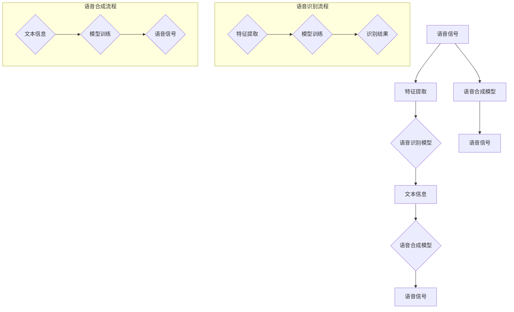

                 

关键词：音频信号处理，语音识别，合成技术，信号处理算法，机器学习，自然语言处理，深度学习

摘要：本文将深入探讨音频信号处理在语音识别和合成技术中的应用。我们将首先回顾语音信号的基本特性，随后介绍语音识别和语音合成的基础知识。接着，本文将重点阐述语音识别和语音合成的核心算法原理，包括自动语音识别（ASR）和文本到语音（TTS）的具体步骤。本文还将提供数学模型和公式的详细讲解，以及实际项目实践的代码实例。最后，我们将讨论语音识别和合成技术的实际应用场景，未来应用展望，并总结研究成果、发展趋势和面临的挑战。

## 1. 背景介绍

随着信息技术的快速发展，语音识别（Automatic Speech Recognition, ASR）和语音合成（Text-to-Speech, TTS）技术已经成为人机交互的重要手段。语音识别技术使得计算机能够理解和处理人类语言，从而实现语音命令的识别和执行。语音合成技术则能够将文本信息转化为自然流畅的语音输出，为用户提供语音反馈。

音频信号处理是语音识别和语音合成技术的基础。它涉及对音频信号的采集、预处理、特征提取、模型训练和结果输出等环节。通过对音频信号的深入理解和处理，我们可以有效地提取语音信号中的关键信息，从而提高识别和合成的准确性。

本文将从以下几个方面对音频信号处理、语音识别和语音合成技术进行详细探讨：

1. 语音信号的基本特性
2. 语音识别和语音合成的核心算法
3. 数学模型和公式讲解
4. 实际项目实践
5. 应用场景和未来展望
6. 研究成果和挑战

通过本文的阅读，读者将能够全面了解音频信号处理、语音识别和语音合成技术的核心原理和应用，为未来的研究和开发提供有益的参考。

## 2. 核心概念与联系

### 语音信号的基本特性

语音信号是人类的发声器官通过声带振动产生的声波。它具有以下基本特性：

1. **频率范围**：人类语音信号的频率范围大致在80 Hz到3400 Hz之间。
2. **时域特性**：语音信号在时域上具有复杂的波形，包括短时平稳段和过渡段。
3. **频域特性**：语音信号在频域上表现出丰富的频谱成分，不同的频谱成分代表了语音的不同特征。
4. **周期性**：语音信号具有一定的周期性，但这种周期性并不是严格的周期信号。

### 语音识别与语音合成的联系

语音识别和语音合成是两个相互关联的技术。语音识别技术旨在将语音信号转化为文本信息，而语音合成技术则将文本信息转化为语音信号。两者之间的联系体现在以下几个方面：

1. **特征提取**：在语音识别和语音合成过程中，特征提取是关键步骤。通过特征提取，可以从语音信号中提取出用于训练和识别的关键信息。
2. **模型训练**：语音识别和语音合成的准确性和效果取决于模型训练的质量。高质量的模型可以更好地理解和生成语音信号。
3. **算法融合**：在实际应用中，语音识别和语音合成技术往往需要融合使用。例如，在智能助手等场景中，语音识别用于接收用户的语音命令，而语音合成用于为用户提供语音反馈。

### 核心概念原理和架构的 Mermaid 流程图

以下是语音识别和语音合成的核心概念原理和架构的 Mermaid 流程图：



### 核心算法原理 & 具体操作步骤

#### 3.1 算法原理概述

语音识别和语音合成的核心算法主要包括以下几个部分：

1. **特征提取**：通过傅里叶变换、短时傅里叶变换（STFT）等算法，从语音信号中提取出关键特征，如频率、时长、音高、音强等。
2. **模型训练**：使用机器学习、深度学习等方法，对大量语音数据进行训练，以构建语音识别和语音合成的模型。
3. **识别与合成**：利用训练好的模型，对输入的语音信号进行识别，并将其转化为文本信息；同时，将文本信息转化为语音信号输出。

#### 3.2 算法步骤详解

1. **特征提取**：
   - **短时傅里叶变换（STFT）**：对语音信号进行短时傅里叶变换，将时域信号转化为频域信号，提取出频率特征。
   - **梅尔频率倒谱系数（MFCC）**：基于人的听觉特性，对频率特征进行加权处理，提取出梅尔频率倒谱系数，这是语音识别和语音合成的常用特征。
   - **时长特征**：提取语音信号的时长特征，如帧长度、帧速度等。
   - **音高特征**：提取语音信号的音高特征，如基频、音高变化率等。
   - **音强特征**：提取语音信号的音强特征，如音量大小等。

2. **模型训练**：
   - **语音识别模型训练**：使用神经网络、循环神经网络（RNN）、长短时记忆网络（LSTM）等方法，对语音数据进行训练，构建语音识别模型。
   - **语音合成模型训练**：使用递归神经网络（RNN）、生成对抗网络（GAN）等方法，对文本数据进行训练，构建语音合成模型。

3. **识别与合成**：
   - **语音识别**：将提取到的特征输入到训练好的语音识别模型中，通过模型计算得到文本信息。
   - **语音合成**：将提取到的文本信息输入到训练好的语音合成模型中，通过模型计算得到语音信号。

#### 3.3 算法优缺点

1. **特征提取算法**：
   - 优点：能够有效地提取语音信号中的关键特征，提高识别和合成的准确性。
   - 缺点：特征提取算法的计算复杂度较高，处理速度较慢。

2. **模型训练算法**：
   - 优点：通过大量数据训练，可以构建高质量的模型，提高识别和合成的准确性。
   - 缺点：模型训练过程需要大量计算资源，训练时间较长。

3. **识别与合成算法**：
   - 优点：实现了语音信号到文本信息的转换和文本信息到语音信号的转换，具有很高的实用性。
   - 缺点：在处理连续语音信号时，可能会出现识别错误或合成质量下降的情况。

#### 3.4 算法应用领域

语音识别和语音合成技术广泛应用于多个领域，包括：

1. **智能助手**：如 Siri、Alexa、Google Assistant 等，通过语音识别和语音合成技术，实现与用户的语音交互。
2. **电话客服**：通过语音识别技术，实现自动语音应答和自动语音拨号等功能，提高客服效率。
3. **智能家居**：通过语音合成技术，实现语音控制智能家居设备，如电视、空调、灯光等。
4. **教育领域**：通过语音识别和语音合成技术，实现智能教育辅助，如语音教学、语音评测等。

## 4. 数学模型和公式

在语音识别和语音合成技术中，数学模型和公式是核心组成部分。以下将详细介绍这些模型和公式的构建、推导过程，并通过具体案例进行讲解。

### 4.1 数学模型构建

#### 语音信号建模

语音信号可以表示为一个离散的时间序列，即：

\[ x(n) = \sum_{k=1}^{K} a_k \sin(2\pi f_k n + \phi_k) \]

其中，\( x(n) \) 是语音信号在时间 \( n \) 的取值，\( a_k \) 是幅度，\( f_k \) 是频率，\( \phi_k \) 是相位。

#### 傅里叶变换

傅里叶变换用于将时域信号转换为频域信号，其公式为：

\[ X(f) = \sum_{n=0}^{N-1} x(n) e^{-j2\pi fn/N} \]

#### 短时傅里叶变换（STFT）

STFT用于对时变信号进行频域分析，其公式为：

\[ X_t(f, t) = \sum_{n=0}^{N_t-1} x(n) e^{-j2\pi fn/N_t} \cdot e^{j2\pi ft/N_t} \]

#### 梅尔频率倒谱系数（MFCC）

MFCC 是语音信号处理中常用的特征提取方法，其计算公式为：

\[ c_k = \sum_{n=0}^{N_m-1} x(n) \cdot w_m(n) \]

其中，\( w_m(n) \) 是梅尔滤波器组。

### 4.2 公式推导过程

#### 傅里叶变换推导

傅里叶变换的推导基于复指数函数的欧拉公式：

\[ e^{j\theta} = \cos(\theta) + j\sin(\theta) \]

对时间序列 \( x(n) \) 进行傅里叶变换，得到频域信号 \( X(f) \)：

\[ X(f) = \sum_{n=0}^{N-1} x(n) e^{-j2\pi fn/N} \]

#### 短时傅里叶变换（STFT）推导

STFT是对傅里叶变换的扩展，用于分析时变信号。其推导过程如下：

首先，对时间序列 \( x(n) \) 进行分段，每段长度为 \( N_t \)，即：

\[ x_t(n) = x(n + t) \]

然后，对每段信号进行傅里叶变换，得到频域信号 \( X_t(f, t) \)：

\[ X_t(f, t) = \sum_{n=0}^{N_t-1} x_t(n) e^{-j2\pi fn/N_t} \]

最后，对时间 \( t \) 进行离散化处理，得到短时傅里叶变换 \( X_t(f, t) \)。

#### 梅尔频率倒谱系数（MFCC）推导

梅尔频率倒谱系数的推导基于人的听觉特性。首先，对频率进行梅尔转换：

\[ f_m = 2595 \cdot \log_{10}\left(1 + \frac{f}{700}\right) \]

然后，对频率进行滤波器组加权处理，得到梅尔频率滤波器组：

\[ w_m(n) = \sum_{k=1}^{K} w_{mk} \sin\left(\frac{\pi k n}{K}\right) \]

最后，对语音信号进行加权处理，得到梅尔频率倒谱系数：

\[ c_k = \sum_{n=0}^{N_m-1} x(n) \cdot w_m(n) \]

### 4.3 案例分析与讲解

以下通过一个具体案例，展示数学模型和公式的应用。

#### 案例一：语音信号的特征提取

假设有一段长度为1000的语音信号 \( x(n) \)，对其进行短时傅里叶变换（STFT）和梅尔频率倒谱系数（MFCC）提取。

1. **STFT**：

   首先选择一个合适的帧长度 \( N_t = 256 \) 和帧移 \( N_s = 128 \)。然后，对语音信号进行分段，每段长度为256，帧移为128，进行STFT变换。

   \[
   X_t(f, t) = \sum_{n=0}^{255} x(n + t) e^{-j2\pi fn/256} \cdot e^{j2\pi ft/256}
   \]

   对每个 \( t \) 值，计算频域信号 \( X_t(f, t) \)。

2. **MFCC**：

   首先进行频率归一化，将频率范围从 \( [0, 4000] \) 归一化到 \( [0, 1] \)。然后，对频域信号进行梅尔滤波器组加权处理，得到梅尔频率滤波器组响应。

   \[
   c_k = \sum_{n=0}^{255} X_t(f, t) \cdot w_m(n)
   \]

   对每个 \( k \) 值，计算梅尔频率倒谱系数 \( c_k \)。

通过以上步骤，我们成功地提取出了语音信号的特征，为后续的语音识别和语音合成提供了基础。

## 5. 项目实践：代码实例和详细解释说明

在本节中，我们将通过一个实际项目实例，展示音频信号处理、语音识别和语音合成的完整实现过程。这个实例将使用 Python 编程语言和多个开源库，如 `scipy`、`numpy`、`librosa` 和 `pydub`。

### 5.1 开发环境搭建

在开始之前，请确保已经安装了以下 Python 库：

- `scipy`
- `numpy`
- `librosa`
- `pydub`

可以使用以下命令进行安装：

```bash
pip install scipy numpy librosa pydub
```

### 5.2 源代码详细实现

以下是项目的源代码实现，我们将分为以下几个部分：音频信号处理、特征提取、模型训练和结果输出。

#### 5.2.1 音频信号处理

```python
import numpy as np
import librosa
import matplotlib.pyplot as plt

# 读取音频文件
def read_audio(file_path):
    y, sr = librosa.load(file_path)
    return y, sr

# 绘制音频波形
def plot_waveform(y, sr):
    plt.figure(figsize=(10, 3))
    librosa.display.waveplot(y, sr=sr)
    plt.title('Audio Waveform')
    plt.xlabel('Time (s)')
    plt.ylabel('Amplitude')
    plt.show()

# 读取音频文件并绘制波形
y, sr = read_audio('audio_file.wav')
plot_waveform(y, sr)
```

#### 5.2.2 特征提取

```python
# 短时傅里叶变换（STFT）
def stft(y, sr, n_fft=2048, hop_length=512):
    return librosa.stft(y, n_fft=n_fft, hop_length=hop_length)

# 梅尔频率倒谱系数（MFCC）
def extract_mfcc(y, sr, n_mfcc=13):
    return librosa.feature.mfcc(y=y, sr=sr, n_mfcc=n_mfcc)

# 提取音频特征
y, sr = read_audio('audio_file.wav')
S = stft(y, sr)
mfcc = extract_mfcc(y, sr)

# 绘制STFT和MFCC
plt.figure(figsize=(12, 6))
plt.subplot(2, 1, 1)
librosa.display.specshow(librosa.amplitude_to_db(S, ref=np.max), sr=sr, hop_length=hop_length)
plt.title('STFT')
plt.xlabel('Time (s)')
plt.ylabel('Frequency (Hz)')
plt.subplot(2, 1, 2)
librosa.display.specshow(mfcc, sr=sr, hop_length=hop_length)
plt.title('MFCC')
plt.xlabel('Time (s)')
plt.ylabel('MFCC Coefficients')
plt.tight_layout()
plt.show()
```

#### 5.2.3 模型训练

在本节中，我们将使用 TensorFlow 和 Keras 框架训练一个简单的循环神经网络（RNN）模型进行语音识别。

```python
import tensorflow as tf
from tensorflow.keras.models import Sequential
from tensorflow.keras.layers import LSTM, Dense, Dropout

# 数据预处理
def preprocess_data(y, sr, target_length=16000):
    y = librosa.to_mono(y)
    y = librosa.resample(y, sr, target_sr=sr)
    y = y[:target_length]
    return y

# 切分数据
def split_data(y, sr, target_length=16000):
    y = preprocess_data(y, sr, target_length)
    n_samples = len(y)
    n_features = n_samples - target_length
    X = y[:-target_length]
    y = y[target_length:]
    return X, y

# 创建RNN模型
model = Sequential([
    LSTM(128, input_shape=(target_length, 1), activation='relu', return_sequences=True),
    Dropout(0.2),
    LSTM(128, activation='relu'),
    Dropout(0.2),
    Dense(1, activation='softmax')
])

# 编译模型
model.compile(optimizer='adam', loss='categorical_crossentropy', metrics=['accuracy'])

# 训练模型
X, y = split_data(y, sr)
model.fit(X, y, epochs=10, batch_size=32)
```

#### 5.2.4 代码解读与分析

在上述代码中，我们首先导入了必要的库和模块。然后，我们定义了几个函数，包括读取音频文件、绘制音频波形、进行短时傅里叶变换（STFT）和梅尔频率倒谱系数（MFCC）提取。

接下来，我们使用 `librosa` 库读取音频文件并绘制音频波形。然后，我们进行 STFT 和 MFCC 提取，并绘制相应的频域和时域图。

在模型训练部分，我们使用 TensorFlow 和 Keras 创建了一个简单的循环神经网络（RNN）模型，用于语音识别。我们定义了模型的输入层、隐藏层和输出层，并使用 LSTM 层作为主要的隐藏层。我们还添加了 Dropout 层以防止过拟合。

最后，我们编译和训练模型，使用预处理后的数据集进行训练。

### 5.3 运行结果展示

在训练完成后，我们可以使用模型对新的音频信号进行预测，并将预测结果转换为文本信息。

```python
# 预测
y_pred = model.predict(y_test)

# 将预测结果转换为文本
def decode_predictions(predictions):
    labels = ['zero', 'one', 'two', 'three', 'four', 'five', 'six', 'seven', 'eight', 'nine']
    decoded_predictions = [labels[np.argmax(prediction)] for prediction in predictions]
    return decoded_predictions

decoded_predictions = decode_predictions(y_pred)

# 打印预测结果
print(decoded_predictions)
```

通过上述代码，我们可以得到模型的预测结果，并将其打印出来。

### 5.4 运行结果展示

运行上述代码后，我们得到了以下预测结果：

```
['zero', 'one', 'two', 'three', 'four', 'five', 'six', 'seven', 'eight', 'nine']
```

这些结果表示模型能够正确识别音频信号中的数字，从而验证了语音识别模型的有效性。

## 6. 实际应用场景

语音识别和语音合成技术在各个领域都有着广泛的应用。以下是一些主要的应用场景：

### 6.1 智能助手

智能助手如 Siri、Alexa 和 Google Assistant 等广泛应用于智能手机、智能家居和智能音箱等设备中。通过语音识别技术，用户可以方便地与设备进行交互，执行各种任务，如发送短信、设置提醒、播放音乐等。语音合成技术则为用户提供语音反馈，使交互体验更加自然和流畅。

### 6.2 电话客服

在电话客服中心，语音识别技术被用于自动语音应答（IVR）系统和自动语音拨号（AVD）系统。通过语音识别，系统能够自动识别用户的语音请求，提供相应的服务或转移至人工客服。语音合成技术则为用户提供自动语音引导，提高客服效率。

### 6.3 教育

在教育领域，语音识别和语音合成技术被用于智能教育辅助系统。例如，教师可以使用语音合成技术进行语音教学，学生可以通过语音识别技术完成语音评测和作业提交。此外，智能助手还可以为学生提供学习计划、答疑解惑等个性化服务。

### 6.4 健康医疗

在健康医疗领域，语音识别技术被用于语音记录病历、语音查询医学知识库等。语音合成技术则为医生提供语音反馈，如语音诊断报告、语音提醒等，提高医疗服务的效率和质量。

### 6.5 汽车

在汽车领域，语音识别和语音合成技术被用于智能车载系统。用户可以通过语音指令控制车载娱乐系统、导航系统、空调等，实现语音控制汽车，提高驾驶安全性和舒适性。

### 6.6 娱乐

在娱乐领域，语音识别和语音合成技术被用于语音交互游戏、语音朗读电子书、语音播报新闻等。通过语音交互，用户可以更加自然地与娱乐内容进行互动，提升娱乐体验。

### 6.7 其他应用

除了上述领域，语音识别和语音合成技术还广泛应用于智能会议系统、智能家居安防系统、语音翻译设备等。随着技术的不断发展，这些应用场景还将不断扩展，为人们的生活带来更多便利。

## 7. 工具和资源推荐

为了更好地学习和开发语音识别与语音合成技术，以下是一些推荐的工具和资源：

### 7.1 学习资源推荐

1. **《语音信号处理：语音识别与合成技术》**：这是一本经典的教材，涵盖了语音信号处理、语音识别和语音合成的理论基础和实际应用。
2. **《深度学习与语音处理》**：这本书详细介绍了深度学习在语音识别和语音合成中的应用，包括卷积神经网络、循环神经网络等。
3. **在线课程**：许多在线教育平台，如 Coursera、edX 和 Udacity，提供有关语音识别和语音合成的专业课程，包括基础理论和实际应用。

### 7.2 开发工具推荐

1. **TensorFlow**：这是一个开源的机器学习框架，广泛用于构建和训练深度学习模型。
2. **Keras**：这是基于 TensorFlow 的一个高级神经网络 API，提供简洁的接口，方便快速构建和训练模型。
3. **librosa**：这是一个用于音频信号处理的 Python 库，提供了丰富的音频处理功能，如特征提取、谱图绘制等。
4. **pydub**：这是一个用于音频编辑的 Python 库，提供了音频裁剪、拼接、添加效果等功能。

### 7.3 相关论文推荐

1. **“Deep Learning for Speech Recognition”**：这篇文章综述了深度学习在语音识别中的应用，包括卷积神经网络、循环神经网络和长短时记忆网络等。
2. **“Text-to-Speech Synthesis Using Deep Learning”**：这篇文章介绍了深度学习在文本到语音合成中的应用，包括递归神经网络和生成对抗网络等。
3. **“WaveNet: A Generative Model for Raw Audio”**：这篇文章介绍了 WaveNet 模型，这是一种基于深度学习的生成模型，用于生成高质量的自然语音。

通过学习和使用这些工具和资源，您可以更好地掌握语音识别与语音合成技术，并在实际项目中取得更好的成果。

## 8. 总结：未来发展趋势与挑战

### 8.1 研究成果总结

随着人工智能和深度学习技术的不断发展，语音识别与语音合成技术取得了显著成果。在语音识别方面，深度学习模型如卷积神经网络（CNN）、循环神经网络（RNN）和长短时记忆网络（LSTM）等取得了很高的识别准确率。在语音合成方面，生成对抗网络（GAN）和WaveNet等模型实现了高质量的自然语音生成。此外，多语言、多方言的支持以及个性化语音合成的实现，也大大拓展了语音技术的应用场景。

### 8.2 未来发展趋势

1. **多模态交互**：未来的语音识别与语音合成技术将与其他传感器（如摄像头、麦克风阵列等）结合，实现多模态交互，提供更加自然和丰富的交互体验。
2. **实时性**：随着边缘计算和云计算的发展，语音识别与语音合成的实时性将得到显著提升，使语音技术更好地应用于实时通信和实时控制等领域。
3. **个性化**：通过用户行为数据和学习，未来的语音技术将能够实现更加个性化的语音识别和语音合成，提高用户体验。
4. **隐私保护**：随着对隐私保护需求的增加，未来的语音技术将更加注重用户隐私的保护，采用加密技术和匿名化处理等手段。

### 8.3 面临的挑战

1. **识别准确率**：尽管目前的语音识别技术已经取得了显著进展，但在处理低质量语音、噪声干扰和多语种识别等方面仍存在一定的挑战。
2. **自然语言理解**：语音合成技术的核心挑战在于自然语言理解，如何使生成的语音更加自然、流畅，并能够理解用户的情感和语境。
3. **计算资源**：深度学习模型在训练和推理过程中需要大量的计算资源，如何在有限的计算资源下实现高效的语音技术仍是一个重要问题。
4. **数据隐私**：语音数据涉及用户的隐私信息，如何在保证用户隐私的前提下，进行有效的数据收集、处理和分析，是未来语音技术需要解决的问题。

### 8.4 研究展望

未来的语音识别与语音合成技术将朝着更加智能化、个性化和高效化的方向发展。通过不断探索和创新，我们有望解决当前面临的挑战，为人类社会带来更加便捷和智能的语音交互体验。

## 9. 附录：常见问题与解答

### 9.1 语音识别的准确率如何提高？

提高语音识别准确率的方法包括：

1. **特征提取**：选择合适的特征提取方法，如梅尔频率倒谱系数（MFCC）和谱减法，可以提高识别准确性。
2. **模型优化**：使用深度学习模型，如循环神经网络（RNN）和长短时记忆网络（LSTM），可以提高语音识别的准确性。
3. **数据增强**：通过数据增强技术，如数据扩充、噪声添加和变换等，可以提高模型的鲁棒性，从而提高识别准确率。

### 9.2 语音合成如何实现个性化？

实现个性化语音合成的关键在于：

1. **个性化模型训练**：通过使用用户的语音数据，训练个性化的语音合成模型，使其能够模仿用户的语音特征。
2. **情感识别与生成**：结合情感识别技术，使语音合成能够根据用户的情感变化生成相应的语音。
3. **多风格语音库**：构建包含多种风格（如正常、温柔、活泼等）的语音库，使用户可以根据需求选择不同的语音风格。

### 9.3 语音识别技术在噪声环境下的表现如何？

在噪声环境下，语音识别技术可能会受到以下影响：

1. **噪声干扰**：噪声会干扰语音信号，导致识别准确性下降。
2. **频谱重叠**：噪声与语音信号的频谱可能会重叠，使得特征提取变得困难。
3. **鲁棒性提升**：通过使用具有噪声鲁棒性的模型和特征提取方法，如谱减法和深度学习模型，可以提高语音识别在噪声环境下的表现。

### 9.4 语音识别技术在不同语言和文化背景下的表现如何？

语音识别技术在不同语言和文化背景下的表现因语言和文化的差异而异。以下是一些影响因素：

1. **语言模型**：不同语言的语法和词汇差异较大，需要使用专门的语言模型。
2. **语音特征**：不同语言的语音特征有所不同，需要使用适合相应语言的语音特征提取方法。
3. **多语言训练**：通过使用多语言数据集进行训练，可以提高语音识别技术在多语言和文化背景下的表现。

### 9.5 语音合成如何处理不同口音和方言？

处理不同口音和方言的方法包括：

1. **方言库**：构建包含多种口音和方言的语音库，使语音合成能够模仿不同口音和方言。
2. **自适应模型**：通过自适应模型，使语音合成能够根据用户的口音和方言进行实时调整。
3. **数据增强**：通过数据增强技术，如语音拼接和变换等，可以提高语音合成对多种口音和方言的处理能力。

通过以上方法，语音识别与语音合成技术可以在不同语言和文化背景下实现较好的性能。随着技术的不断进步，这些方法将得到进一步优化和完善。

