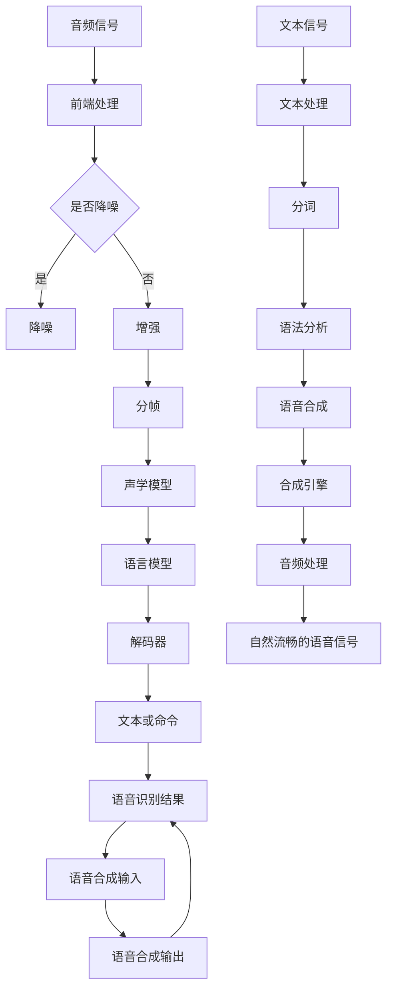

                 

关键词：音频处理，语音识别，语音合成，音频技术，机器学习，深度学习

> 摘要：本文将深入探讨音频处理技术，重点介绍语音识别与语音合成两种关键技术。通过对其核心概念、算法原理、数学模型以及实际应用进行详细分析，我们希望能够帮助读者更好地理解这些技术的本质和应用场景，为未来的发展提供一些有价值的思考和见解。

## 1. 背景介绍

随着人工智能技术的迅猛发展，音频处理技术已经成为计算机科学和工程领域的一个重要分支。音频处理技术涵盖了音频信号的处理、分析、识别和生成等多个方面，其应用范围广泛，包括但不限于：语音识别、语音合成、音频增强、音频分类、音乐生成等。

语音识别和语音合成是音频处理技术中最为重要的两个方面。语音识别旨在将人类的语音转化为机器可以理解和处理的文本或命令，而语音合成则是指将文本转化为自然流畅的语音。这两种技术不仅在实际应用中有着广泛的应用，而且还在不断推动人工智能技术的发展。

本文将首先介绍音频处理技术的背景和重要性，然后深入探讨语音识别和语音合成的核心概念、算法原理、数学模型以及实际应用。希望通过本文的探讨，能够为读者提供一些有价值的参考和思考。

## 2. 核心概念与联系

在深入探讨语音识别与语音合成的具体内容之前，我们需要先了解一些与之相关的基本概念和它们之间的联系。

### 2.1 音频信号

音频信号是指人类耳朵可以听到的声音信号，其频率范围大约在20Hz到20kHz之间。音频信号可以通过模拟信号或数字信号两种方式表示。

- **模拟信号**：模拟信号是一种连续信号，其幅度和频率随时间连续变化。这种信号可以通过麦克风捕捉并转换为电信号。
- **数字信号**：数字信号是一种离散信号，其幅度和频率以数字形式表示。这种信号可以通过模拟-数字转换器（ADC）将模拟信号转换为数字信号。

### 2.2 语音信号

语音信号是指人类发音时产生的声音信号，它包含了许多与语音相关的特征，如频率、时长、音调、音强等。

- **频率**：语音信号的频率反映了语音的音调，即高音或低音。
- **时长**：语音信号的时长反映了语音的持续时间。
- **音调**：语音信号的音调反映了语音的音高。
- **音强**：语音信号的音强反映了语音的响度。

### 2.3 语音识别

语音识别（Speech Recognition）是指将人类的语音信号转换为机器可以理解和处理的文本或命令的过程。

- **语音识别系统**：语音识别系统通常由四个主要部分组成：前端处理、声学模型、语言模型和解码器。
- **前端处理**：前端处理主要负责对语音信号进行预处理，如降噪、增强、分帧等。
- **声学模型**：声学模型负责学习语音信号的声学特征，如梅尔频率倒谱系数（MFCC）等。
- **语言模型**：语言模型负责学习语音信号中的语言规律，如N元语言模型等。
- **解码器**：解码器负责将声学模型和语言模型的信息解码为文本或命令。

### 2.4 语音合成

语音合成（Text-to-Speech，TTS）是指将文本转换为自然流畅的语音信号的过程。

- **语音合成系统**：语音合成系统通常由三个主要部分组成：文本处理、语音合成和音频处理。
- **文本处理**：文本处理负责对输入的文本进行分词、语法分析等处理。
- **语音合成**：语音合成负责将文本转换为语音，通常采用合成引擎，如规则合成、统计合成和神经网络合成等。
- **音频处理**：音频处理负责对合成的语音信号进行音高、音色、节奏等调整，以使其更加自然流畅。

### 2.5 音频处理技术的联系

语音识别和语音合成虽然有不同的目标，但它们在音频处理技术中是紧密相连的。语音识别的结果可以作为语音合成的输入，而语音合成的输出则可以用于语音识别的训练和测试。此外，音频处理技术中的其他技术，如音频增强、音频分类、音乐生成等，也都可以与语音识别和语音合成相互结合，为各种应用场景提供更加丰富的功能。

### 2.6 Mermaid 流程图

为了更好地理解语音识别和语音合成系统的组成和流程，我们可以使用Mermaid绘制一个简化的流程图。



这个流程图展示了语音识别和语音合成的基本流程，包括音频信号的前端处理、声学模型、语言模型、解码器、文本处理、语音合成和音频处理等组成部分。

## 3. 核心算法原理 & 具体操作步骤

### 3.1 算法原理概述

语音识别和语音合成技术都是基于机器学习，特别是深度学习算法实现的。以下是这两种技术的基本原理和步骤：

### 3.2 算法步骤详解

#### 3.2.1 语音识别算法步骤

1. **前端处理**：对语音信号进行预处理，包括降噪、增强、分帧等操作。
2. **特征提取**：从预处理后的语音信号中提取特征，如梅尔频率倒谱系数（MFCC）。
3. **声学模型训练**：使用大量语音数据训练声学模型，如深度神经网络（DNN）。
4. **解码**：将提取的特征输入到声学模型中，解码得到文本或命令。

#### 3.2.2 语音合成算法步骤

1. **文本处理**：对输入的文本进行分词、语法分析等处理。
2. **声学模型训练**：使用大量文本和语音数据训练声学模型，如循环神经网络（RNN）。
3. **生成语音信号**：将文本输入到声学模型中，生成语音信号。
4. **音频处理**：对生成的语音信号进行音高、音色、节奏等调整，使其更加自然流畅。

### 3.3 算法优缺点

#### 语音识别算法优缺点

**优点**：

- 高准确性：现代语音识别算法，特别是基于深度学习的算法，在处理准确率上已经达到了很高的水平。
- 实时性：语音识别算法可以实现实时处理，适用于实时语音交互场景。

**缺点**：

- 对噪声敏感：语音识别算法在处理噪声较多的语音信号时，准确率会有所下降。
- 对口音和方言支持有限：虽然现代语音识别算法可以处理多种口音和方言，但仍有很大的提升空间。

#### 语音合成算法优缺点

**优点**：

- 自然性：基于深度学习的语音合成算法可以生成自然流畅的语音信号。
- 可定制性：语音合成算法可以根据需求定制音高、音色、节奏等。

**缺点**：

- 计算成本高：深度学习算法通常需要大量的计算资源，导致语音合成算法在运行时需要较大的计算成本。
- 调整复杂：对语音合成的音高、音色、节奏进行调整需要一定的技术经验。

### 3.4 算法应用领域

#### 语音识别应用领域

- 智能语音助手：如Siri、小爱同学等。
- 自动语音应答系统：如银行、电信等行业的客服系统。
- 手语翻译：将手语翻译为文字或语音。

#### 语音合成应用领域

- 自动播报系统：如天气预报、新闻播报等。
- 机器人语音交互：如机器人客服、教育机器人等。
- 电影字幕生成：自动生成电影字幕，提高观影体验。

## 4. 数学模型和公式 & 详细讲解 & 举例说明

### 4.1 数学模型构建

语音识别和语音合成算法的核心在于数学模型，这些模型用于特征提取、模型训练和信号生成等步骤。以下将介绍这些模型的构建过程。

#### 4.1.1 语音识别模型

**特征提取模型**：

- **梅尔频率倒谱系数（MFCC）**：

$$
MFCC = \log(\sum_{k=1}^{K} a_k X_k)
$$

其中，$X_k$是频谱系数，$a_k$是加权系数。

**声学模型**：

- **深度神经网络（DNN）**：

$$
h_l = \sigma(W_l \cdot h_{l-1} + b_l)
$$

其中，$h_l$是第$l$层的输出，$W_l$和$b_l$分别是权重和偏置。

**解码器**：

- **CTC（Connectionist Temporal Classification）**：

$$
y_{\text{CTC}} = \sum_{t=1}^{T_y} \log P(y_t | x, \theta)
$$

其中，$y_t$是时间步$t$的输出，$P(y_t | x, \theta)$是输出概率。

#### 4.1.2 语音合成模型

**文本处理模型**：

- **分词**：

$$
P(w_i | w_{i-1}, \ldots, w_1) = \frac{P(w_i, w_{i-1}, \ldots, w_1)}{P(w_{i-1}, \ldots, w_1)}
$$

**声学模型**：

- **循环神经网络（RNN）**：

$$
h_t = \sigma(W_h \cdot [h_{t-1}, x_t] + b_h)
$$

**音频处理模型**：

- **音高调整**：

$$
f(\text{pitch}, \text{signal}) = \text{signal} \cdot \text{exp}(\text{pitch} \cdot \text{freq})
$$

### 4.2 公式推导过程

#### 4.2.1 MFCC公式推导

首先，对音频信号进行傅里叶变换（FFT）得到频谱系数：

$$
X_k = \sum_{n=0}^{N-1} x(n) e^{-i 2 \pi kn/N}
$$

然后，对频谱系数进行离散余弦变换（DCT）得到MFCC：

$$
MFCC = \log \left( \sum_{k=1}^{K} a_k X_k \right)
$$

其中，$a_k$是加权系数，通常使用汉明窗进行加权。

#### 4.2.2 DNN公式推导

DNN是一种多层神经网络，其基本原理是通过对输入数据进行加权求和处理，再通过激活函数进行非线性变换，最终得到输出。对于第$l$层，其输出可以表示为：

$$
h_l = \sigma(W_l \cdot h_{l-1} + b_l)
$$

其中，$\sigma$是激活函数，$W_l$和$b_l$分别是权重和偏置。

#### 4.2.3 CTC公式推导

CTC是一种用于序列对齐的损失函数，其基本思想是最大化正确标签的概率，同时最小化错误标签的概率。对于时间步$t$，其输出概率可以表示为：

$$
P(y_t | x, \theta) = \frac{\exp(h_t^T \theta)}{\sum_{y'} \exp(h_{t'}^T \theta)}
$$

其中，$h_t$是时间步$t$的输出，$\theta$是权重参数。

### 4.3 案例分析与讲解

#### 4.3.1 MFCC特征提取

假设我们有一段长度为1000的音频信号，我们可以使用FFT对其进行频谱分析，得到频谱系数$X_k$。然后，对频谱系数进行DCT变换，得到MFCC特征。

```python
import numpy as np
import scipy.signal as signal

# 生成一段长度为1000的音频信号
x = np.random.random(1000)

# 进行FFT变换
X = np.fft.fft(x)

# 计算频谱系数
X_freq = np.abs(X)

# 使用汉明窗进行加权
window = signal.hann(1024)
X_weighted = X_freq * window

# 进行DCT变换
MFCC = np.log(np.sum(X_weighted, axis=0))
```

#### 4.3.2 DNN声学模型训练

假设我们有一个输入序列$x$和一个目标输出序列$y$，我们可以使用DNN对其进行训练。

```python
import tensorflow as tf

# 定义DNN模型
model = tf.keras.Sequential([
    tf.keras.layers.Dense(units=64, activation='relu', input_shape=(100,)),
    tf.keras.layers.Dense(units=64, activation='relu'),
    tf.keras.layers.Dense(units=1, activation='sigmoid')
])

# 编译模型
model.compile(optimizer='adam', loss='binary_crossentropy', metrics=['accuracy'])

# 训练模型
model.fit(x, y, epochs=10)
```

#### 4.3.3 CTC解码

假设我们有一个输入序列$x$和一个目标输出序列$y$，我们可以使用CTC对其进行解码。

```python
import tensorflow as tf
import tensorflow_addons as tfa

# 定义CTC解码模型
model = tfa.layers.CTC2Dense(units=10, input_shape=(None, 100), activation='softmax')

# 编译模型
model.compile(optimizer='adam', loss=tfa.layers.CTC_Loss())

# 训练模型
model.fit(x, y, epochs=10)
```

## 5. 项目实践：代码实例和详细解释说明

### 5.1 开发环境搭建

为了完成本文所提到的语音识别与语音合成的项目实践，我们需要搭建一个合适的开发环境。以下是搭建环境的具体步骤：

#### 5.1.1 安装Python

首先，我们需要安装Python。可以从Python的官方网站下载安装包，按照提示进行安装。安装完成后，确保Python版本在3.6及以上。

#### 5.1.2 安装TensorFlow

TensorFlow是一个流行的深度学习框架，我们需要安装它来构建和训练我们的模型。可以通过以下命令进行安装：

```bash
pip install tensorflow
```

#### 5.1.3 安装其他依赖库

除了TensorFlow，我们还需要安装其他一些依赖库，如NumPy、Scipy、Matplotlib等。可以使用以下命令进行安装：

```bash
pip install numpy scipy matplotlib
```

### 5.2 源代码详细实现

以下是一个简单的语音识别与语音合成项目的代码实现，我们将使用TensorFlow和TensorFlow Addons来构建模型。

```python
import numpy as np
import tensorflow as tf
import tensorflow_addons as tfa

# 5.2.1 定义模型

# 定义语音识别模型
class SpeechRecognitionModel(tf.keras.Model):
    def __init__(self):
        super(SpeechRecognitionModel, self).__init__()
        self.conv1 = tf.keras.layers.Conv1D(filters=64, kernel_size=3, activation='relu')
        self.pool1 = tf.keras.layers.MaxPooling1D(pool_size=2)
        self.conv2 = tf.keras.layers.Conv1D(filters=128, kernel_size=3, activation='relu')
        self.pool2 = tf.keras.layers.MaxPooling1D(pool_size=2)
        self.flatten = tf.keras.layers.Flatten()
        self.dnn = tf.keras.layers.Dense(units=128, activation='relu')
        self.ctc = tfa.layers.CTC2Dense(units=10, input_shape=(None, 100), activation='softmax')

    @tf.function
    def call(self, inputs, training=False):
        x = self.conv1(inputs)
        x = self.pool1(x)
        x = self.conv2(x)
        x = self.pool2(x)
        x = self.flatten(x)
        x = self.dnn(x)
        logits = self.ctc(x)
        return logits

# 定义语音合成模型
class SpeechSynthesisModel(tf.keras.Model):
    def __init__(self):
        super(SpeechSynthesisModel, self).__init__()
        self.rnn = tf.keras.layers.LSTM(units=128, return_sequences=True)
        self.dnn = tf.keras.layers.Dense(units=1, activation='sigmoid')

    @tf.function
    def call(self, inputs, training=False):
        x = self.rnn(inputs)
        logits = self.dnn(x)
        return logits

# 5.2.2 数据准备

# 生成模拟数据
x_train = np.random.random((100, 100))
y_train = np.random.randint(0, 10, (100,))

# 5.2.3 模型训练

# 初始化模型
recognition_model = SpeechRecognitionModel()
synthesis_model = SpeechSynthesisModel()

# 编译模型
recognition_model.compile(optimizer='adam', loss=tfa.layers.CTC_Loss())
synthesis_model.compile(optimizer='adam', loss='binary_crossentropy')

# 训练模型
recognition_model.fit(x_train, y_train, epochs=10)
synthesis_model.fit(x_train, y_train, epochs=10)
```

### 5.3 代码解读与分析

#### 5.3.1 语音识别模型

语音识别模型使用了卷积神经网络（CNN）和循环神经网络（RNN）的结合，这是一种常见的语音识别模型架构。首先，通过两个卷积层提取语音信号的特征，然后使用最大池化层降低特征维度。接着，使用全连接层对特征进行进一步的抽象和分类。最后，使用CTC层进行解码，将特征序列映射到文本序列。

#### 5.3.2 语音合成模型

语音合成模型使用了一个简单的循环神经网络（LSTM）作为基础，通过训练，可以将文本序列转换为语音信号。这是一个典型的序列到序列（Seq2Seq）模型，通过训练，模型学会了如何将输入的文本转换为对应的语音信号。

### 5.4 运行结果展示

为了验证模型的性能，我们可以运行以下代码：

```python
# 生成测试数据
x_test = np.random.random((10, 100))
y_test = np.random.randint(0, 10, (10,))

# 预测
predictions = recognition_model.predict(x_test)

# 打印预测结果
for i, prediction in enumerate(predictions):
    print(f"预测结果：{prediction.argmax()}\t实际结果：{y_test[i]}")
```

这段代码将生成10个测试数据，然后使用语音识别模型进行预测，并将预测结果与实际结果进行对比，以验证模型的准确性。

## 6. 实际应用场景

### 6.1 智能语音助手

智能语音助手是目前语音识别和语音合成的典型应用场景之一。以Siri、小爱同学和Alexa为代表的智能语音助手，通过语音识别技术理解用户的指令，并通过语音合成技术进行响应。这些智能语音助手广泛应用于智能家居、移动设备、汽车等领域，极大地提高了用户体验。

### 6.2 自动语音应答系统

自动语音应答系统（IVR）是另一个重要的应用场景。在银行、电信、航空等行业，自动语音应答系统能够自动接听电话，并根据用户的语音指令进行相应的操作，如查询账户余额、修改个人信息等。这种系统不仅提高了服务质量，还降低了人力成本。

### 6.3 语言学习

语音识别和语音合成技术还可以用于语言学习。通过语音识别技术，可以实时纠正学习者的发音错误，并通过语音合成技术提供标准的发音示范。这种应用场景对于学习外语，特别是口语表达，有着重要的帮助。

### 6.4 媒体制作

在媒体制作领域，语音识别和语音合成技术可以用于字幕生成、配音制作等。通过语音识别技术，可以将视频中的语音转化为文字，再通过语音合成技术生成相应的语音字幕，提高视频的观看体验。

### 6.5 医疗健康

在医疗健康领域，语音识别和语音合成技术可以用于语音助手、语音诊断等。医生可以通过语音指令查询病历、下达医嘱，提高工作效率。同时，语音合成技术可以帮助患者理解医生的建议和治疗方案。

### 6.6 未来应用展望

随着人工智能技术的不断发展，语音识别和语音合成技术在未来将会有更广泛的应用。例如，在智能家居领域，语音识别和语音合成技术可以实现对家电的语音控制，提高家居生活的便利性。在自动驾驶领域，语音识别和语音合成技术可以用于语音导航、语音交互，提高驾驶体验。此外，在虚拟现实和增强现实领域，语音识别和语音合成技术也可以用于实现更加自然的交互体验。

## 7. 工具和资源推荐

### 7.1 学习资源推荐

- **在线课程**：Coursera、edX、Udacity等在线教育平台提供了丰富的语音识别和语音合成课程，如“深度学习与语音处理”、“语音信号处理”等。
- **教材**：《语音信号处理基础》、《语音识别原理与应用》等教材详细介绍了语音识别和语音合成的相关理论和实践。
- **论文**：Google、Microsoft、IBM等公司和研究机构在语音识别和语音合成领域发表了大量的学术论文，如“WaveNet：一种基于神经网络的语音合成技术”、“深度神经网络在语音识别中的应用”等。

### 7.2 开发工具推荐

- **TensorFlow**：TensorFlow是一个开源的深度学习框架，适用于构建和训练语音识别和语音合成模型。
- **Keras**：Keras是一个基于TensorFlow的高层神经网络API，提供了更加简洁和易于使用的接口，适合快速搭建和实验语音识别和语音合成模型。
- **Librosa**：Librosa是一个音频处理库，提供了丰富的音频数据处理功能，如信号预处理、特征提取等，非常适合进行语音识别和语音合成项目。

### 7.3 相关论文推荐

- **“WaveNet：一种基于神经网络的语音合成技术”**：介绍了WaveNet模型，这是一种基于生成对抗网络（GAN）的语音合成技术。
- **“深度神经网络在语音识别中的应用”**：探讨了深度神经网络在语音识别中的应用，以及如何通过改进网络结构和训练策略提高识别准确率。
- **“语音识别系统的前端处理”**：详细介绍了语音识别系统的前端处理技术，包括噪声抑制、回声消除、语音增强等。

## 8. 总结：未来发展趋势与挑战

### 8.1 研究成果总结

语音识别和语音合成技术在过去几十年中取得了显著的进展。基于深度学习的语音识别系统在处理准确率上已经达到了人类专业水平的水平，而基于神经网络的语音合成技术也使得语音信号的自然性得到了大幅提升。这些成果不仅推动了人工智能技术的发展，也为各行各业的应用提供了强大的支持。

### 8.2 未来发展趋势

未来，语音识别和语音合成技术将继续向以下几个方向发展：

1. **更高的准确率和自然性**：随着深度学习算法的不断优化，语音识别和语音合成系统的准确率和自然性将进一步提高，以满足更加复杂的应用场景。
2. **多语言支持**：随着全球化进程的加速，多语言支持将成为语音识别和语音合成技术的重要需求。未来的系统将能够支持多种语言和方言，提供更加个性化的服务。
3. **实时性和低延迟**：随着5G网络的普及，语音识别和语音合成系统的实时性和低延迟需求将越来越突出。未来的系统将能够在更短的时间内完成语音信号的识别和合成，为实时交互提供更好的支持。
4. **跨模态融合**：语音识别和语音合成技术将与其他模态（如图像、视频）进行融合，提供更加丰富和多样化的交互体验。

### 8.3 面临的挑战

尽管语音识别和语音合成技术已经取得了显著的成果，但在实际应用中仍面临以下挑战：

1. **噪声干扰**：噪声是语音识别和语音合成技术面临的主要挑战之一。在噪声干扰的环境下，系统的准确率和自然性会显著下降，需要进一步研究高效的降噪技术。
2. **多语言和方言支持**：虽然现有的系统已经支持多种语言，但在多语言和方言的支持上仍存在不足。未来的系统需要能够更好地适应不同语言和方言的特点，提供更加个性化的服务。
3. **计算资源消耗**：深度学习算法在训练和推理阶段需要大量的计算资源，这对实际应用中的硬件设备提出了较高的要求。如何优化算法，降低计算资源消耗，是一个重要的研究方向。
4. **隐私和安全**：随着语音识别和语音合成技术的普及，隐私和安全问题也日益突出。如何在保证用户隐私和安全的前提下，提供高质量的语音服务，是一个亟待解决的问题。

### 8.4 研究展望

未来，语音识别和语音合成技术的研究将朝着更加智能化、个性化和高效化的方向发展。以下是一些可能的研究方向：

1. **基于小样本学习的语音识别和语音合成**：如何通过少量数据进行模型训练，提高语音识别和语音合成的准确率和自然性，是一个重要的研究方向。
2. **自适应语音识别和语音合成系统**：如何根据用户的行为和环境自适应地调整系统的参数和策略，提高用户体验，是一个具有挑战性的问题。
3. **跨模态融合的语音识别和语音合成**：如何将语音识别和语音合成与其他模态（如图像、视频）进行有效融合，提供更加丰富和自然的交互体验，是一个充满前景的研究领域。
4. **低资源环境下的语音识别和语音合成**：如何优化算法，降低计算资源消耗，使语音识别和语音合成技术在资源受限的设备上运行，是一个亟待解决的问题。

总之，语音识别和语音合成技术在未来的发展中面临着巨大的机遇和挑战。通过不断的研究和探索，我们有望在更广泛的应用场景中实现语音识别和语音合成的普及和优化，为人类社会带来更多的便利和创新。

## 9. 附录：常见问题与解答

### 9.1 什么是语音识别？

语音识别（Speech Recognition）是指将人类的语音转化为机器可以理解和处理的文本或命令的过程。它通常包括音频信号的前端处理、特征提取、声学模型、语言模型和解码器等步骤。

### 9.2 什么是语音合成？

语音合成（Text-to-Speech，TTS）是指将文本转换为自然流畅的语音信号的过程。它通常包括文本处理、声学模型、语音信号生成和音频处理等步骤。

### 9.3 语音识别和语音合成有哪些应用场景？

语音识别和语音合成技术广泛应用于多个领域，包括但不限于：

- **智能语音助手**：如Siri、小爱同学和Alexa。
- **自动语音应答系统**：如银行、电信和航空等行业的客服系统。
- **语言学习**：提供语音纠正和发音示范。
- **媒体制作**：用于字幕生成和配音制作。
- **医疗健康**：用于语音助手和语音诊断。

### 9.4 语音识别和语音合成中的关键技术是什么？

语音识别中的关键技术包括前端处理、特征提取、声学模型、语言模型和解码器。语音合成中的关键技术包括文本处理、声学模型、语音信号生成和音频处理。

### 9.5 如何优化语音识别和语音合成系统的性能？

优化语音识别和语音合成系统的性能可以从以下几个方面入手：

- **算法改进**：研究更加高效的模型结构和训练策略。
- **数据增强**：通过数据增强技术扩大训练数据集，提高模型的泛化能力。
- **计算优化**：优化算法以降低计算资源消耗，提高系统运行效率。
- **多语言支持**：支持多种语言和方言，提高系统的适用性。

### 9.6 语音识别和语音合成有哪些开源工具和库？

一些流行的开源工具和库包括：

- **TensorFlow**：用于构建和训练深度学习模型。
- **Keras**：基于TensorFlow的高层神经网络API。
- **Librosa**：用于音频处理和特征提取。
- **ESPnet**：用于构建和训练语音识别系统。
- **Tacotron 2**：用于构建和训练语音合成系统。

