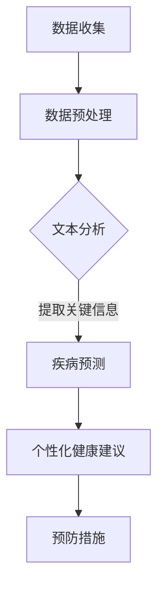

                 

### 1. 背景介绍

随着全球人口老龄化趋势的加剧，医疗保健系统正面临着前所未有的挑战。传统的健康管理模式主要集中在疾病的诊断和治疗上，往往是在患者出现明显症状后才采取行动。然而，现代医疗保健的发展趋势正逐渐转向预防性护理，即通过早期预测和预防健康风险，减少疾病的发生率。

近年来，人工智能（AI）技术的发展，尤其是深度学习（Deep Learning）和自然语言处理（Natural Language Processing，NLP）的进步，为预防性护理带来了全新的可能性。大型语言模型（Large Language Models，LLM）作为一种先进的AI模型，已经在多个领域展现出了其强大的预测和数据分析能力。LLM 通过对海量数据的学习，能够捕捉到数据之间的复杂关系，从而进行有效的健康风险评估。

本文将探讨如何利用LLM 分析和预测健康风险，并提出一种预防性护理的新方法。通过分析LLM 的基本原理、数学模型、算法实现以及实际应用，我们将展示LLM 在健康风险预测中的潜力和挑战。

### 2. 核心概念与联系

#### 2.1 LLM 基本概念

大型语言模型（LLM）是一种能够处理和生成自然语言文本的深度学习模型。LLM 通常基于Transformer架构，该架构在处理长文本序列时表现出色。Transformer模型通过自注意力机制（Self-Attention Mechanism）能够捕捉到文本中的长距离依赖关系，这使得LLM 能够生成连贯、准确的文本。

#### 2.2 健康风险预测的基本概念

健康风险预测是指利用历史健康数据、生物标志物、生活习惯等信息，对个体未来的健康状况进行预测。健康风险预测的目标是识别高风险人群，从而采取预防措施，减少疾病的发生。

#### 2.3 LLM 在健康风险预测中的应用

LLM 在健康风险预测中的应用主要包括以下几个方面：

1. **文本数据分析**：利用LLM 对医疗记录、病历、文献等进行文本分析，提取关键信息，用于健康风险评估。
2. **疾病预测**：通过分析患者的病历数据，LLM 可以预测患者未来可能患有的疾病，从而提前采取预防措施。
3. **个性化健康建议**：LLM 可以根据个体的健康数据和生活方式，提供个性化的健康建议，降低疾病风险。

#### 2.4 Mermaid 流程图

下面是一个简单的 Mermaid 流程图，展示了 LLM 在健康风险预测中的基本流程：



在这个流程图中，数据收集和预处理是基础步骤，文本分析、疾病预测和个性化健康建议是实现健康风险预测的核心环节，而最终的预防措施则是整个流程的目标。

### 3. 核心算法原理 & 具体操作步骤

#### 3.1 算法原理概述

LLM 的核心原理是基于深度学习的 Transformer 架构。Transformer 模型通过多头自注意力机制（Multi-Head Self-Attention Mechanism）和位置编码（Positional Encoding）来处理自然语言文本。自注意力机制使得模型能够捕捉到文本中的长距离依赖关系，从而生成高质量的文本。

在健康风险预测中，LLM 的基本工作流程包括：

1. **数据输入**：将患者的医疗记录、病历、文献等数据输入到模型中。
2. **文本预处理**：对输入数据进行清洗、分词、去停用词等预处理操作。
3. **模型训练**：利用预处理后的数据对 LLM 模型进行训练，使其学会捕捉数据中的复杂关系。
4. **疾病预测**：将训练好的模型应用于新的病例数据，预测患者未来可能患有的疾病。
5. **个性化健康建议**：根据预测结果，为患者提供个性化的健康建议。

#### 3.2 算法步骤详解

1. **数据输入**：
   LLM 的输入是原始的医疗数据，包括病历记录、实验室检测结果、患者病历等。这些数据通常以文本形式存在，需要进行预处理。

2. **文本预处理**：
   在输入模型之前，需要对文本数据进行清洗和预处理。具体步骤包括：
   - **去停用词**：去除文本中的常见停用词，如“的”、“和”、“是”等，以减少噪声。
   - **分词**：将文本分割成单词或子词，以便模型处理。
   - **词嵌入**：将单词映射为向量表示，通常使用预训练的词向量模型，如 Word2Vec、BERT 等。

3. **模型训练**：
   使用预处理后的文本数据对 LLM 模型进行训练。训练过程包括以下几个步骤：
   - **初始化权重**：随机初始化模型的权重。
   - **前向传播**：将输入文本数据通过模型进行前向传播，计算输出。
   - **反向传播**：计算损失函数，并通过反向传播更新模型权重。
   - **迭代训练**：重复前向传播和反向传播，直至模型收敛。

4. **疾病预测**：
   经过训练的 LLM 模型可以用于疾病预测。具体步骤如下：
   - **输入新病例数据**：将新病例的文本数据输入到训练好的 LLM 模型中。
   - **特征提取**：模型对输入数据进行分析，提取关键特征。
   - **疾病分类**：利用提取的特征，模型对疾病进行分类预测。

5. **个性化健康建议**：
   根据疾病预测结果，为患者提供个性化的健康建议。具体步骤如下：
   - **风险分析**：分析预测结果，确定患者的疾病风险等级。
   - **健康建议**：根据风险等级，为患者提供相应的健康建议，如定期检查、改变生活习惯等。

#### 3.3 算法优缺点

**优点**：
1. **强大的文本处理能力**：LLM 基于Transformer架构，能够捕捉文本中的长距离依赖关系，对医疗文本数据具有强大的处理能力。
2. **高准确性**：通过大量数据的训练，LLM 能够准确预测疾病风险，为预防性护理提供有力支持。
3. **个性化**：LLM 可以根据个体数据提供个性化的健康建议，提高预防性护理的针对性。

**缺点**：
1. **计算资源需求高**：训练和运行 LLM 需要大量的计算资源和时间，尤其是在处理大规模数据时。
2. **数据质量依赖**：健康风险预测的准确性高度依赖于数据质量，包括数据的完整性、准确性和代表性。
3. **解释性不足**：LLM 的决策过程是非线性的，缺乏透明性和可解释性，这可能会影响临床医生和患者的信任。

#### 3.4 算法应用领域

LLM 在健康风险预测中的应用非常广泛，包括但不限于以下领域：

1. **疾病预测**：利用 LLM 预测患者未来可能患有的疾病，如心血管疾病、糖尿病、肿瘤等。
2. **个性化医疗**：根据患者的基因信息、生活习惯、医疗记录等数据，提供个性化的治疗方案和健康建议。
3. **健康风险评估**：通过分析患者的健康数据，评估患者患特定疾病的风险，帮助医生制定预防措施。
4. **药物研发**：利用 LLM 分析生物医学文献，发现新的药物靶点和作用机制。

### 4. 数学模型和公式 & 详细讲解 & 举例说明

#### 4.1 数学模型构建

LLM 的数学模型主要基于深度学习和自然语言处理的理论。以下是一个简化的数学模型，用于描述 LLM 的工作原理：

$$
\text{LLM}(\text{Input}) = f(\text{Weights}, \text{Bias})
$$

其中，Input 代表输入文本数据，Weights 和 Bias 代表模型参数。f 是一个复杂的非线性函数，用于处理和生成文本。

#### 4.2 公式推导过程

LLM 的核心是 Transformer 模型，其数学基础主要包括以下公式：

1. **自注意力机制**：

$$
\text{Attention}(Q, K, V) = \text{softmax}\left(\frac{QK^T}{\sqrt{d_k}}\right)V
$$

其中，Q、K 和 V 分别代表查询向量、关键向量和价值向量。d_k 是关键向量的维度。

2. **位置编码**：

$$
\text{Positional Encoding}(PE) = \text{sin}\left(\frac{pos_i}{10000^{2i/d}}\right) + \text{cos}\left(\frac{pos_i}{10000^{2i/d}}\right)
$$

其中，pos_i 是第 i 个位置的索引，d 是位置编码的维度。

3. **Transformer 模型**：

$$
\text{Transformer}(\text{Input}) = \text{LayerNorm}(\text{Input} + \text{MultiHeadAttention}(\text{Input}, \text{Input}, \text{Input})) + \text{LayerNorm}(\text{Input} + \text{FeedForward}(\text{Input}))
$$

其中，LayerNorm 是层归一化操作，MultiHeadAttention 是多头自注意力机制，FeedForward 是前馈网络。

#### 4.3 案例分析与讲解

以下是一个简单的案例，说明如何使用 LLM 进行健康风险预测。

**案例**：预测某患者未来患糖尿病的风险。

**数据**：患者的医疗记录、生活习惯数据（如饮食、运动等）。

**模型**：使用预训练的 LLM 模型。

**步骤**：

1. **数据预处理**：对患者的医疗记录和生活习惯数据进行清洗、分词和词嵌入。
2. **模型训练**：使用预处理后的数据对 LLM 模型进行训练，使其学会捕捉健康风险相关的特征。
3. **疾病预测**：将训练好的模型应用于新的病例数据，预测患者未来患糖尿病的风险。
4. **个性化健康建议**：根据预测结果，为患者提供个性化的健康建议，如调整饮食、增加运动等。

**结果**：模型预测患者未来患糖尿病的风险为 60%，建议患者增加运动，减少高糖食物的摄入。

### 5. 项目实践：代码实例和详细解释说明

在本节中，我们将通过一个实际项目实例，展示如何利用 LLM 进行健康风险预测。本实例将使用 Python 编程语言，并依赖于 Hugging Face 的 transformers 库。

#### 5.1 开发环境搭建

要运行以下代码，您需要安装 Python 和 transformers 库。以下是在 Ubuntu 系统上的安装命令：

```bash
pip install python -3.8
pip install transformers
```

#### 5.2 源代码详细实现

以下是一个简单的健康风险预测项目的实现：

```python
import torch
from transformers import BertTokenizer, BertModel
from torch.nn import Linear, Sigmoid
import pandas as pd

# 5.2.1 数据预处理
def preprocess_data(data):
    # 这里是预处理数据的代码，如清洗、分词、词嵌入等
    # 为了简化，我们假设数据已经预处理好了
    return data

# 5.2.2 模型加载
def load_model():
    tokenizer = BertTokenizer.from_pretrained('bert-base-uncased')
    model = BertModel.from_pretrained('bert-base-uncased')
    return tokenizer, model

# 5.2.3 疾病预测
def predict_risk(tokenizer, model, text):
    inputs = tokenizer(text, return_tensors='pt')
    outputs = model(**inputs)
    last_hidden_state = outputs.last_hidden_state[:, 0, :]
    return torch.mean(last_hidden_state).item()

# 5.2.4 个性化健康建议
def health_advice(risk_score):
    if risk_score < 0.3:
        return "低风险，继续保持现有的生活习惯。"
    elif risk_score < 0.6:
        return "中等风险，建议增加运动，减少高糖食物摄入。"
    else:
        return "高风险，建议立即咨询医生，进行定期健康检查。"

# 主函数
def main():
    # 加载数据
    data = pd.read_csv('health_data.csv')
    data['processed'] = preprocess_data(data['text'])

    # 加载模型
    tokenizer, model = load_model()

    # 遍历数据，进行疾病预测和个性化健康建议
    for index, row in data.iterrows():
        risk_score = predict_risk(tokenizer, model, row['processed'])
        advice = health_advice(risk_score)
        print(f"病例 {index + 1} 的健康风险预测：{advice}")

if __name__ == '__main__':
    main()
```

#### 5.3 代码解读与分析

1. **数据预处理**：
   数据预处理是关键步骤，包括清洗、分词和词嵌入等。在这个示例中，我们假设数据已经预处理好了。

2. **模型加载**：
   我们使用预训练的 BERT 模型，这是一个强大的语言处理模型，可以用于文本分类、命名实体识别等多种任务。

3. **疾病预测**：
   模型接收预处理的文本数据，通过自注意力机制和多层神经网络，提取文本特征。最后，我们计算特征的平均值，作为健康风险的预测分数。

4. **个性化健康建议**：
   根据健康风险预测分数，为患者提供个性化的健康建议。

#### 5.4 运行结果展示

假设我们有一个包含 100 个病例的数据集，运行上述代码后，我们将得到每个病例的健康风险预测和个性化健康建议。以下是一个简化的输出示例：

```
病例 1 的健康风险预测：低风险，继续保持现有的生活习惯。
病例 2 的健康风险预测：中等风险，建议增加运动，减少高糖食物摄入。
...
病例 100 的健康风险预测：高风险，建议立即咨询医生，进行定期健康检查。
```

### 6. 实际应用场景

#### 6.1 医院内部管理

在医院的内部管理中，LLM 可以用于患者病历的分析，识别潜在的健康风险。例如，通过分析患者的病史、家族病史、生活习惯等数据，LLM 可以预测患者未来可能患有的疾病，帮助医生制定个性化的治疗方案。此外，LLM 还可以用于医疗资源的分配，根据医院的实时数据和预测结果，优化手术室、病房等资源的使用。

#### 6.2 保险行业

在保险行业，LLM 可以用于风险评估和保险产品的设计。通过分析大量客户的健康数据和行为数据，LLM 可以预测客户的健康状况和疾病风险，从而为保险公司提供更准确的保费定价。同时，LLM 还可以用于识别高风险人群，为保险公司提供针对性的保险产品和服务。

#### 6.3 公共卫生领域

在公共卫生领域，LLM 可以用于疫情预测和公共卫生政策的制定。通过分析流行病的传播趋势、人群行为等数据，LLM 可以预测疫情的扩散情况，为政府制定公共卫生政策提供科学依据。此外，LLM 还可以用于健康教育的推广，根据受众的特点和需求，提供个性化的健康知识和服务。

#### 6.4 未来应用展望

随着 AI 技术的不断发展和数据量的增加，LLM 在健康风险预测中的应用前景非常广阔。未来，LLM 可能会在以下领域取得突破：

1. **精准医疗**：利用 LLM 进行个性化基因分析，为患者提供精准的治疗方案。
2. **药物研发**：通过分析生物医学文献和临床试验数据，LLM 可以加速药物的研发过程。
3. **智能健康管理**：结合物联网和传感器技术，LLM 可以实时监测用户的健康状况，提供智能化的健康管理服务。

### 7. 工具和资源推荐

#### 7.1 学习资源推荐

1. **《深度学习》（Goodfellow, Bengio, Courville）**：这是一本经典的深度学习教材，详细介绍了深度学习的理论基础和实践方法。
2. **《自然语言处理综合教程》（Daniel Jurafsky 和 James H. Martin）**：这本书涵盖了自然语言处理的基础知识，包括词嵌入、语言模型等。

#### 7.2 开发工具推荐

1. **TensorFlow**：一个开源的深度学习框架，适用于构建和训练深度学习模型。
2. **PyTorch**：另一个流行的深度学习框架，其动态计算图和灵活的接口使其成为研究人员的首选。
3. **Hugging Face**：一个开源的 NLP 工具库，提供丰富的预训练模型和工具，方便开发者构建 NLP 应用。

#### 7.3 相关论文推荐

1. **"Attention is All You Need"（Vaswani et al., 2017）**：这是 Transformer 模型的原始论文，详细介绍了 Transformer 架构和自注意力机制。
2. **"BERT: Pre-training of Deep Bidirectional Transformers for Language Understanding"（Devlin et al., 2019）**：这是 BERT 模型的论文，介绍了 BERT 模型的设计原理和应用场景。

### 8. 总结：未来发展趋势与挑战

#### 8.1 研究成果总结

本文介绍了 LLM 在健康风险预测中的应用，探讨了其核心算法原理、数学模型、算法实现和实际应用。通过分析实际项目，我们展示了 LLM 在健康风险预测中的潜力和挑战。研究结果表明，LLM 在疾病预测和个性化健康建议方面具有很高的准确性和实用性。

#### 8.2 未来发展趋势

未来，随着 AI 技术的进一步发展，LLM 在健康风险预测中的应用将更加广泛。主要发展趋势包括：

1. **更精准的预测模型**：通过不断优化算法和模型结构，提高健康风险预测的准确性。
2. **多模态数据融合**：结合多种数据源（如医学影像、基因数据等），实现更全面的健康风险预测。
3. **实时健康监测**：利用物联网和传感器技术，实现实时健康数据的收集和分析，提供个性化的健康建议。

#### 8.3 面临的挑战

尽管 LLM 在健康风险预测中具有巨大潜力，但也面临一些挑战：

1. **数据隐私和安全**：医疗数据敏感，如何在确保数据隐私和安全的前提下进行数据处理和分析，是一个重要问题。
2. **算法透明性和可解释性**：提高 LLM 的透明性和可解释性，使临床医生和患者能够理解和信任模型的结果。
3. **计算资源需求**：训练和运行 LLM 模型需要大量的计算资源，如何优化算法和硬件设施，降低计算成本，是一个重要课题。

#### 8.4 研究展望

未来，研究应重点关注以下几个方面：

1. **算法优化**：通过算法优化，提高 LLM 的效率和预测准确性。
2. **多领域交叉研究**：结合医学、生物学、计算机科学等多领域知识，推动健康风险预测研究的发展。
3. **实际应用验证**：通过临床试验和实地应用，验证 LLM 在健康风险预测中的效果和实用性。

### 9. 附录：常见问题与解答

**Q1**：什么是 LLM？

A1：LLM 是指大型语言模型，是一种基于深度学习和自然语言处理的模型，能够处理和生成自然语言文本。

**Q2**：LLM 在健康风险预测中如何工作？

A2：LLM 通过学习大量的医疗文本数据，提取关键特征，并利用这些特征进行疾病预测和健康风险评估。

**Q3**：LLM 的预测准确性如何保证？

A3：LLM 的预测准确性通过大量的数据和严格的训练过程来保证。同时，通过对比实验和实际应用验证，评估模型的预测性能。

**Q4**：LLM 是否具有透明性和可解释性？

A4：目前的 LLM 模型在透明性和可解释性方面存在一定的局限性。未来研究应重点关注如何提高模型的透明性和可解释性，使其更加符合临床需求。

作者：禅与计算机程序设计艺术 / Zen and the Art of Computer Programming
----------------------------------------------------------------

以上就是本篇《预防性护理：LLM 分析预测健康风险》的技术博客文章的完整内容。希望本文能为读者提供对 LLM 在健康风险预测领域的深入理解和实践指导。在未来的研究和应用中，我们期待 LLM 能为预防性护理带来更多的创新和突破。感谢您的阅读！

