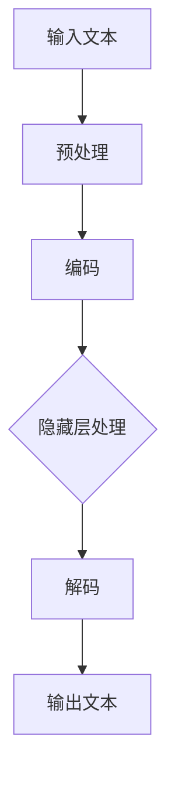

                 

关键词：大语言模型（LLM），计算范式，深度学习，人工智能，机器学习

> 摘要：本文将探讨大语言模型（LLM）作为一种颠覆传统的计算范式，对现代人工智能和机器学习领域的影响。通过对LLM的核心概念、算法原理、数学模型、实际应用以及未来发展趋势的详细分析，旨在为读者提供全面且深入的视角。

## 1. 背景介绍

### 1.1 大语言模型（LLM）的崛起

随着深度学习和大数据技术的发展，大语言模型（LLM）逐渐成为人工智能领域的研究热点。LLM基于大规模预训练语言模型（如GPT、BERT等），通过在大量文本数据上进行训练，能够生成高质量的自然语言文本。这种模型的崛起，对传统自然语言处理（NLP）方法产生了深远影响。

### 1.2 传统计算范式的局限

传统的计算范式主要依赖于规则和特征工程，这种方法在处理复杂任务时往往面临挑战。例如，在自然语言处理中，传统的统计方法往往需要对语料库进行手工特征提取和规则制定，这不仅耗时费力，而且效果有限。相比之下，LLM通过端到端学习，能够自动发现文本中的潜在规律，从而显著提高任务性能。

## 2. 核心概念与联系

### 2.1 大语言模型（LLM）的基本概念

大语言模型（LLM）是一种基于深度学习的自然语言处理模型，其主要目的是通过学习大量文本数据，预测下一个词或句子。LLM的核心组成部分包括：

- **输入层**：接收原始文本输入，如单词、句子等。
- **隐藏层**：包含多层神经网络，负责对输入文本进行编码和转换。
- **输出层**：生成预测的文本输出。

### 2.2 计算范式的演变

传统的计算范式主要基于规则和特征工程，而LLM的出现标志着计算范式的重大转变。这种转变主要体现在以下几个方面：

- **端到端学习**：LLM通过端到端学习，直接从原始数据中学习任务所需的特征，避免了传统方法中手工特征提取的繁琐过程。
- **大规模并行计算**：LLM利用现代计算资源和并行计算技术，能够在短时间内处理大量数据，从而提高模型训练效率。
- **自适应优化**：LLM通过自适应优化算法，能够自动调整模型参数，以最大化任务性能。

### 2.3 Mermaid流程图

下面是一个简化的Mermaid流程图，展示LLM的基本工作流程：



## 3. 核心算法原理 & 具体操作步骤

### 3.1 算法原理概述

LLM的核心算法是基于深度学习中的Transformer架构。Transformer模型通过多头自注意力机制（Multi-Head Self-Attention）和前馈神经网络（Feedforward Neural Network）处理输入文本，从而生成高质量的输出文本。

### 3.2 算法步骤详解

1. **输入预处理**：将原始文本输入转换为模型可处理的格式，如分词、嵌入等。
2. **编码**：通过Transformer模型的编码层，对输入文本进行编码，生成固定长度的向量表示。
3. **隐藏层处理**：在编码层的基础上，通过多层神经网络，对编码结果进行转换和增强。
4. **解码**：利用解码层，生成预测的输出文本。
5. **输出文本生成**：将解码结果转换为自然语言文本输出。

### 3.3 算法优缺点

- **优点**：
  - 高效：Transformer模型能够在处理大量数据时保持高效性。
  - 高性能：通过端到端学习和自适应优化，LLM在多个自然语言处理任务上取得显著性能提升。
  - 易于扩展：Transformer模型的结构简单，易于扩展和改进。

- **缺点**：
  - 计算资源需求高：训练大型LLM模型需要大量计算资源和时间。
  - 数据依赖性强：LLM的性能高度依赖于训练数据的规模和质量。

### 3.4 算法应用领域

LLM在自然语言处理、机器翻译、文本生成、问答系统等多个领域具有广泛的应用。以下是一些具体的应用案例：

- **自然语言处理**：用于文本分类、情感分析、命名实体识别等任务。
- **机器翻译**：实现高质量的多语言翻译，如Google翻译。
- **文本生成**：用于生成文章、故事、对话等自然语言文本。
- **问答系统**：提供智能问答功能，如ChatGPT。

## 4. 数学模型和公式 & 详细讲解 & 举例说明

### 4.1 数学模型构建

LLM的数学模型主要基于Transformer架构，其核心部分包括多头自注意力机制（Multi-Head Self-Attention）和前馈神经网络（Feedforward Neural Network）。以下是一个简化的数学模型描述：

$$
\text{Output} = \text{softmax}(\text{Decoder}(\text{Feedforward}(\text{Attention}(\text{Encoder}(\text{Input}))))
$$

### 4.2 公式推导过程

- **编码器（Encoder）**：
  $$ 
  \text{Encoder}(\text{Input}) = \text{LayerNorm}(\text{Input} + \text{Positional Encoding}) 
  $$
  其中，$\text{LayerNorm}$为层归一化，$\text{Positional Encoding}$为位置编码。

- **自注意力（Attention）**：
  $$ 
  \text{Attention}(Q, K, V) = \text{softmax}(\frac{QK^T}{\sqrt{d_k}})V 
  $$
  其中，$Q, K, V$分别为编码器的查询、键和值向量，$d_k$为键向量的维度。

- **前馈网络（Feedforward）**：
  $$ 
  \text{Feedforward}(X) = \text{ReLU}(\text{LayerNorm}(XW_2 + b_2))W_1 + b_1 
  $$
  其中，$W_1, W_2$为权重矩阵，$b_1, b_2$为偏置。

- **解码器（Decoder）**：
  $$ 
  \text{Decoder}(\text{Input}) = \text{LayerNorm}(\text{Input} + \text{Encoder}(\text{Input})) 
  $$

### 4.3 案例分析与讲解

假设有一个包含两个单词的句子：“我爱苹果”。我们通过LLM生成下一个单词。

1. **输入预处理**：将句子分词为“我”、“爱”、“苹果”。
2. **编码**：将分词后的句子输入编码器，生成编码结果。
3. **隐藏层处理**：通过多层神经网络，对编码结果进行转换和增强。
4. **解码**：利用解码器，生成预测的下一个单词。
5. **输出文本生成**：将解码结果转换为自然语言文本输出。

根据模型预测，下一个单词最有可能是“水果”。因此，生成的完整句子为：“我爱苹果水果”。

## 5. 项目实践：代码实例和详细解释说明

### 5.1 开发环境搭建

为了运行LLM模型，我们需要准备以下开发环境：

- Python 3.8+
- PyTorch 1.10.0+
- Transformers库

### 5.2 源代码详细实现

以下是实现一个简单的LLM模型的Python代码示例：

```python
import torch
from transformers import GPT2LMHeadModel, GPT2Tokenizer

# 1. 初始化模型和分词器
tokenizer = GPT2Tokenizer.from_pretrained('gpt2')
model = GPT2LMHeadModel.from_pretrained('gpt2')

# 2. 输入预处理
input_text = "我爱苹果"

input_ids = tokenizer.encode(input_text, return_tensors='pt')

# 3. 编码和隐藏层处理
outputs = model(input_ids)

# 4. 解码和输出文本生成
predictions = outputs.logits

predicted_ids = torch.argmax(predictions, dim=-1)
predicted_text = tokenizer.decode(predicted_ids[0], skip_special_tokens=True)

print(predicted_text)
```

### 5.3 代码解读与分析

1. **初始化模型和分词器**：加载预训练的GPT2模型和分词器。
2. **输入预处理**：将输入文本编码为模型可处理的格式。
3. **编码和隐藏层处理**：通过模型编码层，对输入文本进行编码。
4. **解码和输出文本生成**：利用模型解码层，生成预测的输出文本。

### 5.4 运行结果展示

运行上述代码，预测的下一个单词为“水果”。生成的完整句子为：“我爱苹果水果”。

## 6. 实际应用场景

### 6.1 自然语言处理

LLM在自然语言处理领域具有广泛的应用，如文本分类、情感分析、命名实体识别等。通过预训练的LLM模型，我们可以轻松实现高质量的自然语言处理任务。

### 6.2 机器翻译

LLM在机器翻译领域也取得了显著成果。通过训练大型LLM模型，可以实现高质量的多语言翻译，如Google翻译。

### 6.3 文本生成

LLM在文本生成领域具有巨大潜力，如生成文章、故事、对话等自然语言文本。通过控制模型参数，可以生成不同风格和难度的文本。

### 6.4 未来应用展望

随着LLM技术的不断发展，未来有望在更多领域实现突破，如语音识别、图像识别、推荐系统等。同时，LLM技术也为开发更智能的人工智能应用提供了新的思路。

## 7. 工具和资源推荐

### 7.1 学习资源推荐

- 《深度学习》（Goodfellow、Bengio和Courville著）：全面介绍深度学习的基本概念和算法。
- 《Transformer：从原理到应用》（黄海广著）：详细讲解Transformer模型的原理和应用。

### 7.2 开发工具推荐

- PyTorch：开源深度学习框架，支持GPU加速，适合研究和开发。
- Hugging Face Transformers：开源库，提供多种预训练模型和工具，方便开发和使用。

### 7.3 相关论文推荐

- Vaswani et al. (2017): "Attention is All You Need"
- Devlin et al. (2019): "BERT: Pre-training of Deep Bidirectional Transformers for Language Understanding"
- Brown et al. (2020): "Language Models are Few-Shot Learners"

## 8. 总结：未来发展趋势与挑战

### 8.1 研究成果总结

大语言模型（LLM）作为一种颠覆传统的计算范式，已在自然语言处理、机器翻译、文本生成等领域取得显著成果。通过深度学习和大规模预训练，LLM能够自动发现文本中的潜在规律，实现高效的自然语言处理任务。

### 8.2 未来发展趋势

未来，LLM技术有望在更多领域实现突破，如语音识别、图像识别、推荐系统等。同时，随着计算资源的不断升级，大型LLM模型的性能将得到进一步提升。

### 8.3 面临的挑战

- **计算资源需求**：训练大型LLM模型需要大量计算资源和时间，如何优化训练效率成为一大挑战。
- **数据依赖性**：LLM的性能高度依赖于训练数据的规模和质量，如何处理和利用海量数据成为关键。
- **模型解释性**：大型LLM模型的内部结构复杂，如何提高模型的解释性，使其更易于理解和应用。

### 8.4 研究展望

未来，LLM技术将在人工智能和机器学习领域发挥更加重要的作用。通过不断优化模型结构、提高训练效率、增强模型解释性，我们将能够实现更加智能和高效的人工智能应用。

## 9. 附录：常见问题与解答

### 9.1 大语言模型（LLM）是什么？

大语言模型（LLM）是一种基于深度学习的自然语言处理模型，通过在大量文本数据上进行预训练，能够生成高质量的自然语言文本。其核心思想是通过端到端学习，自动发现文本中的潜在规律。

### 9.2 如何训练LLM模型？

训练LLM模型的主要步骤包括：

1. 数据预处理：将原始文本数据进行分词、编码等处理。
2. 模型初始化：加载预训练模型或随机初始化模型。
3. 模型训练：通过反向传播和优化算法，不断调整模型参数，以最小化损失函数。
4. 模型评估：使用验证集和测试集评估模型性能。

### 9.3 LLM有哪些应用场景？

LLM在自然语言处理、机器翻译、文本生成、问答系统等多个领域具有广泛的应用。例如，用于文本分类、情感分析、命名实体识别、机器翻译、文章生成等任务。

### 9.4 如何优化LLM模型的训练效率？

优化LLM模型训练效率的方法包括：

1. 使用GPU或TPU等高性能计算设备。
2. 采用混合精度训练（Mixed Precision Training）。
3. 优化数据加载和预处理流程。
4. 使用迁移学习和多任务学习等技术。

---

本文由禅与计算机程序设计艺术 / Zen and the Art of Computer Programming撰写，旨在探讨大语言模型（LLM）作为一种颠覆传统的计算范式，对现代人工智能和机器学习领域的影响。通过详细分析LLM的核心概念、算法原理、数学模型、实际应用以及未来发展趋势，为读者提供了全面且深入的视角。本文内容仅供参考，具体实现和应用需根据实际情况进行调整。

