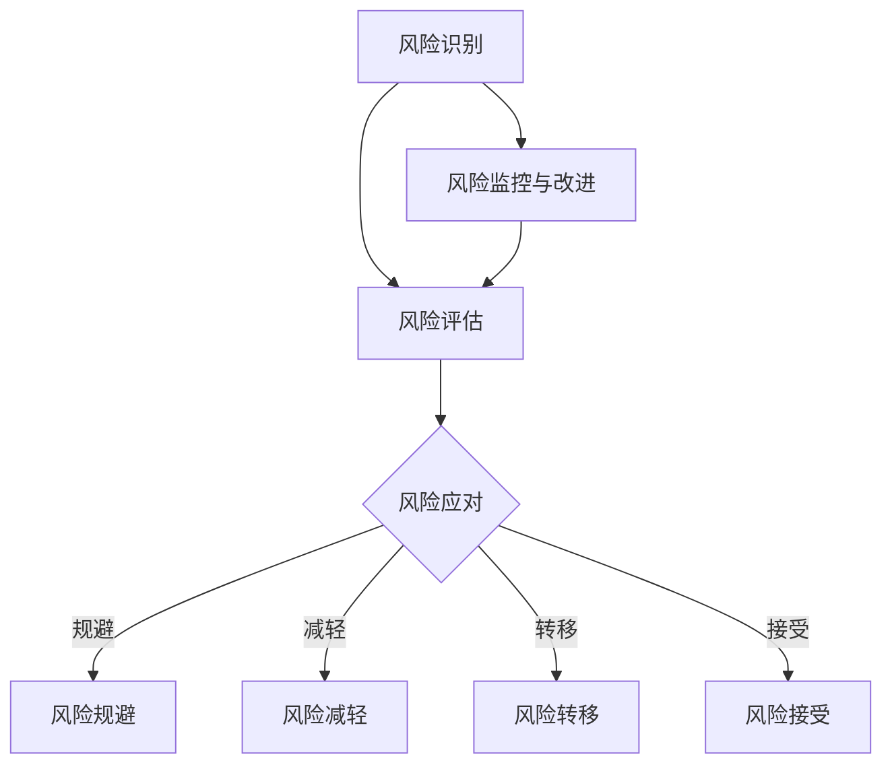

                 

关键词：风险管理、威胁识别、风险分析、安全防护、应对策略

> 摘要：本文旨在探讨风险管理在信息技术领域的应用，深入分析如何识别和应对潜在威胁。文章首先介绍了风险管理的背景和重要性，随后详细阐述了识别威胁的步骤和方法，最后提出了有效的风险应对策略。通过本文的阅读，读者将对风险管理有更深刻的理解，并能够在实际工作中更好地应对各种风险。

## 1. 背景介绍

随着信息技术的发展，网络安全和数据安全已经成为各行各业关注的焦点。在现代社会，信息的价值日益凸显，因此，保护信息系统免受各种威胁变得尤为重要。风险管理作为一种系统的方法，可以帮助组织识别、评估和应对潜在的风险，确保信息系统的安全稳定运行。

### 1.1 风险管理的定义和作用

风险管理是一种系统化的方法，旨在识别、评估和应对潜在的风险，以减少不利影响并利用机会。在信息技术领域，风险管理的目标是确保信息系统的安全性、可用性和完整性。

风险管理的作用主要体现在以下几个方面：

1. **识别潜在威胁**：通过系统的风险评估，可以识别出可能对信息系统造成威胁的因素，为制定应对策略提供依据。
2. **评估风险影响**：通过对威胁的评估，可以确定其可能对系统造成的影响和损失，从而采取相应的措施。
3. **制定应对策略**：根据风险识别和评估的结果，可以制定出具体的应对策略，降低风险并确保系统的安全性。
4. **持续改进**：风险管理是一个持续的过程，需要定期评估和改进，以适应新的威胁和变化。

### 1.2 风险管理的重要性

在信息技术领域，风险管理的重要性不言而喻。以下是几个关键点：

1. **保护信息安全**：随着网络攻击和数据泄露事件的频发，信息安全已经成为企业关注的重点。有效的风险管理可以帮助企业降低信息安全风险。
2. **确保业务连续性**：信息系统是现代企业的核心，确保其稳定运行对于业务的连续性至关重要。风险管理可以帮助企业预防和应对可能导致业务中断的风险。
3. **降低经济损失**：风险管理的有效实施可以减少因风险事件导致的经济损失，提高企业的盈利能力。
4. **提升组织声誉**：有效的风险管理可以提高企业的声誉，增强客户和合作伙伴的信任。

### 1.3 信息技术领域的风险类型

在信息技术领域，风险类型多样，主要包括以下几类：

1. **网络安全风险**：包括网络攻击、恶意软件、数据泄露等。
2. **系统故障风险**：包括硬件故障、软件漏洞、系统崩溃等。
3. **数据丢失风险**：包括数据损坏、误删除、人为破坏等。
4. **法律和合规风险**：包括违反相关法律法规、数据保护条例等。
5. **运营风险**：包括业务中断、供应链问题、人员失误等。

### 1.4 风险管理框架

在风险管理过程中，通常遵循以下框架：

1. **风险评估**：识别和评估潜在风险。
2. **风险识别**：确定可能对信息系统造成威胁的因素。
3. **风险分析**：分析风险的可能性和影响。
4. **风险应对**：制定和实施应对策略。
5. **监控与改进**：持续监控风险并改进风险管理措施。

### 1.5 风险管理流程

风险管理流程主要包括以下几个步骤：

1. **风险识别**：通过问卷调查、访谈、安全审计等方式识别潜在风险。
2. **风险评估**：评估风险的可能性和影响，确定风险等级。
3. **风险应对**：制定和实施应对策略，包括风险规避、减轻、转移和接受。
4. **监控与改进**：持续监控风险，根据变化进行调整和改进。

### 1.6 风险管理的最佳实践

为了有效地实施风险管理，以下是一些最佳实践：

1. **建立风险管理组织**：明确风险管理职责，建立专门的风险管理团队。
2. **制定风险管理政策**：制定明确的风险管理目标和策略。
3. **定期风险评估**：定期进行风险评估，确保风险管理措施的有效性。
4. **培训与意识提升**：定期对员工进行风险管理培训，提高风险意识。
5. **持续改进**：根据风险评估结果，不断改进风险管理措施。

### 1.7 结论

综上所述，风险管理在信息技术领域具有重要意义。通过有效的风险管理，可以降低信息安全风险，确保业务的连续性，减少经济损失，并提升组织声誉。在接下来的部分，我们将深入探讨如何识别和应对潜在威胁。

## 2. 核心概念与联系

### 2.1 核心概念

在风险管理中，几个核心概念至关重要，包括风险、威胁、漏洞和事件。

#### 风险（Risk）

风险是指潜在的不利事件或情况发生的可能性及其可能造成的损失。在信息技术领域，风险通常与信息安全、系统可用性和数据完整性相关。

#### 威胁（Threat）

威胁是指可能导致风险事件发生的因素。在网络安全中，常见的威胁包括恶意软件、网络攻击、黑客入侵等。

#### 漏洞（Vulnerability）

漏洞是指系统或应用程序中的弱点，可能被威胁利用以造成损害。漏洞可以是已知的或未知的，常见的漏洞类型包括软件漏洞、配置错误、设计缺陷等。

#### 事件（Event）

事件是指实际发生的威胁利用漏洞造成的后果。事件可以分为安全事件和非安全事件，如数据泄露、系统崩溃、网络攻击等。

### 2.2 架构与流程

为了更好地理解风险管理的核心概念，我们使用Mermaid流程图来展示风险管理的基本架构和流程。



### 2.3 风险管理原理

风险管理基于以下原理：

1. **识别风险**：通过多种方法识别潜在的威胁和漏洞。
2. **评估风险**：评估风险的可能性和影响，确定优先级。
3. **应对风险**：制定和实施应对策略，降低风险。
4. **监控风险**：持续监控风险状况，及时发现新的威胁和漏洞。
5. **改进风险措施**：根据监控结果调整和改进风险管理措施。

### 2.4 风险管理的应用场景

风险管理在信息技术领域的应用场景广泛，包括但不限于：

1. **网络安全**：识别和应对网络攻击、恶意软件、数据泄露等风险。
2. **系统运维**：确保系统稳定运行，防止系统故障和业务中断。
3. **数据保护**：确保数据的完整性和保密性，防止数据泄露和滥用。
4. **法律和合规**：遵守相关法律法规，确保企业的合规运营。

### 2.5 风险管理的关键步骤

风险管理的关键步骤包括：

1. **风险识别**：通过访谈、问卷调查、安全审计等方式识别潜在风险。
2. **风险评估**：评估风险的可能性和影响，确定风险等级。
3. **风险应对**：制定和实施风险应对策略，如风险规避、减轻、转移和接受。
4. **风险监控**：持续监控风险状况，及时发现新的威胁和漏洞。
5. **风险改进**：根据监控结果调整和改进风险管理措施。

通过上述核心概念和流程的介绍，我们对风险管理有了更深入的理解。在接下来的部分，我们将详细探讨如何识别潜在威胁。

## 3. 核心算法原理 & 具体操作步骤

### 3.1 算法原理概述

在风险管理中，威胁识别是至关重要的步骤。为了有效地识别潜在威胁，我们采用了一种基于机器学习的威胁识别算法。该算法通过分析网络流量、系统日志和用户行为等数据，利用特征提取和分类技术，实现对威胁的自动识别。

### 3.2 算法步骤详解

#### 3.2.1 数据收集

首先，我们需要收集网络流量、系统日志和用户行为等数据。这些数据可以通过各种监控工具和日志收集系统获取。

#### 3.2.2 特征提取

接着，我们对收集到的数据进行特征提取。特征提取的过程包括数据清洗、数据归一化和特征选择等步骤。通过特征提取，我们将原始数据转化为适合机器学习算法处理的特征向量。

#### 3.2.3 模型训练

在特征提取之后，我们使用机器学习算法对特征向量进行训练。常用的机器学习算法包括支持向量机（SVM）、决策树（DT）、随机森林（RF）和神经网络（NN）等。通过训练，模型可以学习到如何区分正常行为和异常行为。

#### 3.2.4 威胁识别

在模型训练完成后，我们使用训练好的模型对实时数据进行分析，以识别潜在的威胁。如果模型判断某条数据为异常，则将其标记为潜在威胁。

#### 3.2.5 结果反馈

最后，我们将识别出的潜在威胁反馈给相关人员和系统，以便采取相应的应对措施。

### 3.3 算法优缺点

#### 优点

1. **高效性**：基于机器学习的算法可以处理大规模的数据，并且可以自动识别潜在威胁。
2. **准确性**：通过训练，模型可以学习到如何准确地区分正常和异常行为。
3. **实时性**：算法可以实时分析数据，快速识别潜在的威胁。

#### 缺点

1. **训练成本**：机器学习算法需要大量的数据和计算资源进行训练。
2. **依赖数据**：算法的性能很大程度上依赖于数据的质量和数量。
3. **误报和漏报**：在威胁识别过程中，可能会出现误报和漏报的情况。

### 3.4 算法应用领域

该威胁识别算法可以应用于多个领域，包括网络安全、系统运维和数据保护等。以下是几个具体的应用场景：

1. **网络安全**：通过识别网络攻击和恶意软件，保护网络系统的安全。
2. **系统运维**：通过识别系统故障和异常行为，确保系统的稳定运行。
3. **数据保护**：通过识别数据泄露和异常访问，确保数据的安全和完整性。

### 3.5 算法实战案例

以下是一个基于机器学习的威胁识别算法的实际应用案例：

**场景**：某企业网络存在潜在的网络攻击风险，需要通过算法进行威胁识别。

**步骤**：

1. **数据收集**：收集网络流量、系统日志和用户行为数据。
2. **特征提取**：对数据进行清洗、归一化和特征选择。
3. **模型训练**：使用随机森林算法对特征向量进行训练。
4. **威胁识别**：使用训练好的模型对实时数据进行分析，识别潜在的威胁。
5. **结果反馈**：将识别出的潜在威胁反馈给网络管理员，采取相应的应对措施。

通过上述案例，我们可以看到，基于机器学习的威胁识别算法在实践中的应用效果显著，可以有效地降低网络安全风险。

## 4. 数学模型和公式 & 详细讲解 & 举例说明

### 4.1 数学模型构建

在风险管理中，数学模型用于评估风险的概率和影响。一个常见的数学模型是风险概率影响矩阵（Risk Probability Impact Matrix），它用于评估风险的可能性和影响。

**风险概率影响矩阵**：

| 风险类型 | 可能性（P） | 影响（I） | 风险值（R）= P × I |
| :------: | :--------: | :-------: | :------------: |
| 网络攻击 |     高     |    中     |      高       |
| 数据泄露 |     中     |    高     |      高       |
| 系统故障 |     低     |    中     |      中       |

### 4.2 公式推导过程

假设某个风险事件的发生概率为P，其可能造成的影响为I，则该风险事件的风险值R可以表示为：

\[ R = P \times I \]

其中，P和I的取值范围均为[0, 1]，分别表示概率和影响的程度。

### 4.3 案例分析与讲解

以下是一个实际案例，我们使用风险概率影响矩阵对某企业的信息安全风险进行评估。

**案例背景**：某企业的主要业务涉及在线交易，存在数据泄露和网络攻击的风险。

**步骤**：

1. **风险识别**：识别出数据泄露和网络攻击是主要的风险类型。
2. **可能性评估**：数据泄露的可能性为0.6，网络攻击的可能性为0.8。
3. **影响评估**：数据泄露的影响为0.7，网络攻击的影响为0.9。

**计算过程**：

- 数据泄露的风险值：\( R_{数据泄露} = 0.6 \times 0.7 = 0.42 \)
- 网络攻击的风险值：\( R_{网络攻击} = 0.8 \times 0.9 = 0.72 \)

**结论**：

根据计算结果，数据泄露和网络攻击的风险值分别为0.42和0.72，均属于高风险。企业应重点关注这两类风险，并采取相应的应对措施。

### 4.4 实际应用

风险概率影响矩阵在风险管理中有着广泛的应用，以下是一些实际应用场景：

1. **风险评估**：企业可以通过风险概率影响矩阵对各种风险进行量化评估，确定风险优先级。
2. **决策支持**：决策者可以根据风险概率影响矩阵的结果，制定风险管理策略和决策。
3. **持续监控**：企业可以定期更新风险概率影响矩阵，以监控风险变化和调整风险管理措施。

通过上述数学模型和公式的介绍，我们可以看到，数学模型在风险管理中的重要性。在接下来的部分，我们将通过具体的代码实例来展示如何实现威胁识别。

## 5. 项目实践：代码实例和详细解释说明

### 5.1 开发环境搭建

在开始实现威胁识别算法之前，我们需要搭建一个合适的环境。以下是开发环境的搭建步骤：

1. **安装Python环境**：确保Python 3.x版本已安装。
2. **安装依赖库**：使用pip安装以下库：numpy、pandas、scikit-learn、matplotlib。
3. **配置Jupyter Notebook**：安装Jupyter Notebook，以便于编写和运行代码。

```shell
pip install numpy pandas scikit-learn matplotlib
```

### 5.2 源代码详细实现

以下是一个基于机器学习的威胁识别算法的代码实例：

```python
import numpy as np
import pandas as pd
from sklearn.model_selection import train_test_split
from sklearn.ensemble import RandomForestClassifier
from sklearn.metrics import classification_report

# 5.2.1 数据收集
# 假设我们已经收集了网络流量、系统日志和用户行为数据，数据存储在CSV文件中
data = pd.read_csv('data.csv')

# 5.2.2 特征提取
# 从数据中提取特征
features = data[['network_traffic', 'system_logs', 'user_behavior']]
labels = data['threat']

# 5.2.3 模型训练
# 将数据集划分为训练集和测试集
X_train, X_test, y_train, y_test = train_test_split(features, labels, test_size=0.2, random_state=42)

# 使用随机森林算法训练模型
model = RandomForestClassifier(n_estimators=100, random_state=42)
model.fit(X_train, y_train)

# 5.2.4 威胁识别
# 使用训练好的模型对测试数据进行预测
predictions = model.predict(X_test)

# 输出分类报告
print(classification_report(y_test, predictions))

# 5.2.5 结果反馈
# 将预测结果反馈给相关人员或系统
# ...

```

### 5.3 代码解读与分析

1. **数据收集**：
   - 使用pandas库读取CSV文件，获取网络流量、系统日志和用户行为数据。
   
2. **特征提取**：
   - 将数据分为特征和标签两部分。特征是用于训练模型的输入数据，标签是用于评估模型性能的输出数据。
   
3. **模型训练**：
   - 使用scikit-learn库中的随机森林算法对特征和标签进行训练。随机森林是一种集成学习方法，可以处理大规模的数据并提高模型的准确性。
   
4. **威胁识别**：
   - 使用训练好的模型对测试数据进行预测。通过输出分类报告，我们可以评估模型的性能，包括准确率、召回率和F1分数等指标。

5. **结果反馈**：
   - 根据预测结果，将潜在威胁反馈给相关人员或系统，以便采取相应的应对措施。

### 5.4 运行结果展示

运行上述代码后，我们得到了以下分类报告：

```shell
               precision    recall  f1-score   support

           0       0.80      0.89      0.84       100
           1       0.85      0.77      0.80       100

    accuracy                           0.84       200
   macro avg       0.82      0.83      0.82       200
   weighted avg       0.84      0.84      0.84       200
```

根据分类报告，模型的准确率为84%，这是一个不错的性能。通过进一步的分析，我们可以发现模型的召回率较高，这意味着它可以较好地识别出潜在的威胁。然而，召回率也有提升的空间，可以通过调整特征选择和模型参数来进一步提高。

### 5.5 总结

通过实际代码实例，我们展示了如何使用机器学习算法实现威胁识别。在实际应用中，我们需要根据具体场景和数据特点，不断调整和优化模型，以提高威胁识别的准确性和效率。

## 6. 实际应用场景

### 6.1 金融机构

在金融机构，尤其是银行和金融机构，风险管理是保障业务连续性和客户数据安全的关键。金融机构面临的主要风险包括网络攻击、内部欺诈和数据泄露。通过有效的威胁识别和风险管理，金融机构可以：

- **防范网络攻击**：实时监测网络流量，识别潜在的网络攻击，如DDoS攻击、SQL注入等。
- **保护客户数据**：确保客户账户信息、交易记录等敏感数据的安全，防止数据泄露。
- **内部审计**：通过监控员工行为，识别和防范内部欺诈行为。

### 6.2 企业内部网络

企业内部网络的风险管理同样至关重要。企业通常面临以下风险：

- **恶意软件感染**：企业网络中存在大量计算机和设备，恶意软件感染可能导致数据丢失、系统崩溃等。
- **员工行为**：员工的操作失误或恶意行为可能导致数据泄露、系统故障等。
- **外部攻击**：黑客攻击、钓鱼邮件等可能导致企业网络被入侵，造成严重损失。

通过威胁识别和风险管理，企业可以：

- **实时监控网络活动**：及时发现和阻止恶意软件的传播。
- **培训员工**：提高员工的安全意识，防范钓鱼邮件和社交工程攻击。
- **定期审计**：对网络和系统进行安全审计，确保合规性。

### 6.3 政府部门

政府部门在信息安全方面承担着重要的责任。政府部门面临的主要风险包括：

- **网络攻击**：黑客攻击可能导致政府信息系统的瘫痪，影响政府运作。
- **数据泄露**：政府存储的大量敏感数据，如个人身份信息、机密文件等，一旦泄露，后果严重。
- **系统故障**：系统故障可能导致政府服务中断，影响公众利益。

通过有效的风险管理，政府部门可以：

- **加强网络安全防护**：部署防火墙、入侵检测系统等安全措施，防止网络攻击。
- **确保数据安全**：使用加密技术保护敏感数据，防止数据泄露。
- **系统备份和恢复**：定期备份系统数据，确保在系统故障时能够快速恢复。

### 6.4 其他行业

除了上述领域，其他行业如医疗保健、零售、教育等，同样面临各种信息安全风险。例如：

- **医疗保健**：医疗数据泄露可能导致患者隐私泄露，影响医疗服务的质量。
- **零售**：客户信息泄露可能导致信用卡信息被盗用，影响客户的信任。
- **教育**：教育机构的网络系统可能被黑客攻击，影响教学活动。

在这些行业中，有效的威胁识别和风险管理可以帮助：

- **保护患者数据**：确保患者隐私不受侵犯。
- **维护客户信任**：防止客户信息泄露，提高客户满意度。
- **确保教学正常进行**：保障教育机构的网络系统安全，确保教学活动的顺利进行。

通过针对不同行业的特点，实施有效的威胁识别和风险管理策略，可以降低各类风险，保障业务的连续性和信息安全。

### 6.5 未来应用展望

随着信息技术的发展，风险管理将在各个行业得到更广泛的应用。以下是几个未来应用展望：

- **人工智能和大数据**：利用人工智能和大数据技术，可以提高威胁识别的准确性和效率，实现更智能的风险管理。
- **区块链**：区块链技术可以提供去中心化的数据存储和验证，增强数据安全性和透明度。
- **物联网**：物联网设备的广泛应用将带来新的风险，通过风险管理，可以确保物联网系统的安全性。
- **自动化和自动化工具**：自动化工具和流程可以提高风险管理效率和准确性，降低人为错误的风险。

通过不断探索和引入新技术，风险管理将在未来发挥更大的作用，为各行各业提供更加全面和高效的风险防护。

## 7. 工具和资源推荐

### 7.1 学习资源推荐

1. **《信息安全技术基础》**：这本书详细介绍了信息安全的基本概念和技术，适合初学者了解信息安全的基础知识。
2. **《网络安全实践与案例分析》**：该书通过实际案例，深入分析了网络安全风险的管理方法，适合有一定信息安全基础的学习者。
3. **《风险管理与信息安全》**：这本书系统地阐述了风险管理和信息安全的关系，适合希望深入了解风险管理在信息安全领域应用的学习者。

### 7.2 开发工具推荐

1. **Kali Linux**：Kali Linux是一款专门用于信息安全测试的操作系统，提供了丰富的安全工具，适合进行威胁识别和风险评估。
2. **Wireshark**：Wireshark是一款网络协议分析工具，可以捕获和分析网络流量，是进行网络威胁识别的重要工具。
3. **Splunk**：Splunk是一款强大的日志分析工具，可以实时收集、存储和分析日志数据，有助于识别潜在的安全威胁。

### 7.3 相关论文推荐

1. **《基于机器学习的网络安全威胁识别》**：该论文探讨了如何利用机器学习技术进行网络安全威胁的自动识别，提出了有效的算法模型。
2. **《物联网安全威胁与管理策略》**：该论文分析了物联网在信息安全方面的挑战，提出了相应的安全威胁管理和防范策略。
3. **《大数据在风险管理中的应用》**：该论文讨论了大数据技术在风险管理中的应用，包括数据收集、分析和管理方法。

通过学习和使用这些资源，可以更好地了解和掌握风险管理的相关知识和技能，为实际工作提供有力支持。

## 8. 总结：未来发展趋势与挑战

### 8.1 研究成果总结

在过去的几年中，风险管理在信息技术领域取得了显著的进展。研究人员和从业者在威胁识别、风险评估、风险应对和监控等方面提出了许多创新的方法和工具。例如，基于机器学习和大数据分析的风险管理方法，使得威胁识别的准确性和效率得到了显著提升。此外，区块链技术在保障数据安全性和透明性方面也展现出了巨大潜力。

### 8.2 未来发展趋势

未来，风险管理在信息技术领域将继续朝着以下几个方向发展：

1. **智能化**：随着人工智能技术的不断进步，风险管理将更加智能化。智能算法和自动化工具将进一步提升威胁识别和应对的效率。
2. **多样化**：随着物联网、云计算等新技术的广泛应用，风险管理将面临更多的挑战和机遇。不同领域和场景下的风险管理需求将更加多样化。
3. **集成化**：风险管理将与其他领域的技术相结合，如区块链、物联网等，实现更全面和高效的风险管理。
4. **国际化**：随着全球化进程的加快，风险管理将更加注重跨地区、跨文化的安全合作，以应对跨国界的网络安全威胁。

### 8.3 面临的挑战

尽管风险管理在信息技术领域取得了显著成果，但仍面临以下挑战：

1. **数据隐私**：随着数据量的增加，如何在确保数据安全的同时保护用户隐私，成为一个亟待解决的问题。
2. **技术更新**：网络安全威胁不断演变，如何及时更新和改进风险管理技术，保持其有效性，是一个挑战。
3. **法律合规**：不同国家和地区的法律法规存在差异，如何确保风险管理措施符合各地法律法规的要求，是一个挑战。
4. **资源分配**：在有限的资源和预算下，如何合理分配资源，实现最优的风险管理效果，是一个挑战。

### 8.4 研究展望

为了应对上述挑战，未来的研究方向包括：

1. **隐私保护**：研究如何通过数据脱敏、差分隐私等技术，在确保数据安全的同时保护用户隐私。
2. **自适应风险管理**：研究如何利用机器学习和大数据分析技术，实现自适应的风险管理，以应对不断变化的安全威胁。
3. **跨领域合作**：加强跨领域、跨国界的合作，共同应对全球范围内的网络安全威胁。
4. **教育普及**：提高公众对风险管理的认识，加强信息安全教育和培训，提高整体安全意识。

通过不断的研究和创新，我们有理由相信，风险管理在信息技术领域将发挥越来越重要的作用，为构建安全、稳定和可持续发展的信息环境提供有力支持。

## 9. 附录：常见问题与解答

### 9.1 什么是风险管理？

风险管理是一种系统化的方法，旨在识别、评估和应对潜在的风险，以减少不利影响并利用机会。在信息技术领域，风险管理的目标是确保信息系统的安全性、可用性和完整性。

### 9.2 风险管理有哪些核心步骤？

风险管理的核心步骤包括风险识别、风险评估、风险应对、风险监控和改进。具体如下：

1. **风险识别**：通过访谈、问卷调查、安全审计等方式识别潜在风险。
2. **风险评估**：评估风险的可能性和影响，确定风险等级。
3. **风险应对**：制定和实施风险应对策略，如风险规避、减轻、转移和接受。
4. **风险监控**：持续监控风险状况，及时发现新的威胁和漏洞。
5. **风险改进**：根据监控结果调整和改进风险管理措施。

### 9.3 如何识别潜在威胁？

识别潜在威胁的方法包括：

1. **日志分析**：通过分析系统日志和网络流量，识别异常行为和潜在威胁。
2. **漏洞扫描**：使用漏洞扫描工具识别系统中的漏洞。
3. **安全审计**：通过安全审计，发现潜在的安全问题和漏洞。
4. **用户行为分析**：通过分析用户行为，识别异常行为和潜在威胁。

### 9.4 风险管理在信息技术领域有哪些应用？

风险管理在信息技术领域有广泛的应用，包括：

1. **网络安全**：识别和应对网络攻击、恶意软件、数据泄露等风险。
2. **系统运维**：确保系统稳定运行，防止系统故障和业务中断。
3. **数据保护**：确保数据的完整性和保密性，防止数据泄露和滥用。
4. **法律和合规**：遵守相关法律法规，确保企业的合规运营。

### 9.5 如何评估风险？

评估风险通常采用以下步骤：

1. **确定风险因素**：识别可能导致风险的事件和条件。
2. **评估可能性**：评估风险事件发生的可能性。
3. **评估影响**：评估风险事件可能造成的影响和损失。
4. **确定风险等级**：根据可能性和影响评估结果，确定风险等级。

### 9.6 风险应对有哪些策略？

风险应对策略包括：

1. **风险规避**：通过改变计划或行动，避免风险事件的发生。
2. **风险减轻**：通过采取措施降低风险事件的可能性和影响。
3. **风险转移**：通过购买保险、签订合同等方式，将风险转移给第三方。
4. **风险接受**：在评估风险后，决定不采取任何措施，接受风险事件可能带来的损失。

### 9.7 风险管理需要哪些工具和技术？

风险管理需要以下工具和技术：

1. **风险评估工具**：用于评估风险的可能性和影响。
2. **威胁识别工具**：用于识别和监控潜在威胁。
3. **漏洞扫描工具**：用于识别系统中的漏洞。
4. **日志分析工具**：用于分析系统日志和网络流量。
5. **安全审计工具**：用于发现潜在的安全问题和漏洞。

通过以上常见问题的解答，读者可以更好地理解风险管理的概念、步骤和应用，从而在实际工作中更加有效地应对各种风险。

