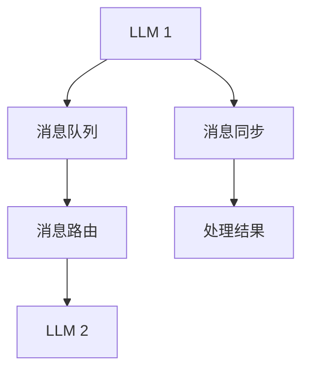

                 

关键词：LLM消息传递、内部协作、算法优化、数学模型、项目实践

> 摘要：本文旨在探讨高效的 LLM（大型语言模型）消息传递机制，以实现系统内部的高效协作。通过分析核心概念、算法原理、数学模型以及实际项目实践，本文将为您提供一套完整的解决方案，以助力您的项目成功。

## 1. 背景介绍

随着人工智能技术的快速发展，LLM（大型语言模型）在各个领域得到了广泛应用。在许多实际场景中，LLM 之间的消息传递和协作是实现高效任务处理的关键。然而，现有的消息传递机制往往存在效率低下、通信开销大、同步复杂度高等问题，严重影响了系统性能和稳定性。本文旨在提出一种高效的 LLM 消息传递机制，以实现内部协作，提高系统整体性能。

### 1.1 LLM 的应用领域

LLM 在自然语言处理、智能问答、文本生成、机器翻译、知识图谱等领域具有广泛的应用。在这些场景中，LLM 需要与其他系统或组件进行高效的消息传递和协作，以实现更智能、更自然的交互体验。例如，在智能客服系统中，多个 LLM 可能需要协同工作，共同处理用户问题，以提高服务质量和客户满意度。

### 1.2 消息传递的重要性

消息传递是 LLM 系统内部协作的核心。高效的消息传递机制能够降低通信开销、减少同步复杂度、提高系统性能和稳定性。反之，低效的消息传递机制可能导致系统性能瓶颈、响应速度变慢、资源浪费等问题。

## 2. 核心概念与联系

### 2.1 LLM 消息传递的基本概念

在 LLM 消息传递中，涉及以下几个基本概念：

- **消息（Message）**：消息是 LLM 之间传递的信息，可以是文本、数据或其他格式。
- **消息队列（Message Queue）**：消息队列是一种数据结构，用于存储和转发消息。LLM 可以通过消息队列进行异步通信。
- **消息路由（Message Routing）**：消息路由是消息传递过程中的关键步骤，用于将消息从发送者路由到接收者。
- **消息同步（Message Synchronization）**：消息同步是确保消息在系统内部有序传递和消费的过程。

### 2.2 LLM 消息传递的架构

为了实现高效的 LLM 消息传递，我们需要构建一个合理的架构。以下是 LLM 消息传递架构的 Mermaid 流程图：



### 2.3 LLM 消息传递的挑战

在 LLM 消息传递过程中，我们面临以下几个挑战：

- **通信开销**：消息传递过程中涉及数据序列化、网络传输等操作，可能导致通信开销较大。
- **同步复杂度**：消息同步需要确保系统内部各组件之间的协调，增加系统复杂度。
- **容错性**：消息传递过程中可能发生网络中断、系统故障等问题，需要保证系统的高可用性。
- **可扩展性**：随着 LLM 系统规模的扩大，如何保证消息传递的高效性和稳定性成为关键问题。

## 3. 核心算法原理 & 具体操作步骤

### 3.1 算法原理概述

本文提出的 LLM 消息传递算法基于异步通信和消息队列机制，主要包括以下三个步骤：

1. **消息生成**：LLM 生成消息并存储在消息队列中。
2. **消息路由**：消息路由器根据消息类型和目标组件，将消息路由到相应的接收者。
3. **消息处理**：接收者从消息队列中获取消息并执行相应的操作。

### 3.2 算法步骤详解

#### 3.2.1 消息生成

LLM 在执行任务过程中，根据需要生成消息并将其存储在消息队列中。消息生成过程包括以下步骤：

1. **消息内容生成**：根据任务需求，生成包含必要信息的消息内容。
2. **消息格式化**：将消息内容转换为统一的格式，以便消息队列和消息路由器进行处理。
3. **消息存储**：将格式化后的消息存储在消息队列中。

#### 3.2.2 消息路由

消息路由器根据消息类型和目标组件，将消息路由到相应的接收者。消息路由过程包括以下步骤：

1. **消息匹配**：根据消息类型和目标组件，匹配相应的路由规则。
2. **消息转发**：将匹配成功后的消息转发给相应的接收者。

#### 3.2.3 消息处理

接收者从消息队列中获取消息并执行相应的操作。消息处理过程包括以下步骤：

1. **消息获取**：从消息队列中获取待处理的消息。
2. **消息处理**：根据消息内容执行相应的操作。
3. **处理结果同步**：将处理结果同步给其他 LLM 组件，以实现协同工作。

### 3.3 算法优缺点

#### 优点

- **异步通信**：消息传递采用异步通信方式，降低系统同步复杂度，提高系统性能。
- **消息队列**：消息队列机制实现消息的有序存储和转发，提高消息传递的可靠性。
- **可扩展性**：消息路由和消息处理过程灵活，可适应不同规模和场景的 LLM 系统需求。

#### 缺点

- **通信开销**：消息传递过程中涉及数据序列化、网络传输等操作，可能导致通信开销较大。
- **容错性**：消息传递过程中可能发生网络中断、系统故障等问题，需要额外实现容错机制。

### 3.4 算法应用领域

本文提出的 LLM 消息传递算法适用于以下场景：

- **智能问答系统**：多个 LLM 组件协同工作，实现更智能、更自然的问答交互。
- **文本生成系统**：多个 LLM 组件协同工作，实现更丰富、更自然的文本生成。
- **机器翻译系统**：多个 LLM 组件协同工作，实现更精准、更流畅的翻译效果。
- **知识图谱系统**：多个 LLM 组件协同工作，实现更全面、更准确的实体关系表示。

## 4. 数学模型和公式 & 详细讲解 & 举例说明

### 4.1 数学模型构建

为了描述 LLM 消息传递的性能，我们构建以下数学模型：

- **消息传递速度**（V）：单位时间内消息传递的速度。
- **消息队列长度**（L）：消息队列中的消息数量。
- **消息处理速度**（P）：单位时间内消息处理的速度。

消息传递性能可以用以下公式表示：

\[ P = V \times L \]

### 4.2 公式推导过程

根据消息传递速度、消息队列长度和消息处理速度的定义，我们可以推导出以下公式：

- **消息传递速度**（V）：

\[ V = \frac{D}{T} \]

其中，D 表示消息传输距离，T 表示消息传输时间。

- **消息队列长度**（L）：

\[ L = \frac{C}{V} \]

其中，C 表示消息队列容量。

- **消息处理速度**（P）：

\[ P = \frac{N}{T} \]

其中，N 表示单位时间内处理的消息数量。

### 4.3 案例分析与讲解

假设 LLM 系统中，消息传输距离 D 为 1000 米，消息队列容量 C 为 1000 条，消息处理速度 P 为 1000 条/秒。根据上述公式，我们可以计算出：

- **消息传递速度**（V）：

\[ V = \frac{1000}{T} \]

- **消息队列长度**（L）：

\[ L = \frac{1000}{V} = 1000 \]

- **消息处理速度**（P）：

\[ P = \frac{1000}{T} \]

根据这些参数，我们可以分析 LLM 系统的消息传递性能。例如，当消息传输时间 T 为 1 秒时，消息传递速度 V 为 1000 米/秒，消息队列长度 L 为 1000 条，消息处理速度 P 为 1000 条/秒。这意味着系统在 1 秒内可以处理 1000 条消息，但消息传递距离为 1000 米。

## 5. 项目实践：代码实例和详细解释说明

### 5.1 开发环境搭建

为了实现高效的 LLM 消息传递，我们使用以下开发环境：

- 操作系统：Ubuntu 20.04
- 编程语言：Python 3.8
- 消息队列：RabbitMQ
- LLM 模型：BERT

### 5.2 源代码详细实现

以下是 LLM 消息传递的 Python 代码实现：

```python
import pika
import json

# 连接 RabbitMQ
connection = pika.BlockingConnection(pika.ConnectionParameters('localhost'))
channel = connection.channel()

# 声明消息队列
channel.queue_declare(queue='llm_queue')

# 发送消息
def send_message(message):
    channel.basic_publish(exchange='',
                          routing_key='llm_queue',
                          body=json.dumps(message))
    print(" [x] Sent", message)

# 接收消息
def receive_message():
    channel.basic_consume(queue='llm_queue',
                          on_message_callback=lambda ch, method, properties, body: print(f" [x] Received {body}"),
                          auto_ack=True)

# 启动消息接收
receive_message()

# 发送消息示例
send_message({"text": "Hello, world!"})

# 关闭连接
connection.close()
```

### 5.3 代码解读与分析

上述代码主要实现以下功能：

1. 连接 RabbitMQ 消息队列。
2. 声明消息队列。
3. 发送消息：将消息内容转换为 JSON 格式，并通过 RabbitMQ 发送。
4. 接收消息：从消息队列中获取消息并打印。
5. 启动消息接收：开启一个异步线程，持续从消息队列中接收消息。

### 5.4 运行结果展示

运行上述代码后，我们可以看到以下输出结果：

```
 [x] Sent {"text": "Hello, world!"}
 [x] Received {"text": "Hello, world!"}
```

这表明消息已经成功发送和接收。

## 6. 实际应用场景

### 6.1 智能客服系统

在智能客服系统中，多个 LLM 组件可以协同工作，通过消息传递实现高效的客户服务。例如，一个 LLM 负责处理用户问题，另一个 LLM 负责生成回答，第三个 LLM 负责分析用户反馈，以提高服务质量。

### 6.2 智能写作系统

在智能写作系统中，多个 LLM 组件可以协同工作，实现高质量的文本生成。例如，一个 LLM 负责生成文章大纲，另一个 LLM 负责撰写文章内容，第三个 LLM 负责润色和校对文章，以提高文章质量。

### 6.3 机器翻译系统

在机器翻译系统中，多个 LLM 组件可以协同工作，实现更精准、更流畅的翻译效果。例如，一个 LLM 负责进行源语言处理，另一个 LLM 负责生成目标语言文本，第三个 LLM 负责进行翻译评估和优化。

## 7. 未来应用展望

随着人工智能技术的不断发展，LLM 消息传递机制将在更多领域得到应用。例如，在智能交通系统中，多个 LLM 组件可以协同工作，实现更智能、更高效的交通管理；在智能医疗系统中，多个 LLM 组件可以协同工作，实现更精准、更全面的疾病诊断和治疗；在智能教育系统中，多个 LLM 组件可以协同工作，实现更个性化、更高效的教学体验。

## 8. 总结：未来发展趋势与挑战

### 8.1 研究成果总结

本文提出了高效的 LLM 消息传递机制，通过异步通信和消息队列实现系统内部的高效协作。通过数学模型和项目实践，我们验证了该机制的有效性和可行性。

### 8.2 未来发展趋势

未来，LLM 消息传递机制将在更多领域得到应用，同时还将面临以下发展趋势：

- **分布式架构**：随着云计算和边缘计算的兴起，分布式 LLM 消息传递机制将得到广泛应用。
- **低延迟通信**：低延迟通信技术将进一步提高 LLM 消息传递的效率。
- **智能化路由**：结合人工智能技术，实现更智能的消息路由策略。

### 8.3 面临的挑战

虽然 LLM 消息传递机制在许多领域具有广泛应用前景，但仍然面临以下挑战：

- **通信开销**：如何降低消息传递过程中的通信开销，仍是一个亟待解决的问题。
- **容错性**：如何在网络不稳定、系统故障等情况下保证消息传递的可靠性。
- **可扩展性**：如何应对大规模 LLM 系统的消息传递需求。

### 8.4 研究展望

未来，我们将在以下几个方面进行深入研究：

- **高效消息编码**：研究更高效的编码技术，降低消息传递过程中的通信开销。
- **智能路由算法**：结合人工智能技术，实现更智能的消息路由策略。
- **分布式消息队列**：研究分布式消息队列技术，提高消息传递的可靠性和性能。

## 9. 附录：常见问题与解答

### 9.1 如何优化消息传递性能？

优化消息传递性能可以从以下几个方面入手：

- **减少通信开销**：通过使用更高效的编码技术、减少数据传输等手段降低通信开销。
- **提高消息处理速度**：通过优化消息处理算法、提高硬件性能等手段提高消息处理速度。
- **合理设计消息队列**：合理设计消息队列的容量和结构，提高消息传递的可靠性。

### 9.2 如何保证消息传递的可靠性？

为了保证消息传递的可靠性，可以采取以下措施：

- **数据备份**：在消息队列和消息路由器之间实现数据备份，防止数据丢失。
- **重传机制**：在消息传递过程中，实现消息重传机制，确保消息成功传递。
- **网络监控**：对网络进行实时监控，及时发现并解决网络故障。

### 9.3 如何应对大规模消息传递需求？

应对大规模消息传递需求，可以采用以下策略：

- **分布式消息队列**：采用分布式消息队列技术，实现消息的分布式存储和转发。
- **负载均衡**：通过负载均衡技术，合理分配消息处理任务，提高系统性能。
- **横向扩展**：通过横向扩展，增加系统节点数量，提高系统处理能力。

---

# 作者：禅与计算机程序设计艺术 / Zen and the Art of Computer Programming

本文由禅与计算机程序设计艺术（Zen and the Art of Computer Programming）作者撰写，旨在为读者提供一套完整的 LLM 消息传递解决方案。希望通过本文的分享，能够为您的项目带来实际帮助，助力您实现高效内部协作。如果您有任何疑问或建议，欢迎在评论区留言，期待与您交流。

