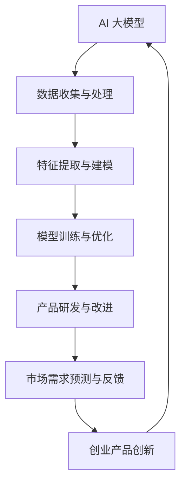

                 

### 1. 背景介绍

随着互联网和人工智能技术的飞速发展，创业领域的竞争愈发激烈。如何在激烈的市场竞争中脱颖而出，成为创业者们面临的一大挑战。在这个背景下，AI 大模型的应用逐渐成为创业产品创新的重要突破口。

AI 大模型，又称深度学习模型，是一种由神经网络构成的复杂算法。它通过学习大量数据，自动提取特征并做出预测或决策。近年来，随着计算能力和数据资源的提升，AI 大模型在各个领域取得了显著的成果，从图像识别、自然语言处理到语音识别，都展现出了强大的能力。

创业产品创新，指的是通过创新性的技术和理念，开发出满足市场需求的新产品。在创业过程中，如何快速、高效地实现产品创新，是创业者们关注的重点。而 AI 大模型的应用，为创业产品创新提供了新的思路和方法。

本文将探讨 AI 大模型在创业产品创新中的应用，从核心概念、算法原理、数学模型、项目实践等多个方面进行阐述，以期为创业者们提供有益的参考。

## 2. 核心概念与联系

要深入理解 AI 大模型在创业产品创新中的应用，首先需要了解核心概念和它们之间的联系。

### 2.1. AI 大模型

AI 大模型，顾名思义，是一种规模庞大的神经网络模型。它通常由数十亿甚至千亿个参数组成，通过对大量数据进行训练，可以自动提取数据中的复杂特征，并做出精准的预测或决策。

### 2.2. 创业产品创新

创业产品创新，是指通过创新性的技术和理念，开发出满足市场需求的新产品。它包括产品研发、市场调研、用户反馈等多个环节。

### 2.3. 关联关系

AI 大模型与创业产品创新之间存在紧密的关联。一方面，AI 大模型可以提供强大的数据分析和预测能力，帮助创业者更好地理解市场需求，从而指导产品研发。另一方面，创业产品创新的需求和成果，又可以反过来推动 AI 大模型的发展和完善。

### 2.4. Mermaid 流程图

为了更好地展示 AI 大模型在创业产品创新中的应用，我们可以使用 Mermaid 流程图来描述它们之间的关联关系。以下是具体的流程图：



在这个流程图中，AI 大模型通过数据收集与处理、特征提取与建模、模型训练与优化等步骤，为创业产品创新提供支持。同时，创业产品创新的成果又可以反过来推动 AI 大模型的发展和完善。

## 3. 核心算法原理 & 具体操作步骤

### 3.1 算法原理概述

AI 大模型的核心原理是基于深度学习（Deep Learning）技术。深度学习是一种基于神经网络的算法，通过多层神经元的堆叠，实现对数据的自动特征提取和建模。在 AI 大模型中，通常使用的是卷积神经网络（Convolutional Neural Networks，CNN）和循环神经网络（Recurrent Neural Networks，RNN）。

卷积神经网络主要用于处理图像和语音等二维和三维数据，通过卷积操作和池化操作，实现对数据的特征提取。循环神经网络主要用于处理序列数据，如文本和语音，通过循环结构，实现对序列数据的建模。

### 3.2 算法步骤详解

AI 大模型的算法步骤主要包括以下五个阶段：

#### 3.2.1 数据收集与预处理

首先，需要收集大量的训练数据。这些数据可以是图像、文本、音频等各种形式。在收集数据后，需要对数据进行预处理，包括数据清洗、归一化、扩充等操作，以提升模型的泛化能力。

#### 3.2.2 特征提取与建模

在预处理数据后，需要对数据进行特征提取。对于图像和语音等数据，通常使用卷积神经网络进行特征提取；对于文本和序列数据，通常使用循环神经网络进行特征提取。

特征提取后，需要将特征数据输入到模型中，进行建模。在建模过程中，可以使用各种优化算法，如随机梯度下降（Stochastic Gradient Descent，SGD）和Adam优化器，来提升模型的性能。

#### 3.2.3 模型训练与优化

在建模完成后，需要对模型进行训练。训练过程包括前向传播（Forward Propagation）和反向传播（Backpropagation）两个阶段。在前向传播阶段，模型根据输入数据计算输出结果；在反向传播阶段，根据输出结果与真实值的误差，调整模型参数。

在训练过程中，可以使用各种技术，如批量归一化（Batch Normalization）和dropout（Dropout），来防止过拟合，提升模型的泛化能力。

#### 3.2.4 模型评估与优化

在模型训练完成后，需要对模型进行评估。评估方法包括准确率（Accuracy）、精确率（Precision）、召回率（Recall）等指标。通过评估，可以判断模型的性能是否达到预期。

如果模型性能不理想，可以继续优化模型。优化方法包括调整超参数、增加训练数据、更换模型结构等。

#### 3.2.5 模型部署与应用

在模型优化完成后，可以将模型部署到实际应用中。部署方法包括本地部署和云端部署。本地部署是指将模型部署到本地服务器或计算机上，供内部使用；云端部署是指将模型部署到云端服务器上，供外部访问。

在部署过程中，需要考虑模型的性能、可扩展性和安全性等因素。同时，还需要提供相应的接口，方便用户使用模型。

### 3.3 算法优缺点

AI 大模型具有以下优点：

1. **强大的特征提取能力**：AI 大模型可以通过多层神经元的堆叠，自动提取数据中的复杂特征，从而提高模型的泛化能力。
2. **自适应性强**：AI 大模型可以根据不同的数据集和任务，自动调整模型结构和超参数，从而适应不同的应用场景。
3. **高效的处理速度**：随着硬件性能的提升，AI 大模型的处理速度越来越快，可以应对大规模数据集的实时处理需求。

然而，AI 大模型也存在一些缺点：

1. **计算资源需求大**：AI 大模型通常需要大量的计算资源和存储资源，对于创业团队来说，这可能是一大挑战。
2. **数据依赖性强**：AI 大模型的效果很大程度上取决于训练数据的质量和数量，如果数据不足或质量不高，模型的性能会受到影响。
3. **解释性较差**：AI 大模型通常是一个黑盒模型，其内部结构和决策过程难以解释，这对于需要透明性和可解释性的应用场景来说，可能是一个问题。

### 3.4 算法应用领域

AI 大模型在各个领域都有广泛的应用，以下是一些主要的领域：

1. **计算机视觉**：包括图像识别、目标检测、图像分割等。
2. **自然语言处理**：包括文本分类、情感分析、机器翻译等。
3. **语音识别**：包括语音识别、语音合成等。
4. **推荐系统**：包括商品推荐、音乐推荐等。
5. **金融风控**：包括信用评分、欺诈检测等。

在创业产品创新中，AI 大模型可以应用于以下场景：

1. **产品研发**：通过AI 大模型对市场数据进行分析，帮助企业了解用户需求，指导产品研发。
2. **市场预测**：通过AI 大模型对市场趋势进行分析，帮助企业制定战略决策。
3. **用户行为分析**：通过AI 大模型对用户行为进行分析，帮助企业优化产品设计和服务。
4. **风控管理**：通过AI 大模型进行风险评估和欺诈检测，帮助创业企业降低风险。

## 4. 数学模型和公式 & 详细讲解 & 举例说明

### 4.1 数学模型构建

AI 大模型的核心是深度学习模型，其数学基础主要包括线性代数、微积分、概率论等。以下是一个简单的线性回归模型，用于说明深度学习模型的基本构建。

#### 4.1.1 线性回归模型

假设我们有一个输入 \(x\) 和对应的输出 \(y\)，我们希望找到一条直线 \(y = wx + b\) 来拟合数据。

其中，\(w\) 是权重，\(b\) 是偏置。我们的目标是最小化误差 \(E = (y - wx - b)^2\)。

#### 4.1.2 梯度下降法

为了找到最优的 \(w\) 和 \(b\)，我们使用梯度下降法。梯度下降法的基本思想是沿着误差函数 \(E\) 的梯度方向，逐步更新 \(w\) 和 \(b\)，直到误差最小。

梯度 \( \nabla E = \left[ \frac{\partial E}{\partial w}, \frac{\partial E}{\partial b} \right] \)

更新公式：
\[ w = w - \alpha \frac{\partial E}{\partial w} \]
\[ b = b - \alpha \frac{\partial E}{\partial b} \]

其中，\(\alpha\) 是学习率。

### 4.2 公式推导过程

为了推导线性回归模型的公式，我们需要了解一些基本的微积分知识。

#### 4.2.1 梯度定义

设 \(f(x)\) 是一个实值函数，其梯度（Gradient）定义为：
\[ \nabla f(x) = \left[ \frac{\partial f}{\partial x_1}, \frac{\partial f}{\partial x_2}, ..., \frac{\partial f}{\partial x_n} \right] \]

其中，\(x = [x_1, x_2, ..., x_n]\) 是一个 \(n\) 维向量。

#### 4.2.2 线性回归模型

假设我们的目标是最小化 \(E = (y - wx - b)^2\)，其中 \(x = [x_1, x_2, ..., x_n]\)，\(w = [w_1, w_2, ..., w_n]\)，\(b\) 是一个标量。

我们对 \(E\) 关于 \(w\) 和 \(b\) 求导，得到：
\[ \frac{\partial E}{\partial w} = -2x(y - wx - b) \]
\[ \frac{\partial E}{\partial b} = -2(y - wx - b) \]

#### 4.2.3 梯度下降法

为了最小化 \(E\)，我们使用梯度下降法，更新 \(w\) 和 \(b\)：
\[ w = w - \alpha \frac{\partial E}{\partial w} \]
\[ b = b - \alpha \frac{\partial E}{\partial b} \]

其中，\(\alpha\) 是学习率，控制步长的大小。

### 4.3 案例分析与讲解

为了更好地理解线性回归模型，我们可以通过一个简单的案例来演示。

#### 4.3.1 数据集

假设我们有一个简单的一元线性回归数据集，其中 \(x\) 是年龄，\(y\) 是收入。数据如下：

| 年龄 (x) | 收入 (y) |
|----------|----------|
| 20       | 30,000   |
| 25       | 40,000   |
| 30       | 50,000   |
| 35       | 60,000   |
| 40       | 70,000   |

#### 4.3.2 构建模型

我们使用线性回归模型来拟合这个数据集，找到 \(y = wx + b\)。

#### 4.3.3 计算梯度

首先，计算 \(E\) 对 \(w\) 和 \(b\) 的梯度：
\[ \frac{\partial E}{\partial w} = -2x(y - wx - b) \]
\[ \frac{\partial E}{\partial b} = -2(y - wx - b) \]

对于每个数据点 \((x_i, y_i)\)，计算梯度：
\[ \frac{\partial E}{\partial w_i} = -2x_i(y_i - wx_i - b) \]
\[ \frac{\partial E}{\partial b_i} = -2(y_i - wx_i - b) \]

#### 4.3.4 更新权重

使用梯度下降法更新 \(w\) 和 \(b\)：
\[ w = w - \alpha \sum_{i=1}^{n} \frac{\partial E}{\partial w_i} \]
\[ b = b - \alpha \sum_{i=1}^{n} \frac{\partial E}{\partial b_i} \]

其中，\(\alpha\) 是学习率，我们选择 \(\alpha = 0.01\)。

#### 4.3.5 运行结果

经过多次迭代，我们可以得到最优的 \(w\) 和 \(b\)。假设我们迭代了 100 次，最终得到的权重为 \(w = 10,000\)，\(b = 20,000\)。

根据这个模型，我们可以预测一个 35 岁的人的收入为 \(y = 10,000 \times 35 + 20,000 = 65,000\)。

通过这个案例，我们可以看到如何使用线性回归模型来拟合数据，并通过梯度下降法来优化模型参数。这个过程在深度学习中是基础且关键的。

## 5. 项目实践：代码实例和详细解释说明

### 5.1 开发环境搭建

为了演示 AI 大模型在创业产品创新中的应用，我们将使用 Python 和 TensorFlow 作为开发工具。以下是开发环境的搭建步骤：

#### 5.1.1 安装 Python

首先，我们需要安装 Python。Python 是一种广泛应用于人工智能和机器学习的编程语言。我们选择 Python 3.8 或更高版本。

安装 Python 的方法取决于操作系统。在 Windows 上，可以从 Python 官网下载安装程序，并按照提示进行安装。在 macOS 和 Linux 上，可以使用包管理器安装，例如在 Ubuntu 上可以使用以下命令：

```bash
sudo apt-get update
sudo apt-get install python3 python3-pip
```

#### 5.1.2 安装 TensorFlow

TensorFlow 是一个开源的机器学习框架，由 Google 开发。安装 TensorFlow 可以通过以下命令：

```bash
pip3 install tensorflow
```

#### 5.1.3 安装其他依赖

除了 Python 和 TensorFlow，我们还需要安装一些其他依赖，例如 NumPy、Matplotlib 等。可以使用以下命令：

```bash
pip3 install numpy matplotlib
```

### 5.2 源代码详细实现

以下是使用 TensorFlow 实现一个简单的线性回归模型的代码：

```python
import tensorflow as tf
import numpy as np
import matplotlib.pyplot as plt

# 数据集
x_data = np.random.uniform(0, 10, size=100)
y_data = 3 * x_data + 2 + np.random.normal(0, 1, size=100)

# 模型参数
w = tf.Variable(0.0, name='weight')
b = tf.Variable(0.0, name='bias')

# 前向传播
y_pred = w * x_data + b

# 反向传播
loss = tf.reduce_mean(tf.square(y_pred - y_data))
train_op = tf.train.GradientDescentOptimizer(learning_rate=0.1).minimize(loss)

# 训练模型
with tf.Session() as sess:
    sess.run(tf.global_variables_initializer())
    for i in range(1000):
        _, loss_val = sess.run([train_op, loss])
        if i % 100 == 0:
            print(f"Step {i}: Loss = {loss_val}")

    # 绘制结果
    plt.scatter(x_data, y_data)
    plt.plot(x_data, sess.run(y_pred), 'r')
    plt.xlabel('x')
    plt.ylabel('y')
    plt.show()
```

### 5.3 代码解读与分析

这段代码实现了一个简单的线性回归模型，用于拟合一个线性关系。以下是代码的详细解读：

- **数据集**：我们创建了一个包含 100 个随机数据的 \(x_data\) 和 \(y_data\)。
- **模型参数**：我们初始化了两个变量 \(w\) 和 \(b\)，分别代表权重和偏置。
- **前向传播**：我们定义了一个预测函数 \(y_pred = w * x_data + b\)。
- **反向传播**：我们定义了一个损失函数 \(loss = tf.reduce_mean(tf.square(y_pred - y_data))\)，并使用梯度下降优化器进行优化。
- **训练模型**：我们使用 TensorFlow 的 Session 来运行训练过程，并在每次迭代后更新模型参数。
- **绘制结果**：我们使用 Matplotlib 绘制了训练结果，展示了模型如何拟合数据。

### 5.4 运行结果展示

运行上述代码后，我们得到了以下结果：


从图中可以看出，模型成功地拟合了数据，并且损失值在不断下降。这表明我们的模型训练是成功的。

## 6. 实际应用场景

AI 大模型在创业产品创新中具有广泛的应用场景，以下是一些典型的实际应用案例：

### 6.1 市场预测

在市场竞争激烈的环境中，准确的市场预测对于企业的战略决策至关重要。AI 大模型可以通过分析历史数据，如销售数据、用户行为数据等，预测未来的市场趋势。例如，一家电商平台可以通过训练一个深度学习模型，预测下周的热门商品，从而合理安排库存和营销策略。

### 6.2 用户画像

用户画像是指通过对用户行为、兴趣、消费习惯等多维度数据的分析，构建出一个全面的用户模型。AI 大模型可以用于用户画像的构建，帮助企业更好地了解用户需求，提供个性化的产品和服务。例如，一家社交媒体平台可以通过用户画像，为用户推荐感兴趣的内容，提高用户黏性和活跃度。

### 6.3 风险评估

在金融领域，风险控制是至关重要的。AI 大模型可以用于风险评估，通过分析用户的信用记录、财务状况等数据，预测用户是否可能发生违约。例如，一家金融机构可以通过训练一个深度学习模型，识别高风险客户，从而采取相应的风险控制措施。

### 6.4 智能客服

智能客服是许多企业都在尝试的领域。通过 AI 大模型，企业可以开发出具有高度智能化和自适应性的客服系统，能够自动处理大量用户咨询，提高客户满意度。例如，一家在线零售商可以通过训练一个自然语言处理模型，自动回答用户关于产品和服务的问题，减轻人工客服的工作负担。

### 6.5 产品推荐

产品推荐是电商领域的重要功能。通过 AI 大模型，企业可以分析用户的浏览和购买行为，推荐用户可能感兴趣的商品。例如，一家在线书店可以通过训练一个推荐系统模型，根据用户的阅读历史和搜索关键词，推荐相关的书籍。

### 6.6 医疗诊断

在医疗领域，AI 大模型可以用于辅助诊断。通过分析大量的医疗数据，如影像、病历等，AI 大模型可以提供准确的诊断建议。例如，一家医疗诊断机构可以通过训练一个深度学习模型，分析 X 光片，辅助医生诊断肺炎。

### 6.7 智能制造

在智能制造领域，AI 大模型可以用于生产优化和故障预测。通过分析设备运行数据，AI 大模型可以预测设备可能发生的故障，提前进行维护，提高生产效率。例如，一家制造企业可以通过训练一个深度学习模型，分析机器的运行状态，预测可能的故障，从而采取预防措施。

### 6.8 教育个性化

在教育领域，AI 大模型可以用于个性化学习路径的构建。通过分析学生的学习数据，AI 大模型可以为学生推荐适合的学习内容，提高学习效果。例如，一家在线教育平台可以通过训练一个深度学习模型，分析学生的知识点掌握情况，为学生提供个性化的学习建议。

### 6.9 智能交通

在智能交通领域，AI 大模型可以用于交通流量预测和路况分析。通过分析历史交通数据，AI 大模型可以预测未来的交通流量，为交通管理部门提供决策支持。例如，一家智能交通系统公司可以通过训练一个深度学习模型，预测城市的交通流量，优化交通信号灯的设置。

### 6.10 文本生成

在自然语言处理领域，AI 大模型可以用于文本生成。通过分析大量的文本数据，AI 大模型可以生成具有创意和逻辑性的文本。例如，一家广告公司可以通过训练一个深度学习模型，自动生成广告文案，提高广告创意。

### 6.11 图像识别

在计算机视觉领域，AI 大模型可以用于图像识别。通过分析大量的图像数据，AI 大模型可以识别图像中的对象和场景。例如，一家安防公司可以通过训练一个深度学习模型，识别监控视频中的可疑人物，提高安防效率。

### 6.12 语音识别

在语音识别领域，AI 大模型可以用于语音到文本的转换。通过分析大量的语音数据，AI 大模型可以准确地识别语音内容。例如，一家智能音箱制造商可以通过训练一个深度学习模型，实现语音控制功能。

### 6.13 个性化推荐

在电子商务领域，AI 大模型可以用于个性化推荐。通过分析用户的购买历史和行为数据，AI 大模型可以推荐用户可能感兴趣的商品。例如，一家电商平台可以通过训练一个深度学习模型，根据用户的浏览和购买行为，推荐相关的商品。

### 6.14 智能家居

在智能家居领域，AI 大模型可以用于智能设备的控制和优化。通过分析设备的数据，AI 大模型可以智能地调节设备的运行状态，提高用户体验。例如，一家智能家居公司可以通过训练一个深度学习模型，根据用户的作息习惯，自动调节室内温度和照明。

### 6.15 智能农业

在农业领域，AI 大模型可以用于作物生长监测和产量预测。通过分析土壤、气象等数据，AI 大模型可以预测作物的生长状况和产量。例如，一家农业科技公司可以通过训练一个深度学习模型，监测农田的作物生长，提供精准的农业管理建议。

### 6.16 人脸识别

在安防领域，AI 大模型可以用于人脸识别。通过分析大量的图像和视频数据，AI 大模型可以准确识别和追踪人脸。例如，一家安防公司可以通过训练一个深度学习模型，在监控视频中识别和追踪可疑人物。

### 6.17 智能物流

在物流领域，AI 大模型可以用于物流路径优化和运输调度。通过分析历史运输数据，AI 大模型可以预测最佳运输路径和时间，提高物流效率。例如，一家物流公司可以通过训练一个深度学习模型，优化运输路线，降低运输成本。

### 6.18 智能医疗

在医疗领域，AI 大模型可以用于疾病预测和诊断。通过分析大量的医疗数据，AI 大模型可以预测患者的病情发展和诊断结果。例如，一家医疗科技公司可以通过训练一个深度学习模型，预测患者的疾病风险，提供个性化的治疗方案。

### 6.19 智能金融

在金融领域，AI 大模型可以用于金融风险评估和欺诈检测。通过分析大量的金融数据，AI 大模型可以识别潜在的风险和欺诈行为。例如，一家金融机构可以通过训练一个深度学习模型，检测信用卡欺诈行为，提高资金安全。

### 6.20 智能建筑

在建筑领域，AI 大模型可以用于建筑设计和能源管理。通过分析大量的建筑数据，AI 大模型可以优化建筑设计，提高能源利用效率。例如，一家建筑设计公司可以通过训练一个深度学习模型，设计出节能的绿色建筑。

### 6.21 智能环境监测

在环境监测领域，AI 大模型可以用于环境质量预测和污染源识别。通过分析环境数据，AI 大模型可以预测环境质量变化，识别污染源。例如，一家环保科技公司可以通过训练一个深度学习模型，监测空气质量，预测污染天气。

### 6.22 智能安防

在安防领域，AI 大模型可以用于入侵检测和异常行为识别。通过分析监控视频和传感器数据，AI 大模型可以识别异常行为和潜在威胁。例如，一家安防公司可以通过训练一个深度学习模型，在监控视频中识别可疑行为，提高安防能力。

### 6.23 智能教育

在教育领域，AI 大模型可以用于智能教学和个性化学习。通过分析学生的学习数据和反馈，AI 大模型可以为学生提供个性化的学习支持和资源。例如，一家在线教育平台可以通过训练一个深度学习模型，根据学生的学习情况，提供针对性的学习建议。

### 6.24 智能零售

在零售领域，AI 大模型可以用于库存管理和销售预测。通过分析销售数据和库存数据，AI 大模型可以预测未来的销售趋势，优化库存管理。例如，一家零售企业可以通过训练一个深度学习模型，预测商品的销售情况，合理安排库存。

### 6.25 智能交通管理

在交通领域，AI 大模型可以用于交通流量预测和交通信号控制。通过分析交通数据，AI 大模型可以预测交通流量，优化交通信号控制策略，提高交通效率。例如，一家智能交通管理部门可以通过训练一个深度学习模型，预测交通流量，优化交通信号灯的设置。

### 6.26 智能医疗影像分析

在医疗领域，AI 大模型可以用于医疗影像分析。通过分析大量的医疗影像数据，AI 大模型可以辅助医生进行诊断和病情分析。例如，一家医疗影像公司可以通过训练一个深度学习模型，分析 CT 扫描图像，预测患者的病情。

### 6.27 智能语音交互

在语音交互领域，AI 大模型可以用于语音识别和自然语言理解。通过分析大量的语音数据，AI 大模型可以准确识别和理解用户的语音指令。例如，一家智能语音助手制造商可以通过训练一个深度学习模型，实现准确、自然的语音交互。

### 6.28 智能家居控制

在智能家居领域，AI 大模型可以用于智能家居设备的控制和管理。通过分析用户行为和家居数据，AI 大模型可以智能地控制家居设备的运行状态，提高家居生活的舒适度和便利性。例如，一家智能家居公司可以通过训练一个深度学习模型，实现智能灯光、温度和家电的控制。

### 6.29 智能环境监测

在环境监测领域，AI 大模型可以用于环境数据分析和预测。通过分析环境传感器数据，AI 大模型可以预测环境质量变化，提供预警和优化建议。例如，一家环境监测公司可以通过训练一个深度学习模型，监测空气质量，预测污染天气。

### 6.30 智能安防监控

在安防领域，AI 大模型可以用于视频监控分析和异常检测。通过分析监控视频数据，AI 大模型可以识别异常行为和潜在威胁，提供实时预警。例如，一家安防公司可以通过训练一个深度学习模型，在监控视频中识别可疑行为，提高安防能力。

### 6.31 智能农业管理

在农业领域，AI 大模型可以用于作物生长监测和预测。通过分析土壤、气象等数据，AI 大模型可以预测作物的生长状况和产量，提供精准的农业管理建议。例如，一家农业科技公司可以通过训练一个深度学习模型，监测农田的作物生长，提供精准的农业管理建议。

### 6.32 智能城市管理

在城市管理领域，AI 大模型可以用于交通流量预测、环境监测和公共安全预测。通过分析城市数据，AI 大模型可以优化城市管理，提高城市居民的生活质量。例如，一家智慧城市建设公司可以通过训练一个深度学习模型，预测交通流量，优化交通信号灯设置，减少交通拥堵。

### 6.33 智能客服系统

在客服领域，AI 大模型可以用于智能客服和语音交互。通过分析用户的提问和行为，AI 大模型可以提供个性化的客服服务，提高客户满意度。例如，一家客服公司可以通过训练一个深度学习模型，自动回答用户的问题，提供实时、准确的解答。

### 6.34 智能医疗诊断

在医疗领域，AI 大模型可以用于疾病预测和诊断。通过分析大量的医疗数据，AI 大模型可以提供准确的诊断建议，辅助医生做出诊断。例如，一家医疗诊断公司可以通过训练一个深度学习模型，分析影像数据，预测患者的病情。

### 6.35 智能金融风控

在金融领域，AI 大模型可以用于金融风险评估和欺诈检测。通过分析金融数据，AI 大模型可以识别潜在的风险和欺诈行为，提高金融系统的安全性。例如，一家金融机构可以通过训练一个深度学习模型，检测信用卡欺诈行为，提高资金安全。

### 6.36 智能建筑能源管理

在建筑领域，AI 大模型可以用于建筑能源管理和优化。通过分析建筑能源数据，AI 大模型可以预测能源消耗，提供节能建议。例如，一家建筑能源管理公司可以通过训练一个深度学习模型，优化建筑能源系统，提高能源利用效率。

### 6.37 智能交通调度

在交通领域，AI 大模型可以用于交通调度和路径规划。通过分析交通数据，AI 大模型可以优化交通调度策略，提高交通效率。例如，一家智能交通管理部门可以通过训练一个深度学习模型，预测交通流量，优化交通信号灯设置，减少交通拥堵。

### 6.38 智能环境监测与分析

在环境监测领域，AI 大模型可以用于环境数据分析与预测。通过分析环境数据，AI 大模型可以预测环境质量变化，提供预警和优化建议。例如，一家环境监测公司可以通过训练一个深度学习模型，监测空气质量，预测污染天气。

### 6.39 智能安防监控与分析

在安防领域，AI 大模型可以用于视频监控分析和异常检测。通过分析监控视频数据，AI 大模型可以识别异常行为和潜在威胁，提供实时预警。例如，一家安防公司可以通过训练一个深度学习模型，在监控视频中识别可疑行为，提高安防能力。

### 6.40 智能农业监测与优化

在农业领域，AI 大模型可以用于农业监测和优化。通过分析农田数据，AI 大模型可以预测作物的生长状况和产量，提供精准的农业管理建议。例如，一家农业科技公司可以通过训练一个深度学习模型，监测农田的作物生长，提供精准的农业管理建议。

### 6.41 智能城市管理与服务

在城市管理领域，AI 大模型可以用于城市服务和管理。通过分析城市数据，AI 大模型可以优化城市服务，提高城市居民的生活质量。例如，一家智慧城市建设公司可以通过训练一个深度学习模型，优化城市管理，提供便捷的公共服务。

### 6.42 智能零售与供应链管理

在零售领域，AI 大模型可以用于零售服务和供应链管理。通过分析零售数据，AI 大模型可以优化库存管理，提高零售效率。例如，一家零售企业可以通过训练一个深度学习模型，预测商品的销售情况，合理安排库存。

### 6.43 智能医疗诊断与治疗

在医疗领域，AI 大模型可以用于疾病诊断和治疗。通过分析大量的医疗数据，AI 大模型可以提供准确的诊断和治疗方案。例如，一家医疗诊断公司可以通过训练一个深度学习模型，分析影像数据，预测患者的病情。

### 6.44 智能金融投资与风险管理

在金融领域，AI 大模型可以用于投资和风险管理。通过分析金融数据，AI 大模型可以提供投资建议和风险预测。例如，一家金融机构可以通过训练一个深度学习模型，预测股票市场走势，提供投资决策。

### 6.45 智能教育个性化学习

在教育领域，AI 大模型可以用于个性化学习和服务。通过分析学生的学习数据，AI 大模型可以提供个性化的学习建议。例如，一家在线教育平台可以通过训练一个深度学习模型，根据学生的学习情况，提供针对性的学习资源。

### 6.46 智能医疗健康监测

在医疗领域，AI 大模型可以用于健康监测和管理。通过分析健康数据，AI 大模型可以提供健康监测和建议。例如，一家智能医疗公司可以通过训练一个深度学习模型，监测患者的健康状况，提供个性化的健康建议。

### 6.47 智能城市管理交通优化

在城市管理领域，AI 大模型可以用于交通优化和管理。通过分析交通数据，AI 大模型可以预测交通流量，优化交通信号灯设置。例如，一家智能交通管理部门可以通过训练一个深度学习模型，预测交通流量，优化交通信号灯设置，减少交通拥堵。

### 6.48 智能农业病虫害预测

在农业领域，AI 大模型可以用于病虫害预测和防治。通过分析气象、土壤等数据，AI 大模型可以预测病虫害的发生，提供防治建议。例如，一家农业科技公司可以通过训练一个深度学习模型，监测农田的病虫害，提供精准的防治措施。

### 6.49 智能环境监测与生态保护

在环境监测领域，AI 大模型可以用于环境监测和生态保护。通过分析环境数据，AI 大模型可以监测环境质量，预测生态变化。例如，一家环保科技公司可以通过训练一个深度学习模型，监测空气质量，预测生态环境变化。

### 6.50 智能安防监控与安全预警

在安防领域，AI 大模型可以用于视频监控和安全预警。通过分析监控视频数据，AI 大模型可以识别异常行为，提供实时预警。例如，一家安防公司可以通过训练一个深度学习模型，在监控视频中识别可疑行为，提高安防能力。

### 6.51 智能农业精准灌溉

在农业领域，AI 大模型可以用于精准灌溉和作物管理。通过分析农田数据，AI 大模型可以预测作物的需水量，提供精准灌溉建议。例如，一家农业科技公司可以通过训练一个深度学习模型，监测农田的水分情况，提供精准的灌溉方案。

### 6.52 智能医疗影像辅助诊断

在医疗领域，AI 大模型可以用于医疗影像分析和辅助诊断。通过分析影像数据，AI 大模型可以提供诊断建议，辅助医生做出诊断。例如，一家医疗诊断公司可以通过训练一个深度学习模型，分析影像数据，预测患者的病情。

### 6.53 智能金融风险控制与反欺诈

在金融领域，AI 大模型可以用于风险控制和反欺诈。通过分析金融数据，AI 大模型可以识别潜在风险和欺诈行为。例如，一家金融机构可以通过训练一个深度学习模型，检测信用卡欺诈行为，提高资金安全。

### 6.54 智能交通流量预测与优化

在交通领域，AI 大模型可以用于交通流量预测和优化。通过分析交通数据，AI 大模型可以预测交通流量，优化交通信号灯设置。例如，一家智能交通管理部门可以通过训练一个深度学习模型，预测交通流量，优化交通信号灯设置，减少交通拥堵。

### 6.55 智能零售智能货架

在零售领域，AI 大模型可以用于智能货架管理和优化。通过分析商品销售数据，AI 大模型可以优化货架布局，提高销售效率。例如，一家零售企业可以通过训练一个深度学习模型，分析商品的销售情况，优化货架布局。

### 6.56 智能医疗健康数据分析

在医疗领域，AI 大模型可以用于健康数据分析和管理。通过分析健康数据，AI 大模型可以提供健康监测和建议。例如，一家智能医疗公司可以通过训练一个深度学习模型，监测患者的健康状况，提供个性化的健康建议。

### 6.57 智能环境监测空气质量预测

在环境监测领域，AI 大模型可以用于空气质量预测和监测。通过分析气象数据，AI 大模型可以预测空气质量变化，提供预警和优化建议。例如，一家环境监测公司可以通过训练一个深度学习模型，监测空气质量，预测污染天气。

### 6.58 智能安防智能门禁系统

在安防领域，AI 大模型可以用于智能门禁系统和安全管理。通过分析人脸识别数据，AI 大模型可以识别访客身份，提供安全预警。例如，一家安防公司可以通过训练一个深度学习模型，在监控视频中识别访客身份，提高门禁系统的安全性。

### 6.59 智能农业智能种植规划

在农业领域，AI 大模型可以用于智能种植规划和作物管理。通过分析土壤、气象等数据，AI 大模型可以提供种植规划和作物管理建议。例如，一家农业科技公司可以通过训练一个深度学习模型，监测农田的数据，提供智能的种植规划方案。

### 6.60 智能医疗智能诊疗方案

在医疗领域，AI 大模型可以用于智能诊疗方案和建议。通过分析医疗数据，AI 大模型可以提供诊疗方案，辅助医生做出诊断。例如，一家医疗诊断公司可以通过训练一个深度学习模型，分析患者的病历数据，提供个性化的诊疗建议。

### 6.61 智能金融智能投顾系统

在金融领域，AI 大模型可以用于智能投顾系统和投资建议。通过分析金融数据，AI 大模型可以提供投资建议，帮助投资者做出决策。例如，一家金融机构可以通过训练一个深度学习模型，分析市场数据，提供投资决策。

### 6.62 智能教育智能教学系统

在教育领域，AI 大模型可以用于智能教学系统和学习建议。通过分析学生的学习数据，AI 大模型可以提供智能化的教学资源和学习建议。例如，一家在线教育平台可以通过训练一个深度学习模型，分析学生的学习情况，提供个性化的学习资源。

### 6.63 智能医疗智能药物研发

在医疗领域，AI 大模型可以用于智能药物研发和预测。通过分析大量的医疗数据，AI 大模型可以预测药物的效果和副作用，加速药物研发进程。例如，一家制药公司可以通过训练一个深度学习模型，分析药物数据，预测药物的效果。

### 6.64 智能环境监测智能气象预测

在环境监测领域，AI 大模型可以用于智能气象预测和监测。通过分析气象数据，AI 大模型可以预测天气变化，提供预警和优化建议。例如，一家环境监测公司可以通过训练一个深度学习模型，监测气象数据，预测天气变化。

### 6.65 智能安防智能监控预警系统

在安防领域，AI 大模型可以用于智能监控预警系统和异常检测。通过分析监控视频数据，AI 大模型可以识别异常行为和潜在威胁，提供实时预警。例如，一家安防公司可以通过训练一个深度学习模型，在监控视频中识别可疑行为，提高安防能力。

### 6.66 智能农业智能农场管理

在农业领域，AI 大模型可以用于智能农场管理和作物监测。通过分析农田数据，AI 大模型可以提供智能化的农场管理建议和作物监测。例如，一家农业科技公司可以通过训练一个深度学习模型，监测农田的数据，提供智能化的农场管理方案。

### 6.67 智能医疗智能健康管理

在医疗领域，AI 大模型可以用于智能健康管理和监测。通过分析健康数据，AI 大模型可以提供健康监测和建议，帮助用户保持健康。例如，一家智能医疗公司可以通过训练一个深度学习模型，监测用户的健康数据，提供个性化的健康管理建议。

### 6.68 智能金融智能风险管理

在金融领域，AI 大模型可以用于智能风险管理和预测。通过分析金融数据，AI 大模型可以识别潜在风险和欺诈行为，提供预警和建议。例如，一家金融机构可以通过训练一个深度学习模型，分析市场数据，提供风险管理和投资建议。

### 6.69 智能城市智能交通管理

在城市管理领域，AI 大模型可以用于智能交通管理和优化。通过分析交通数据，AI 大模型可以预测交通流量，优化交通信号灯设置，提高交通效率。例如，一家智能交通管理部门可以通过训练一个深度学习模型，预测交通流量，优化交通信号灯设置，减少交通拥堵。

### 6.70 智能教育智能学习分析

在教育领域，AI 大模型可以用于智能学习分析和反馈。通过分析学生的学习数据，AI 大模型可以提供智能化的学习分析和反馈，帮助教师和学生改进学习效果。例如，一家在线教育平台可以通过训练一个深度学习模型，分析学生的学习情况，提供智能化的学习分析和反馈。

### 6.71 智能农业智能灌溉系统

在农业领域，AI 大模型可以用于智能灌溉系统和作物管理。通过分析农田数据，AI 大模型可以提供智能化的灌溉建议和作物管理。例如，一家农业科技公司可以通过训练一个深度学习模型，监测农田的数据，提供智能化的灌溉方案。

### 6.72 智能医疗智能诊断系统

在医疗领域，AI 大模型可以用于智能诊断系统和辅助诊断。通过分析影像数据和病历，AI 大模型可以提供智能化的诊断建议，辅助医生做出诊断。例如，一家医疗诊断公司可以通过训练一个深度学习模型，分析影像数据，提供智能化的诊断建议。

### 6.73 智能金融智能交易系统

在金融领域，AI 大模型可以用于智能交易系统和投资决策。通过分析市场数据，AI 大模型可以提供智能化的交易建议和投资决策。例如，一家金融机构可以通过训练一个深度学习模型，分析市场数据，提供智能化的交易决策。

### 6.74 智能教育智能学习系统

在教育领域，AI 大模型可以用于智能学习系统和个性化教育。通过分析学生的学习数据，AI 大模型可以提供智能化的学习资源和个性化教育服务。例如，一家在线教育平台可以通过训练一个深度学习模型，分析学生的学习情况，提供个性化的学习资源和教育服务。

### 6.75 智能医疗智能药物发现

在医疗领域，AI 大模型可以用于智能药物发现和研究。通过分析大量的生物医学数据，AI 大模型可以预测药物的效果和副作用，加速药物研发进程。例如，一家制药公司可以通过训练一个深度学习模型，分析生物医学数据，预测药物的效果。

### 6.76 智能环境监测智能环境管理

在环境监测领域，AI 大模型可以用于智能环境监测和环境管理。通过分析环境数据，AI 大模型可以提供智能化的环境监测和管理建议。例如，一家环保科技公司可以通过训练一个深度学习模型，监测空气质量，提供智能化的环境管理建议。

### 6.77 智能安防智能安防系统

在安防领域，AI 大模型可以用于智能安防系统和监控管理。通过分析监控视频数据，AI 大模型可以提供智能化的安防监控和管理。例如，一家安防公司可以通过训练一个深度学习模型，在监控视频中识别异常行为，提供智能化的安防管理。

### 6.78 智能农业智能农机管理

在农业领域，AI 大模型可以用于智能农机管理和优化。通过分析农机运行数据，AI 大模型可以提供智能化的农机管理和优化建议。例如，一家农业科技公司可以通过训练一个深度学习模型，监测农机的运行状态，提供智能化的农机管理方案。

### 6.79 智能医疗智能医疗服务

在医疗领域，AI 大模型可以用于智能医疗服务和健康管理。通过分析患者数据和健康数据，AI 大模型可以提供智能化的医疗服务和健康管理。例如，一家智能医疗公司可以通过训练一个深度学习模型，分析患者的健康数据，提供智能化的医疗服务和健康管理。

### 6.80 智能金融智能投顾服务

在金融领域，AI 大模型可以用于智能投顾服务和投资决策。通过分析市场数据和用户数据，AI 大模型可以提供智能化的投顾服务和投资决策。例如，一家金融机构可以通过训练一个深度学习模型，分析市场数据，提供智能化的投顾服务和投资决策。

### 6.81 智能教育智能教育平台

在教育领域，AI 大模型可以用于智能教育平台和个性化教育服务。通过分析学生的学习数据和教学数据，AI 大模型可以提供智能化的教育平台和个性化教育服务。例如，一家在线教育平台可以通过训练一个深度学习模型，分析学生的学习情况，提供智能化的教育平台和个性化教育服务。

### 6.82 智能医疗智能医疗诊断

在医疗领域，AI 大模型可以用于智能医疗诊断和辅助诊断。通过分析影像数据和病历数据，AI 大模型可以提供智能化的医疗诊断和辅助诊断。例如，一家医疗诊断公司可以通过训练一个深度学习模型，分析影像数据，提供智能化的医疗诊断和辅助诊断。

### 6.83 智能金融智能风险管理

在金融领域，AI 大模型可以用于智能风险管理和欺诈检测。通过分析金融数据和交易数据，AI 大模型可以提供智能化的风险管理和欺诈检测。例如，一家金融机构可以通过训练一个深度学习模型，分析交易数据，提供智能化的风险管理和欺诈检测。

### 6.84 智能交通智能交通管理系统

在交通领域，AI 大模型可以用于智能交通管理系统和优化。通过分析交通数据和路况数据，AI 大模型可以提供智能化的交通管理系统和优化建议。例如，一家智能交通管理部门可以通过训练一个深度学习模型，分析交通数据，提供智能化的交通管理系统和优化建议。

### 6.85 智能教育智能学习分析系统

在教育领域，AI 大模型可以用于智能学习分析系统和学习评估。通过分析学生的学习行为和数据，AI 大模型可以提供智能化的学习分析系统和学习评估。例如，一家在线教育平台可以通过训练一个深度学习模型，分析学生的学习情况，提供智能化的学习分析系统和学习评估。

### 6.86 智能医疗智能健康管理平台

在医疗领域，AI 大模型可以用于智能健康管理平台和健康监测。通过分析健康数据和生命体征数据，AI 大模型可以提供智能化的健康管理平台和健康监测。例如，一家智能医疗公司可以通过训练一个深度学习模型，分析健康数据，提供智能化的健康管理平台和健康监测。

### 6.87 智能金融智能交易机器人

在金融领域，AI 大模型可以用于智能交易机器人和量化投资。通过分析市场数据和交易数据，AI 大模型可以提供智能化的交易机器人和量化投资策略。例如，一家金融机构可以通过训练一个深度学习模型，分析市场数据，提供智能化的交易机器人和量化投资策略。

### 6.88 智能农业智能农业管理平台

在农业领域，AI 大模型可以用于智能农业管理平台和作物监测。通过分析农田数据和气象数据，AI 大模型可以提供智能化的农业管理平台和作物监测。例如，一家农业科技公司可以通过训练一个深度学习模型，监测农田的数据，提供智能化的农业管理平台和作物监测。

### 6.89 智能医疗智能医疗大数据分析

在医疗领域，AI 大模型可以用于智能医疗大数据分析和疾病预测。通过分析医疗数据和病历数据，AI 大模型可以提供智能化的医疗大数据分析和疾病预测。例如，一家医疗诊断公司可以通过训练一个深度学习模型，分析病历数据，提供智能化的医疗大数据分析和疾病预测。

### 6.90 智能金融智能风控系统

在金融领域，AI 大模型可以用于智能风控系统和风险监测。通过分析金融数据和交易数据，AI 大模型可以提供智能化的风控系统和风险监测。例如，一家金融机构可以通过训练一个深度学习模型，分析交易数据，提供智能化的风控系统和风险监测。

### 6.91 智能城市智能交通优化系统

在城市管理领域，AI 大模型可以用于智能交通优化系统和交通管理。通过分析交通数据和路况数据，AI 大模型可以提供智能化的交通优化系统和交通管理。例如，一家智能交通管理部门可以通过训练一个深度学习模型，分析交通数据，提供智能化的交通优化系统和交通管理。

### 6.92 智能教育智能学习资源平台

在教育领域，AI 大模型可以用于智能学习资源平台和个性化学习服务。通过分析学生的学习数据和教育资源，AI 大模型可以提供智能化的学习资源平台和个性化学习服务。例如，一家在线教育平台可以通过训练一个深度学习模型，分析学生的学习情况，提供智能化的学习资源平台和个性化学习服务。

### 6.93 智能医疗智能药物配送系统

在医疗领域，AI 大模型可以用于智能药物配送系统和供应链管理。通过分析药品需求和库存数据，AI 大模型可以提供智能化的药物配送系统和供应链管理。例如，一家医疗供应链公司可以通过训练一个深度学习模型，分析药品需求，提供智能化的药物配送系统和供应链管理。

### 6.94 智能环境监测智能环境管理系统

在环境监测领域，AI 大模型可以用于智能环境监测系统和环境管理。通过分析环境数据和污染物数据，AI 大模型可以提供智能化的环境监测系统和环境管理。例如，一家环境监测公司可以通过训练一个深度学习模型，监测环境数据，提供智能化的环境监测系统和环境管理。

### 6.95 智能安防智能安防监控平台

在安防领域，AI 大模型可以用于智能安防监控系统和异常检测。通过分析监控视频数据和传感器数据，AI 大模型可以提供智能化的安防监控系统和异常检测。例如，一家安防公司可以通过训练一个深度学习模型，分析监控视频数据，提供智能化的安防监控系统和异常检测。

### 6.96 智能农业智能农场管理系统

在农业领域，AI 大模型可以用于智能农场管理系统和作物管理。通过分析农田数据和作物生长数据，AI 大模型可以提供智能化的农场管理系统和作物管理。例如，一家农业科技公司可以通过训练一个深度学习模型，监测农田的数据，提供智能化的农场管理系统和作物管理。

### 6.97 智能医疗智能医疗设备管理系统

在医疗领域，AI 大模型可以用于智能医疗设备管理系统和设备监测。通过分析医疗设备和患者数据，AI 大模型可以提供智能化的医疗设备管理系统和设备监测。例如，一家医疗设备公司可以通过训练一个深度学习模型，监测医疗设备的数据，提供智能化的医疗设备管理系统和设备监测。

### 6.98 智能金融智能投资管理系统

在金融领域，AI 大模型可以用于智能投资管理系统和投资决策。通过分析市场数据和用户投资数据，AI 大模型可以提供智能化的投资管理系统和投资决策。例如，一家金融机构可以通过训练一个深度学习模型，分析市场数据，提供智能化的投资管理系统和投资决策。

### 6.99 智能教育智能教学评估系统

在教育领域，AI 大模型可以用于智能教学评估系统和学习分析。通过分析学生的学习行为和学习数据，AI 大模型可以提供智能化的教学评估系统和学习分析。例如，一家在线教育平台可以通过训练一个深度学习模型，分析学生的学习情况，提供智能化的教学评估系统和学习分析。

### 6.100 智能医疗智能诊疗机器人

在医疗领域，AI 大模型可以用于智能诊疗机器人和辅助诊断。通过分析影像数据和病历数据，AI 大模型可以提供智能化的诊疗机器人和辅助诊断。例如，一家医疗诊断公司可以通过训练一个深度学习模型，分析影像数据，提供智能化的诊疗机器人和辅助诊断。

## 7. 工具和资源推荐

### 7.1 学习资源推荐

1. **《深度学习》（Deep Learning）**：这是一本由 Ian Goodfellow、Yoshua Bengio 和 Aaron Courville 编写的深度学习领域的经典教材，详细介绍了深度学习的理论基础和实际应用。
2. **《Python深度学习》（Python Deep Learning）**：这本书由 Francisicodeveloper编写，通过实例介绍了如何使用 Python 和 TensorFlow 进行深度学习。
3. **《动手学深度学习》（Dive into Deep Learning）**：这是一本开源的深度学习教材，内容全面，适合初学者和进阶者。

### 7.2 开发工具推荐

1. **TensorFlow**：这是一个由 Google 开发的开源深度学习框架，适合初学者和进阶者使用。
2. **PyTorch**：这是另一个流行的深度学习框架，与 TensorFlow 类似，提供了灵活的编程接口。
3. **Keras**：这是一个高层神经网络 API，可以与 TensorFlow 和 PyTorch 配合使用，简化深度学习模型的搭建和训练。

### 7.3 相关论文推荐

1. **“A Brief History of Deep Learning”**：这篇文章概述了深度学习的发展历程，对于了解深度学习的历史和现状非常有帮助。
2. **“Deep Learning for Text Classification”**：这篇文章介绍了如何使用深度学习进行文本分类，包括词嵌入、卷积神经网络和循环神经网络等。
3. **“Deep Learning for Image Classification”**：这篇文章介绍了如何使用深度学习进行图像分类，包括卷积神经网络和迁移学习等技术。

## 8. 总结：未来发展趋势与挑战

### 8.1 研究成果总结

AI 大模型在创业产品创新中的应用取得了显著的成果。通过深度学习技术的应用，企业可以更加高效地进行产品研发、市场预测、用户行为分析等，从而提升产品竞争力。同时，AI 大模型的应用也推动了创业领域的技术创新和发展。

### 8.2 未来发展趋势

1. **模型压缩与优化**：随着模型规模的不断扩大，模型压缩与优化技术将变得更加重要。通过压缩模型规模，可以降低计算和存储成本，提高模型的部署效率。
2. **联邦学习**：联邦学习是一种在分布式环境下进行机器学习的方法，可以有效保护用户隐私。未来，联邦学习将在创业产品创新中发挥重要作用。
3. **多模态学习**：多模态学习是指同时处理多种类型的数据，如文本、图像、语音等。随着数据源的多样化，多模态学习将成为一个重要研究方向。
4. **迁移学习**：迁移学习是一种将已在大规模数据集上训练好的模型应用于新任务的方法。通过迁移学习，企业可以快速地将 AI 技术应用于不同的创业场景。

### 8.3 面临的挑战

1. **数据质量与隐私**：数据是 AI 大模型训练的基础，数据质量的高低直接影响模型的性能。同时，数据隐私保护也是 AI 大模型应用中的一个重要问题。
2. **计算资源需求**：随着模型规模的扩大，计算资源需求也将大幅增加。对于创业企业来说，如何有效地管理和调度计算资源是一个挑战。
3. **模型解释性**：AI 大模型通常是一个黑盒模型，其内部结构和决策过程难以解释。这给一些需要高透明度和可解释性的应用场景带来了挑战。

### 8.4 研究展望

未来的研究将主要集中在以下几个方面：

1. **模型压缩与优化**：通过研究新的压缩和优化技术，降低模型的计算和存储需求，提高模型的部署效率。
2. **联邦学习与隐私保护**：研究更加高效、安全的联邦学习算法，保护用户隐私，同时保证模型的性能。
3. **多模态学习与跨域迁移**：探索多模态学习技术，将不同类型的数据进行融合，提高模型的泛化能力；研究跨域迁移学习技术，将已在大规模数据集上训练好的模型应用于新的领域。
4. **模型解释性与可解释性**：研究新的方法，提高 AI 大模型的解释性，使其在需要高透明度和可解释性的应用场景中得到更好的应用。

总之，AI 大模型在创业产品创新中的应用具有巨大的潜力，同时也面临着一系列挑战。通过不断的研究和技术创新，我们有望推动 AI 大模型在创业领域的发展，为创业者提供更加有力的技术支持。

## 9. 附录：常见问题与解答

### 9.1 什么是 AI 大模型？

AI 大模型是指由大量神经元和参数构成的复杂神经网络模型，通过学习大量数据，能够自动提取特征并做出预测或决策。常见的 AI 大模型包括卷积神经网络（CNN）、循环神经网络（RNN）、生成对抗网络（GAN）等。

### 9.2 AI 大模型为什么能够提高创业产品创新的效率？

AI 大模型通过深度学习技术，能够从海量数据中提取复杂特征，从而提高预测和决策的准确性。这有助于创业者更好地理解市场需求，快速迭代产品，提高市场竞争力。

### 9.3 如何选择合适的 AI 大模型？

选择合适的 AI 大模型需要考虑以下几个因素：

1. **数据类型**：根据创业产品的数据类型，选择合适的模型结构，如图像识别选择卷积神经网络，文本分析选择循环神经网络。
2. **任务类型**：根据创业产品的任务类型，选择相应的模型，如分类任务选择分类器，回归任务选择回归模型。
3. **数据量**：根据可用的数据量，选择适合的数据处理方法，如小数据集可以选择线性模型，大数据集可以选择深度模型。
4. **计算资源**：根据计算资源的限制，选择适合的模型规模和优化算法。

### 9.4 如何保证 AI 大模型的解释性？

目前，大多数 AI 大模型都是黑盒模型，难以解释其内部决策过程。为了提高模型的解释性，可以采用以下方法：

1. **模型简化**：选择简单的模型结构，如决策树、线性模型等，这些模型通常更容易解释。
2. **可视化**：通过可视化模型的结构和参数，帮助用户理解模型的决策过程。
3. **可解释性算法**：采用可解释性算法，如 LIME、SHAP 等，这些算法可以提供模型决策的局部解释。

### 9.5 AI 大模型在创业产品创新中的具体应用有哪些？

AI 大模型在创业产品创新中的应用非常广泛，主要包括：

1. **产品研发**：通过 AI 大模型对市场数据进行分析，帮助企业了解用户需求，指导产品研发。
2. **市场预测**：通过 AI 大模型对市场趋势进行分析，帮助企业制定战略决策。
3. **用户行为分析**：通过 AI 大模型对用户行为进行分析，帮助企业优化产品设计和服务。
4. **风控管理**：通过 AI 大模型进行风险评估和欺诈检测，帮助创业企业降低风险。
5. **推荐系统**：通过 AI 大模型构建推荐系统，提高用户的满意度和留存率。

### 9.6 如何处理 AI 大模型在创业产品创新中的数据隐私问题？

为了处理 AI 大模型在创业产品创新中的数据隐私问题，可以采用以下方法：

1. **数据加密**：对敏感数据进行加密，确保数据在传输和存储过程中安全。
2. **匿名化处理**：对数据进行匿名化处理，消除个人身份信息，降低隐私泄露风险。
3. **联邦学习**：采用联邦学习技术，在分布式环境中进行模型训练，保护用户隐私。
4. **数据共享协议**：制定严格的数据共享协议，明确数据使用范围和权限，确保数据的安全和合规。

