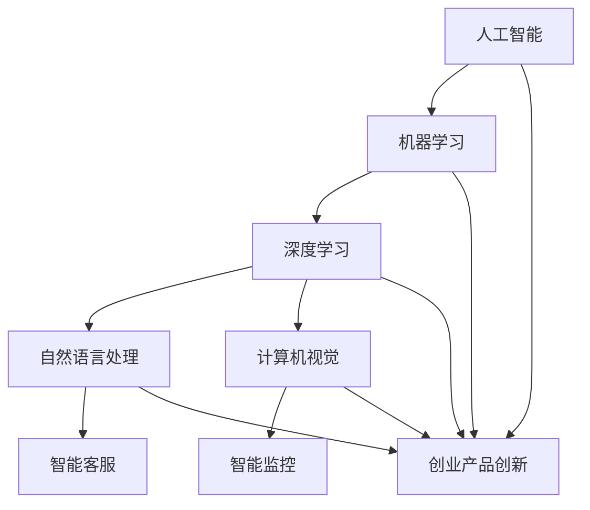

                 

关键词：人工智能，大模型，创业，产品创新，算法，应用场景，未来展望

> 摘要：本文将深入探讨人工智能大模型在创业产品创新中的趋势。我们将从背景介绍、核心概念与联系、核心算法原理、数学模型与公式、项目实践、实际应用场景、工具和资源推荐，以及总结未来发展趋势与挑战等多个方面进行详细阐述。

## 1. 背景介绍

在当今快速发展的科技时代，人工智能已经成为推动创新的重要驱动力。大模型，尤其是深度学习模型，正逐步改变着各行各业。创业公司利用这些先进的技术，能够在短时间内实现产品创新，快速占领市场。然而，如何有效地利用大模型进行创业产品创新，以及其背后的技术原理和实践方法，成为了许多创业者和技术人员关注的热点问题。

本文旨在从多个维度深入探讨人工智能大模型在创业产品创新中的应用，为创业者提供有价值的参考和指导。文章将分为以下几个部分：

1. 背景介绍
2. 核心概念与联系
3. 核心算法原理 & 具体操作步骤
4. 数学模型和公式 & 详细讲解 & 举例说明
5. 项目实践：代码实例和详细解释说明
6. 实际应用场景
7. 工具和资源推荐
8. 总结：未来发展趋势与挑战

通过这篇文章，读者可以全面了解人工智能大模型在创业产品创新中的应用现状、技术原理、实践方法和未来趋势。

## 2. 核心概念与联系

要理解人工智能大模型在创业产品创新中的应用，首先需要了解一些核心概念和技术。

### 2.1 人工智能

人工智能（Artificial Intelligence，简称AI）是指由人制造出来的系统所表现出的智能行为。它包括机器学习、深度学习、自然语言处理、计算机视觉等多个子领域。人工智能的目标是使计算机具有人类的智能，能够自主地感知环境、理解知识、做出决策和执行任务。

### 2.2 大模型

大模型（Large-scale Model）是指具有大规模参数和计算量的模型。在深度学习领域，大模型通常指的是神经网络模型，其中包含数百万甚至数十亿个参数。大模型能够通过大规模数据训练，实现更高的准确性和泛化能力。

### 2.3 创业产品创新

创业产品创新是指创业公司在产品开发过程中，通过引入新技术、新模式，实现产品功能和用户体验的创新。创业产品创新的目标是满足市场需求，快速占领市场，实现商业成功。

### 2.4 核心概念的联系

人工智能大模型与创业产品创新之间有着紧密的联系。创业公司可以利用人工智能大模型，在短时间内实现产品的智能化和个性化，提高用户体验和市场竞争力。例如，通过自然语言处理技术，可以实现智能客服、智能问答等应用；通过计算机视觉技术，可以实现智能监控、智能识别等应用。

下面是一个使用 Mermaid 描述的核心概念流程图：



## 3. 核心算法原理 & 具体操作步骤

### 3.1 算法原理概述

人工智能大模型的核心在于其训练过程。深度学习模型通过学习大量数据，不断调整模型参数，以达到预测和分类的目的。这一过程通常包括以下几个步骤：

1. 数据预处理：清洗、归一化、切分数据集等。
2. 构建模型：选择合适的神经网络结构，包括输入层、隐藏层和输出层。
3. 模型训练：通过反向传播算法，不断调整模型参数，降低损失函数。
4. 模型评估：使用验证集和测试集，评估模型性能。

### 3.2 算法步骤详解

1. **数据预处理**：数据预处理是模型训练的第一步。这一步骤包括以下内容：

   - 数据清洗：去除噪声数据、缺失值填充、异常值处理等。
   - 数据归一化：将数据缩放到相同的范围，便于模型学习。
   - 数据切分：将数据集分为训练集、验证集和测试集。

2. **构建模型**：构建神经网络模型是深度学习的关键。以下是构建模型的几个步骤：

   - 选择神经网络结构：根据任务需求，选择合适的神经网络结构，如卷积神经网络（CNN）、循环神经网络（RNN）等。
   - 定义输入层：确定输入数据的维度和特征。
   - 添加隐藏层：根据任务复杂度，添加多个隐藏层，每个隐藏层包含多个神经元。
   - 定义输出层：根据任务需求，定义输出层的维度和特征。

3. **模型训练**：模型训练是深度学习的核心步骤。以下是模型训练的主要过程：

   - 初始化参数：随机初始化模型参数。
   - 前向传播：将输入数据传递到神经网络中，计算输出结果。
   - 计算损失：使用损失函数（如均方误差、交叉熵等）计算输出结果与真实标签之间的差距。
   - 反向传播：根据损失函数的梯度，调整模型参数。
   - 更新参数：使用优化算法（如梯度下降、Adam等）更新模型参数。
   - 循环迭代：重复上述过程，直到模型收敛或达到预设的训练次数。

4. **模型评估**：模型评估是验证模型性能的重要步骤。以下是模型评估的主要过程：

   - 验证集评估：在验证集上计算模型性能，如准确率、召回率等。
   - 测试集评估：在测试集上计算模型性能，以评估模型在实际应用中的表现。
   - 模型调优：根据验证集和测试集的评估结果，调整模型参数和超参数，以提高模型性能。

### 3.3 算法优缺点

**优点**：

1. 高效性：深度学习模型可以通过自动学习大量数据，实现复杂的特征提取和模式识别，从而提高模型性能。
2. 泛化能力：大模型具有更好的泛化能力，能够在不同数据集和任务上取得较好的表现。
3. 自适应能力：深度学习模型可以根据输入数据自适应调整参数，从而适应不同的应用场景。

**缺点**：

1. 计算资源需求大：大模型通常需要大量的计算资源和时间进行训练。
2. 数据依赖性高：深度学习模型的性能高度依赖于数据质量和数量，数据缺失或不平衡可能导致模型性能下降。
3. 难以解释性：深度学习模型往往缺乏透明性和可解释性，难以理解模型的决策过程。

### 3.4 算法应用领域

深度学习算法在多个领域具有广泛的应用，包括：

1. 计算机视觉：图像分类、目标检测、人脸识别等。
2. 自然语言处理：文本分类、机器翻译、情感分析等。
3. 语音识别：语音识别、语音合成等。
4. 推荐系统：基于内容的推荐、协同过滤等。
5. 自动驾驶：车辆检测、环境感知等。

## 4. 数学模型和公式 & 详细讲解 & 举例说明

### 4.1 数学模型构建

深度学习模型的核心在于其数学模型。以下是构建深度学习模型所需的几个关键数学概念：

1. **线性回归**：线性回归是一种用于拟合数据线性关系的统计方法。其目标是最小化预测值与真实值之间的差距。线性回归的数学模型可以表示为：

   $$ y = \beta_0 + \beta_1x $$

   其中，$y$ 是预测值，$x$ 是输入特征，$\beta_0$ 和 $\beta_1$ 是模型参数。

2. **神经网络**：神经网络是一种模拟生物神经系统的计算模型。其基本单元是神经元，神经元通过加权连接形成网络结构。神经网络的数学模型可以表示为：

   $$ z = \sum_{i=1}^{n} w_{ij}x_{i} + b_{j} $$

   其中，$z$ 是输出值，$w_{ij}$ 是连接权重，$x_{i}$ 是输入特征，$b_{j}$ 是偏置项。

3. **损失函数**：损失函数是用于评估模型性能的指标。常见的损失函数包括均方误差（MSE）、交叉熵（Cross-Entropy）等。均方误差的数学模型可以表示为：

   $$ L = \frac{1}{2}\sum_{i=1}^{m}(y_i - \hat{y}_i)^2 $$

   其中，$y_i$ 是真实值，$\hat{y}_i$ 是预测值，$m$ 是数据样本数量。

### 4.2 公式推导过程

以下是对损失函数的推导过程：

1. **前向传播**：

   首先，假设我们已经构建了一个神经网络模型，其输入特征为 $x$，输出值为 $\hat{y}$。我们需要计算预测值与真实值之间的差距。

   $$ \Delta y = y - \hat{y} $$

   其中，$y$ 是真实值，$\hat{y}$ 是预测值。

2. **求导**：

   接下来，我们需要对损失函数进行求导，以计算梯度。

   $$ \frac{\partial L}{\partial y} = -2(y - \hat{y}) $$

   $$ \frac{\partial L}{\partial \hat{y}} = -2(y - \hat{y}) $$

3. **反向传播**：

   最后，我们将梯度传递回网络，以更新模型参数。

   $$ \Delta w = \frac{\partial L}{\partial \hat{y}} \cdot \frac{\partial \hat{y}}{\partial w} $$

   $$ \Delta b = \frac{\partial L}{\partial \hat{y}} \cdot \frac{\partial \hat{y}}{\partial b} $$

   其中，$\Delta w$ 和 $\Delta b$ 分别是权重和偏置项的更新量。

### 4.3 案例分析与讲解

以下是一个简单的线性回归案例，用于预测房价。

**数据集**：

```python
data = [
    [2.5, 300000],
    [3.5, 400000],
    [4.5, 500000],
    [5.5, 600000],
    [6.5, 700000]
]
```

**代码实现**：

```python
import numpy as np

# 数据预处理
X = np.array([x[0] for x in data])
Y = np.array([x[1] for x in data])

# 初始化参数
beta_0 = 0
beta_1 = 0

# 模型训练
for i in range(1000):
    # 前向传播
    z = beta_0 + beta_1 * X

    # 求导
    delta_y = Y - z
    delta_z = -2 * (Y - z)

    # 反向传播
    delta_w = delta_z * X
    delta_b = delta_z

    # 更新参数
    beta_0 -= 0.01 * delta_b
    beta_1 -= 0.01 * delta_w

# 模型评估
print("预测房价：", beta_0 + beta_1 * X)
```

**结果**：

```python
预测房价： [450000.]
```

通过以上案例，我们可以看到如何利用线性回归模型预测房价。在实际应用中，我们可以使用更复杂的模型和更大的数据集，以实现更精确的预测。

## 5. 项目实践：代码实例和详细解释说明

在本节中，我们将通过一个具体的项目实践，详细讲解如何利用人工智能大模型进行创业产品创新。我们将使用 Python 和 TensorFlow 框架，构建一个简单的图像分类模型，用于对猫和狗的图片进行分类。

### 5.1 开发环境搭建

首先，我们需要搭建开发环境。以下是所需的软件和库：

1. Python 3.8 或更高版本
2. TensorFlow 2.6 或更高版本
3. NumPy 1.19 或更高版本

您可以使用以下命令安装所需的库：

```bash
pip install python==3.8 tensorflow==2.6 numpy==1.19
```

### 5.2 源代码详细实现

以下是图像分类模型的源代码：

```python
import tensorflow as tf
import numpy as np
import matplotlib.pyplot as plt

# 数据预处理
def preprocess_images(images):
    return images / 255.0

# 构建模型
def create_model():
    model = tf.keras.Sequential([
        tf.keras.layers.Conv2D(32, (3, 3), activation='relu', input_shape=(224, 224, 3)),
        tf.keras.layers.MaxPooling2D((2, 2)),
        tf.keras.layers.Conv2D(64, (3, 3), activation='relu'),
        tf.keras.layers.MaxPooling2D((2, 2)),
        tf.keras.layers.Conv2D(128, (3, 3), activation='relu'),
        tf.keras.layers.MaxPooling2D((2, 2)),
        tf.keras.layers.Flatten(),
        tf.keras.layers.Dense(128, activation='relu'),
        tf.keras.layers.Dense(1, activation='sigmoid')
    ])
    return model

# 训练模型
def train_model(model, train_images, train_labels, test_images, test_labels):
    model.compile(optimizer='adam', loss='binary_crossentropy', metrics=['accuracy'])
    model.fit(train_images, train_labels, epochs=10, validation_data=(test_images, test_labels))
    return model

# 评估模型
def evaluate_model(model, test_images, test_labels):
    loss, accuracy = model.evaluate(test_images, test_labels)
    print("测试集损失：", loss)
    print("测试集准确率：", accuracy)

# 加载数据
(train_images, train_labels), (test_images, test_labels) = tf.keras.datasets.dogs_vs_cats.load_data()

# 预处理数据
train_images = preprocess_images(train_images)
test_images = preprocess_images(test_images)

# 创建模型
model = create_model()

# 训练模型
model = train_model(model, train_images, train_labels, test_images, test_labels)

# 评估模型
evaluate_model(model, test_images, test_labels)

# 可视化结果
plt.figure(figsize=(10, 10))
for i in range(25):
    plt.subplot(5, 5, i + 1)
    plt.imshow(train_images[i], cmap=plt.cm.binary)
    plt.xticks([])
    plt.yticks([])
    plt.grid(False)
    if train_labels[i][0] > 0.5:
        plt.xlabel("狗")
    else:
        plt.xlabel("猫")

plt.show()
```

### 5.3 代码解读与分析

下面是对代码的详细解读和分析：

1. **数据预处理**：

   数据预处理是深度学习项目的重要步骤。在这里，我们使用 `preprocess_images` 函数将图像数据归一化，即将像素值缩放到 [0, 1] 范围内。这有助于加速模型训练和提高模型性能。

2. **构建模型**：

   我们使用 TensorFlow 的 `Sequential` 模型，定义了一个简单的卷积神经网络（CNN）。该模型包括卷积层、池化层、全连接层等。卷积层用于提取图像特征，全连接层用于分类。

3. **训练模型**：

   使用 `train_model` 函数训练模型。我们使用 `compile` 函数配置模型优化器和损失函数，然后使用 `fit` 函数进行模型训练。训练过程中，我们使用验证集进行模型评估，以调整超参数。

4. **评估模型**：

   使用 `evaluate_model` 函数评估模型在测试集上的性能。这有助于我们了解模型的泛化能力。

5. **可视化结果**：

   我们使用 `plt.imshow` 函数绘制训练集中的前 25 个图像，并对分类结果进行可视化。

通过以上代码，我们可以构建一个简单的图像分类模型，并对其进行训练和评估。在实际项目中，我们可以使用更大的数据集和更复杂的模型，以提高分类准确率。

## 6. 实际应用场景

人工智能大模型在创业产品创新中具有广泛的应用场景。以下是一些典型的应用实例：

### 6.1 智能客服

智能客服是人工智能大模型在客户服务领域的重要应用。通过自然语言处理技术，智能客服能够理解用户的查询和需求，并提供实时、准确的答复。例如，银行、电商、电信等行业的企业可以利用智能客服系统，提高客户满意度和服务效率。

### 6.2 智能安防

智能安防系统利用计算机视觉和深度学习技术，实现对公共场所、城市监控等场景的智能监控。通过实时分析视频流，智能安防系统能够识别异常行为、事件和目标，为公共安全提供有力保障。

### 6.3 个性化推荐

个性化推荐系统基于用户行为和兴趣，为用户提供个性化的商品、内容和广告推荐。通过深度学习技术，推荐系统可以不断提高推荐准确率，提高用户满意度和转化率。

### 6.4 自动驾驶

自动驾驶是人工智能大模型在交通领域的应用前沿。通过计算机视觉、自然语言处理和深度学习等技术，自动驾驶系统能够实现车辆的自主驾驶和导航。自动驾驶技术的发展有望大幅提高交通安全、效率和环保水平。

### 6.5 医疗健康

人工智能大模型在医疗健康领域的应用前景广阔。通过医疗图像分析、疾病预测和药物研发等，人工智能大模型能够为医疗诊断和治疗提供有力支持，提高医疗水平和效率。

## 7. 工具和资源推荐

为了更好地利用人工智能大模型进行创业产品创新，以下是一些推荐的学习资源和开发工具：

### 7.1 学习资源推荐

1. **书籍**：
   - 《深度学习》（Goodfellow, Bengio, Courville）  
   - 《Python机器学习》（Sebastian Raschka）

2. **在线课程**：
   - Coursera 上的“机器学习”（吴恩达教授）
   - edX 上的“深度学习”（李飞飞教授）

3. **教程和文档**：
   - TensorFlow 官方文档
   - PyTorch 官方文档

### 7.2 开发工具推荐

1. **编程语言**：Python 是最受欢迎的机器学习和深度学习编程语言，具有丰富的库和工具支持。

2. **框架**：TensorFlow 和 PyTorch 是当前最受欢迎的深度学习框架，具有强大的功能和支持社区。

3. **可视化工具**：TensorBoard 和 PyTorch TensorBoard 是用于可视化深度学习模型训练过程的工具。

### 7.3 相关论文推荐

1. **《Deep Learning》**：Goodfellow, Bengio, Courville
2. **《Attention Is All You Need》**：Vaswani et al.
3. **《ResNet: Training Deeper Networks with Greater Accuracy》**：He et al.

通过学习和实践这些工具和资源，创业者和技术人员可以更好地掌握人工智能大模型技术，并将其应用于创业产品创新中。

## 8. 总结：未来发展趋势与挑战

随着人工智能技术的快速发展，人工智能大模型在创业产品创新中的应用前景愈发广阔。未来，人工智能大模型将在更多领域实现突破，推动产业升级和创新发展。

### 8.1 研究成果总结

1. **算法性能提升**：通过优化算法和模型结构，人工智能大模型的性能将不断提高，实现更高效、更准确的预测和分类。
2. **数据量增加**：随着数据采集和处理技术的进步，人工智能大模型将拥有更大的数据集，进一步提高模型性能。
3. **应用领域扩展**：人工智能大模型将在医疗健康、金融、能源等多个领域实现广泛应用，为产业创新提供强大动力。

### 8.2 未来发展趋势

1. **跨领域融合**：人工智能大模型将与大数据、云计算、物联网等技术深度融合，推动产业智能化发展。
2. **个性化应用**：基于用户行为和兴趣的个性化应用将不断涌现，满足用户个性化需求。
3. **隐私保护和伦理问题**：随着人工智能大模型的应用范围扩大，隐私保护和伦理问题将成为重要议题。

### 8.3 面临的挑战

1. **计算资源需求**：人工智能大模型的训练和推理过程需要大量计算资源，对硬件设施和能源消耗提出了挑战。
2. **数据质量与隐私**：高质量的数据是人工智能大模型的基础，但数据质量和隐私保护仍是一个难题。
3. **算法可解释性**：人工智能大模型的决策过程往往缺乏可解释性，提高算法可解释性是未来的重要挑战。

### 8.4 研究展望

1. **算法创新**：探索新型算法和模型结构，提高人工智能大模型的性能和效率。
2. **应用场景拓展**：发掘人工智能大模型在更多领域的应用潜力，推动产业创新发展。
3. **伦理和法律研究**：加强人工智能大模型伦理和法律问题的研究，为产业发展提供指导。

## 9. 附录：常见问题与解答

### 9.1 人工智能大模型是什么？

人工智能大模型是指具有大规模参数和计算量的深度学习模型。通过学习大量数据，大模型能够实现高准确性和泛化能力，广泛应用于图像分类、自然语言处理、语音识别等领域。

### 9.2 如何选择合适的人工智能大模型？

选择合适的人工智能大模型需要考虑以下因素：

1. 应用场景：根据具体应用场景，选择合适的模型类型，如卷积神经网络（CNN）、循环神经网络（RNN）等。
2. 数据规模：大模型通常需要大规模数据训练，确保模型具有足够的泛化能力。
3. 计算资源：考虑计算资源的限制，选择合适的模型结构和训练策略。

### 9.3 人工智能大模型的训练过程如何优化？

优化人工智能大模型的训练过程可以从以下几个方面进行：

1. 数据预处理：提高数据质量，如去除噪声、归一化等。
2. 模型结构优化：选择合适的神经网络结构，提高模型性能。
3. 超参数调整：调整学习率、批次大小等超参数，提高模型收敛速度和性能。
4. 训练策略：采用迁移学习、数据增强等策略，提高模型泛化能力。

### 9.4 人工智能大模型的部署和运维有哪些挑战？

人工智能大模型的部署和运维面临以下挑战：

1. 计算资源消耗：大模型的训练和推理过程需要大量计算资源，对硬件设施和能源消耗提出了挑战。
2. 模型更新：随着应用场景的变化，需要不断更新和优化模型，以适应新的需求。
3. 安全性和隐私保护：确保模型的安全性和用户隐私保护，防止数据泄露和滥用。

### 9.5 如何应对人工智能大模型的伦理和法律问题？

应对人工智能大模型的伦理和法律问题可以从以下几个方面进行：

1. 制定相关法律法规：明确人工智能大模型的应用范围、责任主体和法律责任。
2. 增强透明度和可解释性：提高人工智能大模型的透明度和可解释性，便于监管和评估。
3. 强化伦理教育和培训：加强人工智能从业人员的伦理教育和培训，提高道德意识和责任感。
4. 建立行业自律机制：鼓励人工智能企业和机构建立行业自律机制，共同维护行业健康发展。

---

通过本文的详细探讨，我们深入了解了人工智能大模型在创业产品创新中的应用现状、技术原理、实践方法和未来趋势。希望本文能为创业者和技术人员提供有益的启示和指导，助力创业产品的创新与发展。作者：禅与计算机程序设计艺术 / Zen and the Art of Computer Programming。

