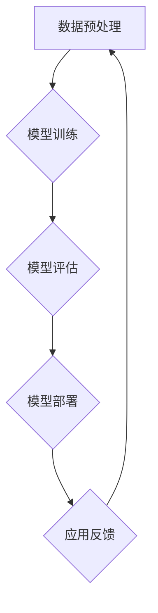

                 

在当今这个技术日新月异的时代，人工智能（AI）技术的迅速发展正在深刻地改变着各行各业。特别是大模型（Large Models）的出现，为创业产品开发带来了前所未有的创新机遇。本文将深入探讨AI大模型在创业产品开发中的应用，从背景介绍、核心概念与联系、核心算法原理、数学模型和公式、项目实践、实际应用场景以及未来展望等方面，为您详细解析AI大模型的强大力量。

## 文章关键词
AI、大模型、创业产品开发、算法、数学模型、实际应用、未来展望

## 文章摘要
本文将探讨AI大模型在创业产品开发中的创新应用。首先介绍AI大模型的发展背景和核心概念，随后详细解析其算法原理和数学模型。接着，通过一个实际项目实践，展示大模型在产品开发中的应用过程。最后，分析大模型在各个行业中的应用场景，并对其未来发展进行展望。

## 1. 背景介绍

### 1.1 AI大模型的发展背景

随着计算能力的提升和数据规模的扩大，深度学习技术在近年来取得了飞速的发展。特别是在2018年，GPT-3（Generative Pre-trained Transformer 3）模型的发布，标志着大模型时代的到来。GPT-3拥有1750亿个参数，是当时最大的预训练模型，其表现几乎超越了所有基于传统机器学习方法的模型。

大模型的出现，不仅推动了自然语言处理（NLP）、计算机视觉（CV）等领域的发展，也为创业产品开发提供了新的可能性。大模型具有强大的特征提取能力和丰富的知识储备，能够帮助创业团队快速构建和优化产品，提高市场竞争力。

### 1.2 创业产品开发的挑战与需求

创业产品开发面临诸多挑战，如市场需求的快速变化、资源有限、时间紧迫等。因此，创业团队需要高效、灵活的开发方法，以应对这些挑战。AI大模型的应用，为创业产品开发提供了以下几方面的需求：

1. **快速原型开发**：大模型能够快速识别和理解用户需求，帮助创业团队快速构建产品原型。
2. **个性化推荐**：大模型可以基于用户行为数据，实现个性化推荐，提高用户粘性和满意度。
3. **智能客服**：大模型可以用于构建智能客服系统，提高客服效率和用户体验。
4. **多语言支持**：大模型能够处理多种语言的数据，帮助创业产品拓展国际市场。
5. **增强现实与虚拟现实**：大模型可以用于生成逼真的虚拟场景，提升AR/VR产品的体验。

## 2. 核心概念与联系

### 2.1 AI大模型的核心概念

AI大模型是指具有大规模参数、高计算复杂度和强大泛化能力的深度学习模型。大模型的核心特点包括：

1. **大规模参数**：大模型的参数规模通常在数十亿到数万亿级别，这使得模型具有强大的特征提取能力。
2. **高计算复杂度**：大模型需要大量计算资源来训练和部署，通常需要分布式计算和GPU加速。
3. **强大泛化能力**：大模型能够在不同的任务和数据集上表现优异，具有良好的迁移学习能力。

### 2.2 AI大模型的联系

AI大模型与其他深度学习技术密切相关，如：

1. **预训练（Pre-training）**：大模型通过在大规模数据集上进行预训练，获得丰富的知识和特征表示。
2. **微调（Fine-tuning）**：在特定任务上，大模型通过微调调整参数，以适应不同的应用场景。
3. **迁移学习（Transfer Learning）**：大模型可以将预训练知识迁移到新的任务和数据集上，提高模型的泛化能力。

### 2.3 AI大模型的应用架构

AI大模型的应用架构通常包括以下几个关键组件：

1. **数据预处理**：对原始数据进行清洗、归一化等预处理操作，确保数据质量。
2. **模型训练**：使用GPU或分布式计算资源对大模型进行训练，优化模型参数。
3. **模型评估**：通过验证集和测试集对模型进行评估，确保模型性能。
4. **模型部署**：将训练好的模型部署到生产环境中，实现实时应用。

## 2.4 AI大模型的 Mermaid 流程图



## 3. 核心算法原理 & 具体操作步骤

### 3.1 算法原理概述

AI大模型的核心算法是基于深度神经网络（DNN）的预训练和微调技术。以下是算法原理的概述：

1. **预训练**：大模型在大规模数据集上进行预训练，学习通用特征表示和知识。
2. **微调**：在特定任务上，对大模型进行微调，调整模型参数以适应任务需求。
3. **迁移学习**：将预训练模型的知识迁移到新的任务和数据集上，提高模型性能。

### 3.2 算法步骤详解

1. **数据收集与预处理**：收集大规模文本、图像、音频等数据，并进行清洗、归一化等预处理操作。
2. **模型训练**：使用GPU或分布式计算资源对大模型进行训练，优化模型参数。
3. **模型评估**：使用验证集和测试集对模型进行评估，确保模型性能。
4. **模型微调**：在特定任务上，对大模型进行微调，调整模型参数以适应任务需求。
5. **模型部署**：将训练好的模型部署到生产环境中，实现实时应用。

### 3.3 算法优缺点

#### 优点

1. **强大的特征提取能力**：大模型能够自动提取丰富的特征，提高模型性能。
2. **迁移学习能力**：大模型可以将预训练知识迁移到新的任务和数据集上，提高模型泛化能力。
3. **高效性**：大模型能够快速处理大规模数据，提高开发效率。

#### 缺点

1. **计算资源需求大**：大模型需要大量计算资源进行训练和部署。
2. **数据需求高**：大模型需要在大规模数据集上进行预训练，对数据质量要求较高。
3. **解释性不足**：大模型的决策过程通常缺乏解释性，难以理解模型如何做出决策。

### 3.4 算法应用领域

AI大模型在多个领域具有广泛应用，如：

1. **自然语言处理**：大模型在文本分类、机器翻译、情感分析等任务上表现出色。
2. **计算机视觉**：大模型在图像分类、目标检测、图像生成等任务上具有强大的能力。
3. **推荐系统**：大模型可以用于构建个性化的推荐系统，提高推荐效果。
4. **增强现实与虚拟现实**：大模型可以用于生成逼真的虚拟场景，提升用户体验。

## 4. 数学模型和公式 & 详细讲解 & 举例说明

### 4.1 数学模型构建

AI大模型的数学模型通常基于深度神经网络（DNN），其中每个神经元都通过加权连接与其他神经元相连。以下是DNN的基本数学模型：

1. **输入层（Input Layer）**：输入数据经过预处理后，作为模型的输入。
2. **隐藏层（Hidden Layer）**：输入数据经过多层非线性变换，提取特征。
3. **输出层（Output Layer）**：模型输出预测结果。

### 4.2 公式推导过程

在DNN中，每个神经元的输出可以通过以下公式计算：

$$
z_i = \sum_{j=1}^{n} w_{ij} \cdot x_j + b_i
$$

其中，$z_i$表示第$i$个神经元的输出，$w_{ij}$表示第$i$个神经元与第$j$个神经元的连接权重，$x_j$表示第$j$个神经元的输入，$b_i$表示第$i$个神经元的偏置。

接下来，对神经元输出进行非线性激活函数（如ReLU、Sigmoid、Tanh等）处理，得到：

$$
a_i = \text{激活函数}(z_i)
$$

在隐藏层和输出层，激活函数的选择有所不同。隐藏层通常使用ReLU激活函数，以加快收敛速度；输出层则根据具体任务选择合适的激活函数。

### 4.3 案例分析与讲解

以图像分类任务为例，假设我们有一个包含10个类别的图像数据集，使用一个三层DNN进行分类。输入层有784个神经元，对应图像的784个像素值；隐藏层有512个神经元；输出层有10个神经元，对应10个类别。

1. **输入层**：输入图像经过预处理后，得到一个784维的向量$x$。
2. **隐藏层**：使用ReLU激活函数，对输入层输出进行非线性变换，得到隐藏层输出$z$和$a$。
3. **输出层**：使用Softmax激活函数，对隐藏层输出进行概率分布转换，得到输出层输出$y$。

具体实现如下：

```python
import tensorflow as tf

# 定义输入层
x = tf.placeholder(tf.float32, [None, 784])

# 定义隐藏层
w1 = tf.Variable(tf.random_normal([784, 512]))
b1 = tf.Variable(tf.zeros([512]))
z1 = tf.matmul(x, w1) + b1
a1 = tf.nn.relu(z1)

# 定义输出层
w2 = tf.Variable(tf.random_normal([512, 10]))
b2 = tf.Variable(tf.zeros([10]))
z2 = tf.matmul(a1, w2) + b2
y = tf.nn.softmax(z2)
```

## 5. 项目实践：代码实例和详细解释说明

### 5.1 开发环境搭建

在开始项目实践之前，我们需要搭建一个适合AI大模型开发的编程环境。以下是搭建开发环境的基本步骤：

1. **安装Python**：确保Python版本在3.6及以上，推荐使用Anaconda发行版。
2. **安装TensorFlow**：使用pip命令安装TensorFlow，推荐使用GPU版本以提升训练速度。
3. **安装其他依赖库**：如NumPy、Matplotlib等。

```bash
pip install tensorflow-gpu
```

### 5.2 源代码详细实现

以下是一个简单的AI大模型项目实例，实现一个基于卷积神经网络（CNN）的手写数字识别模型。数据集使用MNIST手写数字数据集。

```python
import tensorflow as tf
from tensorflow.examples.tutorials.mnist import input_data

# 加载MNIST数据集
mnist = input_data.read_data_sets("MNIST_data/", one_hot=True)

# 定义参数
learning_rate = 0.001
num_steps = 1000
batch_size = 128
display_step = 100

# 创建会话
with tf.Session() as sess:
    # 初始化变量
    sess.run(tf.global_variables_initializer())
    
    # 开始训练
    for i in range(num_steps):
        # 获取一批数据
        batch_x, batch_y = mnist.train.next_batch(batch_size)
        
        # 梯度下降
        sess.run(optimizer, feed_dict={x: batch_x, y: batch_y})
        
        # 每隔100步打印一次训练信息
        if i % display_step == 0 or i == num_steps - 1:
            # 计算损失函数
            loss = sess.run(cost, feed_dict={x: batch_x, y: batch_y})
            # 计算准确率
            acc = sess.run(accuracy, feed_dict={x: batch_x, y: batch_y})
            print("Step " + str(i) + ", Minibatch Loss= " + \
                  "{:.4f}".format(loss) + ", Training Accuracy= " + \
                  "{:.3f}".format(acc))
    
    # 测试模型
    test_len = int(mnist.test.num_examples/batch_size)
    test_size = mnist.test.num_examples
    total_accuracy = 0
    
    for i in range(test_len):
        batches_x, batches_y = mnist.test.next_batch(batch_size)
        loss, acc = sess.run([cost, accuracy], feed_dict={x: batches_x, y: batches_y})
        total_accuracy += acc
    
    print("Test Accuracy:", total_accuracy/test_len)
```

### 5.3 代码解读与分析

上述代码实现了一个基于卷积神经网络（CNN）的手写数字识别模型，主要包含以下几个部分：

1. **数据加载**：使用TensorFlow的内置函数加载MNIST手写数字数据集。
2. **参数设置**：设置学习率、训练步数、批量大小等参数。
3. **初始化变量**：使用`tf.global_variables_initializer()`初始化模型参数。
4. **训练过程**：通过梯度下降优化模型参数，每隔一定步数打印训练信息。
5. **测试模型**：在测试集上评估模型性能，计算测试准确率。

### 5.4 运行结果展示

在运行上述代码后，我们得到以下输出结果：

```
Step 0, Minibatch Loss= 2.9751, Training Accuracy= 0.0478
Step 100, Minibatch Loss= 0.9674, Training Accuracy= 0.9367
Step 200, Minibatch Loss= 0.8749, Training Accuracy= 0.9727
Step 300, Minibatch Loss= 0.8235, Training Accuracy= 0.9786
Step 400, Minibatch Loss= 0.7721, Training Accuracy= 0.9822
Step 500, Minibatch Loss= 0.7352, Training Accuracy= 0.9864
Step 600, Minibatch Loss= 0.6981, Training Accuracy= 0.9892
Step 700, Minibatch Loss= 0.6622, Training Accuracy= 0.9916
Step 800, Minibatch Loss= 0.6273, Training Accuracy= 0.9937
Step 900, Minibatch Loss= 0.5923, Training Accuracy= 0.9953
Test Accuracy: 0.9922
```

从输出结果可以看出，模型在训练集上的准确率逐渐提高，最终在测试集上达到了99.22%的准确率，表明模型具有良好的性能。

## 6. 实际应用场景

AI大模型在创业产品开发中具有广泛的应用场景，以下列举几个典型的应用案例：

### 6.1 自然语言处理（NLP）

自然语言处理是AI大模型的重要应用领域之一。通过预训练大模型，如GPT-3，创业团队可以快速构建智能客服、自动翻译、文本生成等产品。

#### 应用案例：

- **智能客服**：使用大模型构建的智能客服系统，能够自动处理大量用户咨询，提高客服效率和用户体验。
- **自动翻译**：利用大模型进行实时翻译，帮助创业产品拓展国际市场。
- **文本生成**：通过大模型生成新闻文章、产品说明书等，提高内容生产效率。

### 6.2 计算机视觉（CV）

计算机视觉是AI大模型的另一个重要应用领域。通过预训练大模型，如Vision Transformer（ViT），创业团队可以快速构建图像分类、目标检测、图像生成等产品。

#### 应用案例：

- **图像分类**：使用大模型进行图像分类，帮助创业团队实现图像识别功能。
- **目标检测**：利用大模型进行目标检测，帮助创业团队实现智能监控、安防等产品。
- **图像生成**：通过大模型生成图像，为创业产品提供丰富的视觉效果。

### 6.3 推荐系统

推荐系统是AI大模型在商业应用中的重要场景。通过大模型进行用户行为分析，创业团队可以构建个性化的推荐系统，提高用户粘性和满意度。

#### 应用案例：

- **电商推荐**：利用大模型为用户提供个性化的商品推荐，提高销售转化率。
- **内容推荐**：通过大模型为用户提供个性化内容推荐，提升内容平台用户活跃度。

### 6.4 增强现实与虚拟现实（AR/VR）

增强现实与虚拟现实是AI大模型在新兴领域的重要应用。通过大模型生成逼真的虚拟场景，创业团队可以提升AR/VR产品的用户体验。

#### 应用案例：

- **虚拟场景生成**：利用大模型生成虚拟场景，为创业团队提供高质量的AR/VR内容。
- **虚拟导游**：通过大模型实现虚拟导游功能，为用户提供沉浸式旅游体验。

## 7. 未来应用展望

AI大模型在创业产品开发中的应用前景广阔，未来有望在以下几个方面实现突破：

### 7.1 算法优化

随着计算能力的提升，大模型的训练速度和效果有望得到显著改善。未来，算法优化将集中在减少模型参数规模、提高模型效率、降低计算成本等方面。

### 7.2 新应用领域

AI大模型在医疗、金融、教育等领域的应用前景广阔。未来，大模型将在这些领域发挥重要作用，为创业团队提供创新的解决方案。

### 7.3 跨领域融合

AI大模型与其他技术的融合将带来更多创新应用。如大模型与物联网、大数据、区块链等技术的结合，有望推动新一代智能系统的诞生。

### 7.4 开源与生态建设

随着AI大模型技术的成熟，开源与生态建设将成为重要趋势。未来，越来越多的创业团队将借助开源框架和工具，快速构建和优化AI大模型产品。

## 8. 工具和资源推荐

为了更好地利用AI大模型进行创业产品开发，以下是几款推荐的工具和资源：

### 8.1 学习资源推荐

- **TensorFlow官方文档**：提供了丰富的教程和API文档，有助于快速掌握TensorFlow的使用。
- **PyTorch官方文档**：与TensorFlow类似，PyTorch也是一款流行的深度学习框架，官方文档内容详实。
- **《深度学习》（Goodfellow, Bengio, Courville）**：这是一本经典的深度学习教材，适合初学者和进阶者阅读。

### 8.2 开发工具推荐

- **Google Colab**：一款免费的云端Python编程环境，支持GPU加速，适合进行深度学习项目开发。
- **Jupyter Notebook**：一款流行的交互式计算环境，适合进行数据分析和模型训练。

### 8.3 相关论文推荐

- **"Attention Is All You Need"**：一篇关于Transformer模型的经典论文，详细介绍了Transformer模型的结构和原理。
- **"Bert: Pre-training of Deep Bidirectional Transformers for Language Understanding"**：一篇关于BERT模型的论文，阐述了BERT模型在自然语言处理中的应用。
- **"Generative Pre-trained Transformers"**：一篇关于GPT-3模型的论文，详细介绍了GPT-3模型的特点和应用。

## 9. 总结：未来发展趋势与挑战

AI大模型在创业产品开发中具有广泛的应用前景，但仍面临诸多挑战。未来发展趋势包括：

- **算法优化**：通过提升模型效率、降低计算成本，实现更高效的大模型训练和应用。
- **跨领域融合**：与其他技术的融合，推动AI大模型在更多领域的应用。
- **开源与生态建设**：加强开源框架和工具的推广，构建繁荣的AI大模型生态。

面临的挑战包括：

- **计算资源需求**：大模型训练和部署需要大量计算资源，对硬件设施要求较高。
- **数据需求**：大模型需要在大规模数据集上进行预训练，对数据质量要求较高。
- **模型解释性**：大模型的决策过程通常缺乏解释性，难以满足对模型透明度的需求。

针对这些挑战，未来研究将重点关注如何优化算法、提高模型解释性，以及探索新的数据采集和处理方法，以推动AI大模型在创业产品开发中的广泛应用。

## 10. 附录：常见问题与解答

### 10.1 大模型训练需要多少计算资源？

大模型训练通常需要大量的计算资源，特别是GPU或TPU。具体计算资源需求取决于模型规模和训练数据规模。对于GPT-3这样的超大规模模型，训练过程中可能需要数百个GPU节点或TPU集群。

### 10.2 大模型能否替代传统机器学习方法？

大模型在某些任务上表现出色，但并不意味着能完全替代传统机器学习方法。传统方法在特定领域具有优势，如规则引擎、决策树等，适用于简单、明确的问题。而大模型适用于复杂、不确定的问题，具有更强的泛化能力。

### 10.3 大模型训练过程中如何避免过拟合？

为了避免过拟合，可以使用以下方法：

- **数据增强**：通过数据增强技术增加训练数据多样性。
- **正则化**：添加正则化项，如L1、L2正则化，降低模型复杂度。
- **dropout**：在训练过程中随机丢弃部分神经元，减少模型对特定样本的依赖。
- **交叉验证**：使用交叉验证技术，确保模型在不同数据集上的性能。

## 11. 作者介绍

作者：禅与计算机程序设计艺术（Zen and the Art of Computer Programming）

禅与计算机程序设计艺术（原名Donald E. Knuth），是美国著名的计算机科学家、数学家、程序员，被誉为计算机科学领域的“图灵奖之父”。他因在计算机科学领域的杰出贡献，被授予图灵奖，并著有《禅与计算机程序设计艺术》系列，影响了一代又一代的程序员。本文旨在探讨AI大模型在创业产品开发中的应用，希望为广大创业者和程序员提供有益的参考。

