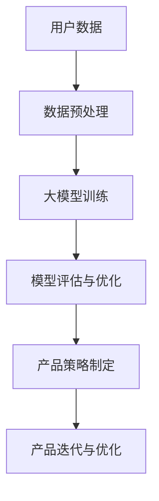

                 

关键词：人工智能，大模型，创业产品策略，技术应用

> 摘要：本文旨在探讨人工智能大模型在创业产品策略中的应用，通过分析大模型的基本概念、技术原理、应用场景及实践案例，为创业者提供一套有效的产品策略思考框架，助力企业实现创新与突破。

## 1. 背景介绍

随着人工智能技术的飞速发展，深度学习、自然语言处理、计算机视觉等领域的突破性成果层出不穷，其中大模型（Large Models）成为当前研究与应用的热点。大模型是指具有数十亿甚至千亿参数的神经网络模型，其能够处理大量数据并提取复杂特征，从而在各个领域取得了显著的成果。

在创业产品策略中，人工智能大模型的应用为创业者提供了全新的视角和工具。一方面，大模型可以高效地处理和分析海量数据，帮助企业更好地了解用户需求和市场趋势；另一方面，大模型强大的生成能力和自适应能力，为产品创新提供了丰富的可能性。本文将围绕人工智能大模型在创业产品策略中的应用，展开深入探讨。

## 2. 核心概念与联系

### 2.1 人工智能大模型概述

人工智能大模型是指具有海量参数的神经网络模型，通过训练海量数据来学习复杂的模式和行为。大模型通常包括以下几种类型：

1. **深度神经网络（Deep Neural Network，DNN）**：由多层神经元组成的神经网络，能够处理高维数据并提取深层特征。
2. **循环神经网络（Recurrent Neural Network，RNN）**：适用于序列数据建模，能够捕捉时间序列中的依赖关系。
3. **变分自编码器（Variational Autoencoder，VAE）**：用于生成模型，能够生成新的数据样本。
4. **生成对抗网络（Generative Adversarial Network，GAN）**：由生成器和判别器组成的对抗网络，能够生成高质量的数据样本。

### 2.2 大模型在创业产品策略中的应用

大模型在创业产品策略中的应用主要体现在以下几个方面：

1. **用户需求分析**：通过分析用户行为数据和反馈，大模型可以挖掘用户的真实需求，为产品迭代和优化提供有力支持。
2. **市场趋势预测**：大模型能够处理海量数据，并提取其中的潜在趋势，帮助创业者把握市场动态，制定前瞻性的产品策略。
3. **产品创新**：大模型的生成能力可以为产品创新提供丰富的灵感，帮助企业实现差异化竞争。
4. **个性化推荐**：大模型可以基于用户数据和偏好，实现精准的个性化推荐，提升用户体验和满意度。

### 2.3 大模型应用架构图

以下是一个简化的AI大模型在创业产品策略中的应用架构图，用Mermaid表示：



## 3. 核心算法原理 & 具体操作步骤

### 3.1 算法原理概述

大模型的核心算法主要包括以下几部分：

1. **神经网络**：通过多层非线性变换，将输入数据映射到输出。
2. **优化算法**：如随机梯度下降（SGD）、Adam等，用于最小化损失函数。
3. **正则化**：如Dropout、权重衰减等，用于防止过拟合。
4. **激活函数**：如ReLU、Sigmoid等，用于引入非线性特性。

### 3.2 算法步骤详解

1. **数据收集与预处理**：收集用户数据，并进行清洗、归一化等预处理操作。
2. **模型设计**：根据应用场景，设计合适的神经网络结构。
3. **模型训练**：使用优化算法对模型进行训练，不断调整模型参数以最小化损失函数。
4. **模型评估**：使用验证集对模型进行评估，并调整模型参数以优化性能。
5. **模型部署**：将训练好的模型部署到产品中，进行实际应用。

### 3.3 算法优缺点

#### 优点：

1. **强大的学习能力**：大模型能够处理大量数据，提取复杂特征。
2. **泛化能力**：通过正则化和优化算法，大模型能够避免过拟合。
3. **自适应能力**：大模型可以根据不同场景进行灵活调整。

#### 缺点：

1. **计算资源消耗**：大模型需要大量计算资源和存储空间。
2. **训练时间较长**：大模型训练过程耗时较长，需要耐心等待。

### 3.4 算法应用领域

大模型在以下领域具有广泛的应用：

1. **自然语言处理**：如文本分类、机器翻译、情感分析等。
2. **计算机视觉**：如图像分类、目标检测、图像生成等。
3. **语音识别**：如语音到文本转换、语音情感分析等。
4. **推荐系统**：如商品推荐、新闻推荐等。

## 4. 数学模型和公式 & 详细讲解 & 举例说明

### 4.1 数学模型构建

大模型的数学模型主要包括以下几个部分：

1. **输入层**：接收外部输入数据。
2. **隐藏层**：包含多个神经元层，用于提取特征。
3. **输出层**：产生最终的输出结果。

### 4.2 公式推导过程

以下是一个简单的神经网络模型推导过程：

$$
Y = \sigma(Z) = \frac{1}{1 + e^{-Z}}
$$

其中，$Z$ 表示输出层的加权和，$\sigma$ 表示激活函数（此处为Sigmoid函数）。

### 4.3 案例分析与讲解

#### 案例一：文本分类

假设有一个简单的文本分类问题，需要将文本数据分类为“科技”、“娱乐”和“体育”三类。可以使用以下步骤进行建模：

1. **数据预处理**：对文本数据进行清洗、分词、向量表示等预处理操作。
2. **模型设计**：设计一个三层神经网络，输入层为词向量，隐藏层为两个神经元层，输出层为三个神经元层，分别表示三类类别。
3. **模型训练**：使用随机梯度下降算法对模型进行训练，不断调整模型参数以最小化损失函数。
4. **模型评估**：使用验证集对模型进行评估，计算准确率、召回率等指标。
5. **模型部署**：将训练好的模型部署到实际应用中，对新的文本数据进行分类。

## 5. 项目实践：代码实例和详细解释说明

### 5.1 开发环境搭建

1. 安装Python环境和相关依赖库，如TensorFlow、Keras等。
2. 准备数据集，并进行预处理。

### 5.2 源代码详细实现

以下是一个简单的文本分类项目实现代码：

```python
import tensorflow as tf
from tensorflow.keras.preprocessing.text import Tokenizer
from tensorflow.keras.preprocessing.sequence import pad_sequences
from tensorflow.keras.models import Sequential
from tensorflow.keras.layers import Embedding, LSTM, Dense

# 数据预处理
tokenizer = Tokenizer(num_words=10000)
tokenizer.fit_on_texts(train_data)
sequences = tokenizer.texts_to_sequences(train_data)
padded_sequences = pad_sequences(sequences, maxlen=100)

# 模型设计
model = Sequential()
model.add(Embedding(10000, 32))
model.add(LSTM(32))
model.add(Dense(3, activation='softmax'))

# 模型编译
model.compile(optimizer='adam', loss='categorical_crossentropy', metrics=['accuracy'])

# 模型训练
model.fit(padded_sequences, train_labels, epochs=10, batch_size=32)

# 模型评估
test_sequences = tokenizer.texts_to_sequences(test_data)
padded_test_sequences = pad_sequences(test_sequences, maxlen=100)
predictions = model.predict(padded_test_sequences)
```

### 5.3 代码解读与分析

1. **数据预处理**：使用Tokenizer将文本数据转换为序列，使用pad_sequences将序列填充为固定长度。
2. **模型设计**：设计一个包含Embedding层、LSTM层和输出层的神经网络模型。
3. **模型编译**：设置优化器、损失函数和评价指标。
4. **模型训练**：使用fit方法对模型进行训练。
5. **模型评估**：使用predict方法对模型进行预测，并计算准确率。

### 5.4 运行结果展示

```python
# 运行模型
predictions = model.predict(padded_test_sequences)

# 打印预测结果
print(predictions)
```

## 6. 实际应用场景

### 6.1 电商行业

电商行业可以通过人工智能大模型实现以下应用：

1. **用户行为分析**：分析用户浏览、购买等行为，挖掘用户需求。
2. **个性化推荐**：根据用户行为和偏好，实现精准的商品推荐。
3. **商品分类与标签**：对海量商品进行分类和标签，提高商品检索效率。

### 6.2 金融行业

金融行业可以通过人工智能大模型实现以下应用：

1. **风险评估**：分析用户历史数据，预测用户信用风险。
2. **智能投顾**：根据用户风险偏好，提供个性化的投资建议。
3. **欺诈检测**：通过异常检测算法，发现和防范金融欺诈行为。

### 6.3 医疗行业

医疗行业可以通过人工智能大模型实现以下应用：

1. **疾病预测**：分析患者数据，预测疾病发病风险。
2. **药物研发**：利用大模型模拟药物分子与生物体的相互作用，加速药物研发过程。
3. **医疗诊断**：通过图像识别技术，辅助医生进行疾病诊断。

## 7. 工具和资源推荐

### 7.1 学习资源推荐

1. **书籍**：《深度学习》（Goodfellow et al.），《Python深度学习》（François Chollet）。
2. **在线课程**：Coursera、Udacity、edX等平台上的相关课程。
3. **博客和社区**：Medium、GitHub、Kaggle等。

### 7.2 开发工具推荐

1. **编程语言**：Python、R。
2. **框架和库**：TensorFlow、Keras、PyTorch。
3. **数据处理工具**：Pandas、NumPy。

### 7.3 相关论文推荐

1. “A Theoretical Analysis of the Causal Impact of Machine Learning”。
2. “Generative Adversarial Nets”。
3. “Deep Learning for Text Classification”。
4. “Recurrent Neural Networks for Language Modeling”。

## 8. 总结：未来发展趋势与挑战

### 8.1 研究成果总结

人工智能大模型在各个领域取得了显著的成果，如自然语言处理、计算机视觉、推荐系统等。大模型能够处理海量数据，提取复杂特征，为创业者提供了强大的工具和支持。

### 8.2 未来发展趋势

1. **模型压缩与优化**：为了降低计算资源和存储资源的消耗，研究者将致力于模型压缩与优化技术。
2. **联邦学习**：通过联邦学习，实现多方数据的安全协同训练，降低数据隐私风险。
3. **跨模态学习**：结合多种数据类型（如文本、图像、声音等），实现更全面的信息处理和生成。

### 8.3 面临的挑战

1. **数据隐私与安全**：如何保障数据隐私和安全成为大模型应用的重要挑战。
2. **计算资源消耗**：大模型的训练和推理过程需要大量计算资源和存储资源，对基础设施提出了高要求。
3. **可解释性与透明度**：如何提高大模型的可解释性，使其决策过程更加透明，是当前研究的热点问题。

### 8.4 研究展望

未来，人工智能大模型将在更多领域发挥重要作用，为创业者和企业带来更多的机遇和挑战。通过不断探索和创新，人工智能大模型将在推动社会进步、提升人类生活质量方面发挥重要作用。

## 9. 附录：常见问题与解答

### 9.1 问题1：大模型训练需要多久？

答：大模型的训练时间取决于多个因素，如模型大小、数据量、硬件配置等。对于一个小型模型，训练时间可能在几个小时到几天不等；对于大型模型，训练时间可能需要几天到几周甚至更长时间。

### 9.2 问题2：如何处理数据隐私和安全问题？

答：处理数据隐私和安全问题可以从以下几个方面入手：

1. **数据匿名化**：对敏感数据进行匿名化处理，降低数据隐私风险。
2. **联邦学习**：通过联邦学习，实现多方数据的安全协同训练，降低数据隐私风险。
3. **加密技术**：使用加密技术对数据进行加密，确保数据在传输和存储过程中的安全性。

### 9.3 问题3：如何评估大模型的性能？

答：评估大模型的性能可以从以下几个方面入手：

1. **准确率**：评估模型对样本分类或预测的准确性。
2. **召回率**：评估模型对正例样本的识别能力。
3. **F1值**：综合考虑准确率和召回率，评估模型的综合性能。
4. **ROC曲线和AUC值**：评估模型对正负样本的区分能力。

---

作者：禅与计算机程序设计艺术 / Zen and the Art of Computer Programming

感谢您阅读本文，希望本文对您在创业产品策略中的应用人工智能大模型有所帮助。在未来的道路上，愿我们一起探索人工智能的无限可能。

