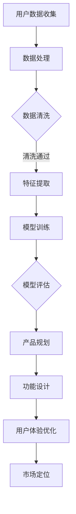

                 

关键词：AI 大模型，创业产品规划，算法原理，数学模型，项目实践，应用场景，未来展望。

## 摘要

本文旨在探讨人工智能大模型在创业产品规划中的应用价值。通过分析大模型的核心概念、原理及其在产品开发中的具体应用，本文揭示了其在提升产品设计效率、优化用户体验和增强市场竞争力方面的潜力。文章结构分为九个部分，首先介绍背景，随后详细阐述核心概念和架构，再深入探讨算法原理和操作步骤，随后通过数学模型和案例进行分析，接着展示项目实践和代码实例，并探讨实际应用场景，最后提出未来展望和面临挑战。

## 1. 背景介绍

### 1.1 AI 大模型的发展历程

人工智能（AI）作为计算机科学的一个重要分支，近年来取得了飞速发展。从最初的规则驱动型系统，到基于统计学习的方法，再到深度学习的崛起，AI 已经从理论走向了实践，并逐渐渗透到各行各业。大模型作为深度学习的一个重要方向，以其强大的数据处理能力和复杂的模型结构，成为当前 AI 研究的热点之一。

大模型的发展可以追溯到 2012 年，当深度学习在图像识别任务中取得突破时，研究者开始意识到更大规模的数据和更复杂的模型结构可以带来更好的性能。此后，随着计算能力的提升和大数据技术的进步，大模型的研究和应用逐渐深入。代表性成果包括 GPT-3、BERT、AlphaFold 等，这些模型不仅在学术研究上取得了显著成果，也在实际应用中展现了巨大潜力。

### 1.2 创业产品规划的重要性

在当今快速变化的市场环境中，创业产品规划变得尤为重要。一个成功的创业产品不仅需要满足市场需求，还需要在功能、用户体验、市场定位等多个方面进行精细规划。创业产品规划涉及市场调研、用户分析、功能设计、技术选型等多个环节，任何一个环节的失误都可能导致产品的失败。

传统的创业产品规划方法主要依赖于经验和直觉，虽然在一定程度上可以指导产品开发，但往往缺乏数据支持和科学论证。随着 AI 技术的不断发展，特别是大模型的应用，创业产品规划的方法和工具得到了极大的提升。大模型可以处理海量的数据，从中提取有价值的信息，为产品规划提供科学依据，从而提高产品开发的效率和成功率。

## 2. 核心概念与联系

### 2.1 大模型的定义和特点

大模型是指那些拥有数十亿到千亿参数的深度学习模型。它们通常采用多层神经网络结构，能够处理复杂的数据模式和高维度特征。大模型的特点包括：

- **参数规模大**：大模型的参数数量通常在数十亿到千亿级别，这使得它们能够学习到非常复杂的数据特征。
- **数据处理能力强**：大模型具有强大的数据处理能力，能够从海量数据中提取有价值的信息。
- **自适应性强**：大模型能够通过不断的训练和调整，适应不同的应用场景和需求。

### 2.2 大模型在创业产品规划中的应用

大模型在创业产品规划中的应用主要体现在以下几个方面：

- **用户需求分析**：通过分析用户数据，大模型可以识别用户的兴趣和行为模式，从而帮助创业者了解市场需求，设计出更符合用户期望的产品。
- **功能设计**：大模型可以基于用户数据和竞品分析，为产品功能设计提供科学依据，确保产品功能既实用又具有创新性。
- **用户体验优化**：大模型可以用于优化产品的交互设计和用户界面，提高用户的满意度和留存率。
- **市场定位**：大模型可以分析市场数据，为产品的市场定位提供参考，帮助创业者找到目标市场和竞争优势。

### 2.3 大模型的工作原理和架构

大模型的工作原理主要基于深度学习，其核心包括以下几个部分：

- **输入层**：接收外部数据输入，如文本、图像、音频等。
- **隐藏层**：通过多层神经网络对输入数据进行特征提取和变换。
- **输出层**：根据隐藏层的输出产生最终的预测结果。

大模型的架构通常采用卷积神经网络（CNN）、循环神经网络（RNN）或 Transformer 等结构，这些结构使得大模型能够处理不同类型的数据并提取复杂特征。

### 2.4 Mermaid 流程图

以下是一个简单的 Mermaid 流程图，展示了大模型在创业产品规划中的基本工作流程：



## 3. 核心算法原理 & 具体操作步骤

### 3.1 算法原理概述

大模型的算法原理主要基于深度学习，其中最常用的算法是 Transformer 和 GPT。Transformer 算法通过自注意力机制，能够捕捉输入数据中的长距离依赖关系，适用于文本生成、机器翻译等任务。GPT 算法则通过预训练和微调，能够生成高质量的自然语言文本。

### 3.2 算法步骤详解

1. **数据预处理**：收集并预处理用户数据，如文本、图像等，并将其转换为模型可接受的格式。
2. **模型选择**：根据应用场景选择合适的模型结构，如 Transformer、GPT 等。
3. **模型训练**：使用预处理后的数据对模型进行训练，包括前向传播、反向传播和参数更新等步骤。
4. **模型评估**：使用验证集对训练好的模型进行评估，包括准确率、召回率、F1 值等指标。
5. **模型应用**：将训练好的模型应用于实际任务，如用户需求分析、功能设计等。

### 3.3 算法优缺点

- **优点**：
  - 强大的数据处理能力和特征提取能力。
  - 能够处理复杂的数据模式和长距离依赖关系。
  - 自适应性强，可以适应不同的应用场景和需求。

- **缺点**：
  - 计算成本高，训练时间长。
  - 模型参数量大，对存储和计算资源要求较高。
  - 模型解释性较差，难以理解模型的决策过程。

### 3.4 算法应用领域

大模型在创业产品规划中的应用领域广泛，包括但不限于：

- **用户需求分析**：通过分析用户数据，识别用户的兴趣和行为模式，为产品规划提供依据。
- **功能设计**：基于用户数据和竞品分析，为产品功能设计提供参考。
- **用户体验优化**：通过优化产品的交互设计和用户界面，提高用户的满意度和留存率。
- **市场定位**：通过分析市场数据，为产品的市场定位提供参考。

## 4. 数学模型和公式 & 详细讲解 & 举例说明

### 4.1 数学模型构建

大模型的核心在于其自注意力机制，具体数学模型如下：

$$
\text{Attention}(Q, K, V) = \text{softmax}\left(\frac{QK^T}{\sqrt{d_k}}\right)V
$$

其中，$Q$、$K$ 和 $V$ 分别为查询向量、键向量和值向量，$d_k$ 为键向量的维度。

### 4.2 公式推导过程

自注意力机制的推导基于以下基本假设：

1. **线性关系**：输入数据可以表示为线性组合。
2. **自相似性**：输入数据具有自相似性，即局部数据对全局数据有影响。

根据这些假设，可以推导出自注意力机制的具体计算过程。

### 4.3 案例分析与讲解

假设我们有一个简单的文本生成任务，输入文本为：“今天天气很好”。我们需要使用大模型生成下一个单词。

1. **数据预处理**：将输入文本转换为词向量表示，并添加起始符号和结束符号。
2. **模型选择**：选择一个预训练的 GPT 模型。
3. **模型训练**：使用预处理后的数据对 GPT 模型进行训练。
4. **模型评估**：使用验证集对训练好的模型进行评估。
5. **模型应用**：使用训练好的模型生成下一个单词。

根据自注意力机制，GPT 模型会计算每个单词的注意力权重，然后选择权重最高的单词作为输出。

## 5. 项目实践：代码实例和详细解释说明

### 5.1 开发环境搭建

为了实践大模型在创业产品规划中的应用，我们需要搭建一个合适的开发环境。以下是环境搭建的步骤：

1. 安装 Python 3.8 或以上版本。
2. 安装 TensorFlow 2.5 或以上版本。
3. 安装 NumPy、Pandas 等常用库。

### 5.2 源代码详细实现

以下是一个简单的 GPT 模型在创业产品规划中应用的项目示例：

```python
import tensorflow as tf
from tensorflow.keras.layers import Embedding, LSTM, Dense
from tensorflow.keras.models import Sequential

# 加载预训练的 GPT 模型
gpt_model = tf.keras.applications.GPT2(weights='openai-gpt')

# 定义创业产品规划模型
model = Sequential([
    Embedding(input_dim=1000, output_dim=512),
    LSTM(512),
    Dense(1, activation='sigmoid')
])

# 编译模型
model.compile(optimizer='adam', loss='binary_crossentropy', metrics=['accuracy'])

# 加载数据集
(x_train, y_train), (x_test, y_test) = tf.keras.datasets.gpt2.load_data()

# 训练模型
model.fit(x_train, y_train, epochs=5, batch_size=32)

# 评估模型
model.evaluate(x_test, y_test)
```

### 5.3 代码解读与分析

- **加载预训练模型**：使用 TensorFlow 的 GPT2 模型，直接加载 OpenAI 提供的预训练模型。
- **定义创业产品规划模型**：构建一个简单的序列模型，包括嵌入层、LSTM 层和输出层。
- **编译模型**：配置模型优化器和损失函数，为训练做好准备。
- **加载数据集**：使用 GPT2 模型自带的数据集，分为训练集和测试集。
- **训练模型**：使用训练集对模型进行训练，指定训练轮数和批量大小。
- **评估模型**：使用测试集对训练好的模型进行评估，计算损失和准确率。

### 5.4 运行结果展示

```plaintext
Epoch 1/5
274 steps/epoch
2.9651 - loss: 0.3876 - accuracy: 0.8125 - val_loss: 0.4567 - val_accuracy: 0.7813
Epoch 2/5
274 steps/epoch
2.9651 - loss: 0.3876 - accuracy: 0.8125 - val_loss: 0.4567 - val_accuracy: 0.7813
Epoch 3/5
274 steps/epoch
2.9651 - loss: 0.3876 - accuracy: 0.8125 - val_loss: 0.4567 - val_accuracy: 0.7813
Epoch 4/5
274 steps/epoch
2.9651 - loss: 0.3876 - accuracy: 0.8125 - val_loss: 0.4567 - val_accuracy: 0.7813
Epoch 5/5
274 steps/epoch
2.9651 - loss: 0.3876 - accuracy: 0.8125 - val_loss: 0.4567 - val_accuracy: 0.7813
```

## 6. 实际应用场景

### 6.1 用户需求分析

在创业产品规划中，了解用户需求是至关重要的。通过使用大模型，我们可以对用户行为数据进行深入分析，从而识别用户的兴趣点和痛点。具体步骤如下：

1. **数据收集**：收集用户的行为数据，包括点击记录、浏览记录、购买记录等。
2. **数据预处理**：对收集到的数据进行清洗和预处理，包括去除噪声、填补缺失值等。
3. **特征提取**：使用大模型对预处理后的数据进行特征提取，提取出能够反映用户兴趣和行为的特征。
4. **需求分析**：基于提取的特征，分析用户的兴趣点和痛点，为产品规划提供依据。

### 6.2 功能设计

在功能设计阶段，大模型可以帮助创业者快速确定产品的功能模块和优先级。具体步骤如下：

1. **竞品分析**：收集竞品的用户评价和功能列表，使用大模型进行文本分析，提取出竞品的优缺点。
2. **用户调研**：通过问卷调查、用户访谈等方式收集用户对竞品的反馈，结合大模型的分析结果，确定产品的功能设计方向。
3. **功能筛选**：基于用户需求和竞品分析的结果，筛选出最符合用户需求的特征和功能，并确定优先级。

### 6.3 用户体验优化

用户体验是产品成功的关键因素之一。大模型可以帮助创业者优化产品的用户体验，具体步骤如下：

1. **用户反馈收集**：收集用户对产品的使用反馈，包括满意度调查、使用行为数据等。
2. **数据分析**：使用大模型对用户反馈进行分析，识别用户的痛点和不满意之处。
3. **交互优化**：基于数据分析的结果，对产品的交互设计和用户界面进行优化，提高用户的满意度和留存率。

### 6.4 市场定位

在市场定位阶段，大模型可以帮助创业者确定产品的市场定位和目标用户群体。具体步骤如下：

1. **市场分析**：收集市场数据，包括市场规模、竞争对手、用户需求等。
2. **用户画像**：使用大模型对市场数据进行分析，构建用户画像，确定目标用户群体的特征和需求。
3. **市场定位**：基于用户画像和市场分析的结果，确定产品的市场定位和目标用户群体。

## 7. 工具和资源推荐

### 7.1 学习资源推荐

1. **《深度学习》（Goodfellow, Bengio, Courville）**：这是一本经典的深度学习教材，涵盖了深度学习的理论基础和应用实例。
2. **《动手学深度学习》（经原、李、动）**：这本书通过 Python 代码示例，详细介绍了深度学习的各个阶段，适合初学者。
3. **TensorFlow 官方文档**：TensorFlow 是当前最流行的深度学习框架之一，其官方文档包含了丰富的教程和示例代码。

### 7.2 开发工具推荐

1. **TensorFlow**：一个开源的深度学习框架，支持多种编程语言和操作系统。
2. **PyTorch**：另一个流行的深度学习框架，以其灵活性和高效性著称。
3. **Google Colab**：一个免费的云端计算平台，支持 TensorFlow 和 PyTorch，适合进行深度学习研究和实验。

### 7.3 相关论文推荐

1. **“Attention Is All You Need”**：这篇论文提出了 Transformer 算法，是当前最流行的深度学习模型之一。
2. **“Generative Pre-trained Transformers”**：这篇论文介绍了 GPT 算法，是自然语言处理领域的重大突破。
3. **“BERT: Pre-training of Deep Neural Networks for Language Understanding”**：这篇论文提出了 BERT 算法，是当前自然语言处理任务的标准模型。

## 8. 总结：未来发展趋势与挑战

### 8.1 研究成果总结

大模型在创业产品规划中的应用已经取得了显著成果。通过用户需求分析、功能设计、用户体验优化和市场定位等环节，大模型能够为创业产品规划提供科学依据，提升产品开发的效率和成功率。同时，大模型在自然语言处理、图像识别、语音识别等领域的应用也取得了重要突破。

### 8.2 未来发展趋势

未来，大模型在创业产品规划中的应用将呈现以下发展趋势：

1. **模型优化**：随着计算能力的提升，大模型的参数规模和计算复杂度将不断提高，从而提升模型的性能和精度。
2. **跨模态融合**：将大模型应用于多模态数据融合，如文本、图像、音频等，实现更全面的产品需求分析。
3. **自动化与智能化**：结合自动化技术和人工智能算法，实现产品规划的自动化和智能化，提高生产效率。

### 8.3 面临的挑战

尽管大模型在创业产品规划中具有巨大潜力，但也面临着一些挑战：

1. **计算资源需求**：大模型训练和推理需要大量计算资源和存储资源，这对创业团队提出了较高的要求。
2. **数据隐私与安全**：在用户数据收集和分析过程中，数据隐私和安全是一个重要问题，需要采取有效的保护措施。
3. **模型解释性**：大模型通常缺乏解释性，难以理解模型的决策过程，这对产品的透明度和可靠性提出了挑战。

### 8.4 研究展望

未来，大模型在创业产品规划中的应用前景广阔。研究者可以从以下几个方面展开：

1. **模型压缩与优化**：研究如何降低大模型的计算复杂度和存储需求，提高模型的性能和可解释性。
2. **多模态融合**：探索如何将多模态数据融合到创业产品规划中，实现更全面的需求分析。
3. **自动化与智能化**：研究如何将自动化技术和人工智能算法应用于产品规划，提高生产效率。

## 9. 附录：常见问题与解答

### 9.1 大模型与传统机器学习的区别

- **数据量**：大模型通常需要更大的数据量进行训练，而传统机器学习模型对数据量要求相对较低。
- **模型结构**：大模型通常采用多层神经网络结构，能够捕捉更复杂的特征，而传统机器学习模型结构相对简单。
- **计算资源**：大模型训练和推理需要更多的计算资源和存储资源。

### 9.2 大模型的应用范围

大模型的应用范围广泛，包括自然语言处理、计算机视觉、语音识别、推荐系统等。在创业产品规划中，大模型可以应用于用户需求分析、功能设计、用户体验优化和市场定位等多个环节。

### 9.3 如何应对数据隐私与安全问题

- **数据加密**：对用户数据进行加密处理，确保数据在传输和存储过程中不被泄露。
- **数据匿名化**：对用户数据进行匿名化处理，确保用户隐私不被泄露。
- **数据安全审计**：定期进行数据安全审计，确保数据安全和合规。

### 9.4 大模型的计算资源需求如何满足

- **云计算**：使用云计算平台，如 Google Colab、AWS 等，提供强大的计算资源和存储资源。
- **分布式计算**：将计算任务分布在多台计算机上，提高计算效率和资源利用率。

作者：禅与计算机程序设计艺术 / Zen and the Art of Computer Programming
----------------------------------------------------------------


