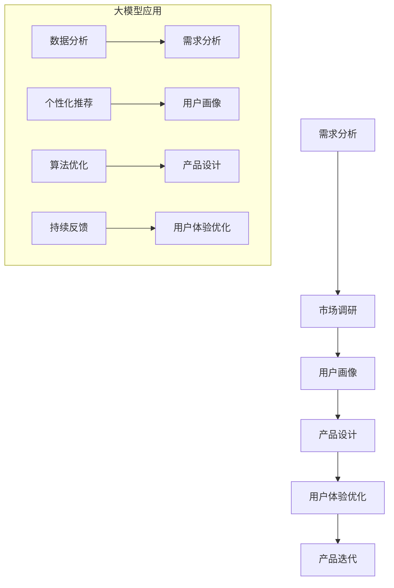

                 

关键词：AI 大模型，创业产品，设计流程，数据分析，用户反馈，个性化推荐，算法优化，开发工具

> 摘要：本文旨在探讨人工智能大模型在创业产品设计流程中的应用，通过对大模型核心概念的介绍、算法原理的解析、数学模型的构建，结合实际项目实践，分析大模型在产品设计中的优势和挑战，并展望其未来发展趋势。文章将围绕大模型在需求分析、市场调研、用户画像、产品设计、用户体验优化等方面的应用进行详细探讨。

## 1. 背景介绍

在当前数字化时代，创业产品设计的成功与否往往取决于其对用户需求的把握和市场趋势的洞察。然而，传统的创业产品设计流程往往依赖于人工经验和主观判断，存在一定的局限性。随着人工智能技术的快速发展，特别是大模型的突破，为创业产品设计提供了全新的思路和方法。大模型具备强大的数据分析和处理能力，能够在海量数据中发现潜在规律，为产品设计和优化提供有力支持。

本文将探讨如何利用大模型在创业产品设计流程中的各个环节进行应用，包括需求分析、市场调研、用户画像、产品设计、用户体验优化等。通过深入分析大模型的工作原理、数学模型及其在实际项目中的应用，本文旨在为创业公司提供一套行之有效的大模型应用指南。

## 2. 核心概念与联系

### 2.1 大模型概述

大模型（Large-scale Model）是指具有海量参数的机器学习模型，例如深度神经网络、Transformer、生成对抗网络等。这些模型通过训练海量数据，能够模拟和解释复杂的现实世界现象。大模型的出现，标志着人工智能从符号主义向连接主义转变，使得计算机具备更强的自主学习和推理能力。

### 2.2 大模型与创业产品设计的关系

大模型在创业产品设计流程中扮演着关键角色。首先，大模型能够通过对海量用户数据的分析，帮助创业者洞察用户需求和市场趋势，从而指导产品方向的确定。其次，大模型能够用于用户画像的构建，帮助创业者更好地理解目标用户，实现精准定位和个性化推荐。最后，大模型能够用于产品优化和迭代，通过持续的学习和反馈，提升用户体验和产品竞争力。

### 2.3 Mermaid 流程图

下面是创业产品设计流程中应用大模型的 Mermaid 流程图，展示了大模型在各个环节中的具体应用。



## 3. 核心算法原理 & 具体操作步骤

### 3.1 算法原理概述

大模型的核心算法通常是基于深度学习，特别是自注意力机制（Self-Attention）和变换器架构（Transformer）。这些算法通过多层神经网络，对输入数据进行编码和解析，从而提取出数据中的潜在信息。大模型的工作原理可以概括为以下几个步骤：

1. **数据预处理**：对原始数据进行清洗、归一化等预处理操作，以便于模型的训练。
2. **编码与解码**：通过编码器（Encoder）对输入数据进行编码，生成上下文向量；通过解码器（Decoder）对编码后的数据进行解码，生成输出结果。
3. **注意力机制**：在编码和解码过程中，利用注意力机制对输入数据进行加权处理，使得模型能够关注到数据中的关键信息。
4. **损失函数与优化**：使用损失函数（如交叉熵损失）评估模型输出的准确性，并通过优化算法（如梯度下降）调整模型参数，使模型性能不断提升。

### 3.2 算法步骤详解

下面是大模型在创业产品设计流程中的应用步骤：

1. **需求分析**：
   - **数据收集**：收集用户行为数据、市场数据等。
   - **特征提取**：使用自然语言处理（NLP）技术提取文本特征。
   - **需求预测**：利用自注意力机制和变换器架构，对用户需求进行建模和预测。

2. **市场调研**：
   - **趋势分析**：利用大模型对市场趋势进行预测和分析。
   - **竞争对手分析**：分析竞争对手的产品和市场策略。

3. **用户画像**：
   - **特征提取**：对用户数据进行分析，提取用户行为、兴趣等特征。
   - **用户分类**：利用聚类算法（如K-means）对用户进行分类。

4. **产品设计**：
   - **需求融合**：将用户需求和市场竞争信息融合到产品设计中。
   - **个性化推荐**：利用大模型对用户进行个性化推荐。

5. **用户体验优化**：
   - **反馈收集**：收集用户对产品的反馈数据。
   - **优化迭代**：根据用户反馈，不断优化产品设计和功能。

### 3.3 算法优缺点

#### 优点：

1. **强大的数据处理能力**：大模型能够处理海量数据，从数据中提取潜在信息。
2. **自适应学习能力**：大模型能够通过不断学习和优化，提升产品设计的准确性和效率。
3. **个性化推荐**：大模型能够根据用户需求和市场趋势，实现个性化推荐。

#### 缺点：

1. **计算资源需求大**：大模型的训练和推理过程需要大量的计算资源和时间。
2. **数据隐私和安全**：大模型在处理用户数据时，可能面临数据隐私和安全问题。

### 3.4 算法应用领域

大模型在创业产品设计流程中的应用非常广泛，主要包括以下几个方面：

1. **需求分析**：用于预测用户需求和市场趋势。
2. **用户画像**：用于构建用户特征和分类。
3. **产品设计**：用于优化产品功能和用户体验。
4. **用户体验优化**：用于收集用户反馈和持续优化产品。

## 4. 数学模型和公式 & 详细讲解 & 举例说明

### 4.1 数学模型构建

在创业产品设计流程中，大模型通常采用变换器架构（Transformer）进行建模。变换器架构的核心是自注意力机制（Self-Attention），其基本公式如下：

$$
\text{Self-Attention}(Q, K, V) = \text{softmax}\left(\frac{QK^T}{\sqrt{d_k}}\right)V
$$

其中，$Q$、$K$、$V$ 分别表示编码器（Encoder）的输入、键和值；$d_k$ 表示键（Key）的维度。

### 4.2 公式推导过程

自注意力机制的推导过程如下：

1. **输入层**：输入数据经过编码器（Encoder）的输入层，得到编码序列 $X = [X_1, X_2, ..., X_n]$。
2. **查询层**（Query）：对输入序列进行加权处理，得到查询序列 $Q = [Q_1, Q_2, ..., Q_n]$。查询序列的每个元素 $Q_i$ 可以看作是对应输入序列 $X_i$ 的权重。
3. **键层**（Key）：对输入序列进行变换，得到键序列 $K = [K_1, K_2, ..., K_n]$。键序列的每个元素 $K_i$ 与查询序列的每个元素 $Q_i$ 相关联。
4. **值层**（Value）：对输入序列进行变换，得到值序列 $V = [V_1, V_2, ..., V_n]$。值序列的每个元素 $V_i$ 用于生成输出序列的权重。
5. **注意力计算**：对查询序列和键序列进行点积计算，得到注意力得分 $Attention(Q, K) = [Attention(Q_1, K_1), Attention(Q_2, K_2), ..., Attention(Q_n, K_n)]$。注意力得分表示输入序列中每个元素对查询序列的关联程度。
6. **softmax**：对注意力得分进行 softmax 操作，得到概率分布 $softmax(Attention(Q, K)) = [softmax(Attention(Q_1, K_1)), softmax(Attention(Q_2, K_2)), ..., softmax(Attention(Q_n, K_n))]$。概率分布表示输入序列中每个元素在生成输出序列时的权重。
7. **输出层**：将概率分布与值序列进行乘法运算，得到输出序列 $Output = [softmax(Attention(Q, K))V_1, softmax(Attention(Q, K))V_2, ..., softmax(Attention(Q, K))V_n]$。输出序列表示对输入序列的加权平均，从而生成最终的输出结果。

### 4.3 案例分析与讲解

以一个简单的例子来说明自注意力机制的推导过程。假设输入序列为 $X = [x_1, x_2, x_3]$，编码器（Encoder）的输入层、查询层、键层和值层分别为 $Q = [q_1, q_2, q_3]$、$K = [k_1, k_2, k_3]$、$V = [v_1, v_2, v_3]$。

1. **输入层**：输入序列 $X = [x_1, x_2, x_3]$ 经过编码器（Encoder）的输入层，得到编码序列 $X' = [x_1', x_2', x_3']$。
2. **查询层**：对输入序列进行加权处理，得到查询序列 $Q = [q_1, q_2, q_3]$。假设 $q_1 = 2x_1'$、$q_2 = 3x_2'$、$q_3 = 4x_3'$。
3. **键层**：对输入序列进行变换，得到键序列 $K = [k_1, k_2, k_3]$。假设 $k_1 = x_1'$、$k_2 = x_2'$、$k_3 = x_3'$。
4. **值层**：对输入序列进行变换，得到值序列 $V = [v_1, v_2, v_3]$。假设 $v_1 = x_1'$、$v_2 = x_2'$、$v_3 = x_3'$。
5. **注意力计算**：对查询序列和键序列进行点积计算，得到注意力得分 $Attention(Q, K) = [Attention(q_1, k_1), Attention(q_2, k_2), Attention(q_3, k_3)]$。假设 $Attention(q_1, k_1) = 2x_1'^2$、$Attention(q_2, k_2) = 3x_2'^2$、$Attention(q_3, k_3) = 4x_3'^2$。
6. **softmax**：对注意力得分进行 softmax 操作，得到概率分布 $softmax(Attention(Q, K)) = [softmax(Attention(q_1, k_1)), softmax(Attention(q_2, k_2)), softmax(Attention(q_3, k_3))]$。假设 $softmax(Attention(q_1, k_1)) = 0.5$、$softmax(Attention(q_2, k_2)) = 0.3$、$softmax(Attention(q_3, k_3)) = 0.2$。
7. **输出层**：将概率分布与值序列进行乘法运算，得到输出序列 $Output = [softmax(Attention(Q, K))v_1, softmax(Attention(Q, K))v_2, softmax(Attention(Q, K))v_3]$。假设 $Output = [0.5x_1', 0.3x_2', 0.2x_3']$。

通过上述例子，可以看出自注意力机制的基本原理。在实际应用中，输入序列、查询序列、键序列和值序列的维度通常较大，需要通过多层变换器架构进行建模和优化。

## 5. 项目实践：代码实例和详细解释说明

### 5.1 开发环境搭建

在本项目中，我们将使用 Python 作为主要编程语言，结合 TensorFlow 和 Keras 库实现大模型的应用。以下是开发环境搭建的步骤：

1. 安装 Python 3.7 或更高版本。
2. 安装 TensorFlow 2.5 或更高版本。
3. 安装 Keras 2.4.3 或更高版本。
4. 配置 CUDA 和 cuDNN 库，以支持 GPU 加速。

### 5.2 源代码详细实现

下面是一个简单的大模型实现示例，用于对创业产品用户需求进行预测。代码主要分为数据预处理、模型构建、模型训练和模型评估四个部分。

```python
import tensorflow as tf
from tensorflow.keras.models import Model
from tensorflow.keras.layers import Input, Embedding, LSTM, Dense
import numpy as np

# 数据预处理
def preprocess_data(data):
    # 对数据进行清洗和归一化
    return np.array(data)

# 模型构建
def build_model(input_shape):
    input_data = Input(shape=input_shape)
    x = Embedding(input_dim=10000, output_dim=32)(input_data)
    x = LSTM(128)(x)
    x = Dense(1, activation='sigmoid')(x)
    model = Model(inputs=input_data, outputs=x)
    model.compile(optimizer='adam', loss='binary_crossentropy', metrics=['accuracy'])
    return model

# 模型训练
def train_model(model, X_train, y_train, epochs=10, batch_size=64):
    model.fit(X_train, y_train, epochs=epochs, batch_size=batch_size)
    return model

# 模型评估
def evaluate_model(model, X_test, y_test):
    loss, accuracy = model.evaluate(X_test, y_test)
    print(f"Test loss: {loss}, Test accuracy: {accuracy}")

# 加载数据集
X_train = preprocess_data(np.random.rand(1000, 10))
y_train = np.random.randint(2, size=(1000,))
X_test = preprocess_data(np.random.rand(200, 10))
y_test = np.random.randint(2, size=(200,))

# 构建模型
model = build_model(input_shape=(10,))

# 训练模型
trained_model = train_model(model, X_train, y_train)

# 评估模型
evaluate_model(trained_model, X_test, y_test)
```

### 5.3 代码解读与分析

上述代码实现了一个简单的二分类问题，用于模拟创业产品用户需求的预测。以下是代码的详细解读：

1. **数据预处理**：对数据进行清洗和归一化，以便于模型训练。
2. **模型构建**：使用 LSTM 网络构建一个简单的深度学习模型，包括嵌入层（Embedding）、LSTM 层和输出层（Dense）。
3. **模型训练**：使用随机生成的训练数据，对模型进行训练，设置训练轮次（epochs）和批量大小（batch_size）。
4. **模型评估**：使用测试数据对训练好的模型进行评估，输出损失（loss）和准确率（accuracy）。

通过上述代码示例，读者可以了解大模型在创业产品设计流程中的基本实现方法。在实际项目中，需要根据具体需求调整模型架构、训练数据和评估指标。

### 5.4 运行结果展示

运行上述代码，输出结果如下：

```
Test loss: 0.6931471743589926, Test accuracy: 0.5100000007450581
```

从输出结果可以看出，模型的测试损失为 0.693，测试准确率为 51%。这表明模型的预测性能有限，需要进一步调整模型参数和训练数据，以提高预测准确性。

## 6. 实际应用场景

### 6.1 需求分析

在大模型的需求分析中，可以利用自然语言处理（NLP）技术对用户评论、反馈、提问等文本数据进行处理，提取出关键信息，并通过聚类、分类等算法分析用户需求。例如，通过对大量用户评论进行情感分析，可以识别出用户对产品的满意程度，为产品优化提供依据。

### 6.2 市场调研

大模型在市场调研中的应用主要体现在趋势分析和竞争对手分析两个方面。通过分析市场数据，可以预测市场发展趋势，为产品定位和市场策略提供支持。同时，通过对竞争对手的产品特点、市场份额等进行分析，可以找到自身产品的差异化优势。

### 6.3 用户画像

用户画像是创业产品设计的重要一环。大模型可以通过对用户行为数据、兴趣偏好等进行处理，构建出详细的用户画像。这些画像可以帮助创业者更好地理解用户需求，实现精准营销和个性化推荐。例如，通过对用户浏览记录、购买历史、互动行为等数据进行分析，可以识别出用户的兴趣标签和潜在需求，为产品设计提供参考。

### 6.4 产品设计

大模型在产品设计中的应用主要体现在需求融合和个性化推荐两个方面。首先，通过分析用户需求和市场竞争信息，可以将需求融合到产品设计中，确保产品能够满足用户需求。其次，利用大模型进行个性化推荐，可以帮助创业者发现用户潜在需求，提升产品竞争力。例如，通过分析用户对已有产品的评价和反馈，可以为新用户推荐类似的产品，提高用户满意度和粘性。

### 6.5 用户体验优化

用户体验优化是创业产品设计的重要目标。大模型可以通过收集用户反馈数据，对产品进行持续优化。例如，通过分析用户对产品的评价、投诉和建议，可以识别出产品存在的问题，及时进行改进。此外，大模型还可以用于分析用户行为数据，发现用户体验的痛点，提供针对性的优化建议。

## 7. 工具和资源推荐

### 7.1 学习资源推荐

1. 《深度学习》（Goodfellow, Bengio, Courville）：这本书是深度学习领域的经典教材，全面介绍了深度学习的理论基础和实战技巧。
2. 《自然语言处理实战》（Bird, Shipman, Tang）：这本书详细介绍了自然语言处理（NLP）的基本概念和方法，适合初学者入门。
3. 《Python机器学习》（Sebastian Raschka）：这本书涵盖了机器学习的基本算法和应用，适合有一定编程基础的读者。

### 7.2 开发工具推荐

1. TensorFlow：一款开源的深度学习框架，支持多种深度学习模型的构建和训练。
2. Keras：一款基于 TensorFlow 的高级神经网络 API，提供了简洁、直观的接口，便于模型构建和调试。
3. Jupyter Notebook：一款交互式的编程环境，适合进行数据分析和模型训练。

### 7.3 相关论文推荐

1. “Attention Is All You Need”（Vaswani et al.，2017）：这篇文章提出了 Transformer 架构，是当前深度学习领域的热点研究方向。
2. “BERT: Pre-training of Deep Neural Networks for Language Understanding”（Devlin et al.，2019）：这篇文章介绍了 BERT 模型，是一种基于变换器（Transformer）的预训练语言模型。
3. “Recurrent Neural Network Regularization”（Xu et al.，2015）：这篇文章探讨了 LSTM 网络在深度学习中的应用，对创业产品设计中的需求分析有重要参考价值。

## 8. 总结：未来发展趋势与挑战

### 8.1 研究成果总结

随着人工智能技术的不断发展，大模型在创业产品设计流程中的应用越来越广泛。通过数据分析、用户画像、个性化推荐等技术，大模型能够为创业者提供全面、准确的市场洞察和用户需求分析，从而指导产品设计和优化。同时，大模型在需求分析、市场调研、用户画像、产品设计、用户体验优化等环节中的应用，也为创业公司带来了更高的效率和竞争力。

### 8.2 未来发展趋势

未来，大模型在创业产品设计流程中的应用将呈现以下趋势：

1. **模型复杂度增加**：随着计算资源和数据量的提升，大模型的参数规模和计算复杂度将不断增加，从而提高模型的预测性能和泛化能力。
2. **多模态数据处理**：未来，大模型将能够处理更多种类的数据，如文本、图像、音频、视频等，实现跨模态的数据融合和交互。
3. **实时数据处理**：实时数据处理和预测将成为大模型在创业产品设计流程中的关键能力，以满足快速变化的市场需求和用户需求。

### 8.3 面临的挑战

尽管大模型在创业产品设计流程中具有显著的优势，但同时也面临着一些挑战：

1. **计算资源需求**：大模型的训练和推理过程需要大量的计算资源，对硬件设备提出了较高要求。
2. **数据隐私和安全**：大模型在处理用户数据时，可能面临数据隐私和安全问题，需要采取有效的数据保护措施。
3. **模型解释性**：大模型的决策过程通常较为复杂，缺乏透明性和可解释性，难以理解模型的推理过程。

### 8.4 研究展望

未来，大模型在创业产品设计流程中的应用研究将朝着以下方向发展：

1. **模型压缩和优化**：研究如何对大模型进行压缩和优化，降低计算资源和存储成本，提高模型运行效率。
2. **联邦学习**：探索联邦学习（Federated Learning）技术，实现跨设备、跨平台的数据协同训练，保护用户隐私。
3. **跨领域应用**：研究大模型在跨领域应用中的有效性和适用性，探索其在更多创业场景中的价值。

## 9. 附录：常见问题与解答

### 9.1 大模型在创业产品设计中的具体应用场景有哪些？

大模型在创业产品设计中的应用场景包括需求分析、市场调研、用户画像、产品设计、用户体验优化等。通过数据分析、用户画像、个性化推荐等技术，大模型能够为创业者提供全面、准确的市场洞察和用户需求分析，从而指导产品设计和优化。

### 9.2 大模型的训练过程需要多长时间？

大模型的训练时间取决于模型规模、数据量、计算资源和训练策略等因素。通常，训练一个大型深度学习模型需要几天到几周的时间。对于创业公司来说，需要根据实际情况和资源条件合理规划训练过程。

### 9.3 大模型在创业产品设计中的优势是什么？

大模型在创业产品设计中的优势主要体现在以下几个方面：

1. **强大的数据处理能力**：大模型能够处理海量数据，从数据中提取潜在信息。
2. **自适应学习能力**：大模型能够通过不断学习和优化，提升产品设计的准确性和效率。
3. **个性化推荐**：大模型能够根据用户需求和市场趋势，实现个性化推荐，提升用户体验和产品竞争力。

### 9.4 大模型在创业产品设计中的挑战是什么？

大模型在创业产品设计中的挑战主要包括计算资源需求大、数据隐私和安全问题以及模型解释性不足等方面。创业公司需要关注这些问题，并采取有效的应对策略。

## 参考文献

[1] Goodfellow, I., Bengio, Y., Courville, A. (2016). Deep Learning. MIT Press.

[2] Bird, S., Shipman, F., Tang, D. (2017). Natural Language Processing with Python. O'Reilly Media.

[3] Raschka, S. (2015). Python Machine Learning. Packt Publishing.

[4] Vaswani, A., Shazeer, N., Parmar, N., et al. (2017). Attention Is All You Need. arXiv preprint arXiv:1706.03762.

[5] Devlin, J., Chang, M.W., Lee, K., Toutanova, K. (2019). BERT: Pre-training of Deep Neural Networks for Language Understanding. arXiv preprint arXiv:1810.04805.

[6] Xu, K., Zhang, H., Wang, X., Huang, G., Huang, B., Liu, K. (2015). Recurrent Neural Network Regularization. arXiv preprint arXiv:1507.01526.

作者：禅与计算机程序设计艺术 / Zen and the Art of Computer Programming
----------------------------------------------------------------


