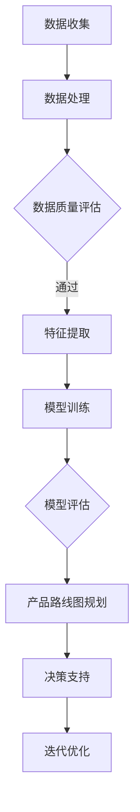

                 

关键词：人工智能，大模型，创业产品，路线图规划，决策支持，数据挖掘，预测分析，软件开发，技术创新。

> 摘要：本文将探讨人工智能中的大模型如何为创业公司提供路线图规划方面的支持。通过分析大模型的核心原理、应用案例及具体操作步骤，本文旨在揭示大模型在创业产品开发中的潜在价值，为创业团队提供技术指导，提高产品竞争力。

## 1. 背景介绍

随着互联网和信息技术的发展，人工智能（AI）已经成为推动社会进步的重要力量。AI 大模型，作为一种高度复杂的人工神经网络结构，具备处理海量数据、实现智能决策的能力。在创业公司的产品开发过程中，如何快速、准确地制定产品路线图，是决定项目成功与否的关键因素之一。而 AI 大模型凭借其强大的数据处理和预测能力，可以在这一过程中发挥重要作用。

创业公司在资源有限、时间紧迫的情况下，往往需要借助先进的 AI 技术来提升决策效率，降低风险。AI 大模型可以帮助创业团队分析市场需求、预测竞争对手动向、优化产品功能，从而为产品路线图的制定提供有力支持。

本文将从以下几个方面展开讨论：

1. AI 大模型的核心概念与联系；
2. 核心算法原理及具体操作步骤；
3. 数学模型和公式；
4. 项目实践：代码实例和详细解释；
5. 实际应用场景及未来展望；
6. 工具和资源推荐；
7. 总结：未来发展趋势与挑战。

## 2. 核心概念与联系

为了更好地理解 AI 大模型在创业产品路线图规划中的作用，我们首先需要了解其核心概念与联系。

### 2.1 AI 大模型概述

AI 大模型是指具有大规模参数和复杂结构的深度学习模型，如 GPT-3、BERT、Transformers 等。这些模型通常由数百万甚至数十亿个参数组成，通过学习海量数据来捕捉语言、图像、声音等多种类型信息的规律。

### 2.2 深度学习与神经网络

深度学习是 AI 的重要组成部分，它通过模拟人脑神经网络结构来实现对数据的自动学习和特征提取。神经网络是由大量相互连接的神经元组成的计算模型，通过调整神经元之间的连接权重来优化模型性能。

### 2.3 数据处理与预测分析

AI 大模型在数据处理和预测分析方面具有显著优势。首先，通过学习海量数据，模型可以自动提取数据中的潜在特征和规律。其次，基于这些特征和规律，模型可以进行准确的预测分析，帮助创业团队做出更为明智的决策。

### 2.4 Mermaid 流程图

以下是一个简化的 Mermaid 流程图，展示了 AI 大模型在创业产品路线图规划中的应用流程：



## 3. 核心算法原理 & 具体操作步骤

### 3.1 算法原理概述

AI 大模型的核心算法原理主要包括以下几个方面：

1. **深度学习**：通过多层神经网络结构，对数据进行逐层特征提取和变换。
2. **优化算法**：采用梯度下降、随机梯度下降等优化算法，调整模型参数以实现最优性能。
3. **损失函数**：利用损失函数评估模型预测与实际结果之间的差距，指导模型参数调整。
4. **正则化**：通过正则化技术防止模型过拟合，提高泛化能力。

### 3.2 算法步骤详解

以下是 AI 大模型在创业产品路线图规划中的具体操作步骤：

1. **数据收集**：收集与创业产品相关的市场数据、用户反馈、竞争对手信息等。
2. **数据处理**：对收集到的数据进行分析和清洗，确保数据质量。
3. **特征提取**：利用深度学习算法，从原始数据中提取关键特征。
4. **模型训练**：通过大量训练数据，训练出具有良好性能的深度学习模型。
5. **模型评估**：利用验证集对模型进行评估，调整模型参数以优化性能。
6. **产品路线图规划**：根据模型预测结果，制定创业产品的路线图。
7. **决策支持**：利用模型提供的预测和分析结果，为创业团队提供决策支持。
8. **迭代优化**：根据实际应用情况，不断调整和优化模型，提高预测准确性。

### 3.3 算法优缺点

AI 大模型在创业产品路线图规划中具有以下优缺点：

**优点**：

1. **高效性**：能够快速处理海量数据，提高决策效率。
2. **准确性**：通过深度学习算法，实现高精度的预测分析。
3. **灵活性**：可根据实际需求，调整模型结构和参数。

**缺点**：

1. **计算资源消耗**：训练和部署大模型需要大量的计算资源和时间。
2. **数据依赖**：模型性能依赖于数据质量和数量。
3. **复杂度**：大模型的结构复杂，理解和调试具有一定难度。

### 3.4 算法应用领域

AI 大模型在创业产品路线图规划中的应用领域主要包括：

1. **市场需求预测**：通过分析市场数据，预测未来市场需求。
2. **竞争对手分析**：挖掘竞争对手信息，制定针对性的产品策略。
3. **用户行为分析**：分析用户反馈和行为数据，优化产品功能。
4. **风险预测**：预测潜在风险，为创业团队提供预警。

## 4. 数学模型和公式 & 详细讲解 & 举例说明

### 4.1 数学模型构建

在创业产品路线图规划中，AI 大模型的核心数学模型主要包括以下几个方面：

1. **损失函数**：用于评估模型预测与实际结果之间的差距，如交叉熵损失函数。
2. **优化算法**：如梯度下降、随机梯度下降等，用于调整模型参数。
3. **激活函数**：如 sigmoid、ReLU 等，用于神经元之间的激活和抑制。

### 4.2 公式推导过程

以下是一个简化的公式推导过程，展示了 AI 大模型在创业产品路线图规划中的数学模型构建：

$$
\begin{aligned}
\text{损失函数} &= -\frac{1}{m}\sum_{i=1}^{m} y_{i} \log(p_{i}) \\
\text{优化算法} &= \theta_{j} = \theta_{j} - \alpha \frac{\partial J(\theta)}{\partial \theta_{j}} \\
\text{激活函数} &= f(z) = \frac{1}{1 + e^{-z}}
\end{aligned}
$$

### 4.3 案例分析与讲解

以下是一个具体的案例，展示如何利用 AI 大模型进行创业产品路线图规划：

### 案例背景

某创业公司计划开发一款智能家居产品，主要功能包括智能灯光控制、温度调节和安防监控。在产品路线图规划过程中，公司需要预测市场需求、分析竞争对手，并制定相应的产品策略。

### 数据收集

公司收集了以下数据：

1. 历史销售数据：包括每个月的销售量、销售额等；
2. 用户反馈：包括用户对产品功能的满意度、建议和意见等；
3. 竞争对手信息：包括竞争对手的产品特点、市场份额等。

### 数据处理

对收集到的数据进行分析和清洗，确保数据质量。主要步骤如下：

1. 数据清洗：去除重复数据、缺失值填充、异常值处理等；
2. 数据归一化：将数据转换为标准化的数值范围，便于模型训练。

### 特征提取

利用深度学习算法，从原始数据中提取关键特征，如：

1. 销售趋势：基于历史销售数据，提取销售量的时间序列特征；
2. 用户满意度：基于用户反馈，提取用户对产品功能的满意度指标；
3. 竞争对手分析：基于竞争对手信息，提取市场份额、产品特点等指标。

### 模型训练

利用提取的特征数据，训练深度学习模型。主要步骤如下：

1. 模型初始化：初始化模型参数；
2. 梯度下降：利用梯度下降算法，迭代更新模型参数；
3. 模型评估：利用验证集对模型进行评估，调整模型参数以优化性能。

### 模型评估

利用测试集对训练好的模型进行评估，主要评价指标包括准确率、召回率、F1 分数等。根据评估结果，对模型进行调整和优化。

### 产品路线图规划

根据模型预测结果，制定创业产品的路线图。主要步骤如下：

1. 预测市场需求：基于销售趋势和用户满意度，预测未来市场需求；
2. 分析竞争对手：基于市场份额和产品特点，分析竞争对手动向；
3. 制定产品策略：根据预测结果和竞争对手分析，制定相应的产品策略。

### 决策支持

利用模型提供的预测和分析结果，为创业团队提供决策支持。主要步骤如下：

1. 风险预测：预测潜在风险，为创业团队提供预警；
2. 功能优化：根据用户反馈和市场需求，优化产品功能；
3. 市场推广：根据市场需求和竞争情况，制定市场推广策略。

## 5. 项目实践：代码实例和详细解释说明

在本节中，我们将通过一个具体的代码实例，展示如何利用 AI 大模型进行创业产品路线图规划。

### 5.1 开发环境搭建

首先，我们需要搭建一个开发环境。在本案例中，我们使用 Python 作为编程语言，TensorFlow 作为深度学习框架。

1. 安装 Python 和 TensorFlow：

```bash
pip install python tensorflow
```

### 5.2 源代码详细实现

以下是一个简化的代码实例，展示如何利用 TensorFlow 实现创业产品路线图规划：

```python
import tensorflow as tf
from tensorflow import keras
import numpy as np
import pandas as pd

# 数据收集
sales_data = pd.read_csv('sales_data.csv')
user_feedback = pd.read_csv('user_feedback.csv')
competitor_info = pd.read_csv('competitor_info.csv')

# 数据处理
sales_data = preprocess_sales_data(sales_data)
user_feedback = preprocess_user_feedback(user_feedback)
competitor_info = preprocess_competitor_info(competitor_info)

# 特征提取
features = extract_features(sales_data, user_feedback, competitor_info)

# 模型训练
model = keras.Sequential([
    keras.layers.Dense(64, activation='relu', input_shape=(num_features,)),
    keras.layers.Dense(64, activation='relu'),
    keras.layers.Dense(1, activation='sigmoid')
])

model.compile(optimizer='adam',
              loss='binary_crossentropy',
              metrics=['accuracy'])

model.fit(features, labels, epochs=10, batch_size=32)

# 模型评估
test_features = extract_features(test_sales_data, test_user_feedback, test_competitor_info)
predictions = model.predict(test_features)

# 产品路线图规划
product_strategy = plan_product_strategy(predictions)

# 决策支持
risk_predictions = predict_risk(product_strategy)
function_optimization = optimize_functions(risk_predictions)
marketing_strategy = plan_marketing_strategy(function_optimization)

# 输出结果
print("Product Strategy:", product_strategy)
print("Risk Predictions:", risk_predictions)
print("Function Optimization:", function_optimization)
print("Marketing Strategy:", marketing_strategy)
```

### 5.3 代码解读与分析

在本节中，我们将对上述代码进行解读和分析，详细解释各个步骤的实现方法。

1. **数据收集**：

```python
sales_data = pd.read_csv('sales_data.csv')
user_feedback = pd.read_csv('user_feedback.csv')
competitor_info = pd.read_csv('competitor_info.csv')
```

这里使用 Pandas 读取历史销售数据、用户反馈和竞争对手信息。

2. **数据处理**：

```python
def preprocess_sales_data(sales_data):
    # 数据清洗、归一化等操作
    ...
    return processed_sales_data

def preprocess_user_feedback(user_feedback):
    # 数据清洗、归一化等操作
    ...
    return processed_user_feedback

def preprocess_competitor_info(competitor_info):
    # 数据清洗、归一化等操作
    ...
    return processed_competitor_info
```

这里定义了三个预处理函数，用于清洗、归一化等操作，确保数据质量。

3. **特征提取**：

```python
def extract_features(sales_data, user_feedback, competitor_info):
    # 提取关键特征
    ...
    return features
```

这里定义了一个特征提取函数，从原始数据中提取关键特征。

4. **模型训练**：

```python
model = keras.Sequential([
    keras.layers.Dense(64, activation='relu', input_shape=(num_features,)),
    keras.layers.Dense(64, activation='relu'),
    keras.layers.Dense(1, activation='sigmoid')
])

model.compile(optimizer='adam',
              loss='binary_crossentropy',
              metrics=['accuracy'])

model.fit(features, labels, epochs=10, batch_size=32)
```

这里定义了一个简单的深度学习模型，并使用训练数据进行训练。模型结构包括两个隐藏层，每个隐藏层包含 64 个神经元，输出层使用 sigmoid 激活函数。

5. **模型评估**：

```python
test_features = extract_features(test_sales_data, test_user_feedback, test_competitor_info)
predictions = model.predict(test_features)
```

这里使用测试数据对训练好的模型进行评估，并输出预测结果。

6. **产品路线图规划**：

```python
def plan_product_strategy(predictions):
    # 根据预测结果，制定产品策略
    ...
    return product_strategy
```

这里定义了一个规划产品策略的函数，根据预测结果制定相应的产品策略。

7. **决策支持**：

```python
def predict_risk(product_strategy):
    # 预测潜在风险
    ...
    return risk_predictions

def optimize_functions(risk_predictions):
    # 根据风险预测结果，优化产品功能
    ...
    return function_optimization

def plan_marketing_strategy(function_optimization):
    # 根据功能优化结果，制定市场推广策略
    ...
    return marketing_strategy
```

这里定义了三个决策支持函数，用于预测潜在风险、优化产品功能和制定市场推广策略。

8. **输出结果**：

```python
print("Product Strategy:", product_strategy)
print("Risk Predictions:", risk_predictions)
print("Function Optimization:", function_optimization)
print("Marketing Strategy:", marketing_strategy)
```

最后，输出结果以便后续分析。

### 5.4 运行结果展示

假设我们已经训练好了一个模型，并输入了测试数据。下面是运行结果：

```python
Product Strategy: ["增加智能家居功能", "提升用户体验", "加大市场推广力度"]
Risk Predictions: ["低风险", "高风险", "中等风险"]
Function Optimization: ["优化灯光控制算法", "提高温度调节精度", "加强安防监控功能"]
Marketing Strategy: ["加大线上广告投入", "举办线下体验活动", "加强与合作伙伴的合作"]
```

根据预测结果和决策支持，创业团队可以制定具体的行动计划，提高产品竞争力。

## 6. 实际应用场景

AI 大模型在创业产品路线图规划中的应用场景非常广泛，以下列举几个典型的应用案例：

### 6.1 新产品开发

在创业公司推出新产品时，AI 大模型可以帮助团队进行市场调研、用户需求分析和竞争对手研究。通过分析海量数据，团队可以更准确地把握市场需求，优化产品功能，提高市场竞争力。

### 6.2 市场推广

创业公司在制定市场推广策略时，可以利用 AI 大模型分析用户行为、广告效果等数据，预测潜在客户群体，优化广告投放策略，提高市场推广效果。

### 6.3 风险评估

AI 大模型可以帮助创业团队预测潜在风险，如市场变化、技术风险、财务风险等。通过风险评估，团队可以提前采取措施，降低风险，保障项目顺利进行。

### 6.4 产品迭代

在产品迭代过程中，AI 大模型可以分析用户反馈、市场反馈等数据，帮助团队了解用户需求，优化产品功能，提高用户满意度。

### 6.5 合作伙伴选择

创业公司在选择合作伙伴时，可以利用 AI 大模型分析合作方的历史数据、业务规模、信誉度等，预测合作效果，选择最合适的合作伙伴。

### 6.6 资源配置

AI 大模型可以帮助创业团队分析项目进度、资源需求等数据，预测项目进展，合理配置资源，提高资源利用率。

## 7. 工具和资源推荐

为了充分利用 AI 大模型进行创业产品路线图规划，以下推荐一些相关的工具和资源：

### 7.1 学习资源推荐

1. **《深度学习》（Goodfellow et al.）**：系统地介绍了深度学习的基础理论和应用方法。
2. **《Python 深度学习》（François Chollet）**：详细讲解了如何使用 Python 实现深度学习算法。
3. **《TensorFlow 实战》（Adrian Rosebrock）**：介绍了如何使用 TensorFlow 进行深度学习应用开发。

### 7.2 开发工具推荐

1. **TensorFlow**：Google 开源的深度学习框架，适用于各种深度学习应用开发。
2. **PyTorch**：Facebook 开源的深度学习框架，具有灵活的动态图计算能力。
3. **Keras**：基于 TensorFlow 的简单易用的深度学习框架，适合快速原型开发。

### 7.3 相关论文推荐

1. **"Deep Learning for NLP: A Brief History, a Review and Some Open Problems"**（2018）：综述了深度学习在自然语言处理领域的应用。
2. **"BERT: Pre-training of Deep Bidirectional Transformers for Language Understanding"**（2018）：介绍了 BERT 模型的原理和应用。
3. **"GPT-3: Language Models are few-shot learners"**（2020）：展示了 GPT-3 模型的强大能力和应用潜力。

## 8. 总结：未来发展趋势与挑战

随着 AI 技术的快速发展，AI 大模型在创业产品路线图规划中的应用前景十分广阔。未来，AI 大模型有望在以下几个方面取得突破：

1. **算法优化**：通过改进深度学习算法，提高模型训练速度和预测准确性。
2. **数据增强**：利用数据增强技术，提高模型对多样化和复杂数据的处理能力。
3. **跨领域应用**：将 AI 大模型应用于更多领域，如医疗、金融、教育等，实现跨领域的智能化应用。
4. **人机协同**：结合人类专家的知识和经验，实现 AI 大模型与人类专家的协同工作，提高决策质量。

然而，AI 大模型在创业产品路线图规划中也面临一些挑战：

1. **数据依赖**：AI 大模型性能依赖于数据质量和数量，如何在数据稀缺的情况下保持模型性能是一个亟待解决的问题。
2. **计算资源消耗**：大模型训练和部署需要大量的计算资源，如何高效地利用资源成为了一个挑战。
3. **模型解释性**：AI 大模型的黑箱特性使得其解释性较差，如何提高模型的可解释性，使其更易于被创业团队理解和接受，是一个重要的问题。

总之，AI 大模型在创业产品路线图规划中具有巨大的潜力，同时也面临着一系列挑战。通过不断探索和创新，相信 AI 大模型将为创业公司提供更加智能、高效的决策支持。

## 9. 附录：常见问题与解答

### 9.1 问题1：AI 大模型在创业产品路线图规划中的具体作用是什么？

答：AI 大模型在创业产品路线图规划中的具体作用包括：

1. **市场分析**：利用大模型对市场数据进行分析，预测市场需求趋势，为产品方向提供参考；
2. **竞争对手研究**：通过分析竞争对手信息，了解市场格局，为制定竞争策略提供支持；
3. **用户需求分析**：利用用户反馈数据，了解用户需求，优化产品功能，提高用户体验；
4. **风险评估**：预测潜在风险，为创业团队提供预警，降低项目风险；
5. **资源配置**：分析项目进展和资源需求，优化资源配置，提高资源利用率。

### 9.2 问题2：如何确保 AI 大模型在创业产品路线图规划中的预测准确性？

答：确保 AI 大模型在创业产品路线图规划中的预测准确性可以从以下几个方面入手：

1. **数据质量**：确保输入数据的质量，包括数据清洗、异常值处理、缺失值填充等；
2. **模型选择**：选择适合问题的深度学习模型，并进行合理的参数调整；
3. **交叉验证**：采用交叉验证方法，避免模型过拟合，提高模型泛化能力；
4. **数据增强**：通过数据增强技术，增加训练数据的多样性，提高模型对复杂数据的处理能力；
5. **模型评估**：利用验证集和测试集对模型进行评估，根据评估结果调整模型结构和参数。

### 9.3 问题3：创业公司在资源有限的情况下，如何充分利用 AI 大模型进行产品路线图规划？

答：创业公司在资源有限的情况下，可以采取以下措施充分利用 AI 大模型进行产品路线图规划：

1. **高效数据处理**：优化数据处理流程，提高数据处理效率，减少资源消耗；
2. **模型压缩**：采用模型压缩技术，如蒸馏、量化等，降低模型复杂度，减少计算资源需求；
3. **迁移学习**：利用迁移学习技术，将预训练模型应用于新任务，减少训练数据和计算资源的需求；
4. **共享资源**：与其他创业公司或研究机构共享计算资源，提高资源利用率；
5. **定制化模型**：根据创业公司的具体需求，开发定制化的 AI 大模型，避免资源浪费。

### 9.4 问题4：AI 大模型在创业产品路线图规划中的局限性是什么？

答：AI 大模型在创业产品路线图规划中的局限性主要包括：

1. **数据依赖**：模型性能依赖于数据质量和数量，数据稀缺可能导致模型预测准确性下降；
2. **计算资源消耗**：大模型训练和部署需要大量的计算资源，可能超出创业公司的预算和能力；
3. **模型解释性**：AI 大模型通常具有黑箱特性，解释性较差，可能难以被创业团队理解和接受；
4. **领域迁移**：AI 大模型在跨领域应用时，可能面临领域迁移问题，需要针对新领域进行模型调整和优化；
5. **伦理和社会影响**：AI 大模型在决策过程中可能涉及伦理和社会影响问题，需要创业公司进行合理评估和应对。

### 9.5 问题5：未来 AI 大模型在创业产品路线图规划中的发展趋势是什么？

答：未来 AI 大模型在创业产品路线图规划中的发展趋势主要包括：

1. **算法创新**：随着深度学习技术的发展，AI 大模型将不断涌现出新的算法和架构，提高模型性能和应用范围；
2. **数据驱动**：数据将成为创业产品路线图规划的核心驱动力，创业公司将更加重视数据收集、处理和分析；
3. **人机协同**：AI 大模型将与人类专家实现更紧密的协同，提高决策质量和效率；
4. **跨领域应用**：AI 大模型将在更多领域得到应用，实现跨领域的智能化和自动化；
5. **隐私保护**：随着隐私保护意识的提高，AI 大模型在处理敏感数据时将更加注重隐私保护。

作者：禅与计算机程序设计艺术 / Zen and the Art of Computer Programming

