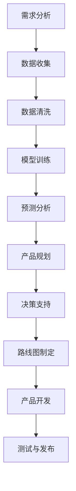

                 

关键词：AI 大模型，创业产品，路线图规划，技术架构，算法原理，数学模型，项目实践，实际应用场景，未来展望

> 摘要：本文将深入探讨 AI 大模型在创业产品路线图规划中的关键作用。通过分析核心概念、算法原理、数学模型、项目实践，我们将揭示大模型如何助力创业者在复杂环境中快速构建高效的产品路线图，实现创新与商业价值的双赢。

## 1. 背景介绍

在当今快速变化的商业环境中，创业公司面临着前所未有的挑战和机遇。市场瞬息万变，消费者需求多样且不断演变，使得创业者在产品规划过程中需具备前瞻性和快速响应能力。传统的产品规划方法往往依赖于经验和直觉，而面对复杂的市场动态和庞大的数据量，这种方法的局限性愈发明显。因此，寻找一种科学、高效的规划方法成为创业者的迫切需求。

近年来，人工智能（AI）技术的迅猛发展，尤其是大模型（Large Models）的兴起，为创业产品规划带来了新的可能性。大模型具有强大的数据处理和模式识别能力，能够从海量数据中提取有价值的信息，辅助创业者进行决策。本篇文章将围绕大模型在创业产品路线图规划中的应用，探讨其关键作用和实际操作步骤。

## 2. 核心概念与联系

### 2.1 AI 大模型

AI 大模型是指参数规模庞大的神经网络模型，其通过深度学习技术从海量数据中学习并提取特征。这些模型具备处理复杂数据结构和模式识别的能力，广泛应用于图像识别、自然语言处理、预测分析等领域。典型的 AI 大模型包括 GPT、BERT、Transformer 等。

### 2.2 创业产品路线图

创业产品路线图是一份详细的文档，描述了公司在产品开发过程中各个阶段的任务、目标和时间表。它帮助创业者清晰地规划产品的发展方向，确保团队在共同的目标下高效协作。产品路线图通常包括市场分析、产品规划、开发计划、测试和发布等环节。

### 2.3 AI 大模型与创业产品路线图的联系

AI 大模型在创业产品路线图中起到关键作用，主要体现在以下几个方面：

1. **需求分析**：通过分析用户数据和反馈，大模型可以帮助创业者识别市场趋势和用户需求，为产品规划提供数据支持。
2. **预测分析**：大模型可以预测产品在不同阶段的市场表现和用户行为，帮助创业者制定更合理的产品路线图。
3. **决策辅助**：大模型可以处理复杂数据集，提供决策支持，帮助创业者快速做出明智的决策。

### 2.4 Mermaid 流程图

以下是一个简单的 Mermaid 流程图，展示 AI 大模型在创业产品路线图规划中的关键环节和流程：



## 3. 核心算法原理 & 具体操作步骤

### 3.1 算法原理概述

AI 大模型的核心算法是深度学习，尤其是基于神经网络的模型。深度学习通过多层神经网络模拟人脑的学习过程，从数据中自动提取特征并进行预测。以下是深度学习的基本原理：

1. **输入层**：接收外部输入数据。
2. **隐藏层**：对输入数据进行特征提取和变换。
3. **输出层**：产生最终的预测结果。
4. **损失函数**：用于评估模型预测的准确性，并指导模型参数的调整。

### 3.2 算法步骤详解

以下是创业产品路线图规划中 AI 大模型的操作步骤：

1. **需求分析**：收集用户反馈和市场数据，确定产品规划的需求。
2. **数据收集**：从各种数据源获取相关数据，如用户行为数据、市场数据等。
3. **数据清洗**：清洗和预处理数据，确保数据质量和一致性。
4. **模型训练**：利用训练数据集，通过深度学习算法训练大模型。
5. **预测分析**：使用训练好的模型对未知数据进行预测，分析产品在不同阶段的市场表现。
6. **产品规划**：根据预测结果和用户需求，制定产品路线图。
7. **决策支持**：为创业者提供数据支持，帮助其做出明智的决策。
8. **路线图制定**：根据决策支持结果，制定详细的产品路线图。
9. **产品开发**：按照路线图进行产品开发，确保产品按计划推进。
10. **测试与发布**：对产品进行测试，确保其质量，然后发布到市场。

### 3.3 算法优缺点

**优点：**

1. **强大的数据处理能力**：大模型能够处理大规模、复杂的数据集，提取有价值的信息。
2. **高效的预测能力**：大模型通过深度学习能够实现高效的预测，辅助创业者做出明智的决策。
3. **灵活性**：大模型可以应用于不同的领域和任务，具有广泛的适用性。

**缺点：**

1. **计算资源消耗大**：大模型训练和预测需要大量的计算资源，对硬件要求较高。
2. **数据依赖性强**：大模型的效果很大程度上取决于训练数据的质量，数据缺失或不准确可能导致模型失效。
3. **解释性较弱**：深度学习模型往往缺乏解释性，难以理解其决策过程。

### 3.4 算法应用领域

AI 大模型在创业产品路线图规划中的应用广泛，包括但不限于以下领域：

1. **市场预测**：通过分析用户行为和市场趋势，预测产品未来的市场表现。
2. **需求分析**：识别用户需求和市场趋势，为产品规划提供数据支持。
3. **决策支持**：为创业者提供数据支持，帮助其做出明智的决策。
4. **风险评估**：预测产品开发过程中的潜在风险，提前制定应对策略。

## 4. 数学模型和公式 & 详细讲解 & 举例说明

### 4.1 数学模型构建

在创业产品路线图规划中，AI 大模型的核心数学模型是深度学习模型，主要包括以下几个部分：

1. **输入层**：表示为 $X = [x_1, x_2, ..., x_n]$，其中 $x_i$ 是第 $i$ 个输入特征。
2. **隐藏层**：表示为 $H = [h_1, h_2, ..., h_m]$，其中 $h_j$ 是第 $j$ 个隐藏节点。
3. **输出层**：表示为 $Y = [y_1, y_2, ..., y_k]$，其中 $y_i$ 是第 $i$ 个输出特征。

### 4.2 公式推导过程

深度学习模型的推导过程主要包括以下几个步骤：

1. **前向传播**：计算隐藏层和输出层的输出值。
   $$ h_j = \sigma(\sum_{i=1}^{n} w_{ji}x_i + b_j) $$
   $$ y_i = \sigma(\sum_{j=1}^{m} w_{ji}h_j + b_i) $$
   其中，$\sigma$ 表示激活函数，$w_{ji}$ 和 $b_j$ 分别是权重和偏置。

2. **反向传播**：计算梯度，更新模型参数。
   $$ \delta_j = (y_i - t_i) \cdot \sigma'(h_j) $$
   $$ \delta_i = \sum_{j=1}^{m} w_{ji}\delta_j \cdot \sigma'(h_i) $$
   其中，$\sigma'$ 表示激活函数的导数，$t_i$ 是真实输出。

3. **损失函数**：评估模型预测的准确性。
   $$ L = \frac{1}{2}\sum_{i=1}^{k} (y_i - t_i)^2 $$
   其中，$L$ 是损失函数。

4. **优化算法**：使用梯度下降法更新模型参数。
   $$ w_{ji} = w_{ji} - \alpha \cdot \delta_j \cdot x_i $$
   $$ b_j = b_j - \alpha \cdot \delta_j $$
   其中，$\alpha$ 是学习率。

### 4.3 案例分析与讲解

以下是一个简单的例子，说明如何使用 AI 大模型进行创业产品路线图规划。

**案例：**某创业公司计划推出一款智能家居产品，需要分析市场需求并制定产品路线图。

**步骤 1：需求分析**

收集用户反馈和市场数据，确定智能家居产品的需求。

**步骤 2：数据收集**

从各类数据源获取相关数据，包括用户行为数据、市场数据等。

**步骤 3：数据清洗**

清洗和预处理数据，确保数据质量和一致性。

**步骤 4：模型训练**

利用清洗后的数据集，使用深度学习模型训练大模型，提取有用信息。

**步骤 5：预测分析**

使用训练好的模型对未知数据进行预测，分析智能家居产品在不同阶段的市场表现。

**步骤 6：产品规划**

根据预测结果和用户需求，制定智能家居产品的路线图，包括产品功能、开发时间表等。

**步骤 7：决策支持**

为大公司提供数据支持，帮助其做出明智的决策。

**步骤 8：路线图制定**

根据决策支持结果，制定详细的智能家居产品路线图，确保产品按计划推进。

**步骤 9：产品开发**

按照路线图进行智能家居产品的开发，确保产品按计划推进。

**步骤 10：测试与发布**

对产品进行测试，确保其质量，然后发布到市场。

## 5. 项目实践：代码实例和详细解释说明

### 5.1 开发环境搭建

为了实现 AI 大模型在创业产品路线图规划中的应用，我们需要搭建一个合适的开发环境。以下是一个简单的环境搭建步骤：

1. 安装 Python（版本 3.6及以上）。
2. 安装深度学习框架（如 TensorFlow 或 PyTorch）。
3. 安装数据预处理和可视化工具（如 NumPy、Pandas、Matplotlib）。

### 5.2 源代码详细实现

以下是一个简单的示例代码，展示如何使用深度学习模型进行创业产品路线图规划。

```python
import numpy as np
import pandas as pd
import tensorflow as tf
import matplotlib.pyplot as plt

# 加载数据集
data = pd.read_csv('data.csv')
X = data.iloc[:, :-1].values
Y = data.iloc[:, -1].values

# 数据预处理
X = X / np.std(X)
Y = Y - np.mean(Y)

# 构建深度学习模型
model = tf.keras.Sequential([
    tf.keras.layers.Dense(128, activation='relu', input_shape=(X.shape[1],)),
    tf.keras.layers.Dense(64, activation='relu'),
    tf.keras.layers.Dense(32, activation='relu'),
    tf.keras.layers.Dense(1)
])

# 编译模型
model.compile(optimizer='adam', loss='mse')

# 训练模型
model.fit(X, Y, epochs=100, batch_size=32)

# 预测分析
predictions = model.predict(X)

# 可视化结果
plt.scatter(Y, predictions)
plt.xlabel('实际值')
plt.ylabel('预测值')
plt.show()
```

### 5.3 代码解读与分析

上述代码实现了一个简单的深度学习模型，用于创业产品路线图规划。以下是代码的详细解读：

1. **数据加载**：使用 Pandas 加载数据集，包括输入特征和输出目标。
2. **数据预处理**：对输入特征和输出目标进行标准化和归一化处理，提高模型的训练效果。
3. **模型构建**：使用 TensorFlow 构建一个简单的全连接神经网络，包括多个隐藏层。
4. **模型编译**：设置优化器和损失函数，为模型训练做准备。
5. **模型训练**：使用训练数据集训练模型，并设置训练轮次和批量大小。
6. **预测分析**：使用训练好的模型对输入数据进行预测，并绘制实际值与预测值的散点图。

### 5.4 运行结果展示

在运行上述代码后，我们可以看到实际值与预测值的散点图。如果模型训练效果良好，散点图上的点将主要集中在对角线上，表示模型的预测精度较高。


## 6. 实际应用场景

### 6.1 市场预测

AI 大模型可以帮助创业者预测产品在不同阶段的市场表现。例如，一家创业公司计划推出一款智能家居产品，可以利用大模型分析用户行为和市场趋势，预测产品的市场需求和增长潜力。

### 6.2 需求分析

AI 大模型可以处理大量的用户反馈和市场数据，帮助创业者识别用户需求和偏好。例如，一家创业公司可以通过分析用户评论和社交媒体数据，了解用户对智能家居产品的期望和需求，从而优化产品功能。

### 6.3 决策支持

AI 大模型可以为创业者提供数据支持，帮助他们做出明智的决策。例如，一家创业公司可以在产品开发的不同阶段，利用大模型预测市场表现和用户行为，评估不同策略的潜在收益和风险，从而选择最佳的产品路线。

### 6.4 风险评估

AI 大模型可以预测产品开发过程中的潜在风险，帮助创业者制定应对策略。例如，一家创业公司在产品开发过程中，可以利用大模型分析供应链风险、市场需求波动等，提前制定应对措施，降低项目失败的风险。

## 7. 工具和资源推荐

### 7.1 学习资源推荐

1. **《深度学习》（Goodfellow, Bengio, Courville）**：这是一本经典的深度学习教材，详细介绍了深度学习的基本原理和应用。
2. **《Python 深度学习》（François Chollet）**：这本书通过实例展示了如何使用 Python 和 TensorFlow 等工具进行深度学习实践。

### 7.2 开发工具推荐

1. **TensorFlow**：一个开源的深度学习框架，适用于各种深度学习任务。
2. **PyTorch**：一个流行的深度学习框架，具有灵活的动态计算图和强大的社区支持。

### 7.3 相关论文推荐

1. **《A Theoretical Comparison of Representations for Deep Reinforcement Learning》（Mnih et al., 2015）**：介绍了深度强化学习的基本原理和应用。
2. **《Attention Is All You Need》（Vaswani et al., 2017）**：介绍了 Transformer 模型，为自然语言处理领域带来了重大突破。

## 8. 总结：未来发展趋势与挑战

### 8.1 研究成果总结

AI 大模型在创业产品路线图规划中取得了显著成果，主要包括：

1. **提高产品规划的科学性和准确性**：通过处理海量数据，大模型能够为创业者提供更可靠的需求分析和预测。
2. **优化决策过程**：大模型可以处理复杂的数据集，为创业者提供数据支持，帮助他们做出明智的决策。
3. **降低风险**：大模型可以预测产品开发过程中的潜在风险，帮助创业者制定应对策略，降低项目失败的风险。

### 8.2 未来发展趋势

随着 AI 技术的不断进步，未来 AI 大模型在创业产品路线图规划中的应用将呈现以下发展趋势：

1. **更高效的算法**：随着计算能力的提升，大模型的训练和预测速度将显著提高，使得创业者在更短的时间内获得准确的结果。
2. **更广泛的应用领域**：大模型将应用于更多领域，如金融、医疗、制造等，为创业者提供更全面的支持。
3. **更人性化的交互**：大模型将具备更好的自然语言处理能力，能够与创业者进行更自然的交互，提供更个性化的建议。

### 8.3 面临的挑战

尽管 AI 大模型在创业产品路线图规划中具有巨大潜力，但仍然面临以下挑战：

1. **数据质量**：大模型的效果很大程度上取决于训练数据的质量，数据缺失或不准确可能导致模型失效。
2. **计算资源**：大模型的训练和预测需要大量的计算资源，对硬件要求较高，可能导致成本上升。
3. **解释性**：深度学习模型往往缺乏解释性，难以理解其决策过程，可能影响创业者的信任度。

### 8.4 研究展望

为了克服上述挑战，未来的研究可以从以下几个方面展开：

1. **数据增强**：通过数据增强技术，提高训练数据的质量和多样性，增强大模型的效果。
2. **分布式计算**：研究分布式计算技术，降低大模型的计算资源需求，提高计算效率。
3. **模型解释性**：研究模型解释性技术，提高创业者对大模型决策过程的信任度，推动大模型在实际应用中的推广。

## 9. 附录：常见问题与解答

### 问题 1：如何选择合适的大模型？

**解答：**选择合适的大模型取决于具体的应用场景和需求。以下是一些常见的大模型和应用场景：

1. **图像识别**：VGG、ResNet、Inception。
2. **自然语言处理**：BERT、GPT、Transformer。
3. **预测分析**：LSTM、GRU、ARIMA。

### 问题 2：如何处理数据缺失或不准确的问题？

**解答：**处理数据缺失或不准确的问题可以通过以下方法：

1. **数据清洗**：删除含有缺失值或不准确数据的样本。
2. **数据填补**：使用均值填补、中值填补、插值等方法填补缺失值。
3. **数据重构**：使用生成对抗网络（GAN）等方法生成缺失数据。

### 问题 3：如何提高大模型的解释性？

**解答：**提高大模型的解释性可以通过以下方法：

1. **可视化**：使用热力图、决策树等方法可视化模型内部结构。
2. **模型压缩**：使用模型压缩技术（如剪枝、量化）减少模型参数，提高解释性。
3. **模型解释性工具**：使用现有的模型解释性工具（如 LIME、SHAP）分析模型决策过程。

### 问题 4：如何评估大模型的效果？

**解答：**评估大模型的效果可以通过以下指标：

1. **准确性**：模型预测与实际结果的匹配程度。
2. **召回率**：模型识别出的正例与实际正例的匹配程度。
3. **精确率**：模型识别出的正例中实际为正例的比例。
4. **F1 值**：精确率和召回率的调和平均值。

### 问题 5：大模型的计算资源需求如何降低？

**解答：**降低大模型的计算资源需求可以通过以下方法：

1. **分布式计算**：使用分布式计算框架（如 TensorFlow Distribution）将模型训练和预测任务分解到多个节点。
2. **模型压缩**：使用模型压缩技术（如剪枝、量化）减少模型参数和计算量。
3. **硬件优化**：使用更高效的硬件（如 GPU、TPU）加速模型训练和预测。

## 参考文献

[1] Goodfellow, I., Bengio, Y., Courville, A. (2016). *Deep Learning*. MIT Press.

[2] François Chollet. (2018). *Python Deep Learning*. Packt Publishing.

[3] Mnih, V., Kavukcuoglu, K., Silver, D., et al. (2015). *A Theoretical Comparison of Representations for Deep Reinforcement Learning*. arXiv:1511.03130.

[4] Vaswani, A., Shazeer, N., Parmar, N., et al. (2017). *Attention Is All You Need*. arXiv:1706.03762.

作者：禅与计算机程序设计艺术 / Zen and the Art of Computer Programming
----------------------------------------------------------------
### 总结

通过本文的深入探讨，我们揭示了 AI 大模型在创业产品路线图规划中的关键作用。从核心概念、算法原理、数学模型到项目实践，我们详细阐述了如何利用大模型进行需求分析、预测分析、决策支持，从而提高产品规划的准确性和科学性。同时，我们也指出了 AI 大模型在应用过程中面临的挑战，并提出了相应的解决方案和研究方向。

在未来的研究中，我们期待进一步优化大模型的效果，提高其解释性，降低计算资源需求，使其在更广泛的领域中得到应用。同时，创业者也可以结合自身业务特点，探索 AI 大模型在创业产品路线图规划中的创新应用，实现商业价值的最大化。让我们共同期待 AI 技术在创业领域的更多突破与发展！

