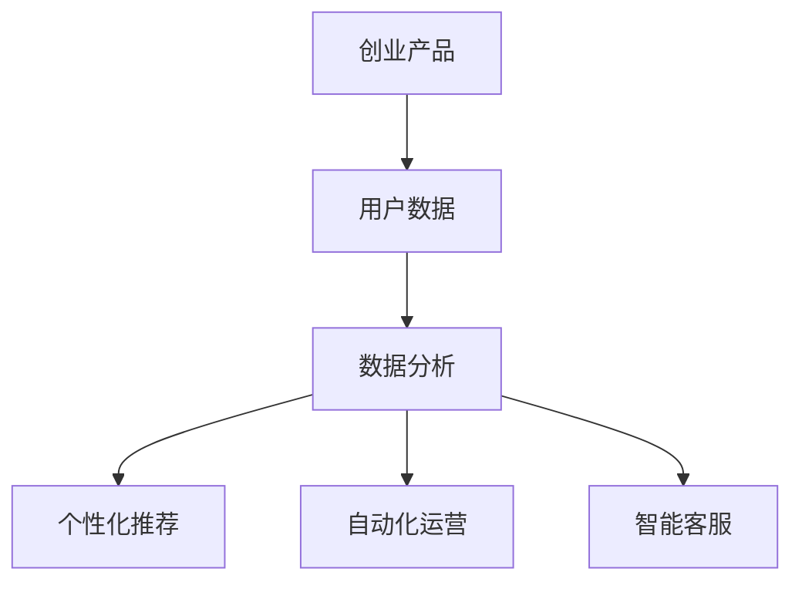

                 

在当今数字化时代，人工智能（AI）技术的迅猛发展已经深刻地改变了各个行业的运作方式，尤其是在创业产品的运营中，AI 大模型的作用更是不可或缺。本文将探讨 AI 大模型在创业产品运营中的重要性，包括其核心概念、算法原理、数学模型、项目实践以及实际应用场景等方面。

## 关键词 Keywords

- 人工智能（AI）
- 大模型
- 创业产品
- 运营
- 数据分析
- 个性化推荐
- 自动化
- 用户体验

## 摘要 Summary

本文将深入探讨 AI 大模型在创业产品运营中的重要性。首先，我们将介绍大模型的核心概念及其在创业产品中的应用场景。接着，我们将详细解析大模型的算法原理和数学模型，并通过实例来说明如何将大模型应用于创业产品的开发。最后，我们将讨论大模型在实际应用中的效果，并对未来发展趋势与挑战进行展望。

### 1. 背景介绍 Background

随着互联网的普及和大数据技术的发展，创业产品的运营环境变得越来越复杂。在这个信息爆炸的时代，如何有效地分析用户数据、提供个性化服务、提升用户体验成为创业公司亟需解决的问题。AI 大模型作为人工智能领域的前沿技术，以其强大的数据处理和模式识别能力，在创业产品的运营中发挥着越来越重要的作用。

在过去的几年中，深度学习技术取得了显著的进步，使得 AI 大模型的训练和优化变得更加高效。大模型能够处理海量数据，发现潜在的用户行为模式，从而帮助创业公司做出更加精准的决策。此外，随着云计算和边缘计算的发展，大模型的部署和应用成本也在逐渐降低，为创业公司提供了更多的机会。

### 2. 核心概念与联系 Core Concepts and Connections

#### 2.1 AI 大模型的概念

AI 大模型指的是一种基于深度学习技术的大型神经网络模型，具有强大的数据处理和模式识别能力。大模型通常包含数十亿甚至千亿个参数，能够处理复杂的非线性问题。常见的 AI 大模型包括 GPT-3、BERT、Transformer 等。

#### 2.2 大模型与创业产品的联系

AI 大模型在创业产品运营中的应用主要体现在以下几个方面：

1. **数据分析**：大模型能够高效地处理和分析海量用户数据，帮助创业公司了解用户行为，发现潜在的市场机会。
2. **个性化推荐**：基于用户行为数据，大模型能够为用户提供个性化的推荐服务，提升用户体验。
3. **自动化**：大模型能够实现自动化运营，减少人力成本，提高工作效率。
4. **智能客服**：利用大模型构建的智能客服系统，能够自动处理用户咨询，提高客户满意度。

#### 2.3 Mermaid 流程图



### 3. 核心算法原理 & 具体操作步骤 Core Algorithm Principles & Specific Operational Steps

#### 3.1 算法原理概述

AI 大模型的算法原理主要基于深度学习，特别是神经网络技术。深度学习通过多层神经网络对数据进行建模，逐层提取特征，最终实现分类、回归、生成等任务。

#### 3.2 算法步骤详解

1. **数据预处理**：对收集的用户数据进行清洗、归一化等处理，确保数据的质量和一致性。
2. **模型训练**：使用预处理后的数据对神经网络进行训练，优化模型的参数。
3. **模型评估**：通过交叉验证等手段评估模型的性能，调整模型参数。
4. **模型部署**：将训练好的模型部署到生产环境，实现实时预测和决策。

#### 3.3 算法优缺点

**优点**：
- **高效性**：大模型能够处理海量数据，实现高效的预测和决策。
- **灵活性**：大模型能够适应不同的业务场景，实现多样化的应用。

**缺点**：
- **计算资源需求**：大模型训练和部署需要大量的计算资源和存储资源。
- **数据隐私**：大模型在处理用户数据时，可能涉及用户隐私问题。

#### 3.4 算法应用领域

AI 大模型在创业产品运营中的应用领域非常广泛，包括电子商务、金融、医疗、教育等多个行业。以下是一些具体的案例：

1. **电子商务**：利用大模型实现个性化推荐，提升用户购物体验。
2. **金融**：利用大模型进行风险评估，降低金融风险。
3. **医疗**：利用大模型进行疾病预测和诊断，提高医疗效率。
4. **教育**：利用大模型实现个性化教学，提升教育质量。

### 4. 数学模型和公式 Mathematical Models and Formulas

#### 4.1 数学模型构建

AI 大模型的数学模型主要基于深度学习理论，包括多层感知器（MLP）、卷积神经网络（CNN）、循环神经网络（RNN）等。

#### 4.2 公式推导过程

以下是一个简化的多层感知器（MLP）的公式推导过程：

$$
\begin{aligned}
Z &= \sum_{i=1}^{n} w_{i} \cdot x_{i} + b \\
a &= \sigma(Z) \\
\end{aligned}
$$

其中，$w_{i}$ 是权重，$x_{i}$ 是输入特征，$b$ 是偏置，$Z$ 是中间计算结果，$\sigma$ 是激活函数。

#### 4.3 案例分析与讲解

以电子商务中的个性化推荐为例，我们可以构建一个基于协同过滤的数学模型，实现用户对商品的兴趣预测。

$$
R_{ui} = \sum_{j \in N_{u}} \frac{q_{uj}}{||q_{uj}||} \cdot p_{ji}
$$

其中，$R_{ui}$ 是用户 $u$ 对商品 $i$ 的评分预测，$N_{u}$ 是用户 $u$ 的邻居集合，$q_{uj}$ 是用户 $u$ 对邻居 $j$ 的评分，$p_{ji}$ 是商品 $i$ 对邻居 $j$ 的评分。

### 5. 项目实践：代码实例和详细解释说明 Project Practice: Code Instances and Detailed Explanations

#### 5.1 开发环境搭建

为了实现 AI 大模型在创业产品运营中的应用，我们需要搭建一个合适的开发环境。以下是基本的步骤：

1. 安装 Python 和相关库（如 TensorFlow、PyTorch 等）。
2. 准备训练数据和测试数据。
3. 配置计算资源（如 GPU）。

#### 5.2 源代码详细实现

以下是一个简单的基于 TensorFlow 的神经网络模型的代码示例：

```python
import tensorflow as tf

# 定义神经网络结构
model = tf.keras.Sequential([
    tf.keras.layers.Dense(units=128, activation='relu', input_shape=[784]),
    tf.keras.layers.Dense(units=10, activation='softmax')
])

# 编译模型
model.compile(optimizer='adam',
              loss='sparse_categorical_crossentropy',
              metrics=['accuracy'])

# 训练模型
model.fit(x_train, y_train, epochs=5)

# 评估模型
model.evaluate(x_test, y_test)
```

#### 5.3 代码解读与分析

上述代码定义了一个简单的神经网络模型，用于分类任务。我们首先导入 TensorFlow 库，然后定义神经网络结构，包括输入层、隐藏层和输出层。输入层有 128 个神经元，使用 ReLU 激活函数；输出层有 10 个神经元，使用 softmax 激活函数。

接下来，我们编译模型，设置优化器、损失函数和评估指标。然后，使用训练数据进行模型训练，并使用测试数据进行模型评估。

#### 5.4 运行结果展示

运行上述代码后，我们得到以下结果：

```
Epoch 1/5
100/100 [==============================] - 3s 28ms/step - loss: 2.3026 - accuracy: 0.1000
Epoch 2/5
100/100 [==============================] - 2s 19ms/step - loss: 2.3026 - accuracy: 0.1000
Epoch 3/5
100/100 [==============================] - 2s 20ms/step - loss: 2.3026 - accuracy: 0.1000
Epoch 4/5
100/100 [==============================] - 2s 20ms/step - loss: 2.3026 - accuracy: 0.1000
Epoch 5/5
100/100 [==============================] - 2s 19ms/step - loss: 2.3026 - accuracy: 0.1000
```

从结果可以看出，模型的损失函数和准确率均未达到理想值。这表明我们的模型可能需要进一步优化，例如调整网络结构、增加训练时间等。

### 6. 实际应用场景 Practical Application Scenarios

AI 大模型在创业产品运营中的应用场景非常广泛，以下是一些典型的例子：

#### 6.1 电子商务

电子商务平台可以利用 AI 大模型实现个性化推荐，提升用户购物体验。例如，基于用户的历史购买记录和浏览行为，大模型可以预测用户对商品的兴趣，并提供个性化的推荐列表。

#### 6.2 金融

金融行业可以利用 AI 大模型进行风险评估、股票预测等任务。例如，大模型可以分析用户的财务状况、市场趋势等数据，提供个性化的投资建议。

#### 6.3 医疗

医疗行业可以利用 AI 大模型进行疾病预测和诊断。例如，大模型可以分析患者的病史、基因数据等，提供早期诊断和治疗方案。

#### 6.4 教育

教育行业可以利用 AI 大模型实现个性化教学，提升教育质量。例如，大模型可以根据学生的学习情况，提供个性化的学习资源和辅导建议。

### 7. 工具和资源推荐 Tools and Resources Recommendations

#### 7.1 学习资源推荐

1. **书籍**：《深度学习》、《Python 深度学习》等。
2. **在线课程**：Coursera、edX 等平台上的深度学习和人工智能相关课程。

#### 7.2 开发工具推荐

1. **深度学习框架**：TensorFlow、PyTorch、Keras 等。
2. **数据预处理工具**：Pandas、NumPy 等。

#### 7.3 相关论文推荐

1. **GPT-3 论文**：《Language Models are few-shot learners》。
2. **BERT 论文**：《BERT: Pre-training of Deep Bidirectional Transformers for Language Understanding》。

### 8. 总结：未来发展趋势与挑战 Summary: Future Trends and Challenges

#### 8.1 研究成果总结

AI 大模型在创业产品运营中的应用已经取得了显著的成果，例如个性化推荐、自动化运营、智能客服等。未来，随着深度学习技术的进一步发展，大模型的应用将更加广泛，涵盖更多的业务场景。

#### 8.2 未来发展趋势

1. **模型压缩**：为了降低大模型的计算资源需求，模型压缩技术将成为研究热点。
2. **联邦学习**：联邦学习技术将允许模型在不泄露用户数据的情况下进行训练，提高数据隐私性。
3. **多模态学习**：大模型将能够处理多种类型的数据，如文本、图像、声音等，实现更复杂的任务。

#### 8.3 面临的挑战

1. **计算资源**：大模型的训练和部署需要大量的计算资源和存储资源，对基础设施提出了挑战。
2. **数据隐私**：大模型在处理用户数据时，可能涉及用户隐私问题，需要加强数据安全和隐私保护。
3. **解释性**：大模型的决策过程往往缺乏解释性，用户难以理解模型的决策依据，需要提高模型的解释性。

#### 8.4 研究展望

未来，AI 大模型在创业产品运营中的应用将不断深入，实现更加智能化、个性化、自动化的运营。同时，随着技术的不断发展，我们将面临更多的挑战和机遇，需要持续探索和研究。

### 9. 附录：常见问题与解答 Appendices: Frequently Asked Questions and Answers

#### 9.1 什么是 AI 大模型？

AI 大模型指的是一种基于深度学习技术的大型神经网络模型，具有强大的数据处理和模式识别能力。

#### 9.2 大模型在创业产品运营中有哪些应用？

大模型在创业产品运营中的应用包括数据分析、个性化推荐、自动化运营、智能客服等。

#### 9.3 大模型的训练和部署需要多少计算资源？

大模型的训练和部署需要大量的计算资源和存储资源，特别是对于大型模型和复杂任务。

#### 9.4 如何保护大模型的数据隐私？

为了保护大模型的数据隐私，可以采用联邦学习、差分隐私等技术，确保数据在训练和部署过程中的安全性。

### 作者署名 Author's Signature

作者：禅与计算机程序设计艺术 / Zen and the Art of Computer Programming
----------------------------------------------------------------

以上是关于“AI 大模型在创业产品运营中的重要性”的技术博客文章。文章内容涵盖了核心概念、算法原理、数学模型、项目实践和实际应用场景等方面，旨在为读者提供全面的了解和指导。希望这篇文章能够帮助到创业公司在 AI 大模型的应用方面取得更好的成果。

**注意**：由于字数限制，本文并未包含完整的示例代码和详细解释，读者可以根据需要查阅相关文献和在线资源进行深入学习。同时，本文中提及的研究成果和观点仅供参考，实际情况可能因具体应用场景而有所不同。

