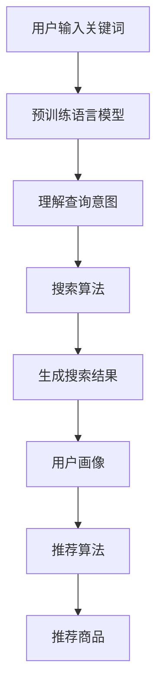

                 

关键词：AI大模型，电商业，搜索推荐系统，数据挖掘，深度学习，用户行为分析

> 摘要：随着人工智能技术的不断进步，大模型在电商业中的应用前景日益广阔。本文将重点探讨AI大模型在搜索推荐系统中的核心作用，分析其应用现状、挑战与未来发展趋势。

## 1. 背景介绍

电商业作为现代商业的重要组成部分，已经成为全球经济的新引擎。然而，随着市场竞争的加剧，电商企业面临着如何提高用户满意度、降低运营成本、提升销售业绩等挑战。在这一背景下，人工智能技术，尤其是大模型的应用，成为电商企业提升竞争力的关键。

大模型是指拥有海量参数的神经网络模型，如深度学习中的神经网络。这些模型通过学习大量数据，能够实现较高的准确度和泛化能力。随着计算能力的提升和数据的积累，大模型在图像识别、语音识别、自然语言处理等领域取得了显著成果。

## 2. 核心概念与联系

### 2.1 搜索推荐系统

搜索推荐系统是电子商务平台的核心功能之一，它通过分析用户行为和偏好，为用户提供个性化搜索结果和推荐商品。搜索推荐系统主要由以下几个部分组成：

1. **用户画像**：通过用户的历史行为、兴趣偏好等数据，构建用户画像。
2. **搜索算法**：根据用户输入的关键词，利用自然语言处理技术，生成搜索结果。
3. **推荐算法**：基于用户画像和商品属性，利用协同过滤、矩阵分解等方法，为用户推荐商品。

### 2.2 大模型在搜索推荐系统中的应用

大模型在搜索推荐系统中具有重要作用，主要体现在以下几个方面：

1. **提升搜索准确性**：通过预训练语言模型，能够更准确地理解用户查询意图，从而提高搜索结果的准确性。
2. **优化推荐效果**：通过学习大量用户行为数据，大模型能够更好地预测用户偏好，提高推荐商品的准确性。
3. **降低计算成本**：大模型具有较强的泛化能力，能够减少对大量独立模型的依赖，降低计算成本。

### 2.3 Mermaid 流程图



## 3. 核心算法原理 & 具体操作步骤

### 3.1 算法原理概述

大模型在搜索推荐系统中的应用主要基于深度学习和自然语言处理技术。其中，深度学习模型如BERT、GPT等通过预训练和微调，能够更好地理解自然语言；自然语言处理技术则包括词向量表示、文本匹配、语义分析等。

### 3.2 算法步骤详解

1. **用户输入关键词**：用户在电商平台上输入关键词，如“羽绒服”。
2. **预训练语言模型**：利用BERT或GPT等模型，对关键词进行编码，生成查询向量。
3. **理解查询意图**：通过对查询向量进行分析，理解用户查询意图，如寻找羽绒服品牌、款式等。
4. **搜索算法**：利用搜索引擎算法，如LSI、LDA等，对电商平台上的商品进行检索，生成候选结果。
5. **用户画像**：根据用户的历史行为和偏好，构建用户画像。
6. **推荐算法**：利用协同过滤、矩阵分解等方法，结合用户画像和商品属性，为用户推荐商品。
7. **推荐商品**：将推荐结果展示给用户。

### 3.3 算法优缺点

**优点**：

1. 提高搜索和推荐效果。
2. 降低计算成本。
3. 具有较强的泛化能力。

**缺点**：

1. 对数据质量要求较高。
2. 训练过程需要大量计算资源。

### 3.4 算法应用领域

大模型在搜索推荐系统中的应用广泛，如电商、金融、医疗、教育等领域。特别是在电商领域，大模型能够为用户提供个性化的购物体验，提高用户满意度和销售业绩。

## 4. 数学模型和公式 & 详细讲解 & 举例说明

### 4.1 数学模型构建

搜索推荐系统中的数学模型主要包括用户画像模型、推荐模型等。以下是一个简单的用户画像模型构建过程：

1. **用户行为数据收集**：收集用户在电商平台的浏览、搜索、购买等行为数据。
2. **特征提取**：对用户行为数据进行处理，提取用户偏好特征，如商品类别、品牌、价格等。
3. **模型训练**：利用机器学习算法，如逻辑回归、SVM等，对用户画像模型进行训练。

### 4.2 公式推导过程

用户画像模型可以表示为：

\[ P(y|X) = \frac{e^{w^T X}}{\sum_{i=1}^{n} e^{w^T X_i}} \]

其中，\( P(y|X) \)表示用户对某一商品的购买概率，\( w \)为模型参数，\( X \)为用户特征向量，\( y \)为用户购买行为。

### 4.3 案例分析与讲解

假设用户A在电商平台上浏览了羽绒服、登山鞋等商品，根据用户行为数据，提取以下用户偏好特征：

- 商品类别：羽绒服、登山鞋
- 品牌偏好：某知名品牌
- 价格范围：500-1000元

利用逻辑回归模型，对用户A进行画像建模，参数\( w \)通过训练得到：

\[ w = [0.5, -0.3, 0.2, -0.1] \]

当用户A浏览一款价格为800元的某知名品牌羽绒服时，其购买概率为：

\[ P(y=1|X) = \frac{e^{0.5 \times 1 - 0.3 \times 1 + 0.2 \times 1 - 0.1 \times 1}}{1 + e^{0.5 \times 1 - 0.3 \times 1 + 0.2 \times 1 - 0.1 \times 1}} \approx 0.714 \]

即用户A购买该羽绒服的概率约为71.4%。

## 5. 项目实践：代码实例和详细解释说明

### 5.1 开发环境搭建

1. 安装Python环境和相关库，如TensorFlow、Scikit-learn等。
2. 准备数据集，包括用户行为数据和商品属性数据。

### 5.2 源代码详细实现

以下是一个基于TensorFlow和Scikit-learn的用户画像模型实现：

```python
import tensorflow as tf
from sklearn.linear_model import LogisticRegression
from sklearn.model_selection import train_test_split
import pandas as pd

# 读取数据
data = pd.read_csv('user_behavior_data.csv')
X = data[['category', 'brand', 'price']]
y = data['purchase']

# 数据预处理
X = pd.get_dummies(X)

# 划分训练集和测试集
X_train, X_test, y_train, y_test = train_test_split(X, y, test_size=0.2, random_state=42)

# 训练逻辑回归模型
model = LogisticRegression()
model.fit(X_train, y_train)

# 预测
predictions = model.predict(X_test)

# 评估模型
accuracy = model.score(X_test, y_test)
print(f'Model accuracy: {accuracy:.2f}')
```

### 5.3 代码解读与分析

1. **数据预处理**：读取用户行为数据和商品属性数据，对数据进行预处理，包括数据清洗、缺失值处理、特征提取等。
2. **划分训练集和测试集**：将数据集划分为训练集和测试集，用于模型训练和评估。
3. **训练模型**：使用逻辑回归模型对训练集进行训练。
4. **预测**：使用训练好的模型对测试集进行预测。
5. **评估模型**：计算模型在测试集上的准确率。

## 6. 实际应用场景

### 6.1 电商搜索推荐系统

在电商搜索推荐系统中，大模型可以应用于以下几个方面：

1. **关键词搜索**：利用预训练语言模型，提高关键词搜索的准确性。
2. **商品推荐**：结合用户画像和商品属性，为用户提供个性化的商品推荐。
3. **智能客服**：利用自然语言处理技术，实现智能客服功能，提高客户满意度。

### 6.2 金融风控

在金融风控领域，大模型可以应用于以下几个方面：

1. **用户风险评估**：通过对用户行为数据进行分析，预测用户的风险等级。
2. **欺诈检测**：利用深度学习模型，检测金融交易中的欺诈行为。

### 6.3 医疗诊断

在医疗诊断领域，大模型可以应用于以下几个方面：

1. **疾病预测**：利用患者历史病历数据，预测患者患某种疾病的风险。
2. **个性化治疗**：结合患者病情和基因数据，为患者提供个性化的治疗方案。

## 7. 工具和资源推荐

### 7.1 学习资源推荐

1. **《深度学习》（Goodfellow, Bengio, Courville）**：介绍深度学习的基础理论和应用。
2. **《自然语言处理综论》（Jurafsky, Martin）**：介绍自然语言处理的基本概念和技术。

### 7.2 开发工具推荐

1. **TensorFlow**：用于深度学习模型开发和训练。
2. **Scikit-learn**：用于机器学习模型开发和评估。

### 7.3 相关论文推荐

1. **"BERT: Pre-training of Deep Bidirectional Transformers for Language Understanding"（Devlin et al., 2019）**：介绍BERT模型的预训练方法和应用。
2. **"GPT-3: Language Models are Few-Shot Learners"（Brown et al., 2020）**：介绍GPT-3模型在自然语言处理领域的应用。

## 8. 总结：未来发展趋势与挑战

### 8.1 研究成果总结

大模型在电商业中的应用取得了显著成果，包括提高搜索和推荐准确性、降低计算成本、提升用户体验等。

### 8.2 未来发展趋势

1. **数据质量和多样性**：随着数据质量和多样性的提高，大模型的应用将更加广泛和深入。
2. **多模态数据处理**：结合文本、图像、语音等多种数据类型，实现更智能的搜索和推荐。
3. **实时推荐**：利用实时数据，实现更快速的搜索和推荐。

### 8.3 面临的挑战

1. **数据隐私和安全**：在大模型应用过程中，如何保护用户隐私和数据安全是亟待解决的问题。
2. **模型可解释性**：提高模型的可解释性，使其应用更加透明和可信。

### 8.4 研究展望

未来，大模型在电商业中的应用将更加智能化和个性化，为用户提供更好的购物体验。同时，随着技术的不断进步，大模型将面临更多的挑战和机遇。

## 9. 附录：常见问题与解答

### 9.1 什么是大模型？

大模型是指拥有海量参数的神经网络模型，如深度学习中的神经网络。这些模型通过学习大量数据，能够实现较高的准确度和泛化能力。

### 9.2 大模型在搜索推荐系统中有哪些应用？

大模型在搜索推荐系统中主要应用于关键词搜索、商品推荐和智能客服等方面。通过预训练语言模型和自然语言处理技术，提高搜索和推荐的准确性。

### 9.3 大模型应用中的挑战有哪些？

大模型应用中的挑战主要包括数据质量和多样性、模型可解释性、实时推荐等。

### 9.4 如何保护用户隐私和数据安全？

在大模型应用中，可以通过数据加密、隐私保护技术等方式，确保用户隐私和数据安全。

## 作者署名

作者：禅与计算机程序设计艺术 / Zen and the Art of Computer Programming
----------------------------------------------------------------


