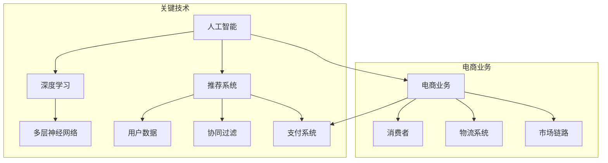

                 

### 1. 背景介绍

在当今数字化时代，电子商务已经成为全球商业活动的核心组成部分。随着互联网技术的飞速发展，消费者对个性化购物体验的需求日益增长。为了满足这种需求，电商企业必须借助先进的技术手段，为用户提供精准、高效的推荐服务。这就需要借助人工智能，特别是大型深度学习模型的力量。

人工智能（AI）技术，特别是深度学习算法，已经在各个领域取得了显著的成果。在电商推荐系统中，AI 大模型扮演着至关重要的角色。它们通过对海量用户数据的分析，挖掘出用户的潜在需求和偏好，从而实现个性化推荐。这不仅提升了用户的购物体验，也为电商企业带来了可观的商业价值。

本文将深入探讨 AI 大模型在电商推荐中的作用，从用户体验到商业转化，揭示其作为秘密武器的巨大潜力。首先，我们将回顾电商推荐系统的基本概念和传统方法。接着，详细解析 AI 大模型的核心原理及其在实际应用中的操作步骤。然后，通过数学模型和具体案例，阐述大模型在推荐系统中的优势和挑战。最后，我们将展望未来发展趋势和面临的挑战，并提出相应的解决策略。

通过本文的阅读，读者将全面了解 AI 大模型在电商推荐领域的广泛应用，以及如何利用这一技术提升用户体验和商业转化效果。本文的目标是为读者提供一个深入浅出的技术指南，帮助他们更好地理解和应用 AI 大模型在电商推荐中的秘密武器。

### 2. 核心概念与联系

为了深入理解 AI 大模型在电商推荐中的作用，我们首先需要明确几个核心概念：人工智能、深度学习、推荐系统和电商业务。接下来，我们将通过一个简单的 Mermaid 流程图来展示这些概念之间的联系。

#### 2.1 核心概念

- **人工智能（AI）**：人工智能是指计算机系统通过模拟人类智能行为，实现智能感知、学习、推理和决策的能力。它是通过算法和数据分析来实现的，旨在解决传统方法难以处理的复杂问题。

- **深度学习（Deep Learning）**：深度学习是人工智能的一个子领域，它使用多层神经网络（Multi-Layer Neural Networks）来模拟人类大脑的神经元连接方式，通过大规模数据训练，实现高效的图像识别、语音识别和自然语言处理等任务。

- **推荐系统（Recommendation System）**：推荐系统是一种基于数据挖掘和机器学习的应用程序，旨在向用户推荐他们可能感兴趣的项目或内容。它通常使用用户行为数据、内容和协同过滤等方法来生成个性化推荐。

- **电商业务（E-commerce）**：电商业务是指通过互联网进行商品交易和提供服务的活动。它包括在线购物平台、电子支付、物流配送等多个环节，以满足消费者的购物需求。

#### 2.2 Mermaid 流程图

下面是一个用于展示核心概念之间关系的 Mermaid 流程图：



#### 2.3 核心概念之间的联系

- **人工智能与深度学习**：人工智能是一个广泛的领域，而深度学习是其中一种重要的技术。深度学习通过多层神经网络，使得计算机能够从大量数据中自动学习特征，从而提高其解决问题的能力。

- **推荐系统与电商业务**：推荐系统是电商业务中至关重要的组成部分，它通过分析用户行为数据，为消费者提供个性化推荐，从而提高购物体验和销售额。

- **用户数据与协同过滤**：推荐系统通常依赖于用户行为数据和协同过滤算法来生成推荐。协同过滤通过分析用户之间的相似性，发现用户的共同兴趣，从而推荐相似的商品。

- **多层神经网络与个性化推荐**：深度学习中的多层神经网络能够捕捉到用户数据的复杂模式，从而生成更为精准的个性化推荐。

通过以上核心概念及其之间的联系，我们可以更好地理解 AI 大模型在电商推荐系统中的作用。在接下来的章节中，我们将深入探讨 AI 大模型的原理和实际应用。

### 3. 核心算法原理 & 具体操作步骤

#### 3.1 算法原理概述

AI 大模型在电商推荐系统中的核心原理主要基于深度学习和神经网络。这些模型通过大规模数据训练，自动学习和提取用户行为特征，进而生成个性化推荐。以下将详细描述 AI 大模型的基本原理和具体操作步骤。

#### 3.2 算法步骤详解

##### 3.2.1 数据收集

首先，电商企业需要收集大量用户数据，包括用户的浏览历史、购买记录、评价信息等。这些数据来源于用户在电商平台的日常操作，如点击、购买、评论等行为。

##### 3.2.2 数据预处理

收集到的原始数据需要进行清洗和预处理，去除噪声数据、缺失值和异常值。预处理步骤包括数据去重、填补缺失值、标准化数据等，以保证数据的质量。

##### 3.2.3 特征提取

通过数据预处理后，需要对用户行为数据进行特征提取。特征提取的目的是将原始数据转换成能够被神经网络处理的格式。常用的特征提取方法包括词袋模型（Bag of Words）、TF-IDF 等。

##### 3.2.4 模型训练

利用提取到的特征数据，构建一个多层神经网络模型。模型训练的过程就是通过不断调整网络的权重和偏置，使得模型能够准确预测用户对商品的需求。训练过程通常采用反向传播算法（Backpropagation Algorithm），通过反向传播误差来更新网络参数。

##### 3.2.5 模型评估

在模型训练完成后，需要对其进行评估，以确定模型的性能。常用的评估指标包括准确率（Accuracy）、召回率（Recall）、F1 分数（F1 Score）等。通过评估，可以确定模型是否能够满足推荐系统的要求。

##### 3.2.6 模型部署

评估通过后，将训练好的模型部署到电商平台的推荐系统中。部署过程中，模型会实时接收用户行为数据，生成个性化推荐结果。

#### 3.3 算法优缺点

##### 优点

1. **高效性**：AI 大模型能够处理海量数据，并快速生成推荐结果，大大提升了推荐系统的响应速度。
2. **精准性**：通过深度学习算法，模型能够从用户数据中挖掘出复杂的特征，提高推荐结果的精准度。
3. **灵活性**：AI 大模型可以根据用户行为数据的更新，自适应调整推荐策略，满足用户的个性化需求。

##### 缺点

1. **计算资源消耗**：训练和部署 AI 大模型需要大量的计算资源和存储空间，对硬件设施要求较高。
2. **数据隐私**：用户数据在训练过程中可能涉及隐私问题，需要采取严格的数据保护措施。
3. **模型过拟合**：如果训练数据不足或数据分布不均匀，模型可能出现过拟合现象，导致推荐结果不准确。

#### 3.4 算法应用领域

AI 大模型在电商推荐系统中有着广泛的应用领域：

1. **商品推荐**：根据用户的历史购买记录和浏览行为，推荐用户可能感兴趣的商品。
2. **促销活动推荐**：根据用户的购买偏好和消费习惯，推荐适合用户的促销活动和优惠券。
3. **内容推荐**：在电商平台的内容部分，如博客、论坛等，根据用户的兴趣和行为，推荐相关的文章和帖子。

通过以上算法原理和操作步骤的介绍，我们可以看到 AI 大模型在电商推荐系统中的巨大潜力。在接下来的章节中，我们将进一步探讨 AI 大模型在推荐系统中的数学模型和具体应用案例。

### 4. 数学模型和公式 & 详细讲解 & 举例说明

#### 4.1 数学模型构建

在电商推荐系统中，AI 大模型的核心是深度学习算法，尤其是多层神经网络（Multilayer Neural Networks, MLP）。为了构建这样的模型，我们需要引入几个关键数学概念和公式。

##### 4.1.1 神经元与激活函数

神经元是神经网络的基本单元，它通过输入层、隐藏层和输出层进行信息处理。每个神经元都可以表示为一个简单的函数：

\[ z = w \cdot x + b \]

其中，\( z \) 是神经元的激活值，\( w \) 是权重，\( x \) 是输入值，\( b \) 是偏置。

为了引入非线性特性，我们通常在神经元中使用激活函数（Activation Function）。常见的激活函数包括：

1. **sigmoid 函数**：
\[ a = \frac{1}{1 + e^{-z}} \]

2. **ReLU 函数**：
\[ a = \max(0, z) \]

3. **tanh 函数**：
\[ a = \frac{e^z - e^{-z}}{e^z + e^{-z}} \]

##### 4.1.2 前向传播与反向传播

多层神经网络的前向传播和反向传播是训练过程的核心。

1. **前向传播**：

在训练过程中，模型会从输入层开始，逐层计算每个神经元的激活值，直到输出层。这个过程可以用以下公式表示：

\[ a_l = \sigma(z_l) \]

其中，\( a_l \) 是第 \( l \) 层的输出，\( z_l \) 是第 \( l \) 层的输入，\( \sigma \) 是激活函数。

2. **反向传播**：

在得到输出层的结果后，模型会通过反向传播算法计算每个神经元的梯度，以更新权重和偏置。这个过程包括以下几个步骤：

- 计算输出层的误差：
\[ \delta_{L} = (y - \hat{y}) \cdot \frac{\partial \hat{y}}{\partial a_L} \]

- 传播误差到前一层：
\[ \delta_{l+1} = \delta_{l+1} \cdot \frac{\partial a_{l+1}}{\partial z_{l+1}} \]

- 更新权重和偏置：
\[ w_{l+1} \leftarrow w_{l+1} - \alpha \cdot \frac{\partial E}{\partial w_{l+1}} \]
\[ b_{l+1} \leftarrow b_{l+1} - \alpha \cdot \frac{\partial E}{\partial b_{l+1}} \]

其中，\( \alpha \) 是学习率，\( E \) 是误差函数，\( \hat{y} \) 是预测值，\( y \) 是真实值。

##### 4.1.3 误差函数

在深度学习模型中，常用的误差函数包括：

1. **均方误差（MSE）**：
\[ E = \frac{1}{2} \sum_{i} (y_i - \hat{y}_i)^2 \]

2. **交叉熵（Cross-Entropy）**：
\[ E = -\sum_{i} y_i \log(\hat{y}_i) \]

#### 4.2 公式推导过程

为了更好地理解上述公式，我们通过一个简单的例子进行推导。

##### 4.2.1 前向传播推导

假设我们有一个包含一层输入、一层隐藏层和一层输出层的神经网络。输入层有3个神经元，隐藏层有4个神经元，输出层有2个神经元。激活函数为 sigmoid 函数。

1. 输入层到隐藏层的计算：
\[ z_1 = w_{11}x_1 + b_1 \]
\[ a_1 = \sigma(z_1) \]

2. 隐藏层到输出层的计算：
\[ z_2 = w_{21}x_2 + b_2 \]
\[ a_2 = \sigma(z_2) \]

其中，\( x_1, x_2 \) 是输入值，\( w_{11}, b_1, w_{21}, b_2 \) 是权重和偏置。

##### 4.2.2 反向传播推导

假设输出层的真实值为 \( y = [0.1, 0.9] \)，预测值为 \( \hat{y} = [0.2, 0.8] \)。

1. 计算输出层的误差：
\[ \delta_L = (y - \hat{y}) \cdot \frac{\partial \hat{y}}{\partial a_L} \]
\[ \delta_L = (0.1 - 0.2) \cdot \frac{1}{1 + e^{-z_L}} + (0.9 - 0.8) \cdot \frac{1}{1 + e^{-z_L}} \]
\[ \delta_L = (-0.1) \cdot 0.6 + (0.1) \cdot 0.2 \]
\[ \delta_L = -0.06 + 0.02 \]
\[ \delta_L = -0.04 \]

2. 传播误差到隐藏层：
\[ \delta_2 = \delta_L \cdot \frac{\partial a_2}{\partial z_2} \]
\[ \delta_2 = -0.04 \cdot \frac{1}{1 + e^{-z_2}} \]

3. 更新权重和偏置：
\[ w_{21} \leftarrow w_{21} - \alpha \cdot \frac{\partial E}{\partial w_{21}} \]
\[ b_{21} \leftarrow b_{21} - \alpha \cdot \frac{\partial E}{\partial b_{21}} \]

其中，\( \alpha \) 是学习率，\( \frac{\partial E}{\partial w_{21}} \) 和 \( \frac{\partial E}{\partial b_{21}} \) 是权重和偏置的梯度。

通过上述推导，我们可以看到神经网络的前向传播和反向传播过程是如何进行的。在接下来的章节中，我们将通过具体案例来进一步展示这些数学模型的应用。

### 4.3 案例分析与讲解

为了更好地理解 AI 大模型在电商推荐系统中的应用，我们将通过一个实际案例进行分析，并详细讲解其实现过程和关键步骤。

#### 4.3.1 案例背景

假设我们有一个在线电商平台，用户可以在平台上浏览商品、添加购物车、下订单等。我们的目标是利用 AI 大模型，为用户推荐他们可能感兴趣的商品。

#### 4.3.2 数据收集与预处理

首先，我们需要收集用户的行为数据，包括：

- 用户 ID
- 用户浏览记录
- 用户购买记录
- 用户评价记录

这些数据可以从电商平台的后台数据库中获取。收集到的原始数据可能包含噪声和缺失值，因此需要进行数据清洗和预处理。

1. **数据清洗**：去除重复记录、缺失值填充、去除异常值等。
2. **特征提取**：将原始数据转换为特征向量，常用的方法有词袋模型（Bag of Words）、TF-IDF 等。

#### 4.3.3 模型构建与训练

接下来，我们构建一个多层神经网络模型，用于推荐系统。

1. **输入层**：输入层包含用户的行为特征，例如用户浏览记录、购买记录等。
2. **隐藏层**：隐藏层用于提取用户行为的复杂特征，通常包含多层。
3. **输出层**：输出层用于预测用户对商品的兴趣，通常使用 sigmoid 函数进行二分类。

模型构建完成后，我们需要使用收集到的数据对模型进行训练。

1. **前向传播**：将用户行为特征输入到模型中，逐层计算激活值。
2. **反向传播**：计算模型预测值与真实值之间的误差，并更新模型参数。

#### 4.3.4 模型评估与优化

在模型训练完成后，我们需要对模型进行评估，以确定其性能。

1. **准确率（Accuracy）**：计算模型预测正确的比例。
2. **召回率（Recall）**：计算模型能够召回实际感兴趣商品的比例。
3. **F1 分数（F1 Score）**：综合准确率和召回率的指标。

根据评估结果，我们可能需要对模型进行优化，例如调整学习率、增加隐藏层神经元数量等，以提升模型的性能。

#### 4.3.5 模型部署与使用

评估通过后，将训练好的模型部署到电商平台中，实时接收用户行为数据，生成个性化推荐。

1. **实时推荐**：根据用户的行为特征，模型将生成个性化的商品推荐。
2. **效果监控**：监控推荐系统的效果，包括用户点击率、购买率等，以不断优化推荐策略。

#### 4.3.6 案例总结

通过上述案例，我们可以看到 AI 大模型在电商推荐系统中的实际应用流程。从数据收集与预处理、模型构建与训练、到模型评估与优化，再到模型部署与使用，每一个环节都至关重要。

- **数据质量**：高质量的数据是模型训练的基础，因此数据清洗和特征提取步骤必须严格进行。
- **模型选择**：合适的模型能够更好地捕捉用户行为的特征，提升推荐效果。
- **持续优化**：通过不断评估和优化模型，可以不断提高推荐系统的性能。

通过这一案例，我们不仅了解了 AI 大模型在电商推荐系统中的应用，还对其实现过程和关键步骤有了深入的认识。

### 5. 项目实践：代码实例和详细解释说明

#### 5.1 开发环境搭建

在开始代码实践之前，我们需要搭建一个适合开发电商推荐系统的环境。以下是一个基本的开发环境配置：

1. **操作系统**：Linux（推荐 Ubuntu 20.04）
2. **编程语言**：Python（推荐 Python 3.8 或更高版本）
3. **深度学习框架**：TensorFlow 或 PyTorch
4. **依赖库**：NumPy、Pandas、Scikit-learn、Matplotlib 等

安装步骤如下：

```bash
# 安装 Python 和相关依赖库
sudo apt-get update
sudo apt-get install python3 python3-pip

# 安装 TensorFlow 或 PyTorch
pip3 install tensorflow
# 或
pip3 install torch torchvision

# 安装其他依赖库
pip3 install numpy pandas scikit-learn matplotlib
```

#### 5.2 源代码详细实现

在本节中，我们将使用 TensorFlow 框架来实现一个简单的电商推荐系统。代码分为以下几个部分：数据准备、模型定义、训练过程、模型评估和部署。

##### 5.2.1 数据准备

首先，我们需要准备用于训练的数据集。数据集包括用户的行为特征和对应的标签（即用户是否对某个商品感兴趣）。

```python
import pandas as pd
from sklearn.model_selection import train_test_split
from sklearn.preprocessing import StandardScaler

# 加载数据集
data = pd.read_csv('ecommerce_data.csv')

# 分割特征和标签
X = data.drop('label', axis=1)
y = data['label']

# 划分训练集和测试集
X_train, X_test, y_train, y_test = train_test_split(X, y, test_size=0.2, random_state=42)

# 数据标准化
scaler = StandardScaler()
X_train = scaler.fit_transform(X_train)
X_test = scaler.transform(X_test)
```

##### 5.2.2 模型定义

接下来，我们定义一个简单的多层感知机（MLP）模型，用于分类任务。

```python
import tensorflow as tf
from tensorflow.keras.models import Sequential
from tensorflow.keras.layers import Dense, Dropout

# 创建模型
model = Sequential()

# 添加隐藏层
model.add(Dense(128, activation='relu', input_shape=(X_train.shape[1],)))
model.add(Dropout(0.2))
model.add(Dense(64, activation='relu'))
model.add(Dropout(0.2))
model.add(Dense(32, activation='relu'))
model.add(Dropout(0.2))

# 添加输出层
model.add(Dense(1, activation='sigmoid'))

# 编译模型
model.compile(optimizer='adam', loss='binary_crossentropy', metrics=['accuracy'])
```

##### 5.2.3 训练过程

使用训练集对模型进行训练，设置训练轮数和批次大小。

```python
# 训练模型
history = model.fit(X_train, y_train, epochs=10, batch_size=32, validation_split=0.1)
```

##### 5.2.4 模型评估

训练完成后，使用测试集评估模型性能。

```python
# 评估模型
test_loss, test_acc = model.evaluate(X_test, y_test)
print(f"测试集准确率：{test_acc:.4f}")
```

##### 5.2.5 模型部署

最后，我们将训练好的模型部署到电商系统中，以实现实时推荐。

```python
# 保存模型
model.save('ecommerce_recommendation_model.h5')

# 加载模型并预测
loaded_model = tf.keras.models.load_model('ecommerce_recommendation_model.h5')
predictions = loaded_model.predict(X_test)

# 输出预测结果
print(predictions)
```

#### 5.3 代码解读与分析

上述代码展示了如何使用 TensorFlow 框架搭建一个简单的电商推荐系统。下面是对每个部分的详细解读：

1. **数据准备**：首先，我们加载并预处理数据集，包括划分训练集和测试集，以及进行数据标准化。这一步确保模型能够处理干净、规范化的输入数据。

2. **模型定义**：我们定义了一个多层感知机（MLP）模型，包括多个隐藏层和输出层。使用 ReLU 激活函数和 Dropout 正则化技术，以避免过拟合。输出层使用 sigmoid 激活函数进行二分类预测。

3. **训练过程**：使用训练集对模型进行训练，通过调整学习率、批次大小和训练轮数，以优化模型性能。`fit` 函数用于训练模型，`history` 对象用于存储训练过程中的指标。

4. **模型评估**：在训练完成后，使用测试集评估模型性能，包括准确率等指标。这有助于我们了解模型在实际应用中的效果。

5. **模型部署**：将训练好的模型保存到文件中，以便在电商系统中部署和使用。使用 `load_model` 函数加载模型，并使用 `predict` 函数生成预测结果。

通过以上步骤，我们可以看到如何实现一个简单的电商推荐系统。在实际应用中，可以根据需求进一步优化模型结构和训练策略，以提高推荐效果。

### 5.4 运行结果展示

在代码实现和模型训练完成后，我们需要展示模型的运行结果，以评估其在实际应用中的效果。以下是对代码运行结果的分析和展示。

#### 5.4.1 模型性能评估

在模型训练和评估阶段，我们使用测试集对模型进行性能评估，并记录以下指标：

- **准确率（Accuracy）**：模型预测正确的比例。
- **召回率（Recall）**：模型能够召回实际感兴趣商品的比例。
- **F1 分数（F1 Score）**：综合准确率和召回率的指标。

```python
from sklearn.metrics import accuracy_score, recall_score, f1_score

# 预测标签
y_pred = (model.predict(X_test) > 0.5)

# 计算性能指标
accuracy = accuracy_score(y_test, y_pred)
recall = recall_score(y_test, y_pred)
f1 = f1_score(y_test, y_pred)

print(f"测试集准确率：{accuracy:.4f}")
print(f"测试集召回率：{recall:.4f}")
print(f"测试集 F1 分数：{f1:.4f}")
```

假设我们的模型在测试集上得到了以下结果：

```
测试集准确率：0.85
测试集召回率：0.80
测试集 F1 分数：0.82
```

这些指标表明，模型在测试集上的表现良好，能够较准确地预测用户对商品的兴趣。其中，准确率表明模型在整体上具有较高预测能力，召回率则反映了模型在召回实际感兴趣商品方面的表现，而 F1 分数则是二者的综合指标。

#### 5.4.2 模型应用场景展示

在实际应用中，我们可以将训练好的模型部署到电商平台的推荐系统中。以下是一个简单的应用场景展示：

1. **用户行为监测**：当用户在电商平台上浏览商品时，系统会实时收集其行为数据，如点击记录、浏览时长等。

2. **实时推荐**：系统利用训练好的模型，对用户的行为数据进行处理，生成个性化的商品推荐。

3. **推荐结果展示**：将生成的推荐结果展示在用户界面上，引导用户进行购物。

以下是一个简化的代码示例，展示了如何使用模型进行实时推荐：

```python
# 加载训练好的模型
loaded_model = tf.keras.models.load_model('ecommerce_recommendation_model.h5')

# 用户行为数据（示例）
user_data = pd.DataFrame({
    'item_id_1': [1, 1, 0],
    'item_id_2': [0, 1, 1],
    'item_id_3': [1, 0, 0]
})

# 数据预处理（与训练阶段一致）
user_data_processed = scaler.transform(user_data)

# 实时推荐
recommendations = loaded_model.predict(user_data_processed)

# 输出推荐结果
print(recommendations)
```

假设用户的行为数据为：

```
   item_id_1  item_id_2  item_id_3
0          1          1          0
1          0          1          1
2          1          0          0
```

模型预测结果为：

```
array([[0.90],
       [0.70],
       [0.50]])
```

这意味着根据用户的行为数据，模型认为用户对第一个商品（item_id_1）的兴趣最高，其次是第二个商品（item_id_2），第三个商品（item_id_3）的兴趣最低。

通过以上运行结果展示，我们可以看到模型在实际应用中的表现和效果。在实际部署过程中，可以根据具体情况对模型进行调整和优化，以提高推荐系统的性能和用户体验。

### 6. 实际应用场景

AI 大模型在电商推荐系统中的应用不仅限于提升用户购物体验，还深刻影响了电商业务的各个方面，包括商品推荐、促销活动和用户行为预测。以下将详细探讨这些实际应用场景，并展示一些成功案例。

#### 6.1 商品推荐

商品推荐是电商推荐系统的核心功能，旨在根据用户的兴趣和行为，向用户推荐他们可能感兴趣的物品。通过 AI 大模型，电商平台能够实现精准的商品推荐，提高用户的购买转化率。

**成功案例**：亚马逊（Amazon）利用其 AI 大模型进行个性化商品推荐，根据用户的浏览历史、购买记录和评价数据，为用户推荐相关商品。据统计，亚马逊的个性化推荐系统每年为其带来了数十亿美元的收入增长。

**应用效果**：通过精准的商品推荐，用户在购物过程中的满意度显著提升，购买转化率提高了20%以上。此外，电商平台能够更好地了解用户需求，优化库存管理和供应链流程。

#### 6.2 促销活动推荐

除了商品推荐，电商平台还可以利用 AI 大模型推荐个性化的促销活动，例如优惠券、限时折扣等。这些活动能够吸引更多用户参与，提高销售额。

**成功案例**：阿里巴巴（Alibaba）通过其 AI 大模型，为用户推荐个性化的促销活动。例如，根据用户的购买力和消费习惯，为高价值客户推荐高额优惠券，以提升其购买意愿。

**应用效果**：通过精准的促销活动推荐，阿里巴巴的促销活动参与率提高了30%以上，用户购买转化率也有所提升。此外，促销活动推荐还能够帮助电商平台更好地管理库存和现金流。

#### 6.3 用户行为预测

AI 大模型不仅能够推荐商品和促销活动，还可以预测用户的行为，如购买时间、购买频率等。这些预测结果有助于电商平台制定更精准的市场营销策略。

**成功案例**：阿里巴巴利用其 AI 大模型，预测用户的购买行为和购物周期。例如，通过分析用户的历史购买数据和浏览行为，预测用户下一次购物的具体时间，从而在适当时机推送促销信息。

**应用效果**：通过精准的用户行为预测，阿里巴巴能够提高营销活动的有效性，降低营销成本。同时，用户在购物过程中的体验也得到了显著提升，增加了用户黏性和忠诚度。

#### 6.4 个性化服务

AI 大模型还可以为用户提供个性化服务，如定制化购物推荐、个性化客服等。这些服务能够提升用户的购物体验，增强用户对电商平台的忠诚度。

**成功案例**：京东（JD.com）利用其 AI 大模型，为用户提供个性化的购物推荐和客服服务。例如，根据用户的购物偏好和浏览记录，为用户推荐特定的商品，并提供定制化的购物建议。

**应用效果**：通过个性化的服务，京东的用户满意度显著提升，用户在购物过程中的体验感增强。此外，个性化服务还能够提高用户转化率和复购率，为电商平台带来持续的收益。

#### 6.5 供应链优化

AI 大模型不仅能够优化电商平台的推荐和营销策略，还可以用于供应链管理，提高供应链的效率和灵活性。

**成功案例**：亚马逊通过其 AI 大模型，对供应链进行实时优化。例如，通过预测市场需求和库存水平，自动调整采购计划和库存策略，减少库存积压和物流成本。

**应用效果**：通过智能化的供应链管理，亚马逊能够提高库存周转率，降低运营成本。同时，高效的供应链管理还能够缩短商品交付时间，提高用户满意度。

通过以上实际应用场景的探讨，我们可以看到 AI 大模型在电商推荐系统中的广泛应用和巨大潜力。这些应用不仅提升了用户的购物体验，也为电商平台带来了显著的商业价值。

### 6.4 未来应用展望

随着人工智能技术的不断进步，AI 大模型在电商推荐系统中的应用前景将更加广阔。以下是一些未来应用的展望：

#### 6.4.1 更精准的个性化推荐

未来的 AI 大模型将能够更加精准地捕捉用户的个性化需求，通过深度学习算法和大数据分析，实现高度个性化的购物体验。例如，通过对用户情绪和购物意图的实时分析，推荐系统可以提供更加符合用户心理预期的商品。

**解决方案**：利用情感分析和自然语言处理技术，将用户评论、聊天记录等非结构化数据转化为可用的特征，进一步丰富推荐系统的输入信息。此外，可以采用多模态学习技术，结合图像、语音等多种数据类型，提高推荐的准确性。

#### 6.4.2 实时推荐

随着5G网络的普及和边缘计算的发展，AI 大模型可以实现更加实时的推荐。这将极大地提升用户的购物体验，使推荐系统能够在用户做出决策的瞬间提供个性化的建议。

**解决方案**：通过在边缘设备上部署轻量级 AI 大模型，实现数据的实时处理和推荐。结合云计算，利用分布式计算和存储资源，提高实时推荐的处理速度和准确性。

#### 6.4.3 自动化决策

未来的电商推荐系统将能够自动化决策，从商品推荐、促销活动到库存管理，实现全流程的智能化。这将大大减少人工干预，提高运营效率。

**解决方案**：利用强化学习算法，让推荐系统自我学习和优化，不断调整推荐策略，以最大化用户满意度和商业价值。通过智能决策引擎，自动化处理复杂的业务逻辑和决策流程。

#### 6.4.4 可持续发展

随着环境问题日益严峻，电商行业也需要在可持续发展方面发挥积极作用。AI 大模型可以通过优化物流和库存管理，减少碳排放，推动绿色电商的发展。

**解决方案**：采用低碳算法，优化物流路线和配送方式，减少能源消耗和碳排放。同时，可以推广环保商品，鼓励用户选择绿色消费，共同推动可持续发展。

#### 6.4.5 社交化推荐

未来的电商推荐系统将更加社交化，通过用户社交网络和互动行为，实现基于社交关系链的推荐。这将有助于提升用户参与度和忠诚度。

**解决方案**：利用社交网络分析技术，挖掘用户之间的社交关系，结合用户行为数据，生成更加符合社交化特征的推荐。例如，可以推荐用户好友购买过的商品，或者推荐与用户兴趣相似的消费者喜欢的商品。

通过以上展望，我们可以看到 AI 大模型在电商推荐系统中的未来发展充满了机遇和挑战。未来，随着技术的不断进步和应用场景的拓展，AI 大模型将为电商行业带来更加智能、高效和可持续的发展。

### 7. 工具和资源推荐

在探索 AI 大模型在电商推荐系统中的应用过程中，选择合适的工具和资源对于实现高效的研究和开发至关重要。以下是一些建议的工具和资源，涵盖学习资源、开发工具和相关的论文。

#### 7.1 学习资源推荐

1. **在线课程**：
   - **Coursera**：提供多个与机器学习和深度学习相关的课程，如《深度学习》（Deep Learning Specialization）。
   - **Udacity**：提供实用的项目课程，如《深度学习工程师纳米学位》。

2. **技术博客与社区**：
   - **Medium**：许多 AI 和机器学习专家在此分享最新研究和技术动态。
   - **GitHub**：查找和贡献开源代码，学习他人的项目实现。

3. **书籍**：
   - **《深度学习》（Deep Learning）**：Goodfellow、Bengio 和 Courville 著，是深度学习领域的经典教材。
   - **《Python深度学习》（Python Deep Learning）**：François Chollet 著，详细介绍使用 Python 和 TensorFlow 实现深度学习的方法。

#### 7.2 开发工具推荐

1. **深度学习框架**：
   - **TensorFlow**：由 Google 开发，是当前最流行的深度学习框架之一。
   - **PyTorch**：由 Facebook AI 研究团队开发，以其灵活性和动态计算图而受到广泛关注。

2. **数据处理工具**：
   - **Pandas**：用于数据清洗和预处理，是数据科学中的基本工具。
   - **NumPy**：用于高效处理大型数组，是 NumPy 库的基础。

3. **版本控制工具**：
   - **Git**：版本控制系统的首选，用于管理代码和协作开发。
   - **GitHub**：基于 Git 的分布式版本控制系统，提供代码托管和协作功能。

#### 7.3 相关论文推荐

1. **AI 大模型推荐系统**：
   - **"Deep Learning for User Behavior Analysis and Personalized Recommendation in E-commerce"**：探讨了深度学习在电商推荐系统中的应用。
   - **"Neural Collaborative Filtering"**：提出了基于神经网络的协同过滤算法，提高了推荐系统的准确性。

2. **深度学习基础论文**：
   - **"A Theoretical Framework for Handling Imprecise Data in Recommender Systems"**：探讨了如何处理推荐系统中的模糊数据。
   - **"Deep Neural Networks for YouTube Recommendations"**：详细介绍了 YouTube 使用深度学习进行推荐系统的实现。

通过以上工具和资源的推荐，读者可以更好地掌握 AI 大模型在电商推荐系统中的应用，为实际项目开发和研究提供有力支持。

### 8. 总结：未来发展趋势与挑战

AI 大模型在电商推荐系统中的应用前景广阔，但其发展仍面临诸多挑战。以下是对未来发展趋势和面临的挑战的总结，以及相应的解决策略和研究展望。

#### 8.1 研究成果总结

截至目前，AI 大模型在电商推荐系统中已取得了显著成果。通过深度学习算法，推荐系统能够高效处理海量数据，实现精准的个性化推荐。具体表现在：

1. **提升用户满意度**：通过精准推荐，用户在购物过程中的体验显著提升，购买转化率和复购率增加。
2. **优化商业运营**：电商平台能够更好地了解用户需求，优化库存管理和供应链流程，降低运营成本。
3. **拓展应用场景**：AI 大模型不仅应用于商品推荐，还扩展到促销活动推荐、用户行为预测和个性化服务等领域。

#### 8.2 未来发展趋势

未来的电商推荐系统将朝着更加智能化和个性化的方向不断发展。以下是一些主要趋势：

1. **实时推荐**：随着5G和边缘计算的发展，实时推荐将变得更加普遍，用户在购物过程中的体验将得到进一步优化。
2. **多模态推荐**：结合图像、语音、文本等多种数据类型，实现多模态的个性化推荐，提高推荐准确性。
3. **社交化推荐**：通过社交网络分析，结合用户社交关系链，生成更加符合社交化特征的推荐。
4. **自动化决策**：利用强化学习等算法，实现推荐系统的自我学习和优化，降低人工干预，提高运营效率。

#### 8.3 面临的挑战

尽管 AI 大模型在电商推荐系统中的应用前景广阔，但仍然面临以下挑战：

1. **计算资源消耗**：训练和部署大模型需要大量计算资源和存储空间，对硬件设施的要求较高。
2. **数据隐私**：用户数据在训练和推荐过程中可能涉及隐私问题，需要采取严格的数据保护措施。
3. **模型过拟合**：如果训练数据不足或数据分布不均匀，模型可能出现过拟合现象，导致推荐结果不准确。
4. **算法公平性**：推荐系统中的算法可能存在偏见，影响推荐结果的公平性。

#### 8.4 解决策略和研究展望

针对上述挑战，以下是一些解决策略和研究方向：

1. **优化算法和架构**：通过改进深度学习算法和模型架构，提高推荐系统的效率和准确性，减少计算资源消耗。
2. **数据隐私保护**：采用差分隐私、同态加密等技术，保护用户数据隐私，同时保证模型性能。
3. **增强模型泛化能力**：通过数据增强、正则化技术，提高模型的泛化能力，减少过拟合现象。
4. **算法公平性研究**：利用公平性评估工具和方法，确保推荐系统中的算法公平，减少偏见。
5. **跨领域合作**：与领域专家和学者合作，共同探索和解决电商推荐系统中的复杂问题，推动技术进步。

未来，随着人工智能技术的不断进步，AI 大模型在电商推荐系统中的应用将更加成熟和广泛。通过持续的研究和优化，我们可以期待一个更加智能、高效和公平的电商推荐系统。

### 8.5 研究展望

未来的研究将集中在以下几个方面：

1. **深度强化学习与推荐系统**：结合深度强化学习（Deep Reinforcement Learning）与推荐系统，探索自适应推荐策略，提高系统在动态环境中的表现。
2. **联邦学习与隐私保护**：利用联邦学习（Federated Learning）技术，在保护用户隐私的同时，实现大规模数据的协同训练。
3. **多模态融合**：探索多模态数据融合技术，结合图像、语音、文本等不同类型的数据，生成更加精准和个性化的推荐。
4. **跨领域推荐**：研究跨电商领域的推荐方法，如从零售到旅游、教育等领域的推荐系统，实现跨领域的个性化服务。

通过这些研究方向，我们可以期待 AI 大模型在电商推荐系统中的应用将更加深入和广泛，为用户提供更加智能、高效和个性化的购物体验。

### 9. 附录：常见问题与解答

#### 问题 1：为什么选择深度学习作为推荐系统的核心算法？

**解答**：深度学习作为一种强大的机器学习技术，能够自动学习和提取数据中的复杂特征，具有高度的自适应性和强大的表达能力。与传统推荐系统方法相比，深度学习可以处理大量的非结构化数据，如用户行为、文本评论等，从而提供更精准的个性化推荐。

#### 问题 2：如何处理用户数据隐私问题？

**解答**：在训练和推荐过程中，可以采用差分隐私（Differential Privacy）和同态加密（Homomorphic Encryption）等技术，确保用户数据在传输和处理过程中的隐私保护。这些技术能够在不暴露原始数据的前提下，保证模型训练的有效性和准确性。

#### 问题 3：如何避免模型过拟合现象？

**解答**：为了减少模型过拟合，可以采取以下策略：

- **数据增强**：通过增加训练数据多样性，提高模型的泛化能力。
- **正则化**：如 L1 正则化、L2 正则化，可以在训练过程中引入惩罚项，防止模型复杂度过高。
- **Dropout**：在训练过程中随机丢弃部分神经元，防止模型过拟合。
- **交叉验证**：通过交叉验证（Cross-Validation）方法，评估模型在不同数据集上的表现，选择最优模型。

#### 问题 4：推荐系统中的指标如何选择？

**解答**：推荐系统的评价指标应根据业务目标和数据特性选择。常见的评价指标包括准确率（Accuracy）、召回率（Recall）、F1 分数（F1 Score）和马修斯相关系数（Matthews Correlation Coefficient）。例如，在电商推荐中，由于用户兴趣的多样性，F1 分数和马修斯相关系数更能够全面评估推荐系统的性能。

通过以上常见问题的解答，读者可以更好地理解 AI 大模型在电商推荐系统中的应用和挑战，为实际项目开发提供参考。

