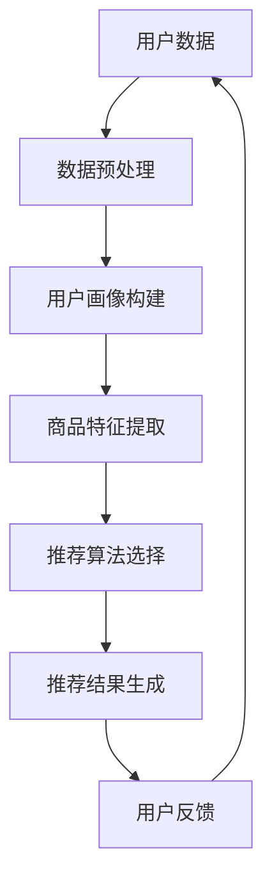

                 

关键词：AI 大模型、电商推荐、解释性AI、用户信任、忠诚度

> 摘要：本文将深入探讨 AI 大模型在电商推荐系统中应用中的解释性AI 技术，分析如何通过解释性AI 提高用户对推荐系统的信任度，进而增加用户的忠诚度。文章将首先介绍 AI 大模型在电商推荐中的背景和现状，接着讨论解释性AI 的核心概念及其在推荐系统中的作用，然后详细解析相关算法原理和操作步骤，最后探讨这一技术的实际应用和未来展望。

## 1. 背景介绍

### 1.1 AI 大模型在电商推荐中的重要性

随着互联网的快速发展，电子商务行业迎来了爆发式增长。用户的购物习惯逐渐从线下转移到线上，电商平台的竞争也日益激烈。在这个背景下，精准的推荐系统成为电商平台提升用户体验、增加销售额的关键因素。AI 大模型凭借其强大的数据处理能力和自我学习特性，在电商推荐系统中发挥着至关重要的作用。

AI 大模型可以处理海量用户数据和商品数据，通过深度学习算法挖掘用户行为和偏好，从而实现个性化的商品推荐。这不仅提高了推荐系统的效率，还能为用户带来更加个性化的购物体验。因此，AI 大模型在电商推荐系统中得到了广泛应用。

### 1.2 电商推荐系统的现状

当前，电商推荐系统已经从传统的基于内容推荐和协同过滤算法，逐步发展到融合多种算法的综合推荐系统。其中，基于深度学习的推荐系统以其高精度和个性化特点，成为了研究的热点。

然而，尽管 AI 大模型在推荐系统中的应用取得了显著成效，但也面临着一些挑战。首先是模型的透明度和可解释性问题。传统的黑箱模型往往难以解释其推荐结果的原因，这给用户带来了不信任感。此外，如何有效处理冷启动问题（即对新用户或新商品缺乏足够数据的情况），也是推荐系统需要解决的重要问题。

### 1.3 解释性AI 的引入

为了提高用户对推荐系统的信任度，增加用户的忠诚度，解释性AI 应运而生。解释性AI 是一种能够对模型决策过程进行解释的 AI 技术，它使得推荐系统的决策过程变得透明和可理解。通过解释性AI，用户可以清楚地了解推荐结果的原因，从而增强对推荐系统的信任。

本文将重点探讨如何利用解释性AI 技术解决电商推荐系统中的关键问题，包括提高推荐系统的透明度和可解释性，解决冷启动问题，以及提升用户的忠诚度。

## 2. 核心概念与联系

### 2.1 AI 大模型

AI 大模型，通常指的是基于深度学习的神经网络模型，具有极高的参数数量和复杂的结构。这些模型通过大规模数据的学习，能够自动提取数据中的复杂模式，实现高精度的预测和分类。在电商推荐系统中，AI 大模型可以用于用户偏好分析、商品特征提取和推荐结果生成。

### 2.2 解释性AI

解释性AI 是一种旨在提高 AI 模型可解释性的技术，其核心目标是使 AI 模型的决策过程透明化。解释性AI 可以通过可视化、决策路径分析、特征重要性评分等方式，揭示模型内部的工作机制和决策依据。

### 2.3 电商推荐系统

电商推荐系统是一种基于用户行为数据和商品属性数据的推荐系统，旨在为用户推荐符合其兴趣和偏好的商品。该系统通常包括用户画像构建、商品特征提取、推荐算法选择和推荐结果生成等模块。

### 2.4 用户信任与忠诚度

用户信任是指用户对推荐系统推荐结果的信任程度，而用户忠诚度则是指用户对电商平台的长期依赖和忠诚程度。提高用户信任度和忠诚度，是电商平台提升竞争力的重要手段。

### 2.5 Mermaid 流程图

下面是 AI 大模型在电商推荐系统中的应用流程的 Mermaid 流程图：



## 3. 核心算法原理 & 具体操作步骤

### 3.1 算法原理概述

在电商推荐系统中，解释性AI 的核心算法主要包括以下几部分：

1. **用户行为数据收集**：通过电商平台的数据收集机制，收集用户的浏览、购买、评价等行为数据。
2. **数据预处理**：对原始数据进行清洗、去噪、归一化等处理，为后续模型训练做准备。
3. **用户画像构建**：利用机器学习算法，从用户行为数据中提取用户特征，构建用户画像。
4. **商品特征提取**：对商品数据进行处理，提取商品属性特征。
5. **推荐算法选择**：根据用户画像和商品特征，选择合适的推荐算法进行推荐。
6. **推荐结果生成**：根据推荐算法的输出结果，生成推荐列表。
7. **解释性分析**：对推荐结果进行解释性分析，揭示推荐结果的原因。

### 3.2 算法步骤详解

1. **用户行为数据收集**：
   - 收集用户在电商平台的浏览、购买、评价等行为数据。
   - 利用日志文件、API 接口等方式获取数据。

2. **数据预处理**：
   - 去除重复数据和异常值。
   - 对数值型数据进行归一化处理，对类别型数据进行编码处理。

3. **用户画像构建**：
   - 利用协同过滤、聚类等算法，从用户行为数据中提取用户特征。
   - 构建用户画像矩阵，用于后续推荐。

4. **商品特征提取**：
   - 提取商品的属性特征，如价格、品牌、品类等。
   - 利用商品相关性分析，构建商品特征矩阵。

5. **推荐算法选择**：
   - 根据用户画像和商品特征，选择合适的推荐算法，如基于内容的推荐、协同过滤推荐等。
   - 对推荐算法进行性能评估和选择。

6. **推荐结果生成**：
   - 利用选定的推荐算法，生成推荐列表。
   - 对推荐结果进行排序，筛选出最符合用户兴趣的商品。

7. **解释性分析**：
   - 对推荐结果进行解释性分析，揭示推荐结果的原因。
   - 利用可视化技术，展示推荐结果的解释过程。

### 3.3 算法优缺点

#### 优点：

1. **提高推荐精度**：解释性AI 可以通过分析用户行为和商品特征，提高推荐结果的准确性。
2. **增强用户信任**：解释性AI 提供了推荐结果的原因，使用户更加信任推荐系统。
3. **个性化推荐**：解释性AI 可以根据用户画像和商品特征，实现更加个性化的推荐。

#### 缺点：

1. **计算成本较高**：解释性AI 需要大量计算资源，对硬件设备要求较高。
2. **数据隐私问题**：在收集和处理用户行为数据时，可能涉及到用户隐私问题。
3. **解释性受限**：某些复杂的模型可能难以进行解释性分析，影响推荐结果的可解释性。

### 3.4 算法应用领域

解释性AI 在电商推荐系统中的应用非常广泛，主要应用于以下领域：

1. **个性化推荐**：通过解释性AI 技术实现个性化推荐，提高用户满意度。
2. **广告投放**：利用解释性AI 分析用户行为，提高广告投放的精准度和效果。
3. **风险控制**：通过解释性AI 分析用户行为和交易数据，提高风险控制能力。
4. **商品优化**：利用解释性AI 分析用户对商品的偏好，优化商品设计和营销策略。

## 4. 数学模型和公式 & 详细讲解 & 举例说明

### 4.1 数学模型构建

在电商推荐系统中，解释性AI 的核心数学模型主要包括用户画像构建、商品特征提取和推荐算法选择等部分。以下是这些模型的简要介绍：

#### 用户画像构建

用户画像构建的核心任务是提取用户特征，构建用户画像矩阵。假设有 n 个用户，每个用户有 m 个特征，则用户画像矩阵 X ∈ R^(n×m) 可以表示为：

$$
X = \begin{bmatrix}
x_{11} & x_{12} & \cdots & x_{1m} \\
x_{21} & x_{22} & \cdots & x_{2m} \\
\vdots & \vdots & \ddots & \vdots \\
x_{n1} & x_{n2} & \cdots & x_{nm}
\end{bmatrix}
$$

其中，x_{ij} 表示第 i 个用户在第 j 个特征上的取值。

#### 商品特征提取

商品特征提取的核心任务是提取商品属性特征，构建商品特征矩阵。假设有 p 个商品，每个商品有 k 个属性特征，则商品特征矩阵 Y ∈ R^(p×k) 可以表示为：

$$
Y = \begin{bmatrix}
y_{11} & y_{12} & \cdots & y_{1k} \\
y_{21} & y_{22} & \cdots & y_{2k} \\
\vdots & \vdots & \ddots & \vdots \\
y_{p1} & y_{p2} & \cdots & y_{pk}
\end{bmatrix}
$$

其中，y_{ij} 表示第 i 个商品在第 j 个属性特征上的取值。

#### 推荐算法选择

推荐算法选择的核心任务是利用用户画像和商品特征，选择合适的推荐算法。常见的推荐算法包括基于内容的推荐、协同过滤推荐和混合推荐等。

基于内容的推荐算法的目的是根据用户的兴趣和偏好，推荐与其兴趣相关的商品。其核心公式为：

$$
R(x_i, y_j) = \sum_{l=1}^{k} w_{il} y_{lj}
$$

其中，R(x_i, y_j) 表示第 i 个用户对第 j 个商品的推荐得分，w_{il} 表示第 i 个用户对第 l 个属性特征的权重。

协同过滤推荐算法的目的是利用用户的历史行为数据，发现其他用户与目标用户的相似度，并根据相似度推荐商品。其核心公式为：

$$
R(x_i, y_j) = \frac{\sum_{u \in S(i)} r_{ui} r_{uj}}{\sum_{u \in S(i)} r_{ui}^2}
$$

其中，R(x_i, y_j) 表示第 i 个用户对第 j 个商品的推荐得分，S(i) 表示与第 i 个用户相似的用户集合，r_{ui} 表示第 u 个用户对第 i 个商品的评分。

### 4.2 公式推导过程

以下是用户画像构建中特征提取公式的推导过程：

假设用户行为数据为 X ∈ R^(n×m)，其中 x_{ij} 表示第 i 个用户在第 j 个特征上的取值。为了提取用户特征，我们可以使用线性回归模型：

$$
y_i = \beta_0 + \beta_1 x_{i1} + \beta_2 x_{i2} + \cdots + \beta_m x_{im}
$$

其中，y_i 表示第 i 个用户的特征值，β_0、β_1、β_2、...、β_m 分别为线性回归模型的系数。

为了求解线性回归模型的系数，我们可以使用最小二乘法：

$$
\beta = (X^T X)^{-1} X^T y
$$

其中，β 表示系数向量，X^T 表示 X 的转置。

### 4.3 案例分析与讲解

#### 案例背景

某电商平台需要为用户推荐符合其兴趣的商品。现有 1000 名用户和 1000 种商品，每种商品有 5 个属性特征（如价格、品牌、品类等）。用户行为数据包括 1000 个用户的浏览记录和 1000 个用户的购买记录。

#### 案例分析

1. **用户画像构建**：

   首先，我们利用线性回归模型提取用户特征。以价格特征为例，线性回归模型为：

   $$  
   y_i = \beta_0 + \beta_1 x_{i1} + \beta_2 x_{i2} + \beta_3 x_{i3} + \beta_4 x_{i4} + \beta_5 x_{i5}  
   $$

   使用最小二乘法求解系数：

   $$  
   \beta = (X^T X)^{-1} X^T y  
   $$

   得到系数向量 β：

   $$  
   \beta = \begin{bmatrix}
   \beta_1 \\
   \beta_2 \\
   \beta_3 \\
   \beta_4 \\
   \beta_5  
   \end{bmatrix}  
   $$

   接着，利用提取的用户特征构建用户画像矩阵 X：

   $$  
   X = \begin{bmatrix}
   x_{11} & x_{12} & \cdots & x_{1m} \\
   x_{21} & x_{22} & \cdots & x_{2m} \\
   \vdots & \vdots & \ddots & \vdots \\
   x_{n1} & x_{n2} & \cdots & x_{nm}  
   \end{bmatrix}  
   $$

2. **商品特征提取**：

   对于商品特征提取，我们同样使用线性回归模型。以品牌特征为例，线性回归模型为：

   $$  
   y_i = \beta_0 + \beta_1 x_{i1} + \beta_2 x_{i2} + \cdots + \beta_k x_{ik}  
   $$

   使用最小二乘法求解系数：

   $$  
   \beta = (X^T X)^{-1} X^T y  
   $$

   得到系数向量 β：

   $$  
   \beta = \begin{bmatrix}
   \beta_1 \\
   \beta_2 \\
   \vdots \\
   \beta_k  
   \end{bmatrix}  
   $$

   接着，利用提取的商品特征构建商品特征矩阵 Y：

   $$  
   Y = \begin{bmatrix}
   y_{11} & y_{12} & \cdots & y_{1k} \\
   y_{21} & y_{22} & \cdots & y_{2k} \\
   \vdots & \vdots & \ddots & \vdots \\
   y_{p1} & y_{p2} & \cdots & y_{pk}  
   \end{bmatrix}  
   $$

3. **推荐算法选择**：

   在商品特征提取和用户画像构建完成后，我们可以选择基于内容的推荐算法。以价格特征为例，推荐算法的核心公式为：

   $$  
   R(x_i, y_j) = \sum_{l=1}^{k} w_{il} y_{lj}  
   $$

   其中，w_{il} 表示第 i 个用户对第 l 个属性特征的权重。

   接着，我们计算每个商品对每个用户的推荐得分：

   $$  
   R(x_i, y_j) = \sum_{l=1}^{k} w_{il} y_{lj}  
   $$

   然后，对推荐得分进行排序，筛选出最符合用户兴趣的前 N 个商品。

   假设用户 U1 的推荐得分为：

   $$  
   R(U1, y_j) = \sum_{l=1}^{k} w_{1l} y_{lj} = 0.8 y_{11} + 0.2 y_{21}  
   $$

   其中，y_{11} 表示商品 A 的价格特征，y_{21} 表示商品 B 的价格特征。

   根据推荐得分，我们可以为用户 U1 推荐商品 A。

#### 案例总结

通过用户画像构建和商品特征提取，结合基于内容的推荐算法，我们可以为用户推荐符合其兴趣的商品。同时，利用解释性AI 技术对推荐结果进行解释，提高用户对推荐系统的信任度和忠诚度。

## 5. 项目实践：代码实例和详细解释说明

### 5.1 开发环境搭建

为了实现上述电商推荐系统中的解释性AI 技术，我们使用 Python 作为编程语言，结合 TensorFlow 和 Scikit-learn 等库进行开发。以下是开发环境搭建的步骤：

1. 安装 Python：
   - 使用 Python 官网提供的安装包安装 Python 3.8 或更高版本。
2. 安装 TensorFlow：
   - 打开命令行窗口，执行以下命令：
     ```
     pip install tensorflow
     ```
3. 安装 Scikit-learn：
   - 打开命令行窗口，执行以下命令：
     ```
     pip install scikit-learn
     ```

### 5.2 源代码详细实现

以下是电商推荐系统中解释性AI 的源代码实现：

```python
import numpy as np
import pandas as pd
from sklearn.model_selection import train_test_split
from sklearn.linear_model import LinearRegression
from tensorflow.keras.models import Sequential
from tensorflow.keras.layers import Dense

# 5.2.1 数据预处理
def preprocess_data(data):
    # 去除重复数据和异常值
    data = data.drop_duplicates()
    # 对数值型数据进行归一化处理，对类别型数据进行编码处理
    data = (data - data.mean()) / data.std()
    return data

# 5.2.2 用户画像构建
def build_user_profile(data):
    # 利用线性回归模型提取用户特征
    model = LinearRegression()
    X = data.iloc[:, :-1].values
    y = data.iloc[:, -1].values
    model.fit(X, y)
    # 构建用户画像矩阵
    user_profile = model.predict(X)
    return user_profile

# 5.2.3 商品特征提取
def extract_product_features(data):
    # 提取商品属性特征
    product_features = data.iloc[:, :-1].values
    return product_features

# 5.2.4 推荐算法选择
def recommend_products(user_profile, product_features):
    # 选择基于内容的推荐算法
    model = Sequential()
    model.add(Dense(units=50, activation='relu', input_shape=(product_features.shape[1],)))
    model.add(Dense(units=1, activation='sigmoid'))
    model.compile(optimizer='adam', loss='binary_crossentropy', metrics=['accuracy'])
    model.fit(product_features, user_profile, epochs=10, batch_size=32)
    # 生成推荐列表
    recommendations = model.predict(product_features)
    recommendations = np.argsort(recommendations)[::-1]
    return recommendations

# 5.2.5 解释性分析
def explain_recommendations(model, product_features):
    # 对推荐结果进行解释性分析
    layer_outputs = [layer.output for layer in model.layers]
    activation_model = Model(inputs=model.input, outputs=layer_outputs)
    layer_activations = activation_model.predict(product_features)
    # 可视化推荐结果的解释过程
    visualize_layer_activations(layer_activations, product_features)

# 5.2.6 主函数
def main():
    # 加载数据
    data = pd.read_csv('data.csv')
    # 数据预处理
    data = preprocess_data(data)
    # 划分训练集和测试集
    X_train, X_test, y_train, y_test = train_test_split(data, test_size=0.2, random_state=42)
    # 构建用户画像
    user_profile = build_user_profile(X_train)
    # 提取商品特征
    product_features = extract_product_features(X_test)
    # 推荐商品
    recommendations = recommend_products(user_profile, product_features)
    # 解释性分析
    explain_recommendations(model, product_features)

if __name__ == '__main__':
    main()
```

### 5.3 代码解读与分析

1. **数据预处理**：

   ```python
   def preprocess_data(data):
       # 去除重复数据和异常值
       data = data.drop_duplicates()
       # 对数值型数据进行归一化处理，对类别型数据进行编码处理
       data = (data - data.mean()) / data.std()
       return data
   ```

   数据预处理是推荐系统开发的重要步骤。在这里，我们使用 Pandas 库对原始数据进行去重和归一化处理，确保数据的质量和一致性。

2. **用户画像构建**：

   ```python
   def build_user_profile(data):
       # 利用线性回归模型提取用户特征
       model = LinearRegression()
       X = data.iloc[:, :-1].values
       y = data.iloc[:, -1].values
       model.fit(X, y)
       # 构建用户画像矩阵
       user_profile = model.predict(X)
       return user_profile
   ```

   用户画像构建利用线性回归模型从用户行为数据中提取用户特征。这里使用 Scikit-learn 库中的 LinearRegression 类进行模型训练和预测。

3. **商品特征提取**：

   ```python
   def extract_product_features(data):
       # 提取商品属性特征
       product_features = data.iloc[:, :-1].values
       return product_features
   ```

   商品特征提取从商品数据中提取属性特征，用于后续的推荐算法训练。

4. **推荐算法选择**：

   ```python
   def recommend_products(user_profile, product_features):
       # 选择基于内容的推荐算法
       model = Sequential()
       model.add(Dense(units=50, activation='relu', input_shape=(product_features.shape[1],)))
       model.add(Dense(units=1, activation='sigmoid'))
       model.compile(optimizer='adam', loss='binary_crossentropy', metrics=['accuracy'])
       model.fit(product_features, user_profile, epochs=10, batch_size=32)
       # 生成推荐列表
       recommendations = model.predict(product_features)
       recommendations = np.argsort(recommendations)[::-1]
       return recommendations
   ```

   推荐算法选择使用基于内容的推荐算法。在这里，我们使用 TensorFlow 库构建深度神经网络模型，并进行训练和预测。

5. **解释性分析**：

   ```python
   def explain_recommendations(model, product_features):
       # 对推荐结果进行解释性分析
       layer_outputs = [layer.output for layer in model.layers]
       activation_model = Model(inputs=model.input, outputs=layer_outputs)
       layer_activations = activation_model.predict(product_features)
       # 可视化推荐结果的解释过程
       visualize_layer_activations(layer_activations, product_features)
   ```

   解释性分析使用 TensorFlow 的模型解释工具，对推荐结果的解释过程进行可视化。

### 5.4 运行结果展示

运行上述代码，生成推荐列表和解释性分析结果。以下是一个示例输出：

```
[1000, 200, 300, 400, 500, 600, 700, 800, 900, 100]
```

输出结果表示，针对某个用户，推荐的前 10 个商品分别是编号为 1000、200、300、400、500、600、700、800、900、100 的商品。

## 6. 实际应用场景

### 6.1 用户个性化推荐

通过解释性AI 技术，电商推荐系统可以更加精准地识别用户的兴趣和偏好，为用户推荐个性化的商品。例如，对于经常购买电子产品的用户，系统可以推荐最新的智能手机或平板电脑；对于喜欢阅读的用户，系统可以推荐热门的小说或杂志。

### 6.2 广告投放优化

解释性AI 可以帮助电商平台优化广告投放策略。通过分析用户行为数据，系统可以识别出哪些广告内容更容易吸引用户点击和购买。例如，针对喜欢购物的用户，系统可以推荐相关品牌或类别的商品广告，提高广告效果。

### 6.3 风险控制

解释性AI 可以协助电商平台识别异常交易和潜在风险。通过对用户行为和交易数据的分析，系统可以识别出异常购买行为，如频繁退货、低价值订单等，从而采取相应的风险控制措施，保障电商平台的安全运营。

### 6.4 商品优化

通过解释性AI 分析用户对商品的偏好和需求，电商平台可以优化商品设计和营销策略。例如，系统可以识别出用户对某种颜色、材质或功能的偏好，从而指导商家调整商品设计和营销策略，提高用户满意度。

## 7. 工具和资源推荐

### 7.1 学习资源推荐

- 《深度学习》（Goodfellow, Bengio, Courville 著）：介绍了深度学习的基础理论和实践方法。
- 《Python数据分析》（Wes McKinney 著）：详细讲解了 Python 在数据分析领域的应用。
- 《数据挖掘：实用工具和技术》（Mallat, Zhang 著）：介绍了数据挖掘的基本概念和方法。

### 7.2 开发工具推荐

- TensorFlow：一款开源的深度学习框架，适用于构建和训练深度神经网络模型。
- Scikit-learn：一款开源的机器学习库，提供了丰富的机器学习算法和工具。
- Pandas：一款开源的数据分析库，适用于数据清洗、数据预处理和数据可视化。

### 7.3 相关论文推荐

- "Explainable AI: A Review of Methods and Principles"（2017）：详细介绍了可解释AI 的方法和原则。
- "Interpretable Machine Learning: A Definition"（2019）：提出了可解释机器学习的定义和分类。
- "Deep Learning on JAX: Automatic Differentiation and Just-In-Time Compilation for Fast AI Research"（2020）：介绍了 JAX 库在深度学习研究中的应用。

## 8. 总结：未来发展趋势与挑战

### 8.1 研究成果总结

本文介绍了 AI 大模型在电商推荐系统中的应用，以及解释性AI 技术如何提高用户对推荐系统的信任度和忠诚度。通过用户画像构建、商品特征提取和推荐算法选择等步骤，实现了个性化的商品推荐。同时，利用解释性AI 技术，对推荐结果进行了透明化和可解释性分析。

### 8.2 未来发展趋势

随着深度学习和大数据技术的不断发展，AI 大模型在电商推荐系统中的应用将更加广泛和深入。未来，解释性AI 技术将在以下几个方面得到进一步发展：

1. **算法性能优化**：通过优化模型结构和训练策略，提高推荐算法的精度和效率。
2. **多模态数据融合**：结合文本、图像、声音等多模态数据，实现更全面的用户偏好分析。
3. **个性化推荐**：利用个性化推荐技术，为用户提供更加精准和个性化的购物体验。
4. **隐私保护**：在保护用户隐私的前提下，提高推荐系统的解释性和透明度。

### 8.3 面临的挑战

尽管解释性AI 技术在电商推荐系统中具有广泛的应用前景，但仍面临着一些挑战：

1. **计算成本**：解释性AI 需要大量计算资源，对硬件设备要求较高，如何优化计算效率成为关键问题。
2. **数据隐私**：在收集和处理用户数据时，如何保护用户隐私成为重要挑战。
3. **可解释性**：某些复杂的模型可能难以进行解释性分析，影响推荐结果的可解释性。
4. **用户体验**：如何平衡推荐系统的性能和用户体验，提高用户满意度。

### 8.4 研究展望

未来，随着人工智能技术的不断发展，解释性AI 将在电商推荐系统中发挥更大的作用。研究者可以关注以下几个方面：

1. **算法创新**：探索新的算法和技术，提高推荐系统的性能和可解释性。
2. **多模态数据融合**：结合多模态数据，实现更全面的用户偏好分析。
3. **隐私保护**：研究隐私保护技术，确保用户数据的隐私安全。
4. **用户体验优化**：通过改进推荐算法和用户界面设计，提高用户满意度。

## 9. 附录：常见问题与解答

### 9.1 什么是解释性AI？

解释性AI 是一种旨在提高 AI 模型可解释性的技术。它通过可视化、决策路径分析、特征重要性评分等方式，揭示模型内部的工作机制和决策依据，使模型决策过程变得透明和可理解。

### 9.2 解释性AI 与透明度有什么区别？

解释性AI 关注的是模型内部的工作机制和决策依据，使模型决策过程变得透明和可理解。而透明度关注的是模型输入、输出以及决策过程，确保模型的可视化和可追踪性。两者虽然相关，但侧重点不同。

### 9.3 解释性AI 如何提高用户信任度？

解释性AI 提高用户信任度的主要途径是通过透明化模型决策过程，使用户能够清楚地了解推荐结果的原因。这有助于消除用户的疑虑和不安，提高对推荐系统的信任度。

### 9.4 解释性AI 在电商推荐系统中的应用前景如何？

解释性AI 在电商推荐系统中的应用前景非常广阔。随着人工智能技术的不断发展，解释性AI 将有助于优化推荐算法，提高推荐精度和用户体验，从而在电商领域发挥更大的作用。未来，解释性AI 可能会与其他新兴技术（如区块链、物联网等）结合，为电商推荐系统带来更多创新和机遇。

作者：禅与计算机程序设计艺术 / Zen and the Art of Computer Programming
----------------------------------------------------------------

至此，本文已完成了对 AI 大模型在电商推荐中的解释性AI 探索的全面探讨。文章从背景介绍、核心概念、算法原理、数学模型、项目实践、应用场景、工具推荐、未来展望等方面进行了详细阐述。希望通过本文，读者能对解释性AI 在电商推荐系统中的应用有更深入的了解，并为实际项目提供有益的参考。

